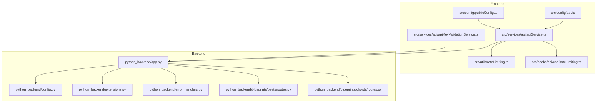
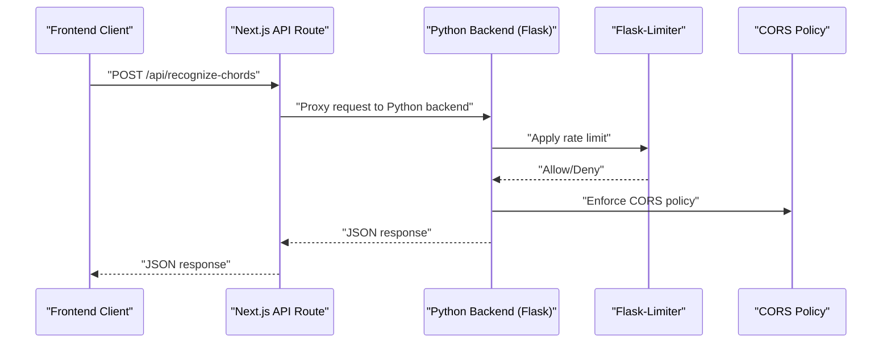
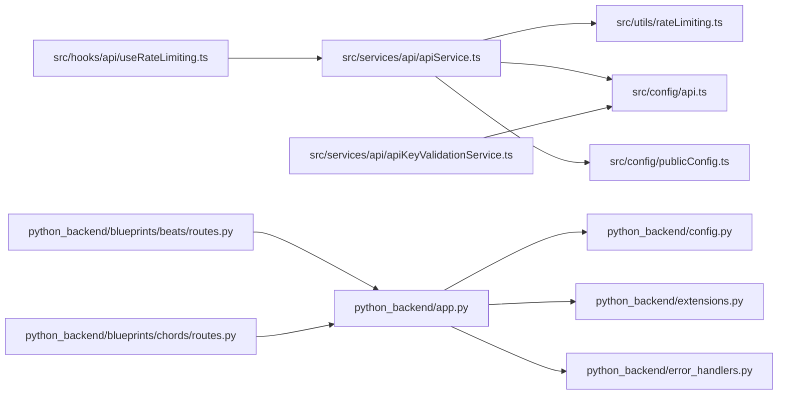

# API Integration Guide

<cite>
**Referenced Files in This Document**
- [src/config/api.ts](file://src/config/api.ts)
- [src/services/api/apiService.ts](file://src/services/api/apiService.ts)
- [src/utils/rateLimiting.ts](file://src/utils/rateLimiting.ts)
- [src/hooks/api/useRateLimiting.ts](file://src/hooks/api/useRateLimiting.ts)
- [src/services/api/apiKeyValidationService.ts](file://src/services/api/apiKeyValidationService.ts)
- [src/config/serverBackend.ts](file://src/config/serverBackend.ts)
- [src/config/publicConfig.ts](file://src/config/publicConfig.ts)
- [src/types/apiKeyTypes.ts](file://src/types/apiKeyTypes.ts)
- [python_backend/app.py](file://python_backend/app.py)
- [python_backend/config.py](file://python_backend/config.py)
- [python_backend/extensions.py](file://python_backend/extensions.py)
- [python_backend/blueprints/beats/routes.py](file://python_backend/blueprints/beats/routes.py)
- [python_backend/blueprints/chords/routes.py](file://python_backend/blueprints/chords/routes.py)
- [python_backend/error_handlers.py](file://python_backend/error_handlers.py)
</cite>

## Table of Contents
1. [Introduction](#introduction)
2. [Project Structure](#project-structure)
3. [Core Components](#core-components)
4. [Architecture Overview](#architecture-overview)
5. [Detailed Component Analysis](#detailed-component-analysis)
6. [Dependency Analysis](#dependency-analysis)
7. [Performance Considerations](#performance-considerations)
8. [Troubleshooting Guide](#troubleshooting-guide)
9. [Conclusion](#conclusion)
10. [Appendices](#appendices)

## Introduction
This guide documents how to integrate with the ChordMiniApp API from the frontend, covering client configuration, error handling, rate limiting, authentication headers, CORS, proxy behavior, and production best practices. It also provides step-by-step integration examples for common scenarios such as beat detection, chord recognition, and lyrics synchronization, along with security considerations for API key validation and rotation.

## Project Structure
The API integration spans two primary areas:
- Frontend (Next.js) services and utilities that orchestrate requests, enforce client-side rate limits, and manage API keys.
- Python backend (Flask) that exposes ML endpoints, enforces server-side rate limits, and handles CORS and error responses.

**Diagram sources**
- [src/config/api.ts:1-158](file://src/config/api.ts#L1-L158)
- [src/services/api/apiService.ts:1-407](file://src/services/api/apiService.ts#L1-L407)
- [src/utils/rateLimiting.ts:1-266](file://src/utils/rateLimiting.ts#L1-L266)
- [src/hooks/api/useRateLimiting.ts:1-322](file://src/hooks/api/useRateLimiting.ts#L1-L322)
- [src/services/api/apiKeyValidationService.ts:1-300](file://src/services/api/apiKeyValidationService.ts#L1-L300)
- [src/config/publicConfig.ts:1-218](file://src/config/publicConfig.ts#L1-L218)
- [python_backend/app.py:1-186](file://python_backend/app.py#L1-L186)
- [python_backend/config.py:1-215](file://python_backend/config.py#L1-L215)
- [python_backend/extensions.py:1-93](file://python_backend/extensions.py#L1-L93)
- [python_backend/error_handlers.py:1-161](file://python_backend/error_handlers.py#L1-L161)
- [python_backend/blueprints/beats/routes.py:1-521](file://python_backend/blueprints/beats/routes.py#L1-L521)
- [python_backend/blueprints/chords/routes.py:1-440](file://python_backend/blueprints/chords/routes.py#L1-L440)

**Section sources**
- [src/config/api.ts:1-158](file://src/config/api.ts#L1-L158)
- [src/services/api/apiService.ts:1-407](file://src/services/api/apiService.ts#L1-L407)
- [python_backend/app.py:1-186](file://python_backend/app.py#L1-L186)

## Core Components
- Frontend API configuration and routing: centralized endpoint definitions and routing logic.
- Enhanced API service with client-side rate limiting, timeouts, retries, and robust error handling.
- Client-side rate limiting utilities with exponential backoff and jitter.
- React hook for rate-limit-aware API calls and status monitoring.
- API key validation service for external services with caching and quota awareness.
- Backend Flask app with CORS, rate limiting via Flask-Limiter, and standardized error responses.
- Beat and chord recognition endpoints with model availability and size limits.

**Section sources**
- [src/config/api.ts:27-70](file://src/config/api.ts#L27-L70)
- [src/services/api/apiService.ts:29-402](file://src/services/api/apiService.ts#L29-L402)
- [src/utils/rateLimiting.ts:207-266](file://src/utils/rateLimiting.ts#L207-L266)
- [src/hooks/api/useRateLimiting.ts:20-144](file://src/hooks/api/useRateLimiting.ts#L20-L144)
- [src/services/api/apiKeyValidationService.ts:15-299](file://src/services/api/apiKeyValidationService.ts#L15-L299)
- [python_backend/config.py:47-103](file://python_backend/config.py#L47-L103)
- [python_backend/extensions.py:41-93](file://python_backend/extensions.py#L41-L93)
- [python_backend/blueprints/beats/routes.py:40-120](file://python_backend/blueprints/beats/routes.py#L40-L120)
- [python_backend/blueprints/chords/routes.py:43-144](file://python_backend/blueprints/chords/routes.py#L43-L144)

## Architecture Overview
The frontend integrates with the backend through Next.js API routes that proxy to the Python backend. The frontend sets appropriate headers, attaches App Check tokens when available, and applies client-side rate limiting and retries. The backend enforces server-side rate limits, validates requests, and returns structured JSON responses.

**Diagram sources**
- [src/services/api/apiService.ts:300-343](file://src/services/api/apiService.ts#L300-L343)
- [python_backend/extensions.py:41-93](file://python_backend/extensions.py#L41-L93)
- [python_backend/config.py:47-103](file://python_backend/config.py#L47-L103)

## Detailed Component Analysis

### Frontend API Configuration and Routing
- Centralized endpoint routing and URL determination.
- Automatic routing to external backend when applicable.
- Default fetch options and CORS mode for cross-origin requests.

Key behaviors:
- Endpoint selection via a single source of truth.
- External backend detection based on URL inclusion.
- Consistent headers and CORS mode for external requests.

**Section sources**
- [src/config/api.ts:27-125](file://src/config/api.ts#L27-L125)

### Enhanced API Service with Rate Limiting and Retries
- Client-side rate limiter to prevent excessive requests.
- Timeout management with AbortController and detailed logging.
- Retry logic with exponential backoff and jitter for transient failures.
- Structured response handling with typed ApiResponse.
- App Check token injection for request attestation.

Important defaults and overrides:
- Default timeout is 2 minutes; ML endpoints override to 13+ minutes.
- Heavy operations disable retries to avoid double processing.
- Client-side rate limit: 4 requests per minute per endpoint key.

**Section sources**
- [src/services/api/apiService.ts:29-402](file://src/services/api/apiService.ts#L29-L402)

### Client-Side Rate Limiting Utilities
- Exponential backoff with jitter and configurable max attempts.
- ClientRateLimiter to throttle requests per endpoint key within a sliding window.
- Parsing of rate limit headers and friendly messages.

**Section sources**
- [src/utils/rateLimiting.ts:59-115](file://src/utils/rateLimiting.ts#L59-L115)
- [src/utils/rateLimiting.ts:207-266](file://src/utils/rateLimiting.ts#L207-L266)

### React Hook for Rate-Limited API Calls
- Provides rate limit state and auto-retry logic.
- Wraps API calls to surface rate limit errors and retry-after timing.
- Status monitoring hook to probe backend endpoints and detect cold starts.

**Section sources**
- [src/hooks/api/useRateLimiting.ts:20-144](file://src/hooks/api/useRateLimiting.ts#L20-L144)
- [src/hooks/api/useRateLimiting.ts:149-322](file://src/hooks/api/useRateLimiting.ts#L149-L322)

### API Key Validation and Security
- Validates external service keys via frontend routes that proxy to backend.
- Caches validation results with expiration.
- Tracks quota usage for services like Gemini and exposes thresholds.
- Requires user keys for certain services depending on environment.

Security considerations:
- Keys are validated server-side through frontend routes.
- Encryption metadata for secure storage is modeled in types.
- Requires user keys for production where applicable.

**Section sources**
- [src/services/api/apiKeyValidationService.ts:15-299](file://src/services/api/apiKeyValidationService.ts#L15-L299)
- [src/types/apiKeyTypes.ts:64-110](file://src/types/apiKeyTypes.ts#L64-L110)

### Backend Configuration and Rate Limiting
- Centralized rate limits per endpoint category.
- CORS origins configured with environment overrides.
- Flask-Limiter initialized with Redis or in-memory storage.
- Standardized error responses for common HTTP statuses.

**Section sources**
- [python_backend/config.py:47-144](file://python_backend/config.py#L47-L144)
- [python_backend/extensions.py:41-93](file://python_backend/extensions.py#L41-L93)
- [python_backend/error_handlers.py:13-93](file://python_backend/error_handlers.py#L13-L93)

### Beat Detection Endpoint
- Validates request parameters and file sizes.
- Supports multiple detectors and forced processing for large files.
- Returns structured results or error responses.

**Section sources**
- [python_backend/blueprints/beats/routes.py:40-120](file://python_backend/blueprints/beats/routes.py#L40-L120)

### Chord Recognition Endpoint
- Supports multiple models and optional audio separation.
- Validates file size and handles remote audio downloads.
- Returns model information and availability.

**Section sources**
- [python_backend/blueprints/chords/routes.py:43-144](file://python_backend/blueprints/chords/routes.py#L43-L144)

### Authentication Headers and App Check
- Frontend injects X-Firebase-AppCheck header when available.
- Backend routes can leverage App Check for request attestation.

**Section sources**
- [src/services/api/apiService.ts:106-121](file://src/services/api/apiService.ts#L106-L121)

### CORS Configuration
- Origins include development, Docker, and Vercel domains.
- Supports custom origins via environment variable.
- Credentials support enabled.

**Section sources**
- [python_backend/config.py:32-46](file://python_backend/config.py#L32-L46)
- [python_backend/extensions.py:22-38](file://python_backend/extensions.py#L22-L38)

### Proxy Handling and Base URLs
- Runtime resolution of backend URLs via environment variables.
- Frontend determines whether a route is external and adjusts fetch options accordingly.

**Section sources**
- [src/config/serverBackend.ts:23-51](file://src/config/serverBackend.ts#L23-L51)
- [src/config/api.ts:67-70](file://src/config/api.ts#L67-L70)

## Dependency Analysis

**Diagram sources**
- [src/services/api/apiService.ts:1-10](file://src/services/api/apiService.ts#L1-L10)
- [src/utils/rateLimiting.ts:1-10](file://src/utils/rateLimiting.ts#L1-L10)
- [src/config/api.ts:13](file://src/config/api.ts#L13)
- [src/config/publicConfig.ts:63](file://src/config/publicConfig.ts#L63)
- [src/hooks/api/useRateLimiting.ts:6](file://src/hooks/api/useRateLimiting.ts#L6)
- [src/services/api/apiKeyValidationService.ts:12](file://src/services/api/apiKeyValidationService.ts#L12)
- [python_backend/app.py:28](file://python_backend/app.py#L28)
- [python_backend/config.py:16](file://python_backend/config.py#L16)
- [python_backend/extensions.py:17](file://python_backend/extensions.py#L17)
- [python_backend/error_handlers.py:13](file://python_backend/error_handlers.py#L13)
- [python_backend/blueprints/beats/routes.py:12](file://python_backend/blueprints/beats/routes.py#L12)
- [python_backend/blueprints/chords/routes.py:12](file://python_backend/blueprints/chords/routes.py#L12)

**Section sources**
- [src/services/api/apiService.ts:1-407](file://src/services/api/apiService.ts#L1-L407)
- [python_backend/app.py:1-186](file://python_backend/app.py#L1-L186)

## Performance Considerations
- Use client-side rate limiting to avoid overwhelming the backend and triggering server-side throttling.
- Prefer exponential backoff with jitter for retries to reduce thundering herd effects.
- Increase timeouts for heavy ML operations as implemented in the API service.
- Cache API key validations to minimize repeated network calls.
- Monitor cold start behavior and adjust expectations for first-time model loads.

[No sources needed since this section provides general guidance]

## Troubleshooting Guide
Common issues and resolutions:
- Rate limit exceeded (429): Respect retry-after timing or reduce request frequency. The frontend surfaces rate limit errors and retry-after values.
- Timeout errors: Verify timeout configuration and consider reducing audio length or increasing timeout for heavy operations.
- CORS errors: Ensure the origin is included in CORS origins and credentials are handled properly.
- API key invalid or expired: Re-validate keys via the validation service and update stored keys.
- Cold start delays: Expect longer response times for first-time model loads; monitor with the status hook.

**Section sources**
- [src/utils/rateLimiting.ts:48-54](file://src/utils/rateLimiting.ts#L48-L54)
- [src/hooks/api/useRateLimiting.ts:213-234](file://src/hooks/api/useRateLimiting.ts#L213-L234)
- [python_backend/error_handlers.py:48-56](file://python_backend/error_handlers.py#L48-L56)
- [python_backend/config.py:32-46](file://python_backend/config.py#L32-L46)

## Conclusion
The ChordMiniApp API integrates the frontend and backend through a robust configuration and service layer that enforces client-side rate limiting, manages timeouts and retries, and provides structured error handling. The backend adds server-side rate limiting, CORS enforcement, and standardized error responses. By following the integration patterns and best practices outlined here, you can build reliable integrations for beat detection, chord recognition, and lyrics synchronization.

[No sources needed since this section summarizes without analyzing specific files]

## Appendices

### Step-by-Step Integration Examples

- Beat detection
  - Prepare audio file and optional detector selection.
  - Use the API service to POST to the beat detection endpoint with FormData.
  - Handle timeouts and rate limit responses; avoid retries for heavy operations.
  - Reference: [src/services/api/apiService.ts:299-319](file://src/services/api/apiService.ts#L299-L319)

- Chord recognition
  - Select model (default, btc-sl, btc-pl) and optional chord dictionary.
  - POST audio file to the appropriate endpoint; backend validates size and runs recognition.
  - Handle structured results or error responses.
  - Reference: [src/services/api/apiService.ts:324-343](file://src/services/api/apiService.ts#L324-L343)

- Lyrics synchronization
  - Use the lyrics services to fetch synced lyrics from supported providers.
  - Provide artist/title or combined search query as needed.
  - Reference: [src/services/api/apiService.ts:348-384](file://src/services/api/apiService.ts#L348-L384)

### API Key Validation and Rotation
- Validate keys via frontend routes that proxy to backend validation endpoints.
- Cache results to reduce repeated validation calls.
- Rotate keys by updating stored values and re-validating.
- Monitor quota usage for services like Gemini and act on threshold warnings.
- Reference: [src/services/api/apiKeyValidationService.ts:32-140](file://src/services/api/apiKeyValidationService.ts#L32-L140), [src/types/apiKeyTypes.ts:101-104](file://src/types/apiKeyTypes.ts#L101-L104)

### Frontend Configuration and Headers
- Base URLs are resolved at runtime from environment variables.
- App Check token is attached automatically when available.
- CORS mode and credentials are configured for external backend requests.
- Reference: [src/config/serverBackend.ts:23-51](file://src/config/serverBackend.ts#L23-L51), [src/services/api/apiService.ts:106-121](file://src/services/api/apiService.ts#L106-L121), [src/config/api.ts:84-88](file://src/config/api.ts#L84-L88)

### Backend Rate Limits and Error Responses
- Rate limits are categorized by endpoint type and enforced via Flask-Limiter.
- CORS origins include development, Docker, and Vercel domains with environment overrides.
- Standardized JSON error responses for common HTTP statuses.
- Reference: [python_backend/config.py:47-144](file://python_backend/config.py#L47-L144), [python_backend/extensions.py:41-93](file://python_backend/extensions.py#L41-L93), [python_backend/error_handlers.py:13-93](file://python_backend/error_handlers.py#L13-L93)