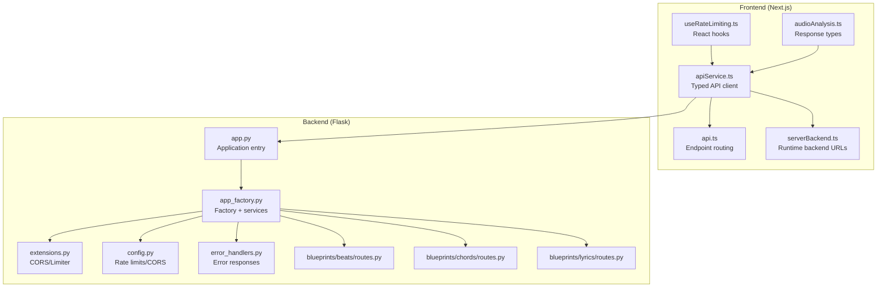
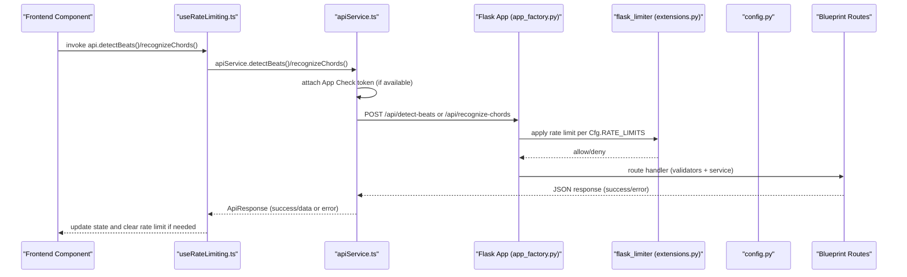
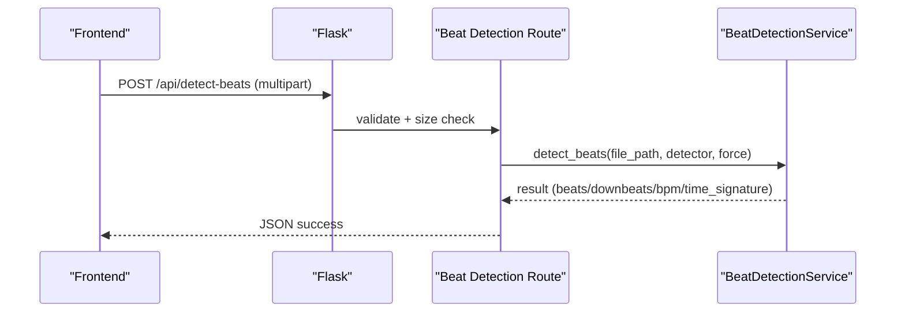
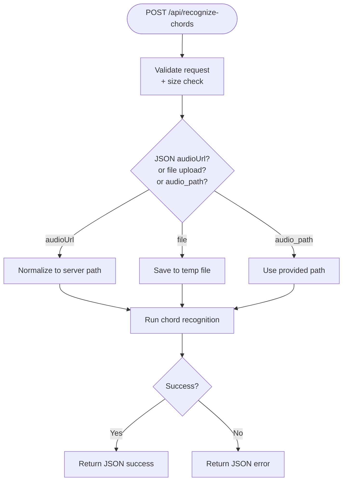
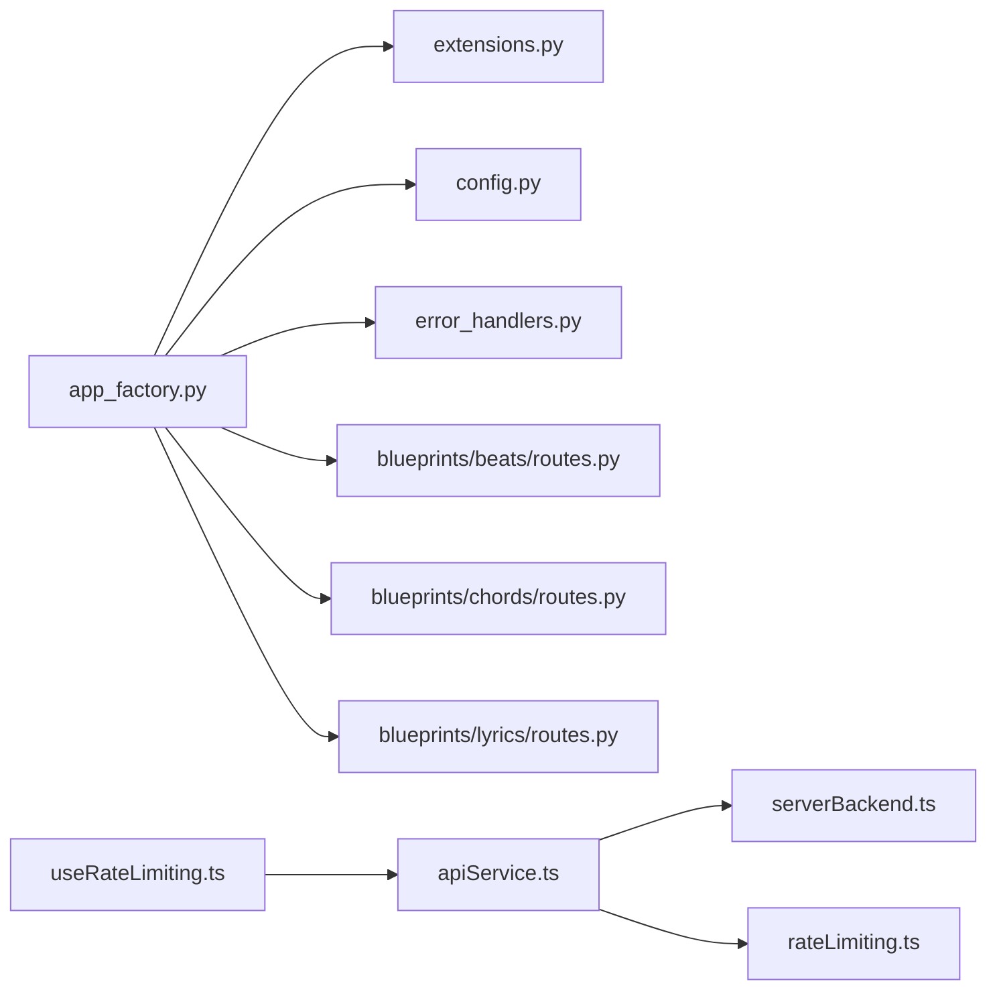

# API Reference

<cite>
**Referenced Files in This Document**
- [app.py](file://python_backend/app.py)
- [app_factory.py](file://python_backend/app_factory.py)
- [extensions.py](file://python_backend/extensions.py)
- [config.py](file://python_backend/config.py)
- [error_handlers.py](file://python_backend/error_handlers.py)
- [routes.py (beats)](file://python_backend/blueprints/beats/routes.py)
- [routes.py (chords)](file://python_backend/blueprints/chords/routes.py)
- [routes.py (lyrics)](file://python_backend/blueprints/lyrics/routes.py)
- [api.ts](file://src/config/api.ts)
- [serverBackend.ts](file://src/config/serverBackend.ts)
- [apiService.ts](file://src/services/api/apiService.ts)
- [useRateLimiting.ts](file://src/hooks/api/useRateLimiting.ts)
- [rateLimiting.ts](file://src/utils/rateLimiting.ts)
- [audioAnalysis.ts](file://src/types/audioAnalysis.ts)
</cite>

## Table of Contents
1. [Introduction](#introduction)
2. [Project Structure](#project-structure)
3. [Core Components](#core-components)
4. [Architecture Overview](#architecture-overview)
5. [Detailed Component Analysis](#detailed-component-analysis)
6. [Dependency Analysis](#dependency-analysis)
7. [Performance Considerations](#performance-considerations)
8. [Troubleshooting Guide](#troubleshooting-guide)
9. [Conclusion](#conclusion)
10. [Appendices](#appendices)

## Introduction
This API Reference documents the backend and frontend interfaces of ChordMiniApp. It covers:
- Backend REST endpoints for beat detection, chord recognition, lyrics retrieval, and health/status.
- Frontend API client, hooks, and service interfaces used by the Next.js application.
- Authentication and rate limiting mechanisms.
- Request/response schemas, parameter validation, error handling, and performance tuning.
- Practical integration examples and debugging/monitoring guidance.

## Project Structure
The API spans two primary layers:
- Backend: Python Flask application exposing ML and auxiliary endpoints.
- Frontend: Next.js application consuming the backend via typed services and hooks.

**Diagram sources**
- [app.py:180-186](file://python_backend/app.py#L180-L186)
- [app_factory.py:27-65](file://python_backend/app_factory.py#L27-L65)
- [extensions.py:17-92](file://python_backend/extensions.py#L17-L92)
- [config.py:16-103](file://python_backend/config.py#L16-L103)
- [error_handlers.py:13-93](file://python_backend/error_handlers.py#L13-L93)
- [routes.py (beats):40-120](file://python_backend/blueprints/beats/routes.py#L40-L120)
- [routes.py (chords):43-143](file://python_backend/blueprints/chords/routes.py#L43-L143)
- [routes.py (lyrics):22-72](file://python_backend/blueprints/lyrics/routes.py#L22-L72)
- [api.ts:27-60](file://src/config/api.ts#L27-L60)
- [serverBackend.ts:23-56](file://src/config/serverBackend.ts#L23-L56)
- [apiService.ts:29-406](file://src/services/api/apiService.ts#L29-L406)
- [useRateLimiting.ts:20-144](file://src/hooks/api/useRateLimiting.ts#L20-L144)
- [audioAnalysis.ts:19-71](file://src/types/audioAnalysis.ts#L19-L71)

**Section sources**
- [app.py:180-186](file://python_backend/app.py#L180-L186)
- [app_factory.py:27-65](file://python_backend/app_factory.py#L27-L65)
- [extensions.py:17-92](file://python_backend/extensions.py#L17-L92)
- [config.py:16-103](file://python_backend/config.py#L16-L103)
- [error_handlers.py:13-93](file://python_backend/error_handlers.py#L13-L93)
- [routes.py (beats):40-120](file://python_backend/blueprints/beats/routes.py#L40-L120)
- [routes.py (chords):43-143](file://python_backend/blueprints/chords/routes.py#L43-L143)
- [routes.py (lyrics):22-72](file://python_backend/blueprints/lyrics/routes.py#L22-L72)
- [api.ts:27-60](file://src/config/api.ts#L27-L60)
- [serverBackend.ts:23-56](file://src/config/serverBackend.ts#L23-L56)
- [apiService.ts:29-406](file://src/services/api/apiService.ts#L29-L406)
- [useRateLimiting.ts:20-144](file://src/hooks/api/useRateLimiting.ts#L20-L144)
- [audioAnalysis.ts:19-71](file://src/types/audioAnalysis.ts#L19-L71)

## Core Components
- Backend Flask app with application factory, extensions, and blueprints.
- Centralized configuration for rate limits, CORS, and feature toggles.
- Typed frontend API client with retry/backoff, client-side rate limiting, and timeout controls.
- React hooks for rate-limit-aware API calls and status monitoring.
- Shared TypeScript types for audio analysis results.

**Section sources**
- [app_factory.py:27-65](file://python_backend/app_factory.py#L27-L65)
- [extensions.py:17-92](file://python_backend/extensions.py#L17-L92)
- [config.py:16-103](file://python_backend/config.py#L16-L103)
- [apiService.ts:29-406](file://src/services/api/apiService.ts#L29-L406)
- [useRateLimiting.ts:20-144](file://src/hooks/api/useRateLimiting.ts#L20-L144)
- [audioAnalysis.ts:19-71](file://src/types/audioAnalysis.ts#L19-L71)

## Architecture Overview
The frontend communicates with the backend via typed fetch wrappers. The backend enforces rate limits and CORS, validates requests, and delegates to service layers for ML tasks.

**Diagram sources**
- [apiService.ts:29-406](file://src/services/api/apiService.ts#L29-L406)
- [useRateLimiting.ts:20-144](file://src/hooks/api/useRateLimiting.ts#L20-L144)
- [app_factory.py:68-101](file://python_backend/app_factory.py#L68-L101)
- [extensions.py:41-59](file://python_backend/extensions.py#L41-L59)
- [config.py:52-60](file://python_backend/config.py#L52-L60)
- [routes.py (beats):40-120](file://python_backend/blueprints/beats/routes.py#L40-L120)
- [routes.py (chords):43-143](file://python_backend/blueprints/chords/routes.py#L43-L143)

## Detailed Component Analysis

### Backend REST Endpoints

#### Beat Detection
- Endpoint: POST /api/detect-beats
- Purpose: Detect beats and downbeats in an audio file.
- Request:
  - multipart/form-data:
    - file: audio file (MP3 recommended)
    - audio_path: optional path to existing server audio file
    - detector: 'beat-transformer' | 'madmom' | 'librosa' | 'auto'
    - force: 'true' to bypass size checks for supported detectors
- Response (success):
  - JSON with beats, downbeats, bpm, time_signature, and metadata.
- Response (failure):
  - JSON with success=false and error message; 413 for oversized files; 500 for processing errors.
- Validation:
  - File size validated according to detector and force flag.
- Rate limit: heavy_processing.

**Diagram sources**
- [routes.py (beats):40-120](file://python_backend/blueprints/beats/routes.py#L40-L120)
- [config.py:52-60](file://python_backend/config.py#L52-L60)

**Section sources**
- [routes.py (beats):40-120](file://python_backend/blueprints/beats/routes.py#L40-L120)
- [config.py:52-60](file://python_backend/config.py#L52-L60)

#### Beat Detection (Firebase URL)
- Endpoint: POST /api/detect-beats-firebase
- Purpose: Detect beats from a Firebase Storage URL.
- Request:
  - JSON:
    - firebase_url: signed URL to audio file
    - detector: 'beat-transformer' | 'madmom' | 'librosa' | 'auto'
- Response: Same as above; downloads file to temp path before processing.
- Rate limit: heavy_processing.

**Section sources**
- [routes.py (beats):122-179](file://python_backend/blueprints/beats/routes.py#L122-L179)

#### Model Info (Beat)
- Endpoint: GET /api/model-info
- Purpose: Return available beat detection models and file size limits.
- Response:
  - default_beat_model, available_beat_models, file_size_limits, beat_model_info, detector_details.

**Section sources**
- [routes.py (beats):182-249](file://python_backend/blueprints/beats/routes.py#L182-L249)

#### Model Availability Tests (Beat)
- Endpoint: GET /api/test-beat-transformer | /api/test-madmom | /api/test-librosa
- Purpose: Probe model availability and versions.
- Response:
  - success, model, status, and model-specific info/version/device info.

**Section sources**
- [routes.py (beats):252-379](file://python_backend/blueprints/beats/routes.py#L252-L379)

#### Model Availability Test (All Beat Detectors)
- Endpoint: GET /api/test-all-models
- Purpose: Aggregate availability and version info for all beat detectors.
- Response:
  - models_tested[], available_models[], summary, and device/version info per model.

**Section sources**
- [routes.py (beats):382-455](file://python_backend/blueprints/beats/routes.py#L382-L455)

#### DBN Isolation Test (Beat)
- Endpoint: GET /api/test-dbn-isolation
- Purpose: Validate DBN components for Madmom.
- Response:
  - success, message, components, dbn_config.

**Section sources**
- [routes.py (beats):464-521](file://python_backend/blueprints/beats/routes.py#L464-L521)

#### Chord Recognition
- Endpoint: POST /api/recognize-chords
- Purpose: Recognize chords in an audio file.
- Request:
  - multipart/form-data:
    - file: audio file
    - audio_path: optional server path
    - detector: 'chord-cnn-lstm' | 'btc-sl' | 'btc-pl' | 'auto'
    - chord_dict: optional dictionary selection
    - force: 'true' to bypass size checks
    - use_spleeter: 'true' to enable separation
- Response (success):
  - success, chords[], model_used, total_chords, processing_time, error (optional).
- Response (failure):
  - success=false, error; 413 for oversized; 500 for processing errors.
- Rate limit: heavy_processing.

**Diagram sources**
- [routes.py (chords):43-143](file://python_backend/blueprints/chords/routes.py#L43-L143)

**Section sources**
- [routes.py (chords):43-143](file://python_backend/blueprints/chords/routes.py#L43-L143)
- [config.py:52-60](file://python_backend/config.py#L52-L60)

#### Chord Recognition (Firebase URL)
- Endpoint: POST /api/recognize-chords-firebase
- Purpose: Recognize chords from a Firebase Storage URL.
- Request:
  - JSON:
    - firebase_url: signed URL
    - detector: model choice
    - chord_dict: optional
- Response: success/error with chords and metadata.
- Rate limit: heavy_processing.

**Section sources**
- [routes.py (chords):145-220](file://python_backend/blueprints/chords/routes.py#L145-L220)

#### Model Info (Chord)
- Endpoint: GET /api/chord-model-info
- Purpose: Available chord models, dictionaries, sizes.
- Response:
  - available_chord_models[], spleeter_available, default_chord_model, chord_model_info[].

**Section sources**
- [routes.py (chords):222-257](file://python_backend/blueprints/chords/routes.py#L222-L257)

#### Model Availability Tests (Chord)
- Endpoint: GET /api/test-chord-cnn-lstm | /api/test-btc-sl | /api/test-btc-pl
- Purpose: Probe model availability and info.
- Response:
  - success, model, status, message, model_info.

**Section sources**
- [routes.py (chords):260-374](file://python_backend/blueprints/chords/routes.py#L260-L374)

#### Model Availability Test (All Chord Models)
- Endpoint: GET /api/test-all-chord-models
- Purpose: Aggregate availability and info for chord models and Spleeter.
- Response:
  - models_tested[], available_models[], unavailable_models[], summary, spleeter_available.

**Section sources**
- [routes.py (chords):377-440](file://python_backend/blueprints/chords/routes.py#L377-L440)

#### Lyrics Services
- Genius Lyrics
  - Endpoint: POST /api/genius-lyrics
  - Request: artist/title or search_query
  - Response: success/error, lyrics data
  - Rate limit: moderate_processing
- LRClib Lyrics
  - Endpoint: POST /api/lrclib-lyrics
  - Request: artist/title (+ duration optional)
  - Response: success/error, synchronized lyrics
  - Rate limit: moderate_processing

**Section sources**
- [routes.py (lyrics):22-125](file://python_backend/blueprints/lyrics/routes.py#L22-L125)
- [config.py:52-60](file://python_backend/config.py#L52-L60)

### Frontend API Interfaces

#### API Routing and Fetch Utilities
- API_ROUTES centralizes endpoint keys and resolves to runtime backend URLs.
- apiRequest/apiPost/apiGet provide consistent fetch behavior with error logging.
- isExternalBackendEndpoint determines whether to apply CORS/credentials policy.

**Section sources**
- [api.ts:27-158](file://src/config/api.ts#L27-L158)
- [serverBackend.ts:23-56](file://src/config/serverBackend.ts#L23-L56)

#### Typed API Client (apiService)
- Provides typed methods for:
  - detectBeats(audioFile, options)
  - recognizeChords(audioFile, options)
  - getGeniusLyrics(artist, title, searchQuery?)
  - getLrcLibLyrics(artist, title, duration?)
- Handles:
  - FormData for file uploads
  - App Check token injection (non-blocking)
  - Timeout configuration (ML endpoints use longer timeouts)
  - Retry logic with exponential backoff
  - Rate limit handling (client and server)
  - JSON/text parsing and error normalization

**Section sources**
- [apiService.ts:29-406](file://src/services/api/apiService.ts#L29-L406)

#### React Hooks (useRateLimiting)
- useRateLimiting(options):
  - Returns rateLimitState, clearRateLimit, and api wrapper methods.
  - Auto-retry with toast notifications if configured.
- useStatusMonitoring():
  - Monitors backend endpoints for online/offline/cold-start states.
  - Distinguishes expected errors (e.g., missing file) from failures.

**Section sources**
- [useRateLimiting.ts:20-144](file://src/hooks/api/useRateLimiting.ts#L20-L144)
- [useRateLimiting.ts:149-321](file://src/hooks/api/useRateLimiting.ts#L149-L321)

#### Frontend Rate Limiting Utilities
- parseRateLimitHeaders, isRateLimitError, createRateLimitError
- ExponentialBackoff with jitter
- fetchWithRetry for robust client-side retries
- ClientRateLimiter to prevent excessive client-initiated requests

**Section sources**
- [rateLimiting.ts:18-265](file://src/utils/rateLimiting.ts#L18-L265)

#### Shared Types (audioAnalysis)
- ChordRecognitionBackendResponse: success, chords[], model_used, total_chords, processing_time, error
- AnalysisResult: unified UI-ready structure combining chords, beats, downbeats, synchronized chords, and metadata

**Section sources**
- [audioAnalysis.ts:19-71](file://src/types/audioAnalysis.ts#L19-L71)

## Dependency Analysis
- Backend:
  - Application factory composes extensions (CORS, Limiter), registers blueprints, and initializes services.
  - Blueprints define endpoints, apply rate limits, and delegate to validators and services.
  - Error handlers provide standardized JSON responses.
- Frontend:
  - apiService depends on serverBackend for runtime URLs and on rateLimiting utilities for resilience.
  - useRateLimiting wraps apiService methods and exposes a reactive rate limit state.

**Diagram sources**
- [app_factory.py:68-101](file://python_backend/app_factory.py#L68-L101)
- [extensions.py:41-59](file://python_backend/extensions.py#L41-L59)
- [config.py:52-60](file://python_backend/config.py#L52-L60)
- [error_handlers.py:13-93](file://python_backend/error_handlers.py#L13-L93)
- [routes.py (beats):40-120](file://python_backend/blueprints/beats/routes.py#L40-L120)
- [routes.py (chords):43-143](file://python_backend/blueprints/chords/routes.py#L43-L143)
- [routes.py (lyrics):22-72](file://python_backend/blueprints/lyrics/routes.py#L22-L72)
- [apiService.ts:29-406](file://src/services/api/apiService.ts#L29-L406)
- [serverBackend.ts:23-56](file://src/config/serverBackend.ts#L23-L56)
- [rateLimiting.ts:117-187](file://src/utils/rateLimiting.ts#L117-L187)
- [useRateLimiting.ts:20-144](file://src/hooks/api/useRateLimiting.ts#L20-L144)

**Section sources**
- [app_factory.py:68-101](file://python_backend/app_factory.py#L68-L101)
- [extensions.py:41-59](file://python_backend/extensions.py#L41-L59)
- [config.py:52-60](file://python_backend/config.py#L52-L60)
- [error_handlers.py:13-93](file://python_backend/error_handlers.py#L13-L93)
- [routes.py (beats):40-120](file://python_backend/blueprints/beats/routes.py#L40-L120)
- [routes.py (chords):43-143](file://python_backend/blueprints/chords/routes.py#L43-L143)
- [routes.py (lyrics):22-72](file://python_backend/blueprints/lyrics/routes.py#L22-L72)
- [apiService.ts:29-406](file://src/services/api/apiService.ts#L29-L406)
- [serverBackend.ts:23-56](file://src/config/serverBackend.ts#L23-L56)
- [rateLimiting.ts:117-187](file://src/utils/rateLimiting.ts#L117-L187)
- [useRateLimiting.ts:20-144](file://src/hooks/api/useRateLimiting.ts#L20-L144)

## Performance Considerations
- Timeouts:
  - ML endpoints use longer timeouts (up to minutes) to accommodate processing latency.
  - Health/model-info endpoints use shorter timeouts to reflect readiness quickly.
- Retries:
  - fetchWithRetry applies exponential backoff with jitter for transient failures.
- Client-side rate limiting:
  - Prevents overwhelming the server and reduces duplicate processing for heavy operations.
- File size limits:
  - Enforced per detector to maintain performance and stability.
- Cold starts:
  - Backend may exhibit longer response times initially; status monitoring distinguishes cold start vs failure.

[No sources needed since this section provides general guidance]

## Troubleshooting Guide
- Rate Limiting:
  - Server-side: 429 responses with Retry-After header; client-side: ClientRateLimiter and isRateLimitError utilities.
  - useRateLimiting hook surfaces rateLimited state and retryAfter.
- Unexpected errors:
  - apiService normalizes non-JSON responses and invalid formats; logs detailed error messages.
  - useStatusMonitoring helps distinguish cold start delays from persistent failures.
- CORS:
  - Backend CORS configured via environment-driven origins; ensure frontend origin matches.
- Model availability:
  - Use /api/test-* endpoints to verify model readiness and versions.
- Lyrics services:
  - Missing API keys or misconfiguration yield service-specific errors; endpoint remains reachable.

**Section sources**
- [rateLimiting.ts:18-265](file://src/utils/rateLimiting.ts#L18-L265)
- [useRateLimiting.ts:20-144](file://src/hooks/api/useRateLimiting.ts#L20-L144)
- [apiService.ts:137-241](file://src/services/api/apiService.ts#L137-L241)
- [routes.py (beats):252-379](file://python_backend/blueprints/beats/routes.py#L252-L379)
- [routes.py (chords):260-374](file://python_backend/blueprints/chords/routes.py#L260-L374)
- [routes.py (lyrics):22-125](file://python_backend/blueprints/lyrics/routes.py#L22-L125)
- [extensions.py:22-38](file://python_backend/extensions.py#L22-L38)

## Conclusion
ChordMiniApp’s API integrates a robust backend with Flask and a resilient frontend client. The backend enforces rate limits and provides model availability diagnostics, while the frontend offers typed, retry-capable services and hooks for graceful error handling and monitoring.

[No sources needed since this section summarizes without analyzing specific files]

## Appendices

### Authentication and Security
- App Check Token Injection:
  - apiService attaches X-Firebase-AppCheck when available to strengthen request attestation.
- CORS:
  - Origins configured via environment; supports localhost, Docker, and Vercel domains.
- Rate Limiting:
  - Flask-Limiter with Redis-backed storage if configured; defaults to in-memory.

**Section sources**
- [apiService.ts:106-121](file://src/services/api/apiService.ts#L106-L121)
- [extensions.py:22-58](file://python_backend/extensions.py#L22-L58)
- [config.py:32-46](file://python_backend/config.py#L32-L46)

### API Versioning
- No explicit versioning scheme observed in the codebase. Endpoints are stable and documented here for integration.

[No sources needed since this section provides general guidance]

### Migration and Backward Compatibility Notes
- BTC model flags are disabled by default in production configuration; adjust USE_BTC_SL/USE_BTC_PL accordingly.
- Detector choices are supported through the unified Flask `POST /api/recognize-chords` endpoint. Next.js also keeps BTC-specific proxy aliases such as `/api/recognize-chords-btc-sl` and `/api/recognize-chords-btc-pl` for compatibility.

**Section sources**
- [config.py:67-69](file://python_backend/config.py#L67-L69)

### Practical Examples

- Detect beats from a file:
  - Frontend: apiService.detectBeats(file, { detector: 'madmom', force: true })
  - Backend: POST /api/detect-beats with multipart/form-data
- Recognize chords with a specific model:
  - Frontend: apiService.recognizeChords(file, { model: 'btc-sl' })
  - Backend: POST /api/recognize-chords with `detector=btc-sl`; Next.js may call `/api/recognize-chords-btc-sl` as a proxy alias
- Retrieve lyrics:
  - Frontend: apiService.getGeniusLyrics(artist, title) or apiService.getLrcLibLyrics(artist, title, duration)
  - Backend: POST /api/genius-lyrics or /api/lrclib-lyrics

**Section sources**
- [apiService.ts:300-343](file://src/services/api/apiService.ts#L300-L343)
- [routes.py (beats):40-120](file://python_backend/blueprints/beats/routes.py#L40-L120)
- [routes.py (chords):43-143](file://python_backend/blueprints/chords/routes.py#L43-L143)
- [routes.py (lyrics):22-125](file://python_backend/blueprints/lyrics/routes.py#L22-L125)

### WebSocket Connections
- No WebSocket endpoints were identified in the codebase.

[No sources needed since this section provides general guidance]

### Debugging Tools and Monitoring
- Status monitoring hook:
  - useStatusMonitoring checks multiple endpoints and reports online/offline/checking states.
- Model availability probes:
  - /api/test-beat-transformer, /api/test-madmom, /api/test-librosa, /api/test-all-models
  - /api/test-chord-cnn-lstm, /api/test-btc-sl, /api/test-btc-pl, /api/test-all-chord-models
- Health and model info:
  - GET /api/health, GET /api/model-info, GET /api/chord-model-info. The frontend selector calls `/api/model-info`; `/api/chord-model-info` is the Flask chord-specific discovery endpoint.

**Section sources**
- [useRateLimiting.ts:149-321](file://src/hooks/api/useRateLimiting.ts#L149-L321)
- [routes.py (beats):252-379](file://python_backend/blueprints/beats/routes.py#L252-L379)
- [routes.py (chords):260-374](file://python_backend/blueprints/chords/routes.py#L260-L374)
