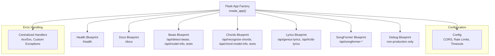
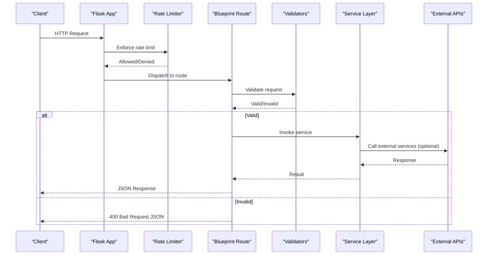
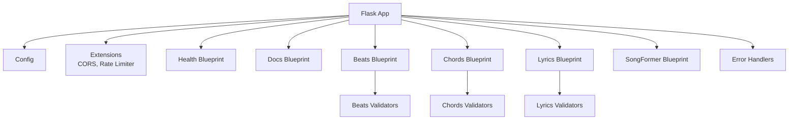

# Backend API

<cite>
**Referenced Files in This Document**
- [app.py](file://python_backend/app.py)
- [app_factory.py](file://python_backend/app_factory.py)
- [config.py](file://python_backend/config.py)
- [error_handlers.py](file://python_backend/error_handlers.py)
- [blueprints/beats/routes.py](file://python_backend/blueprints/beats/routes.py)
- [blueprints/beats/validators.py](file://python_backend/blueprints/beats/validators.py)
- [blueprints/chords/routes.py](file://python_backend/blueprints/chords/routes.py)
- [blueprints/chords/validators.py](file://python_backend/blueprints/chords/validators.py)
- `Machine Learning Models/Adding New Models.md`
- [blueprints/lyrics/routes.py](file://python_backend/blueprints/lyrics/routes.py)
- [blueprints/lyrics/validators.py](file://python_backend/blueprints/lyrics/validators.py)
- [blueprints/health/routes.py](file://python_backend/blueprints/health/routes.py)
</cite>

## Table of Contents
1. [Introduction](#introduction)
2. [Project Structure](#project-structure)
3. [Core Components](#core-components)
4. [Architecture Overview](#architecture-overview)
5. [Detailed Component Analysis](#detailed-component-analysis)
6. [Dependency Analysis](#dependency-analysis)
7. [Performance Considerations](#performance-considerations)
8. [Troubleshooting Guide](#troubleshooting-guide)
9. [Conclusion](#conclusion)

## Introduction
This document describes the backend API for ChordMiniApp’s Flask microservices. It covers all HTTP endpoints under /api, including beat detection, chord recognition, lyrics services, audio processing, YouTube integration, and health checks. For each endpoint, you will find HTTP methods, URL patterns, request parameters, response schemas, error codes, authentication requirements, validation rules, and rate limiting policies. Practical examples are included via curl commands and JSON payloads. The document also explains the service architecture, error handling strategies, performance characteristics, and API versioning/backwards compatibility approaches.

## Project Structure
The Flask application uses an application factory pattern and registers blueprints for modular routing. Configuration is environment-driven and includes CORS, rate limits, timeouts, and feature toggles. Error handling is centralized to return consistent JSON responses.



**Diagram sources**
- [app_factory.py:27-65](file://python_backend/app_factory.py#L27-L65)
- [app_factory.py:68-100](file://python_backend/app_factory.py#L68-L100)
- [config.py:16-103](file://python_backend/config.py#L16-L103)
- [error_handlers.py:13-93](file://python_backend/error_handlers.py#L13-L93)

**Section sources**
- [app_factory.py:27-100](file://python_backend/app_factory.py#L27-L100)
- [config.py:16-103](file://python_backend/config.py#L16-L103)
- [error_handlers.py:13-93](file://python_backend/error_handlers.py#L13-L93)

## Core Components
- Application Factory: Creates and configures the Flask app, initializes extensions, registers blueprints, and sets up a service container.
- Blueprints: Modular route groups for health, docs, beats, chords, lyrics, songformer, and debug.
- Configuration: Centralizes CORS origins, rate limits, timeouts, and feature flags.
- Error Handlers: Provides standardized JSON responses for HTTP errors and custom exceptions.

**Section sources**
- [app_factory.py:27-162](file://python_backend/app_factory.py#L27-L162)
- [config.py:16-215](file://python_backend/config.py#L16-L215)
- [error_handlers.py:13-161](file://python_backend/error_handlers.py#L13-L161)

## Architecture Overview
The backend is a Flask application with rate limiting, CORS, and modular blueprints. Services are injected via the app’s extensions registry. Validation utilities ensure request correctness before invoking services.



**Diagram sources**
- [blueprints/beats/routes.py:40-120](file://python_backend/blueprints/beats/routes.py#L40-L120)
- [blueprints/chords/routes.py:43-144](file://python_backend/blueprints/chords/routes.py#L43-L144)
- [blueprints/lyrics/routes.py:22-72](file://python_backend/blueprints/lyrics/routes.py#L22-L72)
- [config.py:47-60](file://python_backend/config.py#L47-L60)

## Detailed Component Analysis

### Health Checks
- Endpoint: GET /
  - Description: Basic health check returning a simple status message.
  - Response: JSON with status and message.
  - Rate limit: Defined by config.get_rate_limit('health').
  - Example:
    ```bash
    curl https://backend.example.com/
    ```

- Endpoint: GET /api/health
  - Description: Cloud Run-friendly health check returning minimal JSON.
  - Response: JSON with status.
  - Example:
    ```bash
    curl https://backend.example.com/api/health
    ```

**Section sources**
- [blueprints/health/routes.py:18-31](file://python_backend/blueprints/health/routes.py#L18-L31)
- [config.py:47-60](file://python_backend/config.py#L47-L60)

### Beat Detection
- Endpoint: POST /api/detect-beats
  - Method: POST
  - Content-Type: multipart/form-data or application/json (for URL-based audio)
  - Parameters:
    - file: Audio file (multipart/form-data)
    - audio_path: Path to existing audio file on server (alternative to file)
    - detector: One of beat-transformer, madmom, librosa, auto
    - force: Boolean flag to bypass size limits
  - Validation:
    - At least one of file or audio_path must be provided.
    - detector must be one of the allowed values.
    - force must be boolean-like "true".
    - File size validated against detector-specific limits unless force=true.
  - Responses:
    - Success: JSON result from beat detection service.
    - Errors: 400 (validation), 413 (file too large), 500 (processing failure).
  - Rate limit: moderate-heavy based on config.get_rate_limit('heavy_processing').
  - Example (multipart/form-data):
    ```bash
    curl -X POST https://backend.example.com/api/detect-beats \
      -F file=@/path/to/audio.mp3 \
      -F detector=auto \
      -F force=false
    ```
  - Example (existing server path):
    ```bash
    curl -X POST https://backend.example.com/api/detect-beats \
      -F audio_path=/absolute/path/to/audio.mp3 \
      -F detector=madmom
    ```

- Endpoint: POST /api/detect-beats-firebase
  - Method: POST
  - Content-Type: application/x-www-form-urlencoded
  - Parameters:
    - firebase_url: Firebase Storage URL of audio file
    - detector: One of beat-transformer, madmom, librosa, auto
  - Validation:
    - firebase_url required and must contain a valid Firebase Storage domain.
    - detector must be one of the allowed values.
  - Responses:
    - Success: JSON result from beat detection service.
    - Errors: 400 (validation), 500 (processing/download failure).
  - Rate limit: moderate-heavy.
  - Example:
    ```bash
    curl -X POST https://backend.example.com/api/detect-beats-firebase \
      -F firebase_url="https://firebasestorage.googleapis.com/..." \
      -F detector=auto
    ```

- Endpoint: GET /api/model-info
  - Method: GET
  - Description: Returns available beat detection models and file size limits.
  - Response: JSON with default model, available models, and model details.
  - Rate limit: light-processing.
  - Example:
    ```bash
    curl https://backend.example.com/api/model-info
    ```

- Endpoint: GET /api/test-beat-transformer
  - Method: GET
  - Description: Tests Beat-Transformer availability and device info.
  - Response: JSON with status and optional device info.
  - Example:
    ```bash
    curl https://backend.example.com/api/test-beat-transformer
    ```

- Endpoint: GET /api/test-madmom
  - Method: GET
  - Description: Tests Madmom availability and version.
  - Example:
    ```bash
    curl https://backend.example.com/api/test-madmom
    ```

- Endpoint: GET /api/test-librosa
  - Method: GET
  - Description: Tests Librosa availability and version.
  - Example:
    ```bash
    curl https://backend.example.com/api/test-librosa
    ```

- Endpoint: GET /api/test-all-models
  - Method: GET
  - Description: Tests all available beat detection models and summarizes availability.
  - Example:
    ```bash
    curl https://backend.example.com/api/test-all-models
    ```

- Endpoint: GET /api/test-dbn-isolation
  - Method: GET
  - Description: Tests DBN components for Madmom.
  - Example:
    ```bash
    curl https://backend.example.com/api/test-dbn-isolation
    ```

**Section sources**
- [blueprints/beats/routes.py:40-120](file://python_backend/blueprints/beats/routes.py#L40-L120)
- [blueprints/beats/routes.py:122-180](file://python_backend/blueprints/beats/routes.py#L122-L180)
- [blueprints/beats/routes.py:182-250](file://python_backend/blueprints/beats/routes.py#L182-L250)
- [blueprints/beats/routes.py:252-380](file://python_backend/blueprints/beats/routes.py#L252-L380)
- [blueprints/beats/routes.py:382-521](file://python_backend/blueprints/beats/routes.py#L382-L521)
- [blueprints/beats/validators.py:13-51](file://python_backend/blueprints/beats/validators.py#L13-L51)
- [blueprints/beats/validators.py:106-141](file://python_backend/blueprints/beats/validators.py#L106-L141)
- [config.py:47-60](file://python_backend/config.py#L47-L60)

### Chord Recognition
- Endpoint: POST /api/recognize-chords
  - Method: POST
  - Content-Type: multipart/form-data or application/json (for URL-based audio)
  - Parameters:
    - file: Audio file (multipart/form-data)
    - audio_path: Path to existing audio file on server
    - detector: One of chord-cnn-lstm, btc-sl, btc-pl, auto
    - chord_dict: Optional chord dictionary name (validated against detector support)
    - force: Boolean flag to bypass size limits
    - use_spleeter: Boolean flag to enable audio separation
  - Validation:
    - At least one of file, audio_path, or JSON audioUrl must be provided.
    - detector must be one of the allowed values.
    - chord_dict must be supported by the chosen detector.
    - File size validated against detector-specific limits unless force=true.
    - JSON audioUrl must map to a valid relative path under configured audio directory.
  - Responses:
    - Success: JSON result from chord recognition service.
    - Errors: 400 (validation), 413 (file too large), 404 (file not found), 500 (processing failure).
  - Rate limit: moderate-heavy.
  - Example (multipart/form-data):
    ```bash
    curl -X POST https://backend.example.com/api/recognize-chords \
      -F file=@/path/to/audio.mp3 \
      -F detector=auto \
      -F chord_dict=full
    ```
  - Example (existing server path):
    ```bash
    curl -X POST https://backend.example.com/api/recognize-chords \
      -F audio_path=/absolute/path/to/audio.mp3 \
      -F detector=btc-sl \
      -F use_spleeter=true
    ```
  - Example (JSON with audioUrl):
    ```bash
    curl -X POST https://backend.example.com/api/recognize-chords \
      -H "Content-Type: application/json" \
      -d '{"audioUrl":"/audio/song.mp3","detector":"chord-cnn-lstm"}'
    ```

- Endpoint: POST /api/recognize-chords-firebase
  - Method: POST
  - Content-Type: application/x-www-form-urlencoded
  - Parameters:
    - firebase_url: Firebase Storage URL of audio file
    - detector: One of chord-cnn-lstm, btc-sl, btc-pl, auto
    - chord_dict: Optional chord dictionary name
  - Validation:
    - firebase_url required and must contain a valid Firebase Storage domain.
    - detector and chord_dict validated similarly to POST /api/recognize-chords.
  - Responses:
    - Success: JSON result from chord recognition service.
    - Errors: 400 (validation), 500 (processing/download failure).
  - Rate limit: moderate-heavy.
  - Example:
    ```bash
    curl -X POST https://backend.example.com/api/recognize-chords-firebase \
      -F firebase_url="https://firebasestorage.googleapis.com/..." \
      -F detector=btc-pl
    ```

- Endpoint: GET /api/chord-model-info
  - Method: GET
  - Description: Flask chord-model discovery endpoint. It returns available chord recognition models, supported dictionaries, and size limits. The Next.js UI primarily calls `GET /api/model-info`, which proxies backend model metadata and falls back to local metadata when Flask is unavailable.
  - Example:
    ```bash
    curl https://backend.example.com/api/chord-model-info
    ```

For the implementation checklist to add a new model and expose it through these endpoints, see `Machine Learning Models/Adding New Models.md`.

- Endpoint: GET /api/test-chord-cnn-lstm
  - Method: GET
  - Description: Tests Chord-CNN-LSTM availability and model info.
  - Example:
    ```bash
    curl https://backend.example.com/api/test-chord-cnn-lstm
    ```

- Endpoint: GET /api/test-btc-sl
  - Method: GET
  - Description: Tests BTC-SL availability and model info.
  - Example:
    ```bash
    curl https://backend.example.com/api/test-btc-sl
    ```

- Endpoint: GET /api/test-btc-pl
  - Method: GET
  - Description: Tests BTC-PL availability and model info.
  - Example:
    ```bash
    curl https://backend.example.com/api/test-btc-pl
    ```

- Endpoint: GET /api/test-all-chord-models
  - Method: GET
  - Description: Tests all available chord recognition models and summarizes availability.
  - Example:
    ```bash
    curl https://backend.example.com/api/test-all-chord-models
    ```

**Section sources**
- [blueprints/chords/routes.py:43-144](file://python_backend/blueprints/chords/routes.py#L43-L144)
- [blueprints/chords/routes.py:145-220](file://python_backend/blueprints/chords/routes.py#L145-L220)
- [blueprints/chords/routes.py:222-257](file://python_backend/blueprints/chords/routes.py#L222-L257)
- [blueprints/chords/routes.py:260-374](file://python_backend/blueprints/chords/routes.py#L260-L374)
- [blueprints/chords/routes.py:377-440](file://python_backend/blueprints/chords/routes.py#L377-L440)
- [blueprints/chords/validators.py:14-80](file://python_backend/blueprints/chords/validators.py#L14-L80)
- [blueprints/chords/validators.py:166-199](file://python_backend/blueprints/chords/validators.py#L166-L199)
- [blueprints/chords/validators.py:202-254](file://python_backend/blueprints/chords/validators.py#L202-L254)
- [config.py:47-60](file://python_backend/config.py#L47-L60)

### Lyrics Services
- Endpoint: POST /api/genius-lyrics
  - Method: POST
  - Content-Type: application/json
  - Parameters:
    - artist: Artist name (optional if search_query provided)
    - title: Song title (optional if search_query provided)
    - search_query: Custom search query (optional if artist and title provided)
  - Validation:
    - Requires either search_query or both artist and title.
    - Enforces maximum lengths for inputs.
  - Responses:
    - Success: JSON result from Genius service.
    - Errors: 400 (validation), 500 (processing), 503 (service unavailable).
  - Rate limit: moderate-processing.
  - Example:
    ```bash
    curl -X POST https://backend.example.com/api/genius-lyrics \
      -H "Content-Type: application/json" \
      -d '{"artist":"Taylor Swift","title":"Blank Space"}'
    ```

- Endpoint: POST /api/lrclib-lyrics
  - Method: POST
  - Content-Type: application/json
  - Parameters:
    - artist: Artist name (optional if search_query provided)
    - title: Song title (optional if search_query provided)
    - search_query: Custom search query (optional if artist and title provided)
  - Validation:
    - Same as Genius endpoint.
  - Responses:
    - Success: JSON result from LRClib service.
    - Errors: 400 (validation), 500 (processing), 503 (service unavailable).
  - Rate limit: moderate-processing.
  - Example:
    ```bash
    curl -X POST https://backend.example.com/api/lrclib-lyrics \
      -H "Content-Type: application/json" \
      -d '{"search_query":"John Lennon Imagine"}'
    ```

**Section sources**
- [blueprints/lyrics/routes.py:22-72](file://python_backend/blueprints/lyrics/routes.py#L22-L72)
- [blueprints/lyrics/routes.py:75-126](file://python_backend/blueprints/lyrics/routes.py#L75-L126)
- [blueprints/lyrics/validators.py:12-58](file://python_backend/blueprints/lyrics/validators.py#L12-L58)
- [config.py:47-60](file://python_backend/config.py#L47-L60)

### Audio Processing
- Endpoint: GET /api/audio-duration
  - Method: GET
  - Description: Returns audio duration for a given URL. Implemented in the Next.js frontend API routes; consult frontend documentation for details.
  - Example:
    ```bash
    curl "https://backend.example.com/api/audio-duration?audioUrl=https://example.com/audio.mp3"
    ```

- Endpoint: POST /api/extract-audio
  - Method: POST
  - Description: Extracts audio from a video source. Implemented in the Next.js frontend API routes; consult frontend documentation for details.
  - Example:
    ```bash
    curl -X POST "https://backend.example.com/api/extract-audio" \
      -H "Content-Type: application/json" \
      -d '{"videoUrl":"https://www.youtube.com/watch?v=..."}'
    ```

**Section sources**
- [src/app/api/audio-duration/route.ts](file://src/app/api/audio-duration/route.ts)
- [src/app/api/extract-audio/route.ts](file://src/app/api/extract-audio/route.ts)

### YouTube Integration
- Endpoint: GET /api/youtube/info
  - Method: GET
  - Description: Fetches YouTube video metadata (title, duration, uploader, description, thumbnail). Implemented in the Next.js frontend API routes; consult frontend documentation for details.
  - Example:
    ```bash
    curl "https://backend.example.com/api/youtube/info?videoId=VIDEO_ID"
    ```

**Section sources**
- [src/app/api/youtube/info/route.ts](file://src/app/api/youtube/info/route.ts)

## Dependency Analysis
The Flask app depends on configuration, extensions (rate limiting, CORS), and blueprints. Each blueprint encapsulates routes and validators. Services are injected via the app’s extensions registry and invoked by routes after validation.



**Diagram sources**
- [app_factory.py:68-100](file://python_backend/app_factory.py#L68-L100)
- [config.py:16-103](file://python_backend/config.py#L16-L103)
- [error_handlers.py:13-93](file://python_backend/error_handlers.py#L13-L93)
- [blueprints/beats/validators.py:13-51](file://python_backend/blueprints/beats/validators.py#L13-L51)
- [blueprints/chords/validators.py:14-80](file://python_backend/blueprints/chords/validators.py#L14-L80)
- [blueprints/lyrics/validators.py:12-58](file://python_backend/blueprints/lyrics/validators.py#L12-L58)

**Section sources**
- [app_factory.py:68-100](file://python_backend/app_factory.py#L68-L100)
- [config.py:16-103](file://python_backend/config.py#L16-L103)
- [error_handlers.py:13-93](file://python_backend/error_handlers.py#L13-L93)

## Performance Considerations
- Rate Limiting: Different endpoint categories have distinct limits (e.g., health, docs, heavy processing, moderate processing, light processing, debug, test). Production defaults are stricter than development.
- File Size Limits: Uploads are validated per detector to avoid memory pressure and ensure model stability.
- Timeouts: External service calls (e.g., Genius, LRClib) and audio extraction have configurable timeouts.
- Model Availability: Availability checks are deferred to runtime to reduce startup overhead; services fall back gracefully when models are missing.
- CORS: Origins are configurable via environment variables to support development and deployment domains.

**Section sources**
- [config.py:47-83](file://python_backend/config.py#L47-L83)
- [blueprints/beats/validators.py:106-141](file://python_backend/blueprints/beats/validators.py#L106-L141)
- [blueprints/chords/validators.py:166-199](file://python_backend/blueprints/chords/validators.py#L166-L199)

## Troubleshooting Guide
- 400 Bad Request: Returned when request validation fails (missing parameters, invalid detector, unsupported chord dictionary, invalid JSON, etc.).
- 413 Request Entity Too Large: Returned when uploaded file exceeds detector-specific size limits.
- 429 Rate Limit Exceeded: Returned when rate limit thresholds are exceeded; includes retry-after hint when available.
- 500 Internal Server Error: Generic server error with optional stack traces in non-production modes.
- 503 Service Unavailable: Returned when required services (e.g., lyrics orchestrator) are not available.
- Model Tests: Use the test endpoints to diagnose model availability and versions.

Common diagnostics:
- Verify detector choice and size limits for large files.
- Confirm CORS origins if cross-origin requests fail.
- Use model info endpoints to confirm available detectors and defaults.
- Check rate limit categories for heavy endpoints.

**Section sources**
- [error_handlers.py:21-91](file://python_backend/error_handlers.py#L21-L91)
- [blueprints/beats/routes.py:182-250](file://python_backend/blueprints/beats/routes.py#L182-L250)
- [blueprints/chords/routes.py:222-257](file://python_backend/blueprints/chords/routes.py#L222-L257)
- [blueprints/lyrics/routes.py:42-72](file://python_backend/blueprints/lyrics/routes.py#L42-L72)

## Conclusion
The backend provides a modular, rate-limited, and resilient set of endpoints for audio analysis and lyrics retrieval. Validation and error handling are centralized, while configuration supports flexible deployment scenarios. Use the provided test endpoints to verify model availability and adhere to rate limits and file size constraints for optimal performance.
