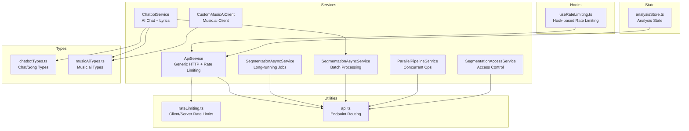
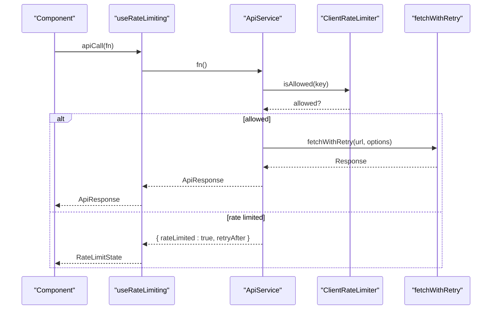
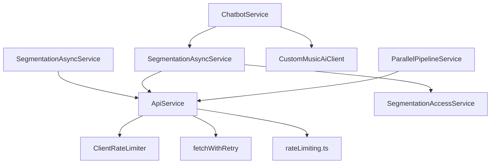

# Frontend API

<cite>
**Referenced Files in This Document**
- [apiService.ts](file://src/services/api/apiService.ts)
- [segmentationAsyncService.ts](file://src/services/api/segmentationAsyncService.ts)
- [segmentationAsyncService.ts](file://src/services/api/segmentationAsyncService.ts)
- [chatbotService.ts](file://src/services/api/chatbotService.ts)
- [customMusicAiClient.ts](file://src/services/api/customMusicAiClient.ts)
- [parallelPipelineService.ts](file://src/services/api/parallelPipelineService.ts)
- [segmentationAccessService.ts](file://src/services/api/segmentationAccessService.ts)
- [rateLimiting.ts](file://src/utils/rateLimiting.ts)
- [api.ts](file://src/config/api.ts)
- [useRateLimiting.ts](file://src/hooks/api/useRateLimiting.ts)
- [chatbotTypes.ts](file://src/types/chatbotTypes.ts)
- [musicAiTypes.ts](file://src/types/musicAiTypes.ts)
- [analysisStore.ts](file://src/stores/analysisStore.ts)
</cite>

## Table of Contents
1. [Introduction](#introduction)
2. [Project Structure](#project-structure)
3. [Core Components](#core-components)
4. [Architecture Overview](#architecture-overview)
5. [Detailed Component Analysis](#detailed-component-analysis)
6. [Dependency Analysis](#dependency-analysis)
7. [Performance Considerations](#performance-considerations)
8. [Troubleshooting Guide](#troubleshooting-guide)
9. [Conclusion](#conclusion)
10. [Appendices](#appendices)

## Introduction
This document provides comprehensive frontend API documentation for ChordMiniApp’s React services and client interfaces. It covers the service layer architecture, including ApiService for generic HTTP requests, SegmentationAsyncService for long-running operations, SegmentationAsyncService for batch processing, and specialized services such as ChatbotService and CustomMusicAiClient. It also documents TypeScript interfaces, request/response types, error handling patterns, hook-based consumption patterns, caching strategies, and state management integration. Practical examples illustrate how components interact with services, handle loading states, and manage errors. The API client configuration, authentication token handling, and rate limiting implementation are explained, along with the parallel pipeline service for concurrent operations and the segmentation access service for job tracking.

## Project Structure
The frontend API layer is organized around cohesive service modules under src/services/api, supporting utilities in src/utils, configuration in src/config, and state management via zustand stores. Components consume these services through React hooks and store selectors.

**Diagram sources**
- [apiService.ts:1-407](file://src/services/api/apiService.ts#L1-L407)
- [segmentationAsyncService.ts:1-211](file://src/services/api/segmentationAsyncService.ts#L1-L211)
- [segmentationAsyncService.ts:1-261](file://src/services/api/segmentationAsyncService.ts#L1-L261)
- [chatbotService.ts:1-285](file://src/services/api/chatbotService.ts#L1-L285)
- [customMusicAiClient.ts:1-711](file://src/services/api/customMusicAiClient.ts#L1-L711)
- [parallelPipelineService.ts:1-350](file://src/services/api/parallelPipelineService.ts#L1-L350)
- [segmentationAccessService.ts:1-64](file://src/services/api/segmentationAccessService.ts#L1-L64)
- [rateLimiting.ts:1-266](file://src/utils/rateLimiting.ts#L1-L266)
- [api.ts:1-158](file://src/config/api.ts#L1-L158)
- [useRateLimiting.ts:1-322](file://src/hooks/api/useRateLimiting.ts#L1-L322)
- [chatbotTypes.ts:1-126](file://src/types/chatbotTypes.ts#L1-L126)
- [musicAiTypes.ts:1-122](file://src/types/musicAiTypes.ts#L1-L122)
- [analysisStore.ts:1-367](file://src/stores/analysisStore.ts#L1-L367)

**Section sources**
- [apiService.ts:1-407](file://src/services/api/apiService.ts#L1-L407)
- [api.ts:1-158](file://src/config/api.ts#L1-L158)

## Core Components
- ApiService: Centralized HTTP client with built-in rate limiting, timeouts, retries, and App Check token injection. Provides convenience methods for GET/POST/FormData requests and domain-specific operations (beats, chords, lyrics).
- SegmentationAsyncService: Manages long-running jobs exceeding platform timeouts, including job creation, polling, and progress callbacks.
- SegmentationAsyncService: Orchestrates SongFormer segmentation jobs with dynamic polling strategies, browser worker execution, and access code validation.
- ChatbotService: Handles chatbot messaging, song context formatting, lyrics retrieval, and segmentation requests.
- CustomMusicAiClient: Robust client for Music.ai API with fallback endpoints, authentication variations, and file upload utilities.
- ParallelPipelineService: Optimizes audio processing by downloading complete files and running processing and uploads in parallel.
- SegmentationAccessService: Validates segmentation access codes and provides user-facing messages.
- Rate limiting utilities: Client-side and server-side rate limiting helpers, exponential backoff, and retry logic.
- API configuration: Endpoint routing and fetch options for cross-origin backend services.
- useRateLimiting hook: React hook to surface rate limit state and wrap API calls with rate-limit-aware behavior.
- Types: Strongly typed interfaces for chatbot, segmentation, and Music.ai job/result data.

**Section sources**
- [apiService.ts:13-407](file://src/services/api/apiService.ts#L13-L407)
- [segmentationAsyncService.ts:8-211](file://src/services/api/segmentationAsyncService.ts#L8-L211)
- [segmentationAsyncService.ts:7-261](file://src/services/api/segmentationAsyncService.ts#L7-L261)
- [chatbotService.ts:8-285](file://src/services/api/chatbotService.ts#L8-L285)
- [customMusicAiClient.ts:77-711](file://src/services/api/customMusicAiClient.ts#L77-L711)
- [parallelPipelineService.ts:11-350](file://src/services/api/parallelPipelineService.ts#L11-L350)
- [segmentationAccessService.ts:5-64](file://src/services/api/segmentationAccessService.ts#L5-L64)
- [rateLimiting.ts:5-266](file://src/utils/rateLimiting.ts#L5-L266)
- [api.ts:15-158](file://src/config/api.ts#L15-L158)
- [useRateLimiting.ts:8-144](file://src/hooks/api/useRateLimiting.ts#L8-L144)
- [chatbotTypes.ts:9-126](file://src/types/chatbotTypes.ts#L9-L126)
- [musicAiTypes.ts:6-122](file://src/types/musicAiTypes.ts#L6-L122)

## Architecture Overview
The frontend API architecture separates concerns into:
- Service Layer: Encapsulates HTTP, retries, rate limiting, and domain-specific orchestration.
- Utilities: Shared rate limiting, exponential backoff, and fetch wrappers.
- Hooks: React integrations for rate limiting and endpoint status monitoring.
- Types: Strict TypeScript interfaces for requests/responses.
- State: Zustand stores for analysis results and UI state.

**Diagram sources**
- [useRateLimiting.ts:82-107](file://src/hooks/api/useRateLimiting.ts#L82-L107)
- [apiService.ts:56-241](file://src/services/api/apiService.ts#L56-L241)
- [rateLimiting.ts:120-187](file://src/utils/rateLimiting.ts#L120-L187)
- [rateLimiting.ts:210-265](file://src/utils/rateLimiting.ts#L210-L265)

## Detailed Component Analysis

### ApiService
ApiService provides a robust HTTP client with:
- Client-side rate limiting keyed by method+endpoint.
- Timeout management with AbortController and detailed logging.
- Automatic JSON parsing with fallback to text parsing.
- App Check token injection via Firebase.
- Built-in methods for health checks, model info, beats, chords, and lyrics retrieval.
- Specialized methods for heavy operations with increased timeouts and disabled retries.

Read-oriented frontend APIs now prefer TanStack Query hooks over component-local `useEffect` fetches where caching and deduplication are useful. `useModelInfoQuery` shares `/api/model-info` across model selectors, `useRecentVideosQuery` owns homepage recent transcription pagination, Sheet Sage query hooks cache health and melody-cache reads, and `useCachedLyricsQuery` deduplicates cache-only lyrics lookups. Heavy uploads, chatbot sends, audio extraction, and long-running analysis remain imperative because they carry workflow state, user progress, and custom retry/abort behavior.

Key interfaces:
- ApiResponse<T>: success flag, optional data, error message, rateLimited indicator, and retryAfter seconds.
- ApiRequestOptions: timeout, retries, maxAttempts, baseDelay, maxDelay.

Important methods:
- request<T>(endpoint, options): generic HTTP request with rate limiting and retries.
- get/post/postFormData: convenience methods with JSON or FormData bodies.
- detectBeats/recognizeChords: file upload endpoints with model selection and detector options.
- getGeniusLyrics/getLrcLibLyrics: lyrics retrieval with search fallbacks.

Error handling:
- Parses rate limit headers and constructs RateLimitError.
- Converts AbortError into user-friendly timeout messages.
- Returns structured ApiResponse with success/error fields.

**Section sources**
- [apiService.ts:13-28](file://src/services/api/apiService.ts#L13-L28)
- [apiService.ts:29-407](file://src/services/api/apiService.ts#L29-L407)
- [rateLimiting.ts:12-54](file://src/utils/rateLimiting.ts#L12-L54)

### SegmentationAsyncService
SegmentationAsyncService manages long-running jobs:
- Creates segmentation jobs via POST to /api/segmentation/jobs.
- Polls status with configurable attempts and interval.
- Emits progress callbacks with status, progress percentage, and ETA.
- Supports one-time status checks and availability probing.

Interfaces:
- AsyncJobResult: success flag, optional audioUrl, error, jobId.
- JobStatus: status enum, optional audioUrl, progress, elapsed/remaining time.
- JobProgressCallback: function receiving JobStatus.

Operational flow:
- extractAudio(videoId, title?, force?, onProgress?): creates job, polls until completion or failure, returns AsyncJobResult.

**Section sources**
- [segmentationAsyncService.ts:8-28](file://src/services/api/segmentationAsyncService.ts#L8-L28)
- [segmentationAsyncService.ts:30-211](file://src/services/api/segmentationAsyncService.ts#L30-L211)

### SegmentationAsyncService
SegmentationAsyncService coordinates SongFormer segmentation:
- Builds SegmentationRequest with optional access code.
- Creates job via POST to /api/segmentation/jobs.
- Determines polling strategy based on song duration and reuse flags.
- Runs browser worker against worker endpoint with update token and callback URL.
- Patches job status on failures.

Interfaces:
- SegmentationRequest/SegmentationResult/SongContext: typed request/response contracts.
- SegmentationPollingStrategy: initialDelayMs, pollIntervalMs, maxPollAttempts.

Algorithms:
- estimateSegmentationDurationSeconds: derives duration from songContext.
- getSegmentationPollingStrategy: selects strategy based on duration and reuse.

**Section sources**
- [segmentationAsyncService.ts:7-37](file://src/services/api/segmentationAsyncService.ts#L7-L37)
- [segmentationAsyncService.ts:101-261](file://src/services/api/segmentationAsyncService.ts#L101-L261)
- [chatbotTypes.ts:94-126](file://src/types/chatbotTypes.ts#L94-L126)

### ChatbotService
ChatbotService integrates AI chat and song analysis:
- sendChatMessage(message, conversationHistory, songContext, geminiApiKey?): posts to /api/chatbot with timeout.
- formatSongContextForAI(songContext): comprehensive formatting of beat/chord/lyric data.
- retrieveLyricsForChatbot(videoId): retrieves cached lyrics for context enhancement.
- sendChatMessageWithLyricsRetrieval(...): auto-enhances context with lyrics when missing.
- validateSongContext(songContext): ensures minimal required identifiers/data.
- truncateConversationHistory(messages, maxMessages?): caps conversation length.
- requestSongSegmentation(songContext): delegates to SegmentationAsyncService.

**Section sources**
- [chatbotService.ts:17-54](file://src/services/api/chatbotService.ts#L17-L54)
- [chatbotService.ts:74-169](file://src/services/api/chatbotService.ts#L74-L169)
- [chatbotService.ts:174-231](file://src/services/api/chatbotService.ts#L174-L231)
- [chatbotService.ts:236-284](file://src/services/api/chatbotService.ts#L236-L284)

### CustomMusicAiClient
CustomMusicAiClient provides resilient Music.ai integration:
- Constructor supports custom baseUrl, apiPath, timeout, and retries.
- addJob(workflow, params): creates job with multiple fallback endpoints/auth headers.
- waitForJobCompletion(jobId, timeout?): polls job status with exponential backoff.
- getJob(jobId): robust getter with multiple endpoint/auth combinations.
- listWorkflows(): discovers available workflows.
- getSignedUrls()/uploadFile()/uploadLocalFile(): file upload utilities with verification.

Error handling:
- Comprehensive fallback logic for endpoints and auth headers.
- Detailed error messages for unauthorized, not found, and workflow errors.
- Verifies upload accessibility via HEAD request.

**Section sources**
- [customMusicAiClient.ts:77-711](file://src/services/api/customMusicAiClient.ts#L77-L711)

### ParallelPipelineService
ParallelPipelineService optimizes audio processing throughput:
- startParallelPipeline(options): downloads complete audio file, caches it, and starts background Firebase upload.
- uploadToFirebaseInBackground()/uploadBlobToFirebaseInBackground(): non-blocking uploads with result caching.
- getCachedAudioFile(videoId)/getCachedAudioMeta(videoId): cache access with TTL.
- waitForFirebaseUpload(videoId, timeoutMs?): waits for background upload completion.
- cleanupBackgroundResults(maxAgeMs?): periodic cache cleanup.
- canUseDirectUrlWithBackend(url): validates HTTP/HTTPS URLs excluding Firebase Storage.
- getBackendEndpointForDirectUrl(type): maps processing type to backend endpoint.

**Section sources**
- [parallelPipelineService.ts:11-350](file://src/services/api/parallelPipelineService.ts#L11-L350)

### SegmentationAccessService
SegmentationAccessService enforces access control:
- isSegmentationAccessRequired(): production-only requirement.
- getConfiguredSegmentationAccessCode(): reads from environment.
- validateSegmentationAccessCode(candidate): timing-safe comparison with user feedback.

**Section sources**
- [segmentationAccessService.ts:9-64](file://src/services/api/segmentationAccessService.ts#L9-L64)

### Rate Limiting Utilities
- parseRateLimitHeaders(headers): extracts limit/remaining/reset/retryAfter.
- isRateLimitError(error): type guard for 429 responses.
- createRateLimitError(response): builds typed rate limit error.
- ExponentialBackoff: configurable exponential backoff with jitter.
- fetchWithRetry(url, options, retryOptions): retry logic with rate limit awareness.
- getRateLimitMessage(error): user-friendly messages.
- ClientRateLimiter: in-memory sliding window limiter.

**Section sources**
- [rateLimiting.ts:18-54](file://src/utils/rateLimiting.ts#L18-L54)
- [rateLimiting.ts:59-115](file://src/utils/rateLimiting.ts#L59-L115)
- [rateLimiting.ts:120-187](file://src/utils/rateLimiting.ts#L120-L187)
- [rateLimiting.ts:192-205](file://src/utils/rateLimiting.ts#L192-L205)
- [rateLimiting.ts:210-265](file://src/utils/rateLimiting.ts#L210-L265)

### API Configuration
- BACKEND_URLS: centralized backend URLs from server configuration.
- API_ROUTES: endpoint keys mapped to routes.
- getApiUrl(endpoint): resolves endpoint to URL.
- isExternalBackendEndpoint(endpoint): determines if endpoint proxies to external backend.
- apiRequest/apiPost/apiGet: unified fetch wrapper with CORS handling for external endpoints.

**Section sources**
- [api.ts:15-158](file://src/config/api.ts#L15-L158)

### Hook-based API Consumption Patterns
- useRateLimiting(options): returns rateLimitState, clearRateLimit, and api wrapper methods for healthCheck, getModelInfo, detectBeats, recognizeChords, getGeniusLyrics, getLrcLibLyrics.
- useStatusMonitoring(): checks endpoint availability and cold start conditions, aggregates results.

Integration patterns:
- Components call apiCall(fn) to wrap service methods and receive ApiResponse.
- On rateLimited=true, rateLimitState exposes retryAfter and message for UI feedback.
- useStatusMonitoring performs targeted checks for health/model-info/lyrics endpoints.

**Section sources**
- [useRateLimiting.ts:20-144](file://src/hooks/api/useRateLimiting.ts#L20-L144)
- [useRateLimiting.ts:149-322](file://src/hooks/api/useRateLimiting.ts#L149-L322)

### TypeScript Interfaces and Contracts
- Chatbot types: ChatMessage, ConversationHistory, SongContext, ChatbotRequest, ChatbotResponse, ChatbotState, SongSegment, SegmentationResult, SegmentationRequest.
- Music.ai types: LyricWordTiming, LyricLine, LyricsData, ChordData, ChordMarker, SynchronizedLyrics, MusicAiJobResultData, MusicAiJob, MusicAiWorkflow, MusicAiJobResult.

These types ensure strong typing across services and components, enabling safer integrations and better developer experience.

**Section sources**
- [chatbotTypes.ts:9-126](file://src/types/chatbotTypes.ts#L9-L126)
- [musicAiTypes.ts:6-122](file://src/types/musicAiTypes.ts#L6-L122)

### Caching Strategies and State Management Integration
- Client-side caching:
  - SegmentationAsyncService: browser worker runs against worker endpoint; job status polled and cached via Axios responses.
  - ParallelPipelineService: audioFileCache stores Blob with TTL; backgroundUploadResults tracks Firebase upload outcomes.
- Store integration:
  - analysisStore.ts: manages analysis state, lyrics, key detection, chord corrections, and SheetSage results. Components subscribe via selectors for efficient re-renders.

Practical usage:
- Components update analysisStore actions during API flows (start/complete/fail).
- ParallelPipelineService exposes getCachedAudioFile and getFirebaseUrlIfReady for immediate processing and later retrieval.

**Section sources**
- [segmentationAsyncService.ts:120-196](file://src/services/api/segmentationAsyncService.ts#L120-L196)
- [parallelPipelineService.ts:149-285](file://src/services/api/parallelPipelineService.ts#L149-L285)
- [analysisStore.ts:14-367](file://src/stores/analysisStore.ts#L14-L367)

## Dependency Analysis

**Diagram sources**
- [apiService.ts:29-407](file://src/services/api/apiService.ts#L29-L407)
- [rateLimiting.ts:210-265](file://src/utils/rateLimiting.ts#L210-L265)
- [rateLimiting.ts:120-187](file://src/utils/rateLimiting.ts#L120-L187)
- [segmentationAsyncService.ts:30-211](file://src/services/api/segmentationAsyncService.ts#L30-L211)
- [segmentationAsyncService.ts:101-261](file://src/services/api/segmentationAsyncService.ts#L101-L261)
- [segmentationAccessService.ts:9-64](file://src/services/api/segmentationAccessService.ts#L9-L64)
- [chatbotService.ts:12-285](file://src/services/api/chatbotService.ts#L12-L285)
- [customMusicAiClient.ts:77-711](file://src/services/api/customMusicAiClient.ts#L77-L711)
- [parallelPipelineService.ts:11-350](file://src/services/api/parallelPipelineService.ts#L11-L350)

**Section sources**
- [apiService.ts:29-407](file://src/services/api/apiService.ts#L29-L407)
- [rateLimiting.ts:210-265](file://src/utils/rateLimiting.ts#L210-L265)
- [segmentationAsyncService.ts:30-211](file://src/services/api/segmentationAsyncService.ts#L30-L211)
- [segmentationAsyncService.ts:101-261](file://src/services/api/segmentationAsyncService.ts#L101-L261)
- [segmentationAccessService.ts:9-64](file://src/services/api/segmentationAccessService.ts#L9-L64)
- [chatbotService.ts:12-285](file://src/services/api/chatbotService.ts#L12-L285)
- [customMusicAiClient.ts:77-711](file://src/services/api/customMusicAiClient.ts#L77-L711)
- [parallelPipelineService.ts:11-350](file://src/services/api/parallelPipelineService.ts#L11-L350)

## Performance Considerations
- Client-side rate limiting reduces redundant requests and prevents server overload.
- Exponential backoff with jitter mitigates thundering herd effects on retries.
- ParallelPipelineService minimizes latency by downloading complete files and overlapping processing with uploads.
- SegmentationAsyncService dynamically adjusts polling intervals based on song duration to balance responsiveness and resource usage.
- ApiService timeouts are tuned per endpoint; heavy operations use longer timeouts and reduced retries to avoid double-processing.

[No sources needed since this section provides general guidance]

## Troubleshooting Guide
Common scenarios and resolutions:
- Rate limit exceeded:
  - Use useRateLimiting hook to capture retryAfter and message.
  - Implement auto-retry or user prompts to wait.
- Network errors:
  - ApiService converts AbortError into user-friendly timeout messages.
  - Check backend availability via useStatusMonitoring.
- Authentication and tokens:
  - ApiService injects App Check token automatically when available.
  - CustomMusicAiClient tries multiple auth headers and endpoints.
- Access control:
  - SegmentationAccessService provides timing-safe validation and user-facing messages.

**Section sources**
- [useRateLimiting.ts:37-65](file://src/hooks/api/useRateLimiting.ts#L37-L65)
- [apiService.ts:188-240](file://src/services/api/apiService.ts#L188-L240)
- [customMusicAiClient.ts:190-295](file://src/services/api/customMusicAiClient.ts#L190-L295)
- [segmentationAccessService.ts:26-63](file://src/services/api/segmentationAccessService.ts#L26-L63)

## Conclusion
ChordMiniApp’s frontend API layer combines robust HTTP utilities, intelligent rate limiting, and specialized services for long-running jobs and AI integrations. The architecture emphasizes reliability, performance, and developer ergonomics through typed contracts, hook-based consumption, and state management. Services like ApiService, SegmentationAsyncService, SegmentationAsyncService, ChatbotService, and CustomMusicAiClient provide a cohesive foundation for building responsive and resilient audio analysis experiences.

[No sources needed since this section summarizes without analyzing specific files]

## Appendices

### Practical Examples: Component Interaction Patterns
- Loading and error handling:
  - Components call useRateLimiting.api.detectBeats(file) and render loading states while isAnalyzing is true.
  - On ApiResponse.success=false, components display error messages and optionally retry.
- Progress tracking:
  - SegmentationAsyncService.onProgress callback updates UI with progress percentage and ETA.
- Lyrics and segmentation:
  - ChatbotService.sendChatMessageWithLyricsRetrieval enhances context automatically when lyrics are missing.
  - SegmentationAsyncService returns SegmentationResult for UI rendering of song structure.

[No sources needed since this section provides general guidance]
