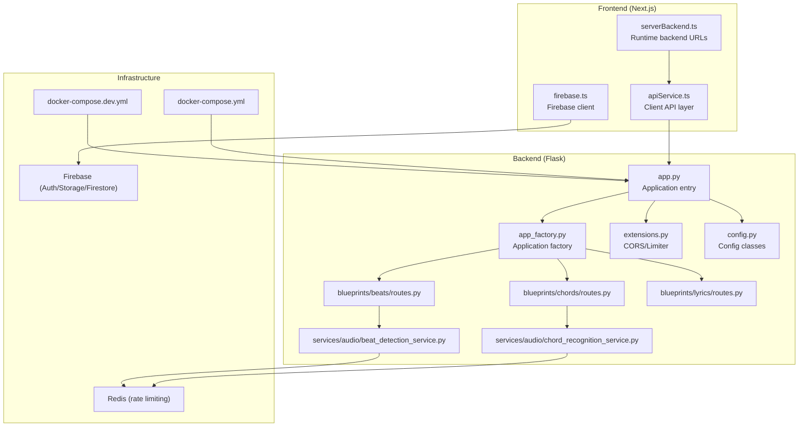
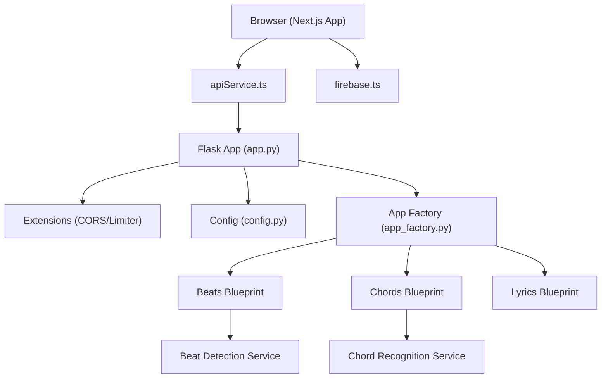
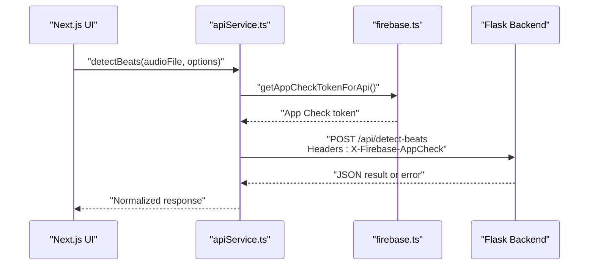
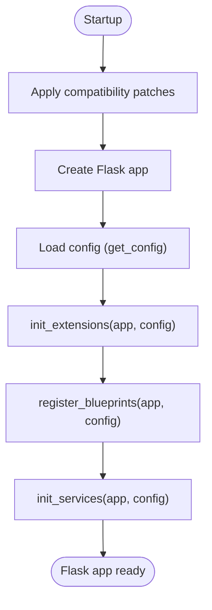
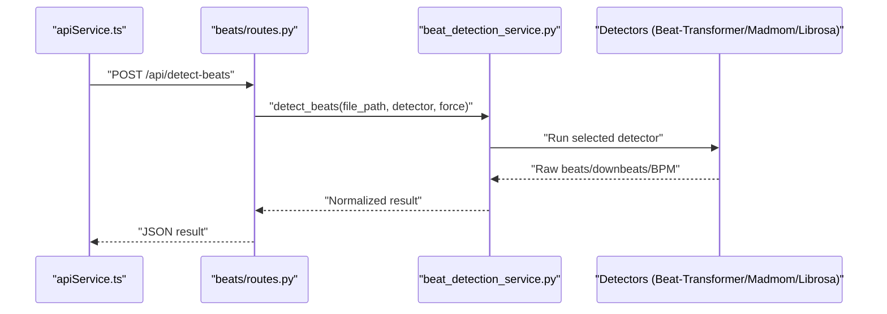
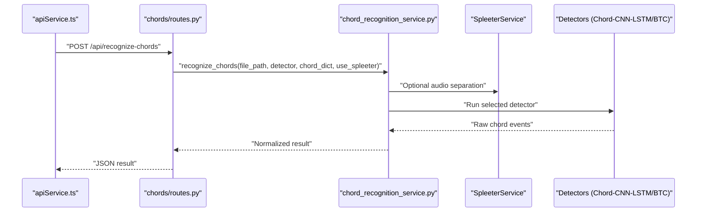
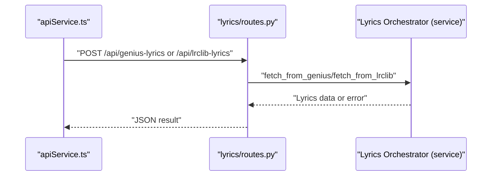
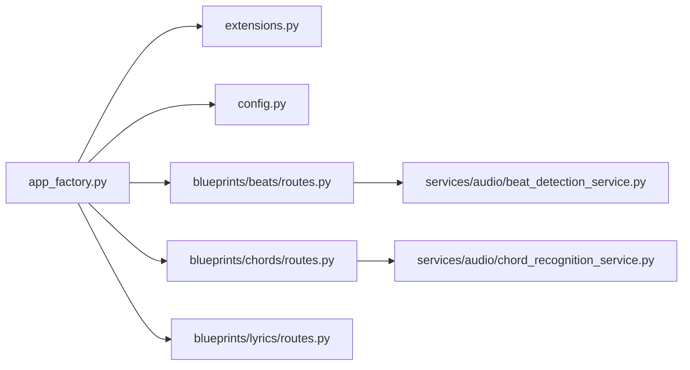
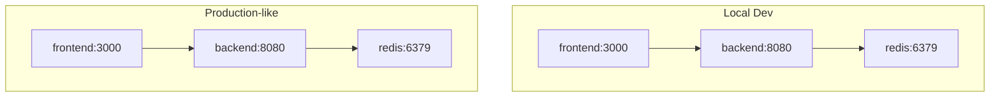

# Architecture and Design

<cite>
**Referenced Files in This Document**
- [app_factory.py](file://python_backend/app_factory.py)
- [app.py](file://python_backend/app.py)
- [extensions.py](file://python_backend/extensions.py)
- [config.py](file://python_backend/config.py)
- [routes.py (beats)](file://python_backend/blueprints/beats/routes.py)
- [routes.py (chords)](file://python_backend/blueprints/chords/routes.py)
- [routes.py (lyrics)](file://python_backend/blueprints/lyrics/routes.py)
- [validators.py (youtube)](file://python_backend/blueprints/youtube/validators.py)
- [beat_detection_service.py](file://python_backend/services/audio/beat_detection_service.py)
- [chord_recognition_service.py](file://python_backend/services/audio/chord_recognition_service.py)
- [serverBackend.ts](file://src/config/serverBackend.ts)
- [apiService.ts](file://src/services/api/apiService.ts)
- [firebase.ts](file://src/config/firebase.ts)
- [docker-compose.yml](file://docker/docker-compose.yml)
- [docker-compose.dev.yml](file://docker/docker-compose.dev.yml)
- [beat_transformer.py](file://python_backend/models/beat_transformer.py)
</cite>

## Table of Contents
1. [Introduction](#introduction)
2. [Project Structure](#project-structure)
3. [Core Components](#core-components)
4. [Architecture Overview](#architecture-overview)
5. [Detailed Component Analysis](#detailed-component-analysis)
6. [Dependency Analysis](#dependency-analysis)
7. [Performance Considerations](#performance-considerations)
8. [Troubleshooting Guide](#troubleshooting-guide)
9. [Conclusion](#conclusion)
10. [Appendices](#appendices)

## Introduction
This document describes the ChordMiniApp system architecture, focusing on the separation between the Next.js frontend and the Python Flask backend, the microservices-style organization of machine learning capabilities, and the technology stack. It explains how the frontend communicates with backend services, how the backend orchestrates ML model inference, and how infrastructure and deployment topologies are organized. Cross-cutting concerns such as security, monitoring, and performance optimization are addressed, along with practical troubleshooting guidance.

## Project Structure
ChordMiniApp follows a clear separation of concerns:
- Frontend: Next.js application under src/, responsible for UI, user interactions, and API orchestration.
- Backend: Python Flask application under python_backend/, exposing REST endpoints and orchestrating ML services.
- Infrastructure: Docker Compose configurations for local and development environments; Redis for rate limiting; Firebase for identity and storage.

**Diagram sources**
- [app.py:180-186](file://python_backend/app.py#L180-L186)
- [app_factory.py:27-65](file://python_backend/app_factory.py#L27-L65)
- [extensions.py:81-93](file://python_backend/extensions.py#L81-L93)
- [config.py:195-215](file://python_backend/config.py#L195-L215)
- [routes.py (beats):40-120](file://python_backend/blueprints/beats/routes.py#L40-L120)
- [routes.py (chords):43-143](file://python_backend/blueprints/chords/routes.py#L43-L143)
- [routes.py (lyrics):22-72](file://python_backend/blueprints/lyrics/routes.py#L22-L72)
- [beat_detection_service.py:20-100](file://python_backend/services/audio/beat_detection_service.py#L20-L100)
- [chord_recognition_service.py:25-106](file://python_backend/services/audio/chord_recognition_service.py#L25-L106)
- [docker-compose.yml:10-115](file://docker/docker-compose.yml#L10-L115)
- [docker-compose.dev.yml:6-116](file://docker/docker-compose.dev.yml#L6-L116)

**Section sources**
- [docker-compose.yml:10-115](file://docker/docker-compose.yml#L10-L115)
- [docker-compose.dev.yml:6-116](file://docker/docker-compose.dev.yml#L6-L116)

## Core Components
- Frontend API Layer: The Next.js frontend uses a typed API service to communicate with backend endpoints, applying client-side rate limiting and robust error handling. It also integrates Firebase for authentication and App Check tokens for request attestation.
- Backend Application Factory: The Flask application is bootstrapped via an application factory that initializes extensions, registers blueprints, and constructs a simple service container for ML services.
- Microservices-style Blueprints: The backend organizes endpoints into focused blueprints (beats, chords, lyrics, docs, health, debug), each encapsulating domain-specific routes and validators.
- ML Services: Dedicated services orchestrate model selection, file size policies, and inference across multiple ML models (Beat-Transformer, Madmom, Librosa, Chord-CNN-LSTM, BTC variants).
- Infrastructure: Docker Compose defines multi-container environments for local development and production-like setups, with optional Redis for rate limiting.

**Section sources**
- [apiService.ts:29-407](file://src/services/api/apiService.ts#L29-L407)
- [firebase.ts:400-464](file://src/config/firebase.ts#L400-L464)
- [app_factory.py:27-65](file://python_backend/app_factory.py#L27-L65)
- [extensions.py:81-93](file://python_backend/extensions.py#L81-L93)
- [routes.py (beats):40-120](file://python_backend/blueprints/beats/routes.py#L40-L120)
- [routes.py (chords):43-143](file://python_backend/blueprints/chords/routes.py#L43-L143)
- [routes.py (lyrics):22-72](file://python_backend/blueprints/lyrics/routes.py#L22-L72)
- [beat_detection_service.py:20-100](file://python_backend/services/audio/beat_detection_service.py#L20-L100)
- [chord_recognition_service.py:25-106](file://python_backend/services/audio/chord_recognition_service.py#L25-L106)

## Architecture Overview
The system follows a client-server architecture:
- The Next.js frontend renders the UI and manages user interactions. It delegates ML-heavy tasks to backend services via REST endpoints.
- The Flask backend exposes domain-specific endpoints behind blueprints, applies rate limiting, and coordinates ML inference through dedicated services.
- Firebase provides identity, storage, and Firestore access for the frontend, while App Check tokens are attached to backend-to-backend requests for attestation.

**Diagram sources**
- [apiService.ts:29-407](file://src/services/api/apiService.ts#L29-L407)
- [firebase.ts:400-464](file://src/config/firebase.ts#L400-L464)
- [app.py:180-186](file://python_backend/app.py#L180-L186)
- [extensions.py:81-93](file://python_backend/extensions.py#L81-L93)
- [config.py:195-215](file://python_backend/config.py#L195-L215)
- [app_factory.py:27-65](file://python_backend/app_factory.py#L27-L65)
- [routes.py (beats):40-120](file://python_backend/blueprints/beats/routes.py#L40-L120)
- [routes.py (chords):43-143](file://python_backend/blueprints/chords/routes.py#L43-L143)
- [routes.py (lyrics):22-72](file://python_backend/blueprints/lyrics/routes.py#L22-L72)
- [beat_detection_service.py:20-100](file://python_backend/services/audio/beat_detection_service.py#L20-L100)
- [chord_recognition_service.py:25-106](file://python_backend/services/audio/chord_recognition_service.py#L25-L106)

## Detailed Component Analysis

### Frontend API Orchestration
The frontend’s API layer encapsulates:
- Base URL resolution for backend endpoints, supporting local and production environments.
- Client-side rate limiting to avoid overwhelming backend endpoints.
- Robust error handling, including network failures, timeouts, and rate-limit responses.
- App Check token injection for backend requests to strengthen security.

**Diagram sources**
- [apiService.ts:29-407](file://src/services/api/apiService.ts#L29-L407)
- [firebase.ts:522-536](file://src/config/firebase.ts#L522-L536)
- [routes.py (beats):40-120](file://python_backend/blueprints/beats/routes.py#L40-L120)

**Section sources**
- [serverBackend.ts:23-56](file://src/config/serverBackend.ts#L23-L56)
- [apiService.ts:29-407](file://src/services/api/apiService.ts#L29-L407)
- [firebase.ts:522-536](file://src/config/firebase.ts#L522-L536)

### Backend Application Factory and Blueprints
The Flask application is created using an application factory that:
- Applies compatibility patches.
- Loads configuration and initializes extensions (CORS, rate limiter, logging).
- Registers blueprints for health, docs, beats, chords, lyrics, and debug (conditional).
- Initializes a simple service container with ML services.

**Diagram sources**
- [app_factory.py:27-65](file://python_backend/app_factory.py#L27-L65)
- [extensions.py:81-93](file://python_backend/extensions.py#L81-L93)
- [config.py:195-215](file://python_backend/config.py#L195-L215)

**Section sources**
- [app_factory.py:27-65](file://python_backend/app_factory.py#L27-L65)
- [app.py:86-87](file://python_backend/app.py#L86-L87)
- [extensions.py:81-93](file://python_backend/extensions.py#L81-L93)
- [config.py:195-215](file://python_backend/config.py#L195-L215)

### Beat Detection Workflow
Beat detection routes accept audio files or Firebase URLs, validate inputs, and delegate to the Beat Detection Service. The service selects an appropriate detector based on availability and file size, then performs inference and returns normalized results.

**Diagram sources**
- [routes.py (beats):40-120](file://python_backend/blueprints/beats/routes.py#L40-L120)
- [beat_detection_service.py:163-200](file://python_backend/services/audio/beat_detection_service.py#L163-L200)
- [beat_transformer.py:121-186](file://python_backend/models/beat_transformer.py#L121-L186)

**Section sources**
- [routes.py (beats):40-120](file://python_backend/blueprints/beats/routes.py#L40-L120)
- [beat_detection_service.py:20-100](file://python_backend/services/audio/beat_detection_service.py#L20-L100)

### Chord Recognition Workflow
Chord recognition routes similarly validate inputs, delegate to the Chord Recognition Service, and optionally use Spleeter for audio separation. The service selects a model based on availability and file size, runs inference, and returns normalized results.

**Diagram sources**
- [routes.py (chords):43-143](file://python_backend/blueprints/chords/routes.py#L43-L143)
- [chord_recognition_service.py:173-200](file://python_backend/services/audio/chord_recognition_service.py#L173-L200)

**Section sources**
- [routes.py (chords):43-143](file://python_backend/blueprints/chords/routes.py#L43-L143)
- [chord_recognition_service.py:25-106](file://python_backend/services/audio/chord_recognition_service.py#L25-L106)

### Lyrics Retrieval Workflow
Lyrics routes integrate with Genius and LRClib providers. The frontend sends artist/title or a custom search query; the backend validates and fetches lyrics, returning normalized results.

**Diagram sources**
- [routes.py (lyrics):22-72](file://python_backend/blueprints/lyrics/routes.py#L22-L72)

**Section sources**
- [routes.py (lyrics):22-72](file://python_backend/blueprints/lyrics/routes.py#L22-L72)

### Security, Monitoring, and Performance
- Security:
  - Firebase App Check tokens are attached to backend requests for attestation.
  - CORS is configured centrally with environment-aware origins.
  - Rate limiting is enforced via Flask-Limiter, optionally backed by Redis.
  - Request validation utilities sanitize and constrain inputs (e.g., YouTube search queries).
- Monitoring:
  - Centralized logging configuration with configurable levels.
  - Health endpoints exposed via blueprints for readiness probes.
- Performance:
  - Client-side rate limiting reduces bursty requests.
  - Model selection considers file size and availability to optimize throughput.
  - Docker Compose supports Redis for rate limiting and caching.

**Section sources**
- [firebase.ts:522-536](file://src/config/firebase.ts#L522-L536)
- [extensions.py:22-93](file://python_backend/extensions.py#L22-L93)
- [config.py:47-103](file://python_backend/config.py#L47-L103)
- [validators.py (youtube):13-67](file://python_backend/blueprints/youtube/validators.py#L13-L67)

## Dependency Analysis
The backend exhibits clear modularity:
- app_factory.py orchestrates initialization and service registration.
- extensions.py centralizes CORS and rate limiting.
- config.py provides environment-aware configuration.
- blueprints isolate domain endpoints and validators.
- services encapsulate ML orchestration and model selection.

**Diagram sources**
- [app_factory.py:68-101](file://python_backend/app_factory.py#L68-L101)
- [extensions.py:81-93](file://python_backend/extensions.py#L81-L93)
- [config.py:195-215](file://python_backend/config.py#L195-L215)
- [routes.py (beats):24](file://python_backend/blueprints/beats/routes.py#L24)
- [routes.py (chords):27](file://python_backend/blueprints/chords/routes.py#L27)
- [routes.py (lyrics):16](file://python_backend/blueprints/lyrics/routes.py#L16)
- [beat_detection_service.py:20-32](file://python_backend/services/audio/beat_detection_service.py#L20-L32)
- [chord_recognition_service.py:25-36](file://python_backend/services/audio/chord_recognition_service.py#L25-L36)

**Section sources**
- [app_factory.py:68-101](file://python_backend/app_factory.py#L68-L101)
- [extensions.py:81-93](file://python_backend/extensions.py#L81-L93)
- [config.py:195-215](file://python_backend/config.py#L195-L215)
- [routes.py (beats):24](file://python_backend/blueprints/beats/routes.py#L24)
- [routes.py (chords):27](file://python_backend/blueprints/chords/routes.py#L27)
- [routes.py (lyrics):16](file://python_backend/blueprints/lyrics/routes.py#L16)
- [beat_detection_service.py:20-32](file://python_backend/services/audio/beat_detection_service.py#L20-L32)
- [chord_recognition_service.py:25-36](file://python_backend/services/audio/chord_recognition_service.py#L25-L36)

## Performance Considerations
- Model Selection: Services choose detectors based on availability and file size to balance accuracy and latency.
- Rate Limiting: Centralized Flask-Limiter with optional Redis backing prevents overload.
- Client-side Throttling: Frontend enforces per-endpoint rate limits to reduce unnecessary load.
- Caching: Redis volume mounts in Docker Compose support caching and rate limiting persistence.
- Timeouts: Long-running ML operations are configured with generous timeouts in the frontend API.

[No sources needed since this section provides general guidance]

## Troubleshooting Guide
Common issues and remedies:
- CORS Errors: Verify CORS origins in configuration and ensure frontend and backend share the same origin in development.
- Rate Limiting: Inspect rate limit headers and adjust thresholds if necessary; consider Redis-backed limits for distributed environments.
- Model Availability: Use test endpoints to confirm model readiness; fallback logic will select alternate detectors when unavailable.
- Firebase Initialization: Confirm runtime configuration loading and App Check token availability; check anonymous authentication flow on cold starts.
- Docker Health Checks: Ensure backend and Redis containers are healthy and reachable on internal networks.

**Section sources**
- [config.py:32-46](file://python_backend/config.py#L32-L46)
- [extensions.py:50-58](file://python_backend/extensions.py#L50-L58)
- [routes.py (beats):252-296](file://python_backend/blueprints/beats/routes.py#L252-L296)
- [routes.py (chords):260-375](file://python_backend/blueprints/chords/routes.py#L260-L375)
- [firebase.ts:400-464](file://src/config/firebase.ts#L400-L464)
- [docker-compose.yml:55-90](file://docker/docker-compose.yml#L55-L90)
- [docker-compose.dev.yml:29-80](file://docker/docker-compose.dev.yml#L29-L80)

## Conclusion
ChordMiniApp employs a clean separation between a modern Next.js frontend and a modular Flask backend. The backend’s application factory and blueprint-based organization enable scalable, maintainable ML services. With centralized configuration, rate limiting, and Firebase integration, the system balances performance, security, and developer experience. Docker Compose simplifies local and production deployments, while Redis enhances reliability for rate limiting and caching.

[No sources needed since this section summarizes without analyzing specific files]

## Appendices

### Deployment Topology
- Local Development: docker-compose.dev.yml builds and runs frontend and backend images, with Redis for rate limiting and caching volumes.
- Production-like: docker-compose.yml defines a containerized environment with explicit environment variables for Firebase and API URLs.

**Diagram sources**
- [docker-compose.dev.yml:6-116](file://docker/docker-compose.dev.yml#L6-L116)
- [docker-compose.yml:10-115](file://docker/docker-compose.yml#L10-L115)

**Section sources**
- [docker-compose.dev.yml:6-116](file://docker/docker-compose.dev.yml#L6-L116)
- [docker-compose.yml:10-115](file://docker/docker-compose.yml#L10-L115)