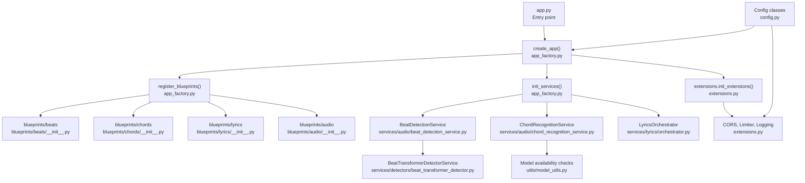
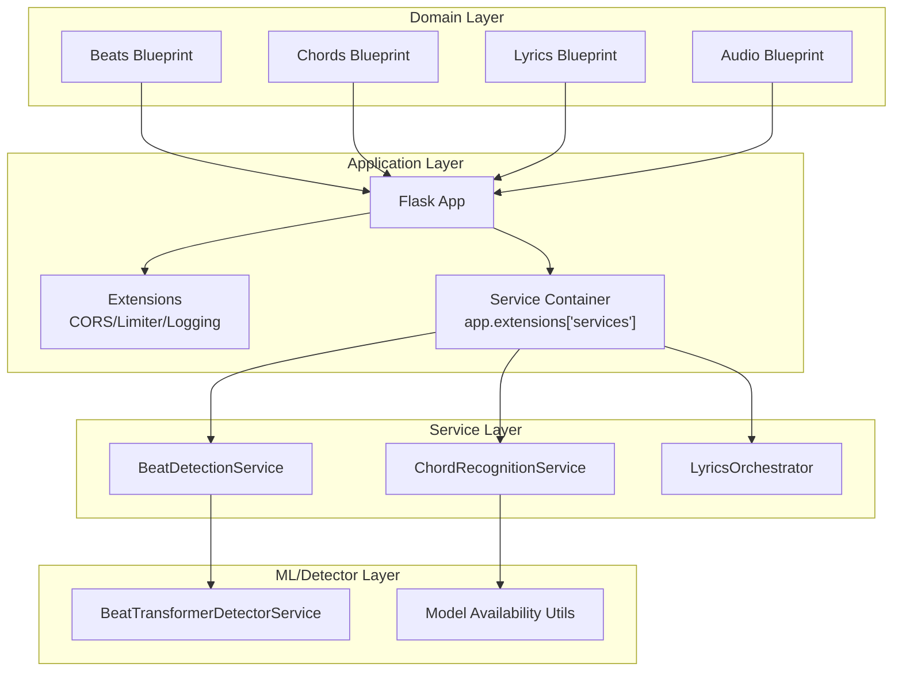
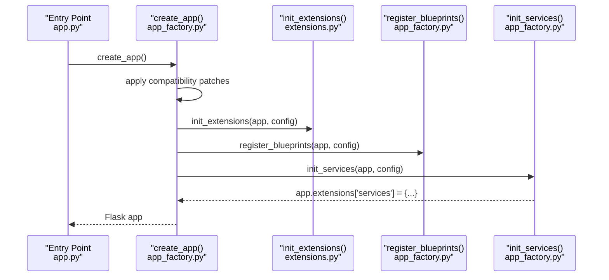
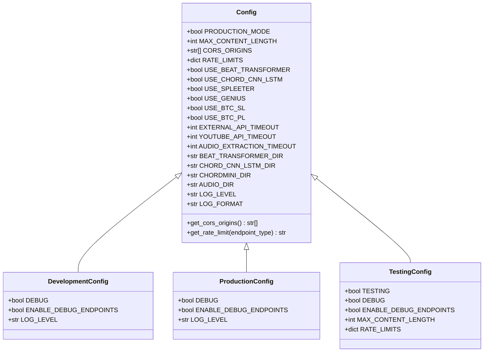
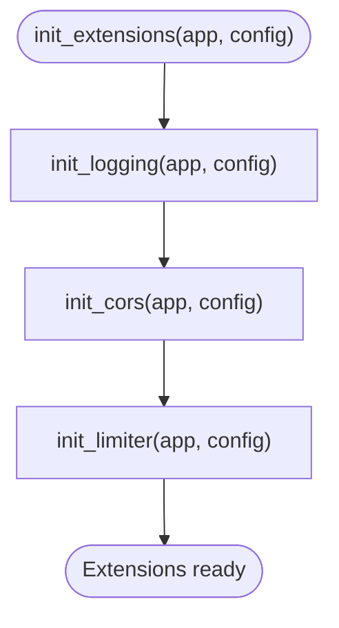
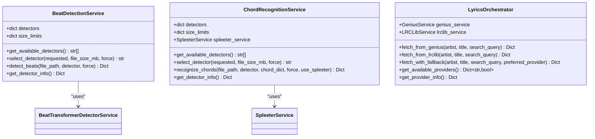
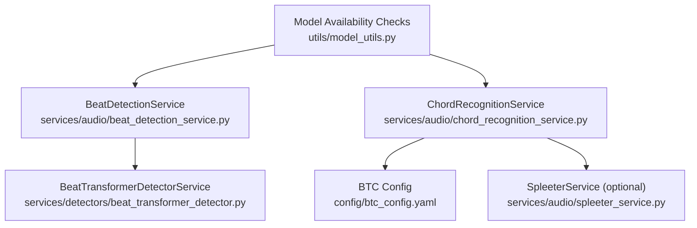
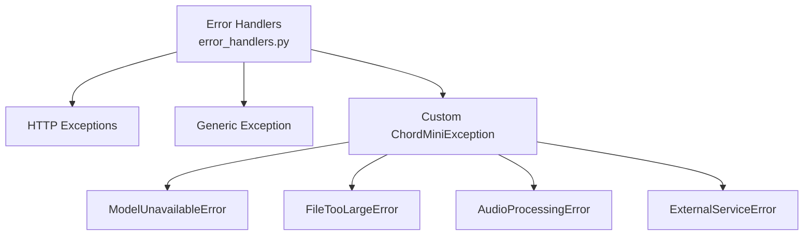
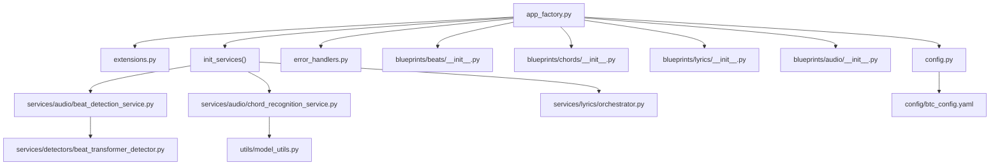

# Backend Architecture

<cite>
**Referenced Files in This Document**
- [app_factory.py](file://python_backend/app_factory.py)
- [app.py](file://python_backend/app.py)
- [config.py](file://python_backend/config.py)
- [extensions.py](file://python_backend/extensions.py)
- [error_handlers.py](file://python_backend/error_handlers.py)
- [blueprints/beats/__init__.py](file://python_backend/blueprints/beats/__init__.py)
- [blueprints/chords/__init__.py](file://python_backend/blueprints/chords/__init__.py)
- [blueprints/lyrics/__init__.py](file://python_backend/blueprints/lyrics/__init__.py)
- [blueprints/audio/__init__.py](file://python_backend/blueprints/audio/__init__.py)
- [services/audio/beat_detection_service.py](file://python_backend/services/audio/beat_detection_service.py)
- [services/audio/chord_recognition_service.py](file://python_backend/services/audio/chord_recognition_service.py)
- [services/detectors/beat_transformer_detector.py](file://python_backend/services/detectors/beat_transformer_detector.py)
- [services/lyrics/orchestrator.py](file://python_backend/services/lyrics/orchestrator.py)
- [utils/model_utils.py](file://python_backend/utils/model_utils.py)
- [config/btc_config.yaml](file://python_backend/config/btc_config.yaml)
</cite>

## Table of Contents
1. [Introduction](#introduction)
2. [Project Structure](#project-structure)
3. [Core Components](#core-components)
4. [Architecture Overview](#architecture-overview)
5. [Detailed Component Analysis](#detailed-component-analysis)
6. [Dependency Analysis](#dependency-analysis)
7. [Performance Considerations](#performance-considerations)
8. [Troubleshooting Guide](#troubleshooting-guide)
9. [Conclusion](#conclusion)

## Introduction
This document describes the backend architecture of the Flask microservices application. It focuses on the application factory pattern, blueprint-based domain organization, configuration management, extension initialization, dependency injection, machine learning model integration, service layer design, API endpoint organization, error handling, logging, middleware, and operational concerns such as rate limiting and performance optimization.

## Project Structure
The backend is organized around a Flask application factory that initializes extensions, registers blueprints, and builds a service container. Blueprints encapsulate domain-specific routes (beats, chords, lyrics, audio). Services encapsulate ML model orchestration and external integrations. Utilities provide model availability checks and configuration-driven behavior.

**Diagram sources**
- [app.py:86-87](file://python_backend/app.py#L86-L87)
- [app_factory.py:27-65](file://python_backend/app_factory.py#L27-L65)
- [extensions.py:81-92](file://python_backend/extensions.py#L81-L92)
- [blueprints/beats/__init__.py:8](file://python_backend/blueprints/beats/__init__.py#L8)
- [blueprints/chords/__init__.py:8](file://python_backend/blueprints/chords/__init__.py#L8)
- [blueprints/lyrics/__init__.py:8](file://python_backend/blueprints/lyrics/__init__.py#L8)
- [blueprints/audio/__init__.py:8](file://python_backend/blueprints/audio/__init__.py#L8)
- [services/audio/beat_detection_service.py:20-348](file://python_backend/services/audio/beat_detection_service.py#L20-L348)
- [services/audio/chord_recognition_service.py:25-322](file://python_backend/services/audio/chord_recognition_service.py#L25-L322)
- [services/detectors/beat_transformer_detector.py:15-163](file://python_backend/services/detectors/beat_transformer_detector.py#L15-L163)
- [services/lyrics/orchestrator.py:14-184](file://python_backend/services/lyrics/orchestrator.py#L14-L184)
- [utils/model_utils.py:12-326](file://python_backend/utils/model_utils.py#L12-L326)
- [config.py:16-215](file://python_backend/config.py#L16-L215)

**Section sources**
- [app.py:86-87](file://python_backend/app.py#L86-L87)
- [app_factory.py:27-65](file://python_backend/app_factory.py#L27-L65)
- [config.py:16-215](file://python_backend/config.py#L16-L215)

## Core Components
- Application Factory: Creates and configures the Flask app, initializes extensions, registers blueprints, and sets up a simple service container stored in app.extensions.
- Extensions: Centralized initialization of CORS, rate limiting, and logging.
- Configuration: Environment-aware configuration classes with feature toggles, rate limits, CORS origins, timeouts, and model paths.
- Error Handlers: Centralized JSON error responses and custom exception classes.
- Blueprints: Domain-scoped route registration for beats, chords, lyrics, audio, docs, health, and debug.
- Services: Orchestration services for beat detection, chord recognition, and lyrics with model selection, fallbacks, and normalization.
- Utilities: Model availability checks and configuration-driven behavior.

**Section sources**
- [app_factory.py:27-162](file://python_backend/app_factory.py#L27-L162)
- [extensions.py:17-93](file://python_backend/extensions.py#L17-L93)
- [config.py:16-215](file://python_backend/config.py#L16-L215)
- [error_handlers.py:13-161](file://python_backend/error_handlers.py#L13-L161)

## Architecture Overview
The backend follows a layered architecture:
- Entry point creates the app via the factory.
- Extensions are initialized with configuration-driven settings.
- Blueprints register domain routes under a common prefix.
- Services are injected into the app’s extension registry for route handlers to consume.
- Machine learning models are checked for availability at runtime; services select appropriate detectors and normalize outputs.

**Diagram sources**
- [app_factory.py:103-162](file://python_backend/app_factory.py#L103-L162)
- [extensions.py:81-93](file://python_backend/extensions.py#L81-L93)
- [services/audio/beat_detection_service.py:20-348](file://python_backend/services/audio/beat_detection_service.py#L20-L348)
- [services/audio/chord_recognition_service.py:25-322](file://python_backend/services/audio/chord_recognition_service.py#L25-L322)
- [services/detectors/beat_transformer_detector.py:15-163](file://python_backend/services/detectors/beat_transformer_detector.py#L15-L163)
- [utils/model_utils.py:12-326](file://python_backend/utils/model_utils.py#L12-L326)

## Detailed Component Analysis

### Application Factory Pattern
- Creates Flask app, applies compatibility patches, loads configuration, initializes extensions, registers blueprints, and builds a service container.
- Blueprints are registered conditionally (debug blueprint excluded in production).
- Service container is populated with services lazily and defensively, logging failures and storing placeholders when initialization fails.

**Diagram sources**
- [app.py:86-87](file://python_backend/app.py#L86-L87)
- [app_factory.py:27-65](file://python_backend/app_factory.py#L27-L65)
- [app_factory.py:68-101](file://python_backend/app_factory.py#L68-L101)
- [app_factory.py:103-162](file://python_backend/app_factory.py#L103-L162)

**Section sources**
- [app_factory.py:27-65](file://python_backend/app_factory.py#L27-L65)
- [app_factory.py:68-101](file://python_backend/app_factory.py#L68-L101)
- [app_factory.py:103-162](file://python_backend/app_factory.py#L103-L162)

### Configuration Management System
- Base Config defines environment detection, CORS origins, rate limits, feature toggles, timeouts, and model paths.
- Development, Production, and Testing subclasses adjust rate limits, debug flags, and logging levels.
- get_config selects configuration based on environment variables.

**Diagram sources**
- [config.py:16-215](file://python_backend/config.py#L16-L215)

**Section sources**
- [config.py:16-215](file://python_backend/config.py#L16-L215)

### Extension Initialization and Middleware Patterns
- CORS is initialized with dynamic origins from configuration.
- Rate limiter supports Redis-backed storage or in-memory storage depending on environment.
- Logging is configured centrally with configurable levels and formats.

**Diagram sources**
- [extensions.py:81-93](file://python_backend/extensions.py#L81-L93)
- [extensions.py:22-39](file://python_backend/extensions.py#L22-L39)
- [extensions.py:41-59](file://python_backend/extensions.py#L41-L59)
- [extensions.py:61-79](file://python_backend/extensions.py#L61-L79)

**Section sources**
- [extensions.py:17-93](file://python_backend/extensions.py#L17-L93)

### Dependency Injection and Service Container
- Services are constructed and placed into app.extensions['services'].
- BeatDetectionService, ChordRecognitionService, and LyricsOrchestrator are initialized with defensive fallbacks and logging.
- Detector services are lazily imported and instantiated as needed.

**Diagram sources**
- [services/audio/beat_detection_service.py:20-348](file://python_backend/services/audio/beat_detection_service.py#L20-L348)
- [services/audio/chord_recognition_service.py:25-322](file://python_backend/services/audio/chord_recognition_service.py#L25-L322)
- [services/detectors/beat_transformer_detector.py:15-163](file://python_backend/services/detectors/beat_transformer_detector.py#L15-L163)
- [services/lyrics/orchestrator.py:14-184](file://python_backend/services/lyrics/orchestrator.py#L14-L184)

**Section sources**
- [app_factory.py:103-162](file://python_backend/app_factory.py#L103-L162)
- [services/audio/beat_detection_service.py:20-348](file://python_backend/services/audio/beat_detection_service.py#L20-L348)
- [services/audio/chord_recognition_service.py:25-322](file://python_backend/services/audio/chord_recognition_service.py#L25-L322)
- [services/lyrics/orchestrator.py:14-184](file://python_backend/services/lyrics/orchestrator.py#L14-L184)

### Machine Learning Model Integration Architecture
- Model availability is checked without loading heavy dependencies.
- BeatTransformerDetectorService provides a normalized interface for beat detection.
- ChordRecognitionService orchestrates multiple detectors and supports optional audio separation via Spleeter.
- BTC configuration is centralized in YAML for model variants.

**Diagram sources**
- [utils/model_utils.py:12-326](file://python_backend/utils/model_utils.py#L12-L326)
- [services/audio/beat_detection_service.py:20-348](file://python_backend/services/audio/beat_detection_service.py#L20-L348)
- [services/audio/chord_recognition_service.py:25-322](file://python_backend/services/audio/chord_recognition_service.py#L25-L322)
- [services/detectors/beat_transformer_detector.py:15-163](file://python_backend/services/detectors/beat_transformer_detector.py#L15-L163)
- [config/btc_config.yaml:1-61](file://python_backend/config/btc_config.yaml#L1-L61)

**Section sources**
- [utils/model_utils.py:12-326](file://python_backend/utils/model_utils.py#L12-L326)
- [services/detectors/beat_transformer_detector.py:15-163](file://python_backend/services/detectors/beat_transformer_detector.py#L15-L163)
- [services/audio/chord_recognition_service.py:25-322](file://python_backend/services/audio/chord_recognition_service.py#L25-L322)
- [config/btc_config.yaml:1-61](file://python_backend/config/btc_config.yaml#L1-L61)

### API Endpoint Organization
- Blueprints define domain-scoped routes:
  - Beats: beat detection, model info, and related endpoints.
  - Chords: chord recognition, model info, and related endpoints.
  - Lyrics: lyrics fetching with fallback strategies.
  - Audio: audio extraction endpoints.
- Debug and docs blueprints are conditionally registered (debug only outside production).

**Section sources**
- [blueprints/beats/__init__.py:8](file://python_backend/blueprints/beats/__init__.py#L8)
- [blueprints/chords/__init__.py:8](file://python_backend/blueprints/chords/__init__.py#L8)
- [blueprints/lyrics/__init__.py:8](file://python_backend/blueprints/lyrics/__init__.py#L8)
- [blueprints/audio/__init__.py:8](file://python_backend/blueprints/audio/__init__.py#L8)
- [app_factory.py:68-101](file://python_backend/app_factory.py#L68-L101)

### Error Handling Strategies and Logging Systems
- Centralized error handlers for HTTP errors and generic exceptions, returning JSON responses with status codes.
- Custom exceptions for application-specific scenarios (model unavailability, file size limits, audio processing errors, external service errors).
- Logging utilities are used throughout services and utilities for info, debug, and error logs.

**Diagram sources**
- [error_handlers.py:13-161](file://python_backend/error_handlers.py#L13-L161)
- [error_handlers.py:96-161](file://python_backend/error_handlers.py#L96-L161)

**Section sources**
- [error_handlers.py:13-161](file://python_backend/error_handlers.py#L13-L161)

### Security Measures, Rate Limiting, and Performance Optimization
- CORS is configured dynamically from configuration with credentials support.
- Rate limiting is configured with Redis storage if available; otherwise in-memory storage.
- Feature toggles disable certain models in production to reduce resource usage.
- Model availability checks defer heavy imports and initialization to runtime for faster startup.
- Services normalize outputs and add metadata such as processing time and detector selection.

**Section sources**
- [extensions.py:22-59](file://python_backend/extensions.py#L22-L59)
- [config.py:48-70](file://python_backend/config.py#L48-L70)
- [app.py:120-121](file://python_backend/app.py#L120-L121)
- [services/audio/beat_detection_service.py:163-311](file://python_backend/services/audio/beat_detection_service.py#L163-L311)
- [services/audio/chord_recognition_service.py:173-296](file://python_backend/services/audio/chord_recognition_service.py#L173-L296)

## Dependency Analysis
The following diagram shows key dependencies among modules:

**Diagram sources**
- [app_factory.py:27-162](file://python_backend/app_factory.py#L27-L162)
- [extensions.py:81-93](file://python_backend/extensions.py#L81-L93)
- [config.py:16-215](file://python_backend/config.py#L16-L215)
- [error_handlers.py:13-161](file://python_backend/error_handlers.py#L13-L161)
- [blueprints/beats/__init__.py:8](file://python_backend/blueprints/beats/__init__.py#L8)
- [blueprints/chords/__init__.py:8](file://python_backend/blueprints/chords/__init__.py#L8)
- [blueprints/lyrics/__init__.py:8](file://python_backend/blueprints/lyrics/__init__.py#L8)
- [blueprints/audio/__init__.py:8](file://python_backend/blueprints/audio/__init__.py#L8)
- [services/audio/beat_detection_service.py:20-348](file://python_backend/services/audio/beat_detection_service.py#L20-L348)
- [services/audio/chord_recognition_service.py:25-322](file://python_backend/services/audio/chord_recognition_service.py#L25-L322)
- [services/lyrics/orchestrator.py:14-184](file://python_backend/services/lyrics/orchestrator.py#L14-L184)
- [services/detectors/beat_transformer_detector.py:15-163](file://python_backend/services/detectors/beat_transformer_detector.py#L15-L163)
- [utils/model_utils.py:12-326](file://python_backend/utils/model_utils.py#L12-L326)
- [config/btc_config.yaml:1-61](file://python_backend/config/btc_config.yaml#L1-L61)

**Section sources**
- [app_factory.py:27-162](file://python_backend/app_factory.py#L27-L162)
- [services/audio/beat_detection_service.py:20-348](file://python_backend/services/audio/beat_detection_service.py#L20-L348)
- [services/audio/chord_recognition_service.py:25-322](file://python_backend/services/audio/chord_recognition_service.py#L25-L322)
- [services/lyrics/orchestrator.py:14-184](file://python_backend/services/lyrics/orchestrator.py#L14-L184)

## Performance Considerations
- Startup-time model availability checks are deferred to runtime to minimize cold-start latency.
- Services implement file-size-aware detector selection to balance accuracy and performance.
- Normalized outputs include processing time metrics to aid monitoring and tuning.
- Rate limiting reduces load on heavy endpoints; Redis-backed storage scales horizontally.

## Troubleshooting Guide
- If beat or chord detection returns an error, verify model availability and file size limits.
- For CORS issues, confirm origins in configuration match the frontend origin.
- For rate limit errors, review endpoint-specific limits and consider Redis storage for distributed environments.
- For lyrics retrieval failures, check provider availability and API keys where applicable.

**Section sources**
- [services/audio/beat_detection_service.py:53-98](file://python_backend/services/audio/beat_detection_service.py#L53-L98)
- [services/audio/chord_recognition_service.py:61-105](file://python_backend/services/audio/chord_recognition_service.py#L61-L105)
- [extensions.py:22-59](file://python_backend/extensions.py#L22-L59)
- [error_handlers.py:48-56](file://python_backend/error_handlers.py#L48-L56)

## Conclusion
The backend employs a clean separation of concerns with an application factory, modular blueprints, and a service layer that orchestrates machine learning models and external integrations. Configuration drives behavior across environments, while extensions provide cross-cutting concerns like CORS, rate limiting, and logging. The design emphasizes resilience through fallback strategies, normalized outputs, and robust error handling.