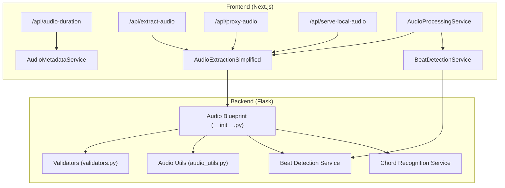
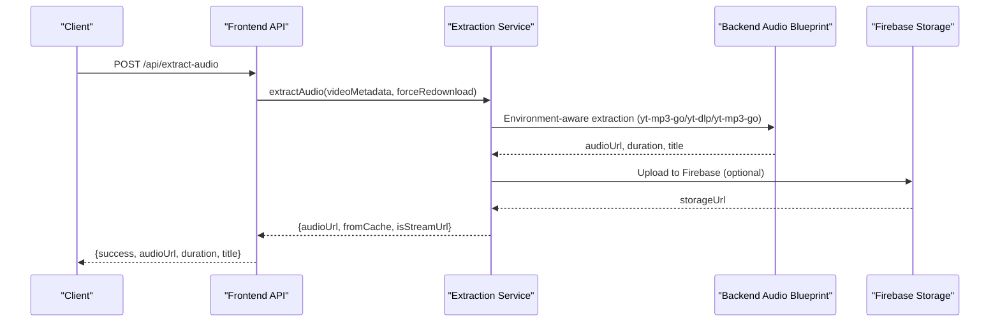
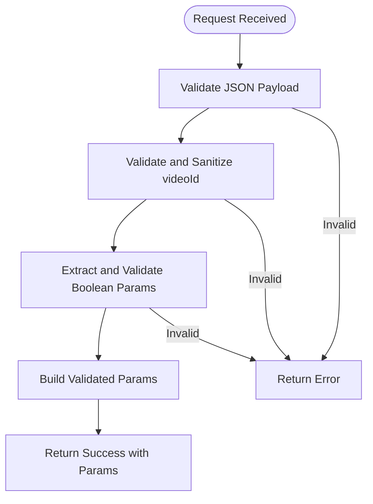
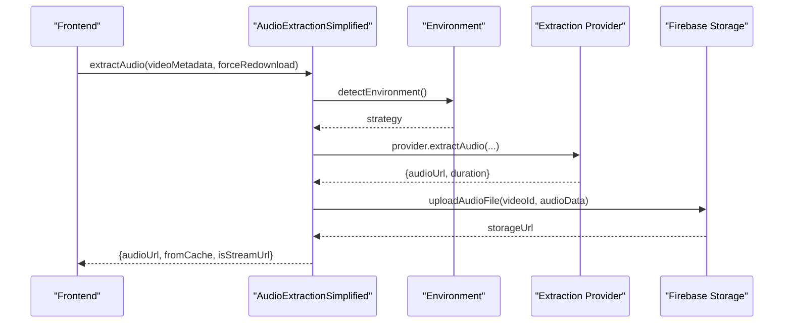
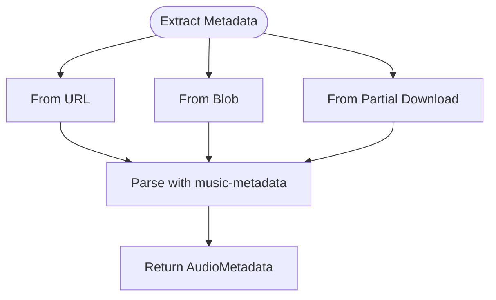
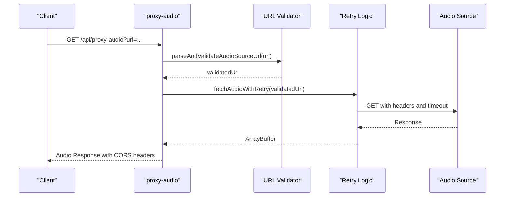
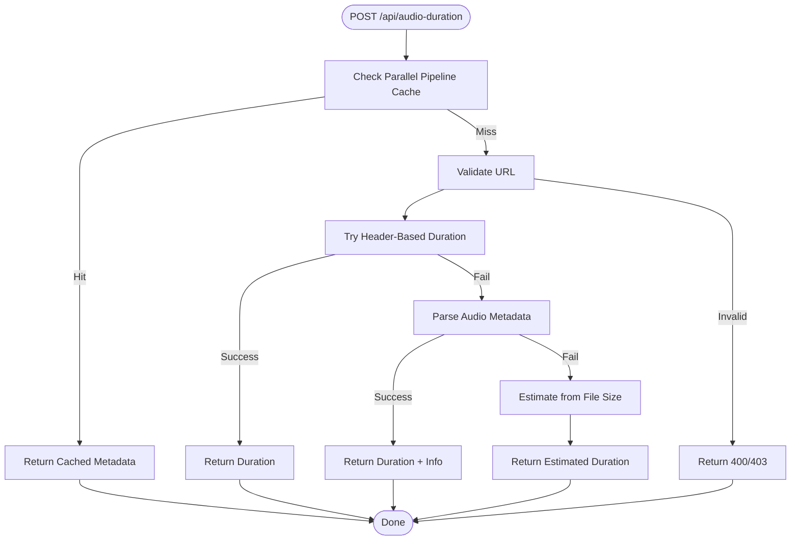
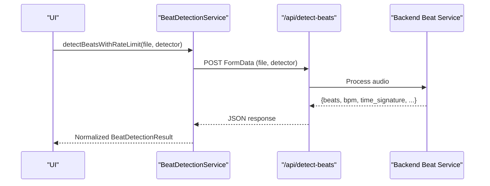
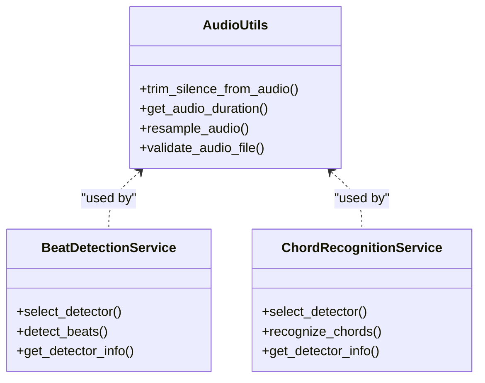
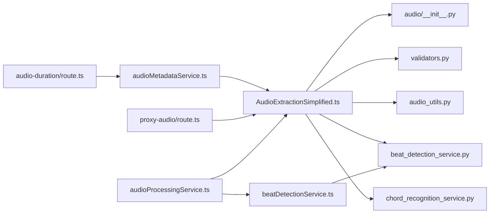

# Audio Blueprint

<cite>
**Referenced Files in This Document**
- [audio/__init__.py](file://python_backend/blueprints/audio/__init__.py)
- [validators.py](file://python_backend/blueprints/audio/validators.py)
- [audio_utils.py](file://python_backend/services/audio/audio_utils.py)
- [beat_detection_service.py](file://python_backend/services/audio/beat_detection_service.py)
- [chord_recognition_service.py](file://python_backend/services/audio/chord_recognition_service.py)
- [route.ts](file://src/app/api/audio-duration/route.ts)
- [route.ts](file://src/app/api/extract-audio/route.ts)
- [route.ts](file://src/app/api/proxy-audio/route.ts)
- [route.ts](file://src/app/api/serve-local-audio/route.ts)
- [audioExtractionSimplified.ts](file://src/services/audio/audioExtractionSimplified.ts)
- [audioMetadataService.ts](file://src/services/audio/audioMetadataService.ts)
- [beatDetectionService.ts](file://src/services/audio/beatDetectionService.ts)
- [audioProcessingService.ts](file://src/services/audio/audioProcessingService.ts)
</cite>

## Table of Contents
1. [Introduction](#introduction)
2. [Project Structure](#project-structure)
3. [Core Components](#core-components)
4. [Architecture Overview](#architecture-overview)
5. [Detailed Component Analysis](#detailed-component-analysis)
6. [Dependency Analysis](#dependency-analysis)
7. [Performance Considerations](#performance-considerations)
8. [Troubleshooting Guide](#troubleshooting-guide)
9. [Conclusion](#conclusion)

## Introduction
This document describes the audio processing blueprint that powers audio extraction, metadata detection, and audio file manipulation across the ChordMini application. It covers the backend Flask audio blueprint, the frontend Next.js API routes, and the integrated services that handle YouTube audio extraction, duration detection, proxying, and ML-powered beat/chord analysis. The blueprint emphasizes robust request validation, environment-aware extraction strategies, resilient error handling, and performance optimizations for large audio files.

## Project Structure
The audio blueprint spans two primary layers:
- Backend (Python Flask): Provides audio extraction endpoints and ML services for beat and chord analysis.
- Frontend (Next.js): Implements API routes for audio duration detection, extraction, proxying, and local development audio serving; integrates with backend services and Firebase storage.

**Diagram sources**
- [audio/__init__.py:1-11](file://python_backend/blueprints/audio/__init__.py#L1-L11)
- [validators.py:1-173](file://python_backend/blueprints/audio/validators.py#L1-L173)
- [audio_utils.py:1-131](file://python_backend/services/audio/audio_utils.py#L1-L131)
- [beat_detection_service.py:1-348](file://python_backend/services/audio/beat_detection_service.py#L1-L348)
- [chord_recognition_service.py:1-322](file://python_backend/services/audio/chord_recognition_service.py#L1-L322)
- [route.ts:1-301](file://src/app/api/audio-duration/route.ts#L1-L301)
- [route.ts:1-116](file://src/app/api/extract-audio/route.ts#L1-L138)
- [route.ts:1-496](file://src/app/api/proxy-audio/route.ts#L1-L496)
- [route.ts:1-140](file://src/app/api/serve-local-audio/route.ts#L1-L140)
- [audioExtractionSimplified.ts:1-800](file://src/services/audio/audioExtractionSimplified.ts#L1-L800)
- [audioMetadataService.ts:1-198](file://src/services/audio/audioMetadataService.ts#L1-L198)
- [beatDetectionService.ts:1-496](file://src/services/audio/beatDetectionService.ts#L1-L496)
- [audioProcessingService.ts:1-468](file://src/services/audio/audioProcessingService.ts#L1-L468)

**Section sources**
- [audio/__init__.py:1-11](file://python_backend/blueprints/audio/__init__.py#L1-L11)
- [route.ts:1-301](file://src/app/api/audio-duration/route.ts#L1-L301)
- [route.ts:1-116](file://src/app/api/extract-audio/route.ts#L1-L138)
- [route.ts:1-496](file://src/app/api/proxy-audio/route.ts#L1-L496)
- [route.ts:1-140](file://src/app/api/serve-local-audio/route.ts#L1-L140)

## Core Components
- Audio Extraction Blueprint (Flask): Provides YouTube audio extraction endpoints with validation and environment-aware strategies.
- Audio Extraction Service (Frontend): Orchestrates extraction via yt-mp3-go and yt-dlp depending on environment; caches results and uploads to Firebase.
- Audio Metadata Service (Frontend): Extracts duration and metadata from URLs or blobs with multiple fallback strategies.
- Audio Proxy Route (Frontend): Proxies audio to avoid CORS issues, with retry logic and streaming support.
- Audio Duration Route (Frontend): Detects duration via headers, metadata, or file-size estimation with prioritized cache lookups.
- Beat Detection Service (Frontend): Integrates with backend ML services for beat analysis with rate limiting and fallbacks.
- Backend Audio Utilities: Silence trimming, duration calculation, resampling, and validation helpers.
- Backend Beat/Chord Services: Model selection, size-based detector routing, and fallback strategies.

**Section sources**
- [validators.py:13-72](file://python_backend/blueprints/audio/validators.py#L13-L72)
- [audioExtractionSimplified.ts:69-120](file://src/services/audio/audioExtractionSimplified.ts#L69-L120)
- [audioMetadataService.ts:22-158](file://src/services/audio/audioMetadataService.ts#L22-L158)
- [route.ts:1-496](file://src/app/api/proxy-audio/route.ts#L1-L496)
- [route.ts:1-301](file://src/app/api/audio-duration/route.ts#L1-L301)
- [beatDetectionService.ts:179-291](file://src/services/audio/beatDetectionService.ts#L179-L291)
- [audio_utils.py:12-131](file://python_backend/services/audio/audio_utils.py#L12-L131)
- [beat_detection_service.py:20-348](file://python_backend/services/audio/beat_detection_service.py#L20-L348)
- [chord_recognition_service.py:25-322](file://python_backend/services/audio/chord_recognition_service.py#L25-L322)

## Architecture Overview
The audio blueprint follows a layered architecture:
- Frontend API routes accept requests and delegate to specialized services.
- Extraction services choose optimal providers based on environment and metadata.
- Backend services handle ML inference and audio processing with model selection and size-aware routing.
- Firebase storage provides caching and persistent audio URLs.

**Diagram sources**
- [route.ts:22-106](file://src/app/api/extract-audio/route.ts#L22-L106)
- [audioExtractionSimplified.ts:84-120](file://src/services/audio/audioExtractionSimplified.ts#L84-L120)
- [audio/__init__.py:8-10](file://python_backend/blueprints/audio/__init__.py#L8-L10)

## Detailed Component Analysis

### Audio Extraction Blueprint (Backend)
- Purpose: Provide YouTube audio extraction endpoints with validation and environment-aware strategies.
- Validation: Ensures JSON payload, validates videoId format, and sanitizes input.
- Integration: Exposes extraction endpoints consumed by frontend services.

**Diagram sources**
- [validators.py:13-72](file://python_backend/blueprints/audio/validators.py#L13-L72)

**Section sources**
- [validators.py:13-101](file://python_backend/blueprints/audio/validators.py#L13-L101)
- [audio/__init__.py:1-11](file://python_backend/blueprints/audio/__init__.py#L1-L11)

### Audio Extraction Service (Frontend)
- Strategy selection: Chooses yt-mp3-go or yt-dlp based on environment.
- Caching: Checks Firebase Storage and simplified cache before extraction.
- Storage: Uploads extracted audio to Firebase and validates URL accessibility.
- Fallbacks: Attempts multiple extraction methods and caches results.

**Diagram sources**
- [audioExtractionSimplified.ts:69-120](file://src/services/audio/audioExtractionSimplified.ts#L69-L120)
- [audioExtractionSimplified.ts:864-1083](file://src/services/audio/audioExtractionSimplified.ts#L864-L1083)

**Section sources**
- [audioExtractionSimplified.ts:69-120](file://src/services/audio/audioExtractionSimplified.ts#L69-L120)
- [audioExtractionSimplified.ts:864-1083](file://src/services/audio/audioExtractionSimplified.ts#L864-L1083)

### Audio Metadata Service (Frontend)
- Methods: Extract metadata from URL, Blob, or partial downloads.
- Strategies: Header-based duration detection, metadata parsing, and file-size estimation.
- Validation: Reasonable duration checks and safe fallbacks.

**Diagram sources**
- [audioMetadataService.ts:35-158](file://src/services/audio/audioMetadataService.ts#L35-L158)

**Section sources**
- [audioMetadataService.ts:22-198](file://src/services/audio/audioMetadataService.ts#L22-L198)

### Audio Proxy Route (Frontend)
- Purpose: Proxy audio to avoid CORS issues with external providers.
- Features: Firebase-aware retries, redirect optimization, streaming, and robust error handling.
- Security: URL validation and SSRF prevention.

**Diagram sources**
- [route.ts:121-411](file://src/app/api/proxy-audio/route.ts#L121-L411)

**Section sources**
- [route.ts:1-496](file://src/app/api/proxy-audio/route.ts#L1-L496)

### Audio Duration Route (Frontend)
- Priority cache: Uses parallel pipeline cached files when available.
- Strategies: Header-based detection, metadata parsing, file-size estimation.
- Fallbacks: Provides conservative fallback duration and detailed error reporting.

**Diagram sources**
- [route.ts:17-150](file://src/app/api/audio-duration/route.ts#L17-L150)

**Section sources**
- [route.ts:1-301](file://src/app/api/audio-duration/route.ts#L1-L301)

### Beat Detection Service (Frontend)
- Integration: Calls backend ML services via API routes with rate limiting and timeouts.
- Fallbacks: Tries madmom if Beat-Transformer fails; normalizes responses.
- Offload: Supports processing from Firebase URLs via offload service.

**Diagram sources**
- [beatDetectionService.ts:179-291](file://src/services/audio/beatDetectionService.ts#L179-L291)
- [beat_detection_service.py:163-301](file://python_backend/services/audio/beat_detection_service.py#L163-L301)

**Section sources**
- [beatDetectionService.ts:179-291](file://src/services/audio/beatDetectionService.ts#L179-L291)
- [beat_detection_service.py:20-348](file://python_backend/services/audio/beat_detection_service.py#L20-L348)

### Backend Audio Utilities and Services
- Utilities: Silence trimming, duration calculation, resampling, and validation.
- Beat/Chord Services: Automatic detector selection based on file size and availability; supports fallbacks and Spleeter integration for chord recognition.

**Diagram sources**
- [audio_utils.py:12-131](file://python_backend/services/audio/audio_utils.py#L12-L131)
- [beat_detection_service.py:20-348](file://python_backend/services/audio/beat_detection_service.py#L20-L348)
- [chord_recognition_service.py:25-322](file://python_backend/services/audio/chord_recognition_service.py#L25-L322)

**Section sources**
- [audio_utils.py:12-131](file://python_backend/services/audio/audio_utils.py#L12-L131)
- [beat_detection_service.py:20-348](file://python_backend/services/audio/beat_detection_service.py#L20-L348)
- [chord_recognition_service.py:25-322](file://python_backend/services/audio/chord_recognition_service.py#L25-L322)

## Dependency Analysis
- Frontend depends on:
  - AudioExtractionSimplified for environment-aware extraction and caching.
  - AudioMetadataService for duration and metadata detection.
  - BeatDetectionService for ML-backed beat analysis.
  - Backend audio blueprint for ML inference and audio processing.
- Backend depends on:
  - Audio validators for request sanitization.
  - Audio utilities for preprocessing and validation.
  - Detector services for beat and chord recognition.

**Diagram sources**
- [audioExtractionSimplified.ts:1-800](file://src/services/audio/audioExtractionSimplified.ts#L1-L800)
- [validators.py:1-173](file://python_backend/blueprints/audio/validators.py#L1-L173)
- [audio_utils.py:1-131](file://python_backend/services/audio/audio_utils.py#L1-L131)
- [beat_detection_service.py:1-348](file://python_backend/services/audio/beat_detection_service.py#L1-L348)
- [chord_recognition_service.py:1-322](file://python_backend/services/audio/chord_recognition_service.py#L1-L322)
- [route.ts:1-496](file://src/app/api/proxy-audio/route.ts#L1-L496)
- [route.ts:1-301](file://src/app/api/audio-duration/route.ts#L1-L301)
- [beatDetectionService.ts:1-496](file://src/services/audio/beatDetectionService.ts#L1-L496)
- [audioProcessingService.ts:1-468](file://src/services/audio/audioProcessingService.ts#L1-L468)

**Section sources**
- [audioExtractionSimplified.ts:1-800](file://src/services/audio/audioExtractionSimplified.ts#L1-L800)
- [validators.py:1-173](file://python_backend/blueprints/audio/validators.py#L1-L173)
- [audio_utils.py:1-131](file://python_backend/services/audio/audio_utils.py#L1-L131)
- [beat_detection_service.py:1-348](file://python_backend/services/audio/beat_detection_service.py#L1-L348)
- [chord_recognition_service.py:1-322](file://python_backend/services/audio/chord_recognition_service.py#L1-L322)
- [route.ts:1-496](file://src/app/api/proxy-audio/route.ts#L1-L496)
- [route.ts:1-301](file://src/app/api/audio-duration/route.ts#L1-L301)
- [beatDetectionService.ts:1-496](file://src/services/audio/beatDetectionService.ts#L1-L496)
- [audioProcessingService.ts:1-468](file://src/services/audio/audioProcessingService.ts#L1-L468)

## Performance Considerations
- Extraction strategies:
  - Browser yt-dlp with Pyodide, ffmpeg.wasm, and the YouTube media proxy is the production path.
  - Railway/server yt-dlp is not used as an automatic production fallback; local yt-dlp remains useful in development.
  - yt-mp3-go is deprecated rollback code via `NEXT_PUBLIC_AUDIO_STRATEGY=yt-mp3-go`.
  - Firebase Storage caching reduces repeated downloads; validation ensures accessibility.
- Duration detection:
  - Header-first strategy for speed; metadata parsing as fallback; file-size estimation for large-scale processing.
- Proxying:
  - Firebase-aware retries, exponential backoff for 403 errors, and streaming reads for large files.
- Beat/Chord analysis:
  - Automatic detector selection based on file size; fallbacks minimize failure rates.
- Frontend services:
  - Rate limiting and timeouts for ML requests; offload processing for large files.

[No sources needed since this section provides general guidance]

## Troubleshooting Guide
- Audio extraction failures:
  - Verify environment strategy and service availability; check Firebase initialization and storage credentials.
  - Use fallback extraction methods and inspect logs for detailed errors.
- Duration detection issues:
  - Confirm URL validity; ensure headers provide duration; validate metadata parsing; use file-size estimation as last resort.
- Proxy errors:
  - Inspect 403 errors for Firebase upload in-progress; adjust retry counts and timeouts; validate URL encoding for special providers.
- Beat/Chord analysis:
  - Ensure backend ML services are reachable; confirm detector availability; use fallback detectors for large files.
- Local development:
  - Use serve-local-audio route only in development; restrict filenames and extensions for security.

**Section sources**
- [audioExtractionSimplified.ts:1490-1599](file://src/services/audio/audioExtractionSimplified.ts#L1490-L1599)
- [route.ts:125-133](file://src/app/api/audio-duration/route.ts#L125-L133)
- [route.ts:54-109](file://src/app/api/proxy-audio/route.ts#L54-L109)
- [beatDetectionService.ts:232-251](file://src/services/audio/beatDetectionService.ts#L232-L251)
- [route.ts:17-120](file://src/app/api/serve-local-audio/route.ts#L17-L120)

## Conclusion
The audio blueprint integrates frontend API routes, extraction services, and backend ML services to deliver robust audio processing. It emphasizes environment-aware strategies, resilient caching, and multiple fallbacks to ensure reliability across diverse scenarios. The modular design enables easy maintenance and extension of audio-related workflows.
