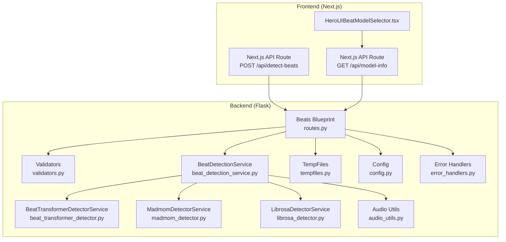
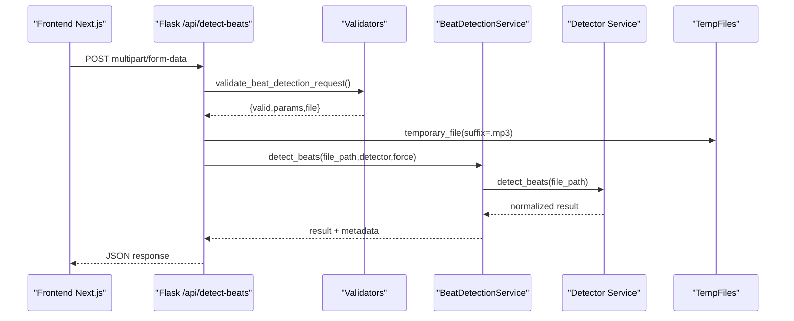
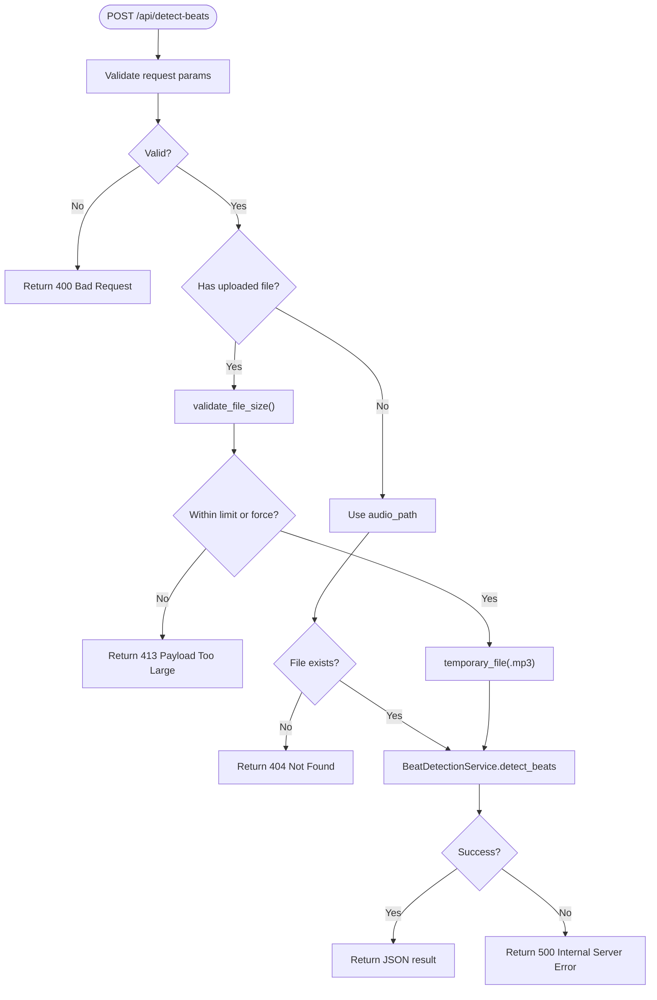
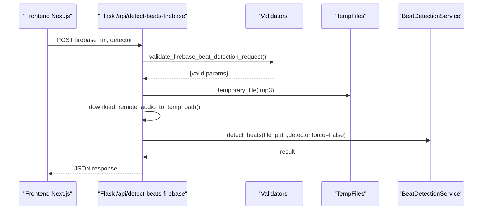
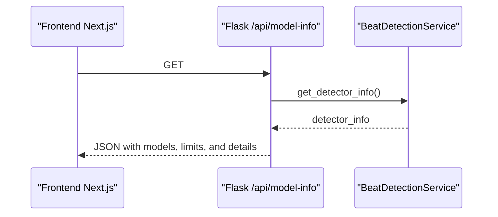
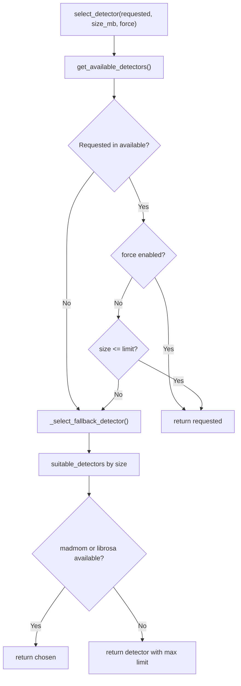
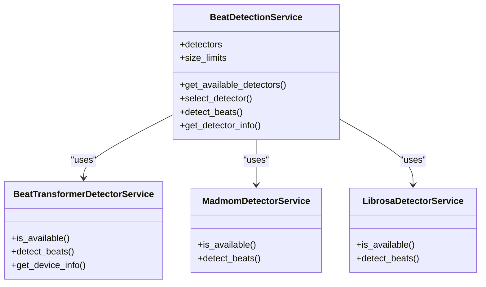
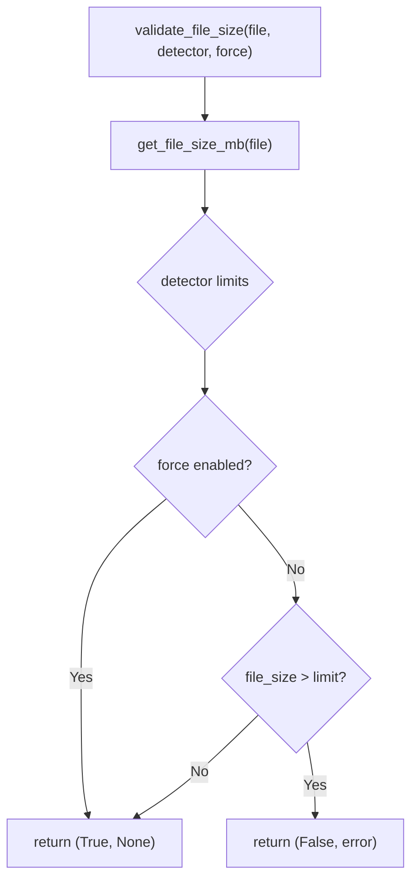
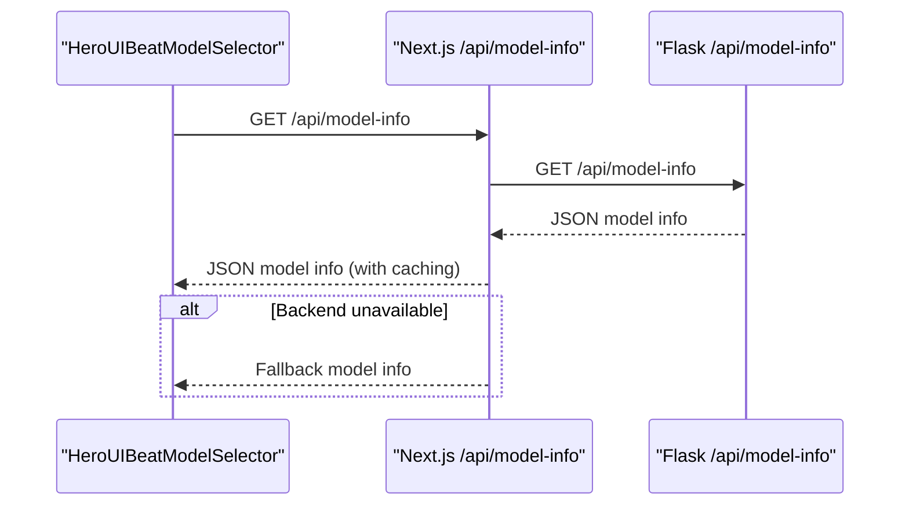
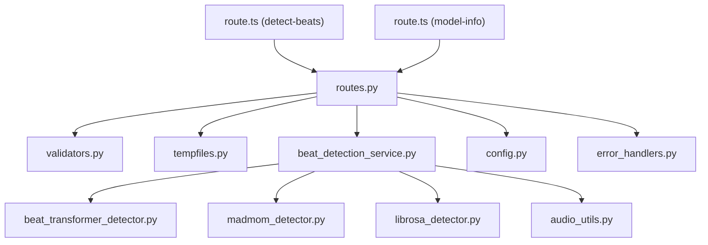

# Beats Blueprint

<cite>
**Referenced Files in This Document**
- [routes.py](file://python_backend/blueprints/beats/routes.py)
- [validators.py](file://python_backend/blueprints/beats/validators.py)
- [beat_detection_service.py](file://python_backend/services/audio/beat_detection_service.py)
- [beat_transformer_detector.py](file://python_backend/services/detectors/beat_transformer_detector.py)
- [madmom_detector.py](file://python_backend/services/detectors/madmom_detector.py)
- [librosa_detector.py](file://python_backend/services/detectors/librosa_detector.py)
- [tempfiles.py](file://python_backend/services/audio/tempfiles.py)
- [audio_utils.py](file://python_backend/services/audio/audio_utils.py)
- [config.py](file://python_backend/config.py)
- [error_handlers.py](file://python_backend/error_handlers.py)
- [route.ts (detect-beats)](file://src/app/api/detect-beats/route.ts)
- [route.ts (model-info)](file://src/app/api/model-info/route.ts)
- [HeroUIBeatModelSelector.tsx](file://src/components/analysis/HeroUIBeatModelSelector.tsx)
- [segmentationAsyncService.ts](file://src/services/api/segmentationAsyncService.ts)
</cite>

## Table of Contents
1. [Introduction](#introduction)
2. [Project Structure](#project-structure)
3. [Core Components](#core-components)
4. [Architecture Overview](#architecture-overview)
5. [Detailed Component Analysis](#detailed-component-analysis)
6. [Dependency Analysis](#dependency-analysis)
7. [Performance Considerations](#performance-considerations)
8. [Troubleshooting Guide](#troubleshooting-guide)
9. [Conclusion](#conclusion)
10. [Appendices](#appendices)

## Introduction
This document provides comprehensive documentation for the beats detection blueprint. It covers the three primary endpoints for beat detection, the underlying detector services, validation and rate-limiting mechanisms, temporary file management, and frontend integration patterns. It also explains the detector selection logic, error handling strategies, and practical usage examples.

## Project Structure
The beats detection feature spans both the Python backend and the Next.js frontend:
- Python backend exposes REST endpoints under the beats blueprint and orchestrates detector services.
- Frontend integrates with these endpoints via Next.js API routes and UI components.

**Diagram sources**
- [routes.py:1-521](file://python_backend/blueprints/beats/routes.py#L1-L521)
- [validators.py:1-141](file://python_backend/blueprints/beats/validators.py#L1-L141)
- [beat_detection_service.py:1-348](file://python_backend/services/audio/beat_detection_service.py#L1-L348)
- [beat_transformer_detector.py:1-163](file://python_backend/services/detectors/beat_transformer_detector.py#L1-L163)
- [madmom_detector.py:1-158](file://python_backend/services/detectors/madmom_detector.py#L1-L158)
- [librosa_detector.py:1-124](file://python_backend/services/detectors/librosa_detector.py#L1-L124)
- [tempfiles.py:1-136](file://python_backend/services/audio/tempfiles.py#L1-L136)
- [audio_utils.py:1-131](file://python_backend/services/audio/audio_utils.py#L1-L131)
- [config.py:1-215](file://python_backend/config.py#L1-L215)
- [error_handlers.py:1-161](file://python_backend/error_handlers.py#L1-L161)
- [route.ts (detect-beats):1-235](file://src/app/api/detect-beats/route.ts#L1-L235)
- [route.ts (model-info):1-127](file://src/app/api/model-info/route.ts#L1-L127)
- [HeroUIBeatModelSelector.tsx:1-209](file://src/components/analysis/HeroUIBeatModelSelector.tsx#L1-L209)

**Section sources**
- [routes.py:1-521](file://python_backend/blueprints/beats/routes.py#L1-L521)
- [config.py:1-215](file://python_backend/config.py#L1-L215)

## Core Components
- Endpoints:
  - POST /api/detect-beats: Analyze uploaded or local audio files.
  - POST /api/detect-beats-firebase: Analyze audio referenced by a Firebase Storage URL.
  - GET /api/model-info: Retrieve model availability and configuration.
  - GET /api/test-beat-transformer, GET /api/test-madmom, GET /api/test-librosa, GET /api/test-all-models, GET /api/test-dbn-isolation: Health and capability checks for detectors.
- Detector Services:
  - Beat-Transformer: Deep learning model with flexible time signatures; slower.
  - Madmom: Neural network with high accuracy and speed; optimized for common time signatures.
  - Librosa: Classical signal processing approach; fast but basic accuracy.
- Validation and Limits:
  - Request parameter validation, file size checks, and optional force flag.
  - Rate limiting per endpoint category.
- Temporary File Management:
  - Safe creation and cleanup of temporary audio files.
- Frontend Integration:
  - Next.js API routes with timeouts and fallbacks.
  - UI component for model selection with availability hints.

**Section sources**
- [routes.py:40-250](file://python_backend/blueprints/beats/routes.py#L40-L250)
- [validators.py:13-141](file://python_backend/blueprints/beats/validators.py#L13-L141)
- [beat_detection_service.py:20-348](file://python_backend/services/audio/beat_detection_service.py#L20-L348)
- [madmom_detector.py:14-158](file://python_backend/services/detectors/madmom_detector.py#L14-L158)
- [librosa_detector.py:14-124](file://python_backend/services/detectors/librosa_detector.py#L14-L124)
- [beat_transformer_detector.py:15-163](file://python_backend/services/detectors/beat_transformer_detector.py#L15-L163)
- [tempfiles.py:15-136](file://python_backend/services/audio/tempfiles.py#L15-L136)
- [config.py:47-102](file://python_backend/config.py#L47-L102)
- [route.ts (detect-beats):1-235](file://src/app/api/detect-beats/route.ts#L1-L235)
- [route.ts (model-info):1-127](file://src/app/api/model-info/route.ts#L1-L127)
- [HeroUIBeatModelSelector.tsx:1-209](file://src/components/analysis/HeroUIBeatModelSelector.tsx#L1-L209)

## Architecture Overview
The system follows a layered architecture:
- Frontend Next.js API routes receive requests and forward them to the Flask backend.
- Flask routes validate inputs, enforce rate limits, manage temporary files, and delegate to the BeatDetectionService.
- BeatDetectionService selects an appropriate detector based on availability and file size, then executes detection.
- Detectors return normalized results that include beats, downbeats, BPM, time signature, durations, and processing metrics.

**Diagram sources**
- [routes.py:40-120](file://python_backend/blueprints/beats/routes.py#L40-L120)
- [validators.py:13-52](file://python_backend/blueprints/beats/validators.py#L13-L52)
- [beat_detection_service.py:163-311](file://python_backend/services/audio/beat_detection_service.py#L163-L311)
- [tempfiles.py:15-51](file://python_backend/services/audio/tempfiles.py#L15-L51)

## Detailed Component Analysis

### Endpoint: POST /api/detect-beats
- Purpose: Analyze an audio file (uploaded or local path) and return beats and downbeats.
- Request:
  - multipart/form-data with file or audio_path.
  - detector: 'beat-transformer', 'madmom', 'librosa', or 'auto'.
  - force: 'true' to bypass size limits for the requested detector.
- Validation:
  - Ensures either file upload or audio_path is present.
  - Validates detector and force parameters.
  - Enforces file size limits based on detector and force.
- Processing:
  - Creates a temporary MP3 file if a file is uploaded.
  - Delegates to BeatDetectionService.detect_beats.
  - Returns normalized JSON with success flag and timing metrics.
- Error Handling:
  - 400 for invalid requests.
  - 413 for oversized files.
  - 500 for internal failures.
  - Rate limit enforced globally.

**Diagram sources**
- [routes.py:40-120](file://python_backend/blueprints/beats/routes.py#L40-L120)
- [validators.py:13-141](file://python_backend/blueprints/beats/validators.py#L13-L141)
- [tempfiles.py:15-51](file://python_backend/services/audio/tempfiles.py#L15-L51)
- [beat_detection_service.py:163-311](file://python_backend/services/audio/beat_detection_service.py#L163-L311)

**Section sources**
- [routes.py:40-120](file://python_backend/blueprints/beats/routes.py#L40-L120)
- [validators.py:13-141](file://python_backend/blueprints/beats/validators.py#L13-L141)
- [tempfiles.py:15-51](file://python_backend/services/audio/tempfiles.py#L15-L51)
- [beat_detection_service.py:163-311](file://python_backend/services/audio/beat_detection_service.py#L163-L311)

### Endpoint: POST /api/detect-beats-firebase
- Purpose: Download audio from a Firebase Storage URL and analyze it.
- Request:
  - firebase_url and detector.
- Processing:
  - Streams download to a temporary file.
  - Runs BeatDetectionService.detect_beats with force disabled (auto size handling).
- Error Handling:
  - 400 for download failures.
  - 500 for internal errors.

**Diagram sources**
- [routes.py:122-180](file://python_backend/blueprints/beats/routes.py#L122-L180)
- [validators.py:54-81](file://python_backend/blueprints/beats/validators.py#L54-L81)
- [tempfiles.py:15-51](file://python_backend/services/audio/tempfiles.py#L15-L51)
- [beat_detection_service.py:163-311](file://python_backend/services/audio/beat_detection_service.py#L163-L311)

**Section sources**
- [routes.py:122-180](file://python_backend/blueprints/beats/routes.py#L122-L180)
- [validators.py:54-81](file://python_backend/blueprints/beats/validators.py#L54-L81)
- [tempfiles.py:15-51](file://python_backend/services/audio/tempfiles.py#L15-L51)
- [beat_detection_service.py:163-311](file://python_backend/services/audio/beat_detection_service.py#L163-L311)

### Endpoint: GET /api/model-info
- Purpose: Return model availability, default model, and capabilities.
- Response includes:
  - Available detectors and default beat model.
  - Per-detector size limits and availability flags.
  - Detailed model info (names, descriptions, performance).
  - Detector details from BeatDetectionService.

**Diagram sources**
- [routes.py:182-250](file://python_backend/blueprints/beats/routes.py#L182-L250)
- [beat_detection_service.py:312-348](file://python_backend/services/audio/beat_detection_service.py#L312-L348)

**Section sources**
- [routes.py:182-250](file://python_backend/blueprints/beats/routes.py#L182-L250)
- [beat_detection_service.py:312-348](file://python_backend/services/audio/beat_detection_service.py#L312-L348)

### Detector Selection Logic
BeatDetectionService.select_detector chooses the best detector based on:
- Requested detector availability and file size.
- Force flag to bypass size limits.
- Auto-selection preference order: madmom > beat-transformer > librosa, considering size limits.

**Diagram sources**
- [beat_detection_service.py:53-162](file://python_backend/services/audio/beat_detection_service.py#L53-L162)

**Section sources**
- [beat_detection_service.py:53-162](file://python_backend/services/audio/beat_detection_service.py#L53-L162)

### Detector Services
- Beat-Transformer Detector:
  - Availability checked via import and model readiness.
  - Normalized output includes beats, downbeats, BPM, time signature, duration, processing time.
  - Device info retrieval for diagnostics.
- Madmom Detector:
  - Uses RNN activation and DBN tracking.
  - Heuristic downbeat candidates for 3/4 and 4/4; default 4/4 kept for backward compatibility.
  - Returns processing time and candidate metadata.
- Librosa Detector:
  - Standard librosa.beat.beat_track with simple heuristic for downbeats.
  - Returns tempo, beats, downbeats, duration, processing time.

**Diagram sources**
- [beat_detection_service.py:20-348](file://python_backend/services/audio/beat_detection_service.py#L20-L348)
- [beat_transformer_detector.py:15-163](file://python_backend/services/detectors/beat_transformer_detector.py#L15-L163)
- [madmom_detector.py:14-158](file://python_backend/services/detectors/madmom_detector.py#L14-L158)
- [librosa_detector.py:14-124](file://python_backend/services/detectors/librosa_detector.py#L14-L124)

**Section sources**
- [beat_transformer_detector.py:15-163](file://python_backend/services/detectors/beat_transformer_detector.py#L15-L163)
- [madmom_detector.py:14-158](file://python_backend/services/detectors/madmom_detector.py#L14-L158)
- [librosa_detector.py:14-124](file://python_backend/services/detectors/librosa_detector.py#L14-L124)

### Request Validation Patterns and File Size Limits
- validate_beat_detection_request:
  - Accepts file or audio_path.
  - Validates detector and force parameters.
- validate_firebase_beat_detection_request:
  - Requires firebase_url and validates detector.
- validate_file_size:
  - Enforces per-detector size limits.
  - Allows force=true to bypass limits for the requested detector.
  - For 'auto', suggests alternatives for large files.

**Diagram sources**
- [validators.py:106-141](file://python_backend/blueprints/beats/validators.py#L106-L141)

**Section sources**
- [validators.py:13-141](file://python_backend/blueprints/beats/validators.py#L13-L141)

### Rate Limiting Configuration
- Categories:
  - heavy_processing: Beat detection and similar heavy tasks.
  - moderate_processing: Lyrics and external API calls.
  - light_processing: Model info and availability checks.
  - test: Dedicated category for model testing endpoints.
- Defaults vary by environment (development, production, testing).
- Applied via Flask-Redis-Limiter decorators on endpoints.

**Section sources**
- [config.py:47-102](file://python_backend/config.py#L47-L102)
- [routes.py:41-183](file://python_backend/blueprints/beats/routes.py#L41-L183)

### Temporary File Management
- temporary_file context manager:
  - Creates named temporary files with configurable suffix/prefix.
  - Ensures cleanup on exit, logging failures.
- temporary_audio_file:
  - Specialized for audio with .mp3 suffix.
- cleanup_temp_file and get_temp_file_path:
  - Manual cleanup and path generation utilities.

**Section sources**
- [tempfiles.py:15-136](file://python_backend/services/audio/tempfiles.py#L15-L136)

### Frontend Integration and Examples
- Next.js API Route (POST /api/detect-beats):
  - Proxies to backend with extended timeout.
  - Handles fallback to madmom when Beat-Transformer checkpoint is unavailable.
  - Provides detailed error messages for 413, 403, and timeouts.
- Next.js API Route (GET /api/model-info):
  - Attempts backend call with timeout; falls back to cached/fallback model info.
- UI Component (HeroUIBeatModelSelector):
  - Renders model selector with availability and descriptions.
  - Prefers available models and provides tooltips with descriptions.
- Async Job Service:
  - Handles long-running jobs when timeouts are exceeded.

**Diagram sources**
- [route.ts (model-info):1-127](file://src/app/api/model-info/route.ts#L1-L127)
- [routes.py:182-250](file://python_backend/blueprints/beats/routes.py#L182-L250)
- [HeroUIBeatModelSelector.tsx:1-209](file://src/components/analysis/HeroUIBeatModelSelector.tsx#L1-L209)

**Section sources**
- [route.ts (detect-beats):1-235](file://src/app/api/detect-beats/route.ts#L1-L235)
- [route.ts (model-info):1-127](file://src/app/api/model-info/route.ts#L1-L127)
- [HeroUIBeatModelSelector.tsx:1-209](file://src/components/analysis/HeroUIBeatModelSelector.tsx#L1-L209)
- [segmentationAsyncService.ts:1-211](file://src/services/api/segmentationAsyncService.ts#L1-L211)

## Dependency Analysis
- Coupling:
  - Routes depend on validators, BeatDetectionService, and tempfiles.
  - BeatDetectionService depends on detector services and audio utilities.
  - Frontend routes depend on backend endpoints and environment configuration.
- Cohesion:
  - Each detector service encapsulates its own availability and detection logic.
- External Dependencies:
  - Madmom, Librosa, and Beat-Transformer libraries.
  - Redis for rate limiting.
  - Firebase Storage for remote audio downloads.

**Diagram sources**
- [routes.py:1-521](file://python_backend/blueprints/beats/routes.py#L1-L521)
- [validators.py:1-141](file://python_backend/blueprints/beats/validators.py#L1-L141)
- [beat_detection_service.py:1-348](file://python_backend/services/audio/beat_detection_service.py#L1-L348)
- [beat_transformer_detector.py:1-163](file://python_backend/services/detectors/beat_transformer_detector.py#L1-L163)
- [madmom_detector.py:1-158](file://python_backend/services/detectors/madmom_detector.py#L1-L158)
- [librosa_detector.py:1-124](file://python_backend/services/detectors/librosa_detector.py#L1-L124)
- [tempfiles.py:1-136](file://python_backend/services/audio/tempfiles.py#L1-L136)
- [audio_utils.py:1-131](file://python_backend/services/audio/audio_utils.py#L1-L131)
- [config.py:1-215](file://python_backend/config.py#L1-L215)
- [error_handlers.py:1-161](file://python_backend/error_handlers.py#L1-L161)
- [route.ts (detect-beats):1-235](file://src/app/api/detect-beats/route.ts#L1-L235)
- [route.ts (model-info):1-127](file://src/app/api/model-info/route.ts#L1-L127)

**Section sources**
- [routes.py:1-521](file://python_backend/blueprints/beats/routes.py#L1-L521)
- [beat_detection_service.py:1-348](file://python_backend/services/audio/beat_detection_service.py#L1-L348)

## Performance Considerations
- Detector Preferences:
  - Madmom is recommended for small files and common time signatures.
  - Beat-Transformer offers flexibility but is slower; suitable for moderate files when accuracy is prioritized.
  - Librosa is fastest but less accurate; suitable for large files or quick heuristics.
- File Size Limits:
  - Respect per-detector limits; use force only when necessary.
- Processing Metrics:
  - Responses include processing_time and total_processing_time for monitoring.
- Frontend Timeouts:
  - Extended timeouts in Next.js routes accommodate long-running ML inference.

[No sources needed since this section provides general guidance]

## Troubleshooting Guide
- 413 Payload Too Large:
  - Reduce file size or choose a larger-capacity detector; use force only when appropriate.
- 403 Forbidden:
  - Indicates backend accessibility issues; check port conflicts (e.g., AirTunes interception).
- Timeout Errors:
  - Long processing times; shorten audio length or use faster detector.
- Model Unavailable:
  - Beat-Transformer checkpoint issues trigger automatic fallback to madmom in frontend route.
- Error Handlers:
  - Centralized JSON error responses for 400, 404, 413, 429, 500 with structured messages.

**Section sources**
- [error_handlers.py:21-91](file://python_backend/error_handlers.py#L21-L91)
- [route.ts (detect-beats):132-221](file://src/app/api/detect-beats/route.ts#L132-L221)
- [routes.py:105-119](file://python_backend/blueprints/beats/routes.py#L105-L119)

## Conclusion
The beats detection blueprint provides a robust, modular system for beat and downbeat detection across multiple detectors, with strong validation, rate limiting, and frontend integration. The detector selection logic balances accuracy, speed, and capacity, while temporary file management and error handling ensure reliability. Frontend routes offer resilient fallbacks and helpful error messaging for a smooth user experience.

[No sources needed since this section summarizes without analyzing specific files]

## Appendices

### API Definitions and Examples

- POST /api/detect-beats
  - Body: multipart/form-data
    - file: audio file (optional if audio_path provided)
    - audio_path: path to existing audio file (optional if file provided)
    - detector: 'beat-transformer' | 'madmom' | 'librosa' | 'auto'
    - force: 'true' to bypass size limits for requested detector
  - Example request:
    - curl -X POST -F "file=@track.mp3" -F "detector=auto" http://localhost:5000/api/detect-beats
  - Example response (success):
    - {
        "success": true,
        "beats": [0.5, 1.2, 2.1, ...],
        "downbeats": [0.0, 2.0, 4.0, ...],
        "bpm": 120.0,
        "time_signature": "4/4",
        "duration": 180.5,
        "processing_time": 4.2,
        "total_processing_time": 5.1
      }

- POST /api/detect-beats-firebase
  - Body: form-data
    - firebase_url: Firebase Storage URL
    - detector: 'beat-transformer' | 'madmom' | 'librosa' | 'auto'
  - Example request:
    - curl -X POST -F "firebase_url=https://firebasestorage.googleapis.com/..." -F "detector=madmom" http://localhost:5000/api/detect-beats-firebase

- GET /api/model-info
  - Response includes:
    - default_beat_model, available_beat_models, file_size_limits, beat_model_info, detector_details

- Testing Endpoints
  - GET /api/test-beat-transformer
  - GET /api/test-madmom
  - GET /api/test-librosa
  - GET /api/test-all-models
  - GET /api/test-dbn-isolation

**Section sources**
- [routes.py:40-250](file://python_backend/blueprints/beats/routes.py#L40-L250)
- [validators.py:13-81](file://python_backend/blueprints/beats/validators.py#L13-L81)
- [route.ts (detect-beats):74-192](file://src/app/api/detect-beats/route.ts#L74-L192)
- [route.ts (model-info):13-36](file://src/app/api/model-info/route.ts#L13-L36)