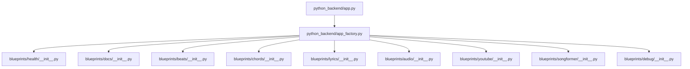
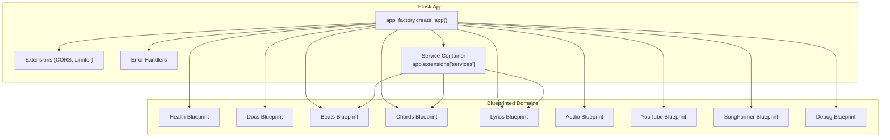
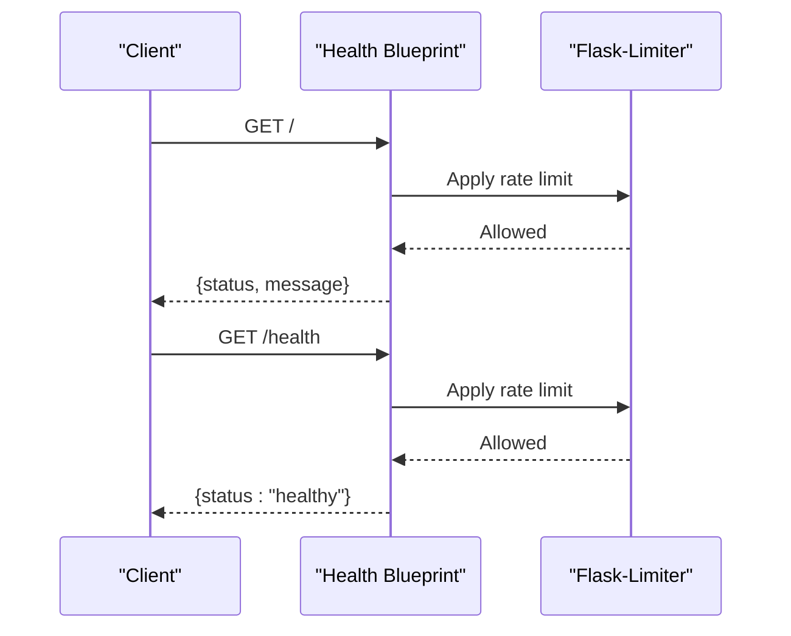
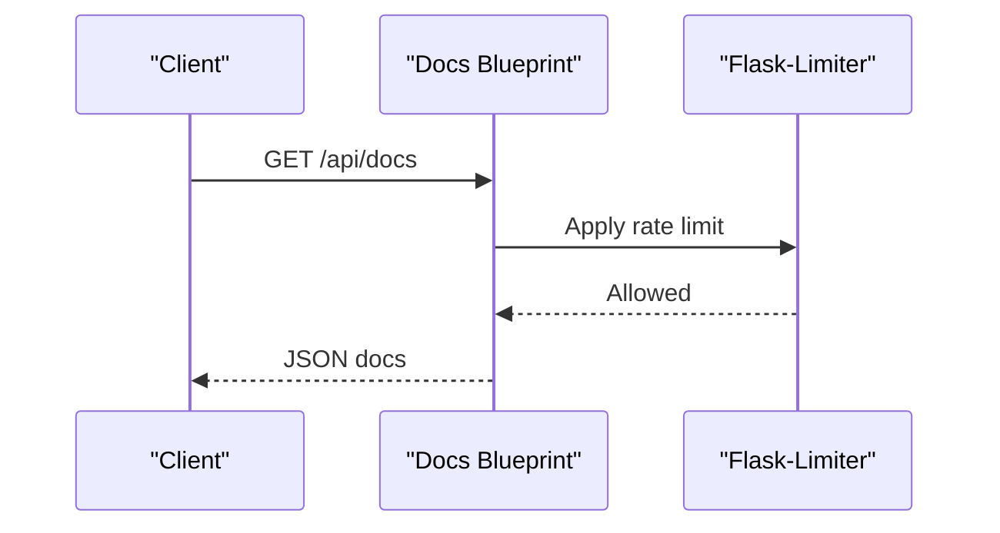
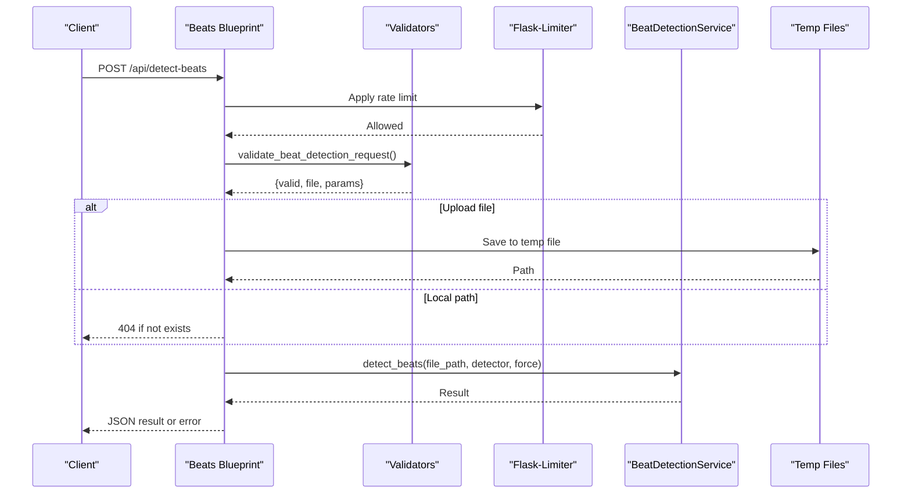
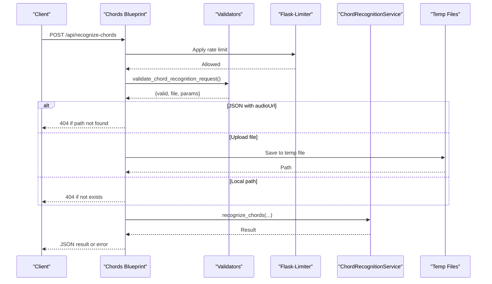
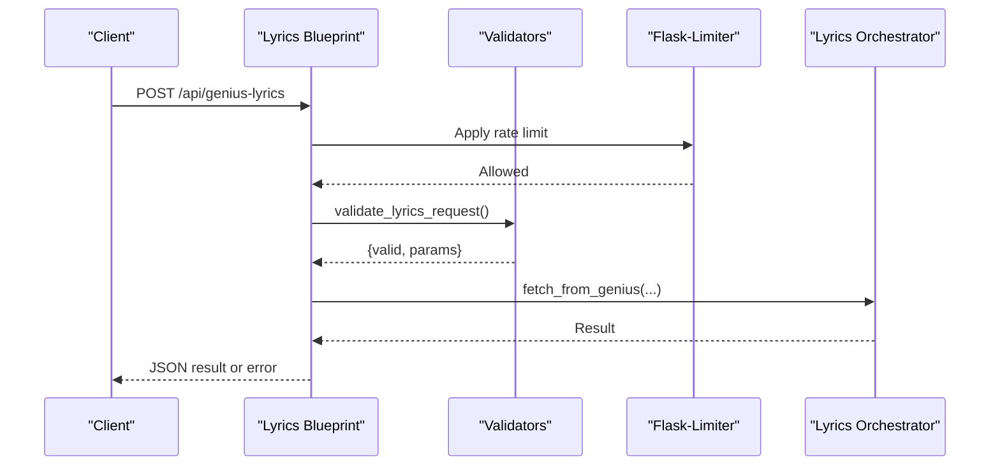
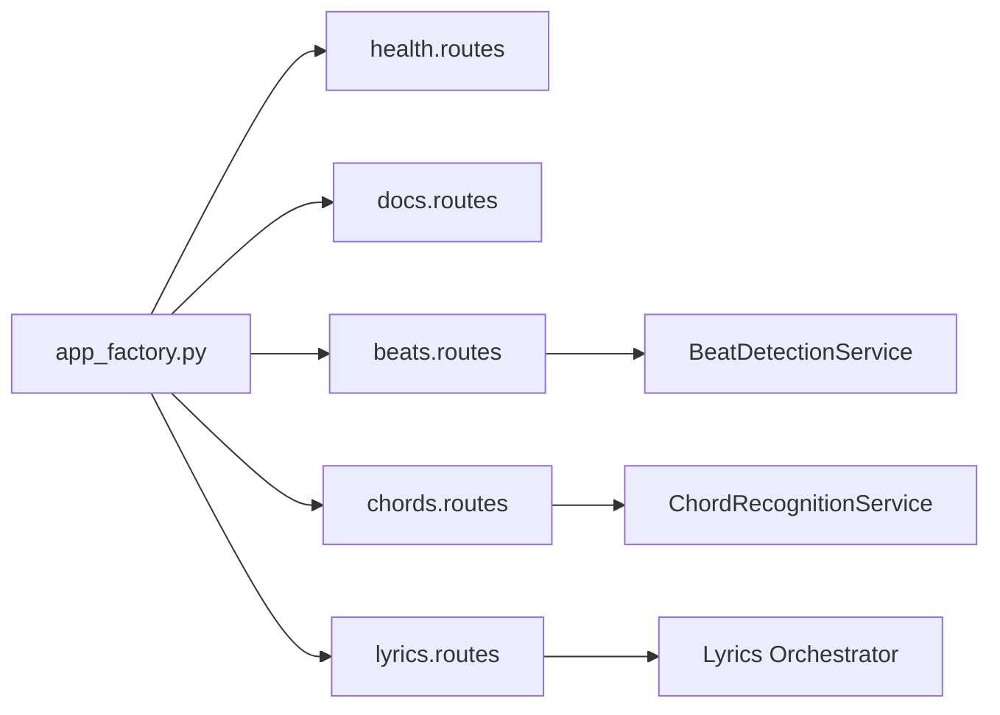

# Blueprint Organization

<cite>
**Referenced Files in This Document**
- [app.py](file://python_backend/app.py)
- [app_factory.py](file://python_backend/app_factory.py)
- [blueprints/beats/__init__.py](file://python_backend/blueprints/beats/__init__.py)
- [blueprints/beats/routes.py](file://python_backend/blueprints/beats/routes.py)
- [blueprints/chords/__init__.py](file://python_backend/blueprints/chords/__init__.py)
- [blueprints/chords/routes.py](file://python_backend/blueprints/chords/routes.py)
- [blueprints/lyrics/__init__.py](file://python_backend/blueprints/lyrics/__init__.py)
- [blueprints/lyrics/routes.py](file://python_backend/blueprints/lyrics/routes.py)
- [blueprints/health/__init__.py](file://python_backend/blueprints/health/__init__.py)
- [blueprints/health/routes.py](file://python_backend/blueprints/health/routes.py)
- [blueprints/docs/__init__.py](file://python_backend/blueprints/docs/__init__.py)
- [blueprints/docs/routes.py](file://python_backend/blueprints/docs/routes.py)
</cite>

## Table of Contents
1. [Introduction](#introduction)
2. [Project Structure](#project-structure)
3. [Core Components](#core-components)
4. [Architecture Overview](#architecture-overview)
5. [Detailed Component Analysis](#detailed-component-analysis)
6. [Dependency Analysis](#dependency-analysis)
7. [Performance Considerations](#performance-considerations)
8. [Troubleshooting Guide](#troubleshooting-guide)
9. [Conclusion](#conclusion)

## Introduction
This document explains the Flask blueprint-based service organization used in the Python backend. It covers how the application is structured around modular blueprints for different service domains (beats, chords, lyrics, audio processing, YouTube integration, health monitoring, and documentation). It also documents the blueprint registration process, URL prefix organization, inter-blueprint communication patterns, routing organization, request validation, error handling strategies, service boundaries, and API endpoint organization. Finally, it outlines the scalability benefits of this modular approach and how to add new services following established patterns.

## Project Structure
The Python backend organizes functionality into discrete Flask blueprints under the blueprints/ directory. Each domain encapsulates its routes and validators, and the application factory registers them centrally. The top-level app.py delegates creation and configuration to the factory and initializes compatibility patches and service containers.

**Diagram sources**
- [app.py:1-186](file://python_backend/app.py#L1-L186)
- [app_factory.py:68-101](file://python_backend/app_factory.py#L68-L101)
- [blueprints/health/__init__.py:1-10](file://python_backend/blueprints/health/__init__.py#L1-L10)
- [blueprints/docs/__init__.py:1-9](file://python_backend/blueprints/docs/__init__.py#L1-L9)
- [blueprints/beats/__init__.py:1-10](file://python_backend/blueprints/beats/__init__.py#L1-L10)
- [blueprints/chords/__init__.py:1-10](file://python_backend/blueprints/chords/__init__.py#L1-L10)
- [blueprints/lyrics/__init__.py:1-11](file://python_backend/blueprints/lyrics/__init__.py#L1-L11)
- [blueprints/audio/__init__.py:1-11](file://python_backend/blueprints/audio/__init__.py#L1-L11)
- [blueprints/youtube/__init__.py:1-11](file://python_backend/blueprints/youtube/__init__.py#L1-L11)
- [blueprints/songformer/__init__.py:1-10](file://python_backend/blueprints/songformer/__init__.py#L1-L10)
- [blueprints/debug/__init__.py:1-10](file://python_backend/blueprints/debug/__init__.py#L1-L10)

**Section sources**
- [app.py:1-186](file://python_backend/app.py#L1-L186)
- [app_factory.py:68-101](file://python_backend/app_factory.py#L68-L101)

## Core Components
- Application Factory: Creates and configures the Flask app, initializes extensions, registers blueprints, and sets up a service container with dependency injection.
- Blueprints: Modular route groups for each domain (health, docs, beats, chords, lyrics, audio, youtube, songformer, debug).
- Services Container: Holds initialized services (beat detection, chord recognition, lyrics orchestrator, SongFormer) attached to app.extensions for inter-blueprint access.
- Rate Limiting: Applied via Flask-Limiter decorators on routes to enforce usage policies.

Key responsibilities:
- Centralized registration and lifecycle management in app_factory.py.
- Domain-specific routes and validations in each blueprint’s routes.py.
- Shared utilities and configuration accessed through config and extensions.

**Section sources**
- [app_factory.py:27-66](file://python_backend/app_factory.py#L27-L66)
- [app_factory.py:68-101](file://python_backend/app_factory.py#L68-L101)
- [app_factory.py:103-162](file://python_backend/app_factory.py#L103-L162)

## Architecture Overview
The Flask application uses the application factory pattern to construct the app, register blueprints, and initialize services. Blueprints encapsulate domain logic and expose HTTP endpoints. Inter-blueprint communication occurs through the Flask g object or by accessing services stored in app.extensions.

**Diagram sources**
- [app_factory.py:27-66](file://python_backend/app_factory.py#L27-L66)
- [app_factory.py:68-101](file://python_backend/app_factory.py#L68-L101)
- [app_factory.py:103-162](file://python_backend/app_factory.py#L103-L162)

## Detailed Component Analysis

### Health Blueprint
Purpose: Basic health checks and status reporting.
- Routes:
  - GET /: Returns a simple health status and message.
  - GET /health: Lightweight health check for load balancers.
- Rate limiting: Applied via decorator using configuration.
- Interactions: Minimal; primarily informational.

**Diagram sources**
- [blueprints/health/routes.py:18-31](file://python_backend/blueprints/health/routes.py#L18-L31)
- [blueprints/health/__init__.py:1-10](file://python_backend/blueprints/health/__init__.py#L1-L10)

**Section sources**
- [blueprints/health/routes.py:18-31](file://python_backend/blueprints/health/routes.py#L18-L31)
- [blueprints/health/__init__.py:1-10](file://python_backend/blueprints/health/__init__.py#L1-L10)

### Docs Blueprint
Purpose: Serve API documentation and metadata.
- Routes:
  - GET /docs: Renders HTML documentation.
  - GET /api/docs: Returns structured JSON documentation including endpoints, parameters, and rate limits.
- Rate limiting: Applied to documentation endpoints.

**Diagram sources**
- [blueprints/docs/routes.py:18-296](file://python_backend/blueprints/docs/routes.py#L18-L296)
- [blueprints/docs/__init__.py:1-9](file://python_backend/blueprints/docs/__init__.py#L1-L9)

**Section sources**
- [blueprints/docs/routes.py:18-296](file://python_backend/blueprints/docs/routes.py#L18-L296)
- [blueprints/docs/__init__.py:1-9](file://python_backend/blueprints/docs/__init__.py#L1-L9)

### Beats Blueprint
Purpose: Beat detection and model testing.
- Routes:
  - POST /api/detect-beats: Detect beats from uploaded or referenced audio; supports multiple detectors and optional Spleeter separation.
  - POST /api/detect-beats-firebase: Detect beats from Firebase Storage URLs.
  - GET /api/model-info: Returns available detectors, defaults, and size limits.
  - GET /api/test-beat-transformer, /api/test-madmom, /api/test-librosa, /api/test-all-models, /api/test-dbn-isolation: Diagnostic endpoints for model availability and components.
- Request validation: Uses validators to validate multipart/form-data and JSON payloads, file sizes, and detector selection.
- Error handling: Comprehensive try/catch blocks with detailed logging and appropriate HTTP status codes.
- Inter-service communication: Accesses BeatDetectionService via app.extensions['services'].

**Diagram sources**
- [blueprints/beats/routes.py:40-120](file://python_backend/blueprints/beats/routes.py#L40-L120)
- [blueprints/beats/__init__.py:1-10](file://python_backend/blueprints/beats/__init__.py#L1-L10)

**Section sources**
- [blueprints/beats/routes.py:40-521](file://python_backend/blueprints/beats/routes.py#L40-L521)
- [blueprints/beats/__init__.py:1-10](file://python_backend/blueprints/beats/__init__.py#L1-L10)

### Chords Blueprint
Purpose: Chord recognition and model testing.
- Routes:
  - POST /api/recognize-chords: Recognize chords from uploaded or referenced audio; supports multiple detectors and optional Spleeter separation.
  - POST /api/recognize-chords-firebase: Recognize chords from Firebase Storage URLs.
  - GET /api/chord-model-info: Returns Flask chord detector availability, dictionaries, and size limits.
  - GET /api/test-chord-cnn-lstm, /api/test-btc-sl, /api/test-btc-pl, /api/test-all-chord-models: Model availability and info.
- Request validation: Validates inputs, enforces size limits, and normalizes audio URLs.
- Error handling: Robust try/catch with logging and cleanup of temporary files.
- Inter-service communication: Accesses ChordRecognitionService via app.extensions['services'].

**Diagram sources**
- [blueprints/chords/routes.py:43-221](file://python_backend/blueprints/chords/routes.py#L43-L221)
- [blueprints/chords/__init__.py:1-10](file://python_backend/blueprints/chords/__init__.py#L1-L10)

**Section sources**
- [blueprints/chords/routes.py:43-440](file://python_backend/blueprints/chords/routes.py#L43-L440)
- [blueprints/chords/__init__.py:1-10](file://python_backend/blueprints/chords/__init__.py#L1-L10)

### Lyrics Blueprint
Purpose: Fetch lyrics from external providers with fallback strategies.
- Routes:
  - POST /api/genius-lyrics: Fetch lyrics from Genius.com.
  - POST /api/lrclib-lyrics: Fetch lyrics from LRClib.net.
- Request validation: Validates artist/title or custom search query.
- Error handling: Returns 503 if service is unavailable, otherwise detailed errors.

**Diagram sources**
- [blueprints/lyrics/routes.py:22-126](file://python_backend/blueprints/lyrics/routes.py#L22-L126)
- [blueprints/lyrics/__init__.py:1-11](file://python_backend/blueprints/lyrics/__init__.py#L1-L11)

**Section sources**
- [blueprints/lyrics/routes.py:22-126](file://python_backend/blueprints/lyrics/routes.py#L22-L126)
- [blueprints/lyrics/__init__.py:1-11](file://python_backend/blueprints/lyrics/__init__.py#L1-L11)

### Audio and YouTube Blueprints
These blueprints are present in the blueprints/ directory and are registered by the application factory. They provide audio extraction and YouTube search capabilities, respectively. Their routes and validators are organized similarly to other blueprints, following the same patterns for request validation, rate limiting, and service integration.

**Section sources**
- [blueprints/audio/__init__.py:1-11](file://python_backend/blueprints/audio/__init__.py#L1-L11)
- [blueprints/youtube/__init__.py:1-11](file://python_backend/blueprints/youtube/__init__.py#L1-L11)
- [app_factory.py:76-96](file://python_backend/app_factory.py#L76-L96)

### SongFormer Blueprint
Registered alongside other blueprints and exposed under the blueprints/songformer package. It follows the same blueprint pattern for organizing routes and validators.

**Section sources**
- [app_factory.py:82-91](file://python_backend/app_factory.py#L82-L91)
- [blueprints/songformer/__init__.py:1-10](file://python_backend/blueprints/songformer/__init__.py#L1-L10)

### Debug Blueprint
Registered conditionally in non-production environments. It exposes diagnostic endpoints similar to test endpoints in other blueprints.

**Section sources**
- [app_factory.py:93-99](file://python_backend/app_factory.py#L93-L99)
- [blueprints/debug/__init__.py:1-10](file://python_backend/blueprints/debug/__init__.py#L1-L10)

## Dependency Analysis
The application exhibits low coupling between blueprints. Communication is primarily achieved through:
- Flask app.extensions for dependency injection of services.
- Centralized configuration and rate limiting via extensions.
- Shared utilities and logging.

**Diagram sources**
- [app_factory.py:103-162](file://python_backend/app_factory.py#L103-L162)
- [blueprints/beats/routes.py:62](file://python_backend/blueprints/beats/routes.py#L62)
- [blueprints/chords/routes.py:69](file://python_backend/blueprints/chords/routes.py#L69)
- [blueprints/lyrics/routes.py:43](file://python_backend/blueprints/lyrics/routes.py#L43)

**Section sources**
- [app_factory.py:103-162](file://python_backend/app_factory.py#L103-L162)
- [blueprints/beats/routes.py:62](file://python_backend/blueprints/beats/routes.py#L62)
- [blueprints/chords/routes.py:69](file://python_backend/blueprints/chords/routes.py#L69)
- [blueprints/lyrics/routes.py:43](file://python_backend/blueprints/lyrics/routes.py#L43)

## Performance Considerations
- Rate limiting: Applied per endpoint category to protect CPU-intensive ML inference and external API calls.
- Model availability checks: Deferred to runtime to reduce startup overhead; services fall back gracefully when unavailable.
- Temporary file handling: Ensures cleanup after processing to prevent disk bloat.
- Logging: Structured logs aid in diagnosing performance bottlenecks and failures.

[No sources needed since this section provides general guidance]

## Troubleshooting Guide
Common issues and strategies:
- Model unavailability: Use test endpoints (e.g., /api/test-beat-transformer, /api/test-all-chord-models) to diagnose availability and device info.
- File size errors: Exceeding size limits returns 413; adjust detector or use force parameter judiciously.
- Service unavailability: Lyrics service returns 503 when not initialized; verify service initialization in app_factory.
- External provider errors: Genius/LRClib endpoints return 404 for not found and 500 for misconfiguration; check API keys and network connectivity.

**Section sources**
- [blueprints/beats/routes.py:252-521](file://python_backend/blueprints/beats/routes.py#L252-L521)
- [blueprints/chords/routes.py:260-440](file://python_backend/blueprints/chords/routes.py#L260-L440)
- [blueprints/lyrics/routes.py:42-126](file://python_backend/blueprints/lyrics/routes.py#L42-L126)

## Conclusion
The Flask blueprint-based architecture cleanly separates concerns across service domains while enabling centralized configuration, rate limiting, and dependency injection. Blueprints are easy to extend, maintain, and scale independently. Following the established patterns—centralized registration in the application factory, domain-specific routes and validators, robust request validation and error handling, and service container integration—enables adding new services efficiently and consistently.