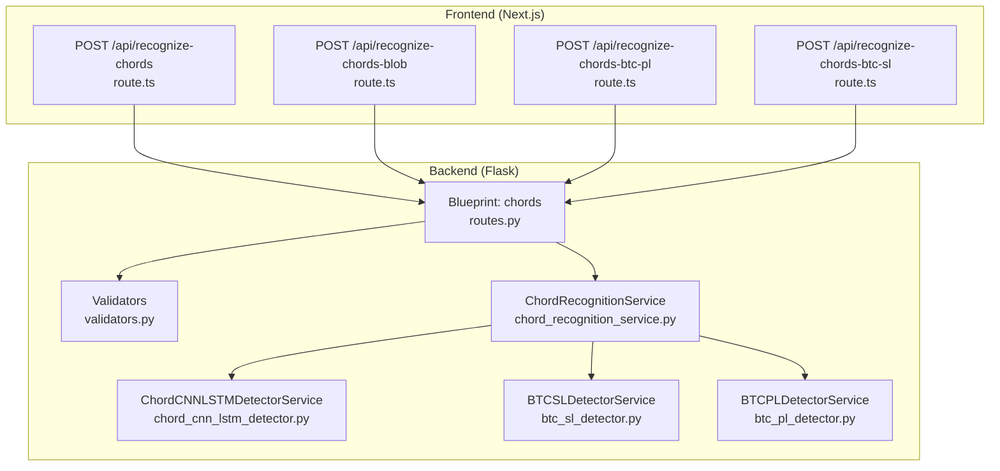
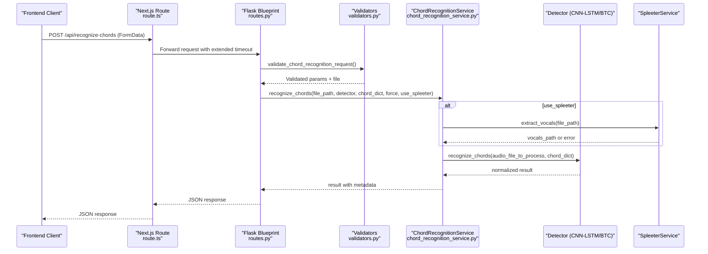
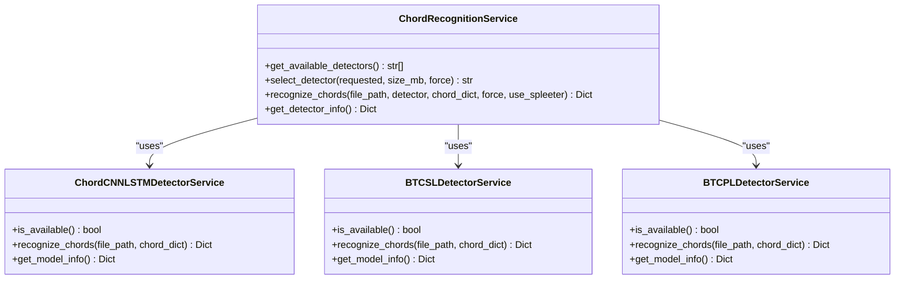
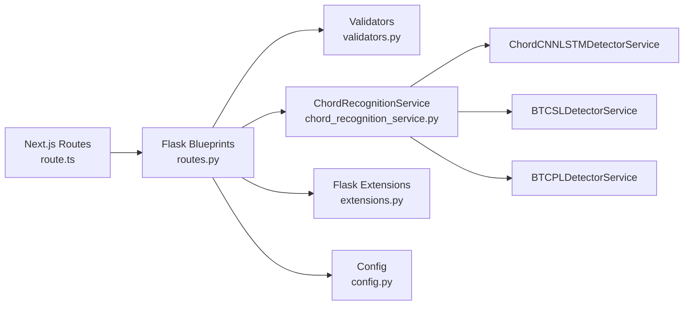

# Chords Blueprint

<cite>
**Referenced Files in This Document**
- [routes.py](file://python_backend/blueprints/chords/routes.py)
- [validators.py](file://python_backend/blueprints/chords/validators.py)
- [chord_recognition_service.py](file://python_backend/services/audio/chord_recognition_service.py)
- [chord_cnn_lstm_detector.py](file://python_backend/services/detectors/chord_cnn_lstm_detector.py)
- [btc_pl_detector.py](file://python_backend/services/detectors/btc_pl_detector.py)
- [btc_sl_detector.py](file://python_backend/services/detectors/btc_sl_detector.py)
- [route.ts](file://src/app/api/recognize-chords/route.ts)
- [route.ts](file://src/app/api/recognize-chords-blob/route.ts)
- [route.ts](file://src/app/api/recognize-chords-btc-pl/route.ts)
- [route.ts](file://src/app/api/recognize-chords-btc-sl/route.ts)
- `Machine Learning Models/Adding New Models.md`
- [chordRecognitionService.ts](file://src/services/chord-analysis/chordRecognitionService.ts)
- [ChordGrid.tsx](file://src/components/chord-analysis/ChordGrid.tsx)
- [useChordDataProcessing.ts](file://src/hooks/chord-analysis/useChordDataProcessing.ts)
- [config.py](file://python_backend/config.py)
- [extensions.py](file://python_backend/extensions.py)
- [model_utils.py](file://python_backend/utils/model_utils.py)
- [btc_config.yaml](file://python_backend/config/btc_config.yaml)
</cite>

## Table of Contents
1. [Introduction](#introduction)
2. [Project Structure](#project-structure)
3. [Core Components](#core-components)
4. [Architecture Overview](#architecture-overview)
5. [Detailed Component Analysis](#detailed-component-analysis)
6. [Dependency Analysis](#dependency-analysis)
7. [Performance Considerations](#performance-considerations)
8. [Troubleshooting Guide](#troubleshooting-guide)
9. [Conclusion](#conclusion)
10. [Appendices](#appendices)

## Introduction
This document describes the chord recognition blueprint powering the ChordMini application. It covers the complete flow from frontend requests to backend processing, including:
- Standard audio analysis via POST /api/recognize-chords
- Blob-based processing via POST /api/recognize-chords-blob
- Specialized endpoints for BTC-PL and BTC-SL models
- Request validation, model selection, and file handling
- Integration with multiple chord recognition models (Chord-CNN-LSTM, BTC-SL, BTC-PL)
- Rate limiting, error handling, and frontend chord analysis components

## Project Structure
The chord recognition feature spans three layers:
- Frontend Next.js API routes that proxy requests to the backend
- Flask blueprint routes and validators that validate and process requests
- Services and detectors that orchestrate model selection and inference

**Diagram sources**
- [routes.py:43-143](file://python_backend/blueprints/chords/routes.py#L43-L143)
- [validators.py:14-80](file://python_backend/blueprints/chords/validators.py#L14-L80)
- [chord_recognition_service.py:25-47](file://python_backend/services/audio/chord_recognition_service.py#L25-L47)
- [chord_cnn_lstm_detector.py:17-31](file://python_backend/services/detectors/chord_cnn_lstm_detector.py#L17-L31)
- [btc_sl_detector.py:17-31](file://python_backend/services/detectors/btc_sl_detector.py#L17-L31)
- [btc_pl_detector.py:17-31](file://python_backend/services/detectors/btc_pl_detector.py#L17-L31)
- [route.ts:17-107](file://src/app/api/recognize-chords/route.ts#L17-L107)

**Section sources**
- [routes.py:1-440](file://python_backend/blueprints/chords/routes.py#L1-L440)
- [validators.py:1-254](file://python_backend/blueprints/chords/validators.py#L1-L254)
- [chord_recognition_service.py:1-322](file://python_backend/services/audio/chord_recognition_service.py#L1-L322)
- [chord_cnn_lstm_detector.py:1-249](file://python_backend/services/detectors/chord_cnn_lstm_detector.py#L1-L249)
- [btc_sl_detector.py:1-246](file://python_backend/services/detectors/btc_sl_detector.py#L1-L246)
- [btc_pl_detector.py:1-246](file://python_backend/services/detectors/btc_pl_detector.py#L1-L246)
- [route.ts:1-208](file://src/app/api/recognize-chords/route.ts#L1-L208)

## Core Components
- Frontend API routes:
  - recognize-chords: primary endpoint that forwards to the backend with automatic chord dictionary selection based on model
  - recognize-chords-blob: alias to the offload pipeline
  - recognize-chords-btc-pl and recognize-chords-btc-sl: Next.js compatibility proxy aliases that set detector to btc-pl or btc-sl and forward to Flask `POST /api/recognize-chords`
- Backend blueprint:
  - Routes for chord recognition, model info, and model availability tests
  - Validators for request parameters, file size, and model names
- Recognition service:
  - Orchestrates model selection, chord dictionary validation, optional Spleeter separation, and result normalization
- Detectors:
  - Chord-CNN-LSTM, BTC-SL, and BTC-PL wrappers with normalized result format

**Section sources**
- [route.ts:17-107](file://src/app/api/recognize-chords/route.ts#L17-L107)
- [route.ts:1-2](file://src/app/api/recognize-chords-blob/route.ts#L1-L2)
- [route.ts:13-38](file://src/app/api/recognize-chords-btc-pl/route.ts#L13-L38)
- [route.ts:13-38](file://src/app/api/recognize-chords-btc-sl/route.ts#L13-L38)
- [routes.py:43-143](file://python_backend/blueprints/chords/routes.py#L43-L143)
- [validators.py:14-80](file://python_backend/blueprints/chords/validators.py#L14-L80)
- [chord_recognition_service.py:25-47](file://python_backend/services/audio/chord_recognition_service.py#L25-L47)

## Architecture Overview
End-to-end flow for chord recognition:

**Diagram sources**
- [route.ts:17-178](file://src/app/api/recognize-chords/route.ts#L17-L178)
- [routes.py:43-143](file://python_backend/blueprints/chords/routes.py#L43-L143)
- [validators.py:14-80](file://python_backend/blueprints/chords/validators.py#L14-L80)
- [chord_recognition_service.py:173-296](file://python_backend/services/audio/chord_recognition_service.py#L173-L296)
- [chord_cnn_lstm_detector.py:78-191](file://python_backend/services/detectors/chord_cnn_lstm_detector.py#L78-L191)
- [btc_sl_detector.py:87-160](file://python_backend/services/detectors/btc_sl_detector.py#L87-L160)
- [btc_pl_detector.py:87-160](file://python_backend/services/detectors/btc_pl_detector.py#L87-L160)

## Detailed Component Analysis

### Endpoint: POST /api/recognize-chords
- Purpose: Standard chord recognition with automatic model selection and optional Spleeter separation.
- Request:
  - multipart/form-data with file, audio_path, or audioUrl
  - Form fields: detector (auto|chord-cnn-lstm|btc-sl|btc-pl), chord_dict, force, use_spleeter
  - JSON body alternative: audioUrl with detector and chordDict
- Validation:
  - Validates detector, force, use_spleeter, file presence, and file size limits
  - Enforces per-detector size thresholds and optional force override
- Processing:
  - Selects detector automatically or respects requested detector
  - Determines chord dictionary based on detector defaults
  - Optionally runs Spleeter separation
  - Invokes detector-specific recognition
- Response:
  - Normalized JSON with chords, duration, total_chords, processing_time, and metadata

**Section sources**
- [routes.py:43-143](file://python_backend/blueprints/chords/routes.py#L43-L143)
- [validators.py:14-80](file://python_backend/blueprints/chords/validators.py#L14-L80)
- [validators.py:166-199](file://python_backend/blueprints/chords/validators.py#L166-L199)
- [chord_recognition_service.py:173-296](file://python_backend/services/audio/chord_recognition_service.py#L173-L296)

### Endpoint: POST /api/recognize-chords-blob
- Purpose: Alias to the offload pipeline for blob-based processing.
- Implementation:
  - Delegates to the unified recognize-chords-offload route via export

**Section sources**
- [route.ts:1-2](file://src/app/api/recognize-chords-blob/route.ts#L1-L2)

### Endpoint: POST /api/recognize-chords-btc-pl
- Purpose: Forces BTC Pseudo-Label model usage.
- Behavior:
  - Ensures detector=btc-pl in the forwarded request
  - Proxies to the unified /api/recognize-chords endpoint

**Section sources**
- [route.ts:13-38](file://src/app/api/recognize-chords-btc-pl/route.ts#L13-L38)

### Endpoint: POST /api/recognize-chords-btc-sl
- Purpose: Forces BTC Self-Label model usage.
- Behavior:
  - Ensures detector=btc-sl in the forwarded request
  - Proxies to the unified /api/recognize-chords endpoint

**Section sources**
- [route.ts:13-38](file://src/app/api/recognize-chords-btc-sl/route.ts#L13-L38)

### Request Validation and File Handling
- Validation:
  - Detector must be one of: chord-cnn-lstm, btc-sl, btc-pl, auto
  - force toggles size limit enforcement
  - use_spleeter enables audio separation
  - File size limits:
    - Chord-CNN-LSTM: 100 MB
    - BTC-SL: 50 MB
    - BTC-PL: 50 MB
    - Auto: conservative 50 MB
- File handling:
  - Accepts uploaded file, existing audio_path, or audioUrl
  - Streams Firebase URLs to temporary files for processing
  - Cleans up temporary files in finally blocks

**Section sources**
- [validators.py:14-80](file://python_backend/blueprints/chords/validators.py#L14-L80)
- [validators.py:166-199](file://python_backend/blueprints/chords/validators.py#L166-L199)
- [validators.py:202-221](file://python_backend/blueprints/chords/validators.py#L202-L221)
- [routes.py:33-41](file://python_backend/blueprints/chords/routes.py#L33-L41)
- [routes.py:172-178](file://python_backend/blueprints/chords/routes.py#L172-L178)

### Model Selection and Integration
- ChordRecognitionService:
  - Maintains detectors for CNN-LSTM, BTC-SL, BTC-PL
  - Auto-selects best detector based on availability and file size
  - Validates chord dictionaries per model
  - Optional Spleeter separation for improved vocal chord recognition
- Detectors:
  - Chord-CNN-LSTM: returns normalized chord events with confidence
  - BTC-SL: transformer-based with large_voca dictionary
  - BTC-PL: transformer-based with large_voca dictionary
- Model info and availability:
  - GET /api/chord-model-info returns Flask chord detector availability and capabilities; the frontend selector normally uses Next.js `GET /api/model-info`, which merges backend data with fallback metadata
  - Individual model test endpoints for availability checks

**Diagram sources**
- [chord_recognition_service.py:25-47](file://python_backend/services/audio/chord_recognition_service.py#L25-L47)
- [chord_cnn_lstm_detector.py:17-31](file://python_backend/services/detectors/chord_cnn_lstm_detector.py#L17-L31)
- [btc_sl_detector.py:17-31](file://python_backend/services/detectors/btc_sl_detector.py#L17-L31)
- [btc_pl_detector.py:17-31](file://python_backend/services/detectors/btc_pl_detector.py#L17-L31)

**Section sources**
- [chord_recognition_service.py:25-172](file://python_backend/services/audio/chord_recognition_service.py#L25-L172)
- [chord_cnn_lstm_detector.py:78-191](file://python_backend/services/detectors/chord_cnn_lstm_detector.py#L78-L191)
- [btc_sl_detector.py:87-160](file://python_backend/services/detectors/btc_sl_detector.py#L87-L160)
- [btc_pl_detector.py:87-160](file://python_backend/services/detectors/btc_pl_detector.py#L87-L160)

### Frontend Integration and Chord Grid Rendering
- Frontend facade:
  - chordRecognitionService.ts re-exports analyzeAudio and analyzeAudioWithRateLimit
- ChordGrid rendering:
  - ChordGrid.tsx renders a responsive grid of chords aligned to beats
  - useChordDataProcessing.ts handles shifting, labeling, and display logic
- Interaction:
  - Beat highlighting, loop selection, and edit mode are integrated via hooks and components

**Section sources**
- [chordRecognitionService.ts:14-30](file://src/services/chord-analysis/chordRecognitionService.ts#L14-L30)
- [ChordGrid.tsx:178-809](file://src/components/chord-analysis/ChordGrid.tsx#L178-L809)
- [useChordDataProcessing.ts:25-87](file://src/hooks/chord-analysis/useChordDataProcessing.ts#L25-L87)

## Dependency Analysis
- Frontend to Backend:
  - Next.js routes forward requests to Flask with extended timeouts
  - Automatic chord dictionary selection based on detector
- Backend Dependencies:
  - Flask extensions: CORS, rate limiter, logging
  - Model availability checks and runtime feature toggles
  - Detector services encapsulate model-specific logic

**Diagram sources**
- [route.ts:17-107](file://src/app/api/recognize-chords/route.ts#L17-L107)
- [routes.py:43-143](file://python_backend/blueprints/chords/routes.py#L43-L143)
- [validators.py:14-80](file://python_backend/blueprints/chords/validators.py#L14-L80)
- [chord_recognition_service.py:25-47](file://python_backend/services/audio/chord_recognition_service.py#L25-L47)
- [extensions.py:17-93](file://python_backend/extensions.py#L17-L93)
- [config.py:16-103](file://python_backend/config.py#L16-L103)

**Section sources**
- [extensions.py:17-93](file://python_backend/extensions.py#L17-L93)
- [config.py:16-103](file://python_backend/config.py#L16-L103)
- [model_utils.py:90-138](file://python_backend/utils/model_utils.py#L90-L138)

## Performance Considerations
- Model selection:
  - Auto-selection prefers Chord-CNN-LSTM for large files and BTC models for small files
  - Size limits reduce memory pressure and improve reliability
- Spleeter separation:
  - Optional enhancement that can improve accuracy at the cost of extra processing time
- Frontend rendering:
  - ChordGrid employs aggressive memoization and optimized layout calculations to handle long chord sequences efficiently
- Timeouts:
  - Frontend routes configure extended timeouts to accommodate long-running ML inference
  - Backend routes enforce rate limits to protect resources

[No sources needed since this section provides general guidance]

## Troubleshooting Guide
- 413 Payload Too Large:
  - Occurs when file exceeds detector-specific size limits
  - Use force=true to override for supported detectors or split the audio
- 403 Forbidden:
  - Indicates backend accessibility issues (e.g., port conflicts)
  - Check for Apple AirTunes intercepting port 5000 and adjust backend port
- Timeout errors:
  - Internal ML processing timeouts are handled with explicit messages and suggestions
  - Reduce audio length or choose a lighter model
- Model unavailability:
  - Use GET /api/chord-model-info to check availability
  - Test individual models with dedicated endpoints

**Section sources**
- [route.ts:118-171](file://src/app/api/recognize-chords/route.ts#L118-L171)
- [route.ts:184-196](file://src/app/api/recognize-chords/route.ts#L184-L196)
- [routes.py:222-257](file://python_backend/blueprints/chords/routes.py#L222-L257)
- [routes.py:260-374](file://python_backend/blueprints/chords/routes.py#L260-L374)

## Conclusion
The chord recognition blueprint integrates a robust backend with flexible model selection, strict validation, and comprehensive error handling, while the frontend delivers a responsive and performant chord grid experience. Specialized endpoints enable targeted model usage, and rate limiting ensures sustainable resource utilization.

[No sources needed since this section summarizes without analyzing specific files]

## Appendices

### Request/Response Formats

- POST /api/recognize-chords
  - Request (FormData):
    - file: audio file
    - detector: auto|chord-cnn-lstm|btc-sl|btc-pl
    - chord_dict: optional chord dictionary name
    - force: true/false to override size limits
    - use_spleeter: true/false to separate vocals
  - Response (JSON):
    - success: boolean
    - chords: array of chord events with start, end, chord, confidence
    - total_chords: number
    - duration: seconds
    - processing_time: seconds
    - detector_selected: string
    - detector_requested: string
    - force_used: boolean
    - spleeter_info: object or null
    - file_size_mb: number
    - error: string (if success=false)

- POST /api/recognize-chords-btc-pl
  - Request (FormData):
    - Same as above; detector=btc-pl is enforced
  - Response:
    - Same as above

- POST /api/recognize-chords-btc-sl
  - Request (FormData):
    - Same as above; detector=btc-sl is enforced
  - Response:
    - Same as above

- GET /api/chord-model-info
  - Response (JSON):
    - success: boolean
    - available_chord_models: array of available detector names
    - chord_model_info: object keyed by detector name
    - spleeter_available: boolean
    - default_chord_model: string

**Section sources**
- [routes.py:43-143](file://python_backend/blueprints/chords/routes.py#L43-L143)
- [routes.py:222-257](file://python_backend/blueprints/chords/routes.py#L222-L257)
- [chord_recognition_service.py:298-322](file://python_backend/services/audio/chord_recognition_service.py#L298-L322)

### Supported Audio Formats and File Handling
- Accepted inputs:
  - Uploaded file (multipart/form-data)
  - Existing server-side audio_path
  - audioUrl pointing to /audio/... or direct URL (validated)
- File size limits:
  - Chord-CNN-LSTM: 100 MB
  - BTC-SL: 50 MB
  - BTC-PL: 50 MB
  - Auto: 50 MB (conservative)
- Temporary file management:
  - Streamed downloads for Firebase URLs
  - Cleanup in finally blocks to prevent orphaned files

**Section sources**
- [validators.py:166-199](file://python_backend/blueprints/chords/validators.py#L166-L199)
- [validators.py:202-221](file://python_backend/blueprints/chords/validators.py#L202-L221)
- [routes.py:33-41](file://python_backend/blueprints/chords/routes.py#L33-L41)
- [routes.py:172-178](file://python_backend/blueprints/chords/routes.py#L172-L178)

### Rate Limiting Configuration
- Flask-Limiter with Redis or in-memory storage
- Endpoint categories:
  - heavy_processing: 2 per minute
  - light_processing: 20 per minute
  - moderate_processing: 10 per minute
  - test: 3 per minute
- Environment-aware defaults:
  - Development: more lenient limits
  - Production: strict limits
  - Testing: disabled rate limits

**Section sources**
- [extensions.py:41-58](file://python_backend/extensions.py#L41-L58)
- [config.py:47-60](file://python_backend/config.py#L47-L60)
- [config.py:105-144](file://python_backend/config.py#L105-L144)

### BTC Configuration Reference
- BTC configuration defines feature extraction parameters, model hyperparameters, and model paths for BTC-SL and BTC-PL variants.

**Section sources**
- [btc_config.yaml:1-61](file://python_backend/config/btc_config.yaml#L1-L61)
