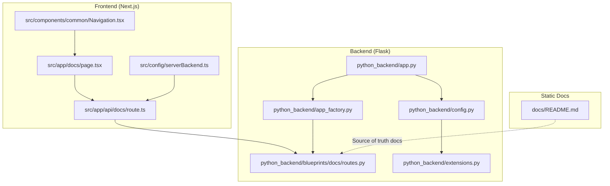
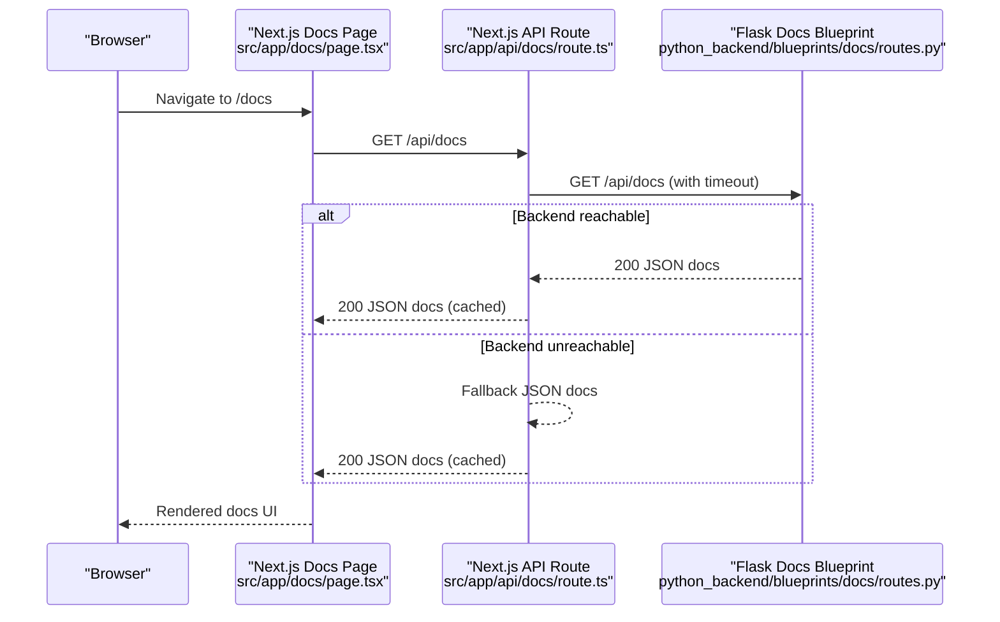
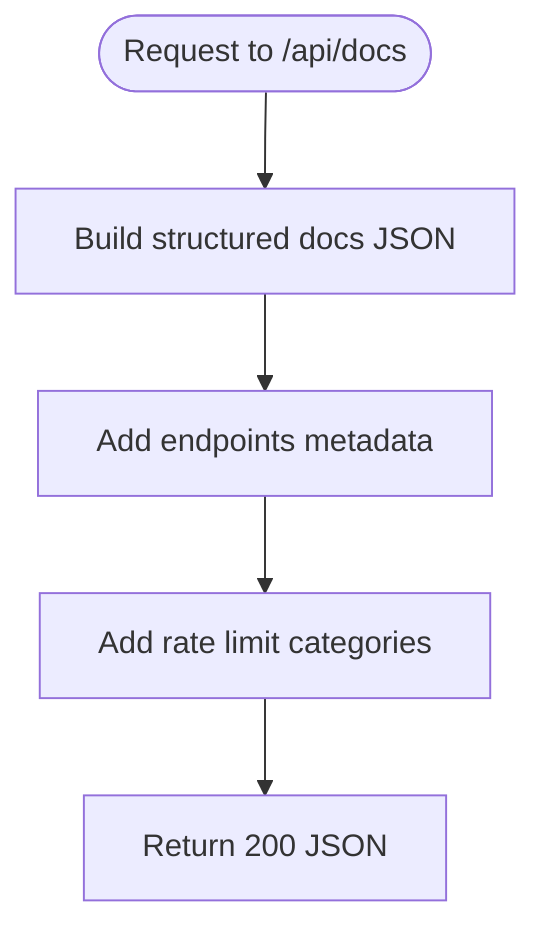
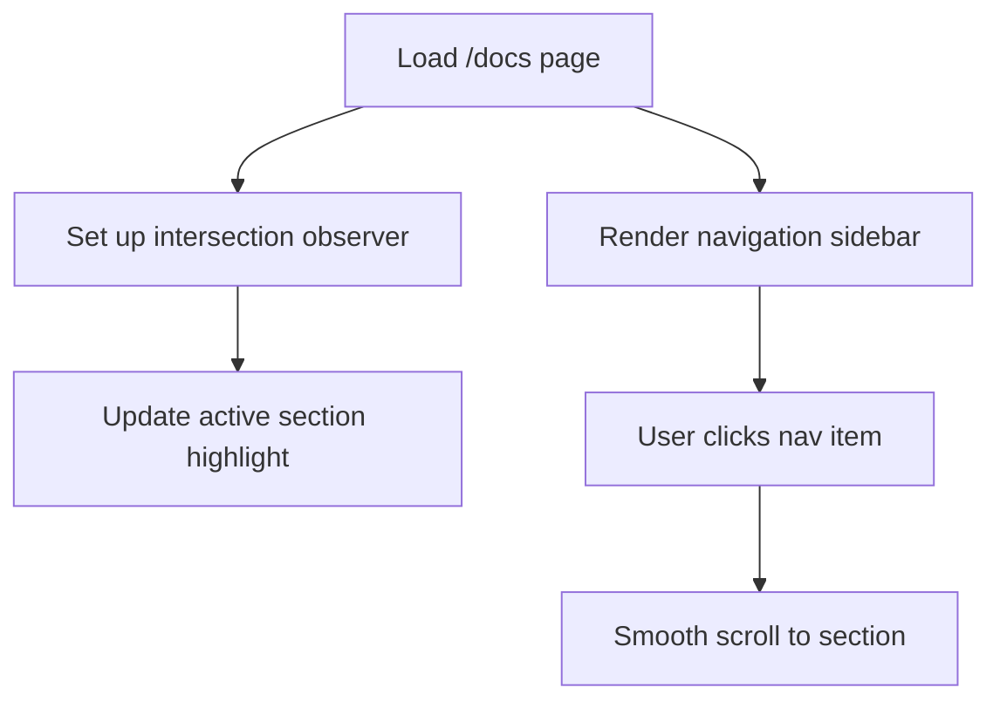
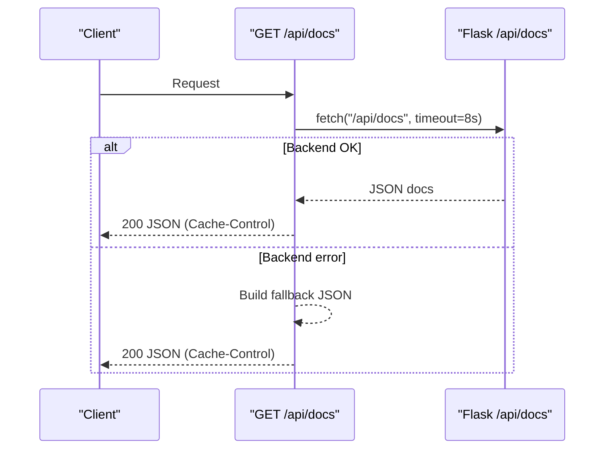
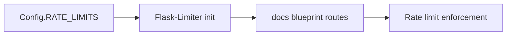
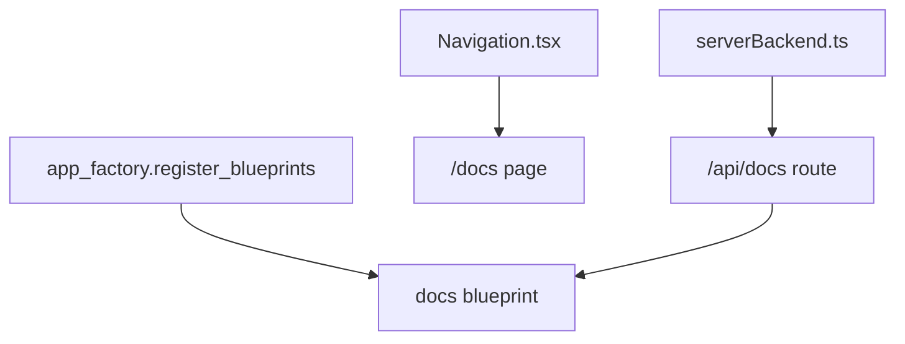
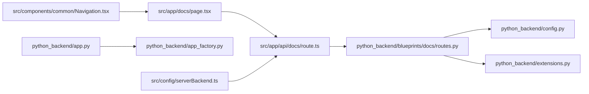

# Docs Blueprint

<cite>
**Referenced Files in This Document**
- [routes.py](file://python_backend/blueprints/docs/routes.py)
- [route.ts](file://src/app/api/docs/route.ts)
- [page.tsx](file://src/app/docs/page.tsx)
- [config.py](file://python_backend/config.py)
- [extensions.py](file://python_backend/extensions.py)
- [app_factory.py](file://python_backend/app_factory.py)
- [app.py](file://python_backend/app.py)
- [serverBackend.ts](file://src/config/serverBackend.ts)
- [Navigation.tsx](file://src/components/common/Navigation.tsx)
- [README.md](file://docs/README.md)
</cite>

## Table of Contents
1. [Introduction](#introduction)
2. [Project Structure](#project-structure)
3. [Core Components](#core-components)
4. [Architecture Overview](#architecture-overview)
5. [Detailed Component Analysis](#detailed-component-analysis)
6. [Dependency Analysis](#dependency-analysis)
7. [Performance Considerations](#performance-considerations)
8. [Troubleshooting Guide](#troubleshooting-guide)
9. [Conclusion](#conclusion)

## Introduction
This document describes the documentation service blueprint for ChordMini, focusing on how documentation endpoints and static content are delivered to users. It explains the serving mechanism, content organization, and integration with the frontend documentation components. It also covers the relationship with the main application, rate-limiting enforcement, caching strategies, and how the frontend documentation navigation system interacts with the backend.

## Project Structure
The documentation system spans three layers:
- Frontend Next.js pages and route handlers under src/app
- Backend Flask blueprints under python_backend/blueprints
- Shared configuration and environment utilities

**Diagram sources**
- [page.tsx:1-616](file://src/app/docs/page.tsx#L1-L616)
- [route.ts:1-216](file://src/app/api/docs/route.ts#L1-L216)
- [routes.py:1-296](file://python_backend/blueprints/docs/routes.py#L1-L296)
- [app_factory.py:68-101](file://python_backend/app_factory.py#L68-L101)
- [config.py:16-103](file://python_backend/config.py#L16-L103)
- [extensions.py:41-92](file://python_backend/extensions.py#L41-L92)
- [app.py:86-186](file://python_backend/app.py#L86-L186)
- [serverBackend.ts:23-56](file://src/config/serverBackend.ts#L23-L56)
- [Navigation.tsx:46-52](file://src/components/common/Navigation.tsx#L46-L52)
- [README.md:1-71](file://docs/README.md#L1-L71)

**Section sources**
- [page.tsx:1-616](file://src/app/docs/page.tsx#L1-L616)
- [route.ts:1-216](file://src/app/api/docs/route.ts#L1-L216)
- [routes.py:1-296](file://python_backend/blueprints/docs/routes.py#L1-L296)
- [app_factory.py:68-101](file://python_backend/app_factory.py#L68-L101)
- [config.py:16-103](file://python_backend/config.py#L16-L103)
- [extensions.py:41-92](file://python_backend/extensions.py#L41-L92)
- [app.py:86-186](file://python_backend/app.py#L86-L186)
- [serverBackend.ts:23-56](file://src/config/serverBackend.ts#L23-L56)
- [Navigation.tsx:46-52](file://src/components/common/Navigation.tsx#L46-L52)
- [README.md:1-71](file://docs/README.md#L1-L71)

## Core Components
- Backend documentation blueprint: Exposes two endpoints:
  - GET /docs renders the HTML documentation page
  - GET /api/docs returns structured API documentation as JSON
- Frontend documentation page: Renders a comprehensive, navigable documentation UI with live navigation highlighting and embedded usage examples.
- Frontend BFF route handler: Proxies to the backend /api/docs with a timeout and caches the response for performance.
- Configuration and rate limiting: Centralized in Flask config and extensions, with environment-aware defaults.
- Navigation integration: The global navigation links to the documentation page.

**Section sources**
- [routes.py:18-22](file://python_backend/blueprints/docs/routes.py#L18-L22)
- [routes.py:25-296](file://python_backend/blueprints/docs/routes.py#L25-L296)
- [page.tsx:80-123](file://src/app/docs/page.tsx#L80-L123)
- [page.tsx:148-201](file://src/app/docs/page.tsx#L148-L201)
- [route.ts:9-38](file://src/app/api/docs/route.ts#L9-L38)
- [route.ts:39-207](file://src/app/api/docs/route.ts#L39-L207)
- [config.py:47-60](file://python_backend/config.py#L47-L60)
- [extensions.py:41-58](file://python_backend/extensions.py#L41-L58)
- [Navigation.tsx:46-52](file://src/components/common/Navigation.tsx#L46-L52)

## Architecture Overview
The documentation service follows a hybrid architecture:
- Static documentation content is authored in docs/ and serves as the canonical source-of-truth for architecture and development topics.
- Live API documentation is served via:
  - Backend Flask blueprint returning JSON
  - Frontend Next.js BFF route handler that fetches from the backend with a timeout and falls back to a static JSON document when the backend is unavailable
  - Frontend page rendering the documentation UI and providing interactive navigation

**Diagram sources**
- [page.tsx:80-123](file://src/app/docs/page.tsx#L80-L123)
- [route.ts:9-38](file://src/app/api/docs/route.ts#L9-L38)
- [route.ts:39-207](file://src/app/api/docs/route.ts#L39-L207)
- [routes.py:25-296](file://python_backend/blueprints/docs/routes.py#L25-L296)

## Detailed Component Analysis

### Backend Documentation Blueprint
The Flask blueprint defines:
- A route to render the HTML documentation page
- A route to return structured API documentation as JSON, including endpoint metadata, parameters, responses, and rate-limit categories

**Diagram sources**
- [routes.py:25-296](file://python_backend/blueprints/docs/routes.py#L25-L296)

**Section sources**
- [routes.py:18-22](file://python_backend/blueprints/docs/routes.py#L18-L22)
- [routes.py:25-296](file://python_backend/blueprints/docs/routes.py#L25-L296)

### Frontend Documentation Page
The Next.js page:
- Implements a responsive layout with a sticky sidebar navigation that highlights the active section based on intersection observer
- Embeds usage examples and status cards
- Reads the backend URL from environment configuration and displays a local fallback endpoint for development

**Diagram sources**
- [page.tsx:80-123](file://src/app/docs/page.tsx#L80-L123)
- [page.tsx:148-201](file://src/app/docs/page.tsx#L148-L201)

**Section sources**
- [page.tsx:80-123](file://src/app/docs/page.tsx#L80-L123)
- [page.tsx:148-201](file://src/app/docs/page.tsx#L148-L201)
- [page.tsx:444-451](file://src/app/docs/page.tsx#L444-L451)

### Frontend BFF Route Handler
The Next.js API route handler:
- Attempts to fetch docs from the backend /api/docs with a timeout
- Returns a cached JSON response with public caching headers
- Falls back to a static JSON document when the backend is unavailable

**Diagram sources**
- [route.ts:9-38](file://src/app/api/docs/route.ts#L9-L38)
- [route.ts:39-207](file://src/app/api/docs/route.ts#L39-L207)

**Section sources**
- [route.ts:9-38](file://src/app/api/docs/route.ts#L9-L38)
- [route.ts:39-207](file://src/app/api/docs/route.ts#L39-L207)

### Configuration and Rate Limiting
- Flask configuration defines rate limits for documentation endpoints and other categories
- Extensions initialize CORS and rate limiting, with Redis-backed storage in production and in-memory fallback in development
- The docs blueprint applies rate limits to both /docs and /api/docs

**Diagram sources**
- [config.py:47-60](file://python_backend/config.py#L47-L60)
- [extensions.py:41-58](file://python_backend/extensions.py#L41-L58)
- [routes.py:18-22](file://python_backend/blueprints/docs/routes.py#L18-L22)

**Section sources**
- [config.py:47-60](file://python_backend/config.py#L47-L60)
- [extensions.py:41-58](file://python_backend/extensions.py#L41-L58)
- [routes.py:18-22](file://python_backend/blueprints/docs/routes.py#L18-L22)

### Integration with the Main Application
- The Flask app registers the docs blueprint alongside other blueprints
- The frontend navigation links to the documentation page
- Environment configuration controls the backend URL used by the frontend

**Diagram sources**
- [app_factory.py:68-101](file://python_backend/app_factory.py#L68-L101)
- [Navigation.tsx:46-52](file://src/components/common/Navigation.tsx#L46-L52)
- [serverBackend.ts:23-56](file://src/config/serverBackend.ts#L23-L56)
- [route.ts:12-22](file://src/app/api/docs/route.ts#L12-L22)

**Section sources**
- [app_factory.py:68-101](file://python_backend/app_factory.py#L68-L101)
- [Navigation.tsx:46-52](file://src/components/common/Navigation.tsx#L46-L52)
- [serverBackend.ts:23-56](file://src/config/serverBackend.ts#L23-L56)
- [route.ts:12-22](file://src/app/api/docs/route.ts#L12-L22)

### Content Organization and Static Docs
- The docs/ folder contains maintained architecture and development documentation
- The maintained set of documents is authoritative for the current repository state
- Static content is organized by topic (architecture, components, workflows, etc.)

**Section sources**
- [README.md:1-71](file://docs/README.md#L1-L71)

## Dependency Analysis
The documentation service depends on:
- Backend Flask app and blueprints for serving structured docs
- Frontend Next.js pages and API routes for rendering and caching
- Configuration utilities for environment-aware backend URLs
- Navigation components for linking to the documentation page

**Diagram sources**
- [page.tsx:80-123](file://src/app/docs/page.tsx#L80-L123)
- [route.ts:9-38](file://src/app/api/docs/route.ts#L9-L38)
- [routes.py:18-22](file://python_backend/blueprints/docs/routes.py#L18-L22)
- [config.py:47-60](file://python_backend/config.py#L47-L60)
- [extensions.py:41-58](file://python_backend/extensions.py#L41-L58)
- [app.py:86-186](file://python_backend/app.py#L86-L186)
- [app_factory.py:68-101](file://python_backend/app_factory.py#L68-L101)
- [Navigation.tsx:46-52](file://src/components/common/Navigation.tsx#L46-L52)
- [serverBackend.ts:23-56](file://src/config/serverBackend.ts#L23-L56)

**Section sources**
- [page.tsx:80-123](file://src/app/docs/page.tsx#L80-L123)
- [route.ts:9-38](file://src/app/api/docs/route.ts#L9-L38)
- [routes.py:18-22](file://python_backend/blueprints/docs/routes.py#L18-L22)
- [config.py:47-60](file://python_backend/config.py#L47-L60)
- [extensions.py:41-58](file://python_backend/extensions.py#L41-L58)
- [app.py:86-186](file://python_backend/app.py#L86-L186)
- [app_factory.py:68-101](file://python_backend/app_factory.py#L68-L101)
- [Navigation.tsx:46-52](file://src/components/common/Navigation.tsx#L46-L52)
- [serverBackend.ts:23-56](file://src/config/serverBackend.ts#L23-L56)

## Performance Considerations
- Caching: The frontend BFF route handler sets Cache-Control headers to cache documentation responses for 5 minutes and allows stale-while-revalidate for up to 10 minutes.
- Timeout: The frontend BFF route handler enforces a 8-second timeout to prevent hanging requests to the backend.
- Rate limiting: The backend applies category-based rate limits to protect resources, with stricter limits in production and more lenient ones in development.
- Graceful fallback: When the backend is unavailable, the frontend returns a static fallback JSON document to maintain usability.

**Section sources**
- [route.ts:26-33](file://src/app/api/docs/route.ts#L26-L33)
- [route.ts:20-22](file://src/app/api/docs/route.ts#L20-L22)
- [config.py:47-60](file://python_backend/config.py#L47-L60)
- [extensions.py:41-58](file://python_backend/extensions.py#L41-L58)
- [route.ts:39-207](file://src/app/api/docs/route.ts#L39-L207)

## Troubleshooting Guide
Common issues and resolutions:
- Backend unreachable: The frontend BFF route handler falls back to a static JSON document. Verify PYTHON_API_URL and network connectivity.
- Rate limit exceeded: The backend returns a 429 response with retry guidance. Reduce request frequency or adjust limits in development.
- CORS errors: Ensure the frontend origin is included in CORS_ORIGINS and that the backend is configured for the current environment.
- Navigation not highlighting: Confirm the intersection observer is active and the section IDs match the sidebar links.

**Section sources**
- [route.ts:35-37](file://src/app/api/docs/route.ts#L35-L37)
- [config.py:32-46](file://python_backend/config.py#L32-L46)
- [extensions.py:22-38](file://python_backend/extensions.py#L22-L38)
- [page.tsx:104-123](file://src/app/docs/page.tsx#L104-L123)

## Conclusion
The documentation service blueprint integrates a static, authoritative source of truth with a dynamic, user-friendly frontend experience. The backend provides structured API documentation, the frontend proxies and caches it with a graceful fallback, and the navigation system ensures seamless access. Together, these components deliver a robust, resilient documentation experience that supports the overall user experience of the application.