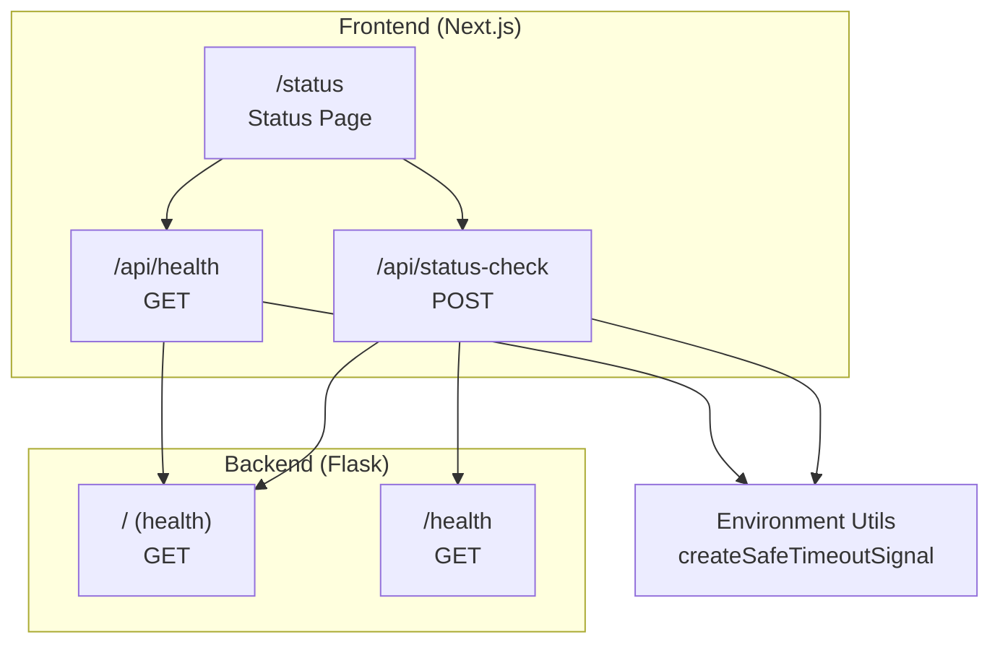
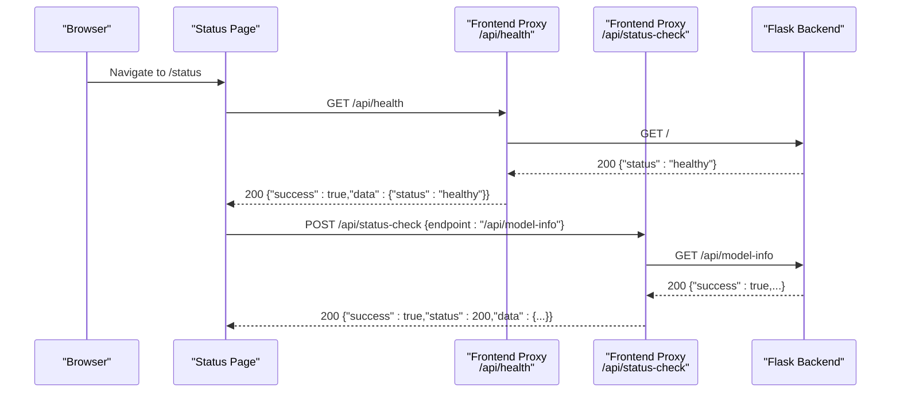
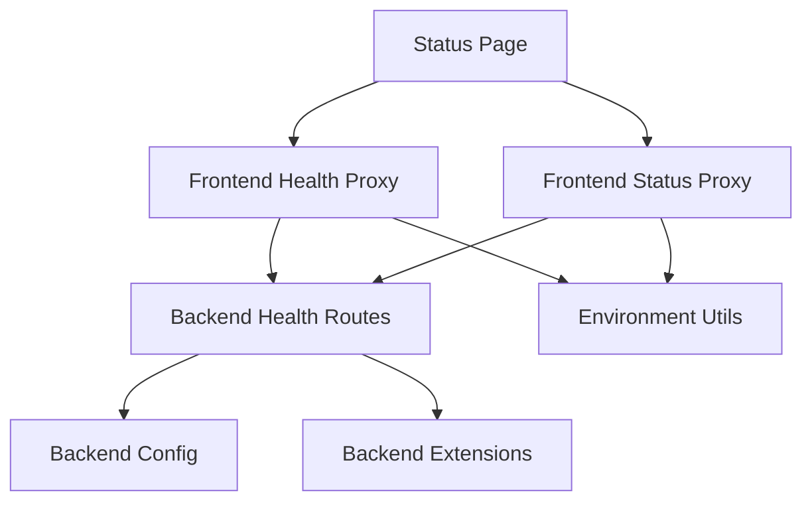

# Health Blueprint

<cite>
**Referenced Files in This Document**
- [routes.py](file://python_backend/blueprints/health/routes.py)
- [route.ts](file://src/app/api/health/route.ts)
- [route.ts](file://src/app/api/status-check/route.ts)
- [page.tsx](file://src/app/status/page.tsx)
- [useRateLimiting.ts](file://src/hooks/api/useRateLimiting.ts)
- [environmentUtils.ts](file://src/utils/environmentUtils.ts)
- [config.py](file://python_backend/config.py)
- [extensions.py](file://python_backend/extensions.py)
- [docker-compose.prod.yml](file://docker-compose.prod.yml)
- [post-deployment-verification.sh](file://scripts/post-deployment-verification.sh)
- [pre-deployment-checklist.sh](file://scripts/pre-deployment-checklist.sh)
</cite>

## Table of Contents
1. [Introduction](#introduction)
2. [Project Structure](#project-structure)
3. [Core Components](#core-components)
4. [Architecture Overview](#architecture-overview)
5. [Detailed Component Analysis](#detailed-component-analysis)
6. [Dependency Analysis](#dependency-analysis)
7. [Performance Considerations](#performance-considerations)
8. [Troubleshooting Guide](#troubleshooting-guide)
9. [Conclusion](#conclusion)

## Introduction
This document describes the health monitoring blueprint for the ChordMini application. It covers health check endpoints, system status monitoring, service availability verification, and integration with load balancers, container orchestration, and monitoring infrastructure. It also documents response formats, status codes, and operational strategies for cold starts and rate limiting.

## Project Structure
The health monitoring system spans both the frontend and backend:

- Frontend Next.js routes provide health and status-check proxies to avoid CORS issues and to coordinate monitoring.
- Backend Flask exposes health endpoints and integrates rate limiting and CORS.
- Monitoring utilities provide safe timeouts and environment-aware error handling.
- Docker Compose defines healthchecks for containerized deployments.
- Post-deployment verification scripts validate end-to-end connectivity and cold-start behavior.

**Diagram sources**
- [route.ts:11-57](file://src/app/api/health/route.ts#L11-L57)
- [route.ts:11-102](file://src/app/api/status-check/route.ts#L11-L102)
- [routes.py:18-31](file://python_backend/blueprints/health/routes.py#L18-L31)
- [page.tsx:17-47](file://src/app/status/page.tsx#L17-L47)
- [environmentUtils.ts:63-84](file://src/utils/environmentUtils.ts#L63-L84)

**Section sources**
- [route.ts:1-58](file://src/app/api/health/route.ts#L1-L58)
- [route.ts:1-103](file://src/app/api/status-check/route.ts#L1-L103)
- [routes.py:1-31](file://python_backend/blueprints/health/routes.py#L1-L31)
- [page.tsx:1-240](file://src/app/status/page.tsx#L1-L240)
- [environmentUtils.ts:1-147](file://src/utils/environmentUtils.ts#L1-L147)
- [docker-compose.prod.yml:58-91](file://docker-compose.prod.yml#L58-L91)

## Core Components
- Frontend health proxy: Validates backend health and returns a normalized response.
- Frontend status-check proxy: Probes arbitrary backend endpoints and interprets expected errors.
- Backend health endpoints: Lightweight endpoints for load balancer and orchestrator health checks.
- Status page: Orchestrates concurrent checks across key endpoints and renders system status.
- Environment utilities: Provides safe timeout signals to accommodate cold starts and platform constraints.
- Configuration and rate limiting: Centralizes rate-limit policies and CORS origins for health endpoints.

**Section sources**
- [route.ts:11-57](file://src/app/api/health/route.ts#L11-L57)
- [route.ts:11-102](file://src/app/api/status-check/route.ts#L11-L102)
- [routes.py:18-31](file://python_backend/blueprints/health/routes.py#L18-L31)
- [page.tsx:17-47](file://src/app/status/page.tsx#L17-L47)
- [useRateLimiting.ts:149-322](file://src/hooks/api/useRateLimiting.ts#L149-L322)
- [environmentUtils.ts:63-84](file://src/utils/environmentUtils.ts#L63-L84)
- [config.py:47-60](file://python_backend/config.py#L47-L60)
- [extensions.py:41-59](file://python_backend/extensions.py#L41-L59)

## Architecture Overview
The health monitoring architecture ensures:
- Load balancers and container orchestrators can probe backend health via simple endpoints.
- Frontend routes act as proxies to avoid CORS and to normalize responses for monitoring.
- Status page aggregates endpoint health and displays overall system status.
- Safe timeouts accommodate cold starts and platform-specific constraints.

**Diagram sources**
- [page.tsx:30-47](file://src/app/status/page.tsx#L30-L47)
- [route.ts:11-57](file://src/app/api/health/route.ts#L11-L57)
- [route.ts:11-102](file://src/app/api/status-check/route.ts#L11-L102)
- [routes.py:18-31](file://python_backend/blueprints/health/routes.py#L18-L31)

## Detailed Component Analysis

### Health Check Endpoints
- Backend health endpoints:
  - Root: Returns a simple health payload suitable for load balancers.
  - Dedicated health: Minimal JSON response indicating service health.
- Frontend health proxy:
  - Proxies to backend root endpoint.
  - Applies a safe timeout to account for cold starts.
  - Normalizes response with a success flag and status field.

Response format (frontend proxy):
- Success: { success: true, data: { status: "healthy", message?: "..."}, status: "healthy" }
- Failure: { success: false, error: string, status: "unhealthy" } with HTTP status matching backend

Status codes:
- 200 on success
- Non-200 maps to the underlying backend status

**Section sources**
- [routes.py:18-31](file://python_backend/blueprints/health/routes.py#L18-L31)
- [route.ts:11-57](file://src/app/api/health/route.ts#L11-L57)

### Status Check Endpoint
- Purpose: Probe arbitrary backend endpoints and interpret expected errors.
- Behavior:
  - For file-upload endpoints, sends POST without body to expect 400.
  - For Genius lyrics, expects 500 or 400 depending on API key configuration.
  - For other endpoints, performs GET.
  - Parses response text and treats expected errors as healthy.
- Response format:
  - { success: boolean, status: number, data: object|string, error?: string, expectedError: boolean }
  - On timeout: { success: false, error: "...", timeout: true } with 408

Status codes:
- 200 on success
- 400 for expected file-upload errors
- 408 on timeout
- 500 on other errors (unless expected)

**Section sources**
- [route.ts:11-102](file://src/app/api/status-check/route.ts#L11-L102)

### System Status Monitoring Service
- Orchestrated by the status page:
  - Concurrently checks key endpoints: root health, model info, beat detection, chord recognition, Genius lyrics.
  - Computes overall status (all online, partial outage, offline).
  - Displays response times and last-checked timestamps.
- Detection logic:
  - Treats long response times and specific error messages as cold start indicators.
  - Distinguishes between offline and “warming up” states.
  - Handles API key/service misconfiguration as “online but misconfigured.”

**Section sources**
- [page.tsx:17-47](file://src/app/status/page.tsx#L17-L47)
- [page.tsx:62-96](file://src/app/status/page.tsx#L62-L96)
- [page.tsx:171-235](file://src/app/status/page.tsx#L171-L235)
- [useRateLimiting.ts:149-322](file://src/hooks/api/useRateLimiting.ts#L149-L322)

### Safe Timeout and Cold Start Handling
- Safe timeout signal:
  - Uses platform-aware AbortSignal.timeout when available; otherwise falls back to AbortController with setTimeout.
  - Validates timeout values and logs fallback usage.
- Cold start detection:
  - Interprets long response times and specific error messages as warming-up states.
  - Adjusts status rendering to “checking” during cold starts.

**Section sources**
- [environmentUtils.ts:63-84](file://src/utils/environmentUtils.ts#L63-L84)
- [environmentUtils.ts:1-147](file://src/utils/environmentUtils.ts#L1-L147)
- [useRateLimiting.ts:211-217](file://src/hooks/api/useRateLimiting.ts#L211-L217)

### Rate Limiting and CORS for Health Endpoints
- Rate limits:
  - Health endpoints use a higher rate limit allowance compared to heavy-processing endpoints.
- CORS:
  - Configured origins include development, internal containers, and Vercel domains.
- Extensions:
  - Flask-Limiter initialized with optional Redis storage; logging configured centrally.

**Section sources**
- [config.py:47-60](file://python_backend/config.py#L47-L60)
- [config.py:32-46](file://python_backend/config.py#L32-L46)
- [extensions.py:41-59](file://python_backend/extensions.py#L41-L59)
- [extensions.py:22-38](file://python_backend/extensions.py#L22-L38)

## Dependency Analysis
The health monitoring system exhibits clear separation of concerns:
- Frontend routes depend on backend endpoints and environment utilities.
- Backend health endpoints depend on configuration and rate-limiting extensions.
- Status page composes frontend proxies and orchestrates checks.

**Diagram sources**
- [route.ts:11-57](file://src/app/api/health/route.ts#L11-L57)
- [route.ts:11-102](file://src/app/api/status-check/route.ts#L11-L102)
- [routes.py:18-31](file://python_backend/blueprints/health/routes.py#L18-L31)
- [config.py:47-60](file://python_backend/config.py#L47-L60)
- [extensions.py:41-59](file://python_backend/extensions.py#L41-L59)
- [environmentUtils.ts:63-84](file://src/utils/environmentUtils.ts#L63-L84)
- [page.tsx:17-47](file://src/app/status/page.tsx#L17-L47)

**Section sources**
- [route.ts:1-58](file://src/app/api/health/route.ts#L1-L58)
- [route.ts:1-103](file://src/app/api/status-check/route.ts#L1-L103)
- [routes.py:1-31](file://python_backend/blueprints/health/routes.py#L1-L31)
- [config.py:1-215](file://python_backend/config.py#L1-L215)
- [extensions.py:1-93](file://python_backend/extensions.py#L1-L93)
- [environmentUtils.ts:1-147](file://src/utils/environmentUtils.ts#L1-L147)
- [page.tsx:1-240](file://src/app/status/page.tsx#L1-L240)

## Performance Considerations
- Cold starts:
  - Expect delays for serverless backends; the status page and verification scripts tolerate initial timeouts.
  - Frontend proxies use extended timeouts to account for cold starts.
- Concurrency:
  - The status page checks multiple endpoints concurrently to minimize total latency.
- Timeouts:
  - Platform-aware timeout creation prevents hard hangs in environments with strict limits.

[No sources needed since this section provides general guidance]

## Troubleshooting Guide
Common scenarios and diagnostics:
- Backend warming up:
  - Symptoms: 500/502/503/504 responses or timeouts shortly after deployment.
  - Resolution: Allow time for serverless cold start; subsequent requests succeed.
- API key/service misconfiguration:
  - Symptoms: 500 responses from Genius lyrics; endpoint remains “online” but misconfigured.
  - Resolution: Verify API keys and service availability.
- CORS issues:
  - Symptoms: Frontend cannot call backend directly.
  - Resolution: Use frontend proxies; ensure CORS origins include deployment domain.
- Rate limiting:
  - Symptoms: 429 responses on health checks.
  - Resolution: Health endpoints have relaxed limits; reduce frequency or adjust thresholds.

Verification scripts:
- Post-deployment verification tolerates backend cold starts and focuses on critical frontend failures.
- Pre-deployment checklist retries backend health checks with increasing timeouts.

**Section sources**
- [post-deployment-verification.sh:97-114](file://scripts/post-deployment-verification.sh#L97-L114)
- [post-deployment-verification.sh:154-167](file://scripts/post-deployment-verification.sh#L154-L167)
- [pre-deployment-checklist.sh:212-237](file://scripts/pre-deployment-checklist.sh#L212-L237)
- [useRateLimiting.ts:211-217](file://src/hooks/api/useRateLimiting.ts#L211-L217)

## Conclusion
The health monitoring blueprint provides a robust, cross-layer solution for verifying system health:
- Lightweight backend endpoints enable load balancer and orchestrator integration.
- Frontend proxies normalize responses and avoid CORS pitfalls.
- The status page offers real-time visibility with cold-start awareness.
- Safe timeouts and environment-aware logic improve reliability across platforms.

[No sources needed since this section summarizes without analyzing specific files]