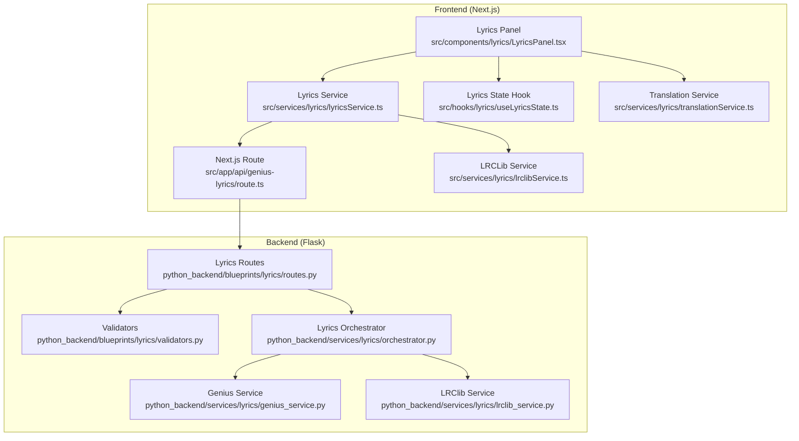
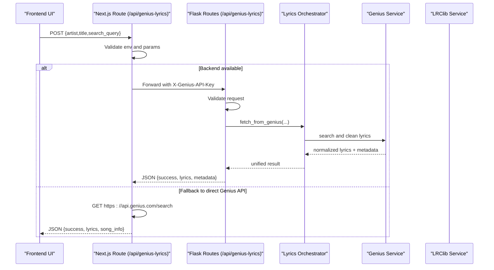
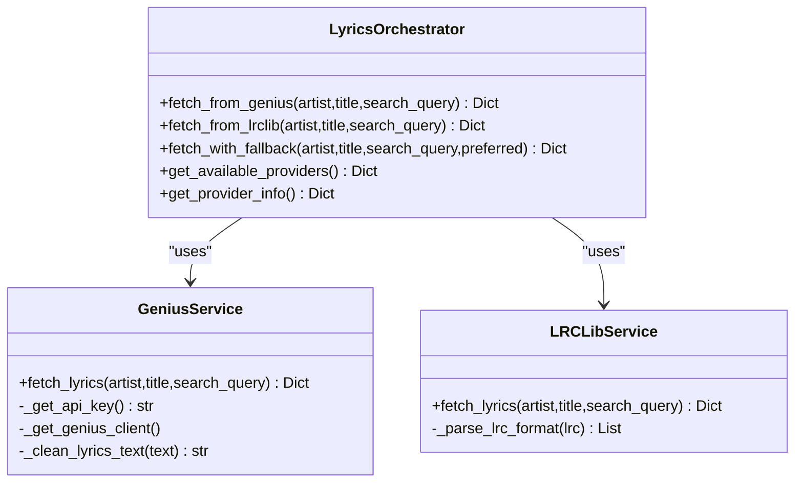
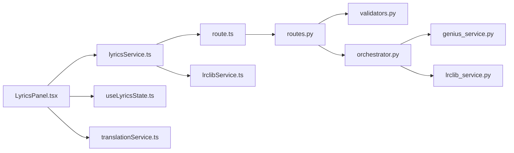

# Lyrics Blueprint

<cite>
**Referenced Files in This Document**
- [routes.py](file://python_backend/blueprints/lyrics/routes.py)
- [validators.py](file://python_backend/blueprints/lyrics/validators.py)
- [orchestrator.py](file://python_backend/services/lyrics/orchestrator.py)
- [genius_service.py](file://python_backend/services/lyrics/genius_service.py)
- [lrclib_service.py](file://python_backend/services/lyrics/lrclib_service.py)
- [route.ts](file://src/app/api/genius-lyrics/route.ts)
- [lyricsService.ts](file://src/services/lyrics/lyricsService.ts)
- [lrclibService.ts](file://src/services/lyrics/lrclibService.ts)
- [LyricsPanel.tsx](file://src/components/lyrics/LyricsPanel.tsx)
- [useLyricsState.ts](file://src/hooks/lyrics/useLyricsState.ts)
- [translationService.ts](file://src/services/lyrics/translationService.ts)
</cite>

## Table of Contents
1. [Introduction](#introduction)
2. [Project Structure](#project-structure)
3. [Core Components](#core-components)
4. [Architecture Overview](#architecture-overview)
5. [Detailed Component Analysis](#detailed-component-analysis)
6. [Dependency Analysis](#dependency-analysis)
7. [Performance Considerations](#performance-considerations)
8. [Troubleshooting Guide](#troubleshooting-guide)
9. [Conclusion](#conclusion)
10. [Appendices](#appendices)

## Introduction
This document describes the lyrics service blueprint for ChordMini, focusing on the integration with external lyrics providers and the frontend display pipeline. It covers:
- GET /api/genius-lyrics and GET /api/lrclib-lyrics endpoints (as implemented)
- Request validation patterns and API key management
- Error handling strategies for external service integrations
- Synchronized lyrics capabilities and translation services
- Quality assurance processes and rate limiting configurations
- Caching strategies and the relationship with frontend lyrics display components
- Examples of API usage, response formats, and integration patterns within the music analysis workflow

## Project Structure
The lyrics feature spans both the Python backend and the Next.js frontend:
- Backend Flask blueprint exposes two POST endpoints for lyrics retrieval and integrates with provider services.
- Frontend Next.js routes act as proxies to the backend and include a fallback to direct Genius API usage.
- Frontend services orchestrate provider selection, parsing, and display logic.
- Frontend components render synchronized and plain lyrics with smooth scrolling and timing alignment.

**Diagram sources**
- [routes.py:22-126](file://python_backend/blueprints/lyrics/routes.py#L22-L126)
- [validators.py:12-146](file://python_backend/blueprints/lyrics/validators.py#L12-L146)
- [orchestrator.py:14-184](file://python_backend/services/lyrics/orchestrator.py#L14-L184)
- [genius_service.py:14-215](file://python_backend/services/lyrics/genius_service.py#L14-L215)
- [lrclib_service.py:14-172](file://python_backend/services/lyrics/lrclib_service.py#L14-L172)
- [route.ts:11-148](file://src/app/api/genius-lyrics/route.ts#L11-L148)
- [lyricsService.ts:72-172](file://src/services/lyrics/lyricsService.ts#L72-L172)
- [lrclibService.ts:32-145](file://src/services/lyrics/lrclibService.ts#L32-L145)
- [LyricsPanel.tsx:23-376](file://src/components/lyrics/LyricsPanel.tsx#L23-L376)
- [useLyricsState.ts:8-91](file://src/hooks/lyrics/useLyricsState.ts#L8-L91)
- [translationService.ts:38-244](file://src/services/lyrics/translationService.ts#L38-L244)

**Section sources**
- [routes.py:1-126](file://python_backend/blueprints/lyrics/routes.py#L1-L126)
- [route.ts:1-148](file://src/app/api/genius-lyrics/route.ts#L1-L148)

## Core Components
- Backend Flask blueprint:
  - Exposes POST /api/genius-lyrics and POST /api/lrclib-lyrics with rate limiting.
  - Validates requests and delegates to the lyrics orchestrator.
- Orchestrator:
  - Coordinates Genius and LRClib services, normalizes results, and provides fallback strategies.
- Provider services:
  - GeniusService: Uses lyricsgenius with API key management and text cleaning.
  - LRCLibService: Parses LRC-formatted synchronized lyrics and metadata.
- Frontend proxy:
  - Next.js route forwards requests to backend and falls back to direct Genius API if needed.
- Frontend services:
  - lyricsService: Orchestrates provider selection, parses results, and returns unified responses.
  - lrclibService: Parses LRC timestamps and extracts current line based on playback time.
- Frontend components:
  - LyricsPanel: Renders synchronized/plain lyrics, supports search, and smooth scrolling.
  - useLyricsState: Manages lyrics state and UI lifecycle.
- Translation service:
  - Implements cache-first translation with background updates and polling.

**Section sources**
- [orchestrator.py:14-184](file://python_backend/services/lyrics/orchestrator.py#L14-L184)
- [genius_service.py:14-215](file://python_backend/services/lyrics/genius_service.py#L14-L215)
- [lrclib_service.py:14-172](file://python_backend/services/lyrics/lrclib_service.py#L14-L172)
- [lyricsService.ts:72-172](file://src/services/lyrics/lyricsService.ts#L72-L172)
- [lrclibService.ts:32-145](file://src/services/lyrics/lrclibService.ts#L32-L145)
- [LyricsPanel.tsx:23-376](file://src/components/lyrics/LyricsPanel.tsx#L23-L376)
- [useLyricsState.ts:8-91](file://src/hooks/lyrics/useLyricsState.ts#L8-L91)
- [translationService.ts:38-244](file://src/services/lyrics/translationService.ts#L38-L244)

## Architecture Overview
The system follows a layered architecture:
- Frontend requests lyrics via Next.js routes.
- Next.js routes attempt backend endpoints first, then fall back to direct Genius API.
- Backend validates requests, selects providers, and returns normalized results.
- Frontend renders lyrics with synchronized timing and plain fallbacks.

**Diagram sources**
- [route.ts:11-148](file://src/app/api/genius-lyrics/route.ts#L11-L148)
- [routes.py:22-72](file://python_backend/blueprints/lyrics/routes.py#L22-L72)
- [orchestrator.py:33-62](file://python_backend/services/lyrics/orchestrator.py#L33-L62)
- [genius_service.py:135-215](file://python_backend/services/lyrics/genius_service.py#L135-L215)

## Detailed Component Analysis

### Backend Flask Lyrics Routes
- Endpoints:
  - POST /api/genius-lyrics: Calls lyrics orchestrator to fetch from Genius.
  - POST /api/lrclib-lyrics: Calls lyrics orchestrator to fetch from LRClib.
- Validation:
  - Enforces JSON payload and validates presence of either search_query or both artist and title.
  - Applies moderate-processing rate limits.
- Error handling:
  - Returns structured JSON with success/error fields and logs failures.

**Section sources**
- [routes.py:22-126](file://python_backend/blueprints/lyrics/routes.py#L22-L126)
- [validators.py:12-58](file://python_backend/blueprints/lyrics/validators.py#L12-L58)

### Lyrics Orchestrator
- Responsibilities:
  - Initializes GeniusService and LRCLibService.
  - Provides provider-specific fetch methods and a unified fetch_with_fallback strategy.
  - Adds provider and found flags to results for downstream handling.
- Availability:
  - Reports Genius availability based on lyricsgenius import and API key presence.
  - LRClib availability is assumed true.

**Diagram sources**
- [orchestrator.py:14-184](file://python_backend/services/lyrics/orchestrator.py#L14-L184)
- [genius_service.py:14-215](file://python_backend/services/lyrics/genius_service.py#L14-L215)
- [lrclib_service.py:14-172](file://python_backend/services/lyrics/lrclib_service.py#L14-L172)

**Section sources**
- [orchestrator.py:14-184](file://python_backend/services/lyrics/orchestrator.py#L14-L184)

### Genius Service
- API key management:
  - Reads from X-Genius-API-Key header or GENIUS_API_KEY environment variable.
  - Requires lyricsgenius library; raises explicit errors if unavailable.
- Search and cleaning:
  - Searches by custom query or artist/title.
  - Cleans Genius lyrics text and strips contributor/embed artifacts.
- Response normalization:
  - Returns success flag, lyrics text, and metadata including Genius URL and ID.

**Section sources**
- [genius_service.py:28-88](file://python_backend/services/lyrics/genius_service.py#L28-L88)
- [genius_service.py:135-215](file://python_backend/services/lyrics/genius_service.py#L135-L215)

### LRClib Service
- Synchronized lyrics:
  - Searches via lrclib.net API with artist_name/track_name or general q query.
  - Parses LRC-formatted timestamps into ordered arrays of {time,text}.
- Metadata:
  - Includes title, artist, album, duration, lrclib_id, and instrumental flag.
- Error handling:
  - Returns structured errors for network and parsing failures.

**Section sources**
- [lrclib_service.py:76-172](file://python_backend/services/lyrics/lrclib_service.py#L76-L172)

### Frontend Proxy (Next.js)
- Purpose:
  - Acts as a proxy to the Python backend for Genius lyrics.
  - Forwards Genius API key from environment and applies timeouts.
- Fallback:
  - If backend fails/unavailable, directly queries Genius API for song metadata (lyrics content is restricted).

**Section sources**
- [route.ts:11-148](file://src/app/api/genius-lyrics/route.ts#L11-L148)

### Frontend Lyrics Services
- lyricsService:
  - Orchestrates provider selection with preference for synchronized lyrics.
  - Attempts LRClib first; falls back to Genius API via backend.
  - Returns unified response with metadata and source attribution.
- lrclibService:
  - Performs multiple search strategies (specific, swapped, general q).
  - Parses LRC timestamps and computes current line based on playback time.
  - Provides parseVideoTitle to extract artist/title from video titles.

**Section sources**
- [lyricsService.ts:72-172](file://src/services/lyrics/lyricsService.ts#L72-L172)
- [lrclibService.ts:32-145](file://src/services/lyrics/lrclibService.ts#L32-L145)
- [lrclibService.ts:185-223](file://src/services/lyrics/lrclibService.ts#L185-L223)

### Frontend Lyrics Panel
- Features:
  - Search input with auto-focus and Enter support.
  - Toggle between synchronized and plain lyrics.
  - Smooth scrolling to keep current line centered with safe margins.
  - Displays song title/artist and links to Genius when applicable.
- State management:
  - Integrates with useLyricsState for UI lifecycle and error handling.

**Section sources**
- [LyricsPanel.tsx:23-376](file://src/components/lyrics/LyricsPanel.tsx#L23-L376)
- [useLyricsState.ts:8-91](file://src/hooks/lyrics/useLyricsState.ts#L8-L91)

### Translation Service
- Cache-first approach:
  - Immediately returns cached translations if available.
  - Triggers background updates and polls for completion.
- Fallback:
  - Falls back to regular translation API if cache endpoint fails.
- Callbacks:
  - Supports update callbacks to notify UI of fresh translations.

**Section sources**
- [translationService.ts:38-244](file://src/services/lyrics/translationService.ts#L38-L244)

## Dependency Analysis
- Backend dependencies:
  - Flask routes depend on validators and the lyrics orchestrator.
  - Orchestrator depends on GeniusService and LRCLibService.
  - GeniusService depends on lyricsgenius and environment variables.
  - LRCLibService depends on requests and regex parsing.
- Frontend dependencies:
  - Next.js route depends on server backend configuration and environment variables.
  - lyricsService depends on lrclibService and apiService.
  - lrclibService depends on fetch and regex parsing.
  - LyricsPanel depends on lrclibService and state hooks.

**Diagram sources**
- [routes.py:1-126](file://python_backend/blueprints/lyrics/routes.py#L1-L126)
- [validators.py:1-146](file://python_backend/blueprints/lyrics/validators.py#L1-L146)
- [orchestrator.py:1-184](file://python_backend/services/lyrics/orchestrator.py#L1-L184)
- [genius_service.py:1-215](file://python_backend/services/lyrics/genius_service.py#L1-L215)
- [lrclib_service.py:1-172](file://python_backend/services/lyrics/lrclib_service.py#L1-L172)
- [route.ts:1-148](file://src/app/api/genius-lyrics/route.ts#L1-L148)
- [lyricsService.ts:1-197](file://src/services/lyrics/lyricsService.ts#L1-L197)
- [lrclibService.ts:1-266](file://src/services/lyrics/lrclibService.ts#L1-L266)
- [LyricsPanel.tsx:1-376](file://src/components/lyrics/LyricsPanel.tsx#L1-L376)
- [useLyricsState.ts:1-91](file://src/hooks/lyrics/useLyricsState.ts#L1-L91)
- [translationService.ts:1-255](file://src/services/lyrics/translationService.ts#L1-L255)

**Section sources**
- [routes.py:1-126](file://python_backend/blueprints/lyrics/routes.py#L1-L126)
- [orchestrator.py:1-184](file://python_backend/services/lyrics/orchestrator.py#L1-L184)
- [genius_service.py:1-215](file://python_backend/services/lyrics/genius_service.py#L1-L215)
- [lrclib_service.py:1-172](file://python_backend/services/lyrics/lrclib_service.py#L1-L172)
- [route.ts:1-148](file://src/app/api/genius-lyrics/route.ts#L1-L148)
- [lyricsService.ts:1-197](file://src/services/lyrics/lyricsService.ts#L1-L197)
- [lrclibService.ts:1-266](file://src/services/lyrics/lrclibService.ts#L1-L266)
- [LyricsPanel.tsx:1-376](file://src/components/lyrics/LyricsPanel.tsx#L1-L376)
- [useLyricsState.ts:1-91](file://src/hooks/lyrics/useLyricsState.ts#L1-L91)
- [translationService.ts:1-255](file://src/services/lyrics/translationService.ts#L1-L255)

## Performance Considerations
- Rate limiting:
  - Backend endpoints apply moderate-processing rate limits to prevent abuse.
- Timeouts:
  - Frontend proxy sets timeouts for backend and direct Genius API calls.
- Caching:
  - Translation service implements cache-first with background refresh and polling.
- Parsing efficiency:
  - LRC timestamp parsing sorts lines once and uses linear scans for current line lookup.

[No sources needed since this section provides general guidance]

## Troubleshooting Guide
- Backend validation errors:
  - Ensure JSON payload includes either search_query or both artist and title.
  - Respect maximum length constraints for parameters.
- Genius API key issues:
  - Verify GENIUS_API_KEY environment variable or forward via X-Genius-API-Key header.
  - Confirm lyricsgenius library installation.
- Network failures:
  - Check backend connectivity to lrclib.net and Genius API endpoints.
  - Review timeouts and error logs for detailed failure reasons.
- Frontend fallback behavior:
  - If backend is unavailable, the Next.js route falls back to direct Genius API search.

**Section sources**
- [validators.py:12-58](file://python_backend/blueprints/lyrics/validators.py#L12-L58)
- [genius_service.py:28-88](file://python_backend/services/lyrics/genius_service.py#L28-L88)
- [route.ts:51-77](file://src/app/api/genius-lyrics/route.ts#L51-L77)

## Conclusion
The lyrics blueprint integrates multiple providers with robust validation, error handling, and a flexible fallback strategy. The frontend provides a responsive, synchronized lyrics experience with smooth scrolling and translation support. Together, these components form a cohesive pipeline for retrieving, processing, and displaying lyrics within the broader music analysis workflow.

[No sources needed since this section summarizes without analyzing specific files]

## Appendices

### API Usage Examples
- Backend POST /api/genius-lyrics
  - Request body: { artist, title } or { search_query }
  - Response: { success, lyrics, metadata, source }
- Backend POST /api/lrclib-lyrics
  - Request body: { artist, title } or { search_query }
  - Response: { success, has_synchronized, synchronized_lyrics, plain_lyrics, metadata, source }
- Frontend Next.js route /api/genius-lyrics
  - Request body: { artist, title } or { search_query }
  - Response: { success, lyrics, song_info, source } (with fallback behavior)

**Section sources**
- [routes.py:22-126](file://python_backend/blueprints/lyrics/routes.py#L22-L126)
- [lrclib_service.py:76-172](file://python_backend/services/lyrics/lrclib_service.py#L76-L172)
- [route.ts:11-148](file://src/app/api/genius-lyrics/route.ts#L11-L148)

### Response Formats
- Unified lyrics response:
  - success: boolean
  - has_synchronized: boolean (LRClib only)
  - synchronized_lyrics: [{ time: number, text: string }] (LRClib only)
  - plain_lyrics: string
  - metadata: { title, artist, album?, duration?, source, genius_url?, genius_id?, thumbnail_url? }
  - source: string
  - fallback_used?: boolean (when Genius fallback is used)

**Section sources**
- [lyricsService.ts:21-39](file://src/services/lyrics/lyricsService.ts#L21-L39)
- [lrclibService.ts:19-27](file://src/services/lyrics/lrclibService.ts#L19-L27)

### Integration Patterns
- Music analysis workflow:
  - After audio extraction and beat/chord detection, lyrics are fetched and optionally translated.
  - Frontend LyricsPanel displays synchronized lyrics aligned with playback timing.
  - TranslationService enhances accessibility by providing cached translations with background refresh.

**Section sources**
- [LyricsPanel.tsx:23-376](file://src/components/lyrics/LyricsPanel.tsx#L23-L376)
- [translationService.ts:38-244](file://src/services/lyrics/translationService.ts#L38-L244)