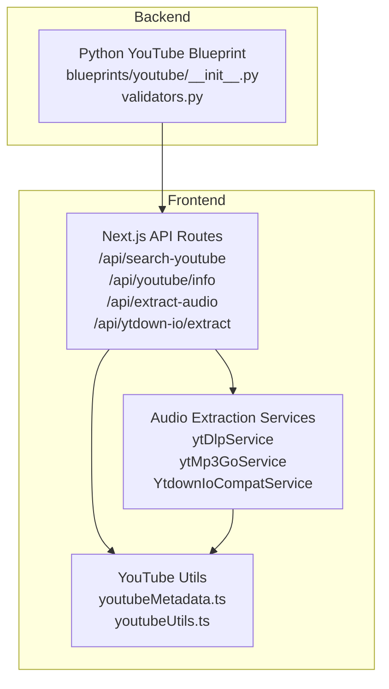
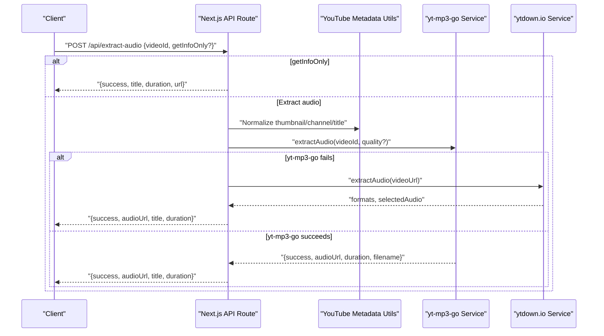
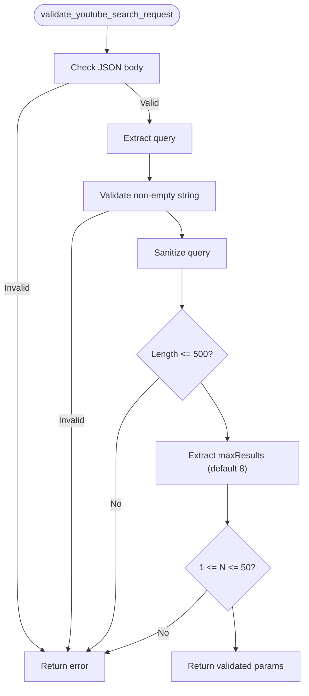
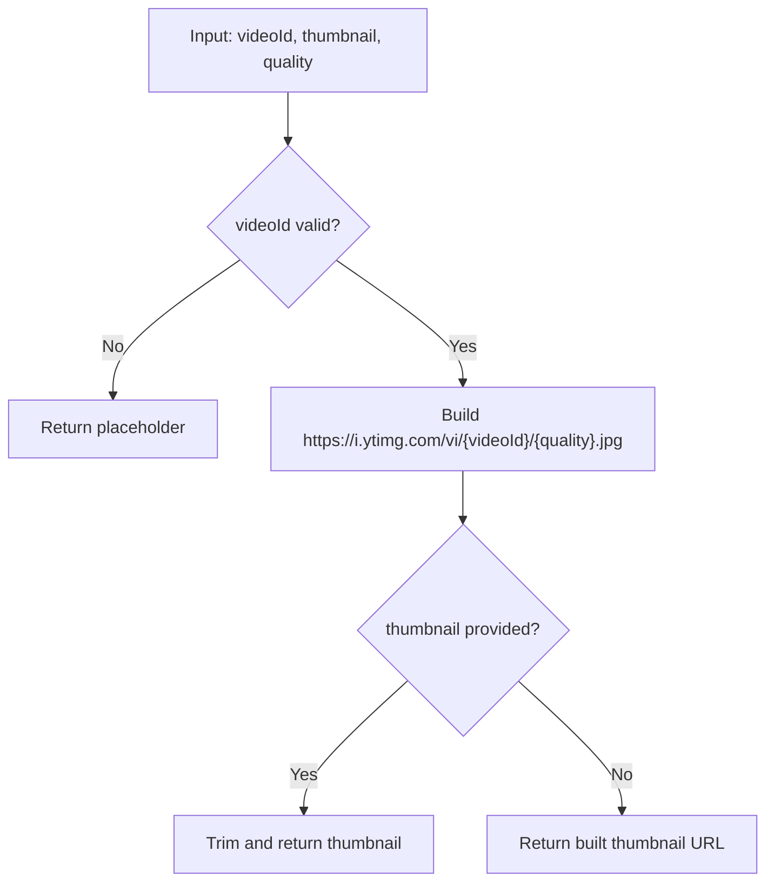
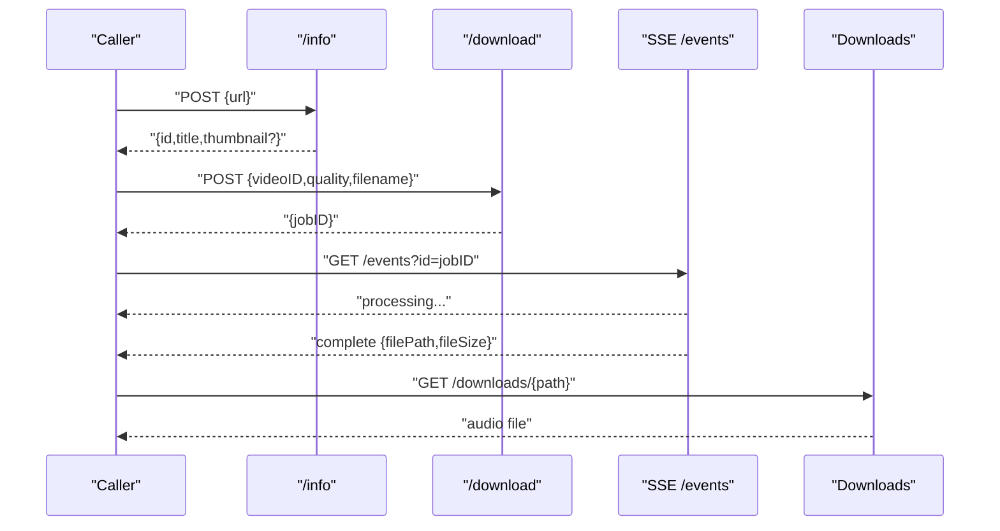
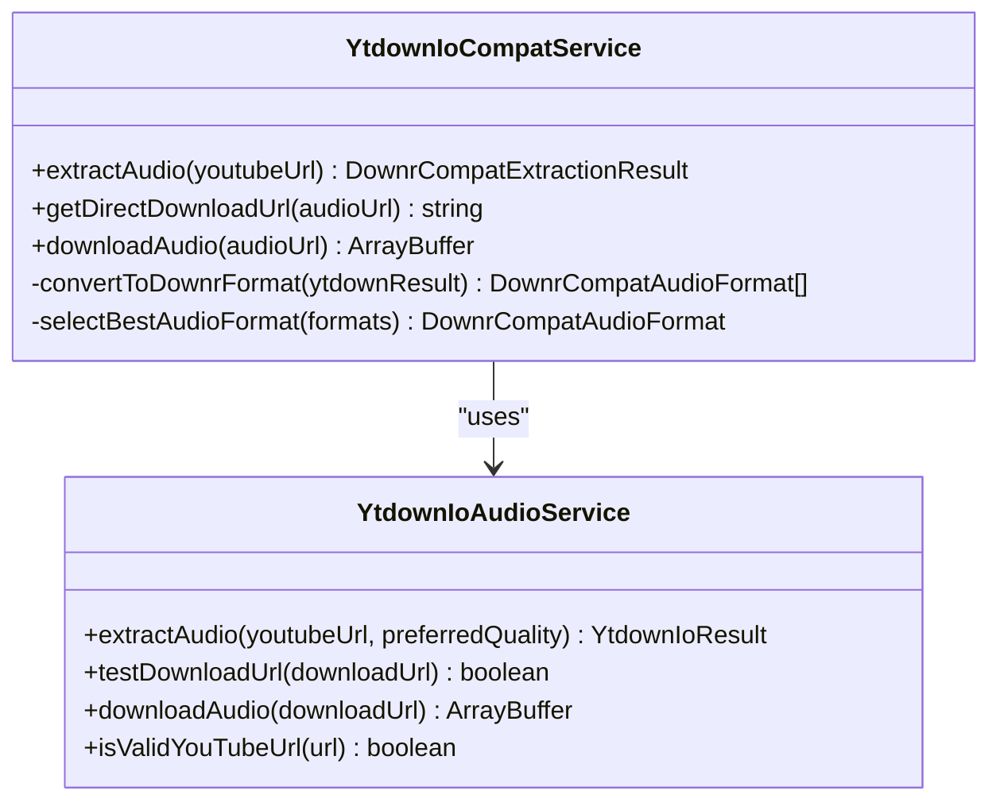
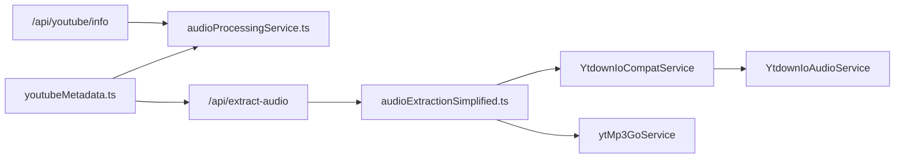

# YouTube Blueprint

<cite>
**Referenced Files in This Document**
- [__init__.py](file://python_backend/blueprints/youtube/__init__.py)
- [validators.py](file://python_backend/blueprints/youtube/validators.py)
- [route.ts](file://src/app/api/search-youtube/route.ts)
- [route.ts](file://src/app/api/youtube/info/route.ts)
- [route.ts](file://src/app/api/extract-audio/route.ts)
- [route.ts](file://src/app/api/ytdown-io/extract/route.ts)
- [ytDlpService.ts](file://src/services/youtube/ytDlpService.ts)
- [ytMp3GoService.ts](file://src/services/youtube/ytMp3GoService.ts)
- [ytdownIoAudioService.ts](file://src/services/youtube/ytdownIoAudioService.ts)
- [ytdownIoCompatService.ts](file://src/services/youtube/ytdownIoCompatService.ts)
- [audioExtractionSimplified.ts](file://src/services/audio/audioExtractionSimplified.ts)
- [audioProcessingService.ts](file://src/services/audio/audioProcessingService.ts)
- [youtubeMetadata.ts](file://src/utils/youtubeMetadata.ts)
- [youtubeUtils.ts](file://src/utils/youtubeUtils.ts)
</cite>

## Table of Contents
1. [Introduction](#introduction)
2. [Project Structure](#project-structure)
3. [Core Components](#core-components)
4. [Architecture Overview](#architecture-overview)
5. [Detailed Component Analysis](#detailed-component-analysis)
6. [Dependency Analysis](#dependency-analysis)
7. [Performance Considerations](#performance-considerations)
8. [Troubleshooting Guide](#troubleshooting-guide)
9. [Conclusion](#conclusion)
10. [Appendices](#appendices)

## Introduction
This document describes the YouTube integration blueprint for ChordMini. It covers metadata extraction endpoints, video information retrieval, and audio extraction services. It explains request validation patterns, URL parsing, integration with external YouTube APIs, video quality selection, thumbnail extraction, and metadata processing workflows. It also documents error handling strategies for network requests, rate limiting configurations, and the relationship with the frontend YouTube search and player components. Examples of workflows, supported formats, and best practices for handling YouTube’s API limitations are included.

## Project Structure
The YouTube integration spans both the frontend and backend:
- Backend Python Flask blueprint for YouTube search (Piped API with fallbacks).
- Frontend Next.js API routes for YouTube metadata and audio extraction.
- Frontend services for audio extraction via yt-dlp, yt-mp3-go, and ytdown.io.
- Utilities for YouTube thumbnail normalization and URL parsing.

**Diagram sources**
- [__init__.py:1-11](file://python_backend/blueprints/youtube/__init__.py#L1-L11)
- [validators.py:1-171](file://python_backend/blueprints/youtube/validators.py#L1-L171)
- [route.ts](file://src/app/api/search-youtube/route.ts)
- [route.ts](file://src/app/api/youtube/info/route.ts)
- [route.ts](file://src/app/api/extract-audio/route.ts)
- [route.ts](file://src/app/api/ytdown-io/extract/route.ts)
- [ytDlpService.ts:1-236](file://src/services/youtube/ytDlpService.ts#L1-L236)
- [ytMp3GoService.ts:1-577](file://src/services/youtube/ytMp3GoService.ts#L1-L577)
- [ytdownIoAudioService.ts:1-204](file://src/services/youtube/ytdownIoAudioService.ts#L1-L204)
- [ytdownIoCompatService.ts:1-355](file://src/services/youtube/ytdownIoCompatService.ts#L1-L355)
- [youtubeMetadata.ts:1-57](file://src/utils/youtubeMetadata.ts#L1-L57)
- [youtubeUtils.ts](file://src/utils/youtubeUtils.ts)

**Section sources**
- [__init__.py:1-11](file://python_backend/blueprints/youtube/__init__.py#L1-L11)
- [validators.py:1-171](file://python_backend/blueprints/youtube/validators.py#L1-L171)

## Core Components
- Request validation for YouTube search requests (JSON body, query sanitization, maxResults bounds).
- Frontend Next.js API routes for:
  - Search YouTube (placeholder or integration with backend).
  - Retrieve YouTube video info (title, duration fallback).
  - Extract audio with metadata fallback and ytdown.io compatibility.
  - ytdown.io extraction endpoint documentation.
- Audio extraction services:
  - yt-dlp service for development.
  - yt-mp3-go service with quality selection and SSE monitoring.
  - ytdown.io audio service and compatibility wrapper.
- Thumbnail utilities for YouTube thumbnails and channel title normalization.

**Section sources**
- [validators.py:13-67](file://python_backend/blueprints/youtube/validators.py#L13-L67)
- [route.ts](file://src/app/api/search-youtube/route.ts)
- [route.ts](file://src/app/api/youtube/info/route.ts)
- [route.ts](file://src/app/api/extract-audio/route.ts)
- [route.ts](file://src/app/api/ytdown-io/extract/route.ts)
- [ytDlpService.ts:38-236](file://src/services/youtube/ytDlpService.ts#L38-L236)
- [ytMp3GoService.ts:51-577](file://src/services/youtube/ytMp3GoService.ts#L51-L577)
- [ytdownIoAudioService.ts:75-204](file://src/services/youtube/ytdownIoAudioService.ts#L75-L204)
- [ytdownIoCompatService.ts:46-355](file://src/services/youtube/ytdownIoCompatService.ts#L46-L355)
- [youtubeMetadata.ts:1-57](file://src/utils/youtubeMetadata.ts#L1-L57)

## Architecture Overview
The system retrieves YouTube video metadata and extracts audio through multiple pathways:
- Frontend Next.js API routes orchestrate extraction and metadata retrieval.
- yt-mp3-go provides a two-step process with quality selection and SSE monitoring.
- ytdown.io offers a compatibility layer for existing workflows and direct download URLs.
- yt-dlp is used in development for local extraction and filename compatibility.
- Fallback mechanisms ensure robustness when primary services fail.

**Diagram sources**
- [route.ts:35-73](file://src/app/api/extract-audio/route.ts#L35-L73)
- [ytMp3GoService.ts:84-143](file://src/services/youtube/ytMp3GoService.ts#L84-L143)
- [ytdownIoCompatService.ts:56-120](file://src/services/youtube/ytdownIoCompatService.ts#L56-L120)
- [youtubeMetadata.ts:16-37](file://src/utils/youtubeMetadata.ts#L16-L37)

## Detailed Component Analysis

### Request Validation Patterns
- Validates JSON payload presence and parses request body safely.
- Sanitizes search queries to remove potentially dangerous characters and enforces length limits.
- Enforces maxResults bounds (min 1, max 50) with sensible defaults.
- Provides display names for search sources.

**Diagram sources**
- [validators.py:13-67](file://python_backend/blueprints/youtube/validators.py#L13-L67)

**Section sources**
- [validators.py:13-67](file://python_backend/blueprints/youtube/validators.py#L13-L67)

### URL Parsing and Thumbnail Extraction
- Builds YouTube thumbnail URLs from video IDs with configurable quality.
- Normalizes thumbnail URLs and selects preferred channel titles, skipping “Unknown” placeholders.
- Parses video IDs from common YouTube URL patterns.

**Diagram sources**
- [youtubeMetadata.ts:16-37](file://src/utils/youtubeMetadata.ts#L16-L37)

**Section sources**
- [youtubeMetadata.ts:1-57](file://src/utils/youtubeMetadata.ts#L1-L57)
- [ytDlpService.ts:150-165](file://src/services/youtube/ytDlpService.ts#L150-L165)

### Audio Extraction Services

#### yt-mp3-go Service
- Two-step process:
  1) POST /info to retrieve video metadata.
  2) POST /download to submit videoID and quality; monitor SSE events until completion.
- Quality selection: low, medium, high (default medium).
- Robust error handling with detailed job error retrieval and file validation.
- Filename safety and SSE streaming with terminal-state detection.

**Diagram sources**
- [ytMp3GoService.ts:118-143](file://src/services/youtube/ytMp3GoService.ts#L118-L143)
- [ytMp3GoService.ts:148-189](file://src/services/youtube/ytMp3GoService.ts#L148-L189)
- [ytMp3GoService.ts:194-240](file://src/services/youtube/ytMp3GoService.ts#L194-L240)
- [ytMp3GoService.ts:252-329](file://src/services/youtube/ytMp3GoService.ts#L252-L329)
- [ytMp3GoService.ts:386-442](file://src/services/youtube/ytMp3GoService.ts#L386-L442)

**Section sources**
- [ytMp3GoService.ts:51-577](file://src/services/youtube/ytMp3GoService.ts#L51-L577)

#### ytdown.io Audio Service and Compatibility Layer
- Extracts audio via ytdown.io proxy with M4A quality options.
- Converts responses to a compatibility format aligned with downr.org contracts.
- Provides direct download URL retrieval and optional in-server download with timeout protection.
- Selects best format prioritizing M4A, then MP3, WebM, Opus.

**Diagram sources**
- [ytdownIoAudioService.ts:75-204](file://src/services/youtube/ytdownIoAudioService.ts#L75-L204)
- [ytdownIoCompatService.ts:46-355](file://src/services/youtube/ytdownIoCompatService.ts#L46-L355)

**Section sources**
- [ytdownIoAudioService.ts:1-204](file://src/services/youtube/ytdownIoAudioService.ts#L1-L204)
- [ytdownIoCompatService.ts:1-355](file://src/services/youtube/ytdownIoCompatService.ts#L1-L355)

#### yt-dlp Service (Development)
- Extracts video info and downloads audio with filename compatibility.
- Provides health checks and tests with a known video.
- Extracts video ID from multiple YouTube URL patterns.

**Section sources**
- [ytDlpService.ts:38-236](file://src/services/youtube/ytDlpService.ts#L38-L236)

### Frontend API Routes and Workflows

#### Search YouTube Endpoint
- Validates JSON body and query parameters.
- Applies sanitization and bounds checking for maxResults.
- Returns validated parameters for downstream processing.

**Section sources**
- [validators.py:13-67](file://python_backend/blueprints/youtube/validators.py#L13-L67)

#### YouTube Info Endpoint
- Retrieves video info with a fallback to an extraction route when primary API fails.
- Uses a GET request with videoId and optional title/duration.

**Section sources**
- [route.ts](file://src/app/api/youtube/info/route.ts)

#### Extract Audio Endpoint
- Supports getInfoOnly mode to return basic video info without extraction.
- Falls back to simplified audio extraction using ytdown.io compatibility service.
- Builds thumbnail URLs and channel titles from metadata.

**Section sources**
- [route.ts:35-73](file://src/app/api/extract-audio/route.ts#L35-L73)
- [audioExtractionSimplified.ts:657-686](file://src/services/audio/audioExtractionSimplified.ts#L657-L686)

#### ytdown.io Extract Endpoint
- Documents supported advantages and example response structure for M4A formats.

**Section sources**
- [route.ts:131-165](file://src/app/api/ytdown-io/extract/route.ts#L131-L165)

## Dependency Analysis
- Frontend API routes depend on YouTube metadata utilities and audio extraction services.
- yt-mp3-go service depends on external endpoints and SSE streams.
- ytdown.io services depend on external proxy endpoints and direct download URLs.
- yt-dlp service depends on local backend API routes for extraction and download.

**Diagram sources**
- [route.ts](file://src/app/api/youtube/info/route.ts)
- [route.ts:35-73](file://src/app/api/extract-audio/route.ts#L35-L73)
- [audioExtractionSimplified.ts:657-686](file://src/services/audio/audioExtractionSimplified.ts#L657-L686)
- [ytMp3GoService.ts:84-143](file://src/services/youtube/ytMp3GoService.ts#L84-L143)
- [ytdownIoCompatService.ts:56-120](file://src/services/youtube/ytdownIoCompatService.ts#L56-L120)
- [ytdownIoAudioService.ts:87-155](file://src/services/youtube/ytdownIoAudioService.ts#L87-L155)
- [youtubeMetadata.ts:16-37](file://src/utils/youtubeMetadata.ts#L16-L37)

**Section sources**
- [audioProcessingService.ts:288-331](file://src/services/audio/audioProcessingService.ts#L288-L331)
- [route.ts:35-73](file://src/app/api/extract-audio/route.ts#L35-L73)
- [ytMp3GoService.ts:51-577](file://src/services/youtube/ytMp3GoService.ts#L51-L577)
- [ytdownIoCompatService.ts:46-355](file://src/services/youtube/ytdownIoCompatService.ts#L46-L355)
- [youtubeMetadata.ts:1-57](file://src/utils/youtubeMetadata.ts#L1-L57)

## Performance Considerations
- yt-mp3-go uses SSE for long-lived monitoring; ensure timeouts are configured appropriately for platform constraints.
- ytdown.io compatibility layer prefers direct download URLs to avoid large file downloads in serverless environments.
- yt-dlp is intended for development; production workflows favor yt-mp3-go and ytdown.io.
- Thumbnail URLs are constructed locally; quality selection impacts bandwidth and client rendering performance.

[No sources needed since this section provides general guidance]

## Troubleshooting Guide
- Network failures:
  - yt-mp3-go info/download requests may timeout; implement retries and user feedback.
  - ytdown.io extraction requires reachable endpoints; verify proxy availability.
- Rate limiting:
  - Respect external service rate limits; implement exponential backoff and circuit breaker patterns.
  - Use getInfoOnly to minimize heavy operations during search previews.
- Error handling:
  - yt-mp3-go returns detailed job error messages; surface actionable messages to users.
  - ytdown.io compatibility layer logs extraction and download stages; use timestamps to diagnose slowness.
  - Fallback to simplified extraction when primary services fail.

**Section sources**
- [ytMp3GoService.ts:132-143](file://src/services/youtube/ytMp3GoService.ts#L132-L143)
- [ytdownIoCompatService.ts:168-215](file://src/services/youtube/ytdownIoCompatService.ts#L168-L215)
- [audioProcessingService.ts:288-331](file://src/services/audio/audioProcessingService.ts#L288-L331)

## Conclusion
The YouTube integration blueprint combines robust request validation, flexible audio extraction services, and resilient fallbacks. yt-mp3-go enables quality-aware extraction with SSE monitoring, while ytdown.io provides compatibility and direct-download optimization. yt-dlp remains useful for development. Thumbnail and URL utilities ensure consistent presentation and parsing. Together, these components deliver a reliable YouTube experience across environments.

[No sources needed since this section summarizes without analyzing specific files]

## Appendices

### Supported Formats and Quality Selection
- yt-mp3-go:
  - Quality options: low, medium, high (default medium).
  - File type: MP3; filename safety enforced.
- ytdown.io:
  - Formats: M4A 48K and M4A 128K (preferred).
  - Direct download URL retrieval recommended for serverless constraints.

**Section sources**
- [ytMp3GoService.ts:57-62](file://src/services/youtube/ytMp3GoService.ts#L57-L62)
- [ytdownIoCompatService.ts:337-353](file://src/services/youtube/ytdownIoCompatService.ts#L337-L353)

### Best Practices for YouTube API Limitations
- Prefer getInfoOnly for search previews to reduce load.
- Use quality selection to balance file size and fidelity.
- Implement timeouts and retries for external services.
- Normalize thumbnails and channel titles to avoid rendering issues.
- Validate video IDs and sanitize inputs to prevent injection and malformed requests.

**Section sources**
- [validators.py:102-122](file://python_backend/blueprints/youtube/validators.py#L102-L122)
- [youtubeMetadata.ts:16-37](file://src/utils/youtubeMetadata.ts#L16-L37)
- [ytDlpService.ts:178-214](file://src/services/youtube/ytDlpService.ts#L178-L214)