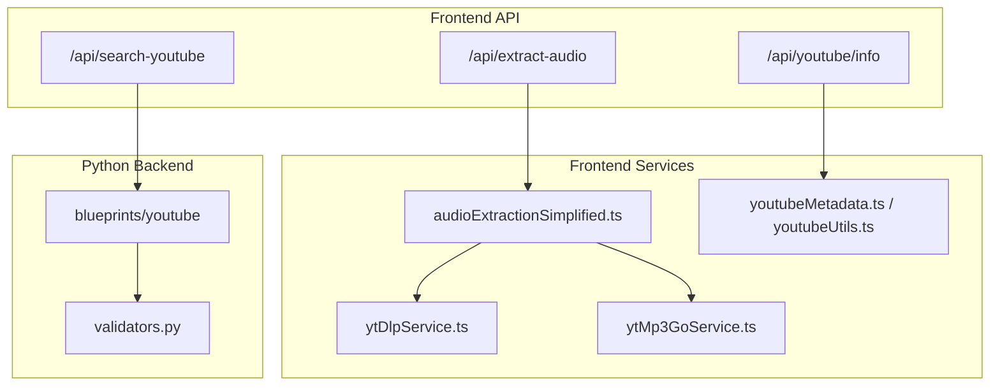
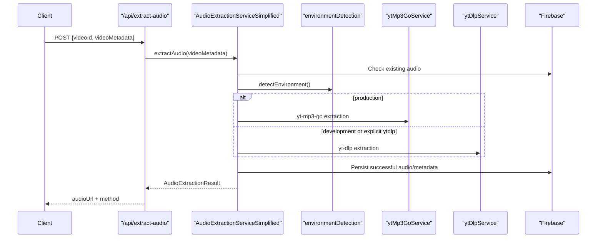
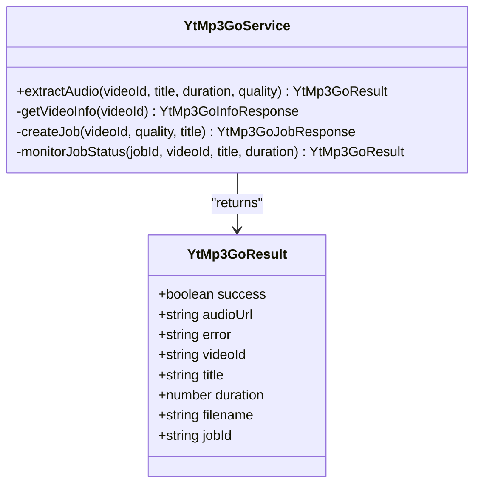

# YouTube Blueprint

<cite>
**Referenced Files in This Document**
- [__init__.py](file://python_backend/blueprints/youtube/__init__.py)
- [validators.py](file://python_backend/blueprints/youtube/validators.py)
- [route.ts](file://src/app/api/search-youtube/route.ts)
- [route.ts](file://src/app/api/youtube/info/route.ts)
- [route.ts](file://src/app/api/extract-audio/route.ts)
- [ytDlpService.ts](file://src/services/youtube/ytDlpService.ts)
- [ytMp3GoService.ts](file://src/services/youtube/ytMp3GoService.ts)
- [audioExtractionSimplified.ts](file://src/services/audio/audioExtractionSimplified.ts)
- [youtubeMetadata.ts](file://src/utils/youtubeMetadata.ts)
- [youtubeUtils.ts](file://src/utils/youtubeUtils.ts)
</cite>

## Introduction
The YouTube blueprint combines search, metadata, and audio extraction. The current frontend extraction stack has these active paths:
- Browser yt-dlp production extraction through `browserYtDlpExtractionService`, `public/browser-ytdlp-worker.js`, Pyodide, ffmpeg.wasm, and the YouTube media proxy.
- No automatic Railway/server yt-dlp fallback for YouTube access challenges; Cloudflare/browser failures surface as extraction errors.
- `ytDlpService` for local development extraction.
- `ytMp3GoService` as deprecated rollback code behind `NEXT_PUBLIC_AUDIO_STRATEGY=yt-mp3-go`.

The legacy deleted legacy extraction compatibility service has been removed. Wiki pages should describe `/api/extract-audio` as the stable frontend API and browser yt-dlp as the production extraction integration. See [YouTube Integration](file://.qoder/repowiki/en/content/Audio Processing and Analysis/YouTube Integration.md) for the Cloudflare Worker proxy contract and troubleshooting notes.

## Project Structure

## Core Components
- Python YouTube blueprint: validates search inputs and provides backend-backed search behavior.
- `/api/search-youtube`: frontend search endpoint and request validation layer.
- `/api/youtube/info`: metadata fallback endpoint.
- `/api/extract-audio`: environment-aware extraction entry point.
- `AudioExtractionServiceSimplified`: cache-first orchestration with Firebase Storage and Firestore metadata.
- `browserYtDlpExtractionService`: production browser extraction, Firebase candidate upload, and finalization.
- `public/browser-ytdlp-worker.js`: Pyodide and yt-dlp runtime that extracts YouTube media URLs through the proxy.
- `YtMp3GoService`: deprecated rollback extraction through yt-mp3-go `/info`, `/download`, and `/events`.
- `YtDlpService`: development extraction through `/api/ytdlp/extract`, `/api/ytdlp/download`, and `/api/ytdlp/health`.

## Audio Extraction Workflow

## yt-mp3-go Service

## Operational Notes
- Production uses medium quality first, retries once, then falls back to low quality.
- Firebase Storage URLs are permanent; external service URLs are marked as stream URLs with expiration metadata.
- yt-dlp is development-oriented and blocked in production unless explicitly enabled.
- The deleted deleted legacy extraction files and routes should not appear in active architecture diagrams.

## Section Sources
- [validators.py:1-171](file://python_backend/blueprints/youtube/validators.py#L1-L171)
- [route.ts](file://src/app/api/search-youtube/route.ts)
- [route.ts](file://src/app/api/youtube/info/route.ts)
- [route.ts:1-116](file://src/app/api/extract-audio/route.ts#L1-L116)
- [audioExtractionSimplified.ts:1-980](file://src/services/audio/audioExtractionSimplified.ts#L1-L980)
- [ytMp3GoService.ts:1-577](file://src/services/youtube/ytMp3GoService.ts#L1-L577)
- [ytDlpService.ts:1-236](file://src/services/youtube/ytDlpService.ts#L1-L236)
