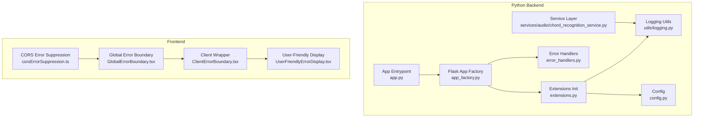
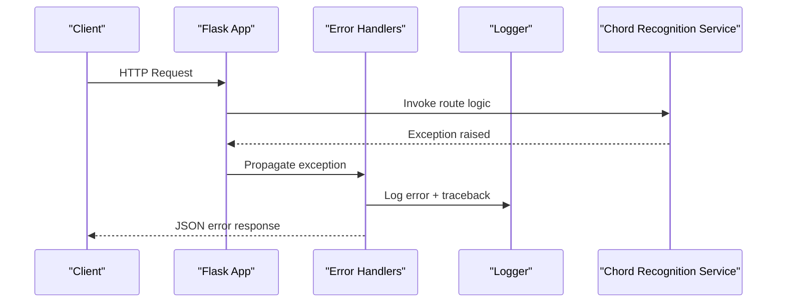
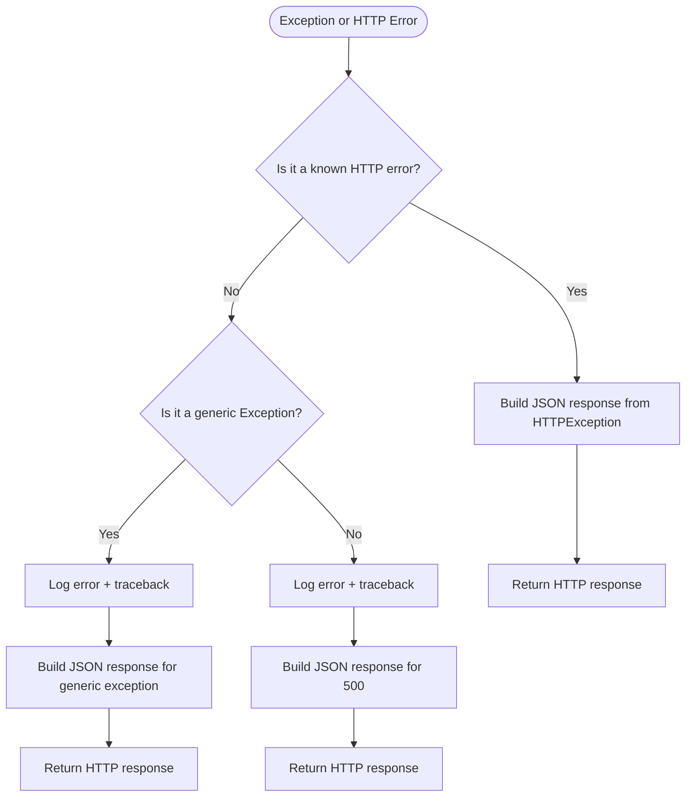
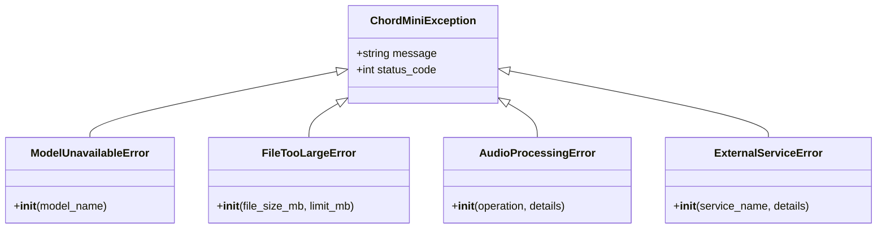
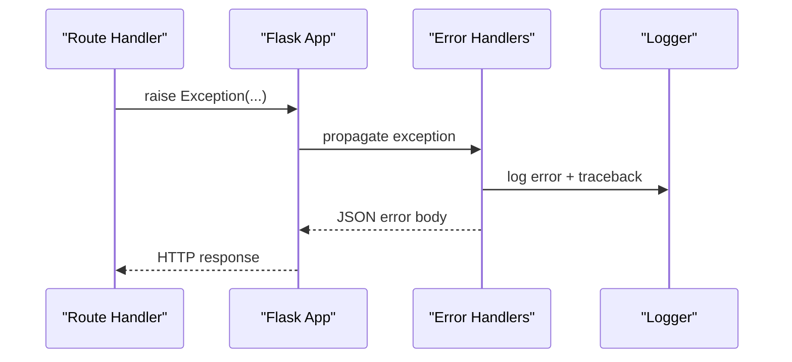
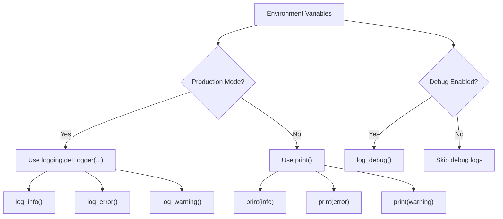
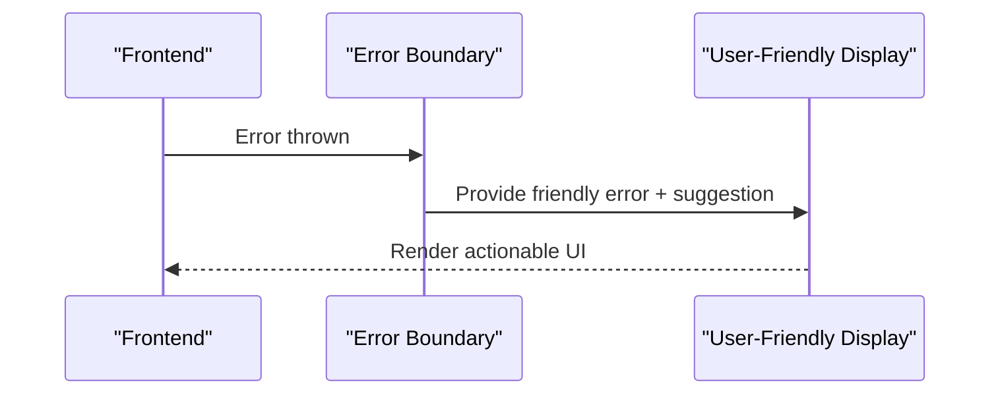
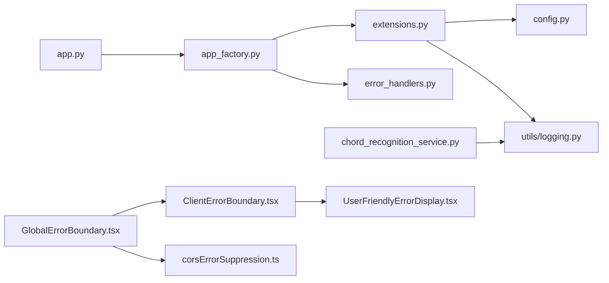

# Error Handling and Logging

<cite>
**Referenced Files in This Document**
- [error_handlers.py](file://python_backend/error_handlers.py)
- [logging.py](file://python_backend/utils/logging.py)
- [extensions.py](file://python_backend/extensions.py)
- [config.py](file://python_backend/config.py)
- [app_factory.py](file://python_backend/app_factory.py)
- [app.py](file://python_backend/app.py)
- [chord_recognition_service.py](file://python_backend/services/audio/chord_recognition_service.py)
- [GlobalErrorBoundary.tsx](file://src/components/common/GlobalErrorBoundary.tsx)
- [ClientErrorBoundary.tsx](file://src/components/common/ClientErrorBoundary.tsx)
- [UserFriendlyErrorDisplay.tsx](file://src/components/common/UserFriendlyErrorDisplay.tsx)
- [corsErrorSuppression.ts](file://src/utils/corsErrorSuppression.ts)
- [firestore.rules](file://firebase/firestore.rules)
</cite>

## Table of Contents
1. [Introduction](#introduction)
2. [Project Structure](#project-structure)
3. [Core Components](#core-components)
4. [Architecture Overview](#architecture-overview)
5. [Detailed Component Analysis](#detailed-component-analysis)
6. [Dependency Analysis](#dependency-analysis)
7. [Performance Considerations](#performance-considerations)
8. [Troubleshooting Guide](#troubleshooting-guide)
9. [Conclusion](#conclusion)
10. [Appendices](#appendices)

## Introduction
This document describes the error handling and logging system architecture for the ChordMini application. It covers centralized error handler configuration, exception propagation patterns, and error response formatting in the Python backend; structured logging implementation, log level management, and production logging best practices; error categorization and user-friendly messaging; debugging information preservation; logging middleware integration; performance impact considerations; log aggregation strategies; error monitoring and alerting; and security considerations for error reporting.

## Project Structure
The error handling and logging system spans both the Python backend and the Next.js frontend:
- Python backend: centralized error handlers, structured logging utilities, Flask extension initialization, and configuration-driven logging levels.
- Frontend: global error boundaries, user-friendly error displays, and client-side CORS error suppression.

**Diagram sources**
- [app_factory.py:27-65](file://python_backend/app_factory.py#L27-L65)
- [extensions.py:81-92](file://python_backend/extensions.py#L81-L92)
- [error_handlers.py:13-93](file://python_backend/error_handlers.py#L13-L93)
- [logging.py:12-91](file://python_backend/utils/logging.py#L12-L91)
- [config.py:16-215](file://python_backend/config.py#L16-L215)
- [app.py:86-186](file://python_backend/app.py#L86-L186)
- [chord_recognition_service.py:1-322](file://python_backend/services/audio/chord_recognition_service.py#L1-L322)
- [GlobalErrorBoundary.tsx:1-88](file://src/components/common/GlobalErrorBoundary.tsx#L1-L88)
- [ClientErrorBoundary.tsx:1-13](file://src/components/common/ClientErrorBoundary.tsx#L1-L13)
- [UserFriendlyErrorDisplay.tsx:1-70](file://src/components/common/UserFriendlyErrorDisplay.tsx#L1-L70)
- [corsErrorSuppression.ts:74-177](file://src/utils/corsErrorSuppression.ts#L74-L177)

**Section sources**
- [app_factory.py:27-65](file://python_backend/app_factory.py#L27-L65)
- [extensions.py:81-92](file://python_backend/extensions.py#L81-L92)
- [error_handlers.py:13-93](file://python_backend/error_handlers.py#L13-L93)
- [logging.py:12-91](file://python_backend/utils/logging.py#L12-L91)
- [config.py:16-215](file://python_backend/config.py#L16-L215)
- [app.py:86-186](file://python_backend/app.py#L86-L186)
- [chord_recognition_service.py:1-322](file://python_backend/services/audio/chord_recognition_service.py#L1-L322)
- [GlobalErrorBoundary.tsx:1-88](file://src/components/common/GlobalErrorBoundary.tsx#L1-L88)
- [ClientErrorBoundary.tsx:1-13](file://src/components/common/ClientErrorBoundary.tsx#L1-L13)
- [UserFriendlyErrorDisplay.tsx:1-70](file://src/components/common/UserFriendlyErrorDisplay.tsx#L1-L70)
- [corsErrorSuppression.ts:74-177](file://src/utils/corsErrorSuppression.ts#L74-L177)

## Core Components
- Centralized Flask error handlers: provide consistent JSON error responses for HTTP exceptions, generic exceptions, rate limit violations, and application-specific exceptions.
- Structured logging utilities: unify logging across production and development modes, with debug toggles and environment-aware sinks.
- Flask extensions initialization: configure CORS, rate limiting, and logging with environment-driven settings.
- Configuration-driven logging levels and formats: define log levels and formats per environment.
- Frontend error boundaries and user-friendly messaging: capture client-side errors, suppress noisy CORS noise, and present actionable messages to users.
- Security controls for error reporting: restrict creation of error logs via Firestore rules.

**Section sources**
- [error_handlers.py:13-161](file://python_backend/error_handlers.py#L13-L161)
- [logging.py:12-91](file://python_backend/utils/logging.py#L12-L91)
- [extensions.py:61-92](file://python_backend/extensions.py#L61-L92)
- [config.py:90-151](file://python_backend/config.py#L90-L151)
- [GlobalErrorBoundary.tsx:19-84](file://src/components/common/GlobalErrorBoundary.tsx#L19-L84)
- [UserFriendlyErrorDisplay.tsx:15-66](file://src/components/common/UserFriendlyErrorDisplay.tsx#L15-L66)
- [corsErrorSuppression.ts:74-177](file://src/utils/corsErrorSuppression.ts#L74-L177)
- [firestore.rules:255-264](file://firebase/firestore.rules#L255-L264)

## Architecture Overview
The system integrates backend and frontend error handling:
- Backend: Flask app factory initializes extensions and registers error handlers; logging is configured centrally; services log structured messages.
- Frontend: global error boundaries catch client-side errors; user-friendly displays render sanitized, actionable messages; CORS error suppression reduces noise.

**Diagram sources**
- [app_factory.py:53-55](file://python_backend/app_factory.py#L53-L55)
- [error_handlers.py:80-91](file://python_backend/error_handlers.py#L80-L91)
- [chord_recognition_service.py:288-296](file://python_backend/services/audio/chord_recognition_service.py#L288-L296)

**Section sources**
- [app_factory.py:53-55](file://python_backend/app_factory.py#L53-L55)
- [error_handlers.py:80-91](file://python_backend/error_handlers.py#L80-L91)
- [chord_recognition_service.py:288-296](file://python_backend/services/audio/chord_recognition_service.py#L288-L296)

## Detailed Component Analysis

### Centralized Error Handler Configuration (Python Backend)
- Registers handlers for HTTP status codes (400, 404, 413, 429, 500), generic HTTP exceptions, and unhandled exceptions.
- Provides user-friendly JSON responses with standardized fields: error name, human-readable message, optional retry-after hint, and status code.
- Logs full tracebacks for 500/internal errors and unhandled exceptions to preserve debugging context.

**Diagram sources**
- [error_handlers.py:21-91](file://python_backend/error_handlers.py#L21-L91)

**Section sources**
- [error_handlers.py:13-93](file://python_backend/error_handlers.py#L13-L93)

### Application-Specific Exceptions and Categorization
- Defines custom exception classes for domain errors: model unavailability, file too large, audio processing failures, and external service errors.
- Each exception carries a message and an associated HTTP status code, enabling consistent error responses and categorization.

**Diagram sources**
- [error_handlers.py:97-140](file://python_backend/error_handlers.py#L97-L140)

**Section sources**
- [error_handlers.py:97-161](file://python_backend/error_handlers.py#L97-L161)

### Exception Propagation Patterns and Response Formatting
- Flask’s errorhandler decorators intercept exceptions and return JSON bodies with consistent structure.
- Rate limit exceptions include a retry-after hint when available.
- Generic and 500 errors include full tracebacks in logs for debugging while returning sanitized messages to clients.

**Diagram sources**
- [error_handlers.py:71-91](file://python_backend/error_handlers.py#L71-L91)

**Section sources**
- [error_handlers.py:48-91](file://python_backend/error_handlers.py#L48-L91)

### Structured Logging Implementation and Log Level Management
- Logging utilities adapt to production vs development: production uses the logging module, development prints to stdout.
- Debug logging is controlled by environment flags and toggled independently of production mode.
- Flask app logger level and format are configured via the configuration class and applied in extensions initialization.

**Diagram sources**
- [logging.py:12-91](file://python_backend/utils/logging.py#L12-L91)
- [extensions.py:61-78](file://python_backend/extensions.py#L61-L78)
- [config.py:90-92](file://python_backend/config.py#L90-L92)

**Section sources**
- [logging.py:12-91](file://python_backend/utils/logging.py#L12-L91)
- [extensions.py:61-78](file://python_backend/extensions.py#L61-L78)
- [config.py:90-151](file://python_backend/config.py#L90-L151)

### Production Logging Best Practices
- Use INFO level in production; enable DEBUG only when necessary.
- Keep log formats consistent across services and include timestamps, module names, and severity.
- Avoid printing secrets or PII; rely on structured logs for correlation and filtering.

[No sources needed since this section provides general guidance]

### Error Categorization and User-Friendly Messages
- Backend: custom exceptions carry explicit status codes and messages; handlers map them to JSON responses.
- Frontend: global error boundaries capture client-side errors; user-friendly displays transform raw errors into readable messages with suggestions and actions.

**Diagram sources**
- [GlobalErrorBoundary.tsx:29-47](file://src/components/common/GlobalErrorBoundary.tsx#L29-L47)
- [UserFriendlyErrorDisplay.tsx:22-40](file://src/components/common/UserFriendlyErrorDisplay.tsx#L22-L40)

**Section sources**
- [error_handlers.py:97-161](file://python_backend/error_handlers.py#L97-L161)
- [GlobalErrorBoundary.tsx:19-84](file://src/components/common/GlobalErrorBoundary.tsx#L19-L84)
- [UserFriendlyErrorDisplay.tsx:15-66](file://src/components/common/UserFriendlyErrorDisplay.tsx#L15-L66)

### Debugging Information Preservation
- 500 and generic exceptions log full tracebacks to aid debugging.
- Services log detailed context (e.g., detector selection, file sizes, processing outcomes) to facilitate troubleshooting.

**Section sources**
- [error_handlers.py:61-85](file://python_backend/error_handlers.py#L61-L85)
- [chord_recognition_service.py:211-287](file://python_backend/services/audio/chord_recognition_service.py#L211-L287)

### Logging Middleware Integration
- Flask extensions initialization configures logging, CORS, and rate limiting; logging is set up before route registration.
- The application factory wires extensions and error handlers during app creation.

**Section sources**
- [extensions.py:81-92](file://python_backend/extensions.py#L81-L92)
- [app_factory.py:50-65](file://python_backend/app_factory.py#L50-L65)

### Performance Impact Considerations
- Logging overhead is minimal at INFO level; DEBUG adds extra string formatting cost.
- Rate limiting prevents abuse and protects downstream systems; ensure Redis-backed storage for distributed environments.
- Frontend error suppression reduces noisy console logs in development, improving developer experience without affecting error visibility.

**Section sources**
- [extensions.py:41-58](file://python_backend/extensions.py#L41-L58)
- [corsErrorSuppression.ts:108-137](file://src/utils/corsErrorSuppression.ts#L108-L137)

### Log Aggregation Strategies
- Centralized logging configuration allows uniform formatting and level control across services.
- In production, logs should be shipped to a centralized collector (e.g., Cloud Logging, Loki, ELK) for querying and alerting.

[No sources needed since this section provides general guidance]

### Error Monitoring Integration and Alerting
- Frontend performance monitor tracks metrics and can emit alerts for significant deviations (e.g., error reduction percentage).
- Firestore rules permit controlled creation of error logs for debugging and monitoring, enforcing size limits and rate limits.

**Section sources**
- [firestore.rules:255-264](file://firebase/firestore.rules#L255-L264)

### Security Considerations for Error Reporting
- Restrict write access to error logs collections; enforce size limits and rate limits.
- Avoid exposing stack traces or sensitive data in client-facing error messages.
- Use environment variables to toggle debug logging and disable debug endpoints in production.

**Section sources**
- [firestore.rules:255-264](file://firebase/firestore.rules#L255-L264)
- [logging.py:18-21](file://python_backend/utils/logging.py#L18-L21)
- [app_factory.py:93-98](file://python_backend/app_factory.py#L93-L98)

## Dependency Analysis

**Diagram sources**
- [app_factory.py:27-65](file://python_backend/app_factory.py#L27-L65)
- [extensions.py:81-92](file://python_backend/extensions.py#L81-L92)
- [error_handlers.py:13-93](file://python_backend/error_handlers.py#L13-L93)
- [config.py:16-215](file://python_backend/config.py#L16-L215)
- [logging.py:12-91](file://python_backend/utils/logging.py#L12-L91)
- [app.py:86-186](file://python_backend/app.py#L86-L186)
- [chord_recognition_service.py:1-322](file://python_backend/services/audio/chord_recognition_service.py#L1-L322)
- [GlobalErrorBoundary.tsx:1-88](file://src/components/common/GlobalErrorBoundary.tsx#L1-L88)
- [ClientErrorBoundary.tsx:1-13](file://src/components/common/ClientErrorBoundary.tsx#L1-L13)
- [UserFriendlyErrorDisplay.tsx:1-70](file://src/components/common/UserFriendlyErrorDisplay.tsx#L1-L70)
- [corsErrorSuppression.ts:74-177](file://src/utils/corsErrorSuppression.ts#L74-L177)

**Section sources**
- [app_factory.py:27-65](file://python_backend/app_factory.py#L27-L65)
- [extensions.py:81-92](file://python_backend/extensions.py#L81-L92)
- [error_handlers.py:13-93](file://python_backend/error_handlers.py#L13-L93)
- [config.py:16-215](file://python_backend/config.py#L16-L215)
- [logging.py:12-91](file://python_backend/utils/logging.py#L12-L91)
- [app.py:86-186](file://python_backend/app.py#L86-L186)
- [chord_recognition_service.py:1-322](file://python_backend/services/audio/chord_recognition_service.py#L1-L322)
- [GlobalErrorBoundary.tsx:1-88](file://src/components/common/GlobalErrorBoundary.tsx#L1-L88)
- [ClientErrorBoundary.tsx:1-13](file://src/components/common/ClientErrorBoundary.tsx#L1-L13)
- [UserFriendlyErrorDisplay.tsx:1-70](file://src/components/common/UserFriendlyErrorDisplay.tsx#L1-L70)
- [corsErrorSuppression.ts:74-177](file://src/utils/corsErrorSuppression.ts#L74-L177)

## Performance Considerations
- Logging: Use INFO in production; DEBUG only when diagnosing issues. Avoid excessive string interpolation in hot paths.
- Rate limiting: Configure Redis-backed storage for horizontal scaling; tune endpoint-specific limits to protect expensive operations.
- Frontend: Suppress harmless CORS errors to reduce console noise and improve responsiveness.

[No sources needed since this section provides general guidance]

## Troubleshooting Guide
- Backend 500 errors: Inspect logs for full tracebacks; verify service availability and model paths; confirm rate limit configuration.
- Unexpected exceptions: Confirm custom exception subclasses are properly raised and handled; ensure logging utilities are used consistently.
- Frontend crashes: Verify global error boundaries are mounted; check user-friendly error display props; review CORS error suppression logic.
- Error logs in Firebase: Confirm Firestore rules allow controlled creation of error logs; verify size and rate limits.

**Section sources**
- [error_handlers.py:61-91](file://python_backend/error_handlers.py#L61-L91)
- [logging.py:58-66](file://python_backend/utils/logging.py#L58-L66)
- [GlobalErrorBoundary.tsx:38-47](file://src/components/common/GlobalErrorBoundary.tsx#L38-L47)
- [UserFriendlyErrorDisplay.tsx:22-40](file://src/components/common/UserFriendlyErrorDisplay.tsx#L22-L40)
- [corsErrorSuppression.ts:108-137](file://src/utils/corsErrorSuppression.ts#L108-L137)
- [firestore.rules:255-264](file://firebase/firestore.rules#L255-L264)

## Conclusion
The ChordMini error handling and logging system combines centralized Flask error handlers, structured logging utilities, and configuration-driven settings with robust frontend error boundaries and user-friendly messaging. It preserves debugging context while maintaining user safety and system performance, and it incorporates security controls for error reporting.

[No sources needed since this section summarizes without analyzing specific files]

## Appendices
- Environment variables influencing logging and behavior:
  - FLASK_ENV, PORT, DEBUG, FLASK_MAX_CONTENT_LENGTH_MB, REDIS_URL, CORS_ORIGINS, LOG_LEVEL, LOG_FORMAT.

**Section sources**
- [config.py:22-92](file://python_backend/config.py#L22-L92)
- [logging.py:13-21](file://python_backend/utils/logging.py#L13-L21)
- [extensions.py:50-58](file://python_backend/extensions.py#L50-L58)