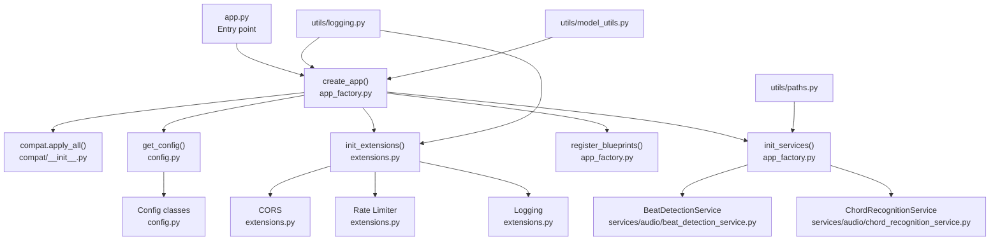
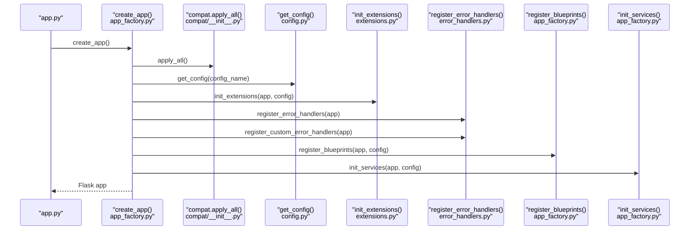
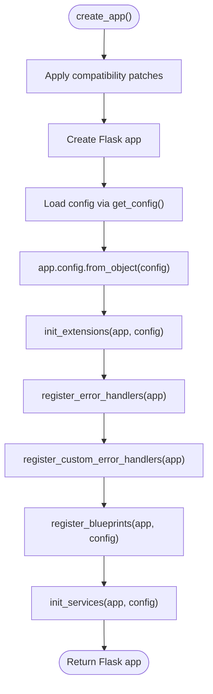
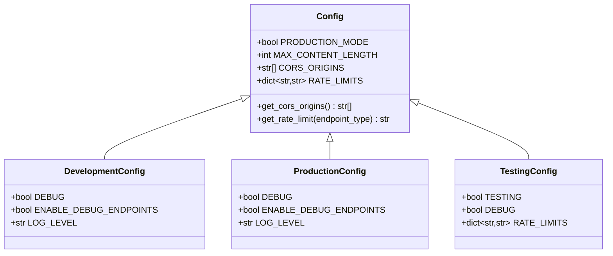
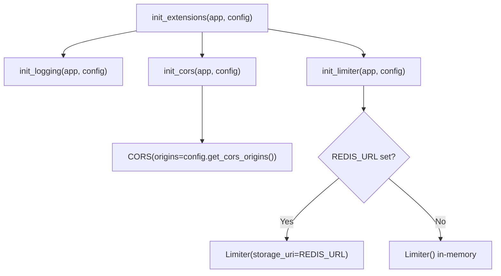
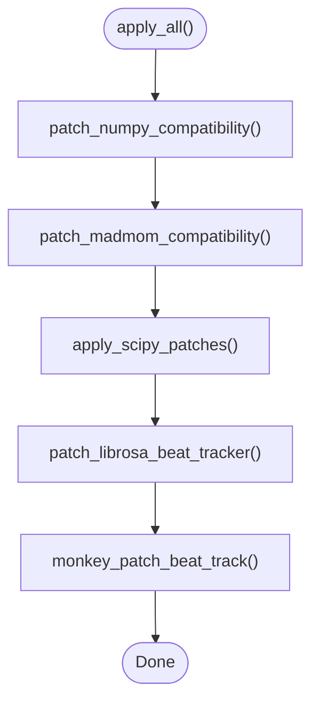
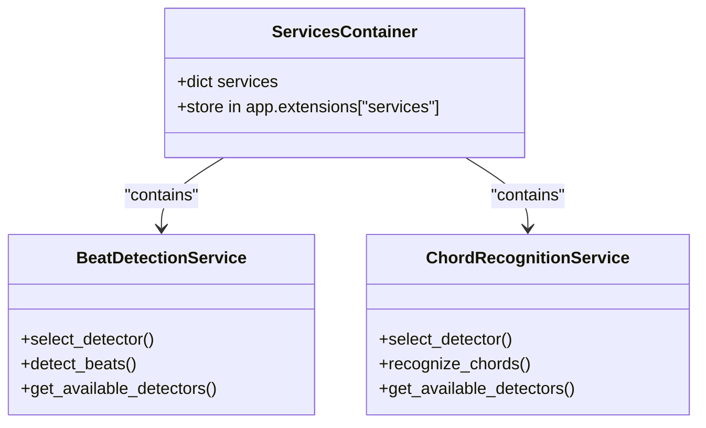
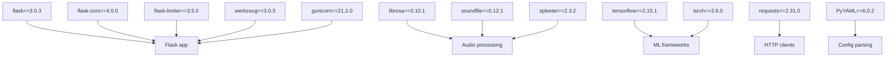

# Flask Application Factory

<cite>
**Referenced Files in This Document**
- [app_factory.py](file://python_backend/app_factory.py)
- [app.py](file://python_backend/app.py)
- [config.py](file://python_backend/config.py)
- [extensions.py](file://python_backend/extensions.py)
- [error_handlers.py](file://python_backend/error_handlers.py)
- [compat/__init__.py](file://python_backend/compat/__init__.py)
- [compat/librosa_patch.py](file://python_backend/compat/librosa_patch.py)
- [compat/madmom_patch.py](file://python_backend/compat/madmom_patch.py)
- [utils/logging.py](file://python_backend/utils/logging.py)
- [utils/model_utils.py](file://python_backend/utils/model_utils.py)
- [utils/paths.py](file://python_backend/utils/paths.py)
- [blueprints/health/__init__.py](file://python_backend/blueprints/health/__init__.py)
- [services/audio/beat_detection_service.py](file://python_backend/services/audio/beat_detection_service.py)
- [services/audio/chord_recognition_service.py](file://python_backend/services/audio/chord_recognition_service.py)
- [requirements.txt](file://python_backend/requirements.txt)
</cite>

## Table of Contents
1. [Introduction](#introduction)
2. [Project Structure](#project-structure)
3. [Core Components](#core-components)
4. [Architecture Overview](#architecture-overview)
5. [Detailed Component Analysis](#detailed-component-analysis)
6. [Dependency Analysis](#dependency-analysis)
7. [Performance Considerations](#performance-considerations)
8. [Troubleshooting Guide](#troubleshooting-guide)
9. [Conclusion](#conclusion)

## Introduction
This document explains the Flask application factory pattern implementation used in the backend. It covers the create_app() function architecture, configuration management, environment-based configuration loading, CORS setup, rate limiting, logging initialization, compatibility patch application, model availability checks, dependency injection patterns, application lifecycle, error handling, and production versus development differences. It also describes the modular initialization approach and how extensions are registered and configured.

## Project Structure
The Flask backend is organized around a clear separation of concerns:
- Application factory and lifecycle: app_factory.py
- Entry point and legacy wiring: app.py
- Configuration classes and environment detection: config.py
- Extension registration and initialization: extensions.py
- Centralized error handling: error_handlers.py
- Compatibility patches for NumPy, SciPy, madmom, librosa: compat/*
- Utilities for logging, model availability, and paths: utils/*
- Blueprints for modular routing: blueprints/*
- Services for domain logic: services/*

**Diagram sources**
- [app.py:86-87](file://python_backend/app.py#L86-L87)
- [app_factory.py:27-65](file://python_backend/app_factory.py#L27-L65)
- [compat/__init__.py:21-36](file://python_backend/compat/__init__.py#L21-L36)
- [config.py:195-215](file://python_backend/config.py#L195-L215)
- [extensions.py:81-93](file://python_backend/extensions.py#L81-L93)
- [utils/logging.py:12-91](file://python_backend/utils/logging.py#L12-L91)
- [utils/paths.py:45-62](file://python_backend/utils/paths.py#L45-L62)
- [utils/model_utils.py:90-139](file://python_backend/utils/model_utils.py#L90-L139)

**Section sources**
- [app.py:1-186](file://python_backend/app.py#L1-L186)
- [app_factory.py:1-162](file://python_backend/app_factory.py#L1-L162)
- [config.py:1-215](file://python_backend/config.py#L1-L215)
- [extensions.py:1-93](file://python_backend/extensions.py#L1-L93)
- [compat/__init__.py:1-36](file://python_backend/compat/__init__.py#L1-L36)
- [utils/logging.py:1-91](file://python_backend/utils/logging.py#L1-L91)
- [utils/paths.py:1-191](file://python_backend/utils/paths.py#L1-L191)
- [utils/model_utils.py:1-326](file://python_backend/utils/model_utils.py#L1-L326)

## Core Components
- Application factory: create_app() initializes compatibility patches, loads configuration, registers extensions, error handlers, blueprints, and services.
- Configuration system: centralized Config classes with environment detection and feature toggles.
- Extensions: CORS, rate limiter, and logging are initialized via init_extensions().
- Error handling: centralized handlers for HTTP and custom exceptions.
- Compatibility patches: applied early to resolve library compatibility issues.
- Service container: dependency injection via app.extensions['services'] populated at runtime.
- Logging utilities: environment-aware logging functions.

**Section sources**
- [app_factory.py:27-65](file://python_backend/app_factory.py#L27-L65)
- [config.py:16-215](file://python_backend/config.py#L16-L215)
- [extensions.py:81-93](file://python_backend/extensions.py#L81-L93)
- [error_handlers.py:13-161](file://python_backend/error_handlers.py#L13-L161)
- [compat/__init__.py:21-36](file://python_backend/compat/__init__.py#L21-L36)
- [utils/logging.py:12-91](file://python_backend/utils/logging.py#L12-L91)

## Architecture Overview
The application follows a modular factory pattern:
- Early compatibility patch application ensures downstream libraries work reliably.
- Configuration is loaded from environment variables and mapped to appropriate Config subclasses.
- Extensions are initialized with environment-aware settings (CORS origins, rate limit storage).
- Blueprints are conditionally registered (debug blueprint excluded in production).
- A simple dependency injection container holds service instances.
- Error handlers unify HTTP and application-specific exceptions.

**Diagram sources**
- [app.py:86-87](file://python_backend/app.py#L86-L87)
- [app_factory.py:27-65](file://python_backend/app_factory.py#L27-L65)
- [compat/__init__.py:21-36](file://python_backend/compat/__init__.py#L21-L36)
- [config.py:195-215](file://python_backend/config.py#L195-L215)
- [extensions.py:81-93](file://python_backend/extensions.py#L81-L93)
- [error_handlers.py:13-161](file://python_backend/error_handlers.py#L13-L161)

## Detailed Component Analysis

### Application Factory and Lifecycle
- create_app() orchestrates the entire initialization sequence.
- Compatibility patches are applied before heavy imports.
- Configuration is resolved from environment variables and applied to Flask config.
- Extensions, error handlers, blueprints, and services are registered in a predictable order.
- The debug blueprint is conditionally registered based on production mode.

**Diagram sources**
- [app_factory.py:27-65](file://python_backend/app_factory.py#L27-L65)
- [app_factory.py:68-101](file://python_backend/app_factory.py#L68-L101)
- [app_factory.py:103-162](file://python_backend/app_factory.py#L103-L162)

**Section sources**
- [app_factory.py:27-65](file://python_backend/app_factory.py#L27-L65)
- [app_factory.py:68-101](file://python_backend/app_factory.py#L68-L101)
- [app_factory.py:103-162](file://python_backend/app_factory.py#L103-L162)

### Configuration Management System
- Base Config centralizes defaults: secret key, production mode detection, CORS origins, rate limits, timeouts, and model paths.
- DevelopmentConfig and ProductionConfig override behavior for development and production modes respectively.
- TestingConfig disables rate limits and shortens timeouts for tests.
- get_config() auto-detects environment from FLASK_ENV, PORT, and TESTING flags.

**Diagram sources**
- [config.py:16-103](file://python_backend/config.py#L16-L103)
- [config.py:105-127](file://python_backend/config.py#L105-L127)
- [config.py:129-151](file://python_backend/config.py#L129-L151)
- [config.py:153-184](file://python_backend/config.py#L153-L184)
- [config.py:195-215](file://python_backend/config.py#L195-L215)

**Section sources**
- [config.py:16-215](file://python_backend/config.py#L16-L215)

### CORS Setup and Rate Limiting
- CORS is initialized with origins from configuration and credentials support.
- Rate limiting is initialized with optional Redis storage URI; falls back to in-memory storage.
- Logging level and format are set according to configuration.

**Diagram sources**
- [extensions.py:81-93](file://python_backend/extensions.py#L81-L93)
- [extensions.py:22-38](file://python_backend/extensions.py#L22-L38)
- [extensions.py:41-58](file://python_backend/extensions.py#L41-L58)
- [extensions.py:61-78](file://python_backend/extensions.py#L61-L78)

**Section sources**
- [extensions.py:17-93](file://python_backend/extensions.py#L17-L93)

### Logging Initialization
- Logging is configured globally and per-app logger based on configuration.
- Environment-aware behavior: production uses logger, development prints to console when debug is enabled.

**Section sources**
- [extensions.py:61-78](file://python_backend/extensions.py#L61-L78)
- [utils/logging.py:12-91](file://python_backend/utils/logging.py#L12-L91)

### Compatibility Patch Application System
- apply_all() applies patches in a specific order to resolve compatibility issues with NumPy, SciPy, madmom, and librosa.
- librosa patch replaces deprecated scipy.signal.hann usage and monkey-patches beat_track.
- madmom patch restores collections.MutableSequence for Python 3.10+.

**Diagram sources**
- [compat/__init__.py:21-36](file://python_backend/compat/__init__.py#L21-L36)
- [compat/librosa_patch.py:14-97](file://python_backend/compat/librosa_patch.py#L14-L97)
- [compat/madmom_patch.py:12-33](file://python_backend/compat/madmom_patch.py#L12-L33)

**Section sources**
- [compat/__init__.py:1-36](file://python_backend/compat/__init__.py#L1-L36)
- [compat/librosa_patch.py:1-97](file://python_backend/compat/librosa_patch.py#L1-L97)
- [compat/madmom_patch.py:1-33](file://python_backend/compat/madmom_patch.py#L1-L33)

### Model Availability Checks and Dependency Injection
- init_services() sets up model paths, creates a simple service container, and attempts to instantiate services.
- On failures, dummy services are stored to avoid crashes and allow graceful degradation.
- Services are stored in app.extensions['services'] for later retrieval by routes.

**Diagram sources**
- [services/audio/beat_detection_service.py:20-348](file://python_backend/services/audio/beat_detection_service.py#L20-L348)
- [services/audio/chord_recognition_service.py:25-322](file://python_backend/services/audio/chord_recognition_service.py#L25-L322)
- [app_factory.py:103-162](file://python_backend/app_factory.py#L103-L162)

**Section sources**
- [app_factory.py:103-162](file://python_backend/app_factory.py#L103-L162)
- [utils/paths.py:45-62](file://python_backend/utils/paths.py#L45-L62)
- [utils/model_utils.py:90-139](file://python_backend/utils/model_utils.py#L90-L139)

### Application Lifecycle Management
- Early patch application occurs in app.py before create_app() is invoked.
- create_app() performs ordered initialization: patches, config, extensions, error handlers, blueprints, services.
- Blueprints are registered conditionally based on production mode.
- The application is started with environment-driven port and debug settings.

**Section sources**
- [app.py:9-11](file://python_backend/app.py#L9-L11)
- [app.py:86-87](file://python_backend/app.py#L86-L87)
- [app_factory.py:68-101](file://python_backend/app_factory.py#L68-L101)
- [app.py:180-186](file://python_backend/app.py#L180-L186)

### Error Handling Setup
- register_error_handlers() provides JSON responses for common HTTP errors (400, 404, 413, 429, 500) and generic HTTP exceptions.
- register_custom_error_handlers() handles application-specific exceptions with structured JSON responses.
- Centralized logging of stack traces for debugging.

**Section sources**
- [error_handlers.py:13-94](file://python_backend/error_handlers.py#L13-L94)
- [error_handlers.py:142-161](file://python_backend/error_handlers.py#L142-L161)

### Modular Initialization Approach and Blueprints
- Blueprints are imported and registered centrally in register_blueprints().
- Debug blueprint is only registered outside production mode.
- Health blueprint is always registered.

**Section sources**
- [app_factory.py:68-101](file://python_backend/app_factory.py#L68-L101)
- [blueprints/health/__init__.py:1-10](file://python_backend/blueprints/health/__init__.py#L1-L10)

### Production vs Development Configuration Differences
- ProductionConfig disables debug endpoints and uses stricter rate limits.
- DevelopmentConfig enables debug endpoints and more lenient rate limits.
- TestingConfig removes rate limits and shortens timeouts for tests.
- Logging levels differ accordingly.

**Section sources**
- [config.py:105-127](file://python_backend/config.py#L105-L127)
- [config.py:129-151](file://python_backend/config.py#L129-L151)
- [config.py:153-184](file://python_backend/config.py#L153-L184)

## Dependency Analysis
The Flask backend depends on a curated set of packages for web serving, audio processing, machine learning frameworks, and utilities. The requirements file reflects pinned versions to ensure reproducibility across environments.

**Diagram sources**
- [requirements.txt:18-25](file://python_backend/requirements.txt#L18-L25)
- [requirements.txt:29-34](file://python_backend/requirements.txt#L29-L34)
- [requirements.txt:39-47](file://python_backend/requirements.txt#L39-L47)
- [requirements.txt:50-54](file://python_backend/requirements.txt#L50-L54)
- [requirements.txt:89-98](file://python_backend/requirements.txt#L89-L98)

**Section sources**
- [requirements.txt:1-131](file://python_backend/requirements.txt#L1-L131)

## Performance Considerations
- Compatibility patches reduce runtime errors and improve stability, indirectly improving reliability under load.
- Rate limiting prevents abuse and protects downstream services; Redis-backed storage scales horizontally.
- Environment-aware logging avoids unnecessary overhead in production.
- Service initialization uses lazy imports and dummy fallbacks to minimize cold-start impact.
- Model availability checks are deferred to runtime to accelerate startup.

## Troubleshooting Guide
- If CORS requests fail, verify CORS_ORIGINS configuration and environment variable overrides.
- If rate limiting appears ineffective, confirm REDIS_URL configuration and storage backend reachability.
- If services fail to initialize, check service container entries in app.extensions['services'] and logs for initialization errors.
- For audio processing issues, validate model paths and availability using model utilities.
- For unhandled exceptions, review centralized error handler logs and stack traces.

**Section sources**
- [extensions.py:22-38](file://python_backend/extensions.py#L22-L38)
- [extensions.py:41-58](file://python_backend/extensions.py#L41-L58)
- [app_factory.py:103-162](file://python_backend/app_factory.py#L103-L162)
- [utils/model_utils.py:90-139](file://python_backend/utils/model_utils.py#L90-L139)
- [error_handlers.py:61-91](file://python_backend/error_handlers.py#L61-L91)

## Conclusion
The Flask application factory pattern cleanly separates concerns, enabling modular initialization, environment-aware configuration, robust error handling, and extensible service injection. Compatibility patches ensure library stability, while CORS, rate limiting, and logging are configured centrally. The design supports both development and production with minimal friction, and the modular blueprint system facilitates maintainability and scalability.