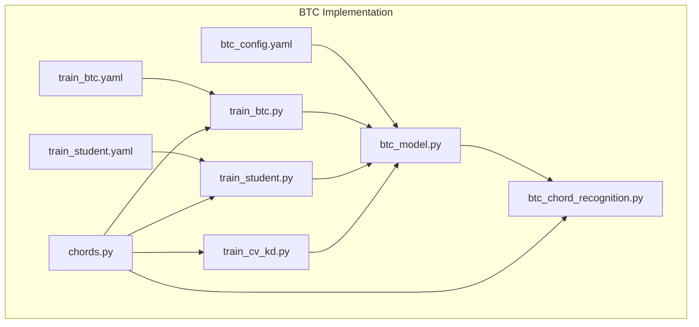
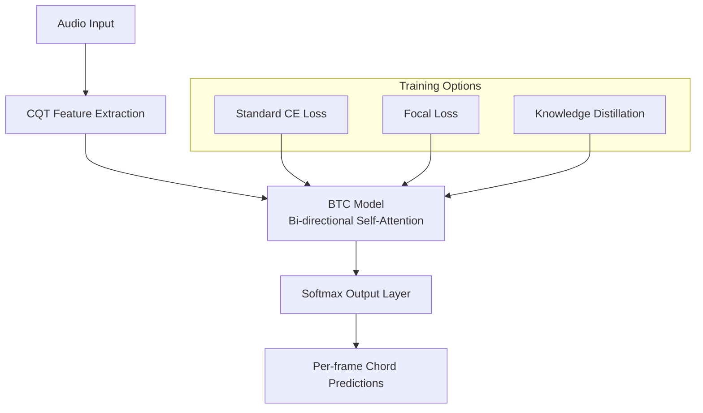
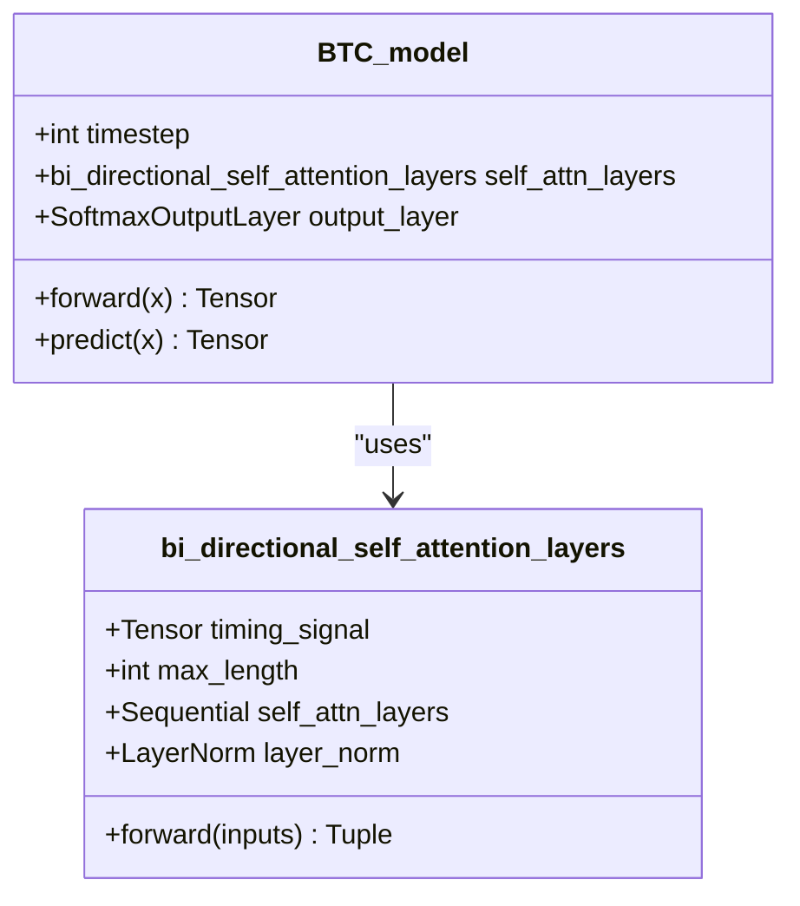
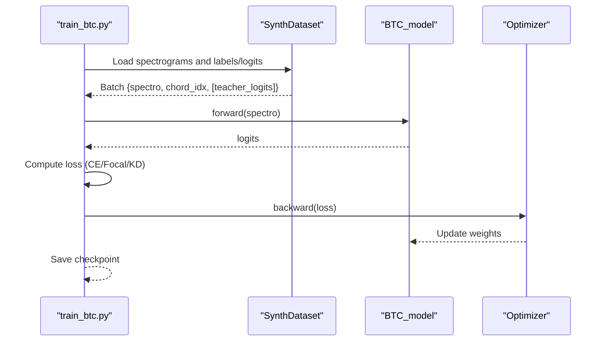
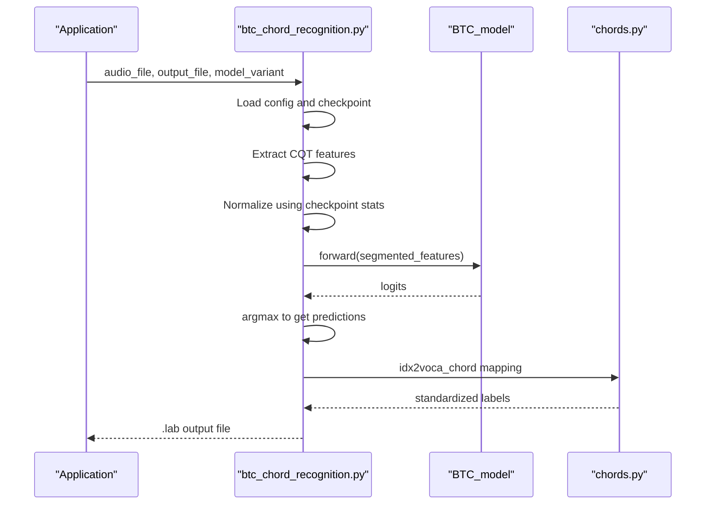
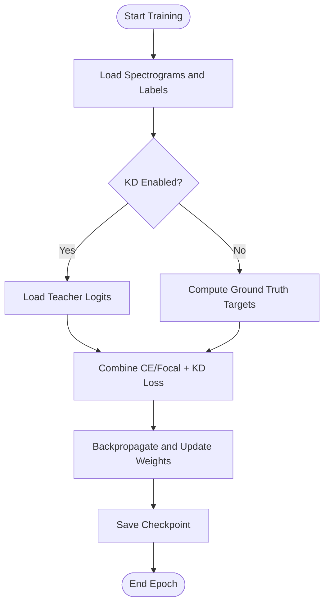
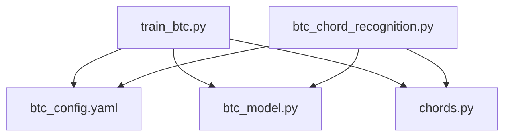

# BTC Model Variants

<cite>
**Referenced Files in This Document**
- [btc_config.yaml](file://python_backend/config/btc_config.yaml)
- [btc_model.py](file://python_backend/models/ChordMini/modules/models/Transformer/btc_model.py)
- [btc_chord_recognition.py](file://python_backend/models/ChordMini/btc_chord_recognition.py)
- [train_btc.py](file://python_backend/models/ChordMini/train_btc.py)
- [train_student.py](file://python_backend/models/ChordMini/train_student.py)
- [train_cv_kd.py](file://python_backend/models/ChordMini/train_cv_kd.py)
- [train_btc.yaml](file://python_backend/models/ChordMini/train_btc.yaml)
- [train_student.yaml](file://python_backend/models/ChordMini/train_student.yaml)
- [chords.py](file://python_backend/models/ChordMini/modules/utils/chords.py)
- [README.md](file://python_backend/models/Beat-Transformer/README.md)
</cite>

## Table of Contents
1. [Introduction](#introduction)
2. [Project Structure](#project-structure)
3. [Core Components](#core-components)
4. [Architecture Overview](#architecture-overview)
5. [Detailed Component Analysis](#detailed-component-analysis)
6. [Dependency Analysis](#dependency-analysis)
7. [Performance Considerations](#performance-considerations)
8. [Troubleshooting Guide](#troubleshooting-guide)
9. [Conclusion](#conclusion)

## Introduction
This document provides comprehensive documentation for the Beat-Transformer-Chord (BTC) model variants, focusing on Self-Label (SL) and Pseudo-Label (PL) approaches. It explains the teacher-student distillation training methodology, model fine-tuning procedures, and knowledge transfer mechanisms. The document details the differences between SL and PL variants, their respective training datasets, performance characteristics, model configuration files, hyperparameter settings, evaluation protocols, training pipelines, validation procedures, and how the models leverage pre-trained Beat-Transformer components. It also covers model selection criteria, inference optimization, and quality assessment metrics.

## Project Structure
The BTC implementation resides within the ChordMini application under the Python backend. Key directories and files include:
- Configuration: btc_config.yaml defines model and training parameters.
- Models: BTC_model encapsulates the transformer-based chord recognition architecture.
- Training: train_btc.py orchestrates BTC training with optional knowledge distillation and focal loss.
- Inference: btc_chord_recognition.py performs inference using SL or PL checkpoints.
- Kubernetes Jobs: train_btc.yaml and train_student.yaml define containerized training jobs.
- Utilities: chords.py provides chord mapping and evaluation utilities.

**Diagram sources**
- [btc_config.yaml:1-61](file://python_backend/config/btc_config.yaml#L1-L61)
- [btc_model.py:158-264](file://python_backend/models/ChordMini/modules/models/Transformer/btc_model.py#L158-L264)
- [btc_chord_recognition.py:166-357](file://python_backend/models/ChordMini/btc_chord_recognition.py#L166-L357)
- [train_btc.py:35-800](file://python_backend/models/ChordMini/train_btc.py#L35-L800)
- [train_student.py:32-800](file://python_backend/models/ChordMini/train_student.py#L32-L800)
- [train_cv_kd.py:161-800](file://python_backend/models/ChordMini/train_cv_kd.py#L161-L800)
- [train_btc.yaml:1-434](file://python_backend/models/ChordMini/train_btc.yaml#L1-L434)
- [train_student.yaml:1-612](file://python_backend/models/ChordMini/train_student.yaml#L1-L612)
- [chords.py:1-800](file://python_backend/models/ChordMini/modules/utils/chords.py#L1-L800)

**Section sources**
- [btc_config.yaml:1-61](file://python_backend/config/btc_config.yaml#L1-L61)
- [btc_model.py:158-264](file://python_backend/models/ChordMini/modules/models/Transformer/btc_model.py#L158-L264)
- [btc_chord_recognition.py:166-357](file://python_backend/models/ChordMini/btc_chord_recognition.py#L166-L357)
- [train_btc.py:35-800](file://python_backend/models/ChordMini/train_btc.py#L35-L800)
- [train_student.py:32-800](file://python_backend/models/ChordMini/train_student.py#L32-L800)
- [train_cv_kd.py:161-800](file://python_backend/models/ChordMini/train_cv_kd.py#L161-L800)
- [train_btc.yaml:1-434](file://python_backend/models/ChordMini/train_btc.yaml#L1-L434)
- [train_student.yaml:1-612](file://python_backend/models/ChordMini/train_student.yaml#L1-L612)
- [chords.py:1-800](file://python_backend/models/ChordMini/modules/utils/chords.py#L1-L800)

## Core Components
- BTC Model: Implements a bidirectional self-attention architecture with configurable transformer parameters, designed for chord classification from spectro-temporal features.
- Training Orchestration: train_btc.py supports standard cross-entropy, focal loss, and knowledge distillation with optional teacher logits.
- Inference Pipeline: btc_chord_recognition.py loads SL or PL checkpoints, normalizes features using checkpoint statistics, segments long sequences, and generates .lab output.
- Configuration: btc_config.yaml centralizes audio feature settings, experiment hyperparameters, and model architecture parameters.
- Evaluation Utilities: chords.py provides chord mapping and normalization for evaluation consistency.

**Section sources**
- [btc_model.py:158-264](file://python_backend/models/ChordMini/modules/models/Transformer/btc_model.py#L158-L264)
- [train_btc.py:35-800](file://python_backend/models/ChordMini/train_btc.py#L35-L800)
- [btc_chord_recognition.py:166-357](file://python_backend/models/ChordMini/btc_chord_recognition.py#L166-L357)
- [btc_config.yaml:1-61](file://python_backend/config/btc_config.yaml#L1-L61)
- [chords.py:1-800](file://python_backend/models/ChordMini/modules/utils/chords.py#L1-L800)

## Architecture Overview
The BTC architecture comprises:
- Feature Input: Log-magnitude CQT spectrograms with 144 frequency bins.
- Transformer Encoder: Bidirectional self-attention layers with timing embeddings.
- Output Head: Softmax output layer producing per-frame chord probabilities.
- Training Modes: Supervised learning (SL) and pseudo-label (PL) distillation.

**Diagram sources**
- [btc_model.py:158-264](file://python_backend/models/ChordMini/modules/models/Transformer/btc_model.py#L158-L264)
- [train_btc.py:288-333](file://python_backend/models/ChordMini/train_btc.py#L288-L333)

**Section sources**
- [btc_model.py:158-264](file://python_backend/models/ChordMini/modules/models/Transformer/btc_model.py#L158-L264)
- [train_btc.py:288-333](file://python_backend/models/ChordMini/train_btc.py#L288-L333)

## Detailed Component Analysis

### BTC Model Architecture
The BTC model implements a bidirectional self-attention stack with timing embeddings and a softmax output head. It accepts spectrograms and returns per-frame logits.

**Diagram sources**
- [btc_model.py:158-264](file://python_backend/models/ChordMini/modules/models/Transformer/btc_model.py#L158-L264)

**Section sources**
- [btc_model.py:158-264](file://python_backend/models/ChordMini/modules/models/Transformer/btc_model.py#L158-L264)

### Training Pipelines: SL vs PL
- Self-Label (SL) Training:
  - Uses synthetic or labeled data with ground-truth labels.
  - Supports focal loss and standard cross-entropy.
  - Can optionally incorporate teacher logits for distillation.
- Pseudo-Label (PL) Training:
  - Leverages pre-computed teacher logits for distillation.
  - Supports focal loss and knowledge distillation with temperature scaling.
  - Can be trained with combined datasets (FMA, Maestro, DALI).

**Diagram sources**
- [train_btc.py:560-800](file://python_backend/models/ChordMini/train_btc.py#L560-L800)

**Section sources**
- [train_btc.py:35-800](file://python_backend/models/ChordMini/train_btc.py#L35-L800)

### Inference Pipeline (SL vs PL)
The inference pipeline loads the appropriate checkpoint, normalizes features using stored mean/std, segments frames, and produces .lab output with standardized chord labels.

**Diagram sources**
- [btc_chord_recognition.py:166-357](file://python_backend/models/ChordMini/btc_chord_recognition.py#L166-L357)
- [chords.py:1-800](file://python_backend/models/ChordMini/modules/utils/chords.py#L1-L800)

**Section sources**
- [btc_chord_recognition.py:166-357](file://python_backend/models/ChordMini/btc_chord_recognition.py#L166-L357)
- [chords.py:1-800](file://python_backend/models/ChordMini/modules/utils/chords.py#L1-L800)

### Knowledge Transfer Mechanisms
- Teacher-Student Distillation:
  - Uses teacher logits to soften targets via KL divergence.
  - Mixes KD loss with CE or focal loss using alpha weighting and temperature scaling.
  - Loads normalization statistics from teacher checkpoint for consistent feature scaling.
- Offline Logits:
  - Requires pre-computed logits directory aligned with spectrogram/label structure.
  - Enables training without online teacher inference.

**Diagram sources**
- [train_btc.py:288-333](file://python_backend/models/ChordMini/train_btc.py#L288-L333)
- [train_cv_kd.py:394-429](file://python_backend/models/ChordMini/train_cv_kd.py#L394-L429)

**Section sources**
- [train_btc.py:288-333](file://python_backend/models/ChordMini/train_btc.py#L288-L333)
- [train_cv_kd.py:394-429](file://python_backend/models/ChordMini/train_cv_kd.py#L394-L429)

### Model Configuration and Hyperparameters
Key configuration areas:
- Audio Processing: sample rate, hop length, CQT bins, and duration mapping.
- Experiment Settings: learning rate, weight decay, max epochs, batch size, saving steps, and data ratio.
- Model Architecture: feature size, sequence length, stride, number of chords, transformer layers, heads, hidden size, dropout rates, and output configuration.
- Paths: SL and PL model paths for inference.

**Section sources**
- [btc_config.yaml:1-61](file://python_backend/config/btc_config.yaml#L1-L61)

### Evaluation Protocols and Metrics
- Large Vocabulary (170 chords) support via configuration.
- Chord mapping and normalization utilities for evaluation consistency.
- MIR evaluation functions integrated in training/testing modules.

**Section sources**
- [chords.py:1-800](file://python_backend/models/ChordMini/modules/utils/chords.py#L1-L800)
- [train_btc.py:18-28](file://python_backend/models/ChordMini/train_btc.py#L18-L28)

### Leveraging Pre-trained Beat-Transformer Components
- Beat-Transformer repository provides pre-trained beat/downbeat tracking models and training utilities.
- BTC leverages similar spectro-temporal processing and transformer stacks for chord recognition.
- Normalization statistics can be loaded from Beat-Transformer checkpoints for consistent inference.

**Section sources**
- [README.md:1-75](file://python_backend/models/Beat-Transformer/README.md#L1-L75)

## Dependency Analysis
The BTC training and inference modules depend on:
- PyTorch for model definition and training loops.
- NumPy and SciPy for numerical operations and interpolation.
- Librosa for audio feature extraction (CQT).
- Custom modules for dataset handling, evaluation, and utilities.

**Diagram sources**
- [train_btc.py:17-30](file://python_backend/models/ChordMini/train_btc.py#L17-L30)
- [btc_chord_recognition.py:22-58](file://python_backend/models/ChordMini/btc_chord_recognition.py#L22-L58)
- [btc_model.py:1-5](file://python_backend/models/ChordMini/modules/models/Transformer/btc_model.py#L1-L5)
- [chords.py:1-15](file://python_backend/models/ChordMini/modules/utils/chords.py#L1-L15)

**Section sources**
- [train_btc.py:17-30](file://python_backend/models/ChordMini/train_btc.py#L17-L30)
- [btc_chord_recognition.py:22-58](file://python_backend/models/ChordMini/btc_chord_recognition.py#L22-L58)
- [btc_model.py:1-5](file://python_backend/models/ChordMini/modules/models/Transformer/btc_model.py#L1-L5)
- [chords.py:1-15](file://python_backend/models/ChordMini/modules/utils/chords.py#L1-L15)

## Performance Considerations
- Sequence Chunking: Long audio is segmented into fixed-length chunks to fit the model's timestep, ensuring memory efficiency and consistent processing.
- Normalization: Uses checkpoint-derived mean/std for stable inference across diverse audio.
- Dropout and Regularization: Configurable dropout rates across input, attention, and feed-forward layers.
- Focal Loss: Mitigates class imbalance by focusing on hard-to-classify frames.
- Knowledge Distillation: Improves generalization by leveraging soft teacher targets.

[No sources needed since this section provides general guidance]

## Troubleshooting Guide
Common issues and resolutions:
- Missing Checkpoint Statistics: Ensure teacher checkpoint normalization parameters are available; fallback to defaults if loading fails.
- Data Path Issues: Verify spectrogram and label/logits directories exist and are correctly linked; Kubernetes job scripts create symlinks.
- CUDA Memory: Reduce batch size or enable GPU batch caching; clear GPU cache before training.
- Inference Failures: Validate audio file integrity and feature extraction paths; fallback methods are available if CQT fails.

**Section sources**
- [train_btc.py:729-742](file://python_backend/models/ChordMini/train_btc.py#L729-L742)
- [train_btc.yaml:74-116](file://python_backend/models/ChordMini/train_btc.yaml#L74-L116)
- [train_student.yaml:67-131](file://python_backend/models/ChordMini/train_student.yaml#L67-L131)
- [btc_chord_recognition.py:154-164](file://python_backend/models/ChordMini/btc_chord_recognition.py#L154-L164)

## Conclusion
The BTC model variants (SL and PL) provide robust chord recognition by combining transformer-based sequence modeling with supervised and distillation-based training strategies. The SL variant trains directly from labels, while the PL variant leverages pre-computed teacher logits for improved generalization. The training and inference pipelines are modular, configurable, and optimized for performance and reproducibility. Proper configuration of audio features, model architecture, and training hyperparameters ensures strong performance across diverse datasets and evaluation metrics.