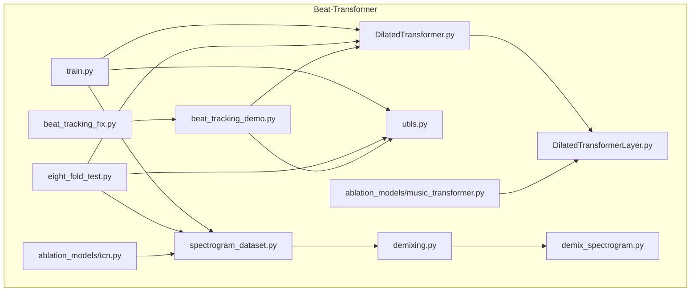
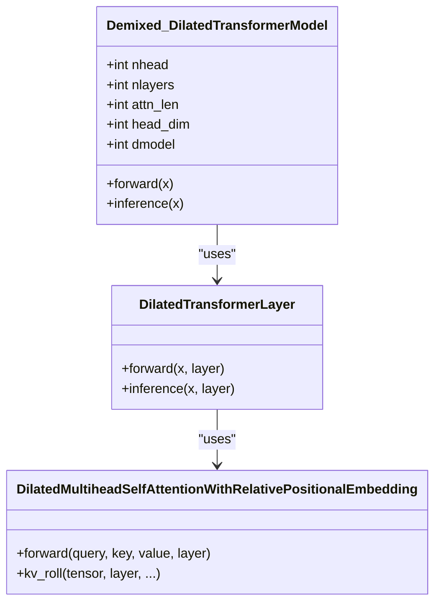
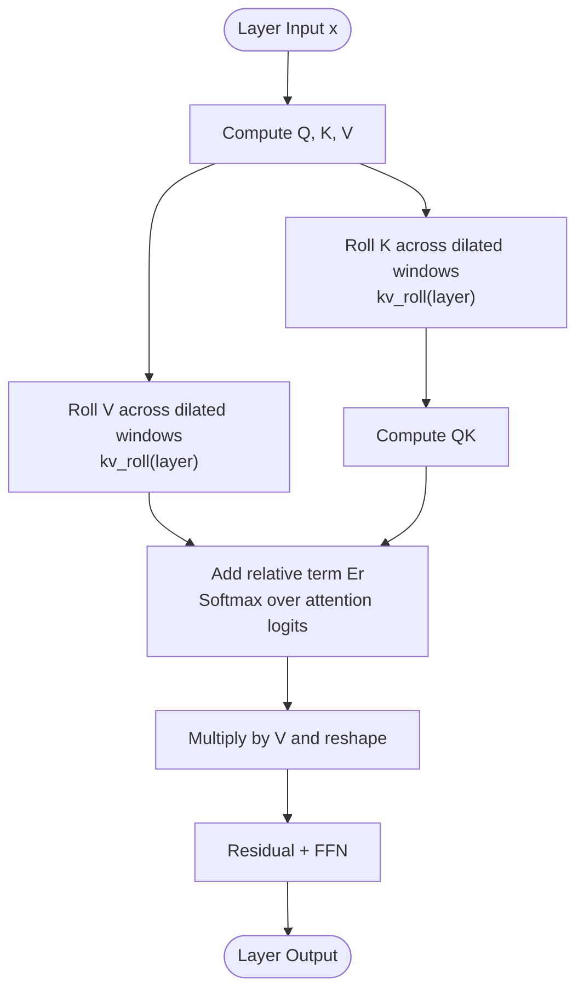
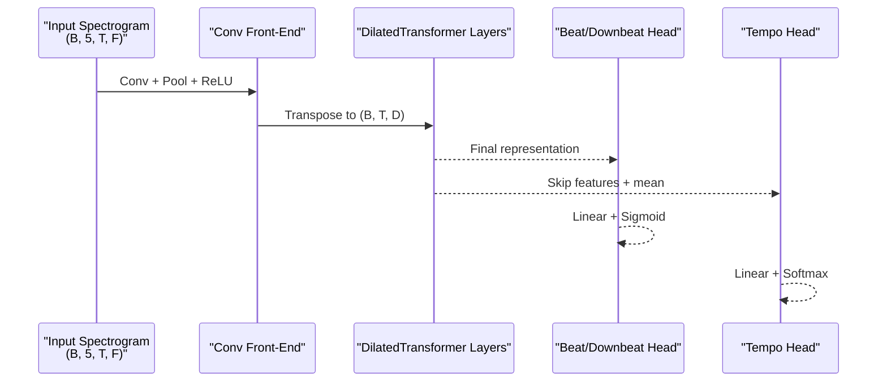
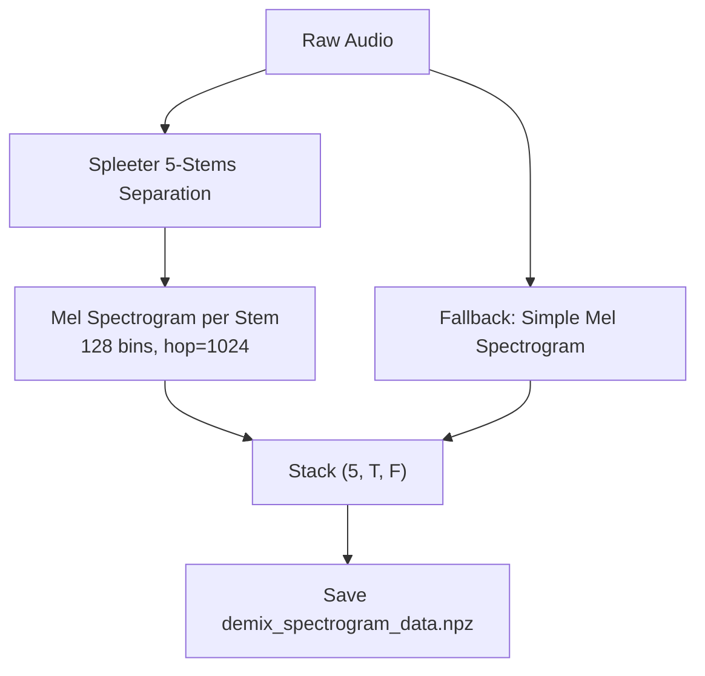
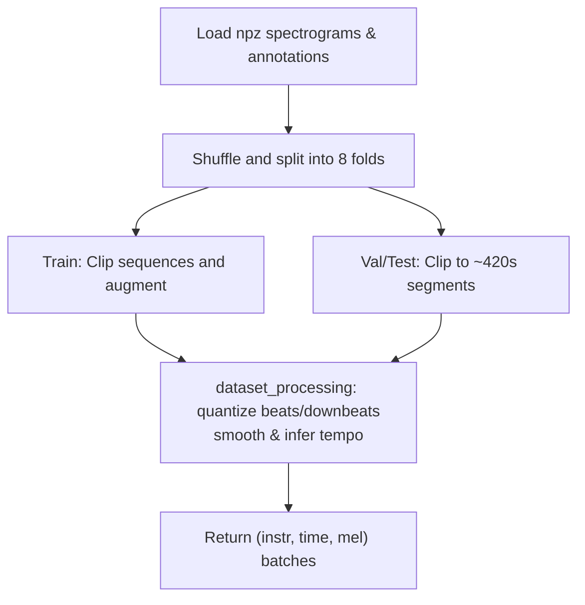
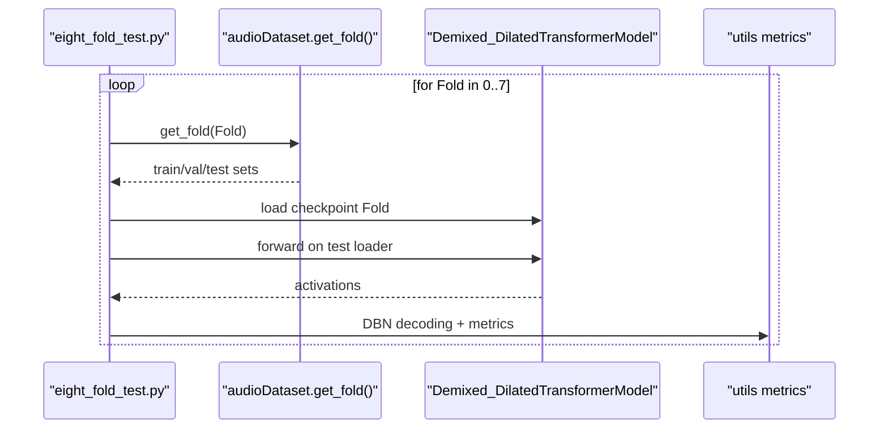
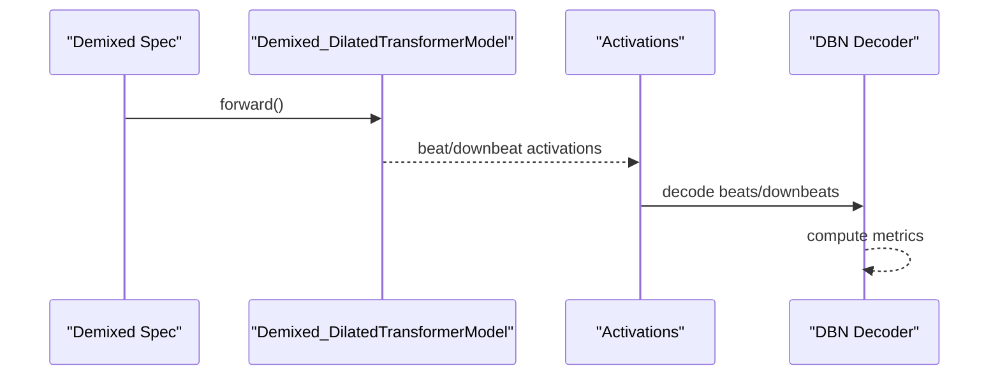
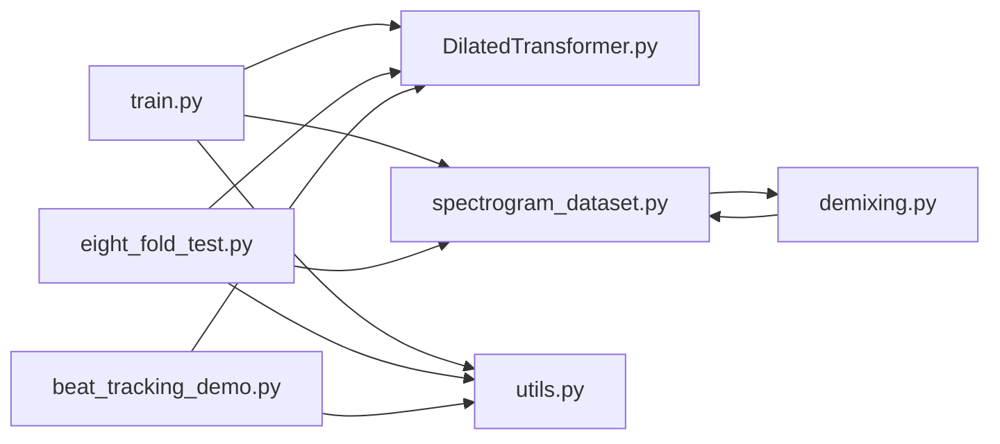

# Beat-Transformer Model

<cite>
**Referenced Files in This Document**
- [README.md](file://python_backend/models/Beat-Transformer/README.md)
- [DilatedTransformer.py](file://python_backend/models/Beat-Transformer/code/DilatedTransformer.py)
- [DilatedTransformerLayer.py](file://python_backend/models/Beat-Transformer/code/DilatedTransformerLayer.py)
- [train.py](file://python_backend/models/Beat-Transformer/code/train.py)
- [spectrogram_dataset.py](file://python_backend/models/Beat-Transformer/code/spectrogram_dataset.py)
- [eight_fold_test.py](file://python_backend/models/Beat-Transformer/code/eight_fold_test.py)
- [utils.py](file://python_backend/models/Beat-Transformer/code/utils.py)
- [demixing.py](file://python_backend/models/Beat-Transformer/preprocessing/demixing.py)
- [demix_spectrogram.py](file://python_backend/models/Beat-Transformer/demix_spectrogram.py)
- [beat_tracking_demo.py](file://python_backend/models/Beat-Transformer/beat_tracking_demo.py)
- [beat_tracking_fix.py](file://python_backend/models/Beat-Transformer/beat_tracking_fix.py)
- [music_transformer.py](file://python_backend/models/Beat-Transformer/code/ablation_models/music_transformer.py)
- [tcn.py](file://python_backend/models/Beat-Transformer/code/ablation_models/tcn.py)
</cite>

## Table of Contents
1. [Introduction](#introduction)
2. [Project Structure](#project-structure)
3. [Core Components](#core-components)
4. [Architecture Overview](#architecture-overview)
5. [Detailed Component Analysis](#detailed-component-analysis)
6. [Dependency Analysis](#dependency-analysis)
7. [Performance Considerations](#performance-considerations)
8. [Troubleshooting Guide](#troubleshooting-guide)
9. [Conclusion](#conclusion)
10. [Appendices](#appendices)

## Introduction
This document describes the Beat-Transformer deep learning model for simultaneous beat and downbeat tracking. It explains the Dilated Self-Attention architecture, model layers configuration, training methodology, spectrogram preprocessing pipeline, data loading mechanisms, audio demixing using Spleeter, checkpoint management, inference pipeline, performance optimization, eight-fold cross-validation training, ablation study implementations, and evaluation metrics. It also covers how the model handles different musical genres and tempos.

## Project Structure
The Beat-Transformer implementation resides under the Beat-Transformer model directory. Key areas:
- Model definition and layers: code/DilatedTransformer.py, code/DilatedTransformerLayer.py
- Training and evaluation: code/train.py, code/eight_fold_test.py, code/utils.py
- Data loading and preprocessing: code/spectrogram_dataset.py
- Audio demixing and spectrogram generation: preprocessing/demixing.py, demix_spectrogram.py
- Inference demos and wrappers: beat_tracking_demo.py, beat_tracking_fix.py
- Ablation studies: code/ablation_models/*.py



**Diagram sources**
- [DilatedTransformer.py:1-168](file://python_backend/models/Beat-Transformer/code/DilatedTransformer.py#L1-L168)
- [DilatedTransformerLayer.py:1-183](file://python_backend/models/Beat-Transformer/code/DilatedTransformerLayer.py#L1-L183)
- [train.py:1-397](file://python_backend/models/Beat-Transformer/code/train.py#L1-L397)
- [eight_fold_test.py:1-403](file://python_backend/models/Beat-Transformer/code/eight_fold_test.py#L1-L403)
- [spectrogram_dataset.py:1-428](file://python_backend/models/Beat-Transformer/code/spectrogram_dataset.py#L1-L428)
- [utils.py:1-302](file://python_backend/models/Beat-Transformer/code/utils.py#L1-L302)
- [demixing.py:1-262](file://python_backend/models/Beat-Transformer/preprocessing/demixing.py#L1-L262)
- [demix_spectrogram.py:1-184](file://python_backend/models/Beat-Transformer/demix_spectrogram.py#L1-L184)
- [beat_tracking_demo.py:1-899](file://python_backend/models/Beat-Transformer/beat_tracking_demo.py#L1-L899)
- [beat_tracking_fix.py:1-124](file://python_backend/models/Beat-Transformer/beat_tracking_fix.py#L1-L124)
- [music_transformer.py:1-145](file://python_backend/models/Beat-Transformer/code/ablation_models/music_transformer.py#L1-L145)
- [tcn.py:1-121](file://python_backend/models/Beat-Transformer/code/ablation_models/tcn.py#L1-L121)

**Section sources**
- [README.md:1-75](file://python_backend/models/Beat-Transformer/README.md#L1-L75)

## Core Components
- DilatedTransformerModel: A convolutional front-end followed by stacked DilatedTransformerLayer blocks and two heads: one for beat/downbeat classification and another for tempo regression.
- DilatedTransformerLayer: Implements dilated self-attention with relative positional embeddings across exponentially expanding receptive fields.
- audioDataset and dataset_processing: Load and preprocess demixed spectrograms, quantize beats/downbeats, infer tempo histograms, and support 8-fold cross-validation splits.
- Training loop: BCE loss for beat/downbeat, BCE loss for tempo, LR scheduling, and evaluation via DBN decoding.
- Inference: Produces activation maps and optional attention accumulation for visualization.

**Section sources**
- [DilatedTransformer.py:7-90](file://python_backend/models/Beat-Transformer/code/DilatedTransformer.py#L7-L90)
- [DilatedTransformerLayer.py:87-166](file://python_backend/models/Beat-Transformer/code/DilatedTransformerLayer.py#L87-L166)
- [spectrogram_dataset.py:17-282](file://python_backend/models/Beat-Transformer/code/spectrogram_dataset.py#L17-L282)
- [train.py:95-141](file://python_backend/models/Beat-Transformer/code/train.py#L95-L141)
- [utils.py:72-131](file://python_backend/models/Beat-Transformer/code/utils.py#L72-L131)

## Architecture Overview
The Beat-Transformer combines CNN feature extraction with dilated self-attention to track beats and downbeats simultaneously. The model takes a 5-channel demixed spectrogram and predicts per-frame probabilities for beats and downbeats, plus a tempo distribution.



**Diagram sources**
- [DilatedTransformer.py:7-90](file://python_backend/models/Beat-Transformer/code/DilatedTransformer.py#L7-L90)
- [DilatedTransformerLayer.py:87-166](file://python_backend/models/Beat-Transformer/code/DilatedTransformerLayer.py#L87-L166)

## Detailed Component Analysis

### Dilated Self-Attention Mechanism
- Relative positional embedding Er controls attention across dilated windows per layer.
- kv_roll expands keys/values across exponentially increasing receptive fields controlled by 2^layer.
- Attention is computed as scaled dot-product plus relative term, followed by softmax and value aggregation.
- During inference, the attention matrices are accumulated to reconstruct full attention maps.



**Diagram sources**
- [DilatedTransformerLayer.py:27-68](file://python_backend/models/Beat-Transformer/code/DilatedTransformerLayer.py#L27-L68)
- [DilatedTransformerLayer.py:72-83](file://python_backend/models/Beat-Transformer/code/DilatedTransformerLayer.py#L72-L83)

**Section sources**
- [DilatedTransformerLayer.py:8-83](file://python_backend/models/Beat-Transformer/code/DilatedTransformerLayer.py#L8-L83)
- [DilatedTransformerLayer.py:118-153](file://python_backend/models/Beat-Transformer/code/DilatedTransformerLayer.py#L118-L153)

### Model Layers Configuration
- Convolutional front-end: 3 conv blocks with max pooling and ReLU to produce a compact representation.
- Stacked DilatedTransformerLayer blocks: 9 layers with mixed attention modes—time-only dilated attention for early layers and interleaved temporal/instrument attention in middle layers.
- Output heads:
  - Beat/downbeat classification head (2 classes).
  - Tempo head (300-bin categorical distribution).



**Diagram sources**
- [DilatedTransformer.py:41-90](file://python_backend/models/Beat-Transformer/code/DilatedTransformer.py#L41-L90)

**Section sources**
- [DilatedTransformer.py:7-40](file://python_backend/models/Beat-Transformer/code/DilatedTransformer.py#L7-L40)

### Training Methodology
- Eight-fold cross-validation: audioDataset folds data across datasets; each fold trains on 7/8 and validates/test on 1/8.
- Losses:
  - Binary cross-entropy for beat/downbeat with masked invalid positions.
  - Categorical cross-entropy for tempo distribution.
- Optimizer and scheduler: RAdam with Lookahead, ReduceLROnPlateau.
- Evaluation: DBN decoding for beat and downbeat; metrics include f-measure, cmlt, amlt.

```mermaid
sequenceDiagram
participant Loader as "DataLoader"
participant Model as "Demixed_DilatedTransformerModel"
participant Opt as "Optimizer"
participant Sch as "Scheduler"
Loader->>Model : Batch (data, beat_gt, downbeat_gt, tempo_gt)
Model->>Model : forward()
Model-->>Opt : loss = BCE + BCE_tempo
Opt->>Opt : backward() and step()
Sch->>Sch : step(val_loss)
```

**Diagram sources**
- [train.py:146-245](file://python_backend/models/Beat-Transformer/code/train.py#L146-L245)
- [train.py:248-359](file://python_backend/models/Beat-Transformer/code/train.py#L248-L359)

**Section sources**
- [train.py:22-64](file://python_backend/models/Beat-Transformer/code/train.py#L22-L64)
- [train.py:129-141](file://python_backend/models/Beat-Transformer/code/train.py#L129-L141)
- [utils.py:72-131](file://python_backend/models/Beat-Transformer/code/utils.py#L72-L131)

### Spectrogram Preprocessing Pipeline
- Demixing: Uses Spleeter 5-stems separation; optionally falls back to simple Mel spectrogram.
- Mel filterbank: 128 mel bins, hop length matching model fps (44100/1024).
- Data preparation: Aggregates multiple datasets, saves compressed npz files for spectrograms and annotations.



**Diagram sources**
- [demixing.py:17-58](file://python_backend/models/Beat-Transformer/preprocessing/demixing.py#L17-L58)
- [demixing.py:60-133](file://python_backend/models/Beat-Transformer/preprocessing/demixing.py#L60-L133)
- [demix_spectrogram.py:30-136](file://python_backend/models/Beat-Transformer/demix_spectrogram.py#L30-L136)

**Section sources**
- [demixing.py:17-133](file://python_backend/models/Beat-Transformer/preprocessing/demixing.py#L17-L133)
- [demix_spectrogram.py:30-177](file://python_backend/models/Beat-Transformer/demix_spectrogram.py#L30-L177)

### Data Loading Mechanisms
- audioDataset loads preprocessed spectrograms and annotations, splits into folds, and supports train/validation/test splits.
- dataset_processing quantizes events to model fps, applies smoothing, infers tempo histograms, and clips sequences to fixed lengths.



**Diagram sources**
- [spectrogram_dataset.py:287-397](file://python_backend/models/Beat-Transformer/code/spectrogram_dataset.py#L287-L397)
- [spectrogram_dataset.py:54-212](file://python_backend/models/Beat-Transformer/code/spectrogram_dataset.py#L54-L212)

**Section sources**
- [spectrogram_dataset.py:17-282](file://python_backend/models/Beat-Transformer/code/spectrogram_dataset.py#L17-L282)

### Eight-Fold Cross-Validation and Testing
- eight_fold_test.py runs inference across all 8 folds, aggregates activations, decodes with DBN, and computes metrics per dataset.



**Diagram sources**
- [eight_fold_test.py:68-118](file://python_backend/models/Beat-Transformer/code/eight_fold_test.py#L68-L118)
- [eight_fold_test.py:120-191](file://python_backend/models/Beat-Transformer/code/eight_fold_test.py#L120-L191)

**Section sources**
- [eight_fold_test.py:17-48](file://python_backend/models/Beat-Transformer/code/eight_fold_test.py#L17-L48)
- [eight_fold_test.py:52-118](file://python_backend/models/Beat-Transformer/code/eight_fold_test.py#L52-L118)

### Ablation Study Implementations
- music_transformer.py: Standard transformer encoder with relative positional embeddings and dilation-aware masking.
- tcn.py: Temporal convolution network with dilated convolutions for comparison.
These modules demonstrate alternatives to the dilated self-attention architecture.

**Section sources**
- [music_transformer.py:11-129](file://python_backend/models/Beat-Transformer/code/ablation_models/music_transformer.py#L11-L129)
- [tcn.py:27-84](file://python_backend/models/Beat-Transformer/code/ablation_models/tcn.py#L27-L84)

### Evaluation Metrics
- Beat/Downbeat decoding via DBN with configurable thresholds and tempo priors.
- Metrics include f-measure, cmlt, amlt averaged across songs.

**Section sources**
- [utils.py:72-131](file://python_backend/models/Beat-Transformer/code/utils.py#L72-L131)
- [eight_fold_test.py:120-191](file://python_backend/models/Beat-Transformer/code/eight_fold_test.py#L120-L191)

### Inference Pipeline and Attention Visualization
- beat_tracking_demo.py runs the model on demixed spectrograms, supports chunked inference for long audio, and decodes beats/downbeats with DBN.
- Optional attention accumulation during inference enables visualization of effective receptive fields.



**Diagram sources**
- [beat_tracking_demo.py:122-560](file://python_backend/models/Beat-Transformer/beat_tracking_demo.py#L122-L560)
- [DilatedTransformer.py:92-146](file://python_backend/models/Beat-Transformer/code/DilatedTransformer.py#L92-L146)

**Section sources**
- [beat_tracking_demo.py:122-560](file://python_backend/models/Beat-Transformer/beat_tracking_demo.py#L122-L560)
- [DilatedTransformer.py:92-146](file://python_backend/models/Beat-Transformer/code/DilatedTransformer.py#L92-L146)

## Dependency Analysis
- Internal dependencies:
  - train.py depends on DilatedTransformer, spectrogram_dataset, utils.
  - eight_fold_test.py depends on DilatedTransformer, spectrogram_dataset, utils.
  - beat_tracking_demo.py depends on DilatedTransformer and utils.
  - preprocessing/demixing.py depends on spleeter and librosa.
- External libraries: torch, librosa, madmom, spleeter, numpy, scipy.



**Diagram sources**
- [train.py:13-16](file://python_backend/models/Beat-Transformer/code/train.py#L13-L16)
- [eight_fold_test.py:8-9](file://python_backend/models/Beat-Transformer/code/eight_fold_test.py#L8-L9)
- [beat_tracking_demo.py:41-42](file://python_backend/models/Beat-Transformer/beat_tracking_demo.py#L41-L42)
- [demixing.py:1-15](file://python_backend/models/Beat-Transformer/preprocessing/demixing.py#L1-L15)

**Section sources**
- [train.py:1-20](file://python_backend/models/Beat-Transformer/code/train.py#L1-L20)
- [eight_fold_test.py:1-15](file://python_backend/models/Beat-Transformer/code/eight_fold_test.py#L1-L15)
- [beat_tracking_demo.py:1-52](file://python_backend/models/Beat-Transformer/beat_tracking_demo.py#L1-L52)

## Performance Considerations
- Model limitations: The model’s effective receptive field grows with layers and attention length; very long audio requires chunking with overlap blending.
- Padding strategy: Adds context frames at the beginning to enable accurate early predictions.
- Batch size and device: Single-batch training/evaluation to reduce memory pressure; GPU recommended for inference.
- Data augmentation: Random mixing of stems during training to improve generalization.
- Gradient clipping and LR scheduling: Reduce divergence and stabilize convergence.

[No sources needed since this section provides general guidance]

## Troubleshooting Guide
- Spleeter not available: demix_spectrogram.py falls back to simple Mel spectrogram generation.
- Long audio handling: beat_tracking_demo.py processes audio in overlapping chunks and blends outputs.
- Missing DBN detections: beat_tracking_demo.py includes librosa fallbacks and conservative defaults.
- CUDA issues: beat_tracking_demo.py automatically falls back to CPU if CUDA is unavailable.

**Section sources**
- [demix_spectrogram.py:10-53](file://python_backend/models/Beat-Transformer/demix_spectrogram.py#L10-L53)
- [beat_tracking_demo.py:141-148](file://python_backend/models/Beat-Transformer/beat_tracking_demo.py#L141-L148)
- [beat_tracking_demo.py:420-560](file://python_backend/models/Beat-Transformer/beat_tracking_demo.py#L420-L560)

## Conclusion
The Beat-Transformer leverages dilated self-attention to jointly model beats and downbeats with strong generalization across genres and tempos. Its training methodology integrates robust data preprocessing, cross-validation, and DBN decoding for evaluation. The provided preprocessing, training, and inference utilities enable reproducible experiments and practical deployment.

[No sources needed since this section summarizes without analyzing specific files]

## Appendices

### Model Checkpoint Management
- Training saves checkpoints per epoch with optimizer and scheduler states.
- eight_fold_test.py loads fold-specific checkpoints and evaluates on test sets.

**Section sources**
- [train.py:379-383](file://python_backend/models/Beat-Transformer/code/train.py#L379-L383)
- [eight_fold_test.py:39-48](file://python_backend/models/Beat-Transformer/code/eight_fold_test.py#L39-L48)

### Handling Different Genres and Tempos
- Datasets: Ballroom, Carnatic, GTZAN, Hainsworth, SMC, Harmonix.
- Tempo inference: Histogram-based tempo estimation from beat intervals with smoothing and interpolation.
- Evaluation: Metrics computed per dataset and aggregated.

**Section sources**
- [README.md:49-66](file://python_backend/models/Beat-Transformer/README.md#L49-L66)
- [spectrogram_dataset.py:213-238](file://python_backend/models/Beat-Transformer/code/spectrogram_dataset.py#L213-L238)
- [eight_fold_test.py:120-191](file://python_backend/models/Beat-Transformer/code/eight_fold_test.py#L120-L191)