# Chord-CNN-LSTM Model

<cite>
**Referenced Files in This Document**
- [README.MD](file://python_backend/models/Chord-CNN-LSTM/README.MD)
- [settings.py](file://python_backend/models/Chord-CNN-LSTM/settings.py)
- [chord_recognition.py](file://python_backend/models/Chord-CNN-LSTM/chord_recognition.py)
- [chordnet_ismir_naive.py](file://python_backend/models/Chord-CNN-LSTM/chordnet_ismir_naive.py)
- [complex_chord.py](file://python_backend/models/Chord-CNN-LSTM/complex_chord.py)
- [cqt.py](file://python_backend/models/Chord-CNN-LSTM/extractors/cqt.py)
- [complex_chord_preprocess.py](file://python_backend/models/Chord-CNN-LSTM/extractors/complex_chord_preprocess.py)
- [xhmm_ismir.py](file://python_backend/models/Chord-CNN-LSTM/extractors/xhmm_ismir.py)
- [datasets.py](file://python_backend/models/Chord-CNN-LSTM/datasets.py)
- [storage_creation.py](file://python_backend/models/Chord-CNN-LSTM/storage_creation.py)
- [train_eval_test_split.py](file://python_backend/models/Chord-CNN-LSTM/train_eval_test_split.py)
</cite>

## Table of Contents
1. [Introduction](#introduction)
2. [Project Structure](#project-structure)
3. [Core Components](#core-components)
4. [Architecture Overview](#architecture-overview)
5. [Detailed Component Analysis](#detailed-component-analysis)
6. [Dependency Analysis](#dependency-analysis)
7. [Performance Considerations](#performance-considerations)
8. [Troubleshooting Guide](#troubleshooting-guide)
9. [Conclusion](#conclusion)
10. [Appendices](#appendices)

## Introduction
This document describes the Chord-CNN-LSTM neural network architecture designed for large-vocabulary chord recognition. The model combines a CNN-based spectrogram feature extractor with LSTM layers to predict chord structures across time, followed by a structured HMM decoder to produce temporally coherent chord labels. It supports multiple datasets (Ballroom, GTZAN, SMC, Hainsworth) and handles various chord types, inversions, and extended chords through a hierarchical decomposition into triads, bass, seventh, ninth, eleventh, and thirteenth components.

## Project Structure
The Chord-CNN-LSTM module resides under python_backend/models/Chord-CNN-LSTM and includes:
- Model definition and training/inference logic
- Feature extraction (CQT spectrograms)
- Data preparation and multi-dataset support
- HMM-based decoding for temporal coherence
- Storage creation for framed datasets

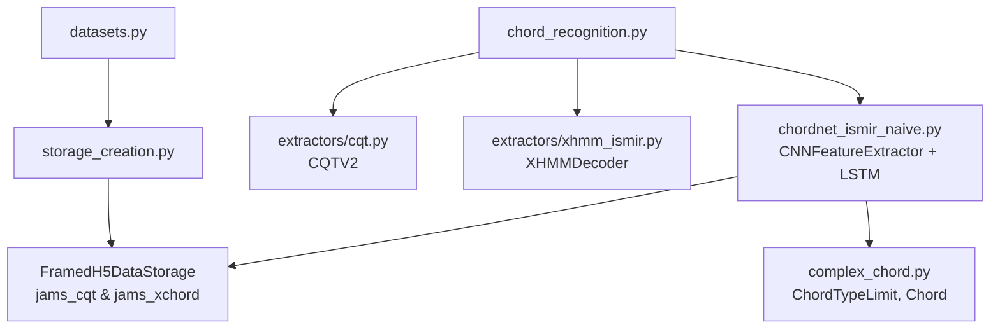

**Diagram sources**
- [chord_recognition.py:1-206](file://python_backend/models/Chord-CNN-LSTM/chord_recognition.py#L1-L206)
- [chordnet_ismir_naive.py:1-317](file://python_backend/models/Chord-CNN-LSTM/chordnet_ismir_naive.py#L1-L317)
- [cqt.py:1-70](file://python_backend/models/Chord-CNN-LSTM/extractors/cqt.py#L1-L70)
- [xhmm_ismir.py:1-456](file://python_backend/models/Chord-CNN-LSTM/extractors/xhmm_ismir.py#L1-L456)
- [datasets.py:1-267](file://python_backend/models/Chord-CNN-LSTM/datasets.py#L1-L267)
- [storage_creation.py:1-26](file://python_backend/models/Chord-CNN-LSTM/storage_creation.py#L1-L26)

**Section sources**
- [README.MD:1-64](file://python_backend/models/Chord-CNN-LSTM/README.MD#L1-L64)
- [settings.py:1-18](file://python_backend/models/Chord-CNN-LSTM/settings.py#L1-L18)

## Core Components
- Hybrid CNN-LSTM model: A CNN extracts spectrogram features, then two bi-directional LSTM layers process temporal context, producing per-frame predictions for chord components.
- Hierarchical chord representation: Triad type, bass note, seventh, ninth, eleventh, and thirteenth decorations are modeled as separate classifiers.
- HMM decoder: Post-processes model probabilities using transition penalties aligned to beat/downbeat boundaries to yield temporally coherent labels.
- Multi-dataset training: Ballroom, GTZAN, SMC, and Hainsworth datasets are integrated via unified data loaders and storages.

**Section sources**
- [chordnet_ismir_naive.py:68-195](file://python_backend/models/Chord-CNN-LSTM/chordnet_ismir_naive.py#L68-L195)
- [complex_chord.py:195-305](file://python_backend/models/Chord-CNN-LSTM/complex_chord.py#L195-L305)
- [xhmm_ismir.py:9-456](file://python_backend/models/Chord-CNN-LSTM/extractors/xhmm_ismir.py#L9-L456)
- [datasets.py:25-146](file://python_backend/models/Chord-CNN-LSTM/datasets.py#L25-L146)

## Architecture Overview
The end-to-end pipeline:
1. Audio input is loaded and resampled to a fixed sampling rate.
2. Constant-Q transform (CQT) features are extracted at a hop length suitable for temporal modeling.
3. The CNN encodes spectral frames into a latent representation.
4. LSTM layers capture temporal dependencies across frames.
5. Separate softmax heads predict triad types, bass, and decorations (7, 9, 11, 13).
6. An HMM decoder aggregates frame-level posteriors into a temporally coherent sequence, using beat-aligned transitions.

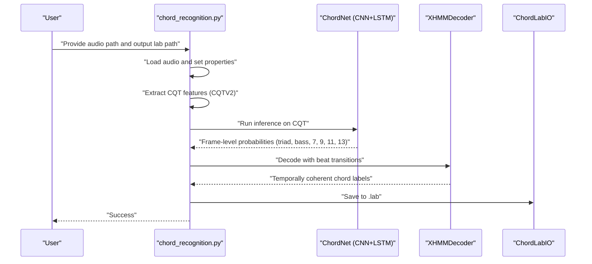

**Diagram sources**
- [chord_recognition.py:24-187](file://python_backend/models/Chord-CNN-LSTM/chord_recognition.py#L24-L187)
- [chordnet_ismir_naive.py:185-194](file://python_backend/models/Chord-CNN-LSTM/chordnet_ismir_naive.py#L185-L194)
- [xhmm_ismir.py:207-285](file://python_backend/models/Chord-CNN-LSTM/extractors/xhmm_ismir.py#L207-L285)

## Detailed Component Analysis

### CNN Feature Extractor
The CNN block transforms a 2-D spectrogram into a compact temporal latent representation. It applies stacked convolutional blocks with instance normalization and max pooling, followed by a final linear projection to the LSTM input dimension.

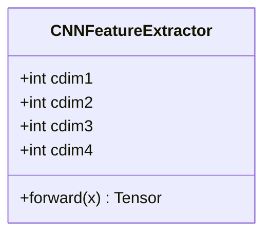

**Diagram sources**
- [chordnet_ismir_naive.py:68-126](file://python_backend/models/Chord-CNN-LSTM/chordnet_ismir_naive.py#L68-L126)

**Section sources**
- [chordnet_ismir_naive.py:68-126](file://python_backend/models/Chord-CNN-LSTM/chordnet_ismir_naive.py#L68-L126)

### LSTM Temporal Modeling
The model employs a bi-directional LSTM to model long-range temporal dependencies. Outputs are reshaped and split into per-component classifiers for triad, bass, and decorations.

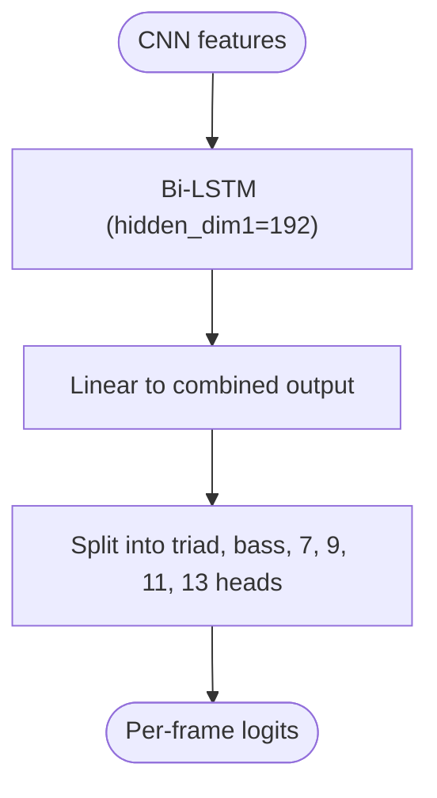

**Diagram sources**
- [chordnet_ismir_naive.py:127-179](file://python_backend/models/Chord-CNN-LSTM/chordnet_ismir_naive.py#L127-L179)

**Section sources**
- [chordnet_ismir_naive.py:127-179](file://python_backend/models/Chord-CNN-LSTM/chordnet_ismir_naive.py#L127-L179)

### Hierarchical Chord Representation
Extended chords are represented as a tuple of six components: triad type, bass, seventh, ninth, eleventh, thirteenth. A chord limit defines maximum decorations and output sizes.

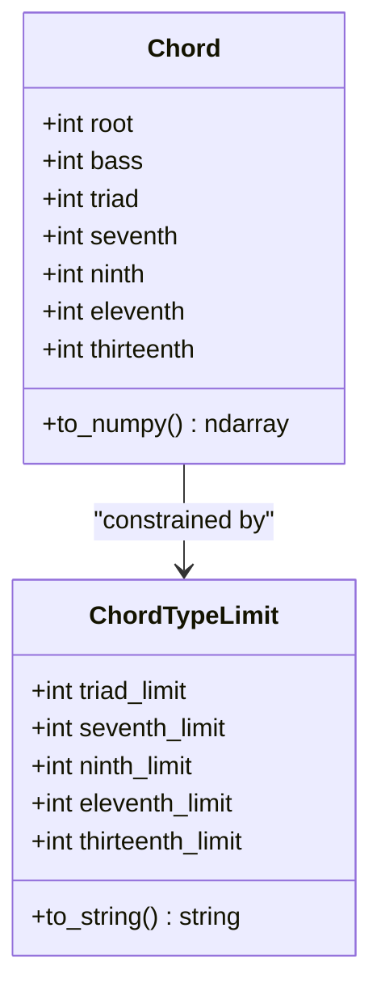

**Diagram sources**
- [complex_chord.py:195-246](file://python_backend/models/Chord-CNN-LSTM/complex_chord.py#L195-L246)

**Section sources**
- [complex_chord.py:195-305](file://python_backend/models/Chord-CNN-LSTM/complex_chord.py#L195-L305)

### HMM Decoder for Temporal Coherence
The HMM integrates frame-level posteriors with transition penalties aligned to beats and downbeats. It supports triad-only decoding, layered decoding (triad then decorations), and configurable use of bass and extended decorations.

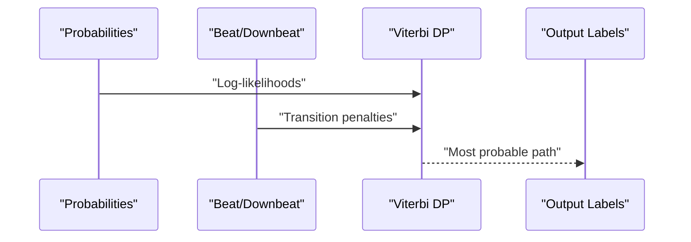

**Diagram sources**
- [xhmm_ismir.py:207-285](file://python_backend/models/Chord-CNN-LSTM/extractors/xhmm_ismir.py#L207-L285)

**Section sources**
- [xhmm_ismir.py:9-456](file://python_backend/models/Chord-CNN-LSTM/extractors/xhmm_ismir.py#L9-L456)

### Spectrogram Generation and Preprocessing
CQT features are generated using librosa with a hop length optimized for temporal modeling. The feature extractor class ensures consistent dimensions and dtype.

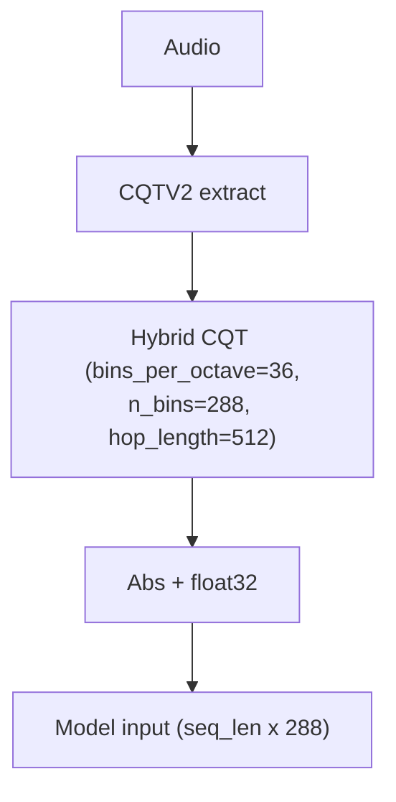

**Diagram sources**
- [cqt.py:44-61](file://python_backend/models/Chord-CNN-LSTM/extractors/cqt.py#L44-L61)

**Section sources**
- [cqt.py:1-70](file://python_backend/models/Chord-CNN-LSTM/extractors/cqt.py#L1-L70)

### Data Preparation and Multi-Dataset Integration
Datasets are constructed from multiple sources (Ballroom, GTZAN, SMC, Hainsworth) and unified into framed storages for efficient training. Storage creation caches CQT and complex chord targets.

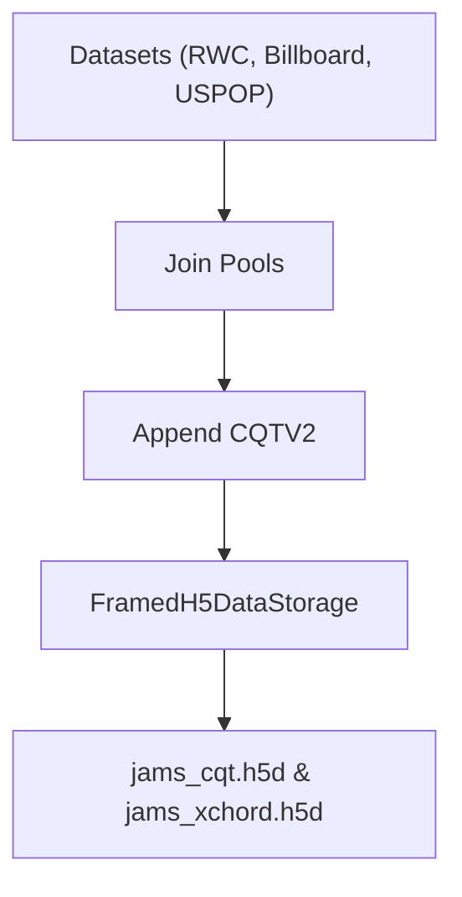

**Diagram sources**
- [datasets.py:42-146](file://python_backend/models/Chord-CNN-LSTM/datasets.py#L42-L146)
- [storage_creation.py:11-23](file://python_backend/models/Chord-CNN-LSTM/storage_creation.py#L11-L23)

**Section sources**
- [datasets.py:1-267](file://python_backend/models/Chord-CNN-LSTM/datasets.py#L1-L267)
- [storage_creation.py:1-26](file://python_backend/models/Chord-CNN-LSTM/storage_creation.py#L1-L26)

### Chord Name Normalization and Complex Chord Processing
Chord names are normalized and parsed into a canonical form supporting inversions and extended chords. The processor converts labeled segments into a structured six-tuple representation.

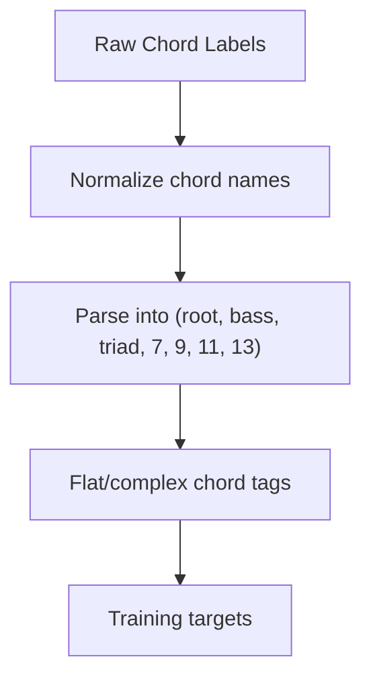

**Diagram sources**
- [complex_chord_preprocess.py:9-74](file://python_backend/models/Chord-CNN-LSTM/extractors/complex_chord_preprocess.py#L9-L74)
- [complex_chord.py:215-246](file://python_backend/models/Chord-CNN-LSTM/complex_chord.py#L215-L246)

**Section sources**
- [complex_chord_preprocess.py:1-74](file://python_backend/models/Chord-CNN-LSTM/extractors/complex_chord_preprocess.py#L1-L74)
- [complex_chord.py:1-319](file://python_backend/models/Chord-CNN-LSTM/complex_chord.py#L1-L319)

### Training Procedures and Evaluation
Training uses framed data providers with pitch-shifting augmentation and a reweighted loss tailored to chord sub-components. Cross-validation splits are prepared for robust evaluation.

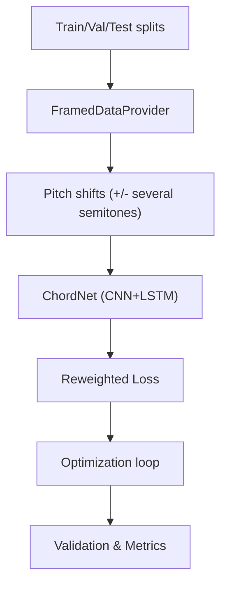

**Diagram sources**
- [chordnet_ismir_naive.py:28-66](file://python_backend/models/Chord-CNN-LSTM/chordnet_ismir_naive.py#L28-L66)
- [train_eval_test_split.py:1-44](file://python_backend/models/Chord-CNN-LSTM/train_eval_test_split.py#L1-L44)

**Section sources**
- [chordnet_ismir_naive.py:272-317](file://python_backend/models/Chord-CNN-LSTM/chordnet_ismir_naive.py#L272-L317)
- [train_eval_test_split.py:1-44](file://python_backend/models/Chord-CNN-LSTM/train_eval_test_split.py#L1-L44)

## Dependency Analysis
The model’s primary dependencies include:
- PyTorch for neural network components
- librosa for CQT feature extraction
- Internal MIR framework for data pools, storages, and extractors
- NumPy for numerical operations

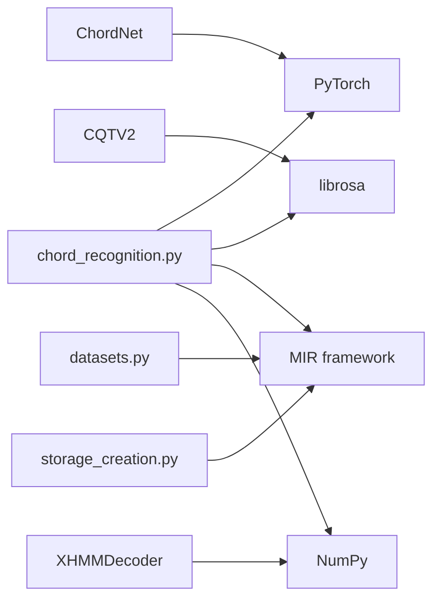

**Diagram sources**
- [chord_recognition.py:1-12](file://python_backend/models/Chord-CNN-LSTM/chord_recognition.py#L1-L12)
- [chordnet_ismir_naive.py:1-11](file://python_backend/models/Chord-CNN-LSTM/chordnet_ismir_naive.py#L1-L11)
- [cqt.py:1-5](file://python_backend/models/Chord-CNN-LSTM/extractors/cqt.py#L1-L5)
- [datasets.py:1-16](file://python_backend/models/Chord-CNN-LSTM/datasets.py#L1-L16)
- [storage_creation.py:1-10](file://python_backend/models/Chord-CNN-LSTM/storage_creation.py#L1-L10)

**Section sources**
- [chord_recognition.py:1-12](file://python_backend/models/Chord-CNN-LSTM/chord_recognition.py#L1-L12)
- [chordnet_ismir_naive.py:1-11](file://python_backend/models/Chord-CNN-LSTM/chordnet_ismir_naive.py#L1-L11)
- [cqt.py:1-5](file://python_backend/models/Chord-CNN-LSTM/extractors/cqt.py#L1-L5)
- [datasets.py:1-16](file://python_backend/models/Chord-CNN-LSTM/datasets.py#L1-L16)
- [storage_creation.py:1-10](file://python_backend/models/Chord-CNN-LSTM/storage_creation.py#L1-L10)

## Performance Considerations
- Hop length and CQT binning balance frequency resolution and temporal granularity.
- Bi-LSTM with instance normalization improves stability and generalization.
- Reweighted loss mitigates class imbalance across chord sub-components.
- Framed H5 storage accelerates training throughput by caching spectrograms and targets.
- Averaging predictions across multiple trained models can improve robustness.

[No sources needed since this section provides general guidance]

## Troubleshooting Guide
Common issues and remedies:
- All-N detection: If the decoder produces only “N” chords, inspect CQT extraction, model checkpoints, and HMM parameters.
- Torch indexing errors: Ensure tensor indexing compatibility and add explicit bool casting where needed.
- Dataset path misconfiguration: Verify dataset paths and file lists in settings and dataset builders.
- Memory/CPU bottlenecks: Use framed H5 storage and reduce batch sizes; leverage GPU acceleration where available.

**Section sources**
- [chord_recognition.py:166-187](file://python_backend/models/Chord-CNN-LSTM/chord_recognition.py#L166-L187)
- [README.MD:56-58](file://python_backend/models/Chord-CNN-LSTM/README.MD#L56-L58)
- [settings.py:1-18](file://python_backend/models/Chord-CNN-LSTM/settings.py#L1-L18)

## Conclusion
The Chord-CNN-LSTM model provides a robust, hierarchical approach to large-vocabulary chord transcription. Its CNN-LSTM backbone captures spectral and temporal regularities, while the HMM enforces temporal coherence guided by beat structure. Multi-dataset training and comprehensive chord representation enable accurate recognition of triads, inversions, and extended chords across diverse musical contexts.

[No sources needed since this section summarizes without analyzing specific files]

## Appendices

### API and CLI Usage
- Recognize chords from audio and write labeled output using the provided script interface.

**Section sources**
- [README.MD:14-34](file://python_backend/models/Chord-CNN-LSTM/README.MD#L14-L34)
- [chord_recognition.py:192-206](file://python_backend/models/Chord-CNN-LSTM/chord_recognition.py#L192-L206)

### Settings and Paths
- Configure dataset paths and defaults for sampling rate, hop length, and chord dictionaries.

**Section sources**
- [settings.py:1-18](file://python_backend/models/Chord-CNN-LSTM/settings.py#L1-L18)