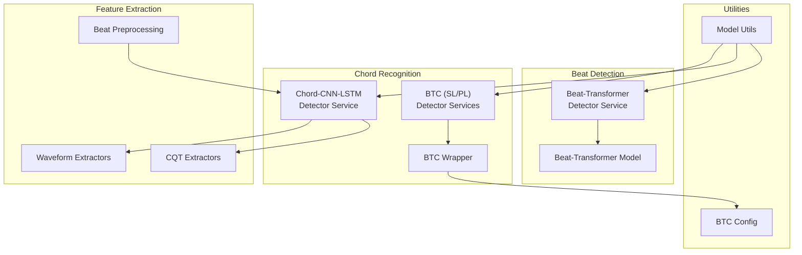
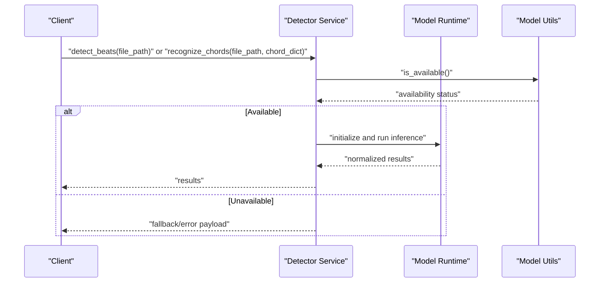
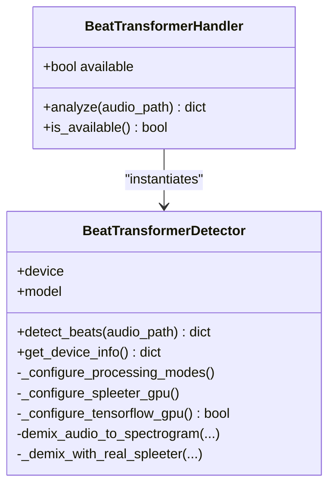
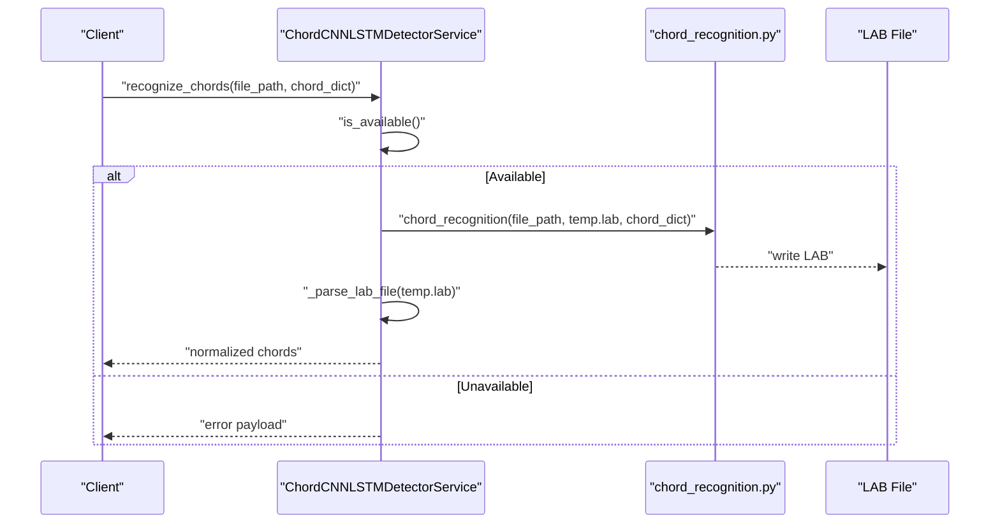
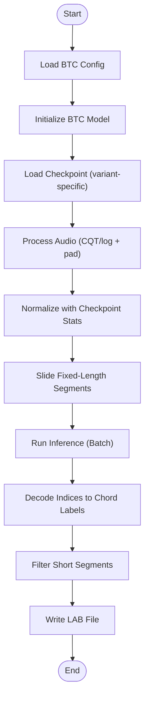
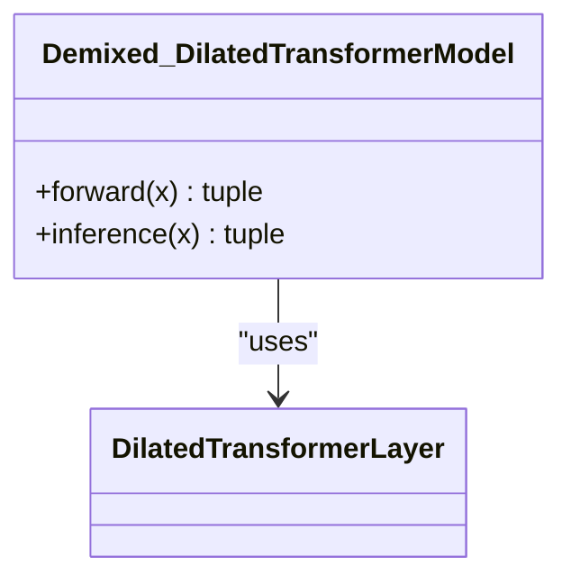
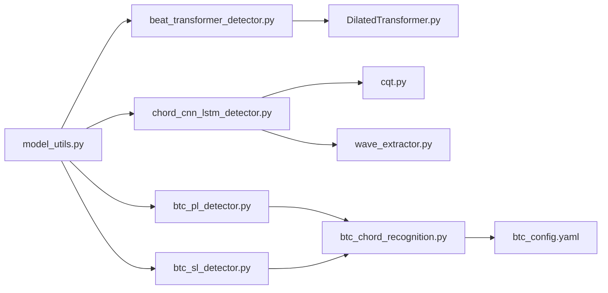

# Machine Learning Integration

<cite>
**Referenced Files in This Document**
- [beat_transformer.py](file://python_backend/models/beat_transformer.py)
- [beat_transformer_detector.py](file://python_backend/services/detectors/beat_transformer_detector.py)
- [chord_cnn_lstm_detector.py](file://python_backend/services/detectors/chord_cnn_lstm_detector.py)
- [btc_pl_detector.py](file://python_backend/services/detectors/btc_pl_detector.py)
- [btc_sl_detector.py](file://python_backend/services/detectors/btc_sl_detector.py)
- [model_utils.py](file://python_backend/utils/model_utils.py)
- [btc_config.yaml](file://python_backend/config/btc_config.yaml)
- [btc_chord_recognition.py](file://python_backend/models/ChordMini/btc_chord_recognition.py)
- [DilatedTransformer.py](file://python_backend/models/Beat-Transformer/code/DilatedTransformer.py)
- [chord_recognition.py](file://python_backend/models/Chord-CNN-LSTM/chord_recognition.py)
- [cqt.py](file://python_backend/models/Chord-CNN-LSTM/extractors/cqt.py)
- [wave_extractor.py](file://python_backend/models/Chord-CNN-LSTM/extractors/wave_extractor.py)
- [beat_preprocess.py](file://python_backend/models/Chord-CNN-LSTM/extractors/beat_preprocess.py)
</cite>

## Table of Contents
1. [Introduction](#introduction)
2. [Project Structure](#project-structure)
3. [Core Components](#core-components)
4. [Architecture Overview](#architecture-overview)
5. [Detailed Component Analysis](#detailed-component-analysis)
6. [Dependency Analysis](#dependency-analysis)
7. [Performance Considerations](#performance-considerations)
8. [Troubleshooting Guide](#troubleshooting-guide)
9. [Conclusion](#conclusion)

## Introduction
This document describes the machine learning model integration architecture for beat and chord detection. It covers model loading and initialization patterns, inference pipeline organization, performance optimization strategies, and the model availability checking system. It explains the Beat-Transformer deep learning model, the Chord-CNN-LSTM neural network, and the BTC (Beat-Transformer-Chord) model variants. It also documents feature extraction processes, audio preprocessing steps, post-processing transformations, model versioning and update mechanisms, and selection criteria for detection algorithms based on performance and resource requirements.

## Project Structure
The ML integration spans three primary areas:
- Beat-Transformer: a deep learning model for beat/downbeat detection with a dedicated detector service and runtime environment controls.
- Chord-CNN-LSTM: a CNN-LSTM model ensemble with HMM decoding for chord recognition, integrated via a detector service.
- BTC (Beat-Transformer-Chord): Transformer-based chord recognition with two variants (SL and PL), integrated via unified wrappers and detector services.

**Diagram sources**
- [beat_transformer_detector.py:15-163](file://python_backend/services/detectors/beat_transformer_detector.py#L15-L163)
- [beat_transformer.py:259-581](file://python_backend/models/beat_transformer.py#L259-L581)
- [chord_cnn_lstm_detector.py:17-249](file://python_backend/services/detectors/chord_cnn_lstm_detector.py#L17-L249)
- [btc_pl_detector.py:17-246](file://python_backend/services/detectors/btc_pl_detector.py#L17-L246)
- [btc_sl_detector.py:17-246](file://python_backend/services/detectors/btc_sl_detector.py#L17-L246)
- [btc_chord_recognition.py:166-357](file://python_backend/models/ChordMini/btc_chord_recognition.py#L166-L357)
- [model_utils.py:28-139](file://python_backend/utils/model_utils.py#L28-L139)
- [btc_config.yaml:1-61](file://python_backend/config/btc_config.yaml#L1-L61)
- [cqt.py:1-70](file://python_backend/models/Chord-CNN-LSTM/extractors/cqt.py#L1-L70)
- [wave_extractor.py:1-34](file://python_backend/models/Chord-CNN-LSTM/extractors/wave_extractor.py#L1-L34)
- [beat_preprocess.py:1-329](file://python_backend/models/Chord-CNN-LSTM/extractors/beat_preprocess.py#L1-L329)

**Section sources**
- [beat_transformer.py:121-257](file://python_backend/models/beat_transformer.py#L121-L257)
- [beat_transformer_detector.py:15-163](file://python_backend/services/detectors/beat_transformer_detector.py#L15-L163)
- [chord_cnn_lstm_detector.py:17-249](file://python_backend/services/detectors/chord_cnn_lstm_detector.py#L17-L249)
- [btc_pl_detector.py:17-246](file://python_backend/services/detectors/btc_pl_detector.py#L17-L246)
- [btc_sl_detector.py:17-246](file://python_backend/services/detectors/btc_sl_detector.py#L17-L246)
- [model_utils.py:28-139](file://python_backend/utils/model_utils.py#L28-L139)
- [btc_config.yaml:1-61](file://python_backend/config/btc_config.yaml#L1-L61)
- [btc_chord_recognition.py:166-357](file://python_backend/models/ChordMini/btc_chord_recognition.py#L166-L357)
- [DilatedTransformer.py:7-90](file://python_backend/models/Beat-Transformer/code/DilatedTransformer.py#L7-L90)
- [chord_recognition.py:24-187](file://python_backend/models/Chord-CNN-LSTM/chord_recognition.py#L24-L187)
- [cqt.py:1-70](file://python_backend/models/Chord-CNN-LSTM/extractors/cqt.py#L1-L70)
- [wave_extractor.py:1-34](file://python_backend/models/Chord-CNN-LSTM/extractors/wave_extractor.py#L1-L34)
- [beat_preprocess.py:1-329](file://python_backend/models/Chord-CNN-LSTM/extractors/beat_preprocess.py#L1-L329)

## Core Components
- Beat-Transformer Detector Service: Provides a normalized interface for beat/downbeat detection with availability checks and device configuration.
- Chord-CNN-LSTM Detector Service: Orchestrates multi-model inference with HMM decoding and produces LAB-formatted chord sequences.
- BTC Detector Services (SL/PL): Unified services for Transformer-based chord recognition with variant-specific model loading and standardized output.
- Feature Extractors: CQT and waveform-aligned extractors for Chord-CNN-LSTM; CQT/log-magnitude and padding for BTC.
- Model Utilities: Availability checks for Spleeter, Beat-Transformer, Chord-CNN-LSTM, BTC, PyTorch, and TensorFlow; environment diagnostics.
- BTC Configuration: YAML configuration defining audio features, model hyperparameters, and checkpoint paths.

**Section sources**
- [beat_transformer_detector.py:15-163](file://python_backend/services/detectors/beat_transformer_detector.py#L15-L163)
- [chord_cnn_lstm_detector.py:17-249](file://python_backend/services/detectors/chord_cnn_lstm_detector.py#L17-L249)
- [btc_pl_detector.py:17-246](file://python_backend/services/detectors/btc_pl_detector.py#L17-L246)
- [btc_sl_detector.py:17-246](file://python_backend/services/detectors/btc_sl_detector.py#L17-L246)
- [model_utils.py:28-139](file://python_backend/utils/model_utils.py#L28-L139)
- [btc_config.yaml:1-61](file://python_backend/config/btc_config.yaml#L1-L61)

## Architecture Overview
The system integrates multiple detection algorithms behind unified detector services. Each service exposes a common interface for availability checks and inference, returning normalized results. Feature extraction is tailored per model family, and environment-aware device selection ensures optimal performance across platforms.

**Diagram sources**
- [beat_transformer_detector.py:73-147](file://python_backend/services/detectors/beat_transformer_detector.py#L73-L147)
- [chord_cnn_lstm_detector.py:78-182](file://python_backend/services/detectors/chord_cnn_lstm_detector.py#L78-L182)
- [btc_pl_detector.py:87-160](file://python_backend/services/detectors/btc_pl_detector.py#L87-L160)
- [btc_sl_detector.py:87-160](file://python_backend/services/detectors/btc_sl_detector.py#L87-L160)
- [model_utils.py:28-71](file://python_backend/utils/model_utils.py#L28-L71)

## Detailed Component Analysis

### Beat-Transformer Integration
- Initialization and Availability:
  - Checks for checkpoint existence and imports the Beat-Transformer model code.
  - Uses a handler class to encapsulate detector instantiation and availability state.
- Device Selection and Environment Controls:
  - Determines whether to enable GPU acceleration based on environment detection.
  - Configures TensorFlow GPU for Spleeter when applicable and handles MPS compatibility.
- Audio Demixing and Spectrogram Generation:
  - Uses real Spleeter 5-stems separation for robust beat detection.
  - Includes compatibility fixes for newer click versions and TensorFlow GPU configuration.
- Inference Pipeline:
  - Loads checkpoint with device-aware mapping and normalizes tensors for MPS.
  - Initializes DBN beat and downbeat trackers with configurable parameters.
  - Returns normalized results including beats, downbeats, BPM, and time signature.

**Diagram sources**
- [beat_transformer.py:121-186](file://python_backend/models/beat_transformer.py#L121-L186)
- [beat_transformer.py:259-581](file://python_backend/models/beat_transformer.py#L259-L581)

**Section sources**
- [beat_transformer.py:121-257](file://python_backend/models/beat_transformer.py#L121-L257)
- [beat_transformer.py:259-581](file://python_backend/models/beat_transformer.py#L259-L581)
- [beat_transformer_detector.py:15-163](file://python_backend/services/detectors/beat_transformer_detector.py#L15-L163)

### Chord-CNN-LSTM Integration
- Availability:
  - Validates model directory presence and required files before enabling the detector.
- Inference Pipeline:
  - Changes to model directory and runs chord recognition with a chosen chord dictionary.
  - Generates a temporary LAB file and parses it into a normalized chord sequence.
  - Averages predictions across multiple models for robustness.
- Post-processing:
  - Parses LAB file lines into structured chord events with start/end times and labels.
  - Returns processing metrics and model metadata.

**Diagram sources**
- [chord_cnn_lstm_detector.py:78-182](file://python_backend/services/detectors/chord_cnn_lstm_detector.py#L78-L182)
- [chord_recognition.py:24-187](file://python_backend/models/Chord-CNN-LSTM/chord_recognition.py#L24-L187)

**Section sources**
- [chord_cnn_lstm_detector.py:17-249](file://python_backend/services/detectors/chord_cnn_lstm_detector.py#L17-L249)
- [chord_recognition.py:24-187](file://python_backend/models/Chord-CNN-LSTM/chord_recognition.py#L24-L187)
- [cqt.py:1-70](file://python_backend/models/Chord-CNN-LSTM/extractors/cqt.py#L1-L70)
- [wave_extractor.py:1-34](file://python_backend/models/Chord-CNN-LSTM/extractors/wave_extractor.py#L1-L34)

### BTC (Beat-Transformer-Chord) Integration
- Variants:
  - SL (Self-Label) and PL (Pseudo-Label) variants share a unified wrapper and detector services.
- Availability:
  - Verifies config and checkpoint presence, plus PyTorch availability.
- Inference Pipeline:
  - Loads configuration and initializes the BTC model.
  - Processes audio using CQT/log-magnitude extraction with padding and normalization using checkpoint statistics.
  - Runs inference in fixed-length segments, decodes chord indices to labels, and writes a LAB file.
- Post-processing:
  - Converts predictions to time-aligned LAB entries with minimum segment duration filtering.

**Diagram sources**
- [btc_chord_recognition.py:166-357](file://python_backend/models/ChordMini/btc_chord_recognition.py#L166-L357)
- [btc_config.yaml:1-61](file://python_backend/config/btc_config.yaml#L1-L61)

**Section sources**
- [btc_pl_detector.py:17-246](file://python_backend/services/detectors/btc_pl_detector.py#L17-L246)
- [btc_sl_detector.py:17-246](file://python_backend/services/detectors/btc_sl_detector.py#L17-L246)
- [btc_chord_recognition.py:166-357](file://python_backend/models/ChordMini/btc_chord_recognition.py#L166-L357)
- [btc_config.yaml:1-61](file://python_backend/config/btc_config.yaml#L1-L61)

### Beat-Transformer Deep Learning Model
- Model Definition:
  - Convolutional front-end followed by dilated temporal attention and selective inter-instrument attention layers.
  - Outputs beat/downbeat predictions and auxiliary time embeddings.
- Inference:
  - Supports standard and attention-returning inference modes for diagnostics.

**Diagram sources**
- [DilatedTransformer.py:7-90](file://python_backend/models/Beat-Transformer/code/DilatedTransformer.py#L7-L90)

**Section sources**
- [DilatedTransformer.py:1-168](file://python_backend/models/Beat-Transformer/code/DilatedTransformer.py#L1-L168)

### Chord-CNN-LSTM Neural Network
- Feature Extraction:
  - CQT extractors with varying bin configurations and hop lengths.
  - Waveform-aligned framing for time alignment.
- Recognition Pipeline:
  - Multi-model inference with averaging.
  - HMM decoding with template-based chord dictionaries.
- Beat Alignment:
  - Beat preprocessing utilities to align annotations and derive tempo/downbeat frames.

**Section sources**
- [cqt.py:1-70](file://python_backend/models/Chord-CNN-LSTM/extractors/cqt.py#L1-L70)
- [wave_extractor.py:1-34](file://python_backend/models/Chord-CNN-LSTM/extractors/wave_extractor.py#L1-L34)
- [beat_preprocess.py:1-329](file://python_backend/models/Chord-CNN-LSTM/extractors/beat_preprocess.py#L1-L329)
- [chord_recognition.py:24-187](file://python_backend/models/Chord-CNN-LSTM/chord_recognition.py#L24-L187)

## Dependency Analysis
- Detector Services depend on model availability utilities to gate initialization.
- Beat-Transformer relies on Spleeter for demixing and TensorFlow GPU configuration for production stability.
- Chord-CNN-LSTM depends on MIR framework extractors and HMM decoding.
- BTC depends on PyTorch, configuration YAML, and checkpoint files.

**Diagram sources**
- [model_utils.py:28-139](file://python_backend/utils/model_utils.py#L28-L139)
- [beat_transformer_detector.py:15-163](file://python_backend/services/detectors/beat_transformer_detector.py#L15-L163)
- [chord_cnn_lstm_detector.py:17-249](file://python_backend/services/detectors/chord_cnn_lstm_detector.py#L17-L249)
- [btc_pl_detector.py:17-246](file://python_backend/services/detectors/btc_pl_detector.py#L17-L246)
- [btc_sl_detector.py:17-246](file://python_backend/services/detectors/btc_sl_detector.py#L17-L246)
- [DilatedTransformer.py:1-168](file://python_backend/models/Beat-Transformer/code/DilatedTransformer.py#L1-L168)
- [cqt.py:1-70](file://python_backend/models/Chord-CNN-LSTM/extractors/cqt.py#L1-L70)
- [wave_extractor.py:1-34](file://python_backend/models/Chord-CNN-LSTM/extractors/wave_extractor.py#L1-L34)
- [btc_chord_recognition.py:166-357](file://python_backend/models/ChordMini/btc_chord_recognition.py#L166-L357)
- [btc_config.yaml:1-61](file://python_backend/config/btc_config.yaml#L1-L61)

**Section sources**
- [model_utils.py:28-139](file://python_backend/utils/model_utils.py#L28-L139)
- [beat_transformer_detector.py:15-163](file://python_backend/services/detectors/beat_transformer_detector.py#L15-L163)
- [chord_cnn_lstm_detector.py:17-249](file://python_backend/services/detectors/chord_cnn_lstm_detector.py#L17-L249)
- [btc_pl_detector.py:17-246](file://python_backend/services/detectors/btc_pl_detector.py#L17-L246)
- [btc_sl_detector.py:17-246](file://python_backend/services/detectors/btc_sl_detector.py#L17-L246)
- [DilatedTransformer.py:1-168](file://python_backend/models/Beat-Transformer/code/DilatedTransformer.py#L1-L168)
- [cqt.py:1-70](file://python_backend/models/Chord-CNN-LSTM/extractors/cqt.py#L1-L70)
- [wave_extractor.py:1-34](file://python_backend/models/Chord-CNN-LSTM/extractors/wave_extractor.py#L1-L34)
- [btc_chord_recognition.py:166-357](file://python_backend/models/ChordMini/btc_chord_recognition.py#L166-L357)
- [btc_config.yaml:1-61](file://python_backend/config/btc_config.yaml#L1-L61)

## Performance Considerations
- Device Selection:
  - Beat-Transformer enables GPU acceleration in local development and forces CPU in production for stability.
  - BTC models run on CPU to avoid MPS-related issues and ensure reproducibility.
- Audio Demixing:
  - Real Spleeter 5-stems separation improves beat detection quality; compatibility fixes mitigate external library issues.
- Feature Extraction:
  - CQT/log-magnitude scaling and padding ensure model compatibility and stable inference windows.
- Batch and Segment Processing:
  - BTC processes audio in fixed-length segments to fit model input, reducing memory pressure.
- Environment-Aware GPU Configuration:
  - TensorFlow GPU setup is adapted for Apple Silicon MPS and CUDA environments to maximize throughput.

[No sources needed since this section provides general guidance]

## Troubleshooting Guide
- Beat-Transformer:
  - Missing checkpoint or import failures result in unavailability; the handler returns structured errors with fallback defaults.
  - Spleeter model cache issues trigger explicit error messages with remediation hints.
- Chord-CNN-LSTM:
  - Missing model directory or required files disables the detector gracefully.
  - LAB parsing errors are logged; temporary files are cleaned up on completion.
- BTC:
  - Checkpoint absence or incompatible PyTorch versions cause immediate failure with detailed logs.
  - Normalization statistics mismatch is handled by default values with diagnostic logs.
- Model Availability:
  - Centralized utilities report availability and device capabilities; use these to diagnose environment issues.

**Section sources**
- [beat_transformer.py:144-185](file://python_backend/models/beat_transformer.py#L144-L185)
- [beat_transformer_detector.py:98-147](file://python_backend/services/detectors/beat_transformer_detector.py#L98-L147)
- [chord_cnn_lstm_detector.py:101-182](file://python_backend/services/detectors/chord_cnn_lstm_detector.py#L101-L182)
- [btc_chord_recognition.py:207-251](file://python_backend/models/ChordMini/btc_chord_recognition.py#L207-L251)
- [model_utils.py:28-139](file://python_backend/utils/model_utils.py#L28-L139)

## Conclusion
The machine learning integration architecture provides robust, environment-aware detection services for beats and chords. It leverages multiple model families—Beat-Transformer, Chord-CNN-LSTM, and BTC—each optimized for their strengths. Availability checks, environment-aware device selection, and standardized post-processing ensure reliable operation across diverse deployment targets. Feature extraction pipelines are tailored to each model family, and error handling and fallback mechanisms maintain system resilience.