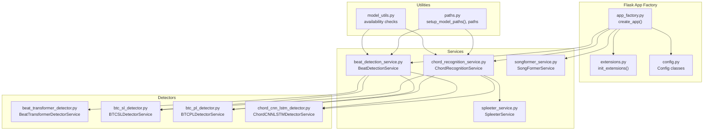
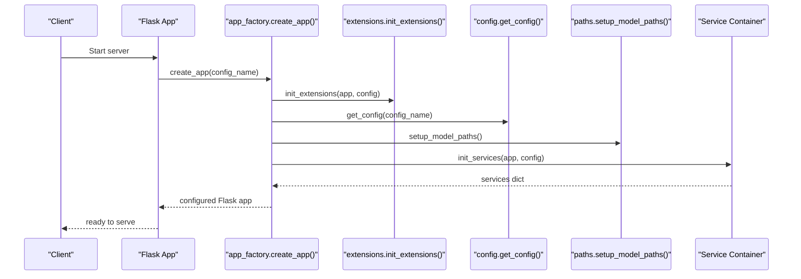
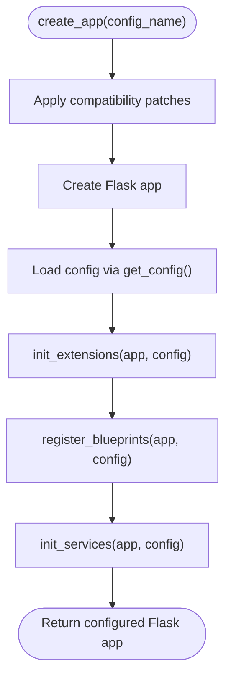
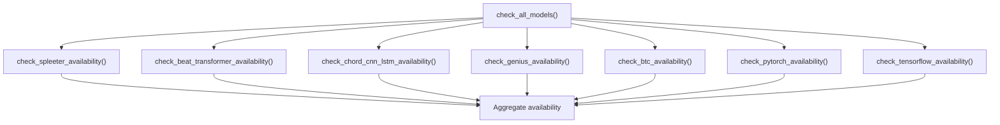
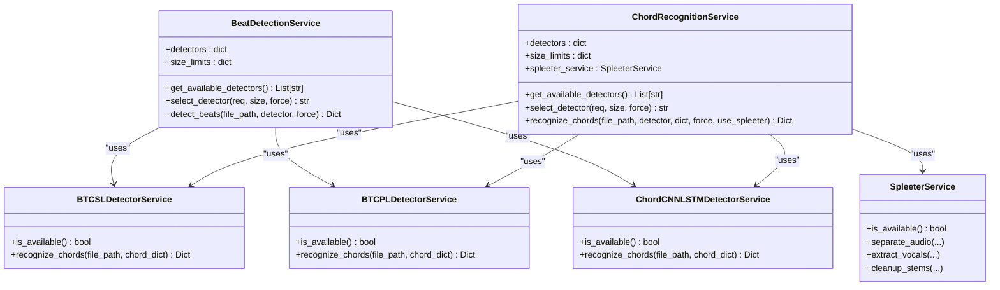
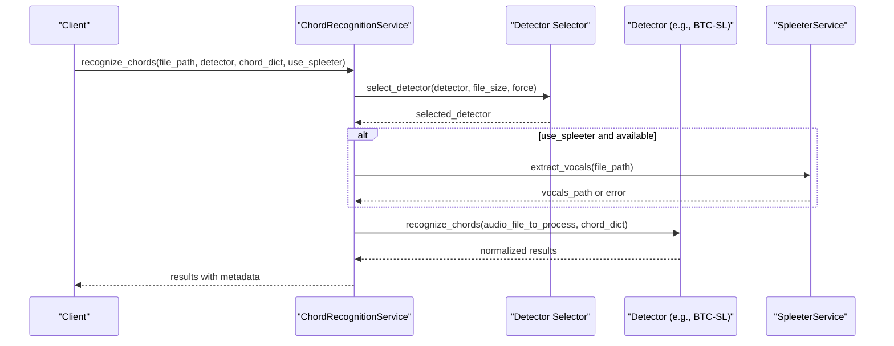
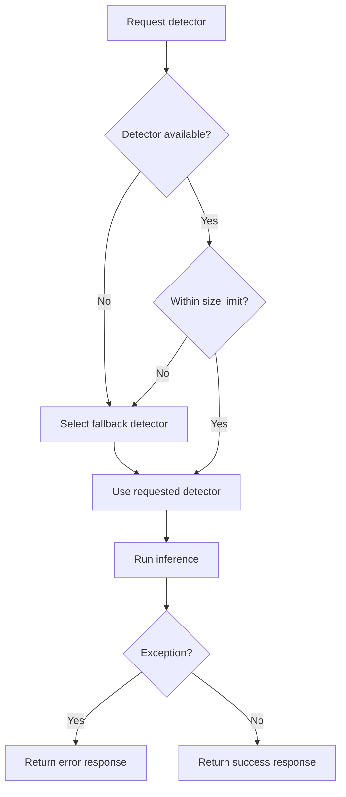
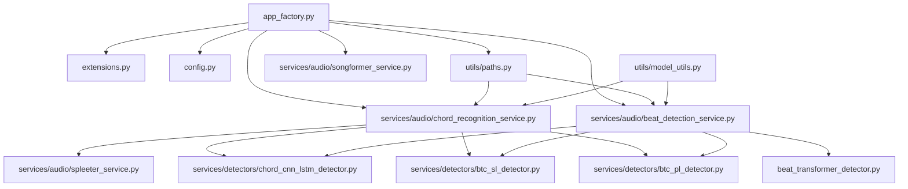

# Model Loading and Initialization

<cite>
**Referenced Files in This Document**
- [app_factory.py](file://python_backend/app_factory.py)
- [extensions.py](file://python_backend/extensions.py)
- [config.py](file://python_backend/config.py)
- [paths.py](file://python_backend/utils/paths.py)
- [model_utils.py](file://python_backend/utils/model_utils.py)
- [beat_detection_service.py](file://python_backend/services/audio/beat_detection_service.py)
- [chord_recognition_service.py](file://python_backend/services/audio/chord_recognition_service.py)
- [btc_sl_detector.py](file://python_backend/services/detectors/btc_sl_detector.py)
- [btc_pl_detector.py](file://python_backend/services/detectors/btc_pl_detector.py)
- [chord_cnn_lstm_detector.py](file://python_backend/services/detectors/chord_cnn_lstm_detector.py)
- [spleeter_service.py](file://python_backend/services/audio/spleeter_service.py)
- [songformer_service.py](file://python_backend/services/audio/songformer_service.py)
- [models/__init__.py](file://python_backend/models/__init__.py)
- [SongFormer.yaml](file://SongFormer/src/SongFormer/configs/SongFormer.yaml)
</cite>

## Table of Contents
1. [Introduction](#introduction)
2. [Project Structure](#project-structure)
3. [Core Components](#core-components)
4. [Architecture Overview](#architecture-overview)
5. [Detailed Component Analysis](#detailed-component-analysis)
6. [Dependency Analysis](#dependency-analysis)
7. [Performance Considerations](#performance-considerations)
8. [Troubleshooting Guide](#troubleshooting-guide)
9. [Conclusion](#conclusion)

## Introduction
This document explains the model loading and initialization system powering audio analysis in the backend. It covers the application factory pattern, dynamic model loading, initialization procedures for detection algorithms, model availability checking, fallback mechanisms, error handling, caching and memory strategies, configuration management, version compatibility, and integration with the Flask application factory. It also describes how models are initialized during service startup and how the system gracefully handles missing or corrupted models.

## Project Structure
The model system spans several modules:
- Application factory initializes services and sets up model paths.
- Services encapsulate detection logic and model orchestration.
- Detectors wrap individual models with normalized interfaces.
- Utilities provide availability checks and path management.
- Configuration controls feature toggles and environment-specific behavior.

**Diagram sources**
- [app_factory.py:27-65](file://python_backend/app_factory.py#L27-L65)
- [extensions.py:81-92](file://python_backend/extensions.py#L81-L92)
- [config.py:16-215](file://python_backend/config.py#L16-L215)
- [paths.py:45-62](file://python_backend/utils/paths.py#L45-L62)
- [beat_detection_service.py:20-348](file://python_backend/services/audio/beat_detection_service.py#L20-L348)
- [chord_recognition_service.py:25-322](file://python_backend/services/audio/chord_recognition_service.py#L25-L322)
- [btc_sl_detector.py:17-246](file://python_backend/services/detectors/btc_sl_detector.py#L17-L246)
- [btc_pl_detector.py:17-246](file://python_backend/services/detectors/btc_pl_detector.py#L17-L246)
- [chord_cnn_lstm_detector.py:17-249](file://python_backend/services/detectors/chord_cnn_lstm_detector.py#L17-L249)
- [spleeter_service.py:17-286](file://python_backend/services/audio/spleeter_service.py#L17-L286)
- [songformer_service.py:21-140](file://python_backend/services/audio/songformer_service.py#L21-L140)

**Section sources**
- [app_factory.py:27-65](file://python_backend/app_factory.py#L27-L65)
- [extensions.py:81-92](file://python_backend/extensions.py#L81-L92)
- [config.py:16-215](file://python_backend/config.py#L16-L215)
- [paths.py:45-62](file://python_backend/utils/paths.py#L45-L62)

## Core Components
- Application factory pattern: Centralized creation and configuration of the Flask app, including extension initialization, blueprints registration, and service container setup.
- Service container: Initializes core services (beat detection, chord recognition, lyrics orchestrator, SongFormer) with graceful failure handling.
- Detector services: Encapsulate individual models with normalized interfaces, availability checks, and fallback logic.
- Availability utilities: Lightweight checks for model presence and dependencies without loading heavy weights.
- Path management: Adds model directories to Python path and validates checkpoint locations.
- Configuration: Controls feature toggles, rate limits, CORS, and environment-specific behavior.

**Section sources**
- [app_factory.py:103-162](file://python_backend/app_factory.py#L103-L162)
- [beat_detection_service.py:20-348](file://python_backend/services/audio/beat_detection_service.py#L20-L348)
- [chord_recognition_service.py:25-322](file://python_backend/services/audio/chord_recognition_service.py#L25-L322)
- [model_utils.py:12-326](file://python_backend/utils/model_utils.py#L12-L326)
- [paths.py:45-184](file://python_backend/utils/paths.py#L45-L184)
- [config.py:62-70](file://python_backend/config.py#L62-L70)

## Architecture Overview
The system follows a layered architecture:
- Application factory creates the Flask app, loads configuration, initializes extensions, registers blueprints, and constructs a service container.
- Services orchestrate detectors and apply fallback strategies based on availability and file size constraints.
- Detectors implement model-specific loading and inference with normalized outputs.
- Utilities provide availability checks and path management to ensure deterministic loading.

**Diagram sources**
- [app_factory.py:27-65](file://python_backend/app_factory.py#L27-L65)
- [app_factory.py:103-162](file://python_backend/app_factory.py#L103-L162)
- [extensions.py:81-92](file://python_backend/extensions.py#L81-L92)
- [config.py:195-215](file://python_backend/config.py#L195-L215)
- [paths.py:45-62](file://python_backend/utils/paths.py#L45-L62)

## Detailed Component Analysis

### Application Factory Pattern and Service Container
- Compatibility patches are applied early to ensure third-party libraries are adapted before heavy imports.
- Configuration is loaded from environment-aware classes and applied to the Flask app.
- Extensions (CORS, rate limiter, logging) are initialized centrally.
- Blueprints are registered conditionally (e.g., debug blueprint only outside production).
- Service container is constructed with lazy initialization and error-handling fallbacks for each service.

**Diagram sources**
- [app_factory.py:27-65](file://python_backend/app_factory.py#L27-L65)
- [extensions.py:81-92](file://python_backend/extensions.py#L81-L92)
- [config.py:195-215](file://python_backend/config.py#L195-L215)

**Section sources**
- [app_factory.py:27-65](file://python_backend/app_factory.py#L27-L65)
- [app_factory.py:103-162](file://python_backend/app_factory.py#L103-L162)
- [extensions.py:81-92](file://python_backend/extensions.py#L81-L92)
- [config.py:16-215](file://python_backend/config.py#L16-L215)

### Model Availability Checking System
- Dedicated utilities check for model presence and dependencies without importing heavy modules.
- Checks include:
  - Spleeter availability
  - Beat-Transformer availability
  - Chord-CNN-LSTM presence (directory and required files)
  - Genius API availability
  - BTC models (SL/PL) with config and checkpoint validation
  - PyTorch/TensorFlow availability and device info
- Aggregated availability report with counts and percentages.

**Diagram sources**
- [model_utils.py:285-326](file://python_backend/utils/model_utils.py#L285-L326)
- [model_utils.py:12-326](file://python_backend/utils/model_utils.py#L12-L326)

**Section sources**
- [model_utils.py:12-326](file://python_backend/utils/model_utils.py#L12-L326)

### Dynamic Model Loading Mechanisms
- Beat Detection Service composes multiple detectors (Beat-Transformer, madmom, librosa) and selects based on availability and file size.
- Chord Recognition Service composes detectors (Chord-CNN-LSTM, BTC-SL, BTC-PL) with similar selection logic and integrates Spleeter for vocal separation.
- Detectors implement lazy availability checks and import-time validation.
- SongFormer Service dynamically loads the packaged runtime, initializes models on demand, and manages device context.

**Diagram sources**
- [beat_detection_service.py:20-348](file://python_backend/services/audio/beat_detection_service.py#L20-L348)
- [chord_recognition_service.py:25-322](file://python_backend/services/audio/chord_recognition_service.py#L25-L322)
- [btc_sl_detector.py:17-246](file://python_backend/services/detectors/btc_sl_detector.py#L17-L246)
- [btc_pl_detector.py:17-246](file://python_backend/services/detectors/btc_pl_detector.py#L17-L246)
- [chord_cnn_lstm_detector.py:17-249](file://python_backend/services/detectors/chord_cnn_lstm_detector.py#L17-L249)
- [spleeter_service.py:17-286](file://python_backend/services/audio/spleeter_service.py#L17-L286)

**Section sources**
- [beat_detection_service.py:20-348](file://python_backend/services/audio/beat_detection_service.py#L20-L348)
- [chord_recognition_service.py:25-322](file://python_backend/services/audio/chord_recognition_service.py#L25-L322)
- [btc_sl_detector.py:32-85](file://python_backend/services/detectors/btc_sl_detector.py#L32-L85)
- [btc_pl_detector.py:32-85](file://python_backend/services/detectors/btc_pl_detector.py#L32-L85)
- [chord_cnn_lstm_detector.py:32-77](file://python_backend/services/detectors/chord_cnn_lstm_detector.py#L32-L77)
- [spleeter_service.py:27-47](file://python_backend/services/audio/spleeter_service.py#L27-L47)

### Initialization Procedures for Detection Algorithms
- Beat Detection Service:
  - Detects available detectors and applies size-based selection policy.
  - Normalizes results and adds metadata (file size, duration, processing time).
- Chord Recognition Service:
  - Orchestrates detector selection, chord dictionary validation, optional Spleeter separation, and normalization of outputs.
  - Provides detector info and supported dictionaries.
- SongFormer Service:
  - Loads the runtime module dynamically from a configured root path.
  - Initializes models on first use and executes inference with post-processing.

**Diagram sources**
- [chord_recognition_service.py:173-297](file://python_backend/services/audio/chord_recognition_service.py#L173-L297)
- [btc_sl_detector.py:87-160](file://python_backend/services/detectors/btc_sl_detector.py#L87-L160)
- [spleeter_service.py:180-198](file://python_backend/services/audio/spleeter_service.py#L180-L198)

**Section sources**
- [chord_recognition_service.py:173-297](file://python_backend/services/audio/chord_recognition_service.py#L173-L297)
- [beat_detection_service.py:163-310](file://python_backend/services/audio/beat_detection_service.py#L163-L310)
- [songformer_service.py:85-116](file://python_backend/services/audio/songformer_service.py#L85-L116)

### Fallback Mechanisms and Error Handling
- Detector selection falls back to alternatives when requested detector is unavailable or file size exceeds limits.
- Services catch exceptions and return structured error responses with processing time.
- Availability checks return conservative defaults to keep the system operational.
- Spleeter cleanup ensures temporary files are removed on success or error.

**Diagram sources**
- [beat_detection_service.py:53-98](file://python_backend/services/audio/beat_detection_service.py#L53-L98)
- [chord_recognition_service.py:61-106](file://python_backend/services/audio/chord_recognition_service.py#L61-L106)

**Section sources**
- [beat_detection_service.py:53-98](file://python_backend/services/audio/beat_detection_service.py#L53-L98)
- [chord_recognition_service.py:61-106](file://python_backend/services/audio/chord_recognition_service.py#L61-L106)
- [spleeter_service.py:222-248](file://python_backend/services/audio/spleeter_service.py#L222-L248)

### Model Caching Strategies, Memory Management, and Performance
- SpleeterService creates a new Separator instance per request to avoid memory leaks and reduce contention.
- SongFormerService uses thread locks and a context manager to ensure safe, one-time initialization of models.
- Detectors cache availability status to avoid repeated filesystem checks.
- Path management adds model directories to sys.path once during app initialization to streamline imports.

**Section sources**
- [spleeter_service.py:48-70](file://python_backend/services/audio/spleeter_service.py#L48-L70)
- [songformer_service.py:34-44](file://python_backend/services/audio/songformer_service.py#L34-L44)
- [songformer_service.py:85-103](file://python_backend/services/audio/songformer_service.py#L85-L103)
- [chord_cnn_lstm_detector.py:32-77](file://python_backend/services/detectors/chord_cnn_lstm_detector.py#L32-L77)
- [paths.py:45-62](file://python_backend/utils/paths.py#L45-L62)

### Model Configuration Management and Version Compatibility
- Configuration classes define feature toggles (e.g., USE_BTC_SL, USE_BTC_PL) and environment-specific settings.
- SongFormer configuration is loaded from a YAML file describing model dimensions, training parameters, and dataset settings.
- PyTorch availability checks determine CUDA/MPS/CPU devices and expose version/device info for diagnostics.

**Section sources**
- [config.py:62-70](file://python_backend/config.py#L62-L70)
- [SongFormer.yaml:1-186](file://SongFormer/src/SongFormer/configs/SongFormer.yaml#L1-L186)
- [model_utils.py:141-181](file://python_backend/utils/model_utils.py#L141-L181)

### Automatic Model Updates
- The system does not implement automated model update mechanisms. Availability checks and path validation are static and rely on the presence of expected files and directories. To update models, administrators should place updated artifacts in the expected paths and restart the service.

[No sources needed since this section summarizes behavior without analyzing specific files]

## Dependency Analysis
The following diagram highlights key dependencies among components involved in model loading and initialization.

**Diagram sources**
- [app_factory.py:103-162](file://python_backend/app_factory.py#L103-L162)
- [paths.py:45-62](file://python_backend/utils/paths.py#L45-L62)
- [beat_detection_service.py:20-348](file://python_backend/services/audio/beat_detection_service.py#L20-L348)
- [chord_recognition_service.py:25-322](file://python_backend/services/audio/chord_recognition_service.py#L25-L322)
- [btc_sl_detector.py:17-246](file://python_backend/services/detectors/btc_sl_detector.py#L17-L246)
- [btc_pl_detector.py:17-246](file://python_backend/services/detectors/btc_pl_detector.py#L17-L246)
- [chord_cnn_lstm_detector.py:17-249](file://python_backend/services/detectors/chord_cnn_lstm_detector.py#L17-L249)
- [spleeter_service.py:17-286](file://python_backend/services/audio/spleeter_service.py#L17-L286)
- [songformer_service.py:21-140](file://python_backend/services/audio/songformer_service.py#L21-L140)
- [model_utils.py:12-326](file://python_backend/utils/model_utils.py#L12-L326)

**Section sources**
- [app_factory.py:103-162](file://python_backend/app_factory.py#L103-L162)
- [paths.py:45-62](file://python_backend/utils/paths.py#L45-L62)
- [beat_detection_service.py:20-348](file://python_backend/services/audio/beat_detection_service.py#L20-L348)
- [chord_recognition_service.py:25-322](file://python_backend/services/audio/chord_recognition_service.py#L25-L322)

## Performance Considerations
- Prefer smaller models for short audio clips to reduce latency.
- Use Spleeter only when beneficial; it introduces overhead and requires disk I/O.
- Keep model directories on fast storage to minimize import delays.
- Monitor device utilization (CUDA/MPS/CPU) via availability checks to choose optimal models.
- Avoid repeated model imports by leveraging cached availability and lazy initialization.

[No sources needed since this section provides general guidance]

## Troubleshooting Guide
- Missing models: Use availability utilities to diagnose missing files or dependencies. Verify model directories and required files exist.
- Import failures: Detectors catch ImportError and mark themselves unavailable; confirm environment dependencies (e.g., PyTorch) are installed.
- File size limits: If a detector is unavailable for a given file, the service selects a fallback detector within size limits.
- Spleeter cleanup: On errors, ensure temporary directories are cleaned; the service attempts cleanup automatically.
- Device issues: Check PyTorch availability and device info to confirm CUDA/MPS availability.

**Section sources**
- [model_utils.py:12-326](file://python_backend/utils/model_utils.py#L12-L326)
- [chord_cnn_lstm_detector.py:66-76](file://python_backend/services/detectors/chord_cnn_lstm_detector.py#L66-L76)
- [spleeter_service.py:160-178](file://python_backend/services/audio/spleeter_service.py#L160-L178)
- [model_utils.py:141-181](file://python_backend/utils/model_utils.py#L141-L181)

## Conclusion
The model loading and initialization system is designed for resilience and flexibility. It leverages the Flask application factory pattern, centralized configuration, and service/container composition to orchestrate multiple detection algorithms. Availability checks, fallback strategies, and careful memory management ensure robust operation even when models are partially missing or underpowered environments are present. Integration with SongFormer and Spleeter is handled through dynamic loading and controlled initialization, while configuration toggles allow operators to adapt features to deployment constraints.