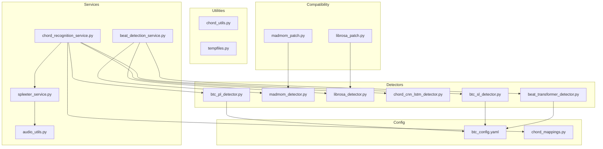
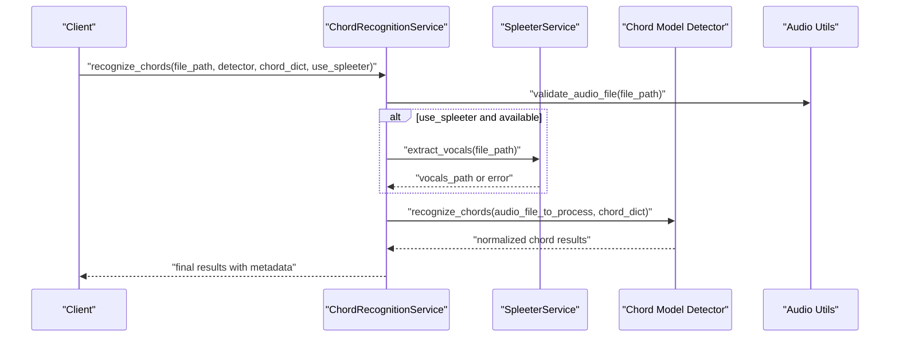
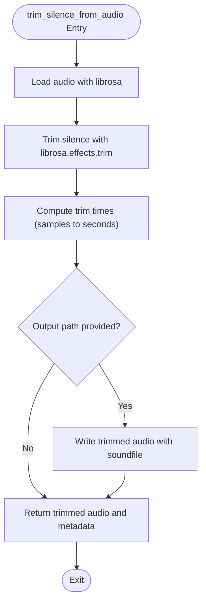
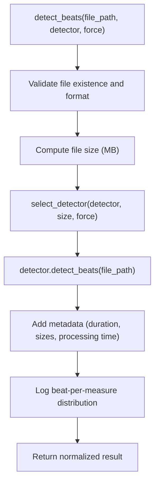
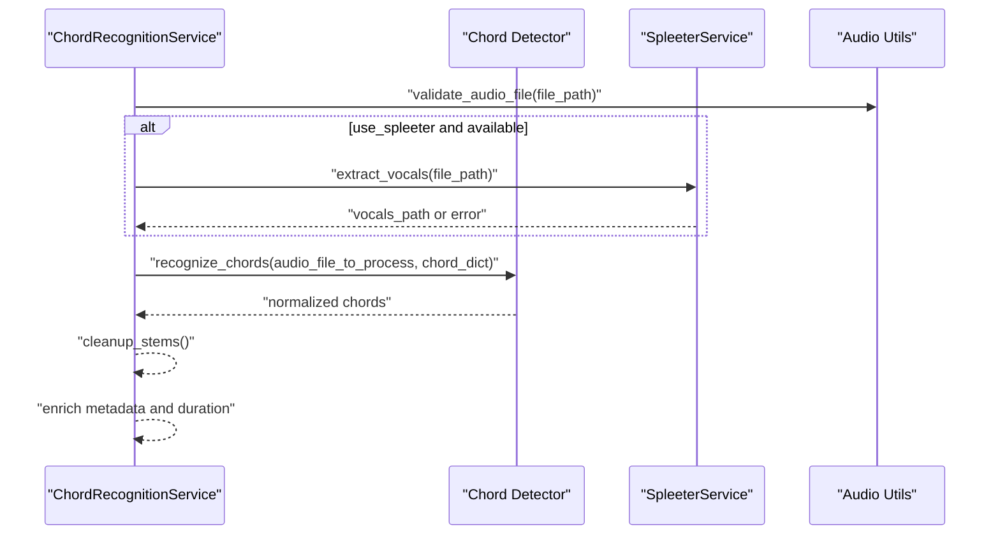
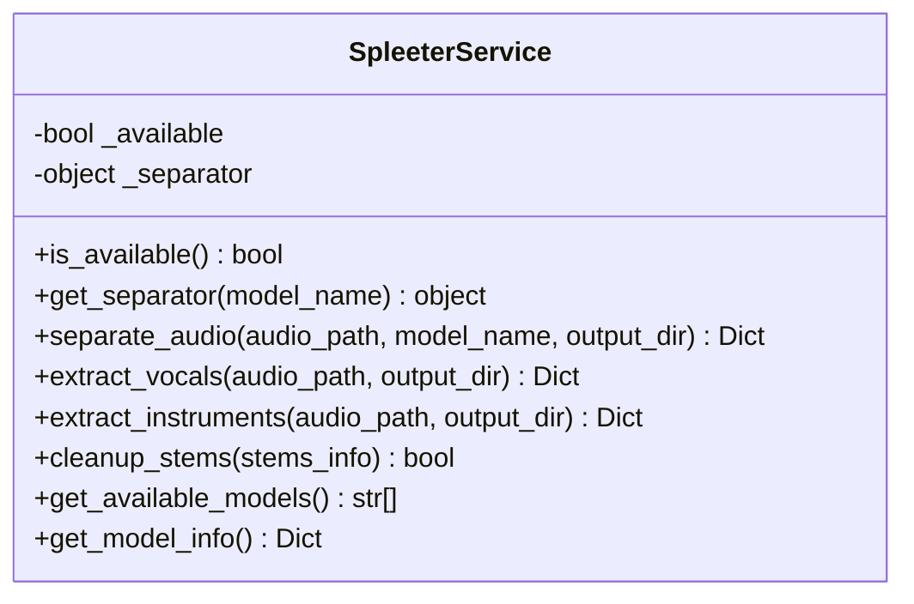
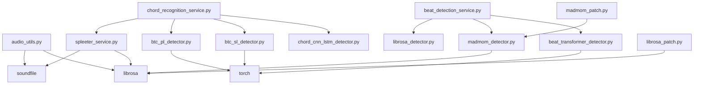

# Audio Processing Services

<cite>
**Referenced Files in This Document**
- [audio_utils.py](file://python_backend/services/audio/audio_utils.py)
- [beat_detection_service.py](file://python_backend/services/audio/beat_detection_service.py)
- [chord_recognition_service.py](file://python_backend/services/audio/chord_recognition_service.py)
- [spleeter_service.py](file://python_backend/services/audio/spleeter_service.py)
- [beat_transformer_detector.py](file://python_backend/services/detectors/beat_transformer_detector.py)
- [madmom_detector.py](file://python_backend/services/detectors/madmom_detector.py)
- [librosa_detector.py](file://python_backend/services/detectors/librosa_detector.py)
- [chord_cnn_lstm_detector.py](file://python_backend/services/detectors/chord_cnn_lstm_detector.py)
- [btc_sl_detector.py](file://python_backend/services/detectors/btc_sl_detector.py)
- [btc_pl_detector.py](file://python_backend/services/detectors/btc_pl_detector.py)
- [chord_utils.py](file://python_backend/services/audio/chord_utils.py)
- [tempfiles.py](file://python_backend/services/audio/tempfiles.py)
- [librosa_patch.py](file://python_backend/compat/librosa_patch.py)
- [madmom_patch.py](file://python_backend/compat/madmom_patch.py)
- [btc_config.yaml](file://python_backend/config/btc_config.yaml)
- [chord_mappings.py](file://python_backend/utils/chord_mappings.py)
</cite>

## Table of Contents
1. [Introduction](#introduction)
2. [Project Structure](#project-structure)
3. [Core Components](#core-components)
4. [Architecture Overview](#architecture-overview)
5. [Detailed Component Analysis](#detailed-component-analysis)
6. [Dependency Analysis](#dependency-analysis)
7. [Performance Considerations](#performance-considerations)
8. [Troubleshooting Guide](#troubleshooting-guide)
9. [Conclusion](#conclusion)

## Introduction
This document describes the audio processing services that power core audio manipulation and analysis tasks in the backend. It covers:
- audio_utils: format conversion, normalization, silence trimming, and validation
- beat_detection_service: tempo and rhythm analysis with model selection and fallback strategies
- chord_recognition_service: harmonic analysis with optional audio separation
- spleeter_service: audio separation for vocals/accompaniment/instruments
- Integration with external libraries: librosa, spleeter, madmom, and PyTorch-based models
- Performance optimization, memory management, error handling, and coordination for complex pipelines

## Project Structure
The audio processing stack is organized into:
- Services: high-level orchestration services for beat detection, chord recognition, and audio separation
- Detectors: wrappers around external libraries and models with normalized interfaces
- Utilities: audio and chord processing helpers, temporary file management, and library compatibility patches
- Config: model-specific configuration (e.g., BTC transformer models)

**Diagram sources**
- [beat_detection_service.py:20-348](file://python_backend/services/audio/beat_detection_service.py#L20-L348)
- [chord_recognition_service.py:25-322](file://python_backend/services/audio/chord_recognition_service.py#L25-L322)
- [spleeter_service.py:17-286](file://python_backend/services/audio/spleeter_service.py#L17-L286)
- [beat_transformer_detector.py:15-163](file://python_backend/services/detectors/beat_transformer_detector.py#L15-L163)
- [madmom_detector.py:14-158](file://python_backend/services/detectors/madmom_detector.py#L14-L158)
- [librosa_detector.py:14-124](file://python_backend/services/detectors/librosa_detector.py#L14-L124)
- [chord_cnn_lstm_detector.py:17-249](file://python_backend/services/detectors/chord_cnn_lstm_detector.py#L17-L249)
- [btc_sl_detector.py:17-246](file://python_backend/services/detectors/btc_sl_detector.py#L17-L246)
- [btc_pl_detector.py:17-246](file://python_backend/services/detectors/btc_pl_detector.py#L17-L246)
- [chord_utils.py:1-294](file://python_backend/services/audio/chord_utils.py#L1-L294)
- [tempfiles.py:1-136](file://python_backend/services/audio/tempfiles.py#L1-L136)
- [librosa_patch.py:1-97](file://python_backend/compat/librosa_patch.py#L1-L97)
- [madmom_patch.py:1-33](file://python_backend/compat/madmom_patch.py#L1-L33)
- [btc_config.yaml:1-61](file://python_backend/config/btc_config.yaml#L1-L61)
- [chord_mappings.py:1-319](file://python_backend/utils/chord_mappings.py#L1-L319)

**Section sources**
- [audio_utils.py:1-131](file://python_backend/services/audio/audio_utils.py#L1-L131)
- [beat_detection_service.py:1-348](file://python_backend/services/audio/beat_detection_service.py#L1-L348)
- [chord_recognition_service.py:1-322](file://python_backend/services/audio/chord_recognition_service.py#L1-L322)
- [spleeter_service.py:1-286](file://python_backend/services/audio/spleeter_service.py#L1-L286)

## Core Components
- audio_utils
  - Provides silence trimming, duration estimation, resampling, and validation
  - Integrates librosa and soundfile for audio I/O and processing
  - Robust error handling with fallbacks to original audio when trimming fails
- beat_detection_service
  - Orchestrates beat detection across multiple detectors (Beat Transformer, madmom, librosa)
  - Implements size-aware selection and fallback strategies
  - Normalizes outputs and enriches with metadata (duration, processing time)
- chord_recognition_service
  - Orchestrates chord recognition across multiple models (Chord-CNN-LSTM, BTC-SL, BTC-PL)
  - Supports optional Spleeter-based vocal separation
  - Validates and normalizes chord dictionaries per model
- spleeter_service
  - Wraps Spleeter for 2-stem, 4-stem, and 5-stem separation
  - Ensures stereo format compatibility and manages temporary files
  - Provides cleanup routines and robust error handling

**Section sources**
- [audio_utils.py:12-131](file://python_backend/services/audio/audio_utils.py#L12-L131)
- [beat_detection_service.py:20-348](file://python_backend/services/audio/beat_detection_service.py#L20-L348)
- [chord_recognition_service.py:25-322](file://python_backend/services/audio/chord_recognition_service.py#L25-L322)
- [spleeter_service.py:17-286](file://python_backend/services/audio/spleeter_service.py#L17-L286)

## Architecture Overview
The system follows a layered architecture:
- Orchestration layer: Services (beat_detection_service, chord_recognition_service)
- Detection layer: Detectors wrapping external libraries and models
- Utility layer: Audio and chord processing helpers, temporary file management
- Compatibility layer: Patches for librosa and madmom to address library version issues
- Configuration layer: Model-specific YAML configuration for transformer-based models

**Diagram sources**
- [chord_recognition_service.py:173-296](file://python_backend/services/audio/chord_recognition_service.py#L173-L296)
- [spleeter_service.py:180-198](file://python_backend/services/audio/spleeter_service.py#L180-L198)
- [chord_cnn_lstm_detector.py:78-182](file://python_backend/services/detectors/chord_cnn_lstm_detector.py#L78-L182)
- [btc_sl_detector.py:87-160](file://python_backend/services/detectors/btc_sl_detector.py#L87-L160)
- [btc_pl_detector.py:87-160](file://python_backend/services/detectors/btc_pl_detector.py#L87-L160)

## Detailed Component Analysis

### audio_utils
- trim_silence_from_audio
  - Uses librosa.load and librosa.effects.trim
  - Computes trim start/end times in seconds
  - Writes output with soundfile if provided
  - Logs and returns original audio on failure
- get_audio_duration
  - Loads audio and computes duration via librosa.get_duration
- resample_audio
  - Resamples to target sample rate using librosa.load
- validate_audio_file
  - Attempts librosa.load for first second to validate
  - Falls back to filesystem checks if librosa unavailable

**Diagram sources**
- [audio_utils.py:12-67](file://python_backend/services/audio/audio_utils.py#L12-L67)

**Section sources**
- [audio_utils.py:12-131](file://python_backend/services/audio/audio_utils.py#L12-L131)

### beat_detection_service
- Orchestrates detector selection based on availability and file size
- Size limits:
  - Beat Transformer: up to 100 MB
  - madmom: up to 200 MB
  - librosa: up to 500 MB
- Auto-selection preference:
  - Small (<50 MB): madmom
  - Medium (<100 MB): madmom or Beat Transformer
  - Large: madmom or librosa
- Normalizes outputs and enriches with:
  - File size, detector selected/requested/forced
  - Duration (via librosa)
  - Beat-per-measure distribution and confidence for certain heuristics

**Diagram sources**
- [beat_detection_service.py:163-311](file://python_backend/services/audio/beat_detection_service.py#L163-L311)

**Section sources**
- [beat_detection_service.py:20-348](file://python_backend/services/audio/beat_detection_service.py#L20-L348)

### chord_recognition_service
- Orchestrates chord recognition across:
  - Chord-CNN-LSTM (deep learning)
  - BTC-SL and BTC-PL (transformer-based)
- Detector size limits:
  - Chord-CNN-LSTM: up to 100 MB
  - BTC-SL: up to 50 MB
  - BTC-PL: up to 50 MB
- Auto-selection preference:
  - Small/Medium: BTC models for accuracy
  - Large: Chord-CNN-LSTM
- Optional Spleeter integration:
  - Extracts vocals for cleaner recognition
  - Cleans up temporary files after processing
- Validates and selects chord dictionary per model

**Diagram sources**
- [chord_recognition_service.py:173-296](file://python_backend/services/audio/chord_recognition_service.py#L173-L296)
- [spleeter_service.py:180-248](file://python_backend/services/audio/spleeter_service.py#L180-L248)

**Section sources**
- [chord_recognition_service.py:25-322](file://python_backend/services/audio/chord_recognition_service.py#L25-L322)

### spleeter_service
- is_available: checks importability of spleeter and Separator
- get_separator: creates a new Separator per request to avoid memory issues
- separate_audio:
  - Ensures stereo input for Spleeter
  - Saves stems with soundfile
  - Returns normalized results with processing time and temp dir flag
- extract_vocals/extract_instruments: convenience wrappers
- cleanup_stems: removes temporary directory or individual stem files

**Diagram sources**
- [spleeter_service.py:17-286](file://python_backend/services/audio/spleeter_service.py#L17-L286)

**Section sources**
- [spleeter_service.py:17-286](file://python_backend/services/audio/spleeter_service.py#L17-L286)

### Detectors Integration
- Beat detectors
  - BeatTransformerDetectorService: loads model from checkpoint path, exposes normalized detect_beats
  - MadmomDetectorService: uses RNNBeatProcessor and DBNBeatTrackingProcessor, returns heuristic downbeat candidates
  - LibrosaDetectorService: uses librosa.beat.beat_track, estimates BPM and simple time signature
- Chord detectors
  - ChordCNNLSTMDetectorService: runs chord recognition via model-provided API, parses LAB output
  - BTCSLDetectorService and BTCPLDetectorService: use BTC wrapper to generate LAB files, parse and return normalized results

```mermaid
classDiagram
class BeatTransformerDetectorService {
-Path _checkpoint_path
-object _detector
-bool _available
+is_available() bool
+detect_beats(file_path) Dict
+get_device_info() Dict
}
class MadmomDetectorService {
-bool _available
+is_available() bool
+detect_beats(file_path) Dict
}
class LibrosaDetectorService {
-bool _available
+is_available() bool
+detect_beats(file_path) Dict
}
class ChordCNNLSTMDetectorService {
-Path _model_dir
-bool _available
+is_available() bool
+recognize_chords(file_path, chord_dict) Dict
+get_supported_chord_dicts() str[]
+get_model_info() Dict
}
class BTCSLDetectorService {
-Path _model_dir
-bool _available
+is_available() bool
+recognize_chords(file_path, chord_dict) Dict
+get_supported_chord_dicts() str[]
+get_model_info() Dict
}
class BTCPLDetectorService {
-Path _model_dir
-bool _available
+is_available() bool
+recognize_chords(file_path, chord_dict) Dict
+get_supported_chord_dicts() str[]
+get_model_info() Dict
}
```

**Diagram sources**
- [beat_transformer_detector.py:15-163](file://python_backend/services/detectors/beat_transformer_detector.py#L15-L163)
- [madmom_detector.py:14-158](file://python_backend/services/detectors/madmom_detector.py#L14-L158)
- [librosa_detector.py:14-124](file://python_backend/services/detectors/librosa_detector.py#L14-L124)
- [chord_cnn_lstm_detector.py:17-249](file://python_backend/services/detectors/chord_cnn_lstm_detector.py#L17-L249)
- [btc_sl_detector.py:17-246](file://python_backend/services/detectors/btc_sl_detector.py#L17-L246)
- [btc_pl_detector.py:17-246](file://python_backend/services/detectors/btc_pl_detector.py#L17-L246)

**Section sources**
- [beat_transformer_detector.py:15-163](file://python_backend/services/detectors/beat_transformer_detector.py#L15-L163)
- [madmom_detector.py:14-158](file://python_backend/services/detectors/madmom_detector.py#L14-L158)
- [librosa_detector.py:14-124](file://python_backend/services/detectors/librosa_detector.py#L14-L124)
- [chord_cnn_lstm_detector.py:17-249](file://python_backend/services/detectors/chord_cnn_lstm_detector.py#L17-L249)
- [btc_sl_detector.py:17-246](file://python_backend/services/detectors/btc_sl_detector.py#L17-L246)
- [btc_pl_detector.py:17-246](file://python_backend/services/detectors/btc_pl_detector.py#L17-L246)

### Utilities and Patches
- chord_utils
  - Simplifies and normalizes chord labels
  - Parses LAB content, merges consecutive chords, filters short segments
  - Calculates statistics and validates chord data
- tempfiles
  - Context managers for safe temporary file and directory creation/cleanup
  - Prevents file locking issues and ensures cleanup on exceptions
- librosa_patch and madmom_patch
  - Patches compatibility issues with newer library versions
  - Ensures librosa and madmom work reliably across environments

**Section sources**
- [chord_utils.py:1-294](file://python_backend/services/audio/chord_utils.py#L1-L294)
- [tempfiles.py:1-136](file://python_backend/services/audio/tempfiles.py#L1-L136)
- [librosa_patch.py:1-97](file://python_backend/compat/librosa_patch.py#L1-L97)
- [madmom_patch.py:1-33](file://python_backend/compat/madmom_patch.py#L1-L33)

## Dependency Analysis
- External libraries
  - librosa: audio loading, beat tracking, effects trimming, duration computation
  - spleeter: audio separation into stems
  - madmom: neural beat detection pipeline
  - PyTorch: transformer-based chord models (BTC-SL, BTC-PL)
  - soundfile: writing WAV files during trimming/separation
- Internal dependencies
  - Services depend on detectors and audio utilities
  - Detectors depend on model directories and configuration
  - Patches ensure compatibility across library versions

**Diagram sources**
- [audio_utils.py:29-30](file://python_backend/services/audio/audio_utils.py#L29-L30)
- [beat_detection_service.py:13-16](file://python_backend/services/audio/beat_detection_service.py#L13-L16)
- [chord_recognition_service.py:12-16](file://python_backend/services/audio/chord_recognition_service.py#L12-L16)
- [spleeter_service.py:115-142](file://python_backend/services/audio/spleeter_service.py#L115-L142)
- [madmom_detector.py:85-86](file://python_backend/services/detectors/madmom_detector.py#L85-L86)
- [librosa_patch.py:20-21](file://python_backend/compat/librosa_patch.py#L20-L21)
- [madmom_patch.py:20-21](file://python_backend/compat/madmom_patch.py#L20-L21)

**Section sources**
- [audio_utils.py:29-30](file://python_backend/services/audio/audio_utils.py#L29-L30)
- [beat_detection_service.py:13-16](file://python_backend/services/audio/beat_detection_service.py#L13-L16)
- [chord_recognition_service.py:12-16](file://python_backend/services/audio/chord_recognition_service.py#L12-L16)
- [spleeter_service.py:115-142](file://python_backend/services/audio/spleeter_service.py#L115-L142)
- [madmom_detector.py:85-86](file://python_backend/services/detectors/madmom_detector.py#L85-L86)
- [librosa_patch.py:20-21](file://python_backend/compat/librosa_patch.py#L20-L21)
- [madmom_patch.py:20-21](file://python_backend/compat/madmom_patch.py#L20-L21)

## Performance Considerations
- Detector selection and file size limits
  - Use smaller detectors for small files and larger detectors for long tracks
  - Respect size limits to avoid memory pressure and timeouts
- Memory management
  - Create Spleeter separators per request to avoid accumulation of state
  - Use temporary files and context managers to prevent leaks
- I/O efficiency
  - Prefer librosa for quick duration and trimming; leverage soundfile for deterministic writes
- Model-specific tuning
  - Adjust hop length and sample rates according to model requirements (e.g., BTC models)
- Parallelization
  - Offload heavy operations (separation, inference) to background jobs when integrating with the frontend

[No sources needed since this section provides general guidance]

## Troubleshooting Guide
- Beat detection
  - If no detector is available, verify model installation and environment
  - For large files, the service falls back to a suitable detector automatically
- Chord recognition
  - If Spleeter fails, the service continues with the original audio and logs the error
  - Ensure the correct chord dictionary is selected for the chosen model
- Audio processing
  - If trimming fails, the service returns the original audio with logged error
  - Validate audio files first using the validation utility
- Library compatibility
  - Apply librosa and madmom patches if encountering import or function errors

**Section sources**
- [beat_detection_service.py:71-97](file://python_backend/services/audio/beat_detection_service.py#L71-L97)
- [chord_recognition_service.py:235-250](file://python_backend/services/audio/chord_recognition_service.py#L235-L250)
- [audio_utils.py:58-67](file://python_backend/services/audio/audio_utils.py#L58-L67)
- [librosa_patch.py:14-47](file://python_backend/compat/librosa_patch.py#L14-L47)
- [madmom_patch.py:12-32](file://python_backend/compat/madmom_patch.py#L12-L32)

## Conclusion
The audio processing services provide a robust, modular framework for beat detection, chord recognition, and audio separation. They integrate seamlessly with librosa, spleeter, madmom, and PyTorch-based models while offering size-aware detector selection, strong error handling, and efficient resource management. By leveraging the provided utilities and patches, developers can build reliable pipelines for complex audio analyses at scale.