# Detector Services

<cite>
**Referenced Files in This Document**
- [beat_transformer_detector.py](file://python_backend/services/detectors/beat_transformer_detector.py)
- [btc_pl_detector.py](file://python_backend/services/detectors/btc_pl_detector.py)
- [btc_sl_detector.py](file://python_backend/services/detectors/btc_sl_detector.py)
- [chord_cnn_lstm_detector.py](file://python_backend/services/detectors/chord_cnn_lstm_detector.py)
- [librosa_detector.py](file://python_backend/services/detectors/librosa_detector.py)
- [madmom_detector.py](file://python_backend/services/detectors/madmom_detector.py)
- [beat_detection_service.py](file://python_backend/services/audio/beat_detection_service.py)
- [chord_recognition_service.py](file://python_backend/services/audio/chord_recognition_service.py)
- [spleeter_service.py](file://python_backend/services/audio/spleeter_service.py)
- [chord_mappings.py](file://python_backend/utils/chord_mappings.py)
- [paths.py](file://python_backend/utils/paths.py)
- [app_factory.py](file://python_backend/app_factory.py)
- [config.py](file://python_backend/config.py)
- [btc_config.yaml](file://python_backend/config/btc_config.yaml)
</cite>

## Table of Contents
1. [Introduction](#introduction)
2. [Project Structure](#project-structure)
3. [Core Components](#core-components)
4. [Architecture Overview](#architecture-overview)
5. [Detailed Component Analysis](#detailed-component-analysis)
6. [Dependency Analysis](#dependency-analysis)
7. [Performance Considerations](#performance-considerations)
8. [Troubleshooting Guide](#troubleshooting-guide)
9. [Conclusion](#conclusion)

## Introduction
This document describes the detector services that power beat and chord analysis in the backend. It covers:
- Beat detection services: BeatTransformer (deep learning), Madmom (neural network), and Librosa (classical signal processing)
- Chord recognition services: Chord-CNN-LSTM (traditional neural network), and BTC-SL/BTC-PL (self-supervised transformer variants)
- Detector selection patterns, fallback strategies, and performance characteristics
- Service interfaces, input/output specifications, and how detectors handle different audio qualities and genres
- Configuration options, model loading strategies, and robustness when primary detectors fail

## Project Structure
The detector services live under python_backend/services/detectors and are orchestrated by higher-level services under python_backend/services/audio. Paths and model locations are centralized in utils/paths.py, and feature toggles are configured in config.py. The application factory initializes services and injects them into the Flask app.

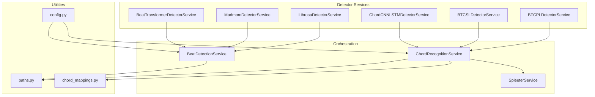

**Diagram sources**
- [beat_detection_service.py:20-31](file://python_backend/services/audio/beat_detection_service.py#L20-L31)
- [chord_recognition_service.py:25-36](file://python_backend/services/audio/chord_recognition_service.py#L25-L36)
- [paths.py:14-42](file://python_backend/utils/paths.py#L14-L42)
- [config.py:62-70](file://python_backend/config.py#L62-L70)

**Section sources**
- [app_factory.py:111-161](file://python_backend/app_factory.py#L111-L161)
- [paths.py:14-62](file://python_backend/utils/paths.py#L14-L62)
- [config.py:62-70](file://python_backend/config.py#L62-L70)

## Core Components
- BeatTransformerDetectorService: Deep learning beat detector with a normalized interface and device info retrieval.
- MadmomDetectorService: Neural network beat detector with heuristic downbeat candidates and BPM estimation.
- LibrosaDetectorService: Classical signal processing beat detector with simple time signature heuristic.
- ChordCNNLSTMDetectorService: Traditional neural network chord recognizer with LAB output parsing and multiple chord dictionaries.
- BTCSLDetectorService: Transformer-based self-label model with LAB output and fixed large_voca dictionary.
- BTCPLDetectorService: Transformer-based pseudo-label model with LAB output and fixed large_voca dictionary.
- BeatDetectionService: Orchestrates detector selection by availability, file size, and user request; normalizes outputs and logs beat-per-measure statistics.
- ChordRecognitionService: Orchestrates chord detection with Spleeter optional separation, chord dictionary validation, and normalization.
- SpleeterService: Optional audio separation for vocals/accompaniment to improve chord recognition quality.
- Configuration and Paths: Centralized model paths, environment toggles, and runtime availability checks.

**Section sources**
- [beat_transformer_detector.py:15-163](file://python_backend/services/detectors/beat_transformer_detector.py#L15-L163)
- [madmom_detector.py:14-158](file://python_backend/services/detectors/madmom_detector.py#L14-L158)
- [librosa_detector.py:14-124](file://python_backend/services/detectors/librosa_detector.py#L14-L124)
- [chord_cnn_lstm_detector.py:17-249](file://python_backend/services/detectors/chord_cnn_lstm_detector.py#L17-L249)
- [btc_sl_detector.py:17-246](file://python_backend/services/detectors/btc_sl_detector.py#L17-L246)
- [btc_pl_detector.py:17-246](file://python_backend/services/detectors/btc_pl_detector.py#L17-L246)
- [beat_detection_service.py:20-348](file://python_backend/services/audio/beat_detection_service.py#L20-L348)
- [chord_recognition_service.py:25-322](file://python_backend/services/audio/chord_recognition_service.py#L25-L322)
- [spleeter_service.py:17-286](file://python_backend/services/audio/spleeter_service.py#L17-L286)
- [paths.py:64-102](file://python_backend/utils/paths.py#L64-L102)
- [config.py:62-70](file://python_backend/config.py#L62-L70)

## Architecture Overview
Detector selection follows a deterministic policy that considers:
- Availability of the detector module/runtime
- File size constraints per detector
- User-requested detector or automatic selection
- Optional fallback to alternative detectors when constraints are exceeded

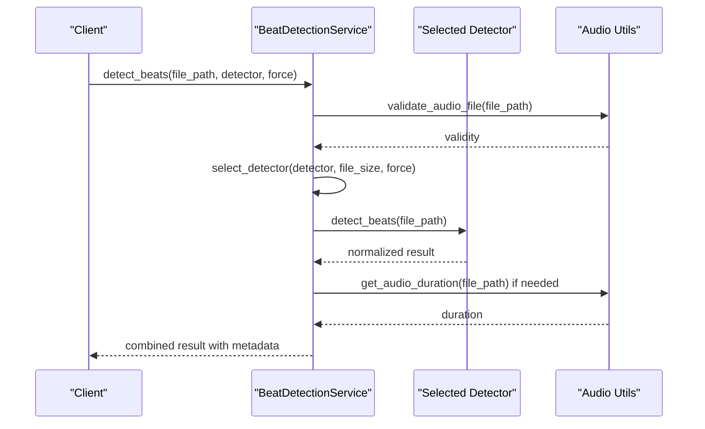

**Diagram sources**
- [beat_detection_service.py:163-311](file://python_backend/services/audio/beat_detection_service.py#L163-L311)

**Section sources**
- [beat_detection_service.py:53-162](file://python_backend/services/audio/beat_detection_service.py#L53-L162)
- [chord_recognition_service.py:61-172](file://python_backend/services/audio/chord_recognition_service.py#L61-L172)

## Detailed Component Analysis

### Beat Detection Services

#### BeatTransformerDetectorService
- Purpose: Deep learning beat detection with a normalized interface.
- Availability: Checked via import of the underlying BeatTransformerDetector and a helper availability function.
- Initialization: Accepts a checkpoint path; lazily constructs the detector instance.
- Interface: detect_beats(file_path) returns a normalized dictionary with beats, downbeats, BPM, time signature, duration, and processing time.
- Device Info: get_device_info delegates to the underlying detector.

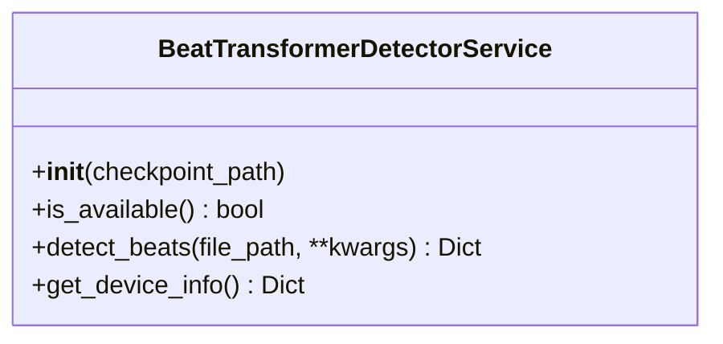

**Diagram sources**
- [beat_transformer_detector.py:15-163](file://python_backend/services/detectors/beat_transformer_detector.py#L15-L163)

**Section sources**
- [beat_transformer_detector.py:20-163](file://python_backend/services/detectors/beat_transformer_detector.py#L20-L163)

#### MadmomDetectorService
- Purpose: Neural network beat detector with heuristic downbeat candidates and BPM estimation.
- Availability: Checked via import of madmom and setuptools/pkg_resources.
- Interface: detect_beats(file_path) returns beats, default downbeats (4/4), candidate downbeats for 3/4 and 4/4, BPM, duration, and processing time.
- Notes: Provides downbeat_candidates for frontend heuristics; default time signature exposed as "4/4".

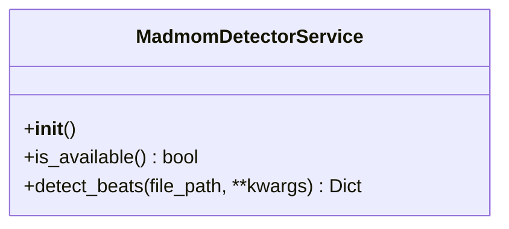

**Diagram sources**
- [madmom_detector.py:14-158](file://python_backend/services/detectors/madmom_detector.py#L14-L158)

**Section sources**
- [madmom_detector.py:23-158](file://python_backend/services/detectors/madmom_detector.py#L23-L158)

#### LibrosaDetectorService
- Purpose: Classical signal processing beat detection.
- Availability: Checked via librosa import.
- Interface: detect_beats(file_path) returns beats, downbeats (every 4th beat heuristic), BPM, time signature placeholder, duration, and processing time.

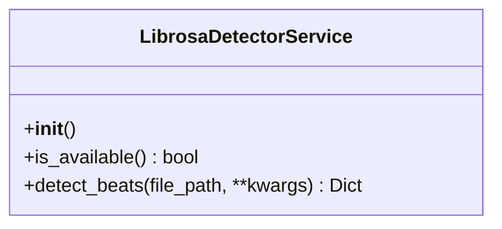

**Diagram sources**
- [librosa_detector.py:14-124](file://python_backend/services/detectors/librosa_detector.py#L14-L124)

**Section sources**
- [librosa_detector.py:23-124](file://python_backend/services/detectors/librosa_detector.py#L23-L124)

#### BeatDetectionService (Orchestrator)
- Detector Registry: Maintains a map of available detectors and their size limits.
- Selection Policy:
  - If detector is explicitly requested and available and within size limit, use it.
  - Otherwise, auto-select based on file size and availability, preferring madmom > beat-transformer > librosa.
  - Fallback: If the requested detector is unavailable or file too large, choose the best alternative or the most permissive detector.
- Output Normalization: Adds file_size_mb, detector_selected/requested/force_used, duration, and total_processing_time.
- Beat-per-measure Logging: Computes distribution of beats per measure and confidence for non-heuristic downbeat sources.

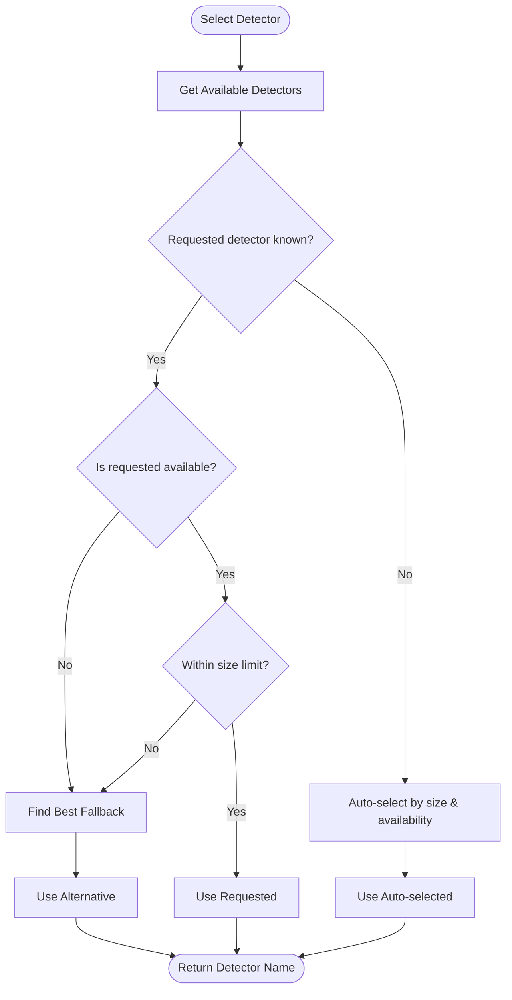

**Diagram sources**
- [beat_detection_service.py:53-162](file://python_backend/services/audio/beat_detection_service.py#L53-L162)

**Section sources**
- [beat_detection_service.py:25-348](file://python_backend/services/audio/beat_detection_service.py#L25-L348)

### Chord Recognition Services

#### ChordCNNLSTMDetectorService
- Purpose: Traditional CNN-LSTM chord recognizer with LAB output parsing.
- Availability: Validates model directory and required files; temporarily tolerates import failures for testing response format.
- Interface: recognize_chords(file_path, chord_dict) returns chords with start/end, chord label, and processing time; supports multiple chord dictionaries.
- LAB Parsing: Converts tab-separated LAB files to normalized chord events.

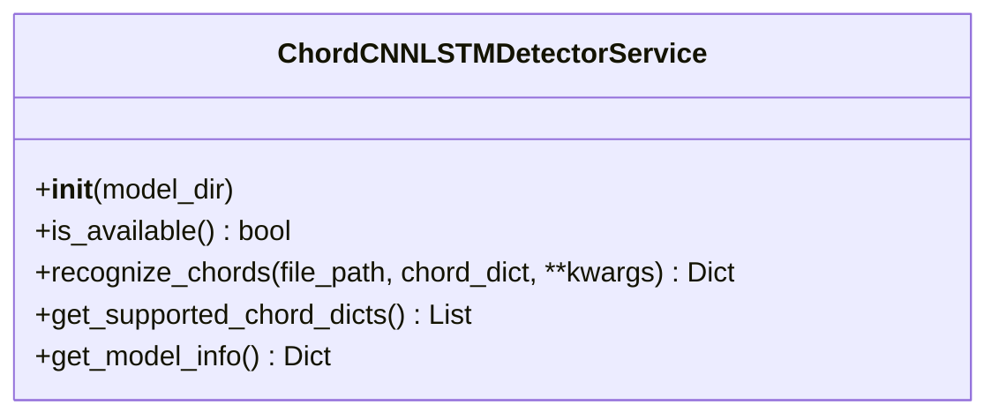

**Diagram sources**
- [chord_cnn_lstm_detector.py:17-249](file://python_backend/services/detectors/chord_cnn_lstm_detector.py#L17-L249)

**Section sources**
- [chord_cnn_lstm_detector.py:32-191](file://python_backend/services/detectors/chord_cnn_lstm_detector.py#L32-L191)
- [chord_mappings.py:112-151](file://python_backend/utils/chord_mappings.py#L112-L151)

#### BTCSLDetectorService
- Purpose: Transformer-based self-label model with fixed large_voca dictionary.
- Availability: Validates model directory structure and required files; checks imports.
- Interface: recognize_chords(file_path, chord_dict='large_voca') returns chords with LAB parsing and processing time.

**Diagram sources**
- [btc_sl_detector.py:17-246](file://python_backend/services/detectors/btc_sl_detector.py#L17-L246)

**Section sources**
- [btc_sl_detector.py:32-169](file://python_backend/services/detectors/btc_sl_detector.py#L32-L169)

#### BTCPLDetectorService
- Purpose: Transformer-based pseudo-label model with fixed large_voca dictionary.
- Availability: Validates model directory structure and required files; checks imports.
- Interface: recognize_chords(file_path, chord_dict='large_voca') returns chords with LAB parsing and processing time.

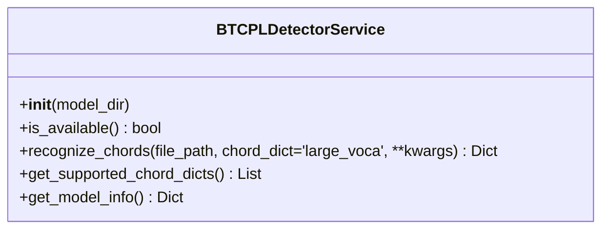

**Diagram sources**
- [btc_pl_detector.py:17-246](file://python_backend/services/detectors/btc_pl_detector.py#L17-L246)

**Section sources**
- [btc_pl_detector.py:32-169](file://python_backend/services/detectors/btc_pl_detector.py#L32-L169)

#### ChordRecognitionService (Orchestrator)
- Detector Registry: Maintains a map of available chord detectors and their size limits.
- Selection Policy:
  - If detector is explicitly requested and available and within size limit, use it.
  - Otherwise, auto-select based on file size and availability, preferring chord-cnn-lstm > btc-sl > btc-pl.
  - Fallback: Choose the best alternative or the most permissive detector.
- Chord Dictionary Management: Validates and defaults to model-specific dictionaries; suggests alternatives if invalid.
- Optional Spleeter Separation: Can separate vocals/accompaniment to improve recognition quality.
- Output Normalization: Adds file_size_mb, detector_selected/requested/force_used, spleeter_info, duration, and total_processing_time.

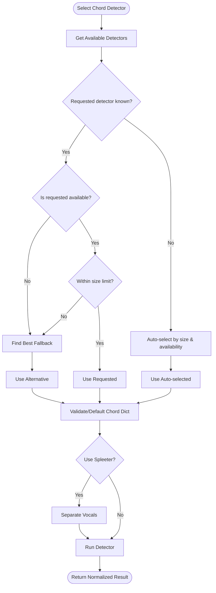

**Diagram sources**
- [chord_recognition_service.py:61-296](file://python_backend/services/audio/chord_recognition_service.py#L61-L296)

**Section sources**
- [chord_recognition_service.py:30-296](file://python_backend/services/audio/chord_recognition_service.py#L30-L296)
- [chord_mappings.py:112-151](file://python_backend/utils/chord_mappings.py#L112-L151)

### SpleeterService (Optional Enhancement)
- Purpose: Optional audio separation to improve chord recognition by isolating vocals.
- Availability: Checked via spleeter import.
- Interfaces:
  - separate_audio(audio_path, model_name, output_dir): Returns stems and processing time.
  - extract_vocals(audio_path, output_dir): Convenience wrapper returning vocals/accompaniment paths.
  - cleanup_stems(stems_info): Cleans up temporary or persistent stem files.
- Notes: Uses 2stems-16kHz by default for vocals/accompaniment separation.

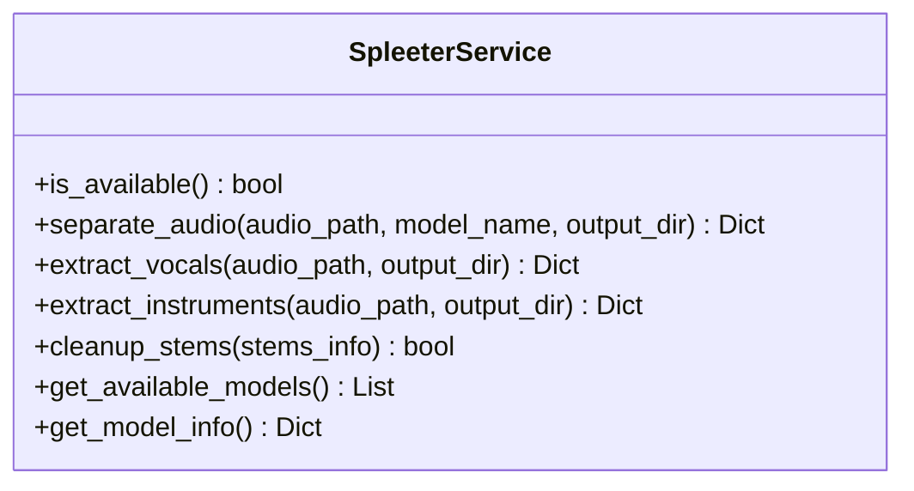

**Diagram sources**
- [spleeter_service.py:17-286](file://python_backend/services/audio/spleeter_service.py#L17-L286)

**Section sources**
- [spleeter_service.py:27-286](file://python_backend/services/audio/spleeter_service.py#L27-L286)

## Dependency Analysis
- Detector availability depends on runtime imports and model presence:
  - BeatTransformer: requires BeatTransformerDetector import and checkpoint availability.
  - Madmom: requires madmom and setuptools/pkg_resources.
  - Librosa: requires librosa.
  - Chord-CNN-LSTM: requires chord_recognition module in model directory.
  - BTC-SL/BTC-PL: require torch and btc_chord_recognition wrapper plus model files.
- Orchestrators depend on:
  - Detector services for inference
  - Audio utilities for validation and duration
  - Spleeter service for optional separation
  - Paths utility for model discovery and import path setup
  - Chord mappings for dictionary validation and defaults

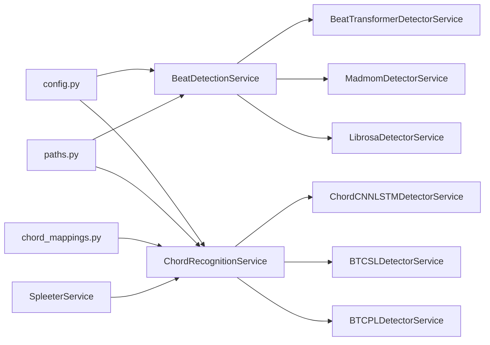

**Diagram sources**
- [config.py:62-70](file://python_backend/config.py#L62-L70)
- [beat_detection_service.py:25-31](file://python_backend/services/audio/beat_detection_service.py#L25-L31)
- [chord_recognition_service.py:30-36](file://python_backend/services/audio/chord_recognition_service.py#L30-L36)
- [paths.py:45-62](file://python_backend/utils/paths.py#L45-L62)
- [chord_mappings.py:112-151](file://python_backend/utils/chord_mappings.py#L112-L151)
- [spleeter_service.py:27-47](file://python_backend/services/audio/spleeter_service.py#L27-L47)

**Section sources**
- [beat_detection_service.py:25-31](file://python_backend/services/audio/beat_detection_service.py#L25-L31)
- [chord_recognition_service.py:30-36](file://python_backend/services/audio/chord_recognition_service.py#L30-L36)
- [paths.py:45-62](file://python_backend/utils/paths.py#L45-L62)
- [config.py:62-70](file://python_backend/config.py#L62-L70)

## Performance Considerations
- File size limits:
  - BeatTransformer: up to 100 MB
  - Madmom: up to 200 MB
  - Librosa: up to 500 MB
  - Chord-CNN-LSTM: up to 100 MB
  - BTC-SL/BTC-PL: up to 50 MB
- Detector preference by file size:
  - Small (<50 MB): prefer Madmom; otherwise BTC models for higher accuracy.
  - Medium (<100 MB): prefer Madmom or BeatTransformer; otherwise BTC models.
  - Large: prefer Madmom or Librosa; otherwise Chord-CNN-LSTM.
- Processing characteristics:
  - Madmom: neural network, good speed and accuracy for common meters.
  - BeatTransformer: DL model with audio separation, flexible time signatures, slower.
  - Librosa: classical signal processing, fast but less accurate.
  - Chord-CNN-LSTM: traditional CNN-LSTM, moderate speed, supports multiple dictionaries.
  - BTC-SL/BTC-PL: transformer-based, high accuracy with large_voca, moderate speed.
- Optional Spleeter separation:
  - Improves chord recognition quality by isolating vocals; adds overhead.

[No sources needed since this section provides general guidance]

## Troubleshooting Guide
- Detector not available:
  - Check import errors in logs; verify environment packages (madmom, librosa, torch, spleeter).
  - Confirm model files exist at configured paths.
- File too large:
  - Orchestrator falls back to smaller-capacity detectors automatically; use force=false by default.
- Invalid or corrupted audio:
  - Validation fails early; ensure audio is accessible and decodable.
- Chord dictionary mismatch:
  - Service validates against model-supported dictionaries and falls back to defaults.
- Spleeter failures:
  - Logs error and continues without separation; cleans up temporary files when possible.
- Downbeat candidates:
  - Madmom exposes heuristic candidates; frontend selects time signature and caches the choice.

**Section sources**
- [beat_detection_service.py:178-311](file://python_backend/services/audio/beat_detection_service.py#L178-L311)
- [chord_recognition_service.py:191-296](file://python_backend/services/audio/chord_recognition_service.py#L191-L296)
- [madmom_detector.py:33-44](file://python_backend/services/detectors/madmom_detector.py#L33-L44)
- [librosa_detector.py:33-41](file://python_backend/services/detectors/librosa_detector.py#L33-L41)
- [spleeter_service.py:160-178](file://python_backend/services/audio/spleeter_service.py#L160-L178)

## Conclusion
The detector services provide a robust, configurable, and resilient pipeline for beat and chord analysis. They combine modern deep learning models with classical signal processing, incorporate fallback strategies, and offer optional audio separation to improve accuracy. The orchestrators enforce sensible constraints, normalize outputs, and expose rich metadata for downstream consumers.