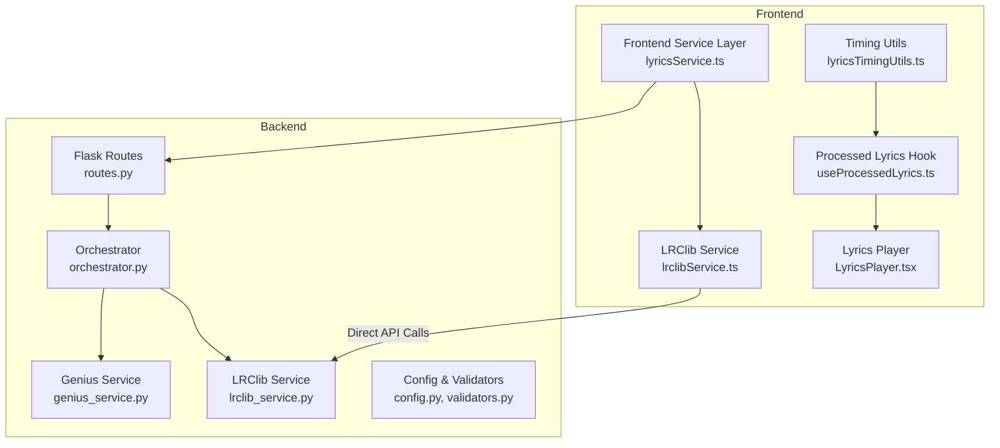
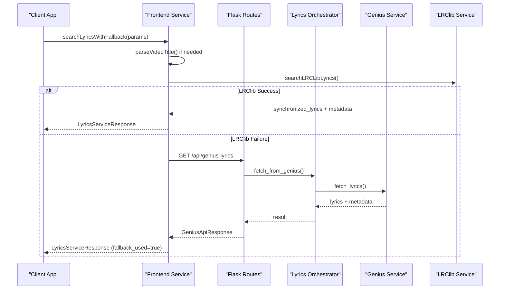
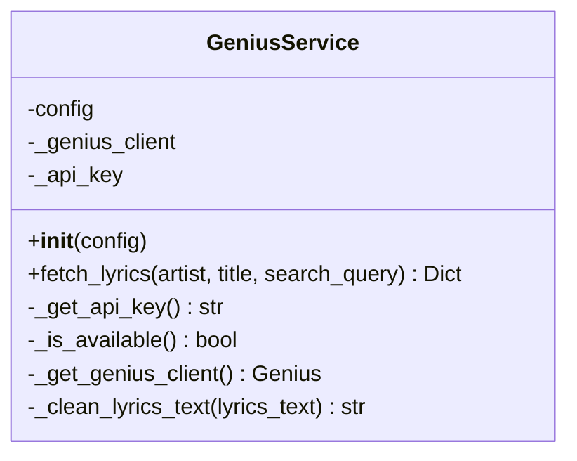
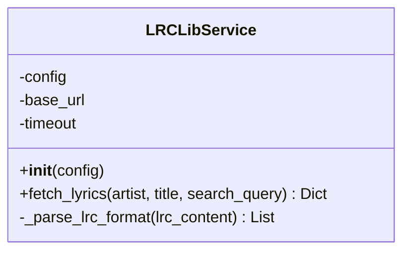
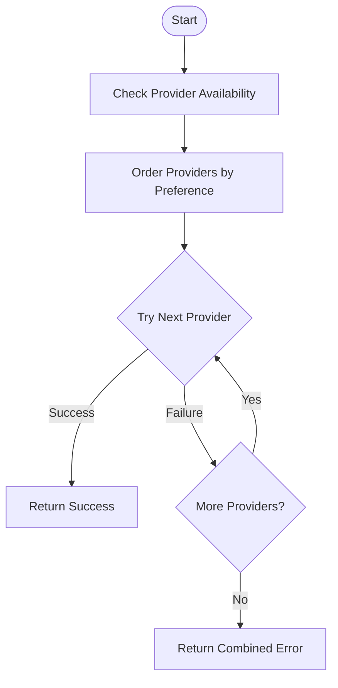
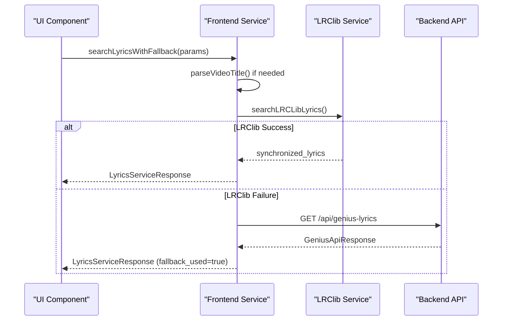
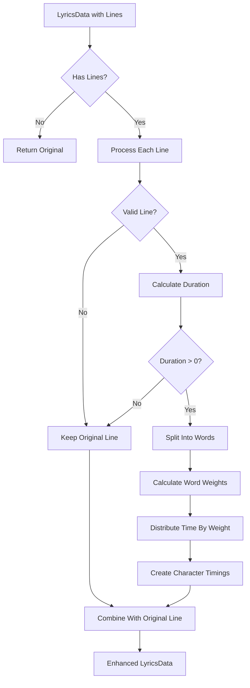
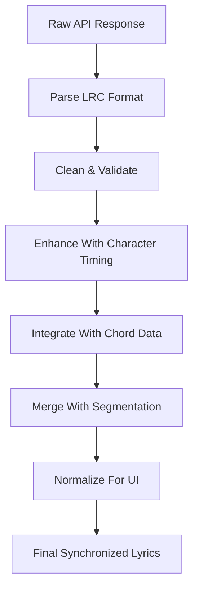
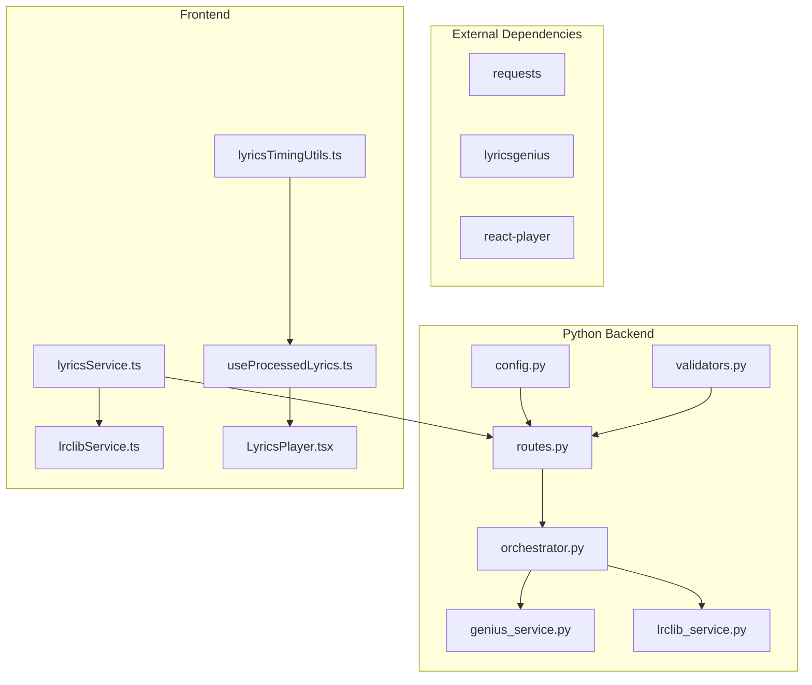

# Lyrics Synchronization Services

<cite>
**Referenced Files in This Document**
- [genius_service.py](file://python_backend/services/lyrics/genius_service.py)
- [lrclib_service.py](file://python_backend/services/lyrics/lrclib_service.py)
- [orchestrator.py](file://python_backend/services/lyrics/orchestrator.py)
- [routes.py](file://python_backend/blueprints/lyrics/routes.py)
- [validators.py](file://python_backend/blueprints/lyrics/validators.py)
- [config.py](file://python_backend/config.py)
- [lyricsService.ts](file://src/services/lyrics/lyricsService.ts)
- [lrclibService.ts](file://src/services/lyrics/lrclibService.ts)
- [useProcessedLyrics.ts](file://src/hooks/lyrics/useProcessedLyrics.ts)
- [lyricsTimingUtils.ts](file://src/utils/lyricsTimingUtils.ts)
- [LyricsPlayer.tsx](file://src/components/lyrics/LyricsPlayer.tsx)
- [musicAiTypes.ts](file://src/types/musicAiTypes.ts)
</cite>

## Table of Contents
1. [Introduction](#introduction)
2. [Project Structure](#project-structure)
3. [Core Components](#core-components)
4. [Architecture Overview](#architecture-overview)
5. [Detailed Component Analysis](#detailed-component-analysis)
6. [Dependency Analysis](#dependency-analysis)
7. [Performance Considerations](#performance-considerations)
8. [Troubleshooting Guide](#troubleshooting-guide)
9. [Conclusion](#conclusion)

## Introduction
This document provides comprehensive documentation for the lyrics synchronization services that power the ChordMiniApp. It covers the backend services for accessing Genius and LRClib APIs, the orchestration layer that coordinates multiple sources, and the frontend integration that transforms raw API responses into synchronized timeline data. The documentation explains service integration patterns, data transformation processes, quality assessment criteria, lyrics matching algorithms, timing synchronization methods, fallback strategies, configuration for API keys and rate limiting, and the complete lyrics processing pipeline from raw API responses to synchronized timeline data.

## Project Structure
The lyrics synchronization system spans both the Python backend and the Next.js frontend:

- Backend services:
  - Genius API service for comprehensive lyrics with metadata
  - LRClib API service for synchronized lyrics
  - Orchestrator coordinating multiple providers with fallback strategies
  - Flask routes exposing endpoints for lyrics retrieval
  - Request validators and configuration management

- Frontend services:
  - LRClib service for direct API calls and parsing
  - Enhanced lyrics service with fallback between LRClib and Genius
  - Processing utilities for character-level timing enhancement
  - Hooks for integrating lyrics with chord and segmentation data
  - Player component for synchronized playback

**Diagram sources**
- [lyricsService.ts:1-197](file://src/services/lyrics/lyricsService.ts#L1-L197)
- [lrclibService.ts:1-266](file://src/services/lyrics/lrclibService.ts#L1-L266)
- [routes.py:1-126](file://python_backend/blueprints/lyrics/routes.py#L1-L126)
- [orchestrator.py:1-184](file://python_backend/services/lyrics/orchestrator.py#L1-L184)
- [genius_service.py:1-215](file://python_backend/services/lyrics/genius_service.py#L1-L215)
- [lrclib_service.py:1-172](file://python_backend/services/lyrics/lrclib_service.py#L1-L172)
- [lyricsTimingUtils.ts:1-213](file://src/utils/lyricsTimingUtils.ts#L1-L213)
- [useProcessedLyrics.ts:1-484](file://src/hooks/lyrics/useProcessedLyrics.ts#L1-L484)
- [LyricsPlayer.tsx:1-203](file://src/components/lyrics/LyricsPlayer.tsx#L1-L203)

**Section sources**
- [lyricsService.ts:1-197](file://src/services/lyrics/lyricsService.ts#L1-L197)
- [lrclibService.ts:1-266](file://src/services/lyrics/lrclibService.ts#L1-L266)
- [routes.py:1-126](file://python_backend/blueprints/lyrics/routes.py#L1-L126)
- [orchestrator.py:1-184](file://python_backend/services/lyrics/orchestrator.py#L1-L184)
- [genius_service.py:1-215](file://python_backend/services/lyrics/genius_service.py#L1-L215)
- [lrclib_service.py:1-172](file://python_backend/services/lyrics/lrclib_service.py#L1-L172)
- [lyricsTimingUtils.ts:1-213](file://src/utils/lyricsTimingUtils.ts#L1-L213)
- [useProcessedLyrics.ts:1-484](file://src/hooks/lyrics/useProcessedLyrics.ts#L1-L484)
- [LyricsPlayer.tsx:1-203](file://src/components/lyrics/LyricsPlayer.tsx#L1-L203)

## Core Components
This section documents the core services that handle lyrics retrieval and timing alignment:

- Genius Service: Provides comprehensive lyrics with metadata from Genius.com using the lyricsgenius library. It supports custom search queries, artist/title combinations, and cleans up lyrics text by removing artifacts and contributor information.
- LRClib Service: Fetches synchronized lyrics from lrclib.net API, parses LRC format timestamps, and returns structured timeline data with timing information.
- Orchestrator: Coordinates between Genius and LRClib services, implements fallback strategies, and provides unified provider information and availability status.
- Frontend Lyrics Service: Implements intelligent fallback between LRClib and Genius, handles service availability checks, and normalizes responses for the UI.
- Timing Enhancement Utilities: Adds character-level timing to synchronized lyrics based on natural speech patterns and word boundaries.

**Section sources**
- [genius_service.py:14-215](file://python_backend/services/lyrics/genius_service.py#L14-L215)
- [lrclib_service.py:14-172](file://python_backend/services/lyrics/lrclib_service.py#L14-L172)
- [orchestrator.py:14-184](file://python_backend/services/lyrics/orchestrator.py#L14-L184)
- [lyricsService.ts:1-197](file://src/services/lyrics/lyricsService.ts#L1-L197)
- [lyricsTimingUtils.ts:1-213](file://src/utils/lyricsTimingUtils.ts#L1-L213)

## Architecture Overview
The lyrics synchronization architecture follows a layered approach with clear separation of concerns:

**Diagram sources**
- [lyricsService.ts:72-172](file://src/services/lyrics/lyricsService.ts#L72-L172)
- [lrclibService.ts:32-145](file://src/services/lyrics/lrclibService.ts#L32-L145)
- [routes.py:22-72](file://python_backend/blueprints/lyrics/routes.py#L22-L72)
- [orchestrator.py:33-62](file://python_backend/services/lyrics/orchestrator.py#L33-L62)
- [genius_service.py:135-215](file://python_backend/services/lyrics/genius_service.py#L135-L215)

The architecture ensures:
- Frontend-first approach with LRClib preference for synchronized lyrics
- Seamless fallback to Genius when LRClib fails
- Unified response normalization across providers
- Robust error handling and logging throughout the pipeline

## Detailed Component Analysis

### Genius Service
The Genius Service provides comprehensive lyrics retrieval with rich metadata:

**Diagram sources**
- [genius_service.py:14-215](file://python_backend/services/lyrics/genius_service.py#L14-L215)

Key features:
- API key management via custom headers or environment variables
- Client configuration with verbose control and section header removal
- Lyrics cleaning that removes artifacts and contributor information
- Comprehensive metadata extraction (album, release date, URLs)

Quality assessment criteria:
- Validates API key format and presence
- Filters out non-song results and excluded terms
- Removes common artifacts from raw Genius responses

**Section sources**
- [genius_service.py:17-88](file://python_backend/services/lyrics/genius_service.py#L17-L88)
- [genius_service.py:90-134](file://python_backend/services/lyrics/genius_service.py#L90-L134)
- [genius_service.py:135-215](file://python_backend/services/lyrics/genius_service.py#L135-L215)

### LRClib Service
The LRClib Service specializes in synchronized lyrics with precise timing:

**Diagram sources**
- [lrclib_service.py:14-172](file://python_backend/services/lyrics/lrclib_service.py#L14-L172)

Key features:
- Direct API integration with lrclib.net
- LRC format parsing with millisecond precision
- Instrumental detection and duration metadata
- Timeout handling for reliable API communication

**Section sources**
- [lrclib_service.py:17-27](file://python_backend/services/lyrics/lrclib_service.py#L17-L27)
- [lrclib_service.py:28-74](file://python_backend/services/lyrics/lrclib_service.py#L28-L74)
- [lrclib_service.py:76-172](file://python_backend/services/lyrics/lrclib_service.py#L76-L172)

### Orchestrator Service
The Orchestrator coordinates multiple providers with sophisticated fallback logic:

**Diagram sources**
- [orchestrator.py:95-147](file://python_backend/services/lyrics/orchestrator.py#L95-L147)

Implementation highlights:
- Dynamic provider ordering based on preferences
- Structured error collection and reporting
- Provider-specific result normalization
- Availability detection for Genius service

**Section sources**
- [orchestrator.py:22-32](file://python_backend/services/lyrics/orchestrator.py#L22-L32)
- [orchestrator.py:95-147](file://python_backend/services/lyrics/orchestrator.py#L95-L147)
- [orchestrator.py:149-184](file://python_backend/services/lyrics/orchestrator.py#L149-L184)

### Frontend Lyrics Service
The frontend service implements intelligent fallback and service health monitoring:

**Diagram sources**
- [lyricsService.ts:72-172](file://src/services/lyrics/lyricsService.ts#L72-L172)
- [lrclibService.ts:32-145](file://src/services/lyrics/lrclibService.ts#L32-L145)

Key capabilities:
- Automatic video title parsing for search queries
- Service availability checking with timeouts
- Graceful error handling and user-friendly messaging
- Response normalization across different provider formats

**Section sources**
- [lyricsService.ts:51-67](file://src/services/lyrics/lyricsService.ts#L51-L67)
- [lyricsService.ts:72-172](file://src/services/lyrics/lyricsService.ts#L72-L172)
- [lrclibService.ts:32-145](file://src/services/lyrics/lrclibService.ts#L32-L145)

### Timing Enhancement Utilities
The timing enhancement system adds character-level precision to synchronized lyrics:

**Diagram sources**
- [lyricsTimingUtils.ts:36-72](file://src/utils/lyricsTimingUtils.ts#L36-L72)
- [lyricsTimingUtils.ts:78-145](file://src/utils/lyricsTimingUtils.ts#L78-L145)

Advanced timing features:
- Natural speech pattern modeling with syllable estimation
- Vowel-heavy timing adjustment for realistic pronunciation
- Word boundary awareness for smooth transitions
- Space character handling with minimal timing allocation

**Section sources**
- [lyricsTimingUtils.ts:36-72](file://src/utils/lyricsTimingUtils.ts#L36-L72)
- [lyricsTimingUtils.ts:78-145](file://src/utils/lyricsTimingUtils.ts#L78-L145)
- [lyricsTimingUtils.ts:175-213](file://src/utils/lyricsTimingUtils.ts#L175-L213)

### Lyrics Processing Pipeline
The complete pipeline transforms raw API responses into synchronized timeline data:

**Diagram sources**
- [lrclib_service.py:28-74](file://python_backend/services/lyrics/lrclib_service.py#L28-L74)
- [lyricsTimingUtils.ts:36-72](file://src/utils/lyricsTimingUtils.ts#L36-L72)
- [useProcessedLyrics.ts:289-480](file://src/hooks/lyrics/useProcessedLyrics.ts#L289-L480)

Integration points:
- Chord alignment using beat timing
- Instrumental section detection and placeholder creation
- Downbeat-only chord filtering for cleaner presentation
- Cross-line chord deduplication to prevent visual clutter

**Section sources**
- [useProcessedLyrics.ts:289-480](file://src/hooks/lyrics/useProcessedLyrics.ts#L289-L480)
- [musicAiTypes.ts:27-61](file://src/types/musicAiTypes.ts#L27-L61)

## Dependency Analysis
The lyrics synchronization system exhibits strong modularity with clear dependency relationships:

**Diagram sources**
- [config.py:1-215](file://python_backend/config.py#L1-L215)
- [validators.py:1-146](file://python_backend/blueprints/lyrics/validators.py#L1-L146)
- [routes.py:1-126](file://python_backend/blueprints/lyrics/routes.py#L1-L126)
- [orchestrator.py:1-184](file://python_backend/services/lyrics/orchestrator.py#L1-L184)
- [genius_service.py:1-215](file://python_backend/services/lyrics/genius_service.py#L1-L215)
- [lrclib_service.py:1-172](file://python_backend/services/lyrics/lrclib_service.py#L1-L172)
- [lyricsService.ts:1-197](file://src/services/lyrics/lyricsService.ts#L1-L197)
- [lrclibService.ts:1-266](file://src/services/lyrics/lrclibService.ts#L1-L266)
- [lyricsTimingUtils.ts:1-213](file://src/utils/lyricsTimingUtils.ts#L1-L213)
- [useProcessedLyrics.ts:1-484](file://src/hooks/lyrics/useProcessedLyrics.ts#L1-L484)
- [LyricsPlayer.tsx:1-203](file://src/components/lyrics/LyricsPlayer.tsx#L1-L203)

Key dependency characteristics:
- Loose coupling between frontend and backend services
- Clear separation of concerns with specialized services
- Minimal circular dependencies
- External library dependencies isolated in specific modules

**Section sources**
- [config.py:1-215](file://python_backend/config.py#L1-L215)
- [routes.py:1-126](file://python_backend/blueprints/lyrics/routes.py#L1-L126)
- [orchestrator.py:1-184](file://python_backend/services/lyrics/orchestrator.py#L1-L184)

## Performance Considerations
The lyrics synchronization system implements several performance optimizations:

- **Rate Limiting**: Flask endpoints use configurable rate limits (10 per minute for moderate processing) to prevent abuse and ensure fair resource distribution.
- **Timeout Management**: LRClib service uses 10-second timeouts for API requests, while Genius service uses configurable timeouts (30 seconds default).
- **Service Health Checks**: Frontend implements availability checks with 5-second timeouts to quickly determine service readiness.
- **Memory Efficiency**: Frontend uses React hooks with useMemo for expensive computations and efficient state management.
- **Network Optimization**: LRClib service implements multiple search strategies (specific, swapped, general) to minimize failed requests.

Best practices:
- Monitor service health endpoints regularly
- Implement proper error handling and retry logic
- Cache frequently accessed lyrics data when appropriate
- Use provider-specific optimizations (LRClib for synchronized, Genius for metadata)

## Troubleshooting Guide
Common issues and their solutions:

**API Key Issues (Genius)**
- Verify GENIUS_API_KEY environment variable is set
- Check API key format and validity
- Ensure lyricsgenius library is installed
- Validate custom X-Genius-API-Key header format

**Network Connectivity Problems**
- Check LRClib API availability at lrclib.net
- Verify network connectivity to external APIs
- Review timeout configurations
- Monitor rate limit violations

**Parsing and Data Quality Issues**
- Validate LRC format compliance
- Check for malformed timestamps
- Ensure proper encoding handling
- Verify metadata completeness

**Frontend Integration Issues**
- Confirm CORS configuration allows frontend origin
- Check service availability endpoints
- Validate response format consistency
- Monitor error logging and debugging output

**Section sources**
- [genius_service.py:28-42](file://python_backend/services/lyrics/genius_service.py#L28-L42)
- [lrclib_service.py:25-26](file://python_backend/services/lyrics/lrclib_service.py#L25-L26)
- [lyricsService.ts:177-196](file://src/services/lyrics/lyricsService.ts#L177-L196)
- [config.py:48-60](file://python_backend/config.py#L48-L60)

## Conclusion
The ChordMiniApp lyrics synchronization services provide a robust, scalable solution for retrieving and synchronizing lyrics across multiple providers. The system's layered architecture ensures maintainability, while the intelligent fallback mechanisms guarantee reliable lyrics delivery. The combination of LRClib's synchronized timing and Genius's comprehensive metadata creates a comprehensive lyrics experience. The frontend integration with timing enhancement utilities delivers precise synchronization that enhances the overall user experience. The modular design, comprehensive error handling, and performance optimizations make this system suitable for production deployment with proper configuration and monitoring.