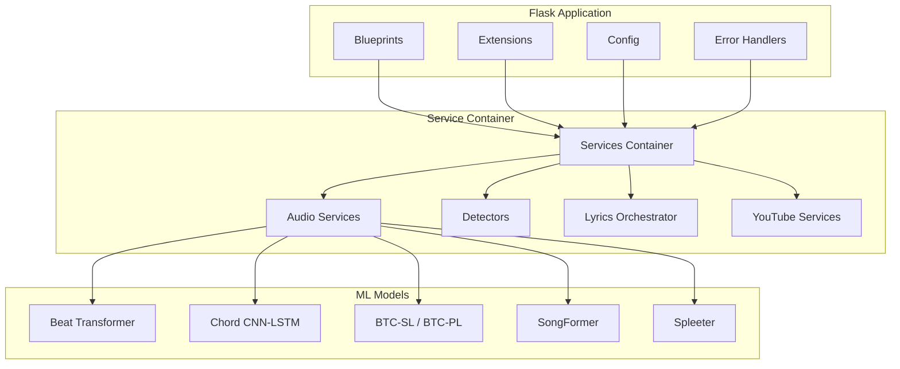
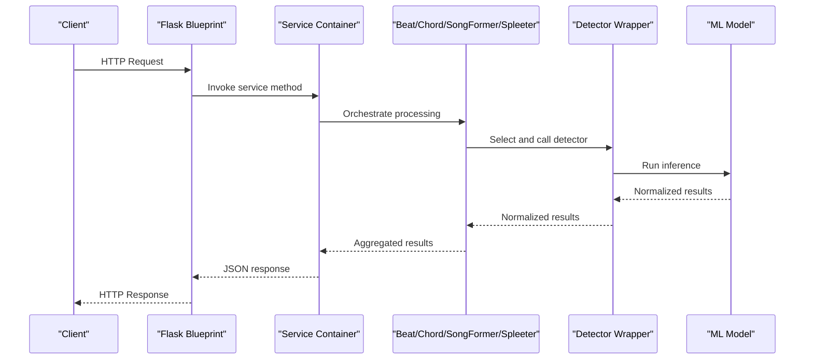
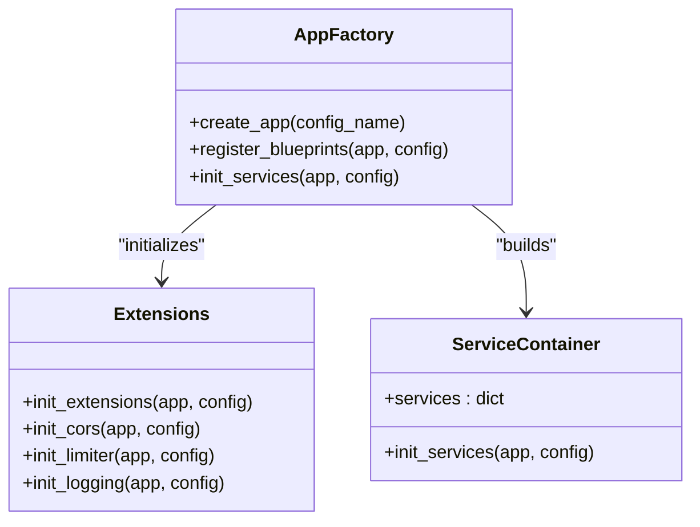
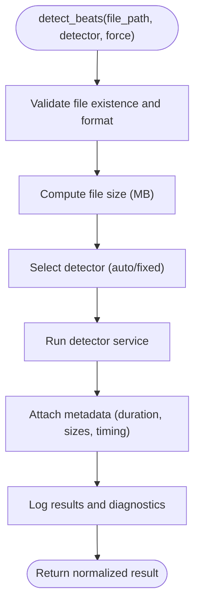
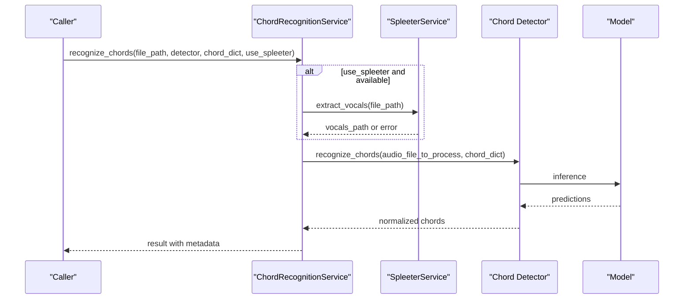
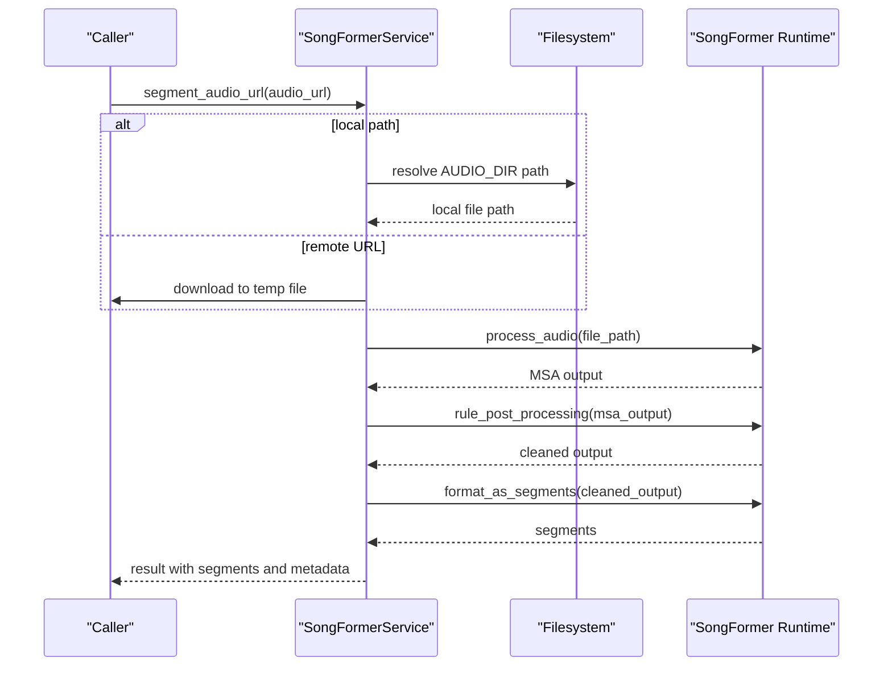
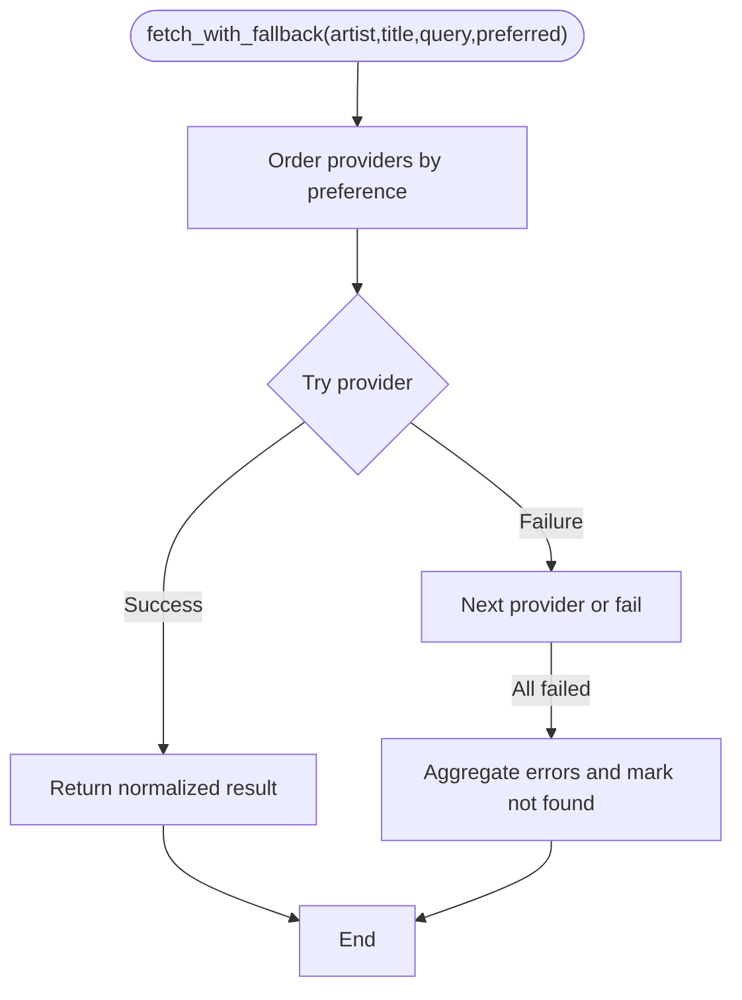
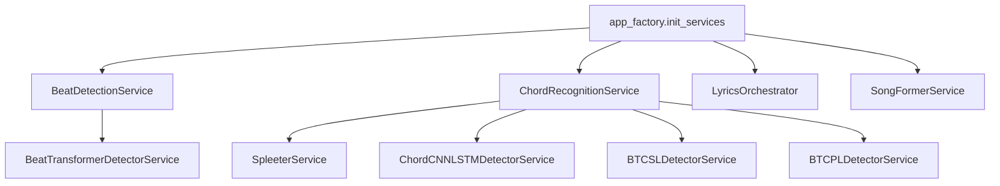

# Service Layer Architecture

<cite>
**Referenced Files in This Document**
- [app_factory.py](file://python_backend/app_factory.py)
- [extensions.py](file://python_backend/extensions.py)
- [config.py](file://python_backend/config.py)
- [error_handlers.py](file://python_backend/error_handlers.py)
- [logging.py](file://python_backend/utils/logging.py)
- [paths.py](file://python_backend/utils/paths.py)
- [chord_mappings.py](file://python_backend/utils/chord_mappings.py)
- [beat_detection_service.py](file://python_backend/services/audio/beat_detection_service.py)
- [chord_recognition_service.py](file://python_backend/services/audio/chord_recognition_service.py)
- [songformer_service.py](file://python_backend/services/audio/songformer_service.py)
- [spleeter_service.py](file://python_backend/services/audio/spleeter_service.py)
- [audio_utils.py](file://python_backend/services/audio/audio_utils.py)
- [beat_transformer_detector.py](file://python_backend/services/detectors/beat_transformer_detector.py)
- [orchestrator.py](file://python_backend/services/lyrics/orchestrator.py)
</cite>

## Table of Contents
1. [Introduction](#introduction)
2. [Project Structure](#project-structure)
3. [Core Components](#core-components)
4. [Architecture Overview](#architecture-overview)
5. [Detailed Component Analysis](#detailed-component-analysis)
6. [Dependency Analysis](#dependency-analysis)
7. [Performance Considerations](#performance-considerations)
8. [Troubleshooting Guide](#troubleshooting-guide)
9. [Conclusion](#conclusion)

## Introduction
This document describes the service layer architecture that sits between Flask blueprints and machine learning models. It explains how services abstract ML model access, organize business logic, and transform data. It covers audio processing services, detection algorithm services, lyrics synchronization services, and YouTube integration services. It also documents dependency injection, error propagation, performance optimization, lifecycle management, caching strategies, and coordination of complex workflows. The separation of concerns ensures raw ML model access remains encapsulated behind robust service abstractions that handle external API integrations and data persistence.

## Project Structure
The service layer is organized under python_backend/services with clear boundaries:
- Audio services: orchestrate beat detection, chord recognition, SongFormer, Spleeter, and audio utilities.
- Detectors: thin wrappers around ML detectors with normalized interfaces.
- Lyrics services: lyrics orchestration coordinating multiple providers.
- YouTube services: integration points for YouTube metadata and audio extraction.

**Diagram sources**
- [app_factory.py:103-162](file://python_backend/app_factory.py#L103-L162)
- [extensions.py:81-93](file://python_backend/extensions.py#L81-L93)
- [config.py:16-215](file://python_backend/config.py#L16-L215)
- [error_handlers.py:13-161](file://python_backend/error_handlers.py#L13-L161)

**Section sources**
- [app_factory.py:27-66](file://python_backend/app_factory.py#L27-L66)
- [extensions.py:81-93](file://python_backend/extensions.py#L81-L93)
- [config.py:16-215](file://python_backend/config.py#L16-L215)

## Core Components
- Service container initialization: creates and registers services with dependency injection via app.extensions.
- Audio services: BeatDetectionService, ChordRecognitionService, SongFormerService, SpleeterService, and audio utilities.
- Detector services: BeatTransformerDetectorService, ChordCNNLSTMDetectorService, BTCSLDetectorService, BTCPLDetectorService, Librosa/Madmom detectors (referenced).
- Lyrics orchestrator: LyricsOrchestrator coordinates Genius and LRClib providers with fallback strategies.
- Configuration and error handling: centralized configuration, CORS/rate limiting, logging, and error handlers.

**Section sources**
- [app_factory.py:103-162](file://python_backend/app_factory.py#L103-L162)
- [beat_detection_service.py:20-348](file://python_backend/services/audio/beat_detection_service.py#L20-L348)
- [chord_recognition_service.py:25-322](file://python_backend/services/audio/chord_recognition_service.py#L25-L322)
- [songformer_service.py:21-140](file://python_backend/services/audio/songformer_service.py#L21-L140)
- [spleeter_service.py:17-286](file://python_backend/services/audio/spleeter_service.py#L17-L286)
- [orchestrator.py:14-184](file://python_backend/services/lyrics/orchestrator.py#L14-L184)

## Architecture Overview
The service layer follows a layered architecture:
- Blueprints define endpoints and route requests.
- Services encapsulate business logic and model orchestration.
- Detectors provide normalized interfaces to ML models.
- Utilities handle data transformation and validation.
- Extensions manage CORS, rate limiting, and logging.
- Configuration governs feature toggles, timeouts, and limits.
- Error handlers standardize responses and propagate errors.

**Diagram sources**
- [app_factory.py:103-162](file://python_backend/app_factory.py#L103-L162)
- [beat_detection_service.py:163-311](file://python_backend/services/audio/beat_detection_service.py#L163-L311)
- [chord_recognition_service.py:173-296](file://python_backend/services/audio/chord_recognition_service.py#L173-L296)
- [beat_transformer_detector.py:73-147](file://python_backend/services/detectors/beat_transformer_detector.py#L73-L147)

## Detailed Component Analysis

### Service Container and Dependency Injection
- The application factory initializes extensions (CORS, rate limiter, logging), registers blueprints, and builds a simple service container stored in app.extensions.
- Services are instantiated with lazy initialization and guarded by availability checks; failures log errors and set placeholders.

**Diagram sources**
- [app_factory.py:27-66](file://python_backend/app_factory.py#L27-L66)
- [extensions.py:81-93](file://python_backend/extensions.py#L81-L93)
- [app_factory.py:103-162](file://python_backend/app_factory.py#L103-L162)

**Section sources**
- [app_factory.py:103-162](file://python_backend/app_factory.py#L103-L162)
- [extensions.py:17-93](file://python_backend/extensions.py#L17-L93)

### Audio Processing Services

#### Beat Detection Service
- Orchestrates detector selection based on availability and file size limits.
- Provides auto-selection logic preferring madmom for small files, Beat Transformer for medium, and madmom/librosa for large.
- Validates audio files, computes durations, and logs beat-per-measure distributions.

**Diagram sources**
- [beat_detection_service.py:163-311](file://python_backend/services/audio/beat_detection_service.py#L163-L311)

**Section sources**
- [beat_detection_service.py:20-348](file://python_backend/services/audio/beat_detection_service.py#L20-L348)

#### Chord Recognition Service
- Manages detector selection among Chord-CNN-LSTM, BTC-SL, and BTC-PL with size-aware routing.
- Supports optional Spleeter vocal separation to improve recognition quality.
- Normalizes results and attaches metadata including processing time and chord dictionary used.

**Diagram sources**
- [chord_recognition_service.py:173-296](file://python_backend/services/audio/chord_recognition_service.py#L173-L296)
- [spleeter_service.py:180-198](file://python_backend/services/audio/spleeter_service.py#L180-L198)

**Section sources**
- [chord_recognition_service.py:25-322](file://python_backend/services/audio/chord_recognition_service.py#L25-L322)
- [spleeter_service.py:17-286](file://python_backend/services/audio/spleeter_service.py#L17-L286)

#### SongFormer Service
- Dynamically loads the SongFormer runtime from a configurable root path.
- Initializes models once and reuses them across requests.
- Downloads remote audio or processes local files, then segments and formats results.

**Diagram sources**
- [songformer_service.py:118-140](file://python_backend/services/audio/songformer_service.py#L118-L140)

**Section sources**
- [songformer_service.py:21-140](file://python_backend/services/audio/songformer_service.py#L21-L140)

#### Audio Utilities
- Provides silence trimming, duration calculation, resampling, and validation helpers used by services.

**Section sources**
- [audio_utils.py:12-131](file://python_backend/services/audio/audio_utils.py#L12-L131)

### Detector Services
- BeatTransformerDetectorService: wraps Beat Transformer with normalized interface and device info retrieval.
- Other detectors (ChordCNNLSTMDetectorService, BTCSLDetectorService, BTCPLDetectorService, LibrosaDetectorService, MadmomDetectorService) are referenced and integrated by higher-level services.

**Section sources**
- [beat_transformer_detector.py:15-163](file://python_backend/services/detectors/beat_transformer_detector.py#L15-L163)

### Lyrics Synchronization Services
- LyricsOrchestrator coordinates Genius and LRClib providers with fallback strategies and normalized responses.
- Provides provider availability and feature sets, and tracks whether lyrics were found.

**Diagram sources**
- [orchestrator.py:95-147](file://python_backend/services/lyrics/orchestrator.py#L95-L147)

**Section sources**
- [orchestrator.py:14-184](file://python_backend/services/lyrics/orchestrator.py#L14-L184)

### YouTube Integration Services
- YouTube services are defined under python_backend/services/youtube and integrate with external APIs for metadata and audio extraction. They are orchestrated by blueprints and leverage the service container for dependency injection.

**Section sources**
- [app_factory.py:103-162](file://python_backend/app_factory.py#L103-L162)

## Dependency Analysis
- Service container dependency injection: services are created once and stored in app.extensions['services'].
- Detector services depend on model availability and are lazily initialized.
- Audio services depend on audio utilities and optional Spleeter for separation.
- Configuration drives feature toggles, timeouts, and rate limits.
- Logging and error handling are centralized and applied consistently.

**Diagram sources**
- [app_factory.py:103-162](file://python_backend/app_factory.py#L103-L162)
- [beat_detection_service.py:25-31](file://python_backend/services/audio/beat_detection_service.py#L25-L31)
- [chord_recognition_service.py:30-46](file://python_backend/services/audio/chord_recognition_service.py#L30-L46)

**Section sources**
- [app_factory.py:103-162](file://python_backend/app_factory.py#L103-L162)
- [paths.py:45-62](file://python_backend/utils/paths.py#L45-L62)

## Performance Considerations
- Model initialization reuse: SongFormerService initializes models once and reuses them across requests.
- Detector selection: BeatDetectionService and ChordRecognitionService choose optimal detectors based on file size and availability to balance speed and accuracy.
- Audio preprocessing: Silence trimming and duration estimation reduce unnecessary processing.
- Concurrency and resource management: SpleeterService creates separators per request and cleans up temporary files to prevent memory leaks.
- Logging overhead: Debug logging is environment-controlled to minimize impact in production.

[No sources needed since this section provides general guidance]

## Troubleshooting Guide
- Error propagation: Centralized error handlers return standardized JSON responses and log stack traces for debugging.
- Custom exceptions: ChordMiniException family provides typed errors for models, file sizes, audio processing, and external services.
- Availability checks: Services guard model imports and device availability; failures are logged and surfaced to callers.
- Logging: Unified logging utilities adapt to production vs development modes.

**Section sources**
- [error_handlers.py:13-161](file://python_backend/error_handlers.py#L13-L161)
- [logging.py:12-91](file://python_backend/utils/logging.py#L12-L91)

## Conclusion
The service layer cleanly separates raw ML model access from business logic and external integrations. It uses dependency injection, standardized detector interfaces, and robust error handling to maintain reliability and performance. Audio services orchestrate complex workflows including detector selection, preprocessing, and post-processing, while lyrics and YouTube services provide coordinated access to external APIs. Configuration and logging enable operational control across environments.