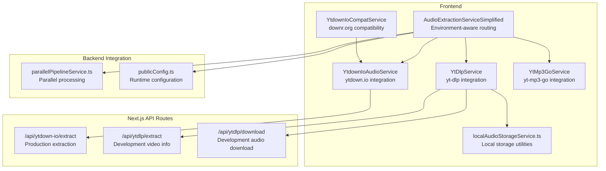
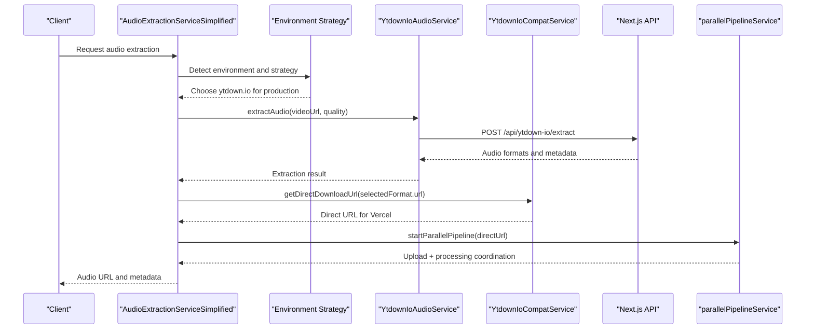
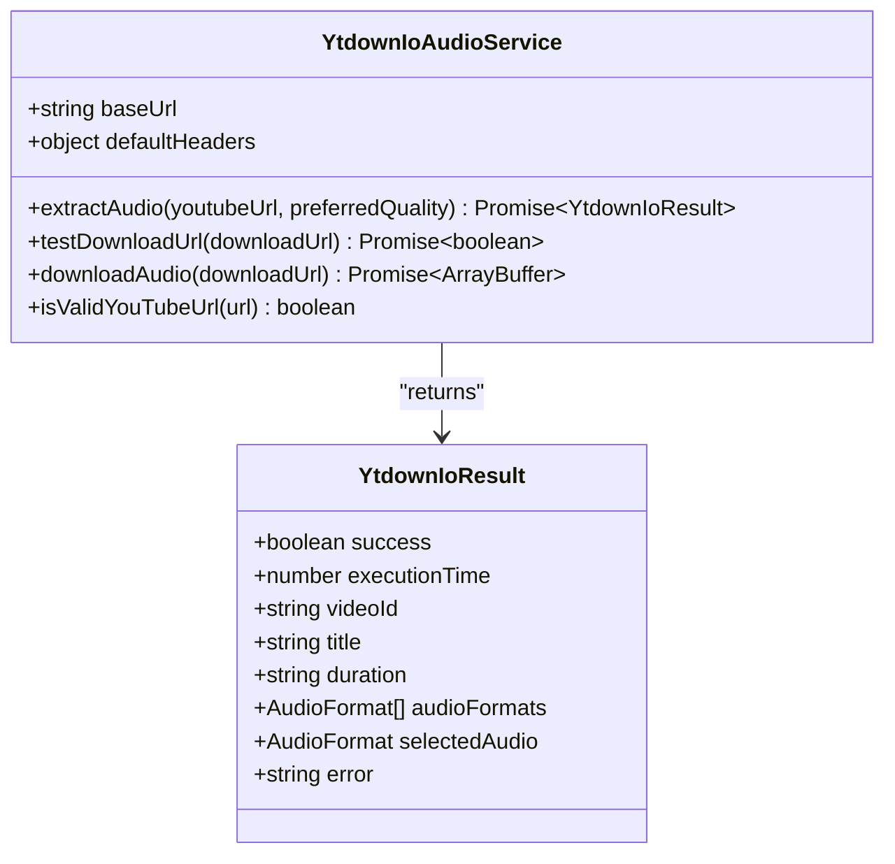
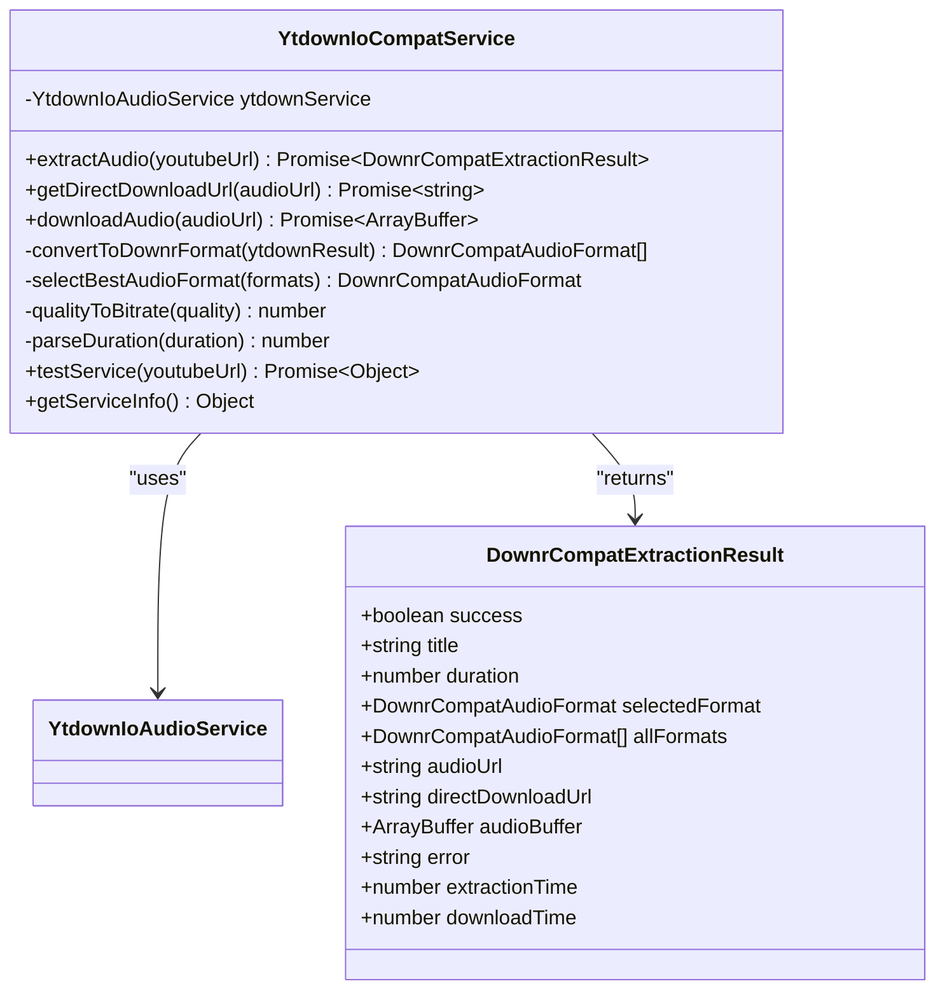
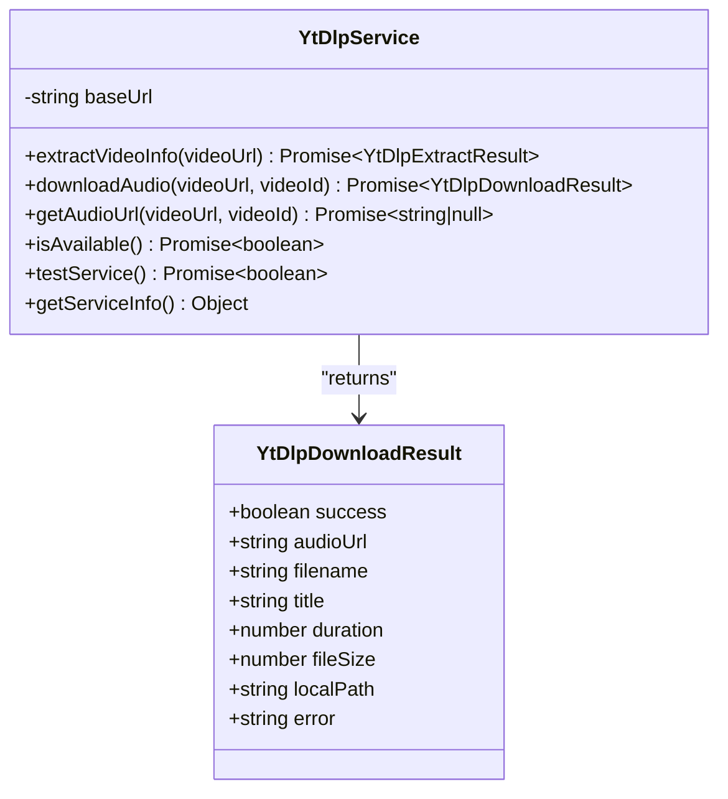
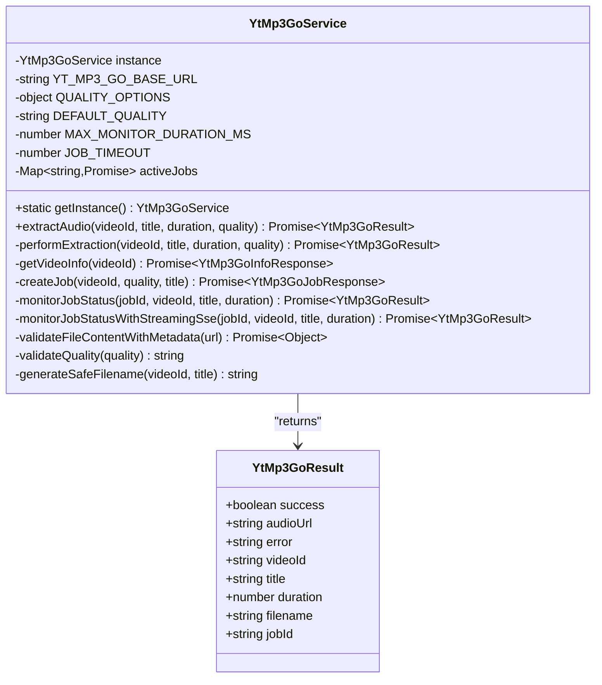
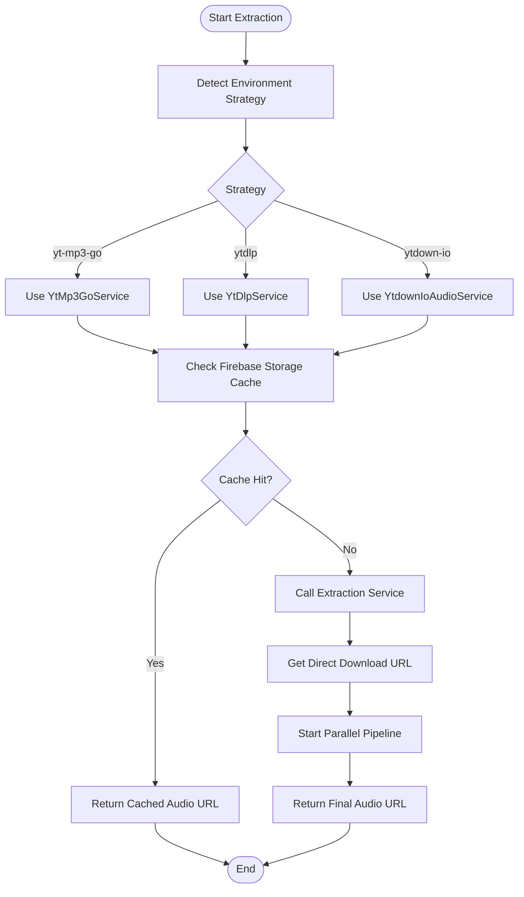
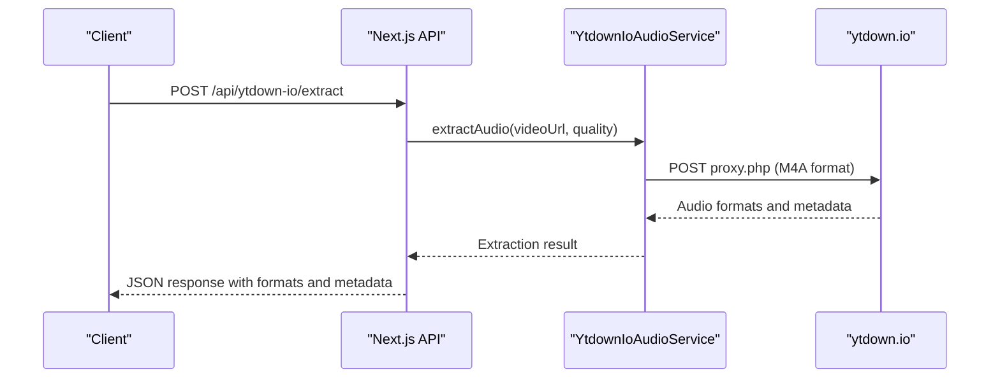
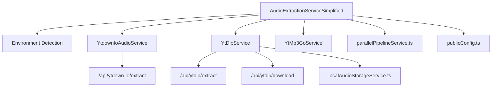

# YouTube Integration Services

<cite>
**Referenced Files in This Document**
- [python_backend/services/youtube/__init__.py](file://python_backend/services/youtube/__init__.py)
- [src/services/youtube/ytdownIoAudioService.ts](file://src/services/youtube/ytdownIoAudioService.ts)
- [src/services/youtube/ytdownIoCompatService.ts](file://src/services/youtube/ytdownIoCompatService.ts)
- [src/services/youtube/ytDlpService.ts](file://src/services/youtube/ytDlpService.ts)
- [src/services/youtube/ytMp3GoService.ts](file://src/services/youtube/ytMp3GoService.ts)
- [src/app/api/ytdown-io/extract/route.ts](file://src/app/api/ytdown-io/extract/route.ts)
- [src/app/api/ytdlp/extract/route.ts](file://src/app/api/ytdlp/extract/route.ts)
- [src/app/api/ytdlp/download/route.ts](file://src/app/api/ytdlp/download/route.ts)
- [src/services/audio/audioExtractionSimplified.ts](file://src/services/audio/audioExtractionSimplified.ts)
- [src/services/storage/localAudioStorageService.ts](file://src/services/storage/localAudioStorageService.ts)
- [src/config/publicConfig.ts](file://src/config/publicConfig.ts)
- [src/services/api/parallelPipelineService.ts](file://src/services/api/parallelPipelineService.ts)
- [src/app/api/search-youtube/route.ts](file://src/app/api/search-youtube/route.ts)
</cite>

## Table of Contents
1. [Introduction](#introduction)
2. [Project Structure](#project-structure)
3. [Core Components](#core-components)
4. [Architecture Overview](#architecture-overview)
5. [Detailed Component Analysis](#detailed-component-analysis)
6. [Dependency Analysis](#dependency-analysis)
7. [Performance Considerations](#performance-considerations)
8. [Troubleshooting Guide](#troubleshooting-guide)
9. [Conclusion](#conclusion)

## Introduction
This document describes the YouTube integration services that power video metadata extraction, audio downloading, and stream quality management in the ChordMini application. The system provides multiple extraction strategies optimized for different environments:
- Production-grade extraction via ytdown.io for reliable datacenter IP operation
- Development-time extraction via yt-dlp for local workflows
- Fallback extraction via yt-mp3-go for robustness
- Stream quality management with configurable preferences
- Integration with the broader audio processing pipeline and Firebase storage

The services coordinate with the frontend audio extraction orchestration and backend APIs to deliver a seamless user experience across environments.

## Project Structure
The YouTube integration spans frontend services, Next.js API routes, and backend components:
- Frontend services encapsulate extraction logic and environment-aware routing
- Next.js API routes expose endpoints for production extraction and development utilities
- Backend services manage storage, caching, and parallel processing

**Diagram sources**
- [src/services/audio/audioExtractionSimplified.ts:84-120](file://src/services/audio/audioExtractionSimplified.ts#L84-L120)
- [src/services/youtube/ytdownIoAudioService.ts:75-155](file://src/services/youtube/ytdownIoAudioService.ts#L75-L155)
- [src/services/youtube/ytdownIoCompatService.ts:46-120](file://src/services/youtube/ytdownIoCompatService.ts#L46-L120)
- [src/services/youtube/ytDlpService.ts:38-145](file://src/services/youtube/ytDlpService.ts#L38-L145)
- [src/services/youtube/ytMp3GoService.ts:51-143](file://src/services/youtube/ytMp3GoService.ts#L51-L143)
- [src/services/storage/localAudioStorageService.ts:1-200](file://src/services/storage/localAudioStorageService.ts#L1-L200)
- [src/app/api/ytdown-io/extract/route.ts:14-84](file://src/app/api/ytdown-io/extract/route.ts#L14-L84)
- [src/app/api/ytdlp/extract/route.ts:18-62](file://src/app/api/ytdlp/extract/route.ts#L18-L62)
- [src/app/api/ytdlp/download/route.ts:25-70](file://src/app/api/ytdlp/download/route.ts#L25-L70)
- [src/services/api/parallelPipelineService.ts:34-40](file://src/services/api/parallelPipelineService.ts#L34-L40)
- [src/config/publicConfig.ts:63-108](file://src/config/publicConfig.ts#L63-L108)

**Section sources**
- [src/services/audio/audioExtractionSimplified.ts:84-120](file://src/services/audio/audioExtractionSimplified.ts#L84-L120)
- [src/services/youtube/ytdownIoAudioService.ts:75-155](file://src/services/youtube/ytdownIoAudioService.ts#L75-L155)
- [src/services/youtube/ytdownIoCompatService.ts:46-120](file://src/services/youtube/ytdownIoCompatService.ts#L46-L120)
- [src/services/youtube/ytDlpService.ts:38-145](file://src/services/youtube/ytDlpService.ts#L38-L145)
- [src/services/youtube/ytMp3GoService.ts:51-143](file://src/services/youtube/ytMp3GoService.ts#L51-L143)
- [src/services/storage/localAudioStorageService.ts:1-200](file://src/services/storage/localAudioStorageService.ts#L1-L200)
- [src/app/api/ytdown-io/extract/route.ts:14-84](file://src/app/api/ytdown-io/extract/route.ts#L14-L84)
- [src/app/api/ytdlp/extract/route.ts:18-62](file://src/app/api/ytdlp/extract/route.ts#L18-L62)
- [src/app/api/ytdlp/download/route.ts:25-70](file://src/app/api/ytdlp/download/route.ts#L25-L70)
- [src/services/api/parallelPipelineService.ts:34-40](file://src/services/api/parallelPipelineService.ts#L34-L40)
- [src/config/publicConfig.ts:63-108](file://src/config/publicConfig.ts#L63-L108)

## Core Components
- YtdownIoAudioService: Production-grade audio extraction using ytdown.io with M4A format support and quality selection
- YtdownIoCompatService: Compatibility wrapper for downr.org API contracts, enabling direct URL optimization for Vercel
- YtDlpService: Development-time extraction using yt-dlp with filename compatibility and local storage
- YtMp3GoService: Robust fallback extraction with two-step process, quality selection, and SSE monitoring
- AudioExtractionServiceSimplified: Environment-aware orchestration selecting the optimal extraction strategy
- Next.js API routes: Expose endpoints for production extraction and development utilities
- Local storage utilities: Manage local audio files and metadata for development workflows
- Runtime configuration: Provide environment-specific settings for audio strategies and API keys

**Section sources**
- [src/services/youtube/ytdownIoAudioService.ts:75-155](file://src/services/youtube/ytdownIoAudioService.ts#L75-L155)
- [src/services/youtube/ytdownIoCompatService.ts:46-120](file://src/services/youtube/ytdownIoCompatService.ts#L46-L120)
- [src/services/youtube/ytDlpService.ts:38-145](file://src/services/youtube/ytDlpService.ts#L38-L145)
- [src/services/youtube/ytMp3GoService.ts:51-143](file://src/services/youtube/ytMp3GoService.ts#L51-L143)
- [src/services/audio/audioExtractionSimplified.ts:84-120](file://src/services/audio/audioExtractionSimplified.ts#L84-L120)
- [src/services/storage/localAudioStorageService.ts:1-200](file://src/services/storage/localAudioStorageService.ts#L1-L200)
- [src/config/publicConfig.ts:63-108](file://src/config/publicConfig.ts#L63-L108)

## Architecture Overview
The system implements an environment-aware extraction strategy:
- Production: Prefer ytdown.io for reliable datacenter operation and direct URL optimization
- Development: Use yt-dlp for local workflows and precise filename generation
- Fallback: Employ yt-mp3-go for robustness with quality selection and SSE monitoring
- Caching: Integrate with Firebase Storage and simplified Firestore cache for metadata persistence
- Parallel processing: Coordinate Google Cloud Run computation with Firebase uploads for optimal throughput

**Diagram sources**
- [src/services/audio/audioExtractionSimplified.ts:84-120](file://src/services/audio/audioExtractionSimplified.ts#L84-L120)
- [src/services/youtube/ytdownIoAudioService.ts:87-155](file://src/services/youtube/ytdownIoAudioService.ts#L87-L155)
- [src/services/youtube/ytdownIoCompatService.ts:126-161](file://src/services/youtube/ytdownIoCompatService.ts#L126-L161)
- [src/app/api/ytdown-io/extract/route.ts:14-84](file://src/app/api/ytdown-io/extract/route.ts#L14-L84)
- [src/services/api/parallelPipelineService.ts:34-40](file://src/services/api/parallelPipelineService.ts#L34-L40)

**Section sources**
- [src/services/audio/audioExtractionSimplified.ts:84-120](file://src/services/audio/audioExtractionSimplified.ts#L84-L120)
- [src/services/youtube/ytdownIoAudioService.ts:87-155](file://src/services/youtube/ytdownIoAudioService.ts#L87-L155)
- [src/services/youtube/ytdownIoCompatService.ts:126-161](file://src/services/youtube/ytdownIoCompatService.ts#L126-L161)
- [src/app/api/ytdown-io/extract/route.ts:14-84](file://src/app/api/ytdown-io/extract/route.ts#L14-L84)
- [src/services/api/parallelPipelineService.ts:34-40](file://src/services/api/parallelPipelineService.ts#L34-L40)

## Detailed Component Analysis

### YtdownIoAudioService
Provides production-grade audio extraction using ytdown.io:
- Accepts YouTube URLs and preferred quality (48K or 128K)
- Returns structured audio formats with quality, file size, and download URLs
- Validates YouTube URLs and handles extraction errors gracefully
- Includes URL accessibility testing and direct download URL retrieval

**Diagram sources**
- [src/services/youtube/ytdownIoAudioService.ts:75-155](file://src/services/youtube/ytdownIoAudioService.ts#L75-L155)

**Section sources**
- [src/services/youtube/ytdownIoAudioService.ts:75-155](file://src/services/youtube/ytdownIoAudioService.ts#L75-L155)

### YtdownIoCompatService
Enables compatibility with downr.org API contracts while leveraging ytdown.io backend:
- Converts ytdown.io responses to downr.org-compatible format
- Selects best audio format prioritizing M4A with configurable bitrate
- Retrieves direct download URLs optimized for Vercel serverless constraints
- Provides service testing and detailed error reporting

**Diagram sources**
- [src/services/youtube/ytdownIoCompatService.ts:46-120](file://src/services/youtube/ytdownIoCompatService.ts#L46-L120)

**Section sources**
- [src/services/youtube/ytdownIoCompatService.ts:46-120](file://src/services/youtube/ytdownIoCompatService.ts#L46-L120)

### YtDlpService
Supports development-time extraction using yt-dlp:
- Extracts video information and generates expected filenames
- Downloads audio with QuickTube-compatible naming for local workflows
- Validates service availability and provides testing utilities
- Integrates with local audio storage for caching and reuse

**Diagram sources**
- [src/services/youtube/ytDlpService.ts:38-145](file://src/services/youtube/ytDlpService.ts#L38-L145)

**Section sources**
- [src/services/youtube/ytDlpService.ts:38-145](file://src/services/youtube/ytDlpService.ts#L38-L145)

### YtMp3GoService
Provides robust fallback extraction with quality selection and SSE monitoring:
- Two-step process: info retrieval followed by download job creation
- Quality options: low, medium, high with default medium
- Long-lived SSE monitoring for job status updates
- File validation and metadata extraction for duration verification
- Safe filename generation supporting Unicode characters

**Diagram sources**
- [src/services/youtube/ytMp3GoService.ts:51-143](file://src/services/youtube/ytMp3GoService.ts#L51-L143)

**Section sources**
- [src/services/youtube/ytMp3GoService.ts:51-143](file://src/services/youtube/ytMp3GoService.ts#L51-L143)

### AudioExtractionServiceSimplified
Environment-aware orchestration coordinating extraction strategies:
- Detects environment and selects optimal extraction service
- Implements caching with Firebase Storage and simplified Firestore metadata
- Manages fallbacks between ytdown.io, yt-dlp, and yt-mp3-go
- Coordinates parallel processing with Google Cloud Run and Firebase uploads
- Handles force redownload scenarios and cache validation

**Diagram sources**
- [src/services/audio/audioExtractionSimplified.ts:84-120](file://src/services/audio/audioExtractionSimplified.ts#L84-L120)
- [src/services/audio/audioExtractionSimplified.ts:605-717](file://src/services/audio/audioExtractionSimplified.ts#L605-L717)

**Section sources**
- [src/services/audio/audioExtractionSimplified.ts:84-120](file://src/services/audio/audioExtractionSimplified.ts#L84-L120)
- [src/services/audio/audioExtractionSimplified.ts:605-717](file://src/services/audio/audioExtractionSimplified.ts#L605-L717)

### Next.js API Routes
Production endpoints for extraction and development utilities:
- /api/ytdown-io/extract: Production extraction using ytdown.io with quality selection and optional download URL testing
- /api/ytdlp/extract: Development-only video information extraction using yt-dlp
- /api/ytdlp/download: Development-only audio download with filename generation and local storage

**Diagram sources**
- [src/app/api/ytdown-io/extract/route.ts:14-84](file://src/app/api/ytdown-io/extract/route.ts#L14-L84)
- [src/services/youtube/ytdownIoAudioService.ts:87-155](file://src/services/youtube/ytdownIoAudioService.ts#L87-L155)

**Section sources**
- [src/app/api/ytdown-io/extract/route.ts:14-84](file://src/app/api/ytdown-io/extract/route.ts#L14-L84)
- [src/app/api/ytdlp/extract/route.ts:18-62](file://src/app/api/ytdlp/extract/route.ts#L18-L62)
- [src/app/api/ytdlp/download/route.ts:25-70](file://src/app/api/ytdlp/download/route.ts#L25-L70)

## Dependency Analysis
The system exhibits clear separation of concerns with explicit dependencies:
- AudioExtractionServiceSimplified depends on environment detection and multiple extraction services
- Frontend services depend on Next.js API routes for production extraction
- Local storage utilities support development-time workflows
- Runtime configuration provides environment-specific settings

**Diagram sources**
- [src/services/audio/audioExtractionSimplified.ts:84-120](file://src/services/audio/audioExtractionSimplified.ts#L84-L120)
- [src/services/youtube/ytdownIoAudioService.ts:75-155](file://src/services/youtube/ytdownIoAudioService.ts#L75-L155)
- [src/services/youtube/ytDlpService.ts:38-145](file://src/services/youtube/ytDlpService.ts#L38-L145)
- [src/services/youtube/ytMp3GoService.ts:51-143](file://src/services/youtube/ytMp3GoService.ts#L51-L143)
- [src/services/storage/localAudioStorageService.ts:1-200](file://src/services/storage/localAudioStorageService.ts#L1-L200)
- [src/services/api/parallelPipelineService.ts:34-40](file://src/services/api/parallelPipelineService.ts#L34-L40)
- [src/config/publicConfig.ts:63-108](file://src/config/publicConfig.ts#L63-L108)

**Section sources**
- [src/services/audio/audioExtractionSimplified.ts:84-120](file://src/services/audio/audioExtractionSimplified.ts#L84-L120)
- [src/services/youtube/ytdownIoAudioService.ts:75-155](file://src/services/youtube/ytdownIoAudioService.ts#L75-L155)
- [src/services/youtube/ytDlpService.ts:38-145](file://src/services/youtube/ytDlpService.ts#L38-L145)
- [src/services/youtube/ytMp3GoService.ts:51-143](file://src/services/youtube/ytMp3GoService.ts#L51-L143)
- [src/services/storage/localAudioStorageService.ts:1-200](file://src/services/storage/localAudioStorageService.ts#L1-L200)
- [src/services/api/parallelPipelineService.ts:34-40](file://src/services/api/parallelPipelineService.ts#L34-L40)
- [src/config/publicConfig.ts:63-108](file://src/config/publicConfig.ts#L63-L108)

## Performance Considerations
- Direct URL optimization: ytdown.io direct download URLs enable Vercel serverless optimization, avoiding large file downloads in serverless functions
- Parallel processing: Coordinating Google Cloud Run computation with Firebase uploads reduces total processing time
- Caching strategy: Firebase Storage cache and simplified Firestore metadata minimize redundant extractions
- Quality selection: Configurable audio quality balances file size and audio fidelity
- Timeout management: Appropriate timeouts for API calls and SSE monitoring prevent resource exhaustion
- Filename compatibility: Consistent filename generation avoids unnecessary re-extractions and simplifies caching

## Troubleshooting Guide
Common issues and resolutions:
- ytdown.io extraction failures: Verify YouTube URL validity and check service availability; use direct URL testing
- yt-dlp not available: Ensure yt-dlp is installed and accessible in PATH; confirm development environment or explicit configuration
- yt-mp3-go timeouts: Monitor SSE streams and check job status; validate file accessibility and metadata extraction
- Cache inconsistencies: Validate Firebase Storage URLs and implement fallback mechanisms
- Environment detection errors: Check runtime configuration and strategy settings

**Section sources**
- [src/services/youtube/ytdownIoAudioService.ts:145-155](file://src/services/youtube/ytdownIoAudioService.ts#L145-L155)
- [src/services/youtube/ytDlpService.ts:178-214](file://src/services/youtube/ytDlpService.ts#L178-L214)
- [src/services/youtube/ytMp3GoService.ts:242-329](file://src/services/youtube/ytMp3GoService.ts#L242-L329)
- [src/services/audio/audioExtractionSimplified.ts:30-47](file://src/services/audio/audioExtractionSimplified.ts#L30-L47)

## Conclusion
The YouTube integration services provide a robust, environment-aware solution for video metadata extraction and audio downloading. The system balances production reliability with development flexibility through multiple extraction strategies, intelligent caching, and parallel processing. The architecture supports scalable deployment while maintaining high-quality audio extraction and seamless integration with the broader audio processing pipeline.