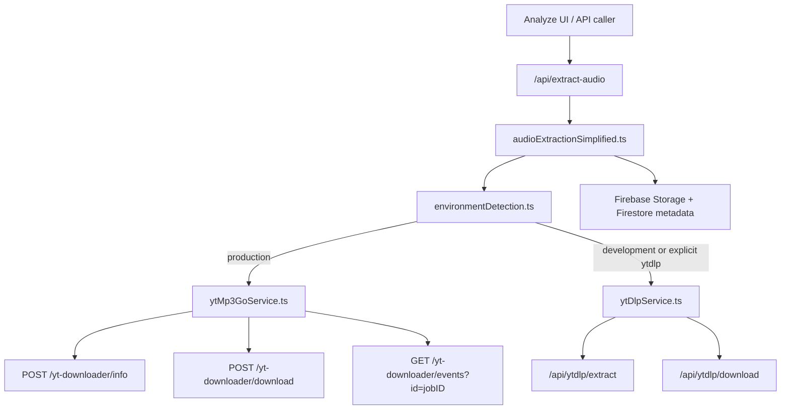
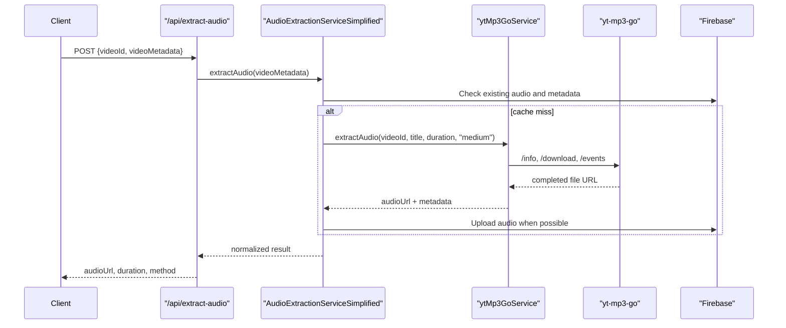

# YouTube Integration Services

<cite>
**Referenced Files in This Document**
- [audioExtractionSimplified.ts](file://src/services/audio/audioExtractionSimplified.ts)
- [ytMp3GoService.ts](file://src/services/youtube/ytMp3GoService.ts)
- [ytDlpService.ts](file://src/services/youtube/ytDlpService.ts)
- [route.ts](file://src/app/api/extract-audio/route.ts)
- [route.ts](file://src/app/api/ytdlp/extract/route.ts)
- [route.ts](file://src/app/api/ytdlp/download/route.ts)
- [route.ts](file://src/app/api/search-youtube/route.ts)
- [environmentDetection.ts](file://src/utils/environmentDetection.ts)
</cite>

## Introduction
The current YouTube extraction stack is environment-aware:
- Production uses `ytMp3GoService` against the private `YT_MP3_GO_BASE_URL` deployment.
- Local development uses `ytDlpService` through the `/api/ytdlp/*` routes.
- `/api/extract-audio` is the frontend-facing orchestration route.
- Extracted audio is cached through Firebase Storage when possible, with Firestore metadata as a fallback.

The older deleted legacy extraction service and compatibility wrapper have been removed from the source tree and should not be treated as active integration points.

## Architecture

**Diagram sources**
- [audioExtractionSimplified.ts:1-120](file://src/services/audio/audioExtractionSimplified.ts#L1-L120)
- [ytMp3GoService.ts:84-240](file://src/services/youtube/ytMp3GoService.ts#L84-L240)
- [ytDlpService.ts:1-236](file://src/services/youtube/ytDlpService.ts#L1-L236)
- [route.ts:1-116](file://src/app/api/extract-audio/route.ts#L1-L116)

## Core Components
- `AudioExtractionServiceSimplified`: selects the extraction strategy, checks Firebase Storage and Firestore cache, delegates production misses to browser extraction finalization, and stores successful output.
- `YtMp3GoService`: validates video IDs, requests video info, creates a quality-specific download job, monitors SSE status, and returns the finished audio URL.
- `YtDlpService`: development-only path for local yt-dlp metadata extraction and audio download.
- `/api/extract-audio`: accepts video metadata from search results, supports `getInfoOnly`, and returns the normalized audio URL plus extraction method.

## Production Extraction Flow

## Operational Notes
- Production defaults to browser-side yt-dlp with server-side cache checks and finalization; yt-mp3-go remains rollback-only behind explicit strategy configuration.
- The service retries medium quality once and then falls back to low quality before returning failure.
- yt-dlp remains available for local development and for explicit `NEXT_PUBLIC_AUDIO_STRATEGY=ytdlp`.
- Temporary external URLs are treated as stream URLs; Firebase Storage URLs are treated as permanent.

## Related Tests
- [detect-key.route.test.ts](file://__tests__/integration/api/detect-key.route.test.ts)
- [audioProcessingExtractedLyrics.test.ts](file://__tests__/unit/services/audioProcessingExtractedLyrics.test.ts)
