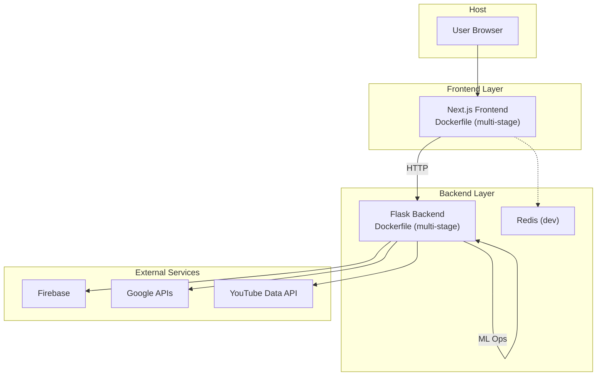
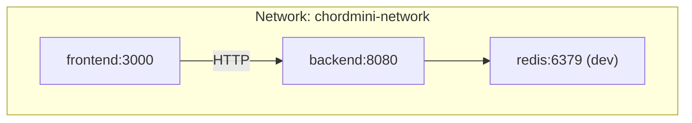
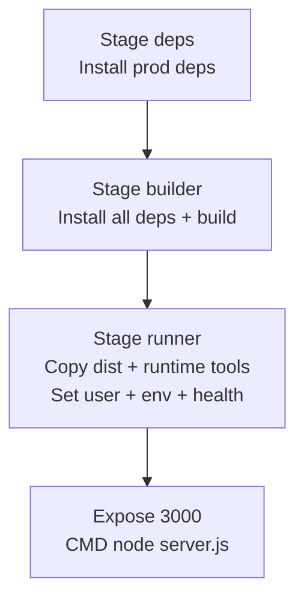
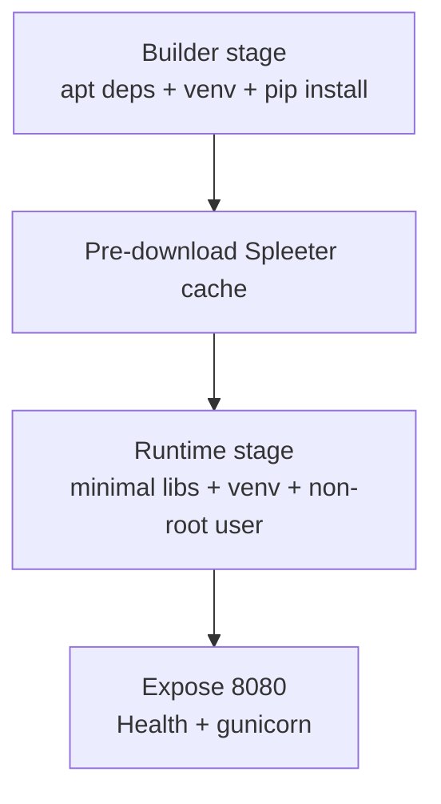
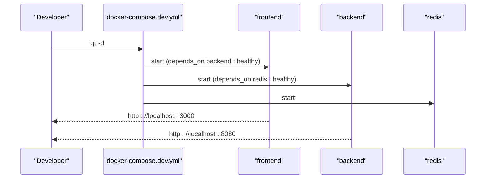
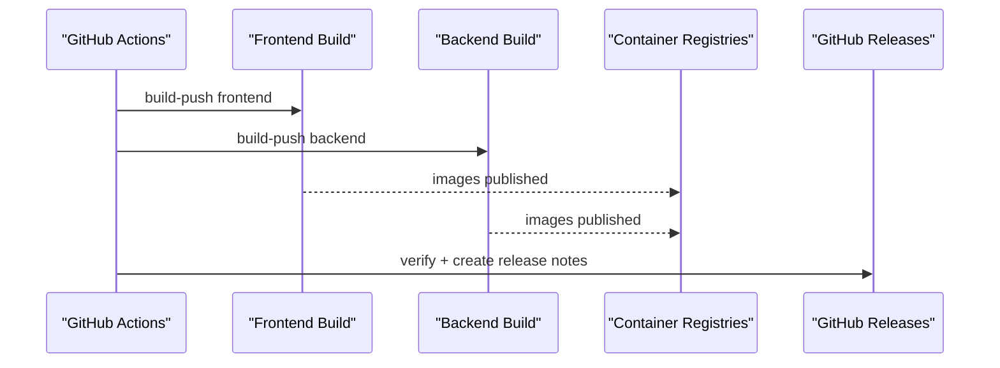
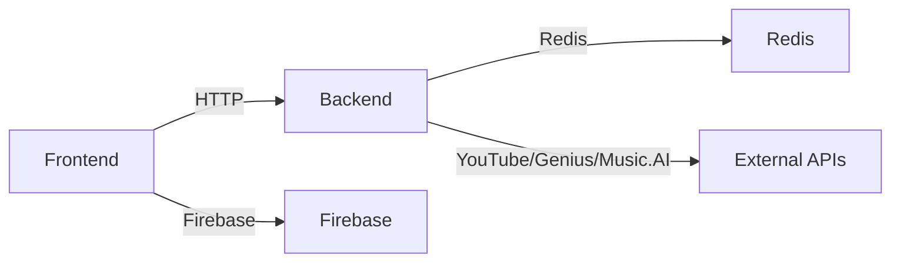

# Deployment Architecture

<cite>
**Referenced Files in This Document**
- [Dockerfile](file://Dockerfile)
- [docker-compose.prod.yml](file://docker-compose.prod.yml)
- [docker/docker-compose.dev.yml](file://docker/docker-compose.dev.yml)
- [python_backend/Dockerfile](file://python_backend/Dockerfile)
- [SongFormer/Dockerfile](file://SongFormer/Dockerfile)
- [sheetsage/Dockerfile](file://sheetsage/Dockerfile)
- [.github/workflows/docker-publish.yml](file://.github/workflows/docker-publish.yml)
- [.github/workflows/deploy.yml](file://.github/workflows/deploy.yml)
- [.github/workflows/security-audit.yml](file://.github/workflows/security-audit.yml)
- [.env.docker.example](file://.env.docker.example)
- [python_backend/config.py](file://python_backend/config.py)
- [python_backend/app.py](file://python_backend/app.py)
- [src/config/publicConfig.ts](file://src/config/publicConfig.ts)
- [src/config/firebase.ts](file://src/config/firebase.ts)
- [src/config/gemini.ts](file://src/config/gemini.ts)
- [scripts/build-and-push.sh](file://scripts/build-and-push.sh)
- [scripts/publish-docker-images.sh](file://scripts/publish-docker-images.sh)
- [scripts/security-check.sh](file://scripts/security-check.sh)
</cite>

## Table of Contents
1. [Introduction](#introduction)
2. [Project Structure](#project-structure)
3. [Core Components](#core-components)
4. [Architecture Overview](#architecture-overview)
5. [Detailed Component Analysis](#detailed-component-analysis)
6. [Dependency Analysis](#dependency-analysis)
7. [Performance Considerations](#performance-considerations)
8. [Troubleshooting Guide](#troubleshooting-guide)
9. [Conclusion](#conclusion)
10. [Appendices](#appendices)

## Introduction
This document describes the containerized deployment architecture for ChordMiniApp, covering multi-stage Docker builds for the frontend and backend, Docker Compose orchestration for development and production, CI/CD pipelines for automated testing and publishing, and operational guidance for production scaling, load balancing, monitoring, logging, and disaster recovery.

## Project Structure
ChordMiniApp uses a container-first approach:
- Frontend: Next.js application packaged in a multi-stage Dockerfile with optimized runtime layers and health checks.
- Backend: Python Flask microservice with a multi-stage Dockerfile tailored for ML-heavy dependencies and runtime model provisioning.
- Supporting services: Redis for rate limiting and caching in development; optional SongFormer and Sheet Sage services.
- Orchestration: Docker Compose for local development and production deployments.
- CI/CD: GitHub Actions for Docker image builds, security audits, and release management.

**Diagram sources**
- [Dockerfile:1-87](file://Dockerfile#L1-L87)
- [python_backend/Dockerfile:1-116](file://python_backend/Dockerfile#L1-L116)
- [docker/docker-compose.dev.yml:1-116](file://docker/docker-compose.dev.yml#L1-L116)
- [docker-compose.prod.yml:1-102](file://docker-compose.prod.yml#L1-L102)

**Section sources**
- [Dockerfile:1-87](file://Dockerfile#L1-L87)
- [python_backend/Dockerfile:1-116](file://python_backend/Dockerfile#L1-L116)
- [docker/docker-compose.dev.yml:1-116](file://docker/docker-compose.dev.yml#L1-L116)
- [docker-compose.prod.yml:1-102](file://docker-compose.prod.yml#L1-L102)

## Core Components
- Frontend container (Next.js)
  - Multi-stage build: deps → builder → runner
  - Optimizations: clean npm cache, node-gyp support, yt-dlp/ffmpeg installed at runtime, non-root user, health check
- Backend container (Python Flask)
  - Multi-stage build: builder (install ML deps) → runtime (minimal OS libs)
  - Optimizations: virtualenv reuse, pre-downloaded Spleeter model cache, gunicorn worker tuning, health check
- Supporting containers
  - Redis (dev) for rate limiting and caching
  - Optional SongFormer and Sheet Sage services via separate Dockerfiles
- Orchestration
  - docker-compose.dev.yml for local development with health checks and volume mounts
  - docker-compose.prod.yml for production with prebuilt images and explicit environment variables

**Section sources**
- [Dockerfile:1-87](file://Dockerfile#L1-L87)
- [python_backend/Dockerfile:1-116](file://python_backend/Dockerfile#L1-L116)
- [docker/docker-compose.dev.yml:1-116](file://docker/docker-compose.dev.yml#L1-L116)
- [docker-compose.prod.yml:1-102](file://docker-compose.prod.yml#L1-L102)

## Architecture Overview
The deployment consists of:
- Frontend service exposing port 3000, proxying API calls to the backend service
- Backend service exposing port 8080, serving ML inference endpoints and integrations
- Shared network for internal communication
- Optional Redis for rate limiting and caching in development
- Optional dedicated services for specialized inference (SongFormer, Sheet Sage)

**Diagram sources**
- [docker/docker-compose.dev.yml:101-116](file://docker/docker-compose.dev.yml#L101-L116)
- [docker-compose.prod.yml:93-102](file://docker-compose.prod.yml#L93-L102)

**Section sources**
- [docker/docker-compose.dev.yml:1-116](file://docker/docker-compose.dev.yml#L1-L116)
- [docker-compose.prod.yml:1-102](file://docker-compose.prod.yml#L1-L102)

## Detailed Component Analysis

### Frontend Container (Next.js)
- Multi-stage build
  - deps stage installs production dependencies with clean cache
  - builder stage installs all dependencies and builds the app with increased Node heap
  - runner stage copies standalone Next.js output, installs runtime tools (yt-dlp, ffmpeg), sets non-root user, exposes port 3000, defines health check
- Environment variables
  - NODE_ENV, NEXT_TELEMETRY_DISABLED, PORT, HOSTNAME
- Networking
  - Port 3000 mapped; health check probes /api/health

**Diagram sources**
- [Dockerfile:4-87](file://Dockerfile#L4-L87)

**Section sources**
- [Dockerfile:1-87](file://Dockerfile#L1-L87)

### Backend Container (Python Flask)
- Multi-stage build
  - builder stage: system deps, virtualenv, pip install (with special handling for ML libraries), pre-download Spleeter model cache
  - runtime stage: minimal OS libs, copy venv, create non-root user, expose 8080, health check, gunicorn with tuned workers/timeouts
- Environment variables
  - FLASK_ENV, FLASK_DEBUG, PYTHONUNBUFFERED, PYTHONDONTWRITEBYTECODE, model toggles, rate limiting via REDIS_URL
- Networking
  - Port 8080 mapped; health check probes root path

**Diagram sources**
- [python_backend/Dockerfile:4-116](file://python_backend/Dockerfile#L4-L116)

**Section sources**
- [python_backend/Dockerfile:1-116](file://python_backend/Dockerfile#L1-L116)
- [python_backend/config.py:16-103](file://python_backend/config.py#L16-L103)
- [python_backend/app.py:180-186](file://python_backend/app.py#L180-L186)

### Supporting Services
- Redis (development)
  - Used for rate limiting and caching; mounted persistent volume; configured with memory policy and health check
- SongFormer
  - Dedicated Python service with gunicorn; intended for specialized inference tasks
- Sheet Sage
  - Ubuntu-based service with additional system tools; includes model cache directory

**Section sources**
- [docker/docker-compose.dev.yml:82-100](file://docker/docker-compose.dev.yml#L82-L100)
- [SongFormer/Dockerfile:1-25](file://SongFormer/Dockerfile#L1-L25)
- [sheetsage/Dockerfile:1-55](file://sheetsage/Dockerfile#L1-L55)

### Orchestration: Docker Compose
- Development
  - Builds frontend and backend from source; frontend depends on backend health; backend depends on Redis health; volumes for cache/logs; health checks
- Production
  - Uses prebuilt images; explicit environment variables for Firebase, API keys, and backend URLs; health checks; named volumes for cache persistence

**Diagram sources**
- [docker/docker-compose.dev.yml:6-81](file://docker/docker-compose.dev.yml#L6-L81)

**Section sources**
- [docker/docker-compose.dev.yml:1-116](file://docker/docker-compose.dev.yml#L1-L116)
- [docker-compose.prod.yml:1-102](file://docker-compose.prod.yml#L1-L102)

### CI/CD Pipeline
- Docker Build and Publish
  - Builds frontend and backend images with Buildx, pushes to Docker Hub and GHCR, verifies images and docker-compose config, creates GitHub Releases with quick start instructions
- Security Audit
  - Weekly scheduled audit of production dependencies, checks for sensitive files, environment configuration, hardcoded secrets, and license compliance; posts commit status
- Deploy (commented)
  - Historical Vercel deployment jobs are currently disabled; validation, linting, TypeScript checks, and build verification remain active

**Diagram sources**
- [.github/workflows/docker-publish.yml:19-246](file://.github/workflows/docker-publish.yml#L19-L246)

**Section sources**
- [.github/workflows/docker-publish.yml:1-426](file://.github/workflows/docker-publish.yml#L1-L426)
- [.github/workflows/security-audit.yml:1-285](file://.github/workflows/security-audit.yml#L1-L285)
- [.github/workflows/deploy.yml:1-287](file://.github/workflows/deploy.yml#L1-L287)

## Dependency Analysis
- Frontend depends on backend service for ML inference and media processing
- Backend depends on Redis (dev), external APIs (YouTube, Genius, Music.AI), and Firebase for storage and auth
- Environment-driven configuration
  - Frontend loads public config at runtime via /api/config
  - Backend reads environment for production mode, rate limiting, and model toggles

**Diagram sources**
- [docker/docker-compose.dev.yml:16-80](file://docker/docker-compose.dev.yml#L16-L80)
- [docker-compose.prod.yml:21-49](file://docker-compose.prod.yml#L21-L49)
- [src/config/publicConfig.ts:63-108](file://src/config/publicConfig.ts#L63-L108)
- [python_backend/config.py:48-75](file://python_backend/config.py#L48-L75)

**Section sources**
- [docker/docker-compose.dev.yml:1-116](file://docker/docker-compose.dev.yml#L1-L116)
- [docker-compose.prod.yml:1-102](file://docker-compose.prod.yml#L1-L102)
- [src/config/publicConfig.ts:1-218](file://src/config/publicConfig.ts#L1-L218)
- [python_backend/config.py:1-215](file://python_backend/config.py#L1-L215)

## Performance Considerations
- Frontend
  - Multi-stage build reduces final image size; non-root user improves security posture; yt-dlp/ffmpeg provisioned at runtime to keep builder lean
- Backend
  - Virtualenv reuse across stages; pre-downloaded Spleeter cache reduces cold-start latency; gunicorn tuned for ML workloads
- Networking
  - Health checks ensure readiness; internal DNS names used for service discovery
- Caching
  - Named volumes for backend cache and logs; Redis cache for rate limiting

[No sources needed since this section provides general guidance]

## Troubleshooting Guide
- Frontend health check failures
  - Verify /api/health endpoint responds; confirm environment variables for base URL and backend URL are set
- Backend health check failures
  - Confirm root endpoint responds; check model cache availability; validate Redis connectivity (dev)
- Environment variables
  - Use .env.docker.example as template; ensure Firebase keys, API keys, and backend URLs are configured
- Security checks
  - Run scripts/security-check.sh to verify no sensitive files are tracked or hardcoded

**Section sources**
- [docker/docker-compose.dev.yml:29-80](file://docker/docker-compose.dev.yml#L29-L80)
- [docker-compose.prod.yml:58-91](file://docker-compose.prod.yml#L58-L91)
- [.env.docker.example:1-119](file://.env.docker.example#L1-L119)
- [scripts/security-check.sh:1-169](file://scripts/security-check.sh#L1-L169)

## Conclusion
ChordMiniApp’s deployment architecture emphasizes containerization, multi-stage builds, and robust orchestration. The CI/CD pipeline automates image builds and security auditing, while Docker Compose supports both development and production environments. Operational excellence is achieved through health checks, environment-driven configuration, and optional dedicated services for specialized inference.

[No sources needed since this section summarizes without analyzing specific files]

## Appendices

### Environment Variable Management
- Frontend runtime configuration
  - Loaded from /api/config at runtime; supports Docker “build once, run anywhere”
- Backend configuration
  - Production mode detection via environment; CORS origins, rate limits, timeouts, and model toggles configurable via environment
- Example template
  - Refer to .env.docker.example for required and optional variables

**Section sources**
- [src/config/publicConfig.ts:63-108](file://src/config/publicConfig.ts#L63-L108)
- [src/config/firebase.ts:43-115](file://src/config/firebase.ts#L43-L115)
- [python_backend/config.py:16-103](file://python_backend/config.py#L16-L103)
- [.env.docker.example:1-119](file://.env.docker.example#L1-L119)

### Secrets Handling
- Never commit secrets; rely on environment injection at runtime
- Scripts and workflows enforce checks for sensitive files and hardcoded secrets
- Use server-only environment variables for backend secrets (e.g., API keys)

**Section sources**
- [.github/workflows/security-audit.yml:84-149](file://.github/workflows/security-audit.yml#L84-L149)
- [scripts/security-check.sh:29-102](file://scripts/security-check.sh#L29-L102)
- [docker-compose.prod.yml:44-52](file://docker-compose.prod.yml#L44-L52)

### Monitoring, Logging, and Disaster Recovery
- Monitoring
  - Health checks on frontend and backend services
- Logging
  - Backend logs persisted via named volumes; consider integrating centralized logging in production
- Disaster Recovery
  - Use named volumes for cache persistence; maintain backups of configuration and registries; automate image publishing and releases

**Section sources**
- [docker/docker-compose.dev.yml:56-80](file://docker/docker-compose.dev.yml#L56-L80)
- [docker-compose.prod.yml:82-91](file://docker-compose.prod.yml#L82-L91)
- [.github/workflows/docker-publish.yml:213-246](file://.github/workflows/docker-publish.yml#L213-L246)

### Scaling and Load Balancing
- Horizontal scaling
  - Stateless frontend and backend; scale replicas behind a reverse proxy or platform-managed load balancer
- Backend workers
  - gunicorn workers configured for ML workloads; tune based on CPU/memory capacity
- CDN and caching
  - Serve static assets via CDN; cache model artifacts and processed media

**Section sources**
- [python_backend/Dockerfile:109-116](file://python_backend/Dockerfile#L109-L116)
- [docker/docker-compose.dev.yml:63-74](file://docker/docker-compose.dev.yml#L63-L74)

### Manual Deployment Utilities
- Build and push scripts
  - scripts/build-and-push.sh and scripts/publish-docker-images.sh for manual image tagging and publishing

**Section sources**
- [scripts/build-and-push.sh:1-321](file://scripts/build-and-push.sh#L1-L321)
- [scripts/publish-docker-images.sh:1-164](file://scripts/publish-docker-images.sh#L1-L164)