# App Router Configuration

<cite>
**Referenced Files in This Document**
- [next.config.js](file://next.config.js)
- [layout.tsx](file://src/app/layout.tsx)
- [providers.tsx](file://src/app/providers.tsx)
- [globals.css](file://src/app/globals.css)
- [tsconfig.json](file://tsconfig.json)
- [ClientErrorBoundary.tsx](file://src/components/common/ClientErrorBoundary.tsx)
- [ServiceWorkerRegistration.tsx](file://src/components/layout/ServiceWorkerRegistration.tsx)
- [FirebaseInitializer.tsx](file://src/components/layout/FirebaseInitializer.tsx)
- [PerformanceMonitor.tsx](file://src/components/layout/PerformanceMonitor.tsx)
- [CriticalPerformanceOptimizer.tsx](file://src/components/layout/CriticalPerformanceOptimizer.tsx)
- [page.tsx](file://src/app/page.tsx)
- [analyze/layout.tsx](file://src/app/analyze/layout.tsx)
- [firebase.ts](file://src/config/firebase.ts)
</cite>

## Table of Contents
1. [Introduction](#introduction)
2. [Project Structure](#project-structure)
3. [Core Components](#core-components)
4. [Architecture Overview](#architecture-overview)
5. [Detailed Component Analysis](#detailed-component-analysis)
6. [Dependency Analysis](#dependency-analysis)
7. [Performance Considerations](#performance-considerations)
8. [Troubleshooting Guide](#troubleshooting-guide)
9. [Conclusion](#conclusion)
10. [Appendices](#appendices)

## Introduction
This document explains the Next.js App Router configuration for the project, focusing on the RootLayout component structure, metadata configuration, and internationalization setup. It documents the Providers wrapper pattern, error boundary implementation, and service integration points. It also details the font loading strategy with Google Fonts, critical CSS optimization, and performance enhancements. Build configuration via next.config.js, TypeScript compilation settings, and asset optimization strategies are covered. Routing hierarchy, dynamic routes, and server-side rendering patterns are explained alongside integration with Firebase services, service worker registration, and performance monitoring components.

## Project Structure
The Next.js App Router organizes pages under src/app with a root layout that wraps all pages. The root layout defines fonts, metadata, and a Providers wrapper that injects UI and theme contexts. It also mounts error boundaries, Firebase initializer, service worker registration, and performance monitoring components. The global stylesheet applies Tailwind layers and responsive design tokens.

```mermaid
graph TB
A["Root Layout<br/>src/app/layout.tsx"] --> B["Providers Wrapper<br/>src/app/providers.tsx"]
A --> C["Client Error Boundary<br/>src/components/common/ClientErrorBoundary.tsx"]
A --> D["Firebase Initializer<br/>src/components/layout/FirebaseInitializer.tsx"]
A --> E["Service Worker Registration<br/>src/components/layout/ServiceWorkerRegistration.tsx"]
A --> F["Performance Monitor<br/>src/components/layout/PerformanceMonitor.tsx"]
A --> G["Critical Performance Optimizer<br/>src/components/layout/CriticalPerformanceOptimizer.tsx"]
A --> H["Global Styles<br/>src/app/globals.css"]
A --> I["Home Page<br/>src/app/page.tsx"]
A --> J["Analyze Layout<br/>src/app/analyze/layout.tsx"]
```

**Diagram sources**
- [layout.tsx:143-228](file://src/app/layout.tsx#L143-L228)
- [providers.tsx:12-27](file://src/app/providers.tsx#L12-L27)
- [ClientErrorBoundary.tsx:10-12](file://src/components/common/ClientErrorBoundary.tsx#L10-L12)
- [FirebaseInitializer.tsx:12-57](file://src/components/layout/FirebaseInitializer.tsx#L12-L57)
- [ServiceWorkerRegistration.tsx:9-75](file://src/components/layout/ServiceWorkerRegistration.tsx#L9-L75)
- [PerformanceMonitor.tsx:17-239](file://src/components/layout/PerformanceMonitor.tsx#L17-L239)
- [CriticalPerformanceOptimizer.tsx:12-50](file://src/components/layout/CriticalPerformanceOptimizer.tsx#L12-L50)
- [globals.css:1-657](file://src/app/globals.css#L1-L657)
- [page.tsx:1-6](file://src/app/page.tsx#L1-L6)
- [analyze/layout.tsx:6-16](file://src/app/analyze/layout.tsx#L6-L16)

**Section sources**
- [layout.tsx:143-228](file://src/app/layout.tsx#L143-L228)
- [providers.tsx:12-27](file://src/app/providers.tsx#L12-L27)
- [globals.css:1-657](file://src/app/globals.css#L1-L657)
- [page.tsx:1-6](file://src/app/page.tsx#L1-L6)
- [analyze/layout.tsx:6-16](file://src/app/analyze/layout.tsx#L6-L16)

## Core Components
- RootLayout: Defines metadata, fonts, critical CSS, and composes Providers and integration components.
- Providers: Wraps the app with UI provider, toast provider, processing context, and theme context.
- ClientErrorBoundary: Client-side wrapper around the global error boundary.
- FirebaseInitializer: Preloads Firebase and initializes collections with idle scheduling.
- ServiceWorkerRegistration: Registers a service worker with update handling and messaging.
- PerformanceMonitor: Tracks Core Web Vitals and bundle/memory metrics in development.
- CriticalPerformanceOptimizer: Adds critical CSS and avoids post-paint DOM writes.

**Section sources**
- [layout.tsx:45-140](file://src/app/layout.tsx#L45-L140)
- [layout.tsx:210-224](file://src/app/layout.tsx#L210-L224)
- [providers.tsx:12-27](file://src/app/providers.tsx#L12-L27)
- [ClientErrorBoundary.tsx:10-12](file://src/components/common/ClientErrorBoundary.tsx#L10-L12)
- [FirebaseInitializer.tsx:12-57](file://src/components/layout/FirebaseInitializer.tsx#L12-L57)
- [ServiceWorkerRegistration.tsx:9-75](file://src/components/layout/ServiceWorkerRegistration.tsx#L9-L75)
- [PerformanceMonitor.tsx:17-239](file://src/components/layout/PerformanceMonitor.tsx#L17-L239)
- [CriticalPerformanceOptimizer.tsx:12-50](file://src/components/layout/CriticalPerformanceOptimizer.tsx#L12-L50)

## Architecture Overview
The App Router renders pages within the RootLayout, which sets metadata and fonts, injects Providers, and mounts integration components. Firebase is lazily initialized and prepared early to avoid race conditions. Service workers are registered after initial load. Performance monitoring runs in development. The global stylesheet leverages Tailwind layers and responsive design tokens.

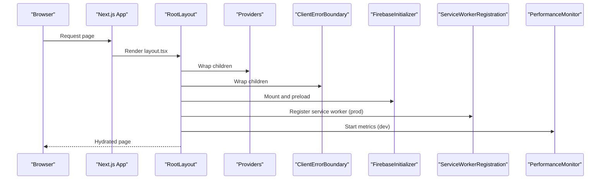

**Diagram sources**
- [layout.tsx:149-226](file://src/app/layout.tsx#L149-L226)
- [providers.tsx:12-27](file://src/app/providers.tsx#L12-L27)
- [ClientErrorBoundary.tsx:10-12](file://src/components/common/ClientErrorBoundary.tsx#L10-L12)
- [FirebaseInitializer.tsx:12-57](file://src/components/layout/FirebaseInitializer.tsx#L12-L57)
- [ServiceWorkerRegistration.tsx:12-75](file://src/components/layout/ServiceWorkerRegistration.tsx#L12-L75)
- [PerformanceMonitor.tsx:17-239](file://src/components/layout/PerformanceMonitor.tsx#L17-L239)

## Detailed Component Analysis

### RootLayout and Metadata
RootLayout configures:
- Fonts: Google Fonts (DM Sans, Roboto Mono, Varela Round) with font-display swap and CSS variables for theme-aware font stacks.
- Metadata: Title template, description, keywords, author/publisher info, icons, Open Graph, Twitter, verification, and canonical URL.
- Head: Critical CSS inlined to prevent render-blocking, favicon links, DNS prefetch for external domains, and a script to apply theme before first paint.
- Body: Providers wrapper, ClientErrorBoundary, performance optimizers, service worker registration, Firebase initializer, optional development performance monitor, CORS error suppression, footer, and children.

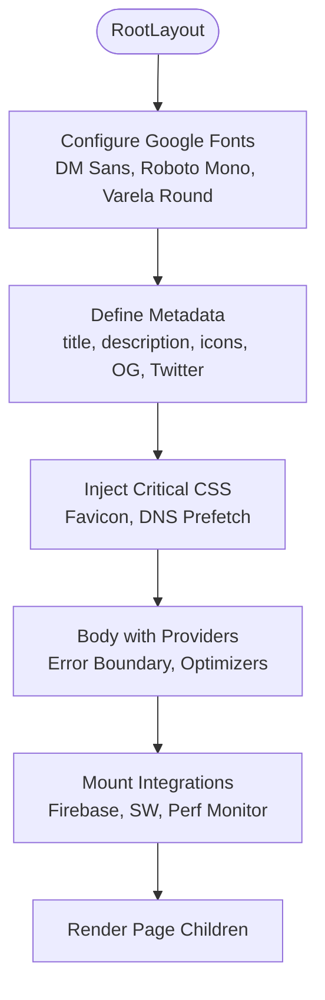

**Diagram sources**
- [layout.tsx:19-41](file://src/app/layout.tsx#L19-L41)
- [layout.tsx:45-140](file://src/app/layout.tsx#L45-L140)
- [layout.tsx:150-208](file://src/app/layout.tsx#L150-L208)
- [layout.tsx:209-226](file://src/app/layout.tsx#L209-L226)

**Section sources**
- [layout.tsx:19-41](file://src/app/layout.tsx#L19-L41)
- [layout.tsx:45-140](file://src/app/layout.tsx#L45-L140)
- [layout.tsx:150-208](file://src/app/layout.tsx#L150-L208)
- [layout.tsx:209-226](file://src/app/layout.tsx#L209-L226)

### Providers Wrapper Pattern
Providers composes:
- UI Provider from @heroui/react
- Toast Provider with placement, offset, and max visible toasts
- Processing Provider
- Theme Provider

This ensures consistent UI behavior, toast notifications, processing state, and theme across the app.

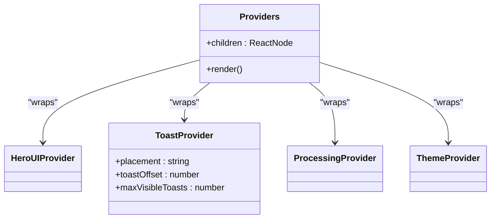

**Diagram sources**
- [providers.tsx:12-27](file://src/app/providers.tsx#L12-L27)

**Section sources**
- [providers.tsx:12-27](file://src/app/providers.tsx#L12-L27)

### Error Boundary Implementation
ClientErrorBoundary is a client component that wraps the global error boundary. This ensures error boundaries function correctly in client components.

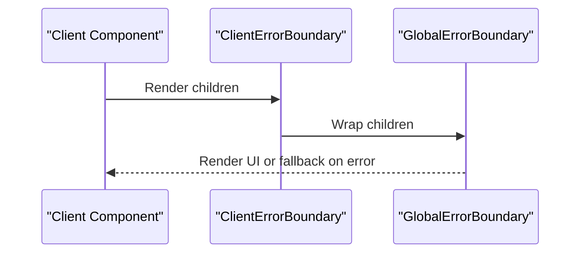

**Diagram sources**
- [ClientErrorBoundary.tsx:10-12](file://src/components/common/ClientErrorBoundary.tsx#L10-L12)

**Section sources**
- [ClientErrorBoundary.tsx:10-12](file://src/components/common/ClientErrorBoundary.tsx#L10-L12)

### Service Integration Points

#### Firebase Services
FirebaseInitializer preloads Firebase and initializes collections asynchronously. It also sets up connection monitoring for inactivity handling.

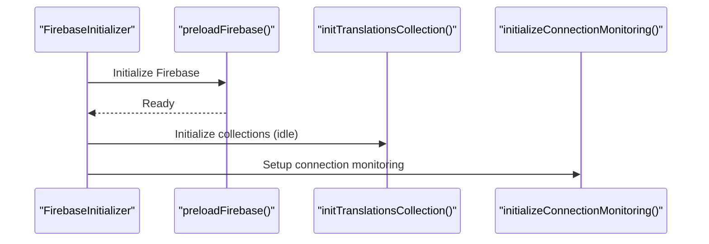

**Diagram sources**
- [FirebaseInitializer.tsx:12-57](file://src/components/layout/FirebaseInitializer.tsx#L12-L57)
- [firebase.ts:462-464](file://src/config/firebase.ts#L462-L464)
- [firebase.ts:336-358](file://src/config/firebase.ts#L336-L358)

**Section sources**
- [FirebaseInitializer.tsx:12-57](file://src/components/layout/FirebaseInitializer.tsx#L12-L57)
- [firebase.ts:43-115](file://src/config/firebase.ts#L43-L115)
- [firebase.ts:336-358](file://src/config/firebase.ts#L336-L358)

#### Service Worker Registration
ServiceWorkerRegistration registers a service worker in production with update checks and message handling. It delays registration to avoid blocking initial load.

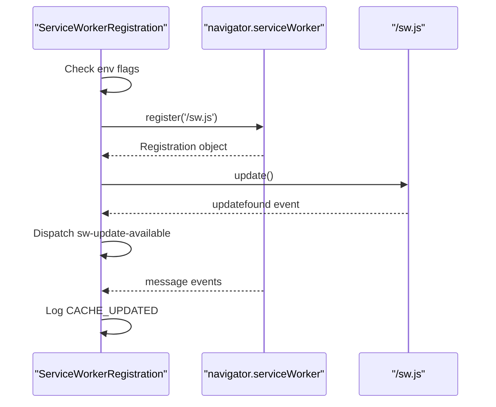

**Diagram sources**
- [ServiceWorkerRegistration.tsx:12-96](file://src/components/layout/ServiceWorkerRegistration.tsx#L12-L96)

**Section sources**
- [ServiceWorkerRegistration.tsx:9-75](file://src/components/layout/ServiceWorkerRegistration.tsx#L9-L75)

#### Performance Monitoring
PerformanceMonitor tracks Core Web Vitals (LCP, FID, CLS, FCP, TTFB), bundle sizes, and memory usage in development when a localStorage flag is enabled.

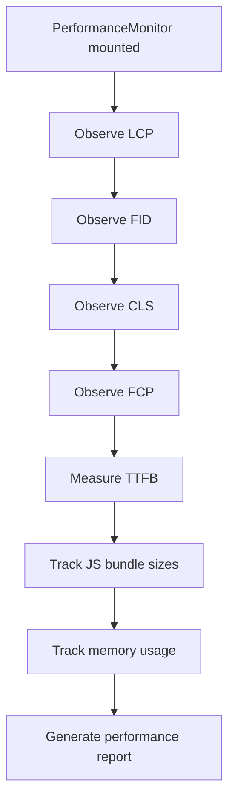

**Diagram sources**
- [PerformanceMonitor.tsx:26-239](file://src/components/layout/PerformanceMonitor.tsx#L26-L239)

**Section sources**
- [PerformanceMonitor.tsx:17-239](file://src/components/layout/PerformanceMonitor.tsx#L17-L239)

### Font Loading Strategy and Critical CSS
- Google Fonts: Three fonts configured with font-display swap and CSS variables for dynamic font stacks.
- Critical CSS: Inlined in head to prevent render-blocking and ensure above-the-fold content is visible quickly.
- Global CSS: Tailwind layers applied with responsive design tokens and dark mode variants.

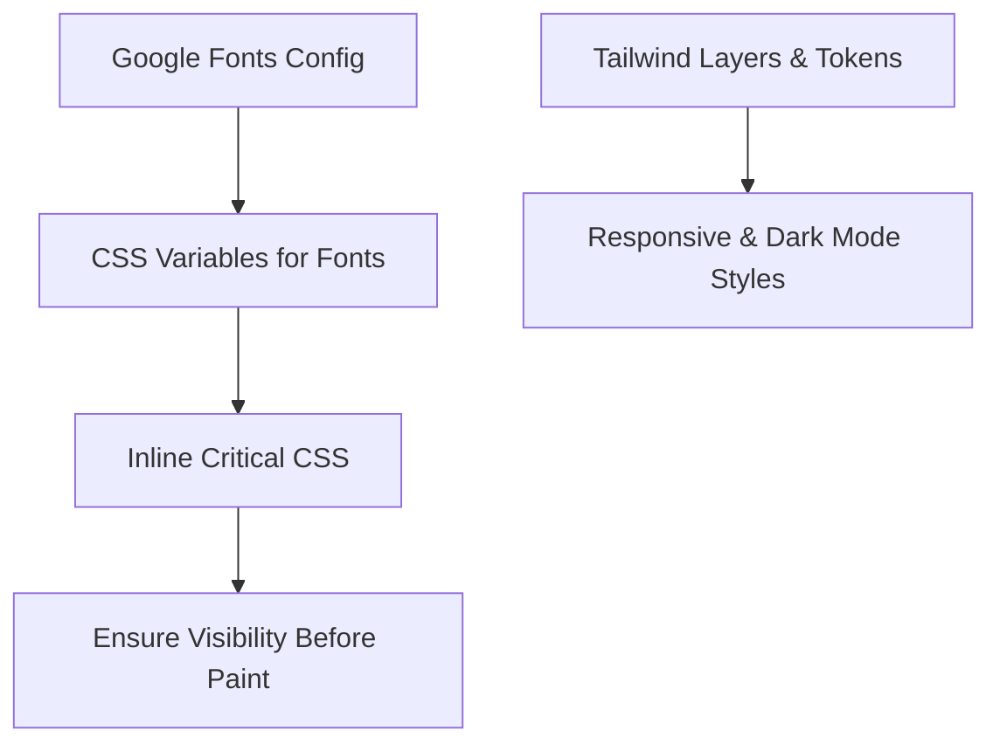

**Diagram sources**
- [layout.tsx:19-41](file://src/app/layout.tsx#L19-L41)
- [layout.tsx:163-188](file://src/app/layout.tsx#L163-L188)
- [globals.css:112-328](file://src/app/globals.css#L112-L328)

**Section sources**
- [layout.tsx:19-41](file://src/app/layout.tsx#L19-L41)
- [layout.tsx:163-188](file://src/app/layout.tsx#L163-L188)
- [globals.css:112-328](file://src/app/globals.css#L112-L328)

### Routing Hierarchy and Dynamic Routes
- Root page: src/app/page.tsx renders the home page.
- Analyze layout: src/app/analyze/layout.tsx defines analyze-specific metadata and layout.
- Dynamic routes:
  - src/app/analyze/[videoId]/... for video-specific analysis.
  - src/app/lyrics/[videoId]/page.tsx for lyrics per video.
  - src/app/api/jobs/status/[jobId]/route.ts for job status retrieval.
  - src/app/api/proxy-audio/[filename]/route.ts for proxied audio serving.

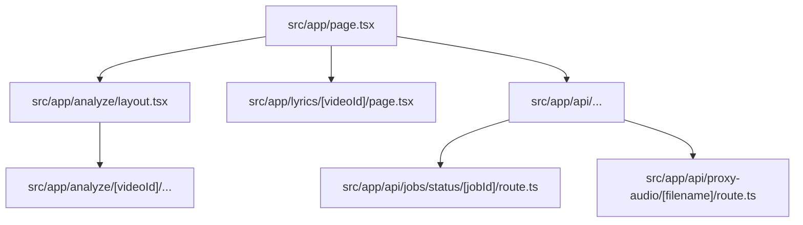

**Diagram sources**
- [page.tsx:1-6](file://src/app/page.tsx#L1-L6)
- [analyze/layout.tsx:1-16](file://src/app/analyze/layout.tsx#L1-L16)
- [ServiceWorkerRegistration.tsx:9-75](file://src/components/layout/ServiceWorkerRegistration.tsx#L9-L75)

**Section sources**
- [page.tsx:1-6](file://src/app/page.tsx#L1-L6)
- [analyze/layout.tsx:1-16](file://src/app/analyze/layout.tsx#L1-L16)

## Dependency Analysis
The configuration establishes clear dependencies among layout, providers, integrations, and services. Providers depend on UI and theme contexts. Integrations depend on environment flags and browser APIs. Firebase relies on runtime configuration and lazy initialization.

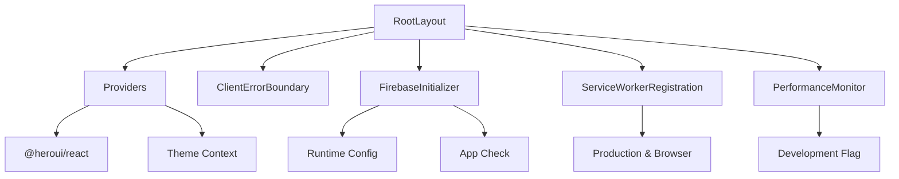

**Diagram sources**
- [layout.tsx:210-224](file://src/app/layout.tsx#L210-L224)
- [providers.tsx:12-27](file://src/app/providers.tsx#L12-L27)
- [ClientErrorBoundary.tsx:10-12](file://src/components/common/ClientErrorBoundary.tsx#L10-L12)
- [FirebaseInitializer.tsx:12-57](file://src/components/layout/FirebaseInitializer.tsx#L12-L57)
- [ServiceWorkerRegistration.tsx:12-75](file://src/components/layout/ServiceWorkerRegistration.tsx#L12-L75)
- [PerformanceMonitor.tsx:17-239](file://src/components/layout/PerformanceMonitor.tsx#L17-L239)
- [firebase.ts:462-464](file://src/config/firebase.ts#L462-L464)

**Section sources**
- [layout.tsx:210-224](file://src/app/layout.tsx#L210-L224)
- [providers.tsx:12-27](file://src/app/providers.tsx#L12-L27)
- [firebase.ts:462-464](file://src/config/firebase.ts#L462-L464)

## Performance Considerations
- Critical CSS: Inlined in head to eliminate render-blocking and improve LCP.
- Font display: swap to prevent FOIT/FOUT and maintain layout stability.
- Bundle optimization: Splitting and tree shaking via webpack configuration; usedExports and concatenateModules enabled.
- Source maps: Hidden source maps in production with fallbacks for debugging.
- Asset optimization: Images configured with remotePatterns and quality tiers.
- Audio handling: Custom loaders for audio formats to ensure correct bundling.
- Development performance: PerformanceMonitor logs Core Web Vitals and bundle sizes.

**Section sources**
- [layout.tsx:163-188](file://src/app/layout.tsx#L163-L188)
- [next.config.js:198-344](file://next.config.js#L198-L344)
- [next.config.js:96-125](file://next.config.js#L96-L125)
- [PerformanceMonitor.tsx:151-218](file://src/components/layout/PerformanceMonitor.tsx#L151-L218)

## Troubleshooting Guide
- Firebase initialization failures: The initializer logs warnings and continues without crashing. Verify runtime configuration availability and anonymous authentication settings.
- Service worker registration: Errors are logged; ensure production environment and browser support. Update events trigger a custom event for UI updates.
- PerformanceMonitor: Requires development flag and localStorage toggle; otherwise it does not run.
- Critical CSS conflicts: Confirm critical styles are not overridden by later injected styles; ensure hydration-safe patterns.

**Section sources**
- [firebase.ts:101-115](file://src/config/firebase.ts#L101-L115)
- [ServiceWorkerRegistration.tsx:65-67](file://src/components/layout/ServiceWorkerRegistration.tsx#L65-L67)
- [PerformanceMonitor.tsx:26-29](file://src/components/layout/PerformanceMonitor.tsx#L26-L29)

## Conclusion
The Next.js App Router configuration centers on a robust RootLayout that defines metadata and fonts, wraps the app with Providers, and integrates error boundaries, Firebase, service workers, and performance monitoring. The build configuration optimizes bundles, images, and source maps. Routing supports static and dynamic paths, while Firebase and service worker integrations enhance reliability and offline capabilities.

## Appendices

### Build Configuration Highlights
- Output: Standalone for Docker deployments.
- Server externals: @music.ai/sdk bundled explicitly.
- Turbopack rules: Audio file loaders mapped to file-loader.
- Image optimization: Remote patterns and quality tiers.
- Security headers: CORS, CSP, COOP, COEP, CORP.
- Webpack: SplitChunks strategy, tree shaking, module concatenation, hidden source maps.
- TypeScript: Strict mode, bundler resolution, path aliases.

**Section sources**
- [next.config.js:42-381](file://next.config.js#L42-L381)

### TypeScript Compilation Settings
- Target: ES2017
- Lib: dom, dom.iterable, esnext
- Strict: true
- JSX: react-jsx
- Module resolution: bundler
- Paths: @/* -> ./src/*

**Section sources**
- [tsconfig.json:1-43](file://tsconfig.json#L1-L43)