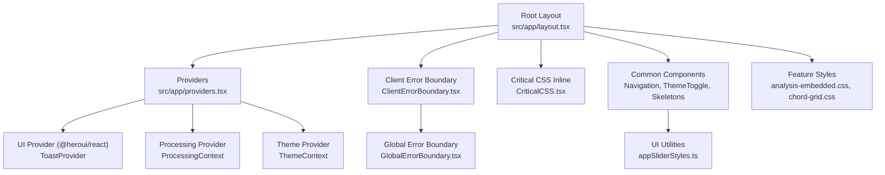
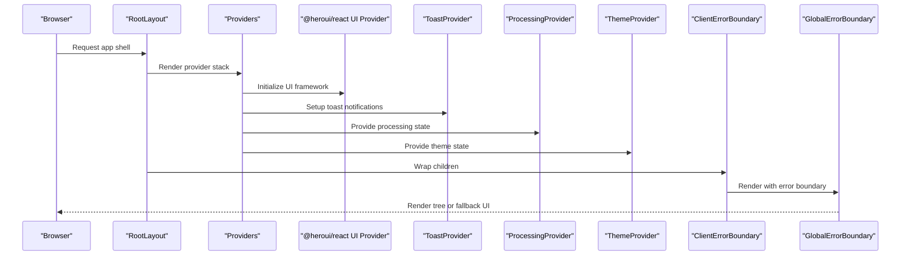
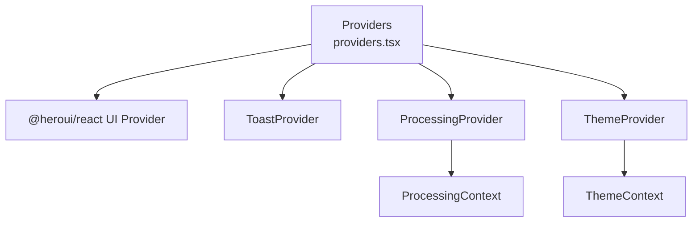
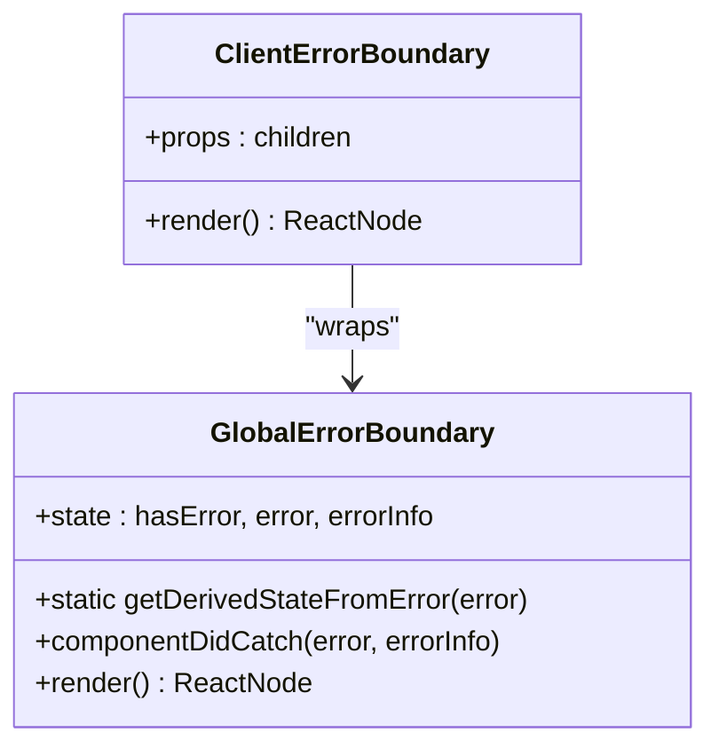
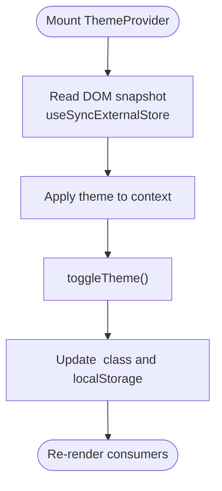
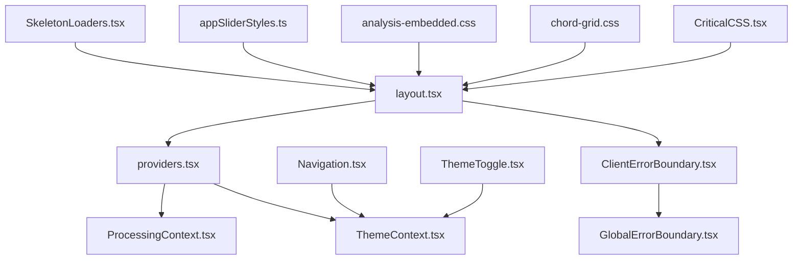

# Component Architecture

<cite>
**Referenced Files in This Document**
- [layout.tsx](file://src/app/layout.tsx)
- [providers.tsx](file://src/app/providers.tsx)
- [GlobalErrorBoundary.tsx](file://src/components/common/GlobalErrorBoundary.tsx)
- [ClientErrorBoundary.tsx](file://src/components/common/ClientErrorBoundary.tsx)
- [ProcessingContext.tsx](file://src/contexts/ProcessingContext.tsx)
- [ThemeContext.tsx](file://src/contexts/ThemeContext.tsx)
- [tailwind.config.js](file://tailwind.config.js)
- [SkeletonLoaders.tsx](file://src/components/common/SkeletonLoaders.tsx)
- [ThemeToggle.tsx](file://src/components/common/ThemeToggle.tsx)
- [Navigation.tsx](file://src/components/common/Navigation.tsx)
- [appSliderStyles.ts](file://src/components/ui/appSliderStyles.ts)
- [analysis-embedded.css](file://src/styles/analysis-embedded.css)
- [chord-grid.css](file://src/styles/chord-grid.css)
- [CriticalCSS.tsx](file://src/components/layout/CriticalCSS.tsx)
</cite>

## Table of Contents
1. [Introduction](#introduction)
2. [Project Structure](#project-structure)
3. [Core Components](#core-components)
4. [Architecture Overview](#architecture-overview)
5. [Detailed Component Analysis](#detailed-component-analysis)
6. [Dependency Analysis](#dependency-analysis)
7. [Performance Considerations](#performance-considerations)
8. [Troubleshooting Guide](#troubleshooting-guide)
9. [Conclusion](#conclusion)
10. [Appendices](#appendices)

## Introduction
This document explains the React component architecture of the application, focusing on the hierarchical composition starting from RootLayout and Providers, common component libraries, styling strategies, lifecycle and communication patterns, accessibility and responsiveness, testing strategies, and performance optimizations. It synthesizes the Next.js App Router structure with client-side providers, error boundaries, and UI primitives to deliver a cohesive, scalable front-end foundation.

## Project Structure
The application follows a layered structure:
- Root layout and metadata configuration
- Provider stack for UI framework, state, and theme
- Common components for error handling, navigation, and UX primitives
- Feature-specific components under dedicated folders
- Styling via Tailwind CSS, CSS modules, and targeted CSS files
- Contexts for cross-cutting concerns like processing state and theme



**Diagram sources**
- [layout.tsx:143-228](file://src/app/layout.tsx#L143-L228)
- [providers.tsx:12-27](file://src/app/providers.tsx#L12-L27)
- [ClientErrorBoundary.tsx:10-12](file://src/components/common/ClientErrorBoundary.tsx#L10-L12)
- [GlobalErrorBoundary.tsx:19-84](file://src/components/common/GlobalErrorBoundary.tsx#L19-L84)
- [CriticalCSS.tsx:9-242](file://src/components/layout/CriticalCSS.tsx#L9-L242)
- [Navigation.tsx:23-265](file://src/components/common/Navigation.tsx#L23-L265)
- [ThemeToggle.tsx:7-94](file://src/components/common/ThemeToggle.tsx#L7-L94)
- [SkeletonLoaders.tsx:10-151](file://src/components/common/SkeletonLoaders.tsx#L10-L151)
- [appSliderStyles.ts:5-10](file://src/components/ui/appSliderStyles.ts#L5-L10)
- [analysis-embedded.css:1-25](file://src/styles/analysis-embedded.css#L1-L25)
- [chord-grid.css:1-92](file://src/styles/chord-grid.css#L1-L92)

**Section sources**
- [layout.tsx:143-228](file://src/app/layout.tsx#L143-L228)
- [providers.tsx:12-27](file://src/app/providers.tsx#L12-L27)

## Core Components
- Root layout and metadata: Defines fonts, critical metadata, and the initial HTML/document structure. It also injects a blocking script to prevent theme flash and inlines critical CSS for above-the-fold content.
- Providers: Composes UI provider, toast provider, processing context, and theme context around the application subtree.
- Error boundaries: A client-side wrapper composes a global error boundary to gracefully handle runtime errors.
- Common primitives: Navigation, theme toggle, skeleton loaders, and UI utilities form a reusable library for consistent UX and performance.

Key responsibilities:
- Root layout: Hydration guard, critical CSS, performance helpers, and global initialization.
- Providers: Centralized state and theme management for downstream components.
- Error boundaries: Fail-safe rendering and user-friendly fallbacks.
- Common components: Accessibility-first, responsive, and performance-aware building blocks.

**Section sources**
- [layout.tsx:143-228](file://src/app/layout.tsx#L143-L228)
- [providers.tsx:12-27](file://src/app/providers.tsx#L12-L27)
- [ClientErrorBoundary.tsx:10-12](file://src/components/common/ClientErrorBoundary.tsx#L10-L12)
- [GlobalErrorBoundary.tsx:19-84](file://src/components/common/GlobalErrorBoundary.tsx#L19-L84)
- [Navigation.tsx:23-265](file://src/components/common/Navigation.tsx#L23-L265)
- [ThemeToggle.tsx:7-94](file://src/components/common/ThemeToggle.tsx#L7-L94)
- [SkeletonLoaders.tsx:10-151](file://src/components/common/SkeletonLoaders.tsx#L10-L151)

## Architecture Overview
The component architecture centers on a strict provider hierarchy and a robust error-handling boundary. The layout initializes the document and performance features, the Providers stack manages UI state and theme, and common components encapsulate shared behaviors.



**Diagram sources**
- [layout.tsx:143-228](file://src/app/layout.tsx#L143-L228)
- [providers.tsx:12-27](file://src/app/providers.tsx#L12-L27)
- [ClientErrorBoundary.tsx:10-12](file://src/components/common/ClientErrorBoundary.tsx#L10-L12)
- [GlobalErrorBoundary.tsx:19-84](file://src/components/common/GlobalErrorBoundary.tsx#L19-L84)

## Detailed Component Analysis

### Providers Stack and Composition
The Providers component composes:
- UI provider from @heroui/react
- Toast provider for non-blocking notifications
- Processing provider for analysis lifecycle
- Theme provider for light/dark mode

Composition pattern:
- Nesting ensures child components can consume multiple contexts simultaneously.
- The UI provider centralizes component theming and behavior.
- The toast provider offers a consistent notification surface.
- Processing and theme contexts decouple UI from domain logic.



**Diagram sources**
- [providers.tsx:12-27](file://src/app/providers.tsx#L12-L27)
- [ProcessingContext.tsx:44-183](file://src/contexts/ProcessingContext.tsx#L44-L183)
- [ThemeContext.tsx:44-69](file://src/contexts/ThemeContext.tsx#L44-L69)

**Section sources**
- [providers.tsx:12-27](file://src/app/providers.tsx#L12-L27)
- [ProcessingContext.tsx:44-183](file://src/contexts/ProcessingContext.tsx#L44-L183)
- [ThemeContext.tsx:44-69](file://src/contexts/ThemeContext.tsx#L44-L69)

### Error Boundaries and Fallback Rendering
Two-tier error handling:
- ClientErrorBoundary wraps the app subtree to satisfy client component requirements.
- GlobalErrorBoundary captures errors, logs them, and renders a friendly fallback with optional refresh action.

Lifecycle and behavior:
- Static state derivation on error triggers fallback rendering.
- Derived state includes error and error info for diagnostics.
- Fallback UI is accessible and actionable.



**Diagram sources**
- [ClientErrorBoundary.tsx:10-12](file://src/components/common/ClientErrorBoundary.tsx#L10-L12)
- [GlobalErrorBoundary.tsx:19-84](file://src/components/common/GlobalErrorBoundary.tsx#L19-L84)

**Section sources**
- [ClientErrorBoundary.tsx:10-12](file://src/components/common/ClientErrorBoundary.tsx#L10-L12)
- [GlobalErrorBoundary.tsx:19-84](file://src/components/common/GlobalErrorBoundary.tsx#L19-L84)

### Processing Context: Lifecycle and State Management
ProcessingContext defines a finite state machine for analysis stages and exposes helpers for timing and progress reporting. It manages a timer that updates elapsed time and ensures cleanup on unmount or completion.

Key behaviors:
- Stage transitions: idle → downloading → extracting → beat-detection → chord-recognition → complete/error.
- Timer lifecycle: startTimer, stopTimer, formatted elapsed time display.
- Side effects: interval cleanup and frozen elapsed time on completion.

```mermaid
stateDiagram-v2
[*] --> idle
idle --> downloading : "startProcessing()"
downloading --> extracting : "setStage(...)"
extracting --> "beat-detection" : "setStage(...)"
"beat-detection" --> "chord-recognition" : "setStage(...)"
"chord-recognition" --> complete : "completeProcessing()"
"chord-recognition" --> error : "failProcessing()"
complete --> [*]
error --> [*]
```

**Diagram sources**
- [ProcessingContext.tsx:5-28](file://src/contexts/ProcessingContext.tsx#L5-L28)
- [ProcessingContext.tsx:111-134](file://src/contexts/ProcessingContext.tsx#L111-L134)
- [ProcessingContext.tsx:163-183](file://src/contexts/ProcessingContext.tsx#L163-L183)

**Section sources**
- [ProcessingContext.tsx:5-28](file://src/contexts/ProcessingContext.tsx#L5-L28)
- [ProcessingContext.tsx:111-134](file://src/contexts/ProcessingContext.tsx#L111-L134)
- [ProcessingContext.tsx:163-183](file://src/contexts/ProcessingContext.tsx#L163-L183)

### Theme Context: Hydration-Aware Theme Switching
ThemeContext synchronizes theme state with the DOM class and persists user preference. It uses a blocking script in the root layout to prevent theme flash and employs useSyncExternalStore to avoid hydration mismatches.

Highlights:
- Snapshot-based subscription to DOM class changes.
- Toggle updates both DOM class and localStorage.
- Safe hydration with server snapshot returning 'light'.



**Diagram sources**
- [ThemeContext.tsx:44-69](file://src/contexts/ThemeContext.tsx#L44-L69)
- [layout.tsx:151-156](file://src/app/layout.tsx#L151-L156)

**Section sources**
- [ThemeContext.tsx:44-69](file://src/contexts/ThemeContext.tsx#L44-L69)
- [layout.tsx:151-156](file://src/app/layout.tsx#L151-L156)

### Common Component Library
- Navigation: Responsive navigation with mobile menu, scroll-to-section behavior, and theme-aware logos.
- ThemeToggle: Hydration-safe toggle with tooltips and aria labels.
- SkeletonLoaders: Realistic placeholders for audio player, controls, chord grid, lyrics, chatbot, and processing status.
- UI utilities: Slider class customization helper for tone-based styling.

Accessibility and responsiveness:
- Semantic markup and ARIA labels.
- Focus management and keyboard navigation support.
- Responsive breakpoints and mobile-first design.

**Section sources**
- [Navigation.tsx:23-265](file://src/components/common/Navigation.tsx#L23-L265)
- [ThemeToggle.tsx:7-94](file://src/components/common/ThemeToggle.tsx#L7-L94)
- [SkeletonLoaders.tsx:10-151](file://src/components/common/SkeletonLoaders.tsx#L10-L151)
- [appSliderStyles.ts:5-10](file://src/components/ui/appSliderStyles.ts#L5-L10)

### Styling Architecture
Approach:
- Tailwind CSS for utility-first styling and theme variants.
- Custom theme configuration with @heroui/react plugin and dark-mode class strategy.
- CSS modules and targeted CSS files for feature-specific overrides.
- Critical CSS inlining for above-the-fold content to improve performance.

Implementation details:
- Tailwind content scanning includes components, app, and @heroui/theme dist.
- Dark mode via class strategy; custom colors and animations configured.
- Feature-specific CSS for embedded modes and beat highlighting.
- CriticalCSS component inlines essential styles for immediate above-the-fold rendering.

**Section sources**
- [tailwind.config.js:11-193](file://tailwind.config.js#L11-L193)
- [analysis-embedded.css:1-25](file://src/styles/analysis-embedded.css#L1-L25)
- [chord-grid.css:1-92](file://src/styles/chord-grid.css#L1-L92)
- [CriticalCSS.tsx:9-242](file://src/components/layout/CriticalCSS.tsx#L9-L242)

### Component Communication Strategies
- Context-based propagation: ProcessingContext and ThemeContext propagate state downward without prop drilling.
- Event-driven UI: Buttons and toggles trigger actions that update context state.
- UI framework integration: @heroui/react components provide built-in state and interaction patterns.

Patterns:
- Consumer hooks (useProcessing, useTheme) encapsulate context access.
- Controlled components for inputs; uncontrolled for passive UI elements.
- Event handlers coordinate between UI and domain logic via context.

**Section sources**
- [ProcessingContext.tsx:32-38](file://src/contexts/ProcessingContext.tsx#L32-L38)
- [ThemeContext.tsx:14-20](file://src/contexts/ThemeContext.tsx#L14-L20)
- [Navigation.tsx:99-114](file://src/components/common/Navigation.tsx#L99-L114)
- [ThemeToggle.tsx:50-91](file://src/components/common/ThemeToggle.tsx#L50-L91)

### Component Testing Strategies
Recommended strategies:
- Unit tests for context hooks and pure helpers using React Testing Library.
- Snapshot tests for stable UI components (Navigation, ThemeToggle).
- Integration tests for provider stacks and error boundary behavior.
- Accessibility tests with axe-core or similar tools to validate ARIA and keyboard support.

Focus areas:
- Context state transitions and timers.
- Error boundary fallback rendering and user actions.
- Responsive behavior across breakpoints.

[No sources needed since this section provides general guidance]

### Accessibility Implementation
Practices:
- ARIA labels and roles for interactive elements.
- Keyboard navigation and focus management.
- Sufficient color contrast and readable typography.
- Screen reader-friendly fallbacks in error boundaries.

Evidence in code:
- Aria labels on buttons and inputs.
- Semantic HTML and proper heading hierarchy.
- Accessible fallback UI in error boundaries.

**Section sources**
- [ThemeToggle.tsx:24-25](file://src/components/common/ThemeToggle.tsx#L24-L25)
- [Navigation.tsx:178-182](file://src/components/common/Navigation.tsx#L178-L182)
- [GlobalErrorBoundary.tsx:68-77](file://src/components/common/GlobalErrorBoundary.tsx#L68-L77)

### Responsive Design Patterns
Patterns:
- Mobile-first design with responsive utilities.
- Sticky navigation with mobile menu toggle.
- Adaptive layouts using grid and flex utilities.
- Breakpoint-specific component visibility and behavior.

Examples:
- Navigation adapts from desktop buttons to a collapsible mobile menu.
- CriticalCSS targets above-the-fold content with responsive typography and spacing.

**Section sources**
- [Navigation.tsx:116-265](file://src/components/common/Navigation.tsx#L116-L265)
- [CriticalCSS.tsx:11-242](file://src/components/layout/CriticalCSS.tsx#L11-L242)

## Dependency Analysis
Provider dependencies and coupling:
- Root layout depends on Providers and error boundary components.
- Providers depend on UI framework, context providers, and theme management.
- Common components depend on contexts and UI framework primitives.
- Feature-specific styles depend on Tailwind utilities and CSS modules.

Potential circular dependencies:
- None observed among providers and contexts.
- UI framework integration is centralized in Providers.

External dependencies:
- @heroui/react for UI primitives and theming.
- Tailwind CSS for utility classes and dark mode.



**Diagram sources**
- [layout.tsx:143-228](file://src/app/layout.tsx#L143-L228)
- [providers.tsx:12-27](file://src/app/providers.tsx#L12-L27)
- [ClientErrorBoundary.tsx:10-12](file://src/components/common/ClientErrorBoundary.tsx#L10-L12)
- [GlobalErrorBoundary.tsx:19-84](file://src/components/common/GlobalErrorBoundary.tsx#L19-L84)
- [ProcessingContext.tsx:44-183](file://src/contexts/ProcessingContext.tsx#L44-L183)
- [ThemeContext.tsx:44-69](file://src/contexts/ThemeContext.tsx#L44-L69)
- [Navigation.tsx:23-265](file://src/components/common/Navigation.tsx#L23-L265)
- [ThemeToggle.tsx:7-94](file://src/components/common/ThemeToggle.tsx#L7-L94)
- [SkeletonLoaders.tsx:10-151](file://src/components/common/SkeletonLoaders.tsx#L10-L151)
- [appSliderStyles.ts:5-10](file://src/components/ui/appSliderStyles.ts#L5-L10)
- [analysis-embedded.css:1-25](file://src/styles/analysis-embedded.css#L1-L25)
- [chord-grid.css:1-92](file://src/styles/chord-grid.css#L1-L92)
- [CriticalCSS.tsx:9-242](file://src/components/layout/CriticalCSS.tsx#L9-L242)

**Section sources**
- [layout.tsx:143-228](file://src/app/layout.tsx#L143-L228)
- [providers.tsx:12-27](file://src/app/providers.tsx#L12-L27)

## Performance Considerations
Optimization techniques:
- Critical CSS inlining for above-the-fold content to reduce render-blocking.
- CSS-based beat highlighting to minimize React re-renders and reconcile fewer nodes.
- Tailwind’s safelist and selective content scanning to limit CSS bundle size.
- useSyncExternalStore for theme synchronization to avoid hydration mismatches.
- Skeleton loaders to maintain perceived performance while data loads.
- Timer intervals with controlled updates to reduce unnecessary work.

[No sources needed since this section provides general guidance]

## Troubleshooting Guide
Common issues and remedies:
- Hydration mismatches: Ensure blocking scripts and useSyncExternalStore are present; avoid server/client-only rendering differences.
- Theme flash: Verify critical CSS and theme initialization script in the root layout.
- Error boundaries not catching errors: Confirm ClientErrorBoundary wraps the subtree and GlobalErrorBoundary is properly configured.
- Excessive re-renders: Prefer CSS-based updates (e.g., beat highlighting) and context consumption over prop drilling.

**Section sources**
- [layout.tsx:151-156](file://src/app/layout.tsx#L151-L156)
- [ThemeContext.tsx:44-69](file://src/contexts/ThemeContext.tsx#L44-L69)
- [ClientErrorBoundary.tsx:10-12](file://src/components/common/ClientErrorBoundary.tsx#L10-L12)
- [GlobalErrorBoundary.tsx:19-84](file://src/components/common/GlobalErrorBoundary.tsx#L19-L84)
- [chord-grid.css:1-92](file://src/styles/chord-grid.css#L1-L92)

## Conclusion
The component architecture establishes a robust, scalable foundation:
- Root layout and Providers orchestrate initialization, theming, and state.
- Error boundaries provide resilience and user-friendly fallbacks.
- Common components and utilities promote reuse and accessibility.
- Styling integrates Tailwind, CSS modules, and targeted CSS for performance and clarity.
- Contexts and UI frameworks enable efficient component communication and lifecycle management.

[No sources needed since this section summarizes without analyzing specific files]

## Appendices
- Component lifecycle: Providers mount early; contexts initialize state; error boundaries wrap subtrees; critical CSS and performance helpers optimize initial render.
- Prop drilling patterns: Avoided through context providers; consumers access state via hooks.
- Code splitting: Leverage Next.js automatic code splitting; lazy-load heavy features and components when appropriate.

[No sources needed since this section provides general guidance]