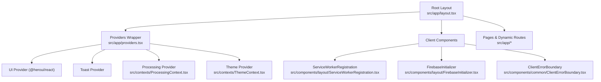
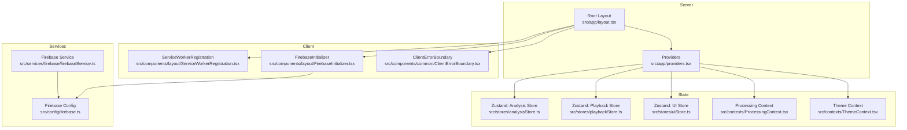
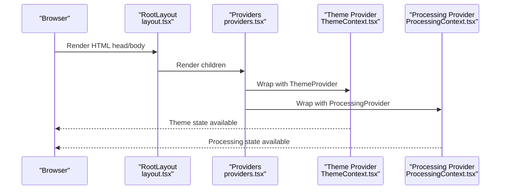
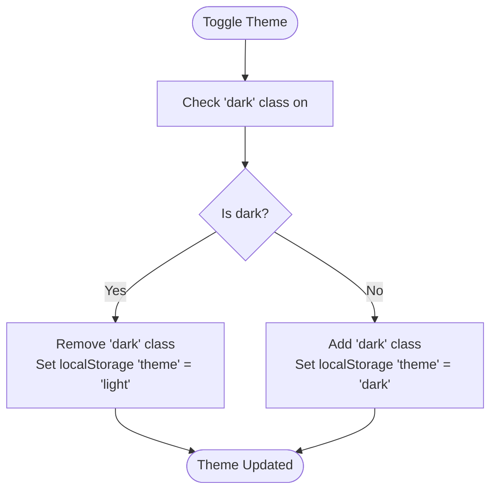
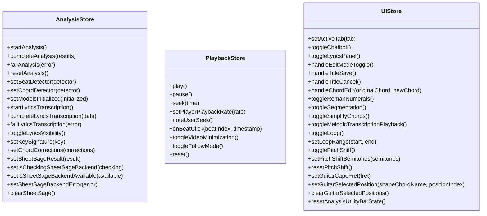
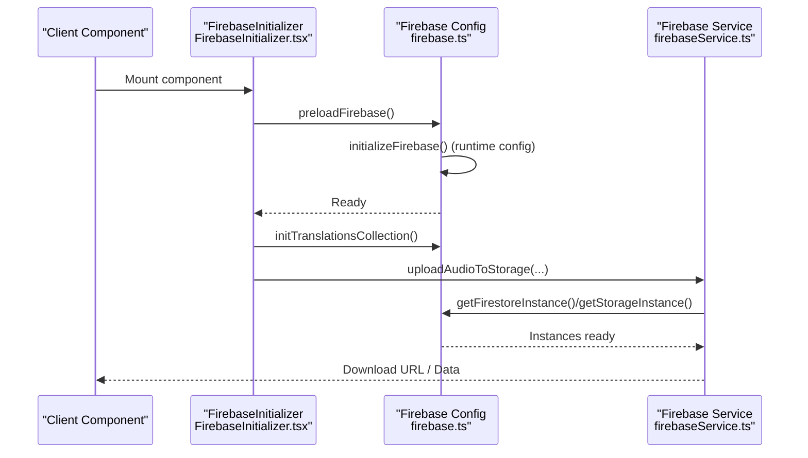
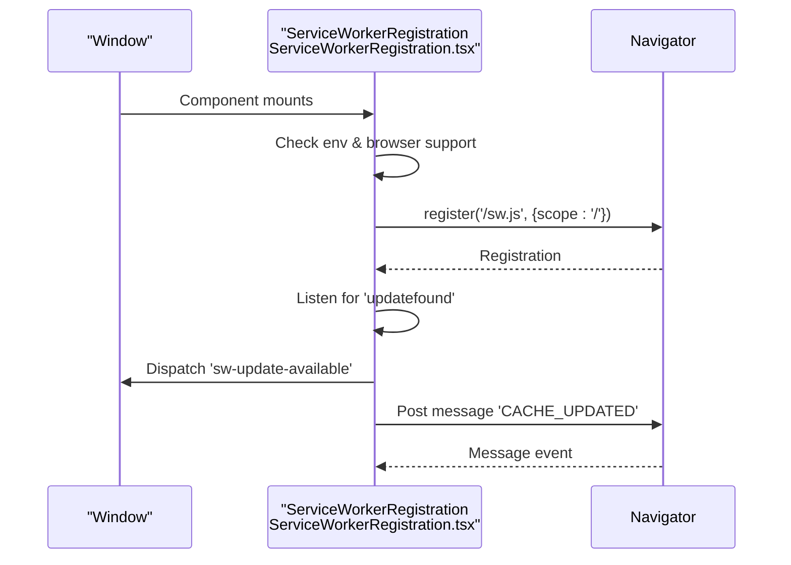
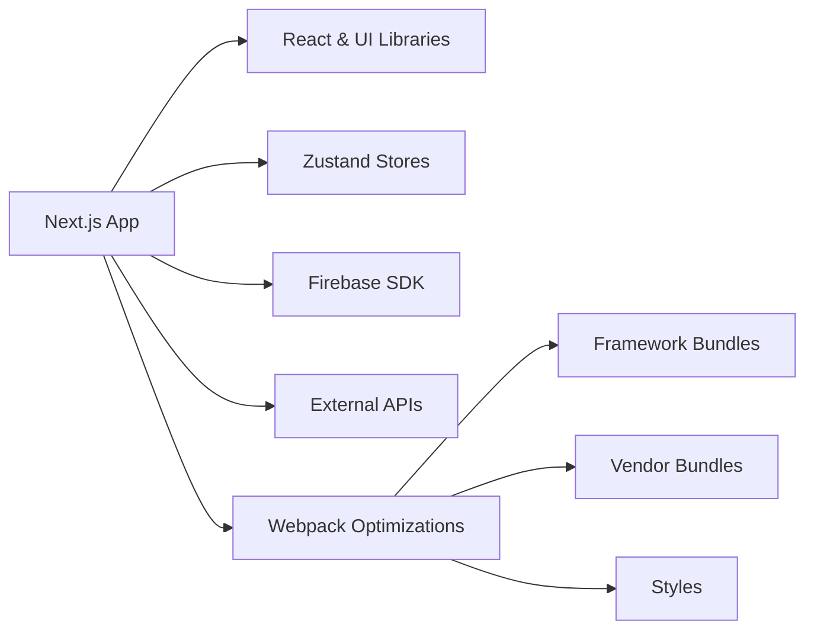

# Frontend Architecture

<cite>
**Referenced Files in This Document**
- [layout.tsx](file://src/app/layout.tsx)
- [providers.tsx](file://src/app/providers.tsx)
- [next.config.js](file://next.config.js)
- [tsconfig.json](file://tsconfig.json)
- [package.json](file://package.json)
- [ThemeContext.tsx](file://src/contexts/ThemeContext.tsx)
- [ProcessingContext.tsx](file://src/contexts/ProcessingContext.tsx)
- [analysisStore.ts](file://src/stores/analysisStore.ts)
- [playbackStore.ts](file://src/stores/playbackStore.ts)
- [uiStore.ts](file://src/stores/uiStore.ts)
- [firebaseService.ts](file://src/services/firebase/firebaseService.ts)
- [FirebaseInitializer.tsx](file://src/components/layout/FirebaseInitializer.tsx)
- [firebase.ts](file://src/config/firebase.ts)
- [ServiceWorkerRegistration.tsx](file://src/components/layout/ServiceWorkerRegistration.tsx)
- [ClientErrorBoundary.tsx](file://src/components/common/ClientErrorBoundary.tsx)
</cite>

## Table of Contents
1. [Introduction](#introduction)
2. [Project Structure](#project-structure)
3. [Core Components](#core-components)
4. [Architecture Overview](#architecture-overview)
5. [Detailed Component Analysis](#detailed-component-analysis)
6. [Dependency Analysis](#dependency-analysis)
7. [Performance Considerations](#performance-considerations)
8. [Troubleshooting Guide](#troubleshooting-guide)
9. [Conclusion](#conclusion)

## Introduction
This document describes the frontend architecture of the Next.js application. It explains the app router structure, server-side rendering, client-side hydration, component hierarchy, state management, performance optimizations, TypeScript configuration, build optimization, theming, responsiveness, accessibility, and integration with Firebase and external APIs.

## Project Structure
The application follows Next.js App Router conventions with a strict separation between server and client components. The root layout defines metadata, fonts, critical CSS, performance helpers, and providers. Providers wrap the application with UI, theme, and processing contexts. Client components manage service worker registration, Firebase initialization, error boundaries, and performance monitoring.



**Diagram sources**
- [layout.tsx:143-228](file://src/app/layout.tsx#L143-L228)
- [providers.tsx:12-31](file://src/app/providers.tsx#L12-L31)
- [ProcessingContext.tsx:44-184](file://src/contexts/ProcessingContext.tsx#L44-L184)
- [ThemeContext.tsx:44-70](file://src/contexts/ThemeContext.tsx#L44-L70)
- [ServiceWorkerRegistration.tsx:9-102](file://src/components/layout/ServiceWorkerRegistration.tsx#L9-L102)
- [FirebaseInitializer.tsx:12-61](file://src/components/layout/FirebaseInitializer.tsx#L12-L61)
- [ClientErrorBoundary.tsx:10-12](file://src/components/common/ClientErrorBoundary.tsx#L10-L12)

**Section sources**
- [layout.tsx:143-228](file://src/app/layout.tsx#L143-L228)
- [providers.tsx:12-27](file://src/app/providers.tsx#L12-L27)

## Core Components
- Root layout: Defines metadata, fonts, critical CSS, DNS prefetch, and composes providers and client components.
- Providers: Wraps children with TanStack Query, UI provider, toast provider, processing context, and theme context.
- Query layer: TanStack Query centralizes shared server-state reads for model info, recent transcriptions, Sheet Sage cache checks, and cached lyrics lookups.
- Theme context: Manages light/dark theme with useSyncExternalStore to avoid hydration mismatches.
- Processing context: Centralizes analysis lifecycle and timing metrics.
- Stores: Zustand stores for analysis, playback, and UI state with selector hooks for efficient re-renders.
- Firebase initializer: Lazily initializes Firebase and sets up collections and connection monitoring.
- Service worker registration: Conditionally registers a service worker in production.
- Error boundary: Client-side wrapper around a global error boundary.

**Section sources**
- [layout.tsx:19-228](file://src/app/layout.tsx#L19-L228)
- [providers.tsx:12-31](file://src/app/providers.tsx#L12-L31)
- [ThemeContext.tsx:44-70](file://src/contexts/ThemeContext.tsx#L44-L70)
- [ProcessingContext.tsx:44-184](file://src/contexts/ProcessingContext.tsx#L44-L184)
- [analysisStore.ts:101-295](file://src/stores/analysisStore.ts#L101-L295)
- [playbackStore.ts:101-451](file://src/stores/playbackStore.ts#L101-L451)
- [uiStore.ts:127-433](file://src/stores/uiStore.ts#L127-L433)
- [FirebaseInitializer.tsx:12-61](file://src/components/layout/FirebaseInitializer.tsx#L12-L61)
- [ServiceWorkerRegistration.tsx:9-102](file://src/components/layout/ServiceWorkerRegistration.tsx#L9-L102)
- [ClientErrorBoundary.tsx:10-12](file://src/components/common/ClientErrorBoundary.tsx#L10-L12)

## Architecture Overview
The frontend architecture centers on:
- App Router with dynamic routes under src/app (e.g., analyze/[videoId], lyrics/[videoId]).
- Strict client/server component boundaries enforced by "use client" directives.
- Providers pattern for query cache, UI, theme, and processing state.
- Zustand stores for global UI and playback state; TanStack Query owns remote read caching and invalidation.
- Firebase integration via a runtime-configurable initializer and service layer.
- Performance-first approach with critical CSS, font optimization, DNS prefetch, and service worker caching.



**Diagram sources**
- [layout.tsx:143-228](file://src/app/layout.tsx#L143-L228)
- [providers.tsx:12-31](file://src/app/providers.tsx#L12-L31)
- [ServiceWorkerRegistration.tsx:9-102](file://src/components/layout/ServiceWorkerRegistration.tsx#L9-L102)
- [FirebaseInitializer.tsx:12-61](file://src/components/layout/FirebaseInitializer.tsx#L12-L61)
- [ClientErrorBoundary.tsx:10-12](file://src/components/common/ClientErrorBoundary.tsx#L10-L12)
- [analysisStore.ts:101-295](file://src/stores/analysisStore.ts#L101-L295)
- [playbackStore.ts:101-451](file://src/stores/playbackStore.ts#L101-L451)
- [uiStore.ts:127-433](file://src/stores/uiStore.ts#L127-L433)
- [ProcessingContext.tsx:44-184](file://src/contexts/ProcessingContext.tsx#L44-L184)
- [ThemeContext.tsx:44-70](file://src/contexts/ThemeContext.tsx#L44-L70)
- [firebaseService.ts:34-153](file://src/services/firebase/firebaseService.ts#L34-L153)
- [firebase.ts:43-115](file://src/config/firebase.ts#L43-L115)

## Detailed Component Analysis

### Root Layout and Providers
- Root layout configures metadata, fonts, critical CSS, DNS prefetch, and injects performance helpers.
- Providers wrap children with UI provider, toast provider, processing provider, and theme provider.
- Client components are mounted inside Providers to ensure they run on the client.



**Diagram sources**
- [layout.tsx:143-228](file://src/app/layout.tsx#L143-L228)
- [providers.tsx:12-27](file://src/app/providers.tsx#L12-L27)
- [ThemeContext.tsx:44-70](file://src/contexts/ThemeContext.tsx#L44-L70)
- [ProcessingContext.tsx:44-184](file://src/contexts/ProcessingContext.tsx#L44-L184)

**Section sources**
- [layout.tsx:19-228](file://src/app/layout.tsx#L19-L228)
- [providers.tsx:12-27](file://src/app/providers.tsx#L12-L27)

### Theme Management
- Theme context uses useSyncExternalStore to read the DOM class set by a blocking script in the root layout.
- Toggling theme updates the HTML class and persists preference in localStorage.
- Hydration safety is ensured by returning a server snapshot and subscribing to DOM mutations.



**Diagram sources**
- [ThemeContext.tsx:54-63](file://src/contexts/ThemeContext.tsx#L54-L63)

**Section sources**
- [ThemeContext.tsx:22-70](file://src/contexts/ThemeContext.tsx#L22-L70)

### Processing Lifecycle
- Processing context tracks stage, progress, status message, and elapsed time.
- Timer runs at 100ms intervals; stops on completion or error.
- Provides actions to start, complete, fail, and reset processing.

```mermaid
stateDiagram-v2
[*] --> Idle
Idle --> Downloading : "startProcessing()"
Downloading --> Extracting : "setStage('extracting')"
Extracting --> "Beat-detection" : "setStage('beat-detection')"
"Beat-detection" --> "Chord-recognition" : "setStage('chord-recognition')"
"Chord-recognition" --> Complete : "completeProcessing()"
"Chord-recognition" --> Error : "failProcessing(error)"
Complete --> Idle : "reset()"
Error --> Idle : "reset()"
```

**Diagram sources**
- [ProcessingContext.tsx:44-184](file://src/contexts/ProcessingContext.tsx#L44-L184)

**Section sources**
- [ProcessingContext.tsx:44-184](file://src/contexts/ProcessingContext.tsx#L44-L184)

### State Management with Zustand
- Analysis store: orchestrates analysis results, model selection, cache state, lyrics, key detection, corrections, and SheetSage integration.
- Playback store: centralizes audio/video playback state, rate control, beat indices, seek coordination, and master clock synchronization.
- UI store: manages tabs, panels, editing modes, feature toggles, loop playback, pitch shift, and guitar voicing.



**Diagram sources**
- [analysisStore.ts:101-295](file://src/stores/analysisStore.ts#L101-L295)
- [playbackStore.ts:101-451](file://src/stores/playbackStore.ts#L101-L451)
- [uiStore.ts:127-433](file://src/stores/uiStore.ts#L127-L433)

**Section sources**
- [analysisStore.ts:101-295](file://src/stores/analysisStore.ts#L101-L295)
- [playbackStore.ts:101-451](file://src/stores/playbackStore.ts#L101-L451)
- [uiStore.ts:127-433](file://src/stores/uiStore.ts#L127-L433)

### Firebase Integration and Service Layer
- Runtime configuration: Firebase config is loaded at runtime from an API endpoint on the client or from environment variables on the server.
- Lazy initialization: Firebase is initialized on demand to avoid blocking initial load.
- Collections: Translations collection is initialized asynchronously; connection monitoring is set up separately.
- Service layer: Provides functions to save/retrieve lyrics, upload audio, and fetch metadata.



**Diagram sources**
- [FirebaseInitializer.tsx:12-61](file://src/components/layout/FirebaseInitializer.tsx#L12-L61)
- [firebase.ts:43-115](file://src/config/firebase.ts#L43-L115)
- [firebaseService.ts:132-153](file://src/services/firebase/firebaseService.ts#L132-L153)

**Section sources**
- [firebase.ts:43-115](file://src/config/firebase.ts#L43-L115)
- [firebase.ts:336-358](file://src/config/firebase.ts#L336-L358)
- [firebaseService.ts:34-153](file://src/services/firebase/firebaseService.ts#L34-L153)
- [FirebaseInitializer.tsx:12-61](file://src/components/layout/FirebaseInitializer.tsx#L12-L61)

### Service Worker Registration
- Registers a service worker in production with scope and update behavior.
- Emits a custom event when a new worker is installed.
- Logs cache updates and handles message events.



**Diagram sources**
- [ServiceWorkerRegistration.tsx:9-102](file://src/components/layout/ServiceWorkerRegistration.tsx#L9-L102)

**Section sources**
- [ServiceWorkerRegistration.tsx:9-102](file://src/components/layout/ServiceWorkerRegistration.tsx#L9-L102)

### Error Boundaries
- ClientErrorBoundary is a client component that wraps a global error boundary to ensure it runs on the client.
- This pattern isolates rendering errors and prevents full page crashes.

**Section sources**
- [ClientErrorBoundary.tsx:10-12](file://src/components/common/ClientErrorBoundary.tsx#L10-L12)

## Dependency Analysis
- Build-time dependencies: Next.js, React, Tailwind, Zustand, @heroui/react, Firebase SDKs.
- Runtime configuration: Environment variables for Firebase and App Check are consumed via runtime config.
- Bundle optimization: Webpack splitChunks consolidates framework, vendor, and styles; tree shaking enabled; hidden source maps in production.



**Diagram sources**
- [package.json:37-88](file://package.json#L37-L88)
- [next.config.js:198-344](file://next.config.js#L198-L344)

**Section sources**
- [package.json:37-88](file://package.json#L37-L88)
- [next.config.js:198-344](file://next.config.js#L198-L344)

## Performance Considerations
- Critical CSS injection: Inline critical above-the-fold styles in the document head to eliminate render-blocking.
- Font optimization: Configure Google Fonts with display swap and variable fonts; inline critical font-related CSS.
- DNS prefetch: Prefetch domains for YouTube, Google APIs, and Vercel to reduce latency.
- Bundle splitting: Aggressive splitChunks strategy separates framework, vendor, and styles for optimal caching.
- Tree shaking: Enable usedExports and concatenate modules to minimize bundle size.
- Source maps: Hidden source maps in production; eval-source-map in development.
- Image optimization: Remote patterns and quality tiers configured in next.config.js.
- Service worker: Optional caching and update notifications for improved offline and performance characteristics.
- CSP and CORS: Security headers configured to allow embeds and ads while maintaining safety.

**Section sources**
- [layout.tsx:150-208](file://src/app/layout.tsx#L150-L208)
- [next.config.js:34-184](file://next.config.js#L34-L184)
- [next.config.js:198-344](file://next.config.js#L198-L344)

## Troubleshooting Guide
- Firebase initialization failures: The runtime config loader validates required keys and falls back gracefully; check environment variables and network connectivity.
- Anonymous authentication retries: The auth setup includes exponential backoff and timeouts; verify reCAPTCHA site key and network stability.
- Service worker registration: Enabled only in production and requires browser support; inspect logs for registration/update errors.
- Error boundaries: ClientErrorBoundary ensures error handling runs on the client; verify that child components are marked as client components.

**Section sources**
- [firebase.ts:61-72](file://src/config/firebase.ts#L61-L72)
- [firebase.ts:200-252](file://src/config/firebase.ts#L200-L252)
- [ServiceWorkerRegistration.tsx:23-68](file://src/components/layout/ServiceWorkerRegistration.tsx#L23-L68)
- [ClientErrorBoundary.tsx:10-12](file://src/components/common/ClientErrorBoundary.tsx#L10-L12)

## Conclusion
The frontend architecture leverages Next.js App Router with strict client/server boundaries, a robust providers pattern, and Zustand stores for scalable state management. Performance is prioritized through critical CSS, font optimization, DNS prefetch, and build-time optimizations. Firebase integration is runtime-configured and lazily initialized, while service workers and error boundaries enhance reliability and user experience.
