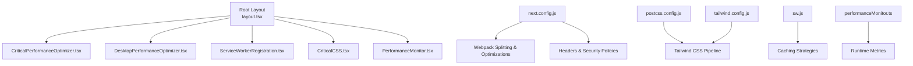
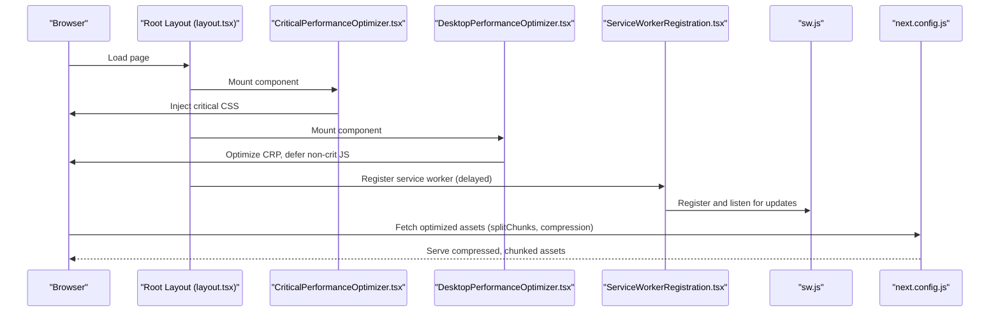
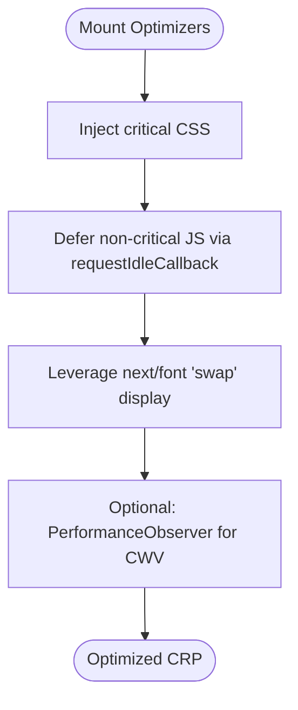
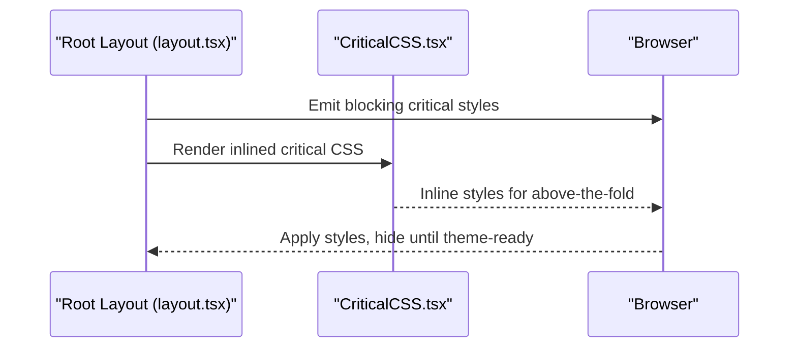
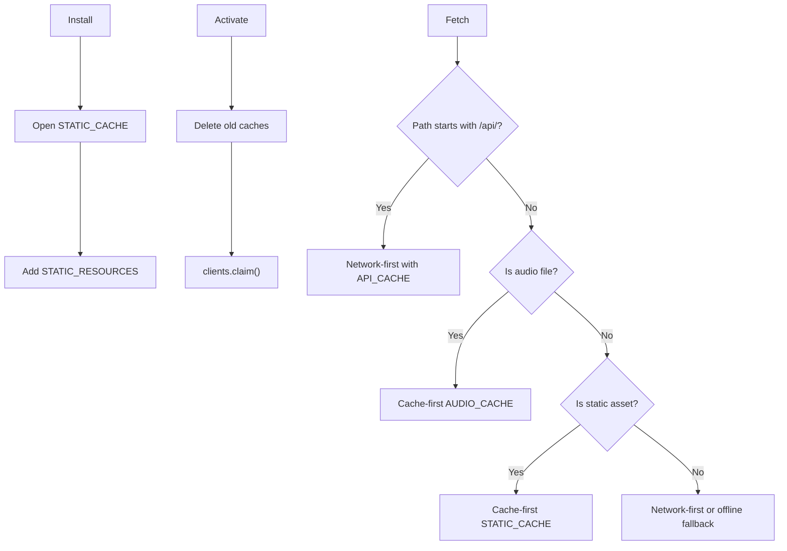
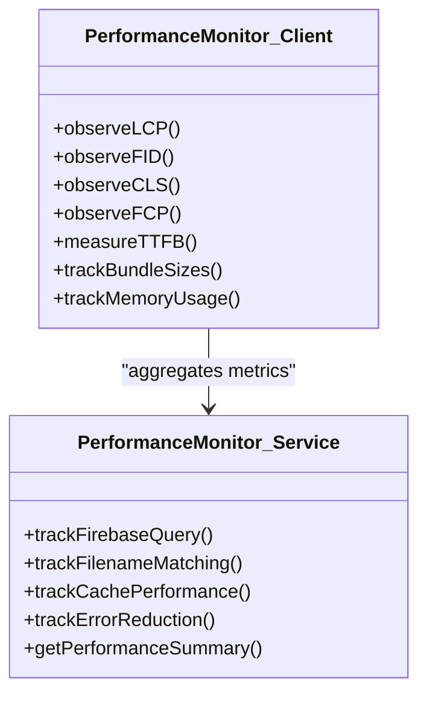
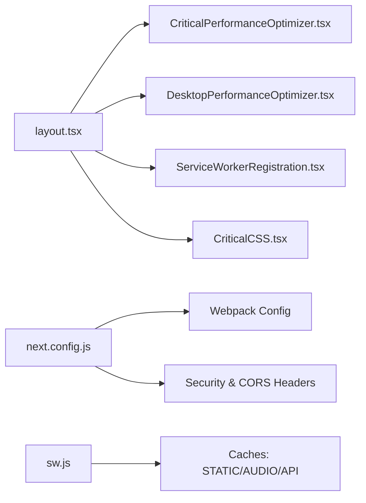

# Performance Optimization

<cite>
**Referenced Files in This Document**
- [CriticalPerformanceOptimizer.tsx](file://src/components/layout/CriticalPerformanceOptimizer.tsx)
- [DesktopPerformanceOptimizer.tsx](file://src/components/layout/DesktopPerformanceOptimizer.tsx)
- [CriticalCSS.tsx](file://src/components/layout/CriticalCSS.tsx)
- [ServiceWorkerRegistration.tsx](file://src/components/layout/ServiceWorkerRegistration.tsx)
- [layout.tsx](file://src/app/layout.tsx)
- [next.config.js](file://next.config.js)
- [postcss.config.js](file://postcss.config.js)
- [tailwind.config.js](file://tailwind.config.js)
- [performanceMonitor.ts](file://src/services/performance/performanceMonitor.ts)
- [PerformanceMonitor.tsx](file://src/components/layout/PerformanceMonitor.tsx)
- [sw.js](file://public/sw.js)
- [package.json](file://package.json)
- [useIntersectionObserver.ts](file://src/hooks/scroll/useIntersectionObserver.ts)
- [audioContextManager.ts](file://src/services/audio/audioContextManager.ts)
- [useChordPlayback.ts](file://src/hooks/chord-playback/useChordPlayback.ts)
- [retryUtils.ts](file://src/utils/retryUtils.ts)
</cite>

## Table of Contents
1. [Introduction](#introduction)
2. [Project Structure](#project-structure)
3. [Core Components](#core-components)
4. [Architecture Overview](#architecture-overview)
5. [Detailed Component Analysis](#detailed-component-analysis)
6. [Dependency Analysis](#dependency-analysis)
7. [Performance Considerations](#performance-considerations)
8. [Troubleshooting Guide](#troubleshooting-guide)
9. [Conclusion](#conclusion)
10. [Appendices](#appendices)

## Introduction
This document consolidates performance optimization strategies implemented across the ChordMiniApp frontend. It focuses on critical rendering path optimization, asset delivery, runtime performance, service worker caching, performance monitoring, and build-time optimizations. It also covers desktop vs mobile strategies, lazy loading patterns, CriticalCSS injection, font display optimization, resource hints, PostCSS/Tailwind configurations, CSS-in-JS considerations, and bundle size controls.

## Project Structure
The performance stack spans Next.js app configuration, client-side performance components, service worker, and supporting utilities:
- App shell and critical CSS injection in the root layout
- Client-side performance optimizers for critical path and desktop enhancements
- Service worker for caching and offline support
- Build configuration for bundling, splitting, and compression
- Monitoring utilities for Core Web Vitals and runtime metrics

**Diagram sources**
- [layout.tsx:143-227](file://src/app/layout.tsx#L143-L227)
- [CriticalPerformanceOptimizer.tsx:1-56](file://src/components/layout/CriticalPerformanceOptimizer.tsx#L1-L56)
- [DesktopPerformanceOptimizer.tsx:1-129](file://src/components/layout/DesktopPerformanceOptimizer.tsx#L1-L129)
- [ServiceWorkerRegistration.tsx:1-102](file://src/components/layout/ServiceWorkerRegistration.tsx#L1-L102)
- [CriticalCSS.tsx:1-246](file://src/components/layout/CriticalCSS.tsx#L1-L246)
- [PerformanceMonitor.tsx:1-246](file://src/components/layout/PerformanceMonitor.tsx#L1-L246)
- [next.config.js:197-384](file://next.config.js#L197-L384)
- [postcss.config.js:1-7](file://postcss.config.js#L1-L7)
- [tailwind.config.js:1-194](file://tailwind.config.js#L1-L194)
- [sw.js:1-177](file://public/sw.js#L1-L177)
- [performanceMonitor.ts:1-313](file://src/services/performance/performanceMonitor.ts#L1-L313)

**Section sources**
- [layout.tsx:143-227](file://src/app/layout.tsx#L143-L227)
- [next.config.js:197-384](file://next.config.js#L197-L384)

## Core Components
- CriticalPerformanceOptimizer: Injects minimal critical CSS and avoids post-paint DOM writes to prevent forced reflow and CLS.
- DesktopPerformanceOptimizer: Coordinates CSS loading, LCP image handling, resource bundling, critical path optimization, and progressive enhancement via PerformanceObserver.
- CriticalCSS: Inlines essential above-the-fold styles to reduce render-blocking CSS and improve FCP.
- ServiceWorkerRegistration: Registers a service worker with delayed startup, update handling, and messaging.
- sw.js: Implements cache-first strategies for static assets, cache-and-network for API, and offline fallbacks.
- PerformanceMonitor (client) and performanceMonitor (service): Track Core Web Vitals, bundle sizes, memory, and operational metrics.

**Section sources**
- [CriticalPerformanceOptimizer.tsx:1-56](file://src/components/layout/CriticalPerformanceOptimizer.tsx#L1-L56)
- [DesktopPerformanceOptimizer.tsx:1-129](file://src/components/layout/DesktopPerformanceOptimizer.tsx#L1-L129)
- [CriticalCSS.tsx:1-246](file://src/components/layout/CriticalCSS.tsx#L1-L246)
- [ServiceWorkerRegistration.tsx:1-102](file://src/components/layout/ServiceWorkerRegistration.tsx#L1-L102)
- [sw.js:1-177](file://public/sw.js#L1-L177)
- [PerformanceMonitor.tsx:1-246](file://src/components/layout/PerformanceMonitor.tsx#L1-L246)
- [performanceMonitor.ts:1-313](file://src/services/performance/performanceMonitor.ts#L1-L313)

## Architecture Overview
The performance architecture integrates build-time optimizations with runtime strategies:
- Build-time: Webpack splitChunks, usedExports, concatenateModules, hidden-source-map, and compression.
- Runtime: Critical CSS injection, font-display swap, resource hints, lazy loading, and service worker caching.
- Monitoring: Client-side CWV observers and server/service metrics.

**Diagram sources**
- [layout.tsx:143-227](file://src/app/layout.tsx#L143-L227)
- [CriticalPerformanceOptimizer.tsx:1-56](file://src/components/layout/CriticalPerformanceOptimizer.tsx#L1-L56)
- [DesktopPerformanceOptimizer.tsx:1-129](file://src/components/layout/DesktopPerformanceOptimizer.tsx#L1-L129)
- [ServiceWorkerRegistration.tsx:1-102](file://src/components/layout/ServiceWorkerRegistration.tsx#L1-L102)
- [sw.js:1-177](file://public/sw.js#L1-L177)
- [next.config.js:197-384](file://next.config.js#L197-L384)

## Detailed Component Analysis

### Critical Rendering Path Optimization
- CriticalPerformanceOptimizer injects minimal critical CSS and avoids post-paint DOM mutations to prevent forced reflow and CLS.
- DesktopPerformanceOptimizer defers non-critical JavaScript via requestIdleCallback and coordinates font loading handled by next/font.

**Diagram sources**
- [CriticalPerformanceOptimizer.tsx:1-56](file://src/components/layout/CriticalPerformanceOptimizer.tsx#L1-L56)
- [DesktopPerformanceOptimizer.tsx:45-103](file://src/components/layout/DesktopPerformanceOptimizer.tsx#L45-L103)

**Section sources**
- [CriticalPerformanceOptimizer.tsx:1-56](file://src/components/layout/CriticalPerformanceOptimizer.tsx#L1-L56)
- [DesktopPerformanceOptimizer.tsx:1-129](file://src/components/layout/DesktopPerformanceOptimizer.tsx#L1-L129)

### CriticalCSS Injection Technique
- CriticalCSS component inlines above-the-fold styles to eliminate render-blocking CSS and accelerate FCP.
- Root layout also injects critical styles via a blocking <style> to ensure visibility before first paint and to set font-display to swap.

**Diagram sources**
- [layout.tsx:162-208](file://src/app/layout.tsx#L162-L208)
- [CriticalCSS.tsx:1-246](file://src/components/layout/CriticalCSS.tsx#L1-L246)

**Section sources**
- [layout.tsx:162-208](file://src/app/layout.tsx#L162-L208)
- [CriticalCSS.tsx:1-246](file://src/components/layout/CriticalCSS.tsx#L1-L246)

### Font Display Optimization
- next/font is configured with display: 'swap' to prevent FOIT/FOUT and keep layouts stable during font load.
- Root layout adds a @font-face swap declaration as a safety net.

**Section sources**
- [layout.tsx:20-40](file://src/app/layout.tsx#L20-L40)
- [layout.tsx:176-178](file://src/app/layout.tsx#L176-L178)

### Resource Hint Configuration
- DNS prefetch links are added for external domains used by the app.
- Next.js handles image priority and route-level code splitting; explicit preloads are avoided to prevent preload-not-used warnings.

**Section sources**
- [layout.tsx:201-207](file://src/app/layout.tsx#L201-L207)

### Asset Delivery Strategies
- Webpack splitChunks groups framework, vendor, and styles with priorities to reduce duplication and improve caching.
- Compression is enabled; hidden source maps are used in production to avoid browser warnings while preserving debugging capability.
- Turbopack rules for audio files ensure correct handling.

**Section sources**
- [next.config.js:197-344](file://next.config.js#L197-L344)

### Service Worker Implementation and Caching
- ServiceWorkerRegistration registers the worker after a short delay, listens for updates, and handles messages.
- sw.js implements:
  - Static cache for core pages and assets
  - Audio cache-first strategy
  - API cache-and-network with fallback to cache
  - Offline fallback for page requests
  - Background sync placeholder

**Diagram sources**
- [sw.js:22-155](file://public/sw.js#L22-L155)
- [ServiceWorkerRegistration.tsx:1-102](file://src/components/layout/ServiceWorkerRegistration.tsx#L1-L102)

**Section sources**
- [ServiceWorkerRegistration.tsx:1-102](file://src/components/layout/ServiceWorkerRegistration.tsx#L1-L102)
- [sw.js:1-177](file://public/sw.js#L1-L177)

### Lazy Loading Patterns
- useIntersectionObserver provides viewport-based lazy loading with configurable thresholds and root margins.
- Route-level code splitting is leveraged by Next.js; explicit preloads are avoided to prevent preload-not-used warnings.

**Section sources**
- [useIntersectionObserver.ts:1-46](file://src/hooks/scroll/useIntersectionObserver.ts#L1-L46)
- [layout.tsx:199-200](file://src/app/layout.tsx#L199-L200)

### Runtime Performance Improvements
- AudioContextManager centralizes AudioContext creation and resume logic to handle autoplay policies gracefully.
- Playback hooks adapt to visibility changes and background polling to maintain smooth playback across tab switches.

**Section sources**
- [audioContextManager.ts:1-91](file://src/services/audio/audioContextManager.ts#L1-L91)
- [useChordPlayback.ts:502-540](file://src/hooks/chord-playback/useChordPlayback.ts#L502-L540)

### PostCSS and Tailwind CSS Optimization
- PostCSS pipeline includes Tailwind CSS and Autoprefixer.
- Tailwind is configured with content globs, safelist for dynamic grid columns, dark mode, theme extensions, and Heroui plugin.

**Section sources**
- [postcss.config.js:1-7](file://postcss.config.js#L1-L7)
- [tailwind.config.js:1-194](file://tailwind.config.js#L1-L194)

### CSS-in-JS Performance Considerations
- The codebase relies on CSS-in-JS via styled JSX and Tailwind classes. CriticalCSS.tsx inlines essential styles to minimize FOUC and render-blocking CSS.
- Avoid excessive dynamic styles at runtime; leverage static CSS classes and critical inlining.

**Section sources**
- [CriticalCSS.tsx:1-246](file://src/components/layout/CriticalCSS.tsx#L1-L246)

### Bundle Size Optimization
- Webpack splitChunks consolidates framework, vendor, and styles with explicit priorities.
- Tree shaking and module concatenation are enabled; usedExports and providedExports are configured.
- Bundle analyzer scripts are available for analysis.

**Section sources**
- [next.config.js:197-344](file://next.config.js#L197-L344)
- [package.json:29-31](file://package.json#L29-L31)

### Performance Monitoring and Core Web Vitals
- Client-side PerformanceMonitor tracks LCP, FID, CLS, FCP, TTFB, bundle sizes, and memory usage.
- Server/service performanceMonitor tracks Firebase queries, filename matching accuracy, cache performance, and error reduction.

**Diagram sources**
- [PerformanceMonitor.tsx:1-246](file://src/components/layout/PerformanceMonitor.tsx#L1-L246)
- [performanceMonitor.ts:1-313](file://src/services/performance/performanceMonitor.ts#L1-L313)

**Section sources**
- [PerformanceMonitor.tsx:1-246](file://src/components/layout/PerformanceMonitor.tsx#L1-L246)
- [performanceMonitor.ts:1-313](file://src/services/performance/performanceMonitor.ts#L1-L313)

### Progressive Enhancement Patterns
- DesktopPerformanceOptimizer progressively enhances performance by deferring non-critical tasks and optionally observing CWVs in development.
- Root layout applies theme readiness and critical styles before first paint.

**Section sources**
- [DesktopPerformanceOptimizer.tsx:76-103](file://src/components/layout/DesktopPerformanceOptimizer.tsx#L76-L103)
- [layout.tsx:151-156](file://src/app/layout.tsx#L151-L156)

## Dependency Analysis
- Root layout composes multiple performance components and initializes providers and error boundaries.
- next.config.js defines bundling, splitting, compression, headers, and security policies.
- sw.js depends on cache names and routing logic to implement caching strategies.

**Diagram sources**
- [layout.tsx:143-227](file://src/app/layout.tsx#L143-L227)
- [next.config.js:197-384](file://next.config.js#L197-L384)
- [sw.js:1-177](file://public/sw.js#L1-L177)

**Section sources**
- [layout.tsx:143-227](file://src/app/layout.tsx#L143-L227)
- [next.config.js:197-384](file://next.config.js#L197-L384)

## Performance Considerations
- Critical path: Ensure critical CSS is inlined and fonts use 'swap'. Avoid post-paint DOM mutations.
- Bundling: Keep splitChunks priorities balanced; monitor bundle sizes and split large vendor chunks.
- Caching: Use cache-first for static assets, cache-and-network for API, and offline fallbacks.
- Observability: Enable CWV monitoring in development; track runtime metrics in production.
- Audio: Handle autoplay policies and resume logic carefully; minimize background work on visibility changes.

[No sources needed since this section provides general guidance]

## Troubleshooting Guide
- Service worker not updating: Verify registration scope and updateViaCache settings; check for harmless update check failures.
- Poor CWVs: Inspect bundle sizes, CLS sources, and TTFB; adjust caching and bundling accordingly.
- Audio playback issues: Confirm AudioContext resume and visibility change handlers; avoid heavy work on background tabs.
- Cache misses: Review cache names and routing logic; ensure API and audio caches are populated.

**Section sources**
- [ServiceWorkerRegistration.tsx:52-63](file://src/components/layout/ServiceWorkerRegistration.tsx#L52-L63)
- [PerformanceMonitor.tsx:151-218](file://src/components/layout/PerformanceMonitor.tsx#L151-L218)
- [audioContextManager.ts:50-91](file://src/services/audio/audioContextManager.ts#L50-L91)
- [sw.js:73-100](file://public/sw.js#L73-L100)

## Conclusion
The ChordMiniApp employs a layered performance strategy: critical CSS injection, font-display swap, resource hints, robust service worker caching, and comprehensive monitoring. Build-time optimizations via Webpack and Next.js complement runtime enhancements, ensuring fast, reliable experiences across devices.

[No sources needed since this section summarizes without analyzing specific files]

## Appendices

### Build Optimization Techniques
- Webpack splitChunks priorities for framework, vendor, and styles
- Tree shaking and module concatenation
- Hidden source maps in production
- Compression and ETags

**Section sources**
- [next.config.js:197-344](file://next.config.js#L197-L344)

### Code Splitting Strategies
- Route-level code splitting via Next.js
- Explicit preloads avoided to prevent preload-not-used warnings

**Section sources**
- [layout.tsx:199-200](file://src/app/layout.tsx#L199-L200)

### Asset Compression Approaches
- Compression enabled in next.config.js
- Image optimization with quality tiers and remote patterns

**Section sources**
- [next.config.js:96-125](file://next.config.js#L96-L125)

### Additional Utilities
- Retry strategies for external requests with cache-busting headers and URL modifiers
- IntersectionObserver-based lazy loading hook

**Section sources**
- [retryUtils.ts:36-87](file://src/utils/retryUtils.ts#L36-L87)
- [useIntersectionObserver.ts:1-46](file://src/hooks/scroll/useIntersectionObserver.ts#L1-L46)