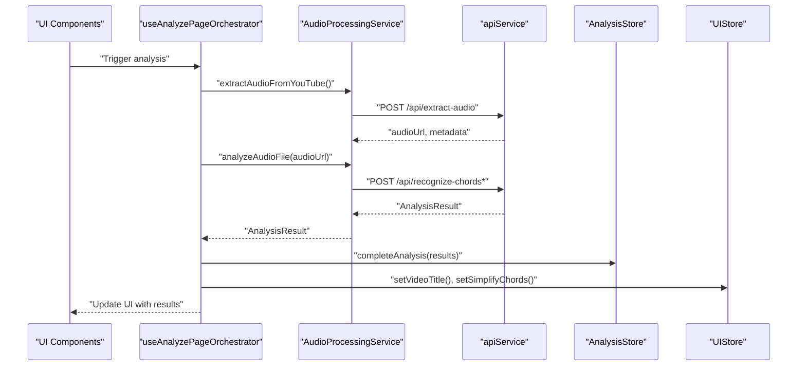
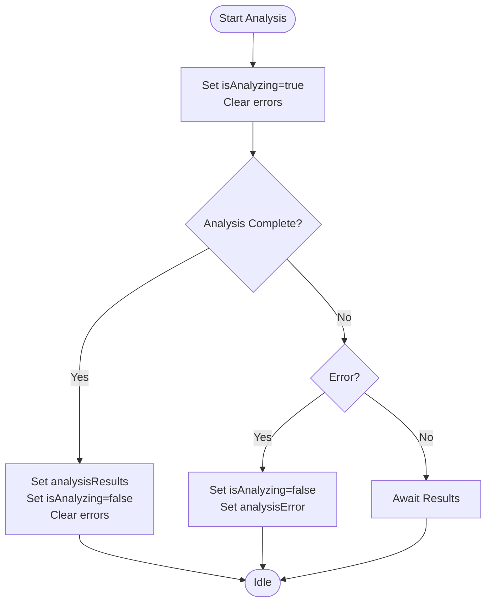
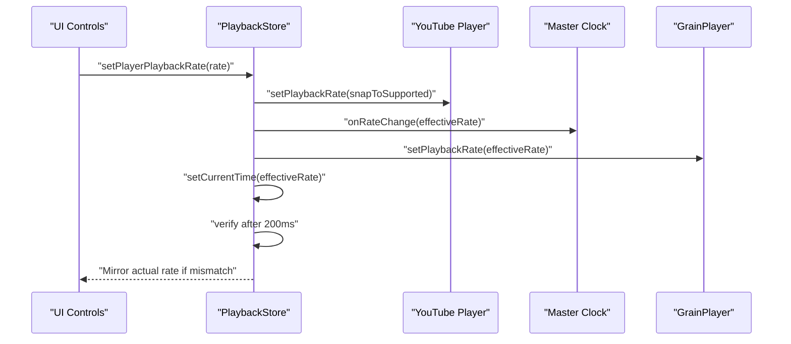
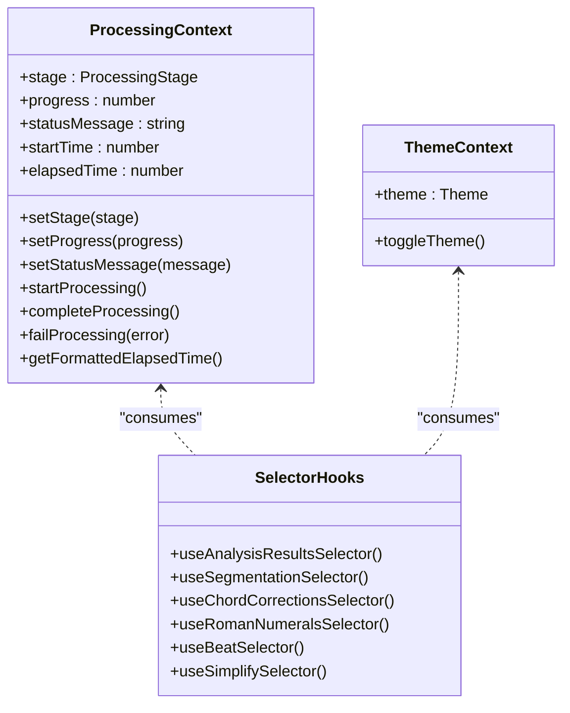
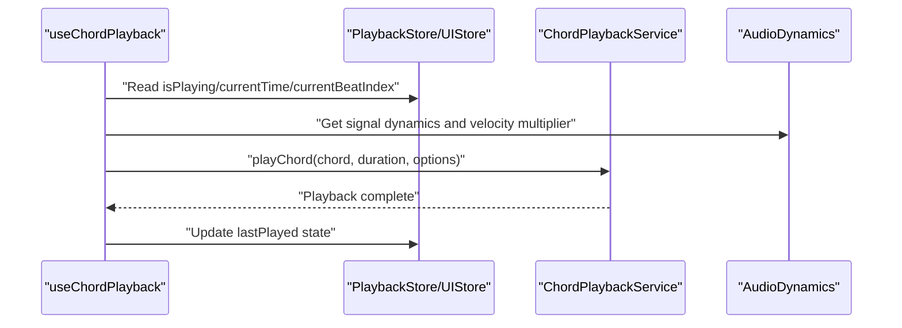
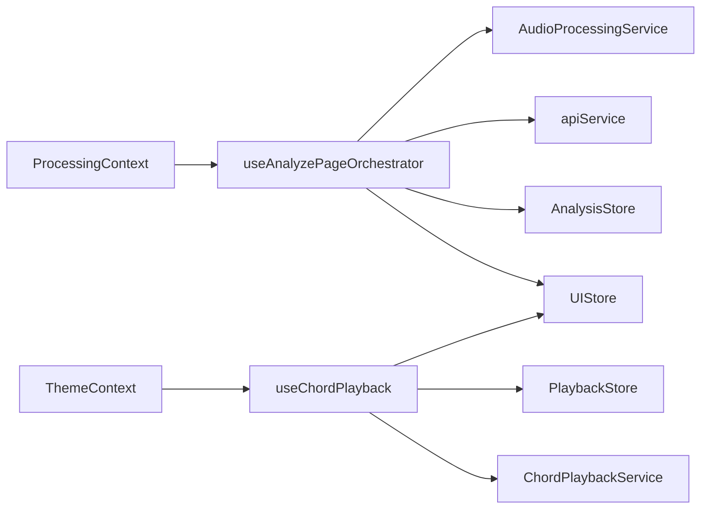

# State Management

<cite>
**Referenced Files in This Document**
- [analysisStore.ts](file://src/stores/analysisStore.ts)
- [playbackStore.ts](file://src/stores/playbackStore.ts)
- [uiStore.ts](file://src/stores/uiStore.ts)
- [providers.tsx](file://src/app/providers.tsx)
- [ProcessingContext.tsx](file://src/contexts/ProcessingContext.tsx)
- [ThemeContext.tsx](file://src/contexts/ThemeContext.tsx)
- [selectors.ts](file://src/contexts/selectors.ts)
- [useAnalyzePageOrchestrator.ts](file://src/hooks/analyze/useAnalyzePageOrchestrator.ts)
- [useChordPlayback.ts](file://src/hooks/chord-playback/useChordPlayback.ts)
- [apiService.ts](file://src/services/api/apiService.ts)
- [audioProcessingService.ts](file://src/services/audio/audioProcessingService.ts)
</cite>

## Table of Contents
1. [Introduction](#introduction)
2. [Project Structure](#project-structure)
3. [Core Components](#core-components)
4. [Architecture Overview](#architecture-overview)
5. [Detailed Component Analysis](#detailed-component-analysis)
6. [Dependency Analysis](#dependency-analysis)
7. [Performance Considerations](#performance-considerations)
8. [Troubleshooting Guide](#troubleshooting-guide)
9. [Conclusion](#conclusion)
10. [Appendices](#appendices)

## Introduction
This document explains the hybrid state management architecture used in the application. It combines Zustand stores for global state, React Context providers for UI and processing state, and custom hooks for data fetching, state updates, and side effects. The focus areas are:
- Global state stores: analysis store, playback store, and UI store
- Provider hierarchy and context integration
- State synchronization strategies across stores and services
- Cross-component communication patterns
- Service layer integration, API call patterns, and error handling
- Persistence strategies, performance optimization, and memory management
- Debugging tools, development patterns, and testing approaches

## Project Structure
The state management spans three primary layers:
- Stores (Zustand): encapsulate global state and actions for analysis, playback, and UI
- Context Providers: manage UI and processing state with React’s Context API
- Hooks: orchestrate service calls, synchronize state, and coordinate cross-component updates

```mermaid
graph TB
subgraph "Providers"
Providers["Providers (providers.tsx)"]
ProcessingProvider["ProcessingProvider (ProcessingContext.tsx)"]
ThemeProvider["ThemeProvider (ThemeContext.tsx)"]
end
subgraph "Zustand Stores"
AnalysisStore["AnalysisStore (analysisStore.ts)"]
PlaybackStore["PlaybackStore (playbackStore.ts)"]
UIStore["UIStore (uiStore.ts)"]
end
subgraph "Hooks"
OrchestratorHook["useAnalyzePageOrchestrator (useAnalyzePageOrchestrator.ts)"]
ChordPlaybackHook["useChordPlayback (useChordPlayback.ts)"]
end
subgraph "Services"
APIService["apiService (apiService.ts)"]
AudioProcSvc["AudioProcessingService (audioProcessingService.ts)"]
end
Providers --> ProcessingProvider
Providers --> ThemeProvider
Providers --> AnalysisStore
Providers --> PlaybackStore
Providers --> UIStore
OrchestratorHook --> AudioProcSvc
AudioProcSvc --> APIService
OrchestratorHook --> AnalysisStore
OrchestratorHook --> UIStore
ChordPlaybackHook --> PlaybackStore
ChordPlaybackHook --> UIStore
```

**Diagram sources**
- [providers.tsx:12-27](file://src/app/providers.tsx#L12-L27)
- [ProcessingContext.tsx:44-183](file://src/contexts/ProcessingContext.tsx#L44-L183)
- [ThemeContext.tsx:44-70](file://src/contexts/ThemeContext.tsx#L44-L70)
- [analysisStore.ts:101-295](file://src/stores/analysisStore.ts#L101-L295)
- [playbackStore.ts:101-452](file://src/stores/playbackStore.ts#L101-L452)
- [uiStore.ts:127-434](file://src/stores/uiStore.ts#L127-L434)
- [useAnalyzePageOrchestrator.ts:243-800](file://src/hooks/analyze/useAnalyzePageOrchestrator.ts#L243-L800)
- [useChordPlayback.ts:250-739](file://src/hooks/chord-playback/useChordPlayback.ts#L250-L739)
- [apiService.ts:29-407](file://src/services/api/apiService.ts#L29-L407)
- [audioProcessingService.ts:43-468](file://src/services/audio/audioProcessingService.ts#L43-L468)

**Section sources**
- [providers.tsx:12-27](file://src/app/providers.tsx#L12-L27)
- [ProcessingContext.tsx:44-183](file://src/contexts/ProcessingContext.tsx#L44-L183)
- [ThemeContext.tsx:44-70](file://src/contexts/ThemeContext.tsx#L44-L70)

## Core Components
This section introduces the three global stores and their roles:
- Analysis Store: manages analysis lifecycle, model selection, cache state, lyrics, key detection, chord corrections, and SheetSage integration
- Playback Store: centralizes audio/video playback state, beat tracking, rate control, and seek coordination
- UI Store: controls tabs, panels, editing modes, feature toggles, loop playback, pitch shift, and guitar voicing

Key patterns:
- Each store exposes typed actions and selector hooks for optimized re-renders
- Stores integrate with service layer APIs and update state accordingly
- Context providers complement stores for UI and processing state

**Section sources**
- [analysisStore.ts:14-99](file://src/stores/analysisStore.ts#L14-L99)
- [playbackStore.ts:35-99](file://src/stores/playbackStore.ts#L35-L99)
- [uiStore.ts:30-125](file://src/stores/uiStore.ts#L30-L125)

## Architecture Overview
The hybrid architecture blends Zustand stores with React Context providers and custom hooks:
- Providers wrap the app and supply UI and processing contexts alongside Zustand stores
- Hooks orchestrate service calls and synchronize state across stores
- Services encapsulate API interactions and caching logic



**Diagram sources**
- [useAnalyzePageOrchestrator.ts:541-616](file://src/hooks/analyze/useAnalyzePageOrchestrator.ts#L541-L616)
- [audioProcessingService.ts:111-234](file://src/services/audio/audioProcessingService.ts#L111-L234)
- [apiService.ts:324-343](file://src/services/api/apiService.ts#L324-L343)
- [analysisStore.ts:141-150](file://src/stores/analysisStore.ts#L141-L150)
- [uiStore.ts:194-196](file://src/stores/uiStore.ts#L194-L196)

## Detailed Component Analysis

### Analysis Store
Responsibilities:
- Track analysis lifecycle (start, complete, fail, reset)
- Manage model selection and initialization flags
- Handle cache availability and checks
- Manage lyrics transcription lifecycle and visibility
- Track key signature detection state
- Coordinate chord corrections and SheetSage results

Patterns:
- Actions are pure setters or composed transitions
- Selector hooks isolate slices of state for efficient re-renders
- Devtools middleware is conditionally enabled in development



**Diagram sources**
- [analysisStore.ts:131-191](file://src/stores/analysisStore.ts#L131-L191)

**Section sources**
- [analysisStore.ts:14-99](file://src/stores/analysisStore.ts#L14-L99)
- [analysisStore.ts:297-367](file://src/stores/analysisStore.ts#L297-L367)

### Playback Store
Responsibilities:
- Centralized playback state for audio/video players
- Beat tracking indices and beat click handling
- Playback rate control with cross-surface synchronization
- Seek coordination with cancellation tokens and user-seek fences
- Master clock integration for unified timekeeping

Key mechanisms:
- Rate control fans out to YouTube iframe, master clock, pitch shift service, and HTML5 audio
- Verification loop ensures effective rate matches across surfaces
- User-seek coordination prevents conflicts between user scrubbing and drift correction



**Diagram sources**
- [playbackStore.ts:172-351](file://src/stores/playbackStore.ts#L172-L351)
- [playbackStore.ts:487-490](file://src/stores/playbackStore.ts#L487-L490)

**Section sources**
- [playbackStore.ts:35-99](file://src/stores/playbackStore.ts#L35-L99)
- [playbackStore.ts:454-513](file://src/stores/playbackStore.ts#L454-L513)

### UI Store
Responsibilities:
- Tab management and panel toggles with mutual exclusivity
- Editing modes for titles and chords
- Feature toggles: Roman numerals, segmentation, simplification, melodic transcription playback
- Loop playback configuration and pitch shift controls
- Guitar voicing state and shared selections

Patterns:
- Actions encapsulate state transitions and derived calculations (e.g., target key computation)
- Selector hooks expose minimal state slices for granular re-renders
- Initialization helpers ensure consistent state bootstrapping

**Section sources**
- [uiStore.ts:30-125](file://src/stores/uiStore.ts#L30-L125)
- [uiStore.ts:436-517](file://src/stores/uiStore.ts#L436-L517)

### Context Providers and Selector Hooks
- ProcessingContext: manages processing stages, progress, and elapsed time for UI feedback
- ThemeContext: synchronizes theme state with DOM and localStorage
- Selector hooks: provide optimized access to specific store slices



**Diagram sources**
- [ProcessingContext.tsx:14-28](file://src/contexts/ProcessingContext.tsx#L14-L28)
- [ThemeContext.tsx:7-10](file://src/contexts/ThemeContext.tsx#L7-L10)
- [selectors.ts:21-64](file://src/contexts/selectors.ts#L21-L64)

**Section sources**
- [ProcessingContext.tsx:44-183](file://src/contexts/ProcessingContext.tsx#L44-L183)
- [ThemeContext.tsx:44-70](file://src/contexts/ThemeContext.tsx#L44-L70)
- [selectors.ts:1-65](file://src/contexts/selectors.ts#L1-L65)

### Custom Hooks: Orchestration and Playback
- useAnalyzePageOrchestrator: coordinates audio extraction, analysis, cache checks, and enrichment; integrates with stores and services
- useChordPlayback: schedules chord playback synchronized with beat animation and audio time; manages instruments and dynamics



**Diagram sources**
- [useChordPlayback.ts:555-665](file://src/hooks/chord-playback/useChordPlayback.ts#L555-L665)
- [playbackStore.ts:455-466](file://src/stores/playbackStore.ts#L455-L466)
- [uiStore.ts:484-494](file://src/stores/uiStore.ts#L484-L494)

**Section sources**
- [useAnalyzePageOrchestrator.ts:243-800](file://src/hooks/analyze/useAnalyzePageOrchestrator.ts#L243-L800)
- [useChordPlayback.ts:250-739](file://src/hooks/chord-playback/useChordPlayback.ts#L250-L739)

## Dependency Analysis
Cross-cutting dependencies:
- Hooks depend on services for API calls and on stores for state updates
- Stores depend on services for model inference and caching
- Context providers supply UI and processing state complementary to stores



**Diagram sources**
- [useAnalyzePageOrchestrator.ts:541-616](file://src/hooks/analyze/useAnalyzePageOrchestrator.ts#L541-L616)
- [useChordPlayback.ts:250-739](file://src/hooks/chord-playback/useChordPlayback.ts#L250-L739)
- [audioProcessingService.ts:111-234](file://src/services/audio/audioProcessingService.ts#L111-L234)
- [apiService.ts:324-343](file://src/services/api/apiService.ts#L324-L343)
- [ProcessingContext.tsx:163-183](file://src/contexts/ProcessingContext.tsx#L163-L183)
- [ThemeContext.tsx:65-70](file://src/contexts/ThemeContext.tsx#L65-L70)

**Section sources**
- [analysisStore.ts:101-295](file://src/stores/analysisStore.ts#L101-L295)
- [playbackStore.ts:101-452](file://src/stores/playbackStore.ts#L101-L452)
- [uiStore.ts:127-434](file://src/stores/uiStore.ts#L127-L434)

## Performance Considerations
- Optimized re-renders: selector hooks isolate state slices to minimize component updates
- Idempotent rate changes: playback store short-circuits repeated rate updates and verifies effective rates asynchronously
- Background tab handling: chord playback switches to a polling mechanism to avoid unnecessary rAF usage
- Client-side rate limiting: API service enforces client-side limits to prevent overloading servers
- Memoization: hooks compute schedules and derived values with memoization to reduce recomputation
- Devtools gating: middleware is disabled in production to avoid overhead

[No sources needed since this section provides general guidance]

## Troubleshooting Guide
Common issues and strategies:
- Playback rate mismatches: verify effective rate alignment across YouTube, master clock, and pitch shift service; rely on built-in verification
- Stale cache data: ensure cache checks occur after extraction and analysis; clear caches when models change
- Timeout errors: adjust timeouts for long-running operations; use retry logic where appropriate
- Rate limiting: respect client and server limits; handle rate-limited responses gracefully
- Memory leaks: ensure cleanup of intervals and listeners in hooks; stop playback and clear refs on unmount

**Section sources**
- [playbackStore.ts:310-351](file://src/stores/playbackStore.ts#L310-L351)
- [apiService.ts:74-241](file://src/services/api/apiService.ts#L74-L241)
- [useChordPlayback.ts:534-551](file://src/hooks/chord-playback/useChordPlayback.ts#L534-L551)

## Conclusion
The hybrid state management architecture leverages Zustand stores for global, high-performance state, React Context providers for UI and processing concerns, and custom hooks to orchestrate service interactions and cross-component synchronization. This design balances developer ergonomics, performance, and maintainability while supporting complex workflows like audio analysis, playback, and real-time UI updates.

[No sources needed since this section summarizes without analyzing specific files]

## Appendices

### Provider Hierarchy and Integration
- Providers wrap the app and establish UI and processing contexts alongside Zustand stores
- Contexts complement stores by providing UI-centric state not suitable for global stores
- Selector hooks enable fine-grained access to store slices for optimal rendering

**Section sources**
- [providers.tsx:12-27](file://src/app/providers.tsx#L12-L27)
- [ProcessingContext.tsx:163-183](file://src/contexts/ProcessingContext.tsx#L163-L183)
- [ThemeContext.tsx:65-70](file://src/contexts/ThemeContext.tsx#L65-L70)
- [selectors.ts:21-64](file://src/contexts/selectors.ts#L21-L64)

### Service Layer Integration and API Patterns
- API service centralizes request logic, rate limiting, and error handling
- Audio processing service orchestrates extraction, analysis, and caching
- Hooks call service methods and update stores accordingly

**Section sources**
- [apiService.ts:29-407](file://src/services/api/apiService.ts#L29-L407)
- [audioProcessingService.ts:43-468](file://src/services/audio/audioProcessingService.ts#L43-L468)
- [useAnalyzePageOrchestrator.ts:541-616](file://src/hooks/analyze/useAnalyzePageOrchestrator.ts#L541-L616)