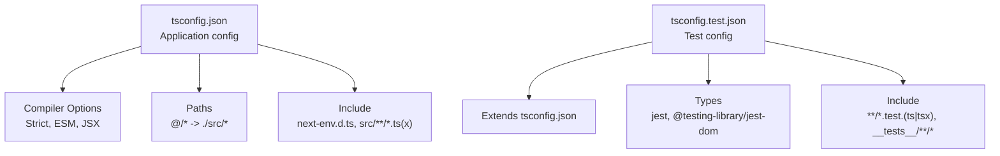
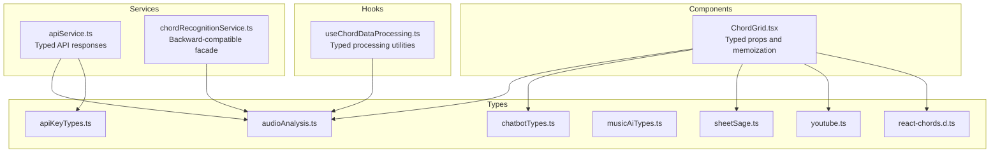
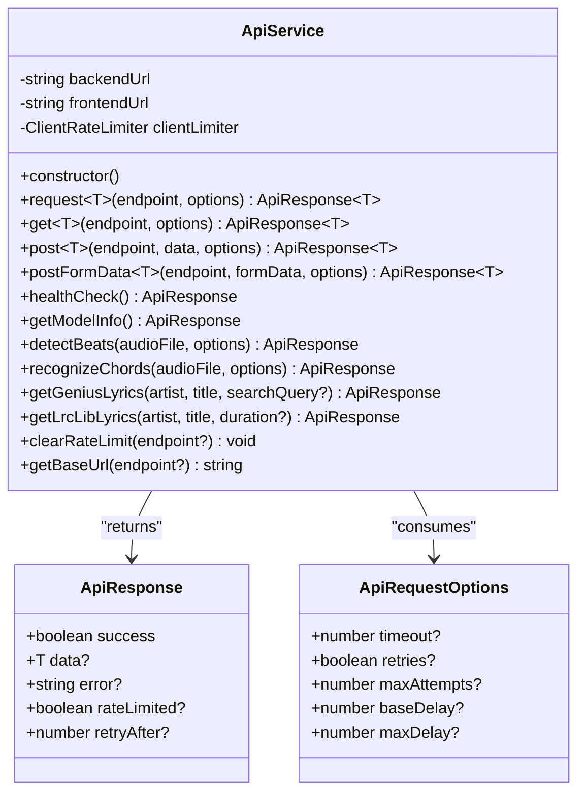
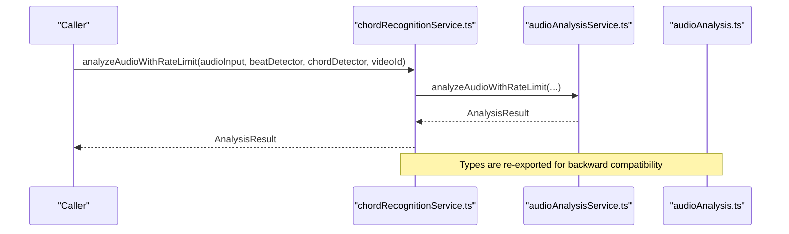
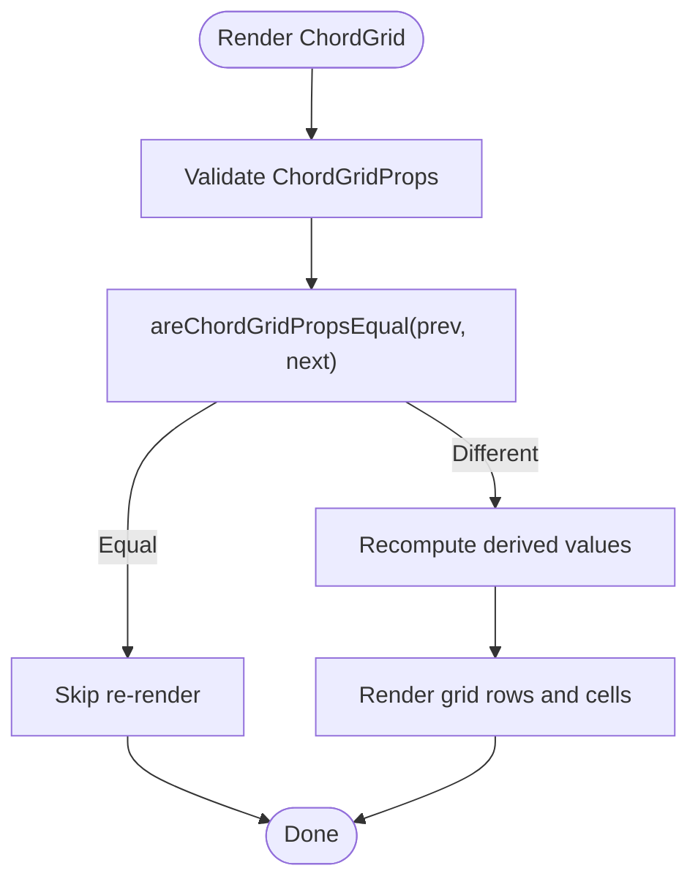
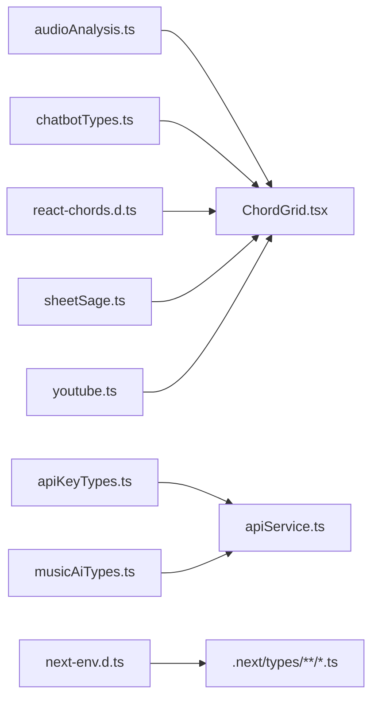
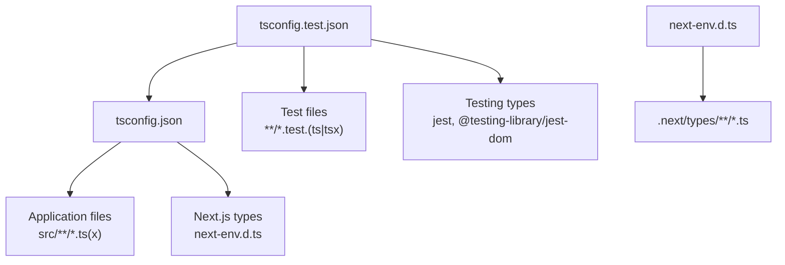

# TypeScript Configuration

<cite>
**Referenced Files in This Document**
- [tsconfig.json](file://tsconfig.json)
- [tsconfig.test.json](file://tsconfig.test.json)
- [package.json](file://package.json)
- [next-env.d.ts](file://next-env.d.ts)
- [src/types/apiKeyTypes.ts](file://src/types/apiKeyTypes.ts)
- [src/types/audioAnalysis.ts](file://src/types/audioAnalysis.ts)
- [src/types/chatbotTypes.ts](file://src/types/chatbotTypes.ts)
- [src/types/musicAiTypes.ts](file://src/types/musicAiTypes.ts)
- [src/types/react-chords.d.ts](file://src/types/react-chords.d.ts)
- [src/types/sheetSage.ts](file://src/types/sheetSage.ts)
- [src/types/youtube.ts](file://src/types/youtube.ts)
- [src/services/api/apiService.ts](file://src/services/api/apiService.ts)
- [src/services/chord-analysis/chordRecognitionService.ts](file://src/services/chord-analysis/chordRecognitionService.ts)
- [src/hooks/chord-analysis/useChordDataProcessing.ts](file://src/hooks/chord-analysis/useChordDataProcessing.ts)
- [src/components/chord-analysis/ChordGrid.tsx](file://src/components/chord-analysis/ChordGrid.tsx)
</cite>

## Table of Contents
1. [Introduction](#introduction)
2. [Project Structure](#project-structure)
3. [Core Components](#core-components)
4. [Architecture Overview](#architecture-overview)
5. [Detailed Component Analysis](#detailed-component-analysis)
6. [Dependency Analysis](#dependency-analysis)
7. [Performance Considerations](#performance-considerations)
8. [Troubleshooting Guide](#troubleshooting-guide)
9. [Conclusion](#conclusion)

## Introduction
This document explains the TypeScript configuration and type system for the project, focusing on:
- Compiler options and module resolution
- Path mapping and Next.js integration
- Type definition patterns and reusable interfaces
- Type-safe API integration and service typing
- Component prop validation and UI type contracts
- Testing type configuration and mock typings
- Type generation strategies and third-party augmentations
- Best practices for type safety, refactoring support, and IDE integration

## Project Structure
The project uses a dual TypeScript configuration:
- Application configuration: tsconfig.json
- Test configuration: tsconfig.test.json (extends application config)

Key characteristics:
- Strict mode enabled for robust type checking
- Next.js-specific plugin and generated types integration
- Bundler module resolution for modern ESM workflows
- Path aliases (@/*) mapped to src/*
- Separate include/exclude rules for app and test environments

**Diagram sources**
- [tsconfig.json](file://tsconfig.json)
- [tsconfig.test.json](file://tsconfig.test.json)

**Section sources**
- [tsconfig.json](file://tsconfig.json)
- [tsconfig.test.json](file://tsconfig.test.json)

## Core Components
This section documents the central type system and how it enforces safety across services and components.

- Centralized audio analysis types define the unified result shape for beat and chord detection, ensuring consistent consumption by UI components.
- API key management types encapsulate validation, encryption, and quota handling for external services.
- Chatbot types unify song context, conversation history, and segmentation results for AI-driven features.
- Music.ai integration types describe job workflows, results, and synchronized lyrics/chords.
- Third-party library augmentations provide precise typing for @tombatossals/react-chords and related chord databases.
- YouTube-related types define player and search result contracts for media integration.

These types are designed to be:
- Reusable across services and components
- Backward compatible via re-exports
- Extensible without breaking changes

**Section sources**
- [src/types/audioAnalysis.ts](file://src/types/audioAnalysis.ts)
- [src/types/apiKeyTypes.ts](file://src/types/apiKeyTypes.ts)
- [src/types/chatbotTypes.ts](file://src/types/chatbotTypes.ts)
- [src/types/musicAiTypes.ts](file://src/types/musicAiTypes.ts)
- [src/types/react-chords.d.ts](file://src/types/react-chords.d.ts)
- [src/types/youtube.ts](file://src/types/youtube.ts)

## Architecture Overview
The type system supports a layered architecture:
- Services consume typed APIs and return typed responses
- Hooks process typed data and expose typed utilities
- Components receive typed props and enforce runtime-safe rendering
- Shared types live in src/types for reuse across the app

**Diagram sources**
- [src/services/api/apiService.ts](file://src/services/api/apiService.ts)
- [src/services/chord-analysis/chordRecognitionService.ts](file://src/services/chord-analysis/chordRecognitionService.ts)
- [src/hooks/chord-analysis/useChordDataProcessing.ts](file://src/hooks/chord-analysis/useChordDataProcessing.ts)
- [src/components/chord-analysis/ChordGrid.tsx](file://src/components/chord-analysis/ChordGrid.tsx)
- [src/types/audioAnalysis.ts](file://src/types/audioAnalysis.ts)
- [src/types/apiKeyTypes.ts](file://src/types/apiKeyTypes.ts)
- [src/types/chatbotTypes.ts](file://src/types/chatbotTypes.ts)
- [src/types/musicAiTypes.ts](file://src/types/musicAiTypes.ts)
- [src/types/react-chords.d.ts](file://src/types/react-chords.d.ts)
- [src/types/sheetSage.ts](file://src/types/sheetSage.ts)
- [src/types/youtube.ts](file://src/types/youtube.ts)

## Detailed Component Analysis

### API Service Typing
The API service centralizes HTTP interactions with typed responses and request options. It:
- Defines a generic ApiResponse<T> contract
- Enforces request option shapes via ApiRequestOptions
- Returns typed results for GET/POST/form-data endpoints
- Handles rate limits, timeouts, and error parsing with explicit types

**Diagram sources**
- [src/services/api/apiService.ts](file://src/services/api/apiService.ts)

**Section sources**
- [src/services/api/apiService.ts](file://src/services/api/apiService.ts)

### Chord Recognition Facade Typing
The chord recognition facade maintains backward compatibility while exposing centralized types:
- Re-exports AnalysisResult and ChordDetectorType
- Delegates to audio analysis service with typed parameters

**Diagram sources**
- [src/services/chord-analysis/chordRecognitionService.ts](file://src/services/chord-analysis/chordRecognitionService.ts)
- [src/types/audioAnalysis.ts](file://src/types/audioAnalysis.ts)

**Section sources**
- [src/services/chord-analysis/chordRecognitionService.ts](file://src/services/chord-analysis/chordRecognitionService.ts)
- [src/types/audioAnalysis.ts](file://src/types/audioAnalysis.ts)

### Chord Grid Component Prop Validation
The ChordGrid component enforces type safety through:
- A comprehensive ChordGridProps interface
- Custom prop equality comparator for React.memo
- Typed callbacks and optional data structures
- Integration with typed hooks and utilities

**Diagram sources**
- [src/components/chord-analysis/ChordGrid.tsx](file://src/components/chord-analysis/ChordGrid.tsx)

**Section sources**
- [src/components/chord-analysis/ChordGrid.tsx](file://src/components/chord-analysis/ChordGrid.tsx)

### Type Definitions and Augmentations
- Centralized domain types (audio analysis, API keys, chatbot, music.ai, sheetSage, YouTube)
- Third-party augmentation for @tombatossals/react-chords
- Generated Next.js types via next-env.d.ts

**Diagram sources**
- [src/types/audioAnalysis.ts](file://src/types/audioAnalysis.ts)
- [src/types/apiKeyTypes.ts](file://src/types/apiKeyTypes.ts)
- [src/types/chatbotTypes.ts](file://src/types/chatbotTypes.ts)
- [src/types/musicAiTypes.ts](file://src/types/musicAiTypes.ts)
- [src/types/react-chords.d.ts](file://src/types/react-chords.d.ts)
- [src/types/sheetSage.ts](file://src/types/sheetSage.ts)
- [src/types/youtube.ts](file://src/types/youtube.ts)
- [src/services/api/apiService.ts](file://src/services/api/apiService.ts)
- [src/components/chord-analysis/ChordGrid.tsx](file://src/components/chord-analysis/ChordGrid.tsx)
- [next-env.d.ts](file://next-env.d.ts)

**Section sources**
- [src/types/audioAnalysis.ts](file://src/types/audioAnalysis.ts)
- [src/types/apiKeyTypes.ts](file://src/types/apiKeyTypes.ts)
- [src/types/chatbotTypes.ts](file://src/types/chatbotTypes.ts)
- [src/types/musicAiTypes.ts](file://src/types/musicAiTypes.ts)
- [src/types/react-chords.d.ts](file://src/types/react-chords.d.ts)
- [src/types/sheetSage.ts](file://src/types/sheetSage.ts)
- [src/types/youtube.ts](file://src/types/youtube.ts)
- [next-env.d.ts](file://next-env.d.ts)

## Dependency Analysis
TypeScript configurations and their relationships:
- tsconfig.test.json extends tsconfig.json and adds testing-specific types and includes
- next-env.d.ts references Next.js types and generated route types
- Path alias @/* resolves to src/, enabling concise imports across the codebase

**Diagram sources**
- [tsconfig.json](file://tsconfig.json)
- [tsconfig.test.json](file://tsconfig.test.json)
- [next-env.d.ts](file://next-env.d.ts)

**Section sources**
- [tsconfig.json](file://tsconfig.json)
- [tsconfig.test.json](file://tsconfig.test.json)
- [next-env.d.ts](file://next-env.d.ts)

## Performance Considerations
- Strict mode and isolated modules improve correctness and build performance
- Bundler module resolution enables tree-shaking and modern ESM workflows
- Path aliases reduce import verbosity and improve navigation
- Memoization patterns in components (React.memo, useMemo, useCallback) minimize re-renders and leverage typed props for safe comparisons

## Troubleshooting Guide
Common type-related issues and resolutions:
- Missing or incorrect types in API responses
  - Ensure ApiResponse<T> is used consistently and T matches the expected payload
  - Verify endpoint-specific types (e.g., MusicAiJob, ChordDetectionResult)
- Prop mismatch in components
  - Align component props with ChordGridProps and use the provided equality comparator
  - Confirm optional fields and callback signatures match expectations
- Third-party library typing problems
  - Validate augmentation files (e.g., react-chords.d.ts) and ensure module declarations are correct
- Test environment type errors
  - Confirm tsconfig.test.json includes test files and testing types
  - Verify Jest and Testing Library types are installed and configured

**Section sources**
- [src/services/api/apiService.ts](file://src/services/api/apiService.ts)
- [src/components/chord-analysis/ChordGrid.tsx](file://src/components/chord-analysis/ChordGrid.tsx)
- [src/types/react-chords.d.ts](file://src/types/react-chords.d.ts)
- [tsconfig.test.json](file://tsconfig.test.json)

## Conclusion
The project’s TypeScript configuration and type system provide strong guarantees across services, hooks, and components. By leveraging strict compiler options, path aliases, and centralized type definitions, the codebase achieves:
- Predictable and maintainable type contracts
- Seamless integration with Next.js and testing frameworks
- Robust API typing and component prop validation
- Extensibility through third-party augmentations and shared types