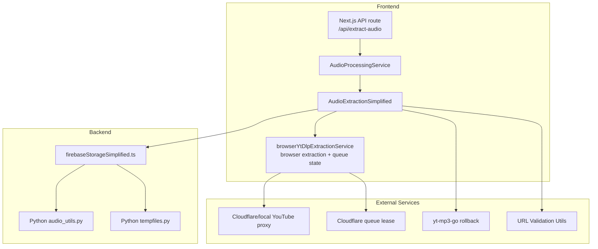
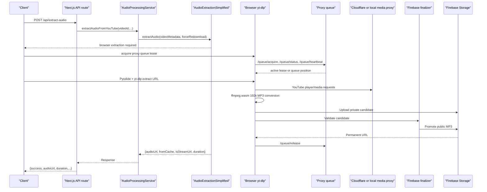
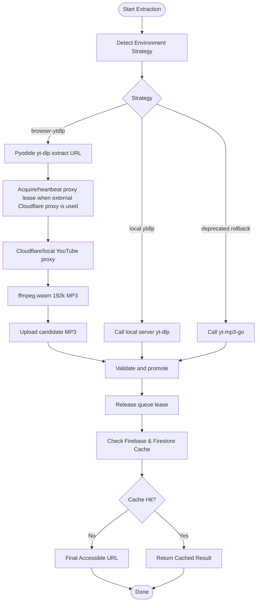
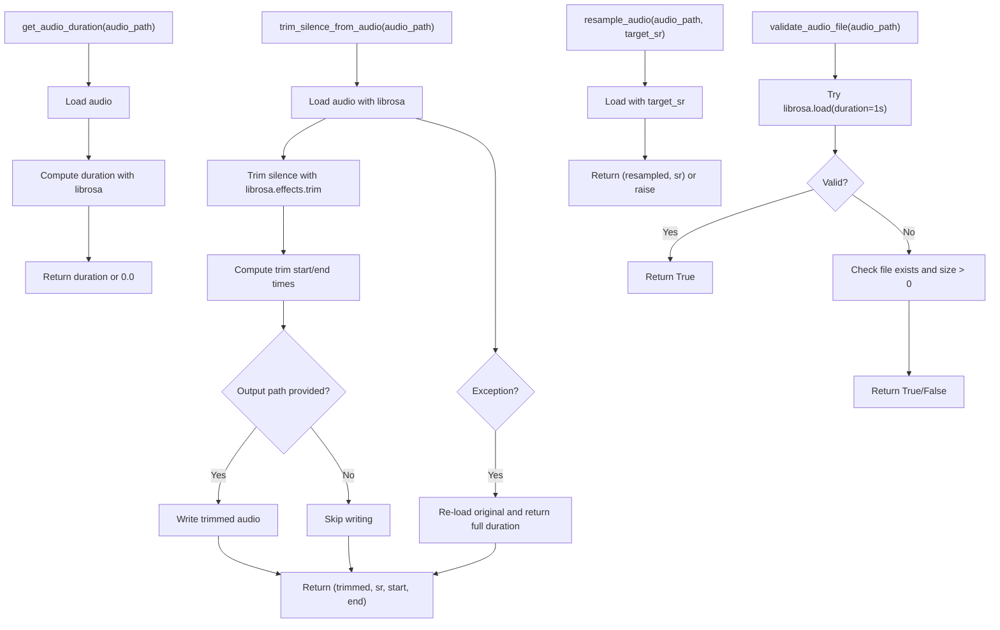
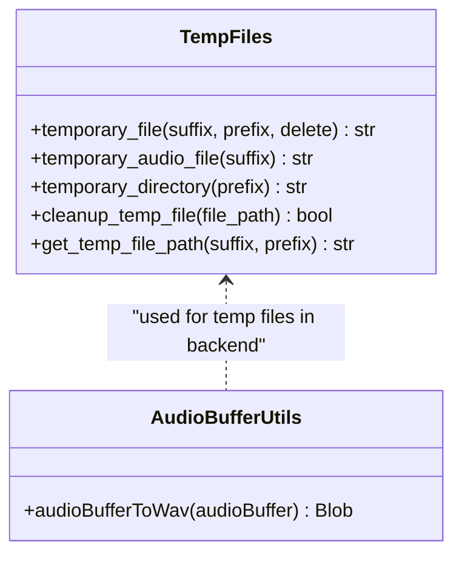
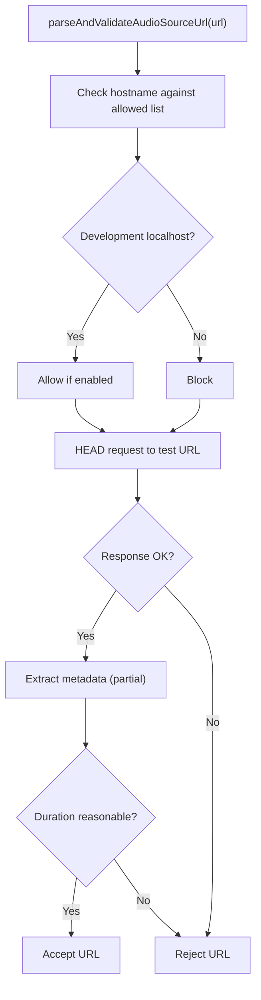
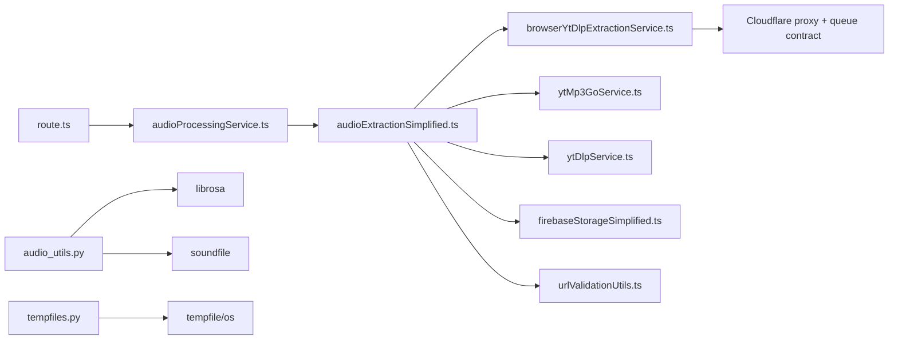

# Audio Pipeline

<cite>
**Referenced Files in This Document**
- [audio_utils.py](file://python_backend/services/audio/audio_utils.py)
- [tempfiles.py](file://python_backend/services/audio/tempfiles.py)
- [audioBufferUtils.ts](file://src/utils/audioBufferUtils.ts)
- [audioExtractionSimplified.ts](file://src/services/audio/audioExtractionSimplified.ts)
- [route.ts](file://src/app/api/extract-audio/route.ts)
- [audioProcessingService.ts](file://src/services/audio/audioProcessingService.ts)
- [ytMp3GoService.ts](file://src/services/youtube/ytMp3GoService.ts)
- [firebaseStorageSimplified.ts](file://src/services/firebase/firebaseStorageSimplified.ts)
- [urlValidationUtils.ts](file://src/utils/urlValidationUtils.ts)
- [grainPlayerPitchShiftService.ts](file://src/services/audio/grainPlayerPitchShiftService.ts)
- [utils.py](file://sheetsage/src/sheetsage_upstream/sheetsage/utils.py)
- [utils_test.py](file://sheetsage/src/sheetsage_upstream/sheetsage/utils_test.py)
</cite>

## Table of Contents
1. [Introduction](#introduction)
2. [Project Structure](#project-structure)
3. [Core Components](#core-components)
4. [Architecture Overview](#architecture-overview)
5. [Detailed Component Analysis](#detailed-component-analysis)
6. [Dependency Analysis](#dependency-analysis)
7. [Performance Considerations](#performance-considerations)
8. [Troubleshooting Guide](#troubleshooting-guide)
9. [Conclusion](#conclusion)
10. [Appendices](#appendices)

## Introduction
This document describes the audio pipeline system in ChordMiniApp, focusing on the end-to-end workflow for extracting, preparing, and analyzing audio from YouTube videos. It covers supported formats, extraction strategies, preprocessing steps, quality controls, temporary file management, buffer handling, and performance optimization. Practical examples and error-handling guidance are included to help developers integrate and troubleshoot the pipeline effectively.

## Project Structure
The audio pipeline spans both the frontend and backend:
- Frontend orchestration and UI-driven flows
- Backend APIs for audio extraction and metadata
- Python backend utilities for audio processing and temporary file management
- Third-party integrations for audio extraction and validation

**Diagram sources**
- [route.ts:35-73](file://src/app/api/extract-audio/route.ts#L35-L73)
- [audioProcessingService.ts:43-109](file://src/services/audio/audioProcessingService.ts#L43-L109)
- [audioExtractionSimplified.ts:69-120](file://src/services/audio/audioExtractionSimplified.ts#L69-L120)
- [ytMp3GoService.ts:75-155](file://src/services/youtube/ytMp3GoService.ts#L75-L155)
- [firebaseStorageSimplified.ts:169-216](file://src/services/firebase/firebaseStorageSimplified.ts#L169-L216)
- [audio_utils.py:12-131](file://python_backend/services/audio/audio_utils.py#L12-L131)
- [tempfiles.py:15-136](file://python_backend/services/audio/tempfiles.py#L15-L136)
- [urlValidationUtils.ts:49-104](file://src/utils/urlValidationUtils.ts#L49-L104)

**Section sources**
- [route.ts:35-73](file://src/app/api/extract-audio/route.ts#L35-L73)
- [audioProcessingService.ts:43-109](file://src/services/audio/audioProcessingService.ts#L43-L109)
- [audioExtractionSimplified.ts:69-120](file://src/services/audio/audioExtractionSimplified.ts#L69-L120)
- [ytMp3GoService.ts:75-155](file://src/services/youtube/ytMp3GoService.ts#L75-L155)
- [firebaseStorageSimplified.ts:169-216](file://src/services/firebase/firebaseStorageSimplified.ts#L169-L216)
- [audio_utils.py:12-131](file://python_backend/services/audio/audio_utils.py#L12-L131)
- [tempfiles.py:15-136](file://python_backend/services/audio/tempfiles.py#L15-L136)
- [urlValidationUtils.ts:49-104](file://src/utils/urlValidationUtils.ts#L49-L104)

## Core Components
- Audio extraction from YouTube:
  - Production extraction via browser yt-dlp, Pyodide, ffmpeg.wasm, and a YouTube media proxy
  - Cloudflare Worker proxy support through `NEXT_PUBLIC_YOUTUBE_PROXY_URL`
  - No automatic Railway/server yt-dlp fallback when Cloudflare/browser extraction fails
  - Deprecated `yt-mp3-go` rollback via `NEXT_PUBLIC_AUDIO_STRATEGY=yt-mp3-go`
  - Candidate validation and permanent storage via Firebase
- Preprocessing utilities:
  - Silence trimming, duration calculation, resampling, and format validation
  - Temporary file management for safe cleanup
- Buffer handling and conversion:
  - Web AudioBuffer to WAV conversion with strict bounds checks
- Quality control:
  - URL accessibility validation, file metadata extraction, and error handling
- Performance optimization:
  - Parallel pipeline for storage and processing, stream URL expiration, and memory-safe operations

**Section sources**
- [audioExtractionSimplified.ts:69-120](file://src/services/audio/audioExtractionSimplified.ts#L69-L120)
- [browserYtDlpExtractionService.ts:1-430](file://src/services/audio/browserYtDlpExtractionService.ts#L1-L430)
- [browser-ytdlp-worker.js:1-260](file://public/browser-ytdlp-worker.js#L1-L260)
- [audio_utils.py:12-131](file://python_backend/services/audio/audio_utils.py#L12-L131)
- [tempfiles.py:15-136](file://python_backend/services/audio/tempfiles.py#L15-L136)
- [audioBufferUtils.ts:4-87](file://src/utils/audioBufferUtils.ts#L4-L87)
- [ytMp3GoService.ts:75-155](file://src/services/youtube/ytMp3GoService.ts#L75-L155)
- [firebaseStorageSimplified.ts:169-216](file://src/services/firebase/firebaseStorageSimplified.ts#L169-L216)

## Architecture Overview
The pipeline follows a layered approach:
- Frontend triggers extraction via a Next.js API route
- The route delegates to AudioProcessingService, which coordinates AudioExtractionSimplified
- AudioExtractionSimplified selects the extraction strategy, validates URLs, caches metadata, and optionally uploads to Firebase
- Python backend utilities support preprocessing and temporary file lifecycle
- Quality control ensures accessible and valid audio sources

**Diagram sources**
- [route.ts:35-73](file://src/app/api/extract-audio/route.ts#L35-L73)
- [audioProcessingService.ts:43-109](file://src/services/audio/audioProcessingService.ts#L43-L109)
- [audioExtractionSimplified.ts:605-799](file://src/services/audio/audioExtractionSimplified.ts#L605-L799)
- [browserYtDlpExtractionService.ts:1-430](file://src/services/audio/browserYtDlpExtractionService.ts#L1-L430)
- [browser-ytdlp-worker.js:1-260](file://public/browser-ytdlp-worker.js#L1-L260)
- [route.ts:1-260](file://src/app/api/audio/finalize-browser-extraction/route.ts#L1-L260)
- [firebaseStorageSimplified.ts:169-216](file://src/services/firebase/firebaseStorageSimplified.ts#L169-L216)

## Detailed Component Analysis

### Audio Extraction from YouTube
- Strategy selection:
  - Production routes cache misses to browser yt-dlp extraction.
  - Local development can continue using server-side yt-dlp.
  - Cloudflare/browser failures surface as extraction errors; production does not silently fall back to Railway/server yt-dlp.
  - `yt-mp3-go` remains deprecated rollback code, not the normal production path.
- Queue coordination:
  - When `NEXT_PUBLIC_YOUTUBE_PROXY_URL` points at an external Cloudflare Worker, `browserYtDlpExtractionService` acquires a proxy lease before extraction and heartbeats while active.
  - Queue state is exposed to the analysis UI so the extraction toast can show queue position and estimated wait on separate lines.
  - Local `/api/youtube-media-proxy` extraction does not require a queue lease.
- Caching and storage:
  - Browser extraction uploads to private `audio-candidates/{uid}/{videoId}/{sha}.mp3`
  - Finalizer validates MP3 bytes, auth, path, size, duration, MIME, and hash before promoting to public `audio/`
  - Simplified Firestore cache for metadata retrieval
- URL validation:
  - Browser extraction downloads through the same YouTube media proxy used by yt-dlp for player/media requests
  - Cloudflare Worker proxy is configured with `NEXT_PUBLIC_YOUTUBE_PROXY_URL`
  - See [YouTube Integration](file://.qoder/repowiki/en/content/Audio Processing and Analysis/YouTube Integration.md) for the complete Cloudflare Worker contract and troubleshooting table

**Diagram sources**
- [audioExtractionSimplified.ts:84-120](file://src/services/audio/audioExtractionSimplified.ts#L84-L120)
- [audioExtractionSimplified.ts:605-799](file://src/services/audio/audioExtractionSimplified.ts#L605-L799)
- [ytMp3GoService.ts:87-155](file://src/services/youtube/ytMp3GoService.ts#L87-L155)
- [firebaseStorageSimplified.ts:169-216](file://src/services/firebase/firebaseStorageSimplified.ts#L169-L216)
- [urlValidationUtils.ts:49-104](file://src/utils/urlValidationUtils.ts#L49-L104)

**Section sources**
- [audioExtractionSimplified.ts:84-120](file://src/services/audio/audioExtractionSimplified.ts#L84-L120)
- [audioExtractionSimplified.ts:605-799](file://src/services/audio/audioExtractionSimplified.ts#L605-L799)
- [ytMp3GoService.ts:87-155](file://src/services/youtube/ytMp3GoService.ts#L87-L155)
- [firebaseStorageSimplified.ts:169-216](file://src/services/firebase/firebaseStorageSimplified.ts#L169-L216)
- [urlValidationUtils.ts:49-104](file://src/utils/urlValidationUtils.ts#L49-L104)

### Audio Utility Functions
- trim_silence_from_audio:
  - Removes silence from beginning and end using librosa effects
  - Returns trimmed waveform, sample rate, and trim timestamps
  - Graceful fallback to original audio on failure
- get_audio_duration:
  - Computes duration using librosa
  - Returns 0.0 on failure
- resample_audio:
  - Loads and resamples audio to target sample rate
  - Raises on failure
- validate_audio_file:
  - Validates loadability by loading a short segment
  - Falls back to filesystem existence check if librosa is unavailable

**Diagram sources**
- [audio_utils.py:12-131](file://python_backend/services/audio/audio_utils.py#L12-L131)

**Section sources**
- [audio_utils.py:12-131](file://python_backend/services/audio/audio_utils.py#L12-L131)

### Temporary File Management and Buffer Handling
- Temporary file management:
  - Context-managed creation and cleanup of temporary files and directories
  - Dedicated audio file context with sensible prefixes
  - Manual cleanup utility and path generation helpers
- Buffer handling:
  - Web AudioBuffer to WAV conversion with strict bounds checking
  - Robust validation for channels, length, sample rate, and buffer sizes
  - Sample quantization and safe write operations

**Diagram sources**
- [tempfiles.py:15-136](file://python_backend/services/audio/tempfiles.py#L15-L136)
- [audioBufferUtils.ts:4-87](file://src/utils/audioBufferUtils.ts#L4-L87)

**Section sources**
- [tempfiles.py:15-136](file://python_backend/services/audio/tempfiles.py#L15-L136)
- [audioBufferUtils.ts:4-87](file://src/utils/audioBufferUtils.ts#L4-L87)

### Quality Control Measures
- URL accessibility validation:
  - Allowed domains and safe timeouts to prevent 403 and timeouts
  - Hostname filtering and optional localhost allowance in development
- File content validation:
  - HEAD requests to verify availability
  - Partial metadata extraction to confirm reasonable durations
- Error handling:
  - Comprehensive try/catch around extraction and storage
  - Graceful degradation to stream URLs with expiration when storage fails

**Diagram sources**
- [urlValidationUtils.ts:49-104](file://src/utils/urlValidationUtils.ts#L49-L104)
- [ytMp3GoService.ts:160-168](file://src/services/youtube/ytMp3GoService.ts#L160-L168)
- [utils.py:267-329](file://sheetsage/src/sheetsage_upstream/sheetsage/utils.py#L267-L329)

**Section sources**
- [urlValidationUtils.ts:49-104](file://src/utils/urlValidationUtils.ts#L49-L104)
- [ytMp3GoService.ts:160-168](file://src/services/youtube/ytMp3GoService.ts#L160-L168)
- [utils.py:267-329](file://sheetsage/src/sheetsage_upstream/sheetsage/utils.py#L267-L329)

### Practical Examples of Audio Processing Workflows
- Extract audio from a YouTube video:
  - Use AudioProcessingService.extractAudioFromYouTube to trigger extraction
  - The API route handles request parsing and forwards to the simplified extractor
  - The extractor checks caches, requests browser extraction on production cache misses, finalizes browser output, caches metadata, and returns a usable audio URL
- Preprocess audio:
  - Trim silence with trim_silence_from_audio
  - Validate format with validate_audio_file
  - Resample with resample_audio if needed
- Convert buffers:
  - Convert Web AudioBuffer to WAV using audioBufferToWav for client-side processing

**Section sources**
- [audioProcessingService.ts:43-109](file://src/services/audio/audioProcessingService.ts#L43-L109)
- [route.ts:35-73](file://src/app/api/extract-audio/route.ts#L35-L73)
- [audioExtractionSimplified.ts:605-799](file://src/services/audio/audioExtractionSimplified.ts#L605-L799)
- [audio_utils.py:12-131](file://python_backend/services/audio/audio_utils.py#L12-L131)
- [audioBufferUtils.ts:4-87](file://src/utils/audioBufferUtils.ts#L4-L87)

## Dependency Analysis
- Frontend dependencies:
  - Next.js API route depends on AudioProcessingService
  - AudioProcessingService depends on AudioExtractionSimplified
  - AudioExtractionSimplified depends on environment detection, browser yt-dlp production extraction, local yt-dlp development extraction, rollback yt-mp3-go services, and Firebase utilities
- Backend dependencies:
  - Python audio utilities depend on librosa and soundfile
  - Temporary file management wraps Python’s tempfile and os
- External dependencies:
  - browser yt-dlp for production extraction, local yt-dlp for development, and yt-mp3-go for rollback
  - Firebase for storage and caching
  - URL validation utilities for safe access

**Diagram sources**
- [route.ts:35-73](file://src/app/api/extract-audio/route.ts#L35-L73)
- [audioProcessingService.ts:43-109](file://src/services/audio/audioProcessingService.ts#L43-L109)
- [audioExtractionSimplified.ts:69-120](file://src/services/audio/audioExtractionSimplified.ts#L69-L120)
- [ytMp3GoService.ts:75-155](file://src/services/youtube/ytMp3GoService.ts#L75-L155)
- [firebaseStorageSimplified.ts:169-216](file://src/services/firebase/firebaseStorageSimplified.ts#L169-L216)
- [urlValidationUtils.ts:49-104](file://src/utils/urlValidationUtils.ts#L49-L104)
- [audio_utils.py:12-131](file://python_backend/services/audio/audio_utils.py#L12-L131)
- [tempfiles.py:15-136](file://python_backend/services/audio/tempfiles.py#L15-L136)

**Section sources**
- [route.ts:35-73](file://src/app/api/extract-audio/route.ts#L35-L73)
- [audioProcessingService.ts:43-109](file://src/services/audio/audioProcessingService.ts#L43-L109)
- [audioExtractionSimplified.ts:69-120](file://src/services/audio/audioExtractionSimplified.ts#L69-L120)
- [ytMp3GoService.ts:75-155](file://src/services/youtube/ytMp3GoService.ts#L75-L155)
- [firebaseStorageSimplified.ts:169-216](file://src/services/firebase/firebaseStorageSimplified.ts#L169-L216)
- [urlValidationUtils.ts:49-104](file://src/utils/urlValidationUtils.ts#L49-L104)
- [audio_utils.py:12-131](file://python_backend/services/audio/audio_utils.py#L12-L131)
- [tempfiles.py:15-136](file://python_backend/services/audio/tempfiles.py#L15-L136)

## Performance Considerations
- Parallel pipeline:
  - Start Firebase upload in parallel with immediate processing to reduce latency
- Stream URL optimization:
  - Prefer direct URLs when compatible with backend to avoid extra downloads
- Memory optimization:
  - Use AudioBuffer to WAV conversion with strict bounds to prevent oversized buffers
  - Validate sample rates and channel counts to avoid unnecessary conversions
- Caching:
  - Firebase Storage cache reduces repeated downloads
  - Simplified Firestore cache accelerates metadata retrieval

[No sources needed since this section provides general guidance]

## Troubleshooting Guide
- Corrupted or incompatible files:
  - Use validate_audio_file to detect invalid formats
  - For librosa-dependent operations, catch exceptions and fall back to filesystem checks
- Format compatibility issues:
  - Browser extraction finalization returns completed audio downloads; rollback yt-mp3-go responses remain supported
  - Use validate_file_content_with_metadata to verify real duration and accessibility
- Network and timeout issues:
  - Apply URL validation with safe timeouts
  - Retry mechanisms in storage upload services
- Large audio files:
  - Prefer direct URL processing when possible
  - Use temporary file management to avoid disk exhaustion

**Section sources**
- [audio_utils.py:111-131](file://python_backend/services/audio/audio_utils.py#L111-L131)
- [ytMp3GoService.ts:499-535](file://src/services/youtube/ytMp3GoService.ts#L499-L535)
- [urlValidationUtils.ts:49-104](file://src/utils/urlValidationUtils.ts#L49-L104)
- [grainPlayerPitchShiftService.ts:385-422](file://src/services/audio/grainPlayerPitchShiftService.ts#L385-L422)

## Conclusion
The ChordMiniApp audio pipeline combines robust extraction, preprocessing, and quality control to deliver reliable audio processing. By leveraging environment-aware strategies, caching, and validation, it minimizes failures and optimizes performance. The provided utilities and patterns enable scalable handling of diverse audio sources and formats.

[No sources needed since this section summarizes without analyzing specific files]

## Appendices

### Supported Formats and Extraction Details
- MP3, WAV, FLAC, M4A:
  - Extraction primarily uses browser yt-dlp completed audio downloads with server finalization
  - Python utilities support decoding/encoding with librosa and soundfile
  - Sheetsage upstream demonstrates decoding/encoding across formats and options like mono, normalization, and duration/offset

**Section sources**
- [ytMp3GoService.ts:97-126](file://src/services/youtube/ytMp3GoService.ts#L97-L126)
- [utils.py:267-329](file://sheetsage/src/sheetsage_upstream/sheetsage/utils.py#L267-L329)
- [utils_test.py:149-171](file://sheetsage/src/sheetsage_upstream/sheetsage/utils_test.py#L149-L171)

### Preprocessing Operations Reference
- Silence trimming:
  - trim_silence_from_audio with configurable thresholds and frame sizes
- Duration calculation:
  - get_audio_duration using librosa
- Resampling:
  - resample_audio to target sample rate
- Normalization:
  - Optional normalization in decoding utilities

**Section sources**
- [audio_utils.py:12-131](file://python_backend/services/audio/audio_utils.py#L12-L131)
- [utils.py:267-329](file://sheetsage/src/sheetsage_upstream/sheetsage/utils.py#L267-L329)

### Temporary File and Buffer Utilities
- Temporary file management:
  - Context managers for safe creation and cleanup
  - Helpers for audio-specific temp files and directories
- Buffer conversion:
  - audioBufferToWav with strict validation and safe quantization

**Section sources**
- [tempfiles.py:15-136](file://python_backend/services/audio/tempfiles.py#L15-L136)
- [audioBufferUtils.ts:4-87](file://src/utils/audioBufferUtils.ts#L4-L87)
