# Audio Playback System

<cite>
**Referenced Files in This Document**
- [audioContextManager.ts](file://src/services/audio/audioContextManager.ts)
- [grainPlayerPitchShiftService.ts](file://src/services/audio/grainPlayerPitchShiftService.ts)
- [lightweightChordPlaybackService.ts](file://src/services/chord-playback/lightweightChordPlaybackService.ts)
- [soundfontChordPlaybackService.ts](file://src/services/chord-playback/soundfontChordPlaybackService.ts)
- [metronomeService.ts](file://src/services/chord-playback/metronomeService.ts)
- [audioMixerService.ts](file://src/services/chord-playback/audioMixerService.ts)
- [usePitchShiftAudio.ts](file://src/hooks/chord-playback/usePitchShiftAudio.ts)
- [useChordPlayback.ts](file://src/hooks/chord-playback/useChordPlayback.ts)
- [youtubeMasterClock.ts](file://src/services/audio/youtubeMasterClock.ts)
- [playbackStore.ts](file://src/stores/playbackStore.ts)
- [audioDefaults.ts](file://src/config/audioDefaults.ts)
- [PitchShiftAudioManager.tsx](file://src/components/chord-playback/PitchShiftAudioManager.tsx)
- [pitchSyncDebug.ts](file://src/utils/pitchSyncDebug.ts)
</cite>

## Update Summary
**Changes Made**
- Updated synchronization architecture to reflect the new unified master clock system with enhanced scrub detection
- Added comprehensive documentation for scrub detection thresholds and seek operation improvements
- Enhanced pitch shift service documentation with new feedback loop prevention mechanisms
- Updated synchronization mechanisms with 0.75-second scrub jump threshold
- Added documentation for comprehensive debugging framework for pitch-sync issues

## Table of Contents
1. [Introduction](#introduction)
2. [System Architecture](#system-architecture)
3. [Core Components](#core-components)
4. [Audio Context Management](#audio-context-management)
5. [Pitch-Shifted Audio Playback](#pitch-shifted-audio-playback)
6. [Chord Playback Services](#chord-playback-services)
7. [Metronome Integration](#metronome-integration)
8. [Audio Mixing and Volume Control](#audio-mixing-and-volume-control)
9. [Unified Master Clock Architecture](#unified-master-clock-architecture)
10. [Synchronization and Timing](#synchronization-and-timing)
11. [Playback State Management](#playback-state-management)
12. [Comprehensive Debugging Framework](#comprehensive-debugging-framework)
13. [Mobile Optimization](#mobile-optimization)
14. [Troubleshooting Guide](#troubleshooting-guide)
15. [Best Practices](#best-practices)

## Introduction

The ChordMiniApp audio playback system is a sophisticated Web Audio API-based solution designed for synchronized musical analysis and playback. The system integrates multiple audio sources including YouTube video playback, pitch-shifted audio from Firebase Storage, synthesized chord playback, and metronome clicks. It provides precise timing control, seamless synchronization between visual and audio elements, and comprehensive volume management across all audio components.

**Updated** The system now features a revolutionary unified master clock architecture that replaces the previous fragmented approach with three independent time sources. This new architecture ensures perfect synchronization through a single source of truth with slave re-anchor functionality and enhanced scrub detection mechanisms.

## System Architecture

The audio playback system follows a modular architecture with clear separation of concerns, now centered around the unified master clock:

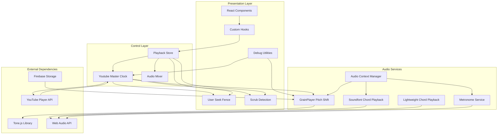

**Diagram sources**
- [youtubeMasterClock.ts:404-409](file://src/services/audio/youtubeMasterClock.ts#L404-L409)
- [usePitchShiftAudio.ts:568-699](file://src/hooks/chord-playback/usePitchShiftAudio.ts#L568-L699)
- [pitchSyncDebug.ts:1-94](file://src/utils/pitchSyncDebug.ts#L1-L94)

## Core Components

### Audio Context Management

The AudioContextManager serves as the central hub for Web Audio API lifecycle management. It provides singleton access to the shared AudioContext, handles browser autoplay policy compliance, and manages context suspension/resume cycles.

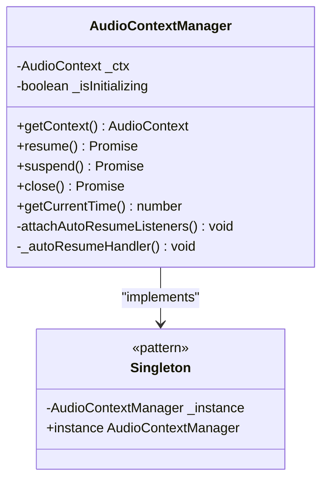

**Diagram sources**
- [audioContextManager.ts:8-44](file://src/services/audio/audioContextManager.ts#L8-L44)

**Section sources**
- [audioContextManager.ts:1-125](file://src/services/audio/audioContextManager.ts#L1-L125)

### Pitch-Shifted Audio Service

The GrainPlayerPitchShiftService leverages Tone.js for advanced pitch-shifting capabilities using granular synthesis. This service provides independent pitch control and playback rate manipulation without affecting the other.

**Updated** The service now operates as a pure slave to the unified master clock, eliminating the previous independent time source conflicts and featuring enhanced seek operations with scrub detection.

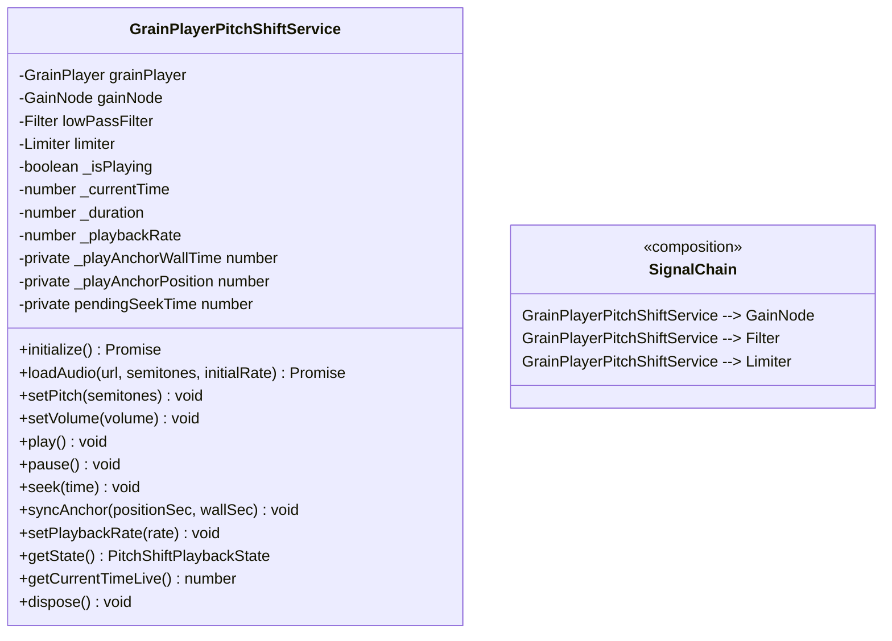

**Diagram sources**
- [grainPlayerPitchShiftService.ts:118-231](file://src/services/audio/grainPlayerPitchShiftService.ts#L118-L231)
- [grainPlayerPitchShiftService.ts:643-654](file://src/services/audio/grainPlayerPitchShiftService.ts#L643-L654)

**Section sources**
- [grainPlayerPitchShiftService.ts:1-829](file://src/services/audio/grainPlayerPitchShiftService.ts#L1-L829)

### Chord Playback Services

The system provides two complementary chord playback approaches:

#### Soundfont-Based Playback
The SoundfontChordPlaybackService delivers realistic instrument sounds using high-quality samples from various musical instruments including piano, guitar, violin, flute, saxophone, and bass.

#### Lightweight Synthesis
The LightweightChordPlaybackService generates synthetic chord sounds using Web Audio API oscillators, providing efficient playback without external dependencies.

**Section sources**
- [soundfontChordPlaybackService.ts:64-706](file://src/services/chord-playback/soundfontChordPlaybackService.ts#L64-L706)
- [lightweightChordPlaybackService.ts:148-431](file://src/services/chord-playback/lightweightChordPlaybackService.ts#L148-L431)

## Audio Context Management

The AudioContextManager implements a robust singleton pattern that ensures proper Web Audio API lifecycle management across the entire application. It addresses critical browser autoplay policies by automatically resuming the audio context on the first user interaction.

### Key Features

- **Lazy Initialization**: Creates the AudioContext only when first accessed
- **Browser Compatibility**: Falls back to webkitAudioContext for Safari support
- **Autoplay Policy Compliance**: Automatically resumes context on user interaction
- **State Management**: Tracks context state (running, suspended, closed, interrupted)
- **Memory Management**: Properly closes and recreates contexts when needed

### Context Lifecycle

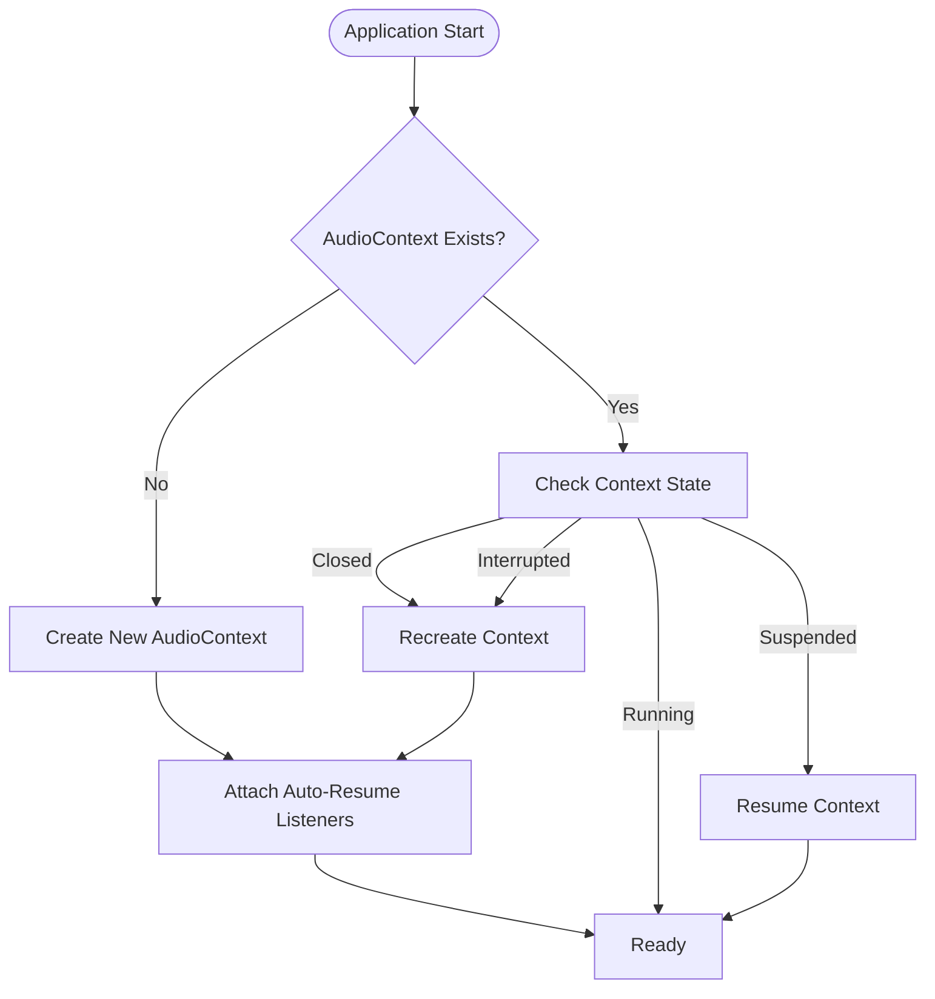

**Diagram sources**
- [audioContextManager.ts:26-44](file://src/services/audio/audioContextManager.ts#L26-L44)
- [audioContextManager.ts:50-91](file://src/services/audio/audioContextManager.ts#L50-L91)

**Section sources**
- [audioContextManager.ts:1-125](file://src/services/audio/audioContextManager.ts#L1-L125)

## Pitch-Shifted Audio Playback

The pitch-shifted audio system provides seamless audio replacement for YouTube playback with configurable pitch shifting and independent volume control.

**Updated** The system now uses the unified master clock architecture with comprehensive slave re-anchor functionality and enhanced scrub detection mechanisms.

### Core Architecture

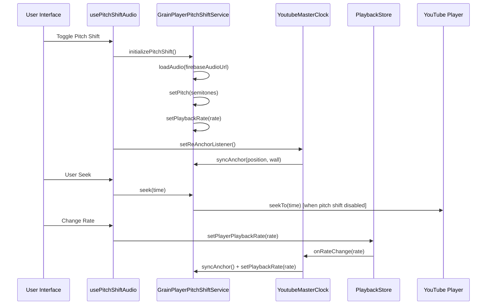

**Diagram sources**
- [usePitchShiftAudio.ts:116-336](file://src/hooks/chord-playback/usePitchShiftAudio.ts#L116-L336)
- [grainPlayerPitchShiftService.ts:643-654](file://src/services/audio/grainPlayerPitchShiftService.ts#L643-L654)
- [youtubeMasterClock.ts:177-179](file://src/services/audio/youtubeMasterClock.ts#L177-L179)

### Pitch Shifting Implementation

The system uses Tone.js GrainPlayer for pitch-shifting, which employs granular synthesis to achieve independent pitch and tempo control. The implementation includes:

- **Independent Parameter Control**: Pitch shifts don't affect playback speed and vice versa
- **Adaptive Filtering**: Dynamic low-pass filtering to prevent aliasing during upward pitch shifts
- **Smooth Transitions**: Proper ramping for volume and filter changes
- **Buffer Management**: Efficient loading and caching of audio buffers
- **Slave Re-Anchor Loop**: 40ms interval re-synchronization with master clock
- **Scrub Detection**: 0.75-second threshold for detecting scrub operations
- **Feedback Loop Prevention**: Mechanisms to prevent seek feedback loops

**Section sources**
- [grainPlayerPitchShiftService.ts:1-829](file://src/services/audio/grainPlayerPitchShiftService.ts#L1-L829)
- [usePitchShiftAudio.ts:1-790](file://src/hooks/chord-playback/usePitchShiftAudio.ts#L1-L790)

## Chord Playback Services

The chord playback system offers two distinct approaches for generating musical chord sounds.

### Soundfont-Based Chord Playback

The SoundfontChordPlaybackService provides professional-grade instrument sounds through high-quality sampled instruments:

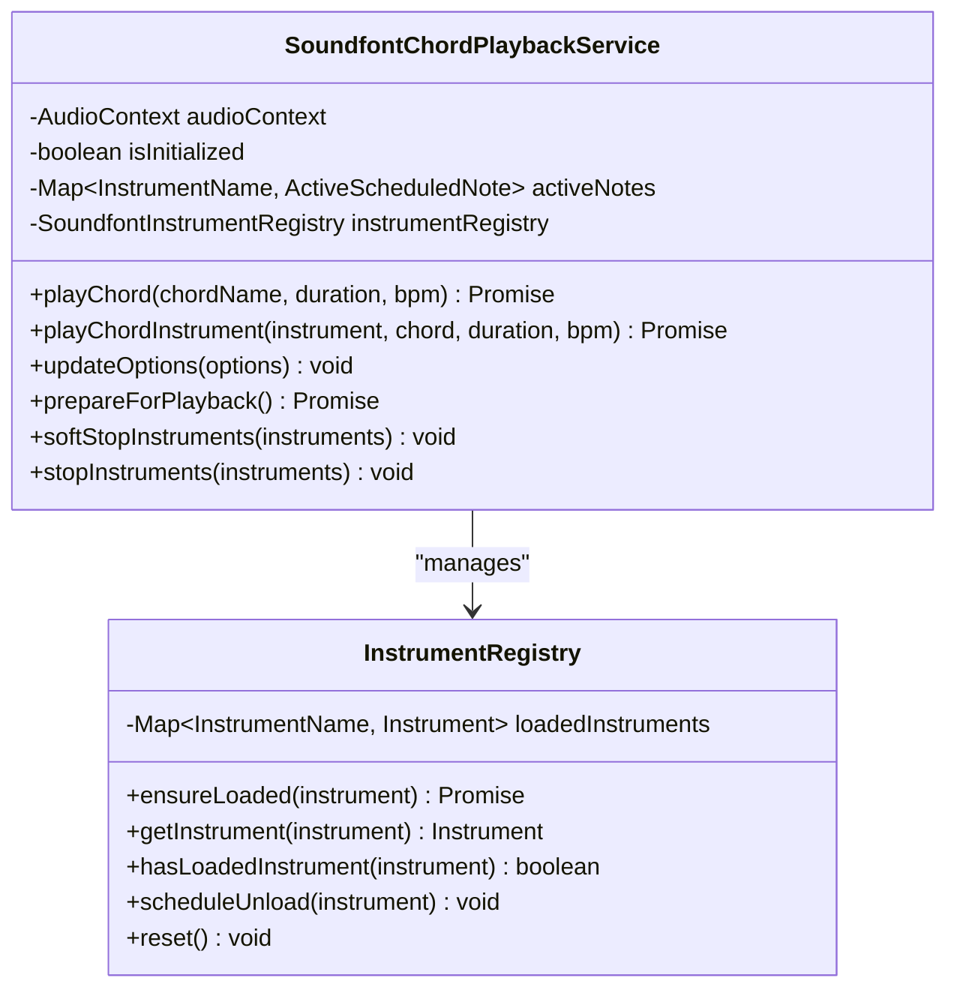

**Diagram sources**
- [soundfontChordPlaybackService.ts:64-91](file://src/services/chord-playback/soundfontChordPlaybackService.ts#L64-L91)

### Lightweight Chord Playback

The LightweightChordPlaybackService generates synthetic chord sounds using Web Audio API oscillators, providing efficient playback without external dependencies:

- **Synthetic Generation**: Creates chord sounds using oscillator combinations
- **Realistic Timbre**: Implements proper instrument characteristics for piano and guitar
- **Dynamic Envelopes**: Applies realistic attack, decay, sustain, and release curves
- **Efficient Memory Usage**: Minimal resource consumption for simpler scenarios

**Section sources**
- [soundfontChordPlaybackService.ts:164-706](file://src/services/chord-playback/soundfontChordPlaybackService.ts#L164-L706)
- [lightweightChordPlaybackService.ts:169-431](file://src/services/chord-playback/lightweightChordPlaybackService.ts#L169-L431)

## Metronome Integration

The MetronomeService provides precise timing control for musical synchronization, supporting multiple sound styles and drum patterns.

### Metronome Architecture

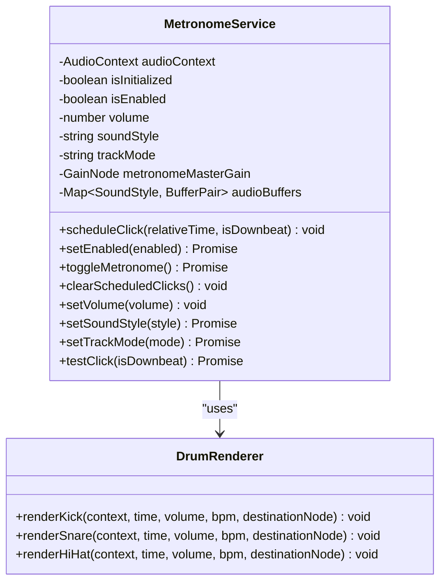

**Diagram sources**
- [metronomeService.ts:34-80](file://src/services/chord-playback/metronomeService.ts#L34-L80)

**Section sources**
- [metronomeService.ts:34-499](file://src/services/chord-playback/metronomeService.ts#L34-L499)

## Audio Mixing and Volume Control

The AudioMixerService provides centralized volume management for all audio components in the application, ensuring consistent audio levels across different sources and instruments.

### Volume Control Architecture

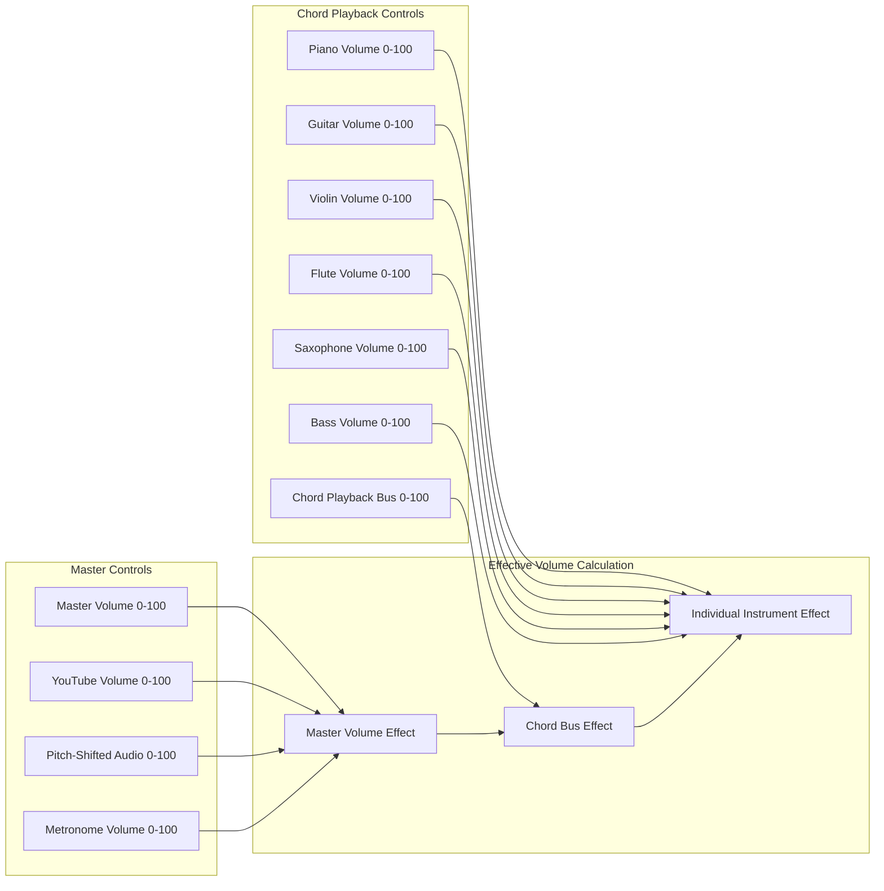

**Diagram sources**
- [audioMixerService.ts:39-139](file://src/services/chord-playback/audioMixerService.ts#L39-L139)

### Default Volume Configuration

The system uses carefully calibrated default volumes to ensure optimal listening experience:

- **Master Volume**: 80% (overall application volume)
- **YouTube Volume**: 70% (video audio level)
- **Pitch-Shifted Audio**: 20% (balanced with video)
- **Chord Playback**: 70% (primary musical content)
- **Individual Instruments**: 45-50% (balanced instrument mix)

**Section sources**
- [audioMixerService.ts:1-371](file://src/services/chord-playback/audioMixerService.ts#L1-L371)
- [audioDefaults.ts:1-73](file://src/config/audioDefaults.ts#L1-L73)

## Unified Master Clock Architecture

**New Section** The ChordMiniApp now features a revolutionary unified master clock architecture that replaces the previous fragmented approach with three independent time sources.

### Background and Problem

The previous system had three competing time sources that fought each other:
1. YouTube iframe's internal clock (via onProgress/getCurrentTime)
2. GrainPlayer's 50ms setInterval counter
3. A drift-correction loop that sought one from the other

At non-1× rates this created a positive feedback loop leading to "keeps refreshing like crazy" and "beat click jumps to wrong position at 2×".

### Master Clock Design

The new architecture establishes a clear hierarchy of clock authority:

1. **YouTube iframe is the permanent MASTER** of {position, rate}
2. **GrainPlayer becomes a pure SLAVE** that follows the master
3. **Beat Grid Animation** reads from master clock for timing accuracy
4. **Visual Elements** synchronized through the master clock position

### Clock Authority Model

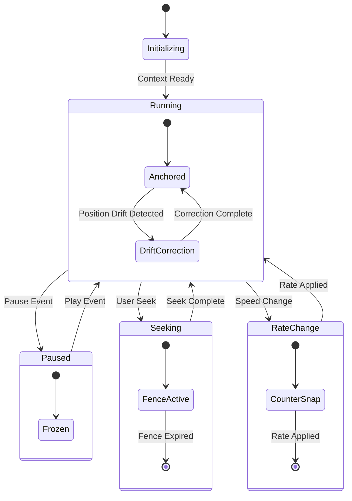

**Diagram sources**
- [youtubeMasterClock.ts:145-191](file://src/services/audio/youtubeMasterClock.ts#L145-L191)
- [youtubeMasterClock.ts:257-279](file://src/services/audio/youtubeMasterClock.ts#L257-L279)

### Key Innovations

- **Single Source of Truth**: YouTube iframe provides the authoritative position and rate
- **Slave Re-Anchor Loop**: 40ms interval re-synchronization prevents drift accumulation
- **Counter-Snap on Rate Changes**: Prevents position jumps during speed changes
- **User-Seek Fence**: Blocks stale progress updates after user-initiated seeks
- **Hysteresis Threshold**: Prevents excessive re-anchoring due to measurement noise
- **Scrub Detection Threshold**: 0.75-second threshold for detecting scrub operations

**Section sources**
- [youtubeMasterClock.ts:1-409](file://src/services/audio/youtubeMasterClock.ts#L1-L409)

## Synchronization and Timing

**Updated** The synchronization system now operates through the unified master clock architecture with comprehensive slave re-anchor functionality and enhanced scrub detection mechanisms.

### Master Clock Authority

The system establishes a clear hierarchy of clock authority:

1. **YouTube Master Clock**: Primary source for position and rate information
2. **Pitch-Shifted Audio Slave**: Secondary clock that follows the master
3. **Beat Grid Animation**: Reads from master clock for timing accuracy
4. **Visual Elements**: Synchronized through the master clock position

### Drift Correction Mechanism

The system implements intelligent drift correction to maintain synchronization:

- **Hysteresis Threshold**: Prevents excessive re-anchoring due to measurement noise
- **Rate-Scaled Tolerance**: Adjusts tolerance based on current playback rate
- **Counter-Snap on Rate Changes**: Prevents position jumps during speed changes
- **User-Seek Fence**: Blocks stale progress updates after user-initiated seeks
- **Scrub Detection**: 0.75-second threshold for detecting scrub operations

### Enhanced Scrub Detection

The system now includes sophisticated scrub detection to handle user-initiated seeks:

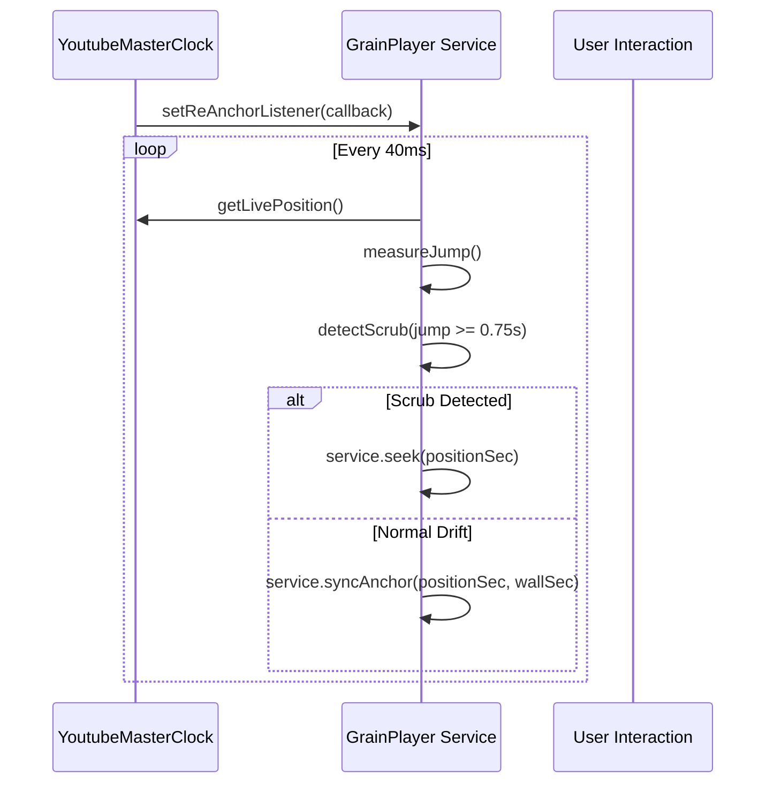

**Diagram sources**
- [usePitchShiftAudio.ts:625-638](file://src/hooks/chord-playback/usePitchShiftAudio.ts#L625-L638)
- [grainPlayerPitchShiftService.ts:643-654](file://src/services/audio/grainPlayerPitchShiftService.ts#L643-L654)

### Feedback Loop Prevention

The system includes multiple layers of protection against feedback loops:

- **Time Update Flag**: Prevents service time updates from triggering seeks
- **Seek Threshold**: Only seeks when difference exceeds 0.5 seconds
- **Pending Seek Queue**: Queues seek operations during buffer loading
- **Seek Token System**: Prevents race conditions during user-initiated seeks

**Section sources**
- [youtubeMasterClock.ts:1-409](file://src/services/audio/youtubeMasterClock.ts#L1-L409)
- [playbackStore.ts:172-351](file://src/stores/playbackStore.ts#L172-L351)
- [usePitchShiftAudio.ts:549-638](file://src/hooks/chord-playback/usePitchShiftAudio.ts#L549-L638)

## Playback State Management

The playback system uses a centralized store pattern to manage all playback state, ensuring consistency across the entire application.

### Playback Store Architecture

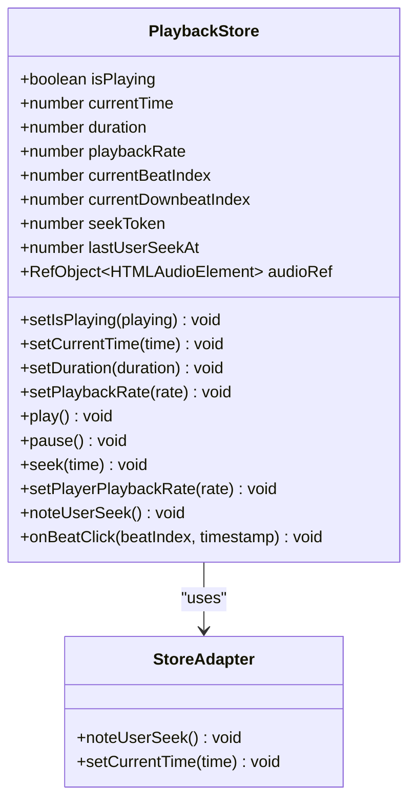

**Diagram sources**
- [playbackStore.ts:35-99](file://src/stores/playbackStore.ts#L35-L99)

### State Synchronization

The store implements comprehensive state synchronization mechanisms:

- **Multi-Source Coordination**: Synchronizes YouTube, pitch-shifted audio, and chord playback
- **Seek Token System**: Prevents race conditions during user-initiated seeks
- **Rate Fan-Out**: Distributes playback rate changes across all audio sources
- **Real-time Updates**: Provides immediate state updates to all subscribers
- **User Seek Fence**: Protects against stale progress updates after seeks

**Section sources**
- [playbackStore.ts:101-452](file://src/stores/playbackStore.ts#L101-L452)

## Comprehensive Debugging Framework

**New Section** The system now includes a comprehensive debugging framework specifically designed for pitch-sync issues.

### Debug Logging System

The debugging framework provides runtime visibility into the synchronization process:

- **Enable/Disable**: Controlled via `window.__PITCH_SYNC_DEBUG__` or `localStorage.debug:pitch-sync`
- **Throttled Logging**: High-frequency loops use throttled logging to prevent console flooding
- **Tagged Events**: Structured logging with pitchSync prefixes for easy filtering
- **Runtime Flags**: Dynamic enabling/disabling without component re-mount

### Debug Utilities

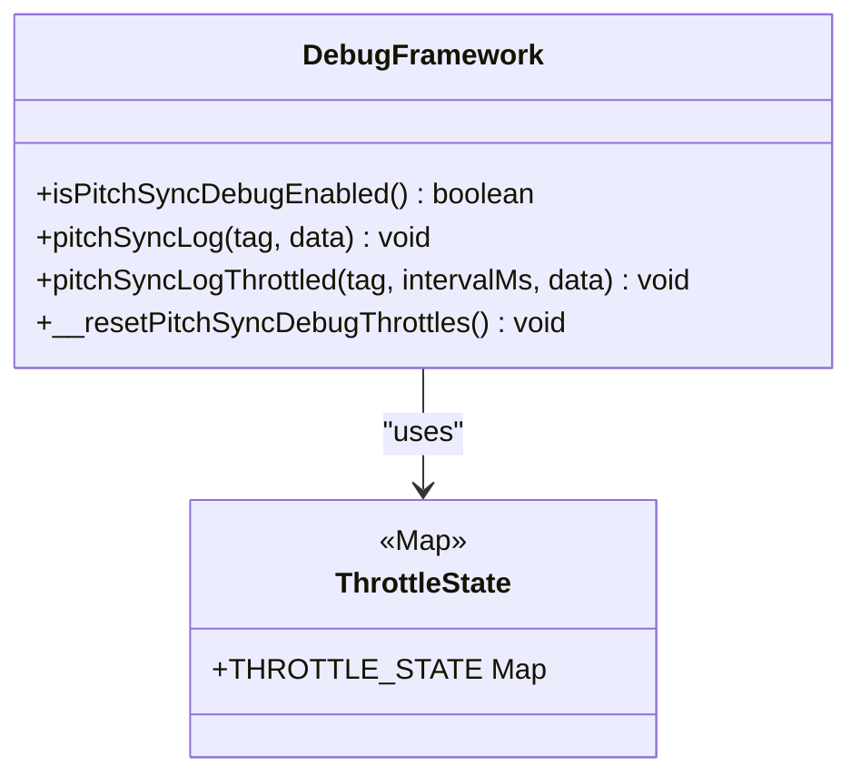

**Diagram sources**
- [pitchSyncDebug.ts:24-93](file://src/utils/pitchSyncDebug.ts#L24-L93)

### Debug Logging Categories

- **Rate Changes**: `[pitchSync.rate.change]` - tracks playback rate transitions
- **Seek Operations**: `[pitchSync.seek]` - monitors user-initiated seeks
- **Drift Corrections**: `[pitchSync.drift]` - logs slave re-anchor operations
- **Gate Decisions**: `[pitchSync.gate]` - records synchronization decisions
- **Performance Metrics**: `[pitchSync.perf]` - tracks timing and performance

### Usage Examples

```javascript
// Enable debugging in console
window.__PITCH_SYNC_DEBUG__ = true;
// or
localStorage.setItem('debug:pitch-sync','1');

// Throttled logging for high-frequency events
pitchSyncLogThrottled('slave.reAnchor', 100, {
  drift: drift.toFixed(4),
  masterPos: masterPos.toFixed(4),
  rate: rate
});
```

**Section sources**
- [pitchSyncDebug.ts:1-94](file://src/utils/pitchSyncDebug.ts#L1-L94)

## Mobile Optimization

The audio playback system is designed with mobile device constraints in mind, implementing several optimization strategies:

### Performance Optimizations

- **Lazy Loading**: Tone.js library loads only when needed (150KB reduction)
- **Memory Management**: Proper cleanup of audio nodes and buffers
- **Background Tab Handling**: Adapts chord playback for reduced CPU usage
- **Battery Efficiency**: Minimizes audio processing when not actively needed

### Mobile-Specific Features

- **Touch-Friendly Controls**: Optimized for touch interaction
- **Reduced Latency**: Minimizes audio processing delays
- **Network Optimization**: Efficient audio loading from Firebase Storage
- **Cross-Platform Compatibility**: Works across iOS Safari, Chrome, and Android browsers

## Troubleshooting Guide

### Common Issues and Solutions

#### Browser Autoplay Policies
**Problem**: Audio fails to play on mobile devices or after page reload
**Solution**: The AudioContextManager automatically handles autoplay by resuming on first user interaction

#### Audio Context Suspension
**Problem**: Audio stops when browser tab becomes inactive
**Solution**: The system detects context suspension and automatically resumes when needed

#### Cross-Browser Compatibility
**Problem**: Different behavior across browsers (Safari vs Chrome)
**Solution**: The system uses webkitAudioContext fallback and standardized Web Audio API usage

#### Pitch-Shifting Artifacts
**Problem**: Audio quality degradation during pitch shifts
**Solution**: Adaptive low-pass filtering prevents aliasing during upward pitch shifts

#### **Updated** Synchronization Issues
**Problem**: Audio desynchronization between YouTube and chord playback
**Solution**: Unified master clock architecture with drift correction maintains perfect synchronization

#### **Updated** Scrub Detection Problems
**Problem**: Scrubbing causes audio glitches or desynchronization
**Solution**: 0.75-second scrub detection threshold prevents premature seeks during scrub operations

#### **Updated** Feedback Loop Issues
**Problem**: Continuous seeking between audio sources
**Solution**: Time update flags and seek thresholds prevent feedback loops

#### **New** Debugging Pitch-Sync Issues
**Problem**: Difficulty diagnosing synchronization problems
**Solution**: Comprehensive debugging framework with runtime logging and throttled events

**Section sources**
- [audioContextManager.ts:108-121](file://src/services/audio/audioContextManager.ts#L108-L121)
- [grainPlayerPitchShiftService.ts:410-422](file://src/services/audio/grainPlayerPitchShiftService.ts#L410-L422)
- [pitchSyncDebug.ts:38-51](file://src/utils/pitchSyncDebug.ts#L38-L51)

## Best Practices

### Implementation Guidelines

1. **Always Use AudioContextManager**: Never create AudioContext instances directly
2. **Handle Asynchronous Operations**: Audio loading and initialization are asynchronous
3. **Manage Resources Properly**: Always dispose of audio services when no longer needed
4. **Respect User Controls**: Honor user-initiated seeks and rate changes
5. **Test Across Devices**: Verify functionality on different browsers and devices
6. **Use Debug Framework**: Leverage pitch-sync debugging for troubleshooting

### Performance Recommendations

- **Lazy Load Tone.js**: Only load when pitch-shifting is enabled
- **Optimize Buffer Sizes**: Use appropriate buffer sizes for different audio sources
- **Minimize DOM Interactions**: Keep audio processing in Web Audio threads
- **Monitor Memory Usage**: Dispose of unused audio nodes and buffers

### Integration Patterns

- **Hook Composition**: Use custom hooks for audio functionality
- **Store Integration**: Leverage the playback store for state management
- **Component Wrappers**: Use PitchShiftAudioManager for proper initialization
- **Error Handling**: Implement comprehensive error handling for audio operations
- **Debug Usage**: Enable debugging framework during development and testing

### **Updated** Synchronization Best Practices

- **Master Clock First**: Always update the master clock before slave components
- **Rate Verification**: Use playback store's rate verification for YouTube iframe alignment
- **Seek Coordination**: Implement seek token system to prevent race conditions
- **Scrub Detection**: Use 0.75-second threshold for detecting scrub operations
- **Feedback Prevention**: Implement time update flags and seek thresholds
- **Slave Re-Anchor**: Monitor 40ms intervals for drift correction
- **Debug Logging**: Use pitch-sync debugging for real-time synchronization monitoring