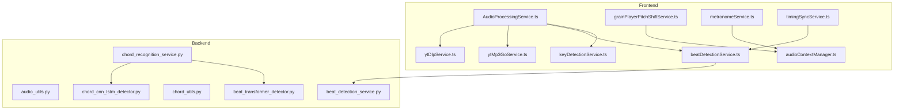
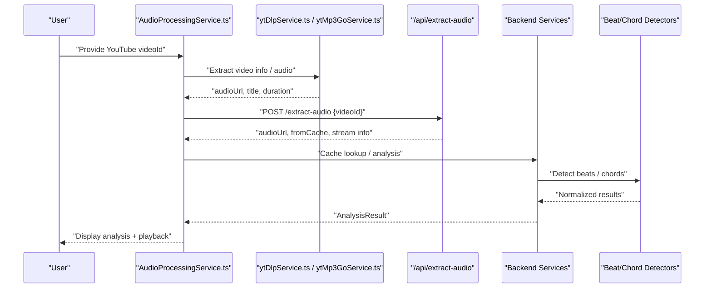
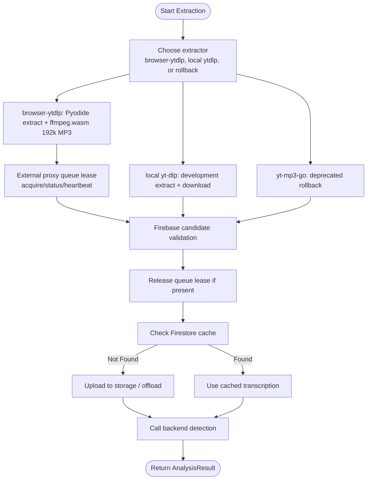
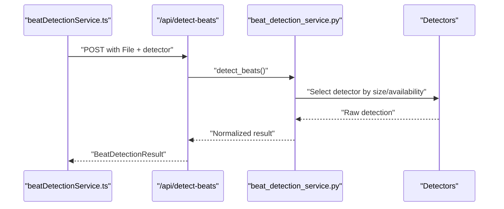
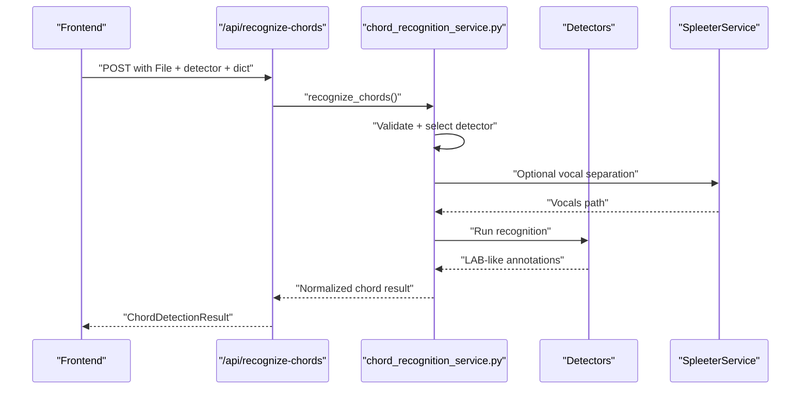
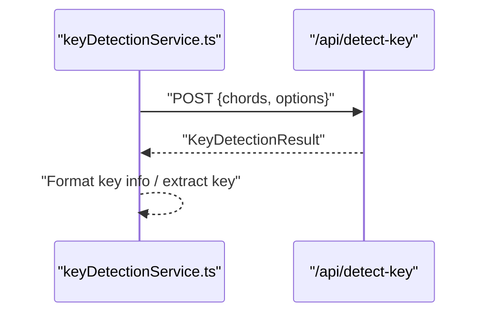
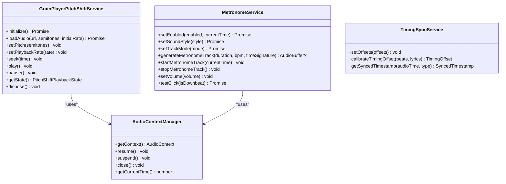
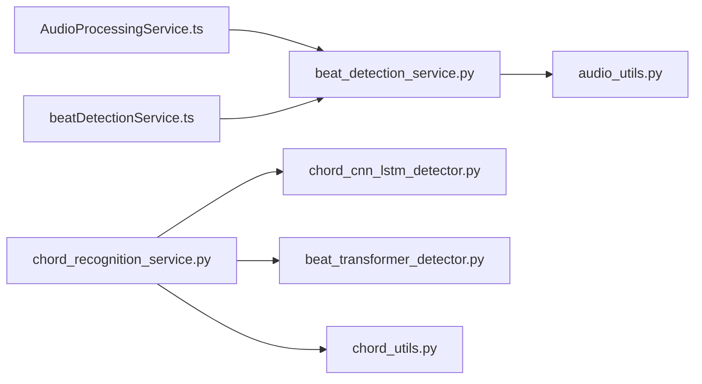

# Audio Processing and Analysis

<cite>
**Referenced Files in This Document**
- [audio_utils.py](file://python_backend/services/audio/audio_utils.py)
- [beat_detection_service.py](file://python_backend/services/audio/beat_detection_service.py)
- [chord_recognition_service.py](file://python_backend/services/audio/chord_recognition_service.py)
- [chord_utils.py](file://python_backend/services/audio/chord_utils.py)
- [beat_transformer_detector.py](file://python_backend/services/detectors/beat_transformer_detector.py)
- [chord_cnn_lstm_detector.py](file://python_backend/services/detectors/chord_cnn_lstm_detector.py)
- [audioProcessingService.ts](file://src/services/audio/audioProcessingService.ts)
- [ytDlpService.ts](file://src/services/youtube/ytDlpService.ts)
- [ytMp3GoService.ts](file://src/services/youtube/ytMp3GoService.ts)
- [audioContextManager.ts](file://src/services/audio/audioContextManager.ts)
- [grainPlayerPitchShiftService.ts](file://src/services/audio/grainPlayerPitchShiftService.ts)
- [metronomeService.ts](file://src/services/chord-playback/metronomeService.ts)
- [timingSyncService.ts](file://src/services/audio/timingSyncService.ts)
- [beatDetectionService.ts](file://src/services/audio/beatDetectionService.ts)
- [keyDetectionService.ts](file://src/services/audio/keyDetectionService.ts)
</cite>

## Table of Contents
1. [Introduction](#introduction)
2. [Project Structure](#project-structure)
3. [Core Components](#core-components)
4. [Architecture Overview](#architecture-overview)
5. [Detailed Component Analysis](#detailed-component-analysis)
6. [Dependency Analysis](#dependency-analysis)
7. [Performance Considerations](#performance-considerations)
8. [Troubleshooting Guide](#troubleshooting-guide)
9. [Conclusion](#conclusion)

## Introduction
This document explains the audio processing and analysis capabilities in ChordMiniApp. It covers the end-to-end audio pipeline from ingestion (local files and YouTube), backend processing (beat detection, chord recognition, key detection), real-time playback (Web Audio API, pitch shifting, metronome), and quality control. It also documents YouTube integration, error handling strategies, and performance optimization guidance.

## Project Structure
The audio system spans both the frontend and backend:
- Frontend services orchestrate extraction, detection, playback, and synchronization.
- Backend services provide robust beat and chord detection, plus utilities for audio validation and resampling.
- YouTube integrations offer multiple extraction strategies for production and development.

**Diagram sources**
- [audioProcessingService.ts:43-468](file://src/services/audio/audioProcessingService.ts#L43-L468)
- [beatDetectionService.ts:1-496](file://src/services/audio/beatDetectionService.ts#L1-L496)
- [keyDetectionService.ts:49-74](file://src/services/audio/keyDetectionService.ts#L49-L74)
- [grainPlayerPitchShiftService.ts:1-831](file://src/services/audio/grainPlayerPitchShiftService.ts#L1-L831)
- [audioContextManager.ts:1-125](file://src/services/audio/audioContextManager.ts#L1-L125)
- [metronomeService.ts:1-499](file://src/services/chord-playback/metronomeService.ts#L1-L499)
- [timingSyncService.ts:1-198](file://src/services/audio/timingSyncService.ts#L1-L198)
- [ytDlpService.ts:1-236](file://src/services/youtube/ytDlpService.ts#L1-L236)
- [ytMp3GoService.ts:1-204](file://src/services/youtube/ytMp3GoService.ts#L1-L204)
- [audio_utils.py:1-131](file://python_backend/services/audio/audio_utils.py#L1-L131)
- [beat_detection_service.py:1-348](file://python_backend/services/audio/beat_detection_service.py#L1-L348)
- [chord_recognition_service.py:1-322](file://python_backend/services/audio/chord_recognition_service.py#L1-L322)
- [chord_utils.py:1-294](file://python_backend/services/audio/chord_utils.py#L1-L294)
- [beat_transformer_detector.py:1-163](file://python_backend/services/detectors/beat_transformer_detector.py#L1-L163)
- [chord_cnn_lstm_detector.py:1-249](file://python_backend/services/detectors/chord_cnn_lstm_detector.py#L1-L249)

**Section sources**
- [audioProcessingService.ts:43-468](file://src/services/audio/audioProcessingService.ts#L43-L468)
- [beatDetectionService.ts:1-496](file://src/services/audio/beatDetectionService.ts#L1-L496)
- [audio_utils.py:1-131](file://python_backend/services/audio/audio_utils.py#L1-L131)

## Core Components
- Audio extraction and preprocessing:
  - Frontend: YouTube extraction via browser yt-dlp in production, local yt-dlp in development, server finalization, local file duration checks, and caching.
  - Backend: Silence trimming, duration estimation, resampling, and validation utilities.
- Detection services:
  - Beat detection: automatic model selection among Beat-Transformer, madmom, and librosa; fallback strategies and file-size-aware routing.
  - Chord recognition: model selection among Chord-CNN-LSTM and ChordMini variants; optional Spleeter vocal separation; chord dictionary validation.
  - Key detection: primary key and modulation detection with optional enharmonic corrections and Roman numeral analysis.
- Real-time playback:
  - Web Audio API integration via a shared AudioContext manager.
  - Pitch shifting using Tone.js GrainPlayer with independent detune and playbackRate, adaptive filtering, and memory-safe lifecycle.
  - Metronome with pre-rendered tracks and drum-style modes.
  - Timing synchronization service for lyrics and chords offsets.
- Quality control:
  - Validation utilities, logging, timeouts, and graceful fallbacks.

**Section sources**
- [audio_utils.py:11-131](file://python_backend/services/audio/audio_utils.py#L11-L131)
- [beat_detection_service.py:20-348](file://python_backend/services/audio/beat_detection_service.py#L20-L348)
- [chord_recognition_service.py:25-322](file://python_backend/services/audio/chord_recognition_service.py#L25-L322)
- [chord_utils.py:13-294](file://python_backend/services/audio/chord_utils.py#L13-L294)
- [audioProcessingService.ts:43-468](file://src/services/audio/audioProcessingService.ts#L43-L468)
- [grainPlayerPitchShiftService.ts:118-831](file://src/services/audio/grainPlayerPitchShiftService.ts#L118-L831)
- [metronomeService.ts:34-499](file://src/services/chord-playback/metronomeService.ts#L34-L499)
- [timingSyncService.ts:20-198](file://src/services/audio/timingSyncService.ts#L20-L198)
- [keyDetectionService.ts:49-74](file://src/services/audio/keyDetectionService.ts#L49-L74)

## Architecture Overview
End-to-end flow from YouTube to analysis and playback:

**Diagram sources**
- [audioProcessingService.ts:53-109](file://src/services/audio/audioProcessingService.ts#L53-L109)
- [ytDlpService.ts:48-145](file://src/services/youtube/ytDlpService.ts#L48-L145)
- [browserYtDlpExtractionService.ts:1-430](file://src/services/audio/browserYtDlpExtractionService.ts#L1-L430)
- [browser-ytdlp-worker.js:1-260](file://public/browser-ytdlp-worker.js#L1-L260)
- [beatDetectionService.ts:179-291](file://src/services/audio/beatDetectionService.ts#L179-L291)

## Detailed Component Analysis

### Audio Extraction and Preprocessing
- Frontend extraction:
  - Production extraction runs in the browser through Pyodide, yt-dlp, ffmpeg.wasm, and the YouTube media proxy.
  - Cloudflare Worker routing is configured with `NEXT_PUBLIC_YOUTUBE_PROXY_URL`; the in-repo proxy remains the local/default contract.
  - If Cloudflare/browser extraction fails, production stops and reports an extraction error rather than falling back to Railway/server yt-dlp.
  - yt-dlp service supports development-time extraction and filename generation compatible with backend expectations.
  - yt-mp3-go is deprecated rollback code behind `NEXT_PUBLIC_AUDIO_STRATEGY=yt-mp3-go`.
  - AudioProcessingService coordinates extraction, caching, and metadata enrichment.
  - External Cloudflare proxy extraction now uses a queue lease. The browser client calls `/queue/acquire`, polls `/queue/status` while queued, sends `/queue/heartbeat` during active extraction, and calls `/queue/release` during cleanup.
- Backend preprocessing:
  - Silence trimming, duration estimation, resampling, and validation utilities ensure robustness and consistent input for ML models.

**Diagram sources**
- [ytDlpService.ts:48-145](file://src/services/youtube/ytDlpService.ts#L48-L145)
- [browserYtDlpExtractionService.ts:1-430](file://src/services/audio/browserYtDlpExtractionService.ts#L1-L430)
- [audioProcessingService.ts:111-234](file://src/services/audio/audioProcessingService.ts#L111-L234)

**Section sources**
- [ytDlpService.ts:38-236](file://src/services/youtube/ytDlpService.ts#L38-L236)
- [browserYtDlpExtractionService.ts:1-430](file://src/services/audio/browserYtDlpExtractionService.ts#L1-L430)
- [browser-ytdlp-worker.js:1-260](file://public/browser-ytdlp-worker.js#L1-L260)
- [audioProcessingService.ts:43-468](file://src/services/audio/audioProcessingService.ts#L43-L468)
- [audio_utils.py:12-131](file://python_backend/services/audio/audio_utils.py#L12-L131)

### Beat Detection Pipeline
- Automatic model selection:
  - Considers availability, file size, and performance characteristics.
  - Falls back from Beat-Transformer to madmom/librosa when oversized or unavailable.
- Backend orchestration:
  - Validates files, selects detector, runs detection, normalizes output, and enriches with metadata.
- Frontend integration:
  - Rate-limited detection with timeouts, progress callbacks, and fallback logic.

**Diagram sources**
- [beatDetectionService.ts:179-291](file://src/services/audio/beatDetectionService.ts#L179-L291)
- [beat_detection_service.py:163-311](file://python_backend/services/audio/beat_detection_service.py#L163-L311)
- [beat_transformer_detector.py:73-147](file://python_backend/services/detectors/beat_transformer_detector.py#L73-L147)

**Section sources**
- [beat_detection_service.py:20-348](file://python_backend/services/audio/beat_detection_service.py#L20-L348)
- [beat_transformer_detector.py:15-163](file://python_backend/services/detectors/beat_transformer_detector.py#L15-L163)
- [beatDetectionService.ts:179-496](file://src/services/audio/beatDetectionService.ts#L179-L496)

### Chord Recognition Pipeline
- Model selection and fallback:
  - Chooses among Chord-CNN-LSTM and ChordMini variants based on availability and file size.
  - Optionally applies Spleeter vocal separation to improve accuracy.
- Backend orchestration:
  - Validates inputs, selects detector, applies chord dictionary rules, and normalizes results.
- Frontend integration:
  - Uses rate-limited detection and caches results for reuse.

**Diagram sources**
- [chord_recognition_service.py:173-287](file://python_backend/services/audio/chord_recognition_service.py#L173-L287)
- [chord_cnn_lstm_detector.py:78-182](file://python_backend/services/detectors/chord_cnn_lstm_detector.py#L78-L182)
- [audioProcessingService.ts:186-221](file://src/services/audio/audioProcessingService.ts#L186-L221)

**Section sources**
- [chord_recognition_service.py:25-322](file://python_backend/services/audio/chord_recognition_service.py#L25-L322)
- [chord_cnn_lstm_detector.py:17-249](file://python_backend/services/detectors/chord_cnn_lstm_detector.py#L17-L249)
- [audioProcessingService.ts:111-234](file://src/services/audio/audioProcessingService.ts#L111-L234)

### Key Detection and Enharmonic Correction
- Endpoint-driven detection:
  - Sends chord sequences to `/api/detect-key` for Gemini-backed primary key/modulation inference.
  - Optional enharmonic corrections and Roman numeral analysis.
  - Uses prompt-versioned cache keys and REST-based Firestore admin helpers for container-friendly cache reads/writes.
  - Falls back to heuristic key estimation when the model response is unavailable or unusable.
- Frontend integration:
  - Formats key info for display and extracts key names.

**Diagram sources**
- [keyDetectionService.ts:49-74](file://src/services/audio/keyDetectionService.ts#L49-L74)

**Section sources**
- [keyDetectionService.ts:1-101](file://src/services/audio/keyDetectionService.ts#L1-L101)

### Real-Time Audio Analysis and Playback
- Web Audio API integration:
  - Centralized AudioContext manager handles initialization, resume/suspend, and lifecycle.
- Pitch shifting with Tone.js:
  - GrainPlayer enables independent detune and playbackRate with adaptive filtering and limiter.
  - Robust anchor-based timekeeping to avoid drift versus master clock.
- Metronome:
  - Pre-rendered tracks or drum-style generation with configurable sound styles and modes.
- Timing synchronization:
  - Offsets for audio/lyrics/chords with calibration and confidence scoring.

**Diagram sources**
- [audioContextManager.ts:8-125](file://src/services/audio/audioContextManager.ts#L8-L125)
- [grainPlayerPitchShiftService.ts:118-831](file://src/services/audio/grainPlayerPitchShiftService.ts#L118-L831)
- [metronomeService.ts:34-499](file://src/services/chord-playback/metronomeService.ts#L34-L499)
- [timingSyncService.ts:20-198](file://src/services/audio/timingSyncService.ts#L20-L198)

**Section sources**
- [audioContextManager.ts:1-125](file://src/services/audio/audioContextManager.ts#L1-L125)
- [grainPlayerPitchShiftService.ts:118-831](file://src/services/audio/grainPlayerPitchShiftService.ts#L118-L831)
- [metronomeService.ts:34-499](file://src/services/chord-playback/metronomeService.ts#L34-L499)
- [timingSyncService.ts:20-198](file://src/services/audio/timingSyncService.ts#L20-L198)

## Dependency Analysis
- Frontend-to-backend:
  - Frontend services call Next.js API routes that proxy to Python backend services.
  - Offload uploads integrate with backend detection endpoints for large files.
- Backend detector ecosystem:
  - BeatTransformerDetector and ChordCNNLSTMDetector provide normalized interfaces.
  - BeatDetectionService and ChordRecognitionService orchestrate model selection and fallbacks.
- Audio utilities:
  - Shared preprocessing utilities underpin robustness across detectors.

**Diagram sources**
- [audioProcessingService.ts:111-234](file://src/services/audio/audioProcessingService.ts#L111-L234)
- [beatDetectionService.ts:179-496](file://src/services/audio/beatDetectionService.ts#L179-L496)
- [beat_detection_service.py:163-311](file://python_backend/services/audio/beat_detection_service.py#L163-L311)
- [chord_recognition_service.py:173-287](file://python_backend/services/audio/chord_recognition_service.py#L173-L287)
- [chord_cnn_lstm_detector.py:78-182](file://python_backend/services/detectors/chord_cnn_lstm_detector.py#L78-L182)
- [beat_transformer_detector.py:73-147](file://python_backend/services/detectors/beat_transformer_detector.py#L73-L147)
- [audio_utils.py:70-131](file://python_backend/services/audio/audio_utils.py#L70-L131)
- [chord_utils.py:102-134](file://python_backend/services/audio/chord_utils.py#L102-L134)

**Section sources**
- [beat_detection_service.py:1-348](file://python_backend/services/audio/beat_detection_service.py#L1-L348)
- [chord_recognition_service.py:1-322](file://python_backend/services/audio/chord_recognition_service.py#L1-L322)
- [chord_cnn_lstm_detector.py:1-249](file://python_backend/services/detectors/chord_cnn_lstm_detector.py#L1-L249)
- [beat_transformer_detector.py:1-163](file://python_backend/services/detectors/beat_transformer_detector.py#L1-L163)
- [audio_utils.py:1-131](file://python_backend/services/audio/audio_utils.py#L1-L131)
- [chord_utils.py:1-294](file://python_backend/services/audio/chord_utils.py#L1-L294)

## Performance Considerations
- Model selection and file-size awareness:
  - Beat detection service prefers madmom for small files and Beat-Transformer/librosa for larger ones, with explicit size limits.
- Streaming and caching:
  - Frontend services support stream URLs and cache lookups to minimize repeated downloads.
- Web Audio optimization:
  - Adaptive filter cutoff and limiter in pitch shifting; pre-rendered metronome tracks; passive time anchors to avoid drift.
- Backend timeouts and rate limiting:
  - Frontend detection uses safe timeout signals and rate-limiting wrappers to prevent long-running requests.

[No sources needed since this section provides general guidance]

## Troubleshooting Guide
- Audio extraction failures:
  - yt-dlp service availability and tests; yt-mp3-go remains available only as an explicitly configured rollback.
  - Video info extraction via dedicated API or fallback path.
- Backend detection errors:
  - 403 Forbidden indicates backend accessibility issues (e.g., port conflicts); 413 indicates oversized files; 500 indicates internal errors.
  - Automatic fallback from Beat-Transformer to madmom when appropriate.
- Web Audio issues:
  - Resume AudioContext on first user interaction; handle suspended/interrupted states; verify shared context setup.
- Pitch shifting artifacts:
  - Ensure adaptive filter cutoff matches detune; ramp gain transitions; avoid stop/start cycles for rate changes.
- Timing synchronization:
  - Calibrate offsets using strong beats and lyrics; monitor confidence; reset calibration when needed.

**Section sources**
- [ytDlpService.ts:178-214](file://src/services/youtube/ytDlpService.ts#L178-L214)
- [audioProcessingService.ts:236-356](file://src/services/audio/audioProcessingService.ts#L236-L356)
- [beatDetectionService.ts:232-291](file://src/services/audio/beatDetectionService.ts#L232-L291)
- [beat_detection_service.py:176-311](file://python_backend/services/audio/beat_detection_service.py#L176-L311)
- [audioContextManager.ts:50-121](file://src/services/audio/audioContextManager.ts#L50-L121)
- [grainPlayerPitchShiftService.ts:678-704](file://src/services/audio/grainPlayerPitchShiftService.ts#L678-L704)
- [timingSyncService.ts:118-198](file://src/services/audio/timingSyncService.ts#L118-L198)

## Conclusion
ChordMiniApp’s audio system combines robust frontend orchestration with backend ML services to deliver reliable beat and chord analysis, key detection, and real-time playback. The design emphasizes resilience (automatic model fallbacks, graceful error handling), performance (adaptive filtering, pre-rendered tracks, caching), and user experience (precise timing, metronome, and synchronized playback).
