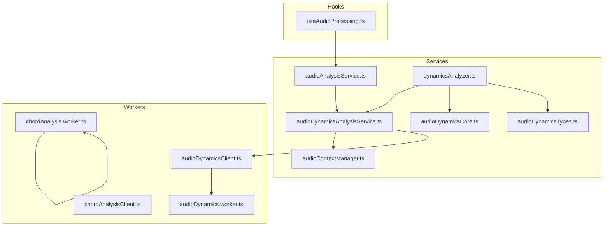
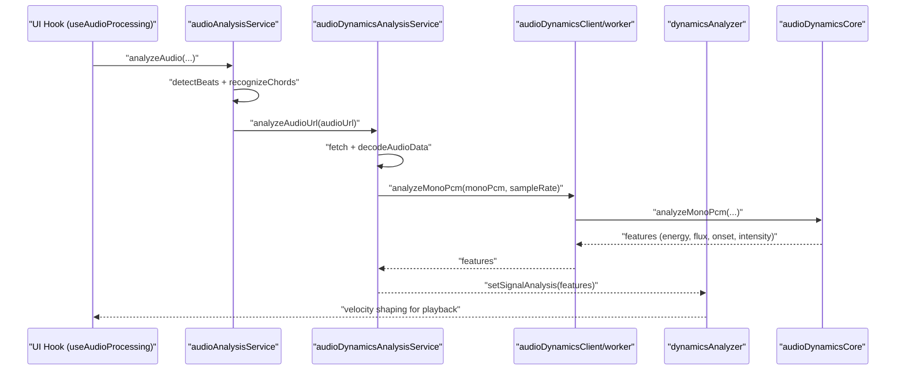
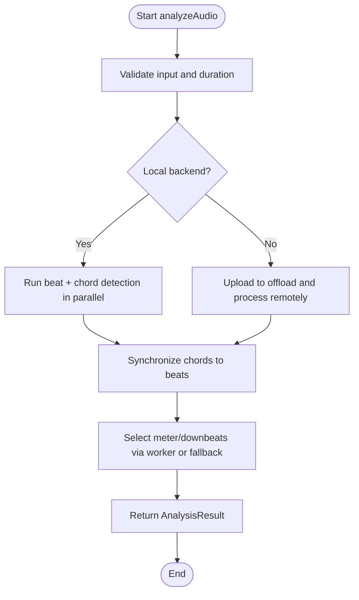
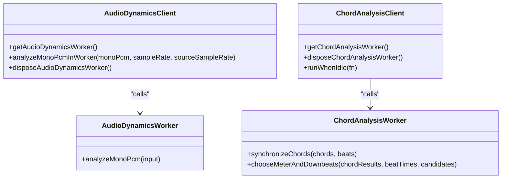
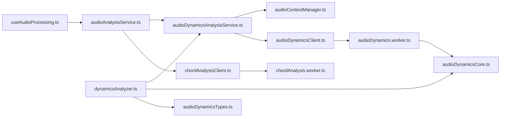

# Real-time Audio Analysis

<cite>
**Referenced Files in This Document**
- [audioAnalysisService.ts](file://src/services/audio/audioAnalysisService.ts)
- [audioDynamicsAnalysisService.ts](file://src/services/audio/audioDynamicsAnalysisService.ts)
- [dynamicsAnalyzer.ts](file://src/services/audio/dynamicsAnalyzer.ts)
- [audioContextManager.ts](file://src/services/audio/audioContextManager.ts)
- [audioDynamicsCore.ts](file://src/services/audio/audioDynamicsCore.ts)
- [audioDynamicsTypes.ts](file://src/services/audio/audioDynamicsTypes.ts)
- [audioDynamics.worker.ts](file://src/workers/audioDynamics.worker.ts)
- [audioDynamicsClient.ts](file://src/workers/audioDynamicsClient.ts)
- [chordAnalysis.worker.ts](file://src/workers/chordAnalysis.worker.ts)
- [chordAnalysisClient.ts](file://src/workers/chordAnalysisClient.ts)
- [useAudioProcessing.ts](file://src/hooks/audio/useAudioProcessing.ts)
</cite>

## Table of Contents
1. [Introduction](#introduction)
2. [Project Structure](#project-structure)
3. [Core Components](#core-components)
4. [Architecture Overview](#architecture-overview)
5. [Detailed Component Analysis](#detailed-component-analysis)
6. [Dependency Analysis](#dependency-analysis)
7. [Performance Considerations](#performance-considerations)
8. [Troubleshooting Guide](#troubleshooting-guide)
9. [Conclusion](#conclusion)

## Introduction
This document explains the real-time audio analysis capabilities in ChordMiniApp. It covers Web Audio API integration, audio context management, node graph construction, and real-time processing pipelines. It documents the audio analysis services for continuous monitoring and dynamic range analysis, and details the worker-based architecture that performs heavy computations off the main thread. It also includes buffer management strategies, memory optimization techniques, performance monitoring, examples of audio feature extraction, real-time visualization integration, latency optimization, and solutions to common issues with browser audio APIs, worker communication, and performance bottlenecks.

## Project Structure
The real-time audio analysis spans several modules:
- Services for orchestration and analysis
- Worker clients and dedicated workers for background processing
- Audio context management for browser audio lifecycle
- Types and data models for audio dynamics features

**Diagram sources**
- [audioAnalysisService.ts:1-704](file://src/services/audio/audioAnalysisService.ts#L1-L704)
- [audioDynamicsAnalysisService.ts:1-142](file://src/services/audio/audioDynamicsAnalysisService.ts#L1-L142)
- [dynamicsAnalyzer.ts:1-846](file://src/services/audio/dynamicsAnalyzer.ts#L1-L846)
- [audioContextManager.ts:1-125](file://src/services/audio/audioContextManager.ts#L1-L125)
- [audioDynamicsCore.ts:1-232](file://src/services/audio/audioDynamicsCore.ts#L1-L232)
- [audioDynamicsTypes.ts:1-43](file://src/services/audio/audioDynamicsTypes.ts#L1-L43)
- [audioDynamics.worker.ts:1-14](file://src/workers/audioDynamics.worker.ts#L1-L14)
- [audioDynamicsClient.ts:1-52](file://src/workers/audioDynamicsClient.ts#L1-L52)
- [chordAnalysis.worker.ts:1-103](file://src/workers/chordAnalysis.worker.ts#L1-L103)
- [chordAnalysisClient.ts:1-50](file://src/workers/chordAnalysisClient.ts#L1-L50)
- [useAudioProcessing.ts:1-126](file://src/hooks/audio/useAudioProcessing.ts#L1-L126)

**Section sources**
- [audioAnalysisService.ts:1-704](file://src/services/audio/audioAnalysisService.ts#L1-L704)
- [audioDynamicsAnalysisService.ts:1-142](file://src/services/audio/audioDynamicsAnalysisService.ts#L1-L142)
- [dynamicsAnalyzer.ts:1-846](file://src/services/audio/dynamicsAnalyzer.ts#L1-L846)
- [audioContextManager.ts:1-125](file://src/services/audio/audioContextManager.ts#L1-L125)
- [audioDynamicsCore.ts:1-232](file://src/services/audio/audioDynamicsCore.ts#L1-L232)
- [audioDynamicsTypes.ts:1-43](file://src/services/audio/audioDynamicsTypes.ts#L1-L43)
- [audioDynamics.worker.ts:1-14](file://src/workers/audioDynamics.worker.ts#L1-L14)
- [audioDynamicsClient.ts:1-52](file://src/workers/audioDynamicsClient.ts#L1-L52)
- [chordAnalysis.worker.ts:1-103](file://src/workers/chordAnalysis.worker.ts#L1-L103)
- [chordAnalysisClient.ts:1-50](file://src/workers/chordAnalysisClient.ts#L1-L50)
- [useAudioProcessing.ts:1-126](file://src/hooks/audio/useAudioProcessing.ts#L1-L126)

## Core Components
- Audio context management: centralized singleton managing AudioContext lifecycle, resume/suspend/close, and autoplay policy compliance.
- Audio analysis orchestration: coordinates beat detection and chord recognition, handles large files via offload, and synchronizes results.
- Dynamic range analysis: computes energy contours, spectral flux, onset, and intensity from decoded audio buffers.
- Worker-based processing: offloads heavy computations to Web Workers for audio dynamics and chord synchronization.
- Hook integration: React hooks coordinate extraction and analysis flows in the UI.

Key responsibilities:
- Web Audio API integration: decoding audio buffers, constructing node graphs, and scheduling real-time processing.
- Feature extraction: RMS energy, spectral flux, onset detection, and intensity contours.
- Worker communication: Comlink-based remote proxies for robust cross-thread messaging.
- Buffer management: downmixing, resampling, and memory-conscious FFT windows.

**Section sources**
- [audioContextManager.ts:1-125](file://src/services/audio/audioContextManager.ts#L1-L125)
- [audioAnalysisService.ts:1-704](file://src/services/audio/audioAnalysisService.ts#L1-L704)
- [audioDynamicsAnalysisService.ts:1-142](file://src/services/audio/audioDynamicsAnalysisService.ts#L1-L142)
- [dynamicsAnalyzer.ts:1-846](file://src/services/audio/dynamicsAnalyzer.ts#L1-L846)
- [audioDynamicsCore.ts:1-232](file://src/services/audio/audioDynamicsCore.ts#L1-L232)
- [audioDynamicsTypes.ts:1-43](file://src/services/audio/audioDynamicsTypes.ts#L1-L43)
- [audioDynamics.worker.ts:1-14](file://src/workers/audioDynamics.worker.ts#L1-L14)
- [audioDynamicsClient.ts:1-52](file://src/workers/audioDynamicsClient.ts#L1-L52)
- [chordAnalysis.worker.ts:1-103](file://src/workers/chordAnalysis.worker.ts#L1-L103)
- [chordAnalysisClient.ts:1-50](file://src/workers/chordAnalysisClient.ts#L1-L50)
- [useAudioProcessing.ts:1-126](file://src/hooks/audio/useAudioProcessing.ts#L1-L126)

## Architecture Overview
The system integrates browser audio APIs with a worker-based pipeline to deliver real-time audio analysis:
- UI triggers audio extraction and analysis via a React hook.
- The orchestration service fetches and validates audio, then detects beats and recognizes chords.
- Dynamic analysis optionally decodes audio and computes energy contours and intensity features.
- Workers handle computationally intensive tasks (dynamics and synchronization) to avoid blocking the UI.

**Diagram sources**
- [useAudioProcessing.ts:1-126](file://src/hooks/audio/useAudioProcessing.ts#L1-L126)
- [audioAnalysisService.ts:1-704](file://src/services/audio/audioAnalysisService.ts#L1-L704)
- [audioDynamicsAnalysisService.ts:1-142](file://src/services/audio/audioDynamicsAnalysisService.ts#L1-L142)
- [audioDynamicsClient.ts:1-52](file://src/workers/audioDynamicsClient.ts#L1-L52)
- [audioDynamics.worker.ts:1-14](file://src/workers/audioDynamics.worker.ts#L1-L14)
- [audioDynamicsCore.ts:1-232](file://src/services/audio/audioDynamicsCore.ts#L1-L232)
- [dynamicsAnalyzer.ts:1-846](file://src/services/audio/dynamicsAnalyzer.ts#L1-L846)

## Detailed Component Analysis

### Web Audio API Integration and Audio Context Management
- Centralized AudioContext management ensures lazy initialization, resume/suspend semantics, and compatibility with autoplay policies (including Safari).
- Provides current time and lifecycle controls to coordinate scheduling and resource cleanup.

Implementation highlights:
- Singleton pattern with lazy creation and re-initialization on visibility change.
- Auto-resume on user interaction events.
- Graceful handling of closed/interrupted states.

**Section sources**
- [audioContextManager.ts:1-125](file://src/services/audio/audioContextManager.ts#L1-L125)

### Audio Analysis Orchestration (audioAnalysisService)
Responsibilities:
- Validates inputs (File, AudioBuffer, URL), resolves durations, and enforces analysis duration limits.
- Detects beats and recognizes chords concurrently to reduce latency.
- Synchronizes results and selects meter/downbeats using a worker-backed heuristic.
- Supports offload path for large files via Firebase offload.

Key behaviors:
- Parallel execution of beat detection and chord recognition.
- Robust error handling with user-friendly messages and rate-limiting awareness.
- Meter selection fallback to main thread if worker fails.

**Diagram sources**
- [audioAnalysisService.ts:328-704](file://src/services/audio/audioAnalysisService.ts#L328-L704)

**Section sources**
- [audioAnalysisService.ts:1-704](file://src/services/audio/audioAnalysisService.ts#L1-L704)

### Dynamic Range Analysis (audioDynamicsAnalysisService)
Responsibilities:
- Decodes audio from URL, downmixes to mono, downsamples to a fixed rate, and computes dynamics features.
- Uses a worker for feature extraction; falls back to main-thread computation if worker is unavailable.
- Caches results and in-flight promises to avoid redundant work.

Processing pipeline:
- Fetch audio bytes, decode to AudioBuffer.
- Downmix and resample to target sample rate.
- Transfer Float32 PCM to worker with transferable objects.
- Summarize features into contours with quantiles and time-step metadata.

**Section sources**
- [audioDynamicsAnalysisService.ts:1-142](file://src/services/audio/audioDynamicsAnalysisService.ts#L1-L142)

### Dynamics Feature Extraction (audioDynamicsCore)
Computes:
- RMS energy per frame.
- Spectral flux between successive FFT frames.
- Onset detection with exponential decay smoothing.
- Intensity as a weighted combination of energy, flux, and onset.

Implementation details:
- Hann windowing and FFT magnitude calculation.
- Quantile-based normalization and exponential smoothing.
- Contour summarization with min/max and percentile statistics.

**Section sources**
- [audioDynamicsCore.ts:1-232](file://src/services/audio/audioDynamicsCore.ts#L1-L232)
- [audioDynamicsTypes.ts:1-43](file://src/services/audio/audioDynamicsTypes.ts#L1-L43)

### Dynamics Analyzer (dynamicsAnalyzer)
Responsibilities:
- Builds a layered velocity shaping model combining:
  - Audio energy contour (optional).
  - Metric accents (downbeat/backbeat emphasis).
  - Phrasing arcs (crescendo/diminuendo).
  - Harmonic tension (chord quality).
  - Tempo-aware scaling.
  - Macro song contour (intro/outro).
- Provides a smooth, EMA-filtered velocity multiplier for real-time playback.

Key algorithms:
- Section-aware contour building from segmentation data.
- Intensity band classification and motion/attack modeling.
- Velocity blending with last-known values for continuity.

**Section sources**
- [dynamicsAnalyzer.ts:1-846](file://src/services/audio/dynamicsAnalyzer.ts#L1-L846)

### Worker-Based Architecture
- audioDynamicsClient: wraps a Web Worker using Comlink, transfers Float32Array buffers, and exposes a typed API.
- audioDynamics.worker: exposes analyzeMonoPcm for background processing.
- chordAnalysisClient: creates a worker for chord synchronization and meter selection.
- chordAnalysis.worker: implements synchronization, scoring heuristics, and meter selection.

Communication model:
- Comlink wrap/expose pattern for robust cross-thread messaging.
- Transferable objects minimize copying overhead for large PCM arrays.

**Diagram sources**
- [audioDynamicsClient.ts:1-52](file://src/workers/audioDynamicsClient.ts#L1-L52)
- [audioDynamics.worker.ts:1-14](file://src/workers/audioDynamics.worker.ts#L1-L14)
- [chordAnalysisClient.ts:1-50](file://src/workers/chordAnalysisClient.ts#L1-L50)
- [chordAnalysis.worker.ts:1-103](file://src/workers/chordAnalysis.worker.ts#L1-L103)

**Section sources**
- [audioDynamicsClient.ts:1-52](file://src/workers/audioDynamicsClient.ts#L1-L52)
- [audioDynamics.worker.ts:1-14](file://src/workers/audioDynamics.worker.ts#L1-L14)
- [chordAnalysisClient.ts:1-50](file://src/workers/chordAnalysisClient.ts#L1-L50)
- [chordAnalysis.worker.ts:1-103](file://src/workers/chordAnalysis.worker.ts#L1-L103)

### Real-time Processing Pipeline and Node Graph Construction
- Decode audio from URL or Blob to AudioBuffer.
- Construct a node graph using the shared AudioContext for scheduling and playback.
- Downmix and resample to a fixed rate suitable for analysis.
- Apply Hann windows and perform FFT to compute spectral features.
- Schedule callbacks for real-time visualization updates and playback.

Integration points:
- Use AudioContextManager for consistent timing and lifecycle.
- Use DynamicsAnalyzer to compute velocity envelopes for playback.
- Use Worker APIs to offload feature extraction and synchronization.

[No sources needed since this section synthesizes previously analyzed components]

### Examples of Audio Feature Extraction
- Energy contour: RMS energy per window with exponential smoothing.
- Spectral flux: positive differences between successive FFT magnitudes.
- Onset: local peaks in flux with decay-based persistence.
- Intensity: weighted combination of energy, flux, and onset.

These features are summarized into contours with quantiles and time-step metadata for downstream use in velocity shaping.

**Section sources**
- [audioDynamicsCore.ts:131-231](file://src/services/audio/audioDynamicsCore.ts#L131-L231)
- [audioDynamicsTypes.ts:1-43](file://src/services/audio/audioDynamicsTypes.ts#L1-L43)

### Real-time Visualization Integration
- DynamicsAnalyzer provides intensity, motion, and attack metrics for real-time UI feedback.
- Worker-based feature extraction prevents UI stalls during visualization updates.
- Use the audio context’s currentTime to align visual updates with playback.

[No sources needed since this section provides conceptual guidance]

### Latency Optimization
- Parallelize independent tasks (beat detection and chord recognition).
- Use workers for heavy computations (dynamics and synchronization).
- Downsample to a fixed rate for reduced computation.
- Transfer buffers using transferable objects to minimize copies.
- Cache results and in-flight promises to avoid recomputation.

**Section sources**
- [audioAnalysisService.ts:374-421](file://src/services/audio/audioAnalysisService.ts#L374-L421)
- [audioDynamicsAnalysisService.ts:101-136](file://src/services/audio/audioDynamicsAnalysisService.ts#L101-L136)
- [audioDynamicsClient.ts:28-43](file://src/workers/audioDynamicsClient.ts#L28-L43)

## Dependency Analysis
The following diagram shows key dependencies among modules involved in real-time audio analysis:

**Diagram sources**
- [useAudioProcessing.ts:1-126](file://src/hooks/audio/useAudioProcessing.ts#L1-L126)
- [audioAnalysisService.ts:1-704](file://src/services/audio/audioAnalysisService.ts#L1-L704)
- [audioDynamicsAnalysisService.ts:1-142](file://src/services/audio/audioDynamicsAnalysisService.ts#L1-L142)
- [audioContextManager.ts:1-125](file://src/services/audio/audioContextManager.ts#L1-L125)
- [audioDynamicsClient.ts:1-52](file://src/workers/audioDynamicsClient.ts#L1-L52)
- [audioDynamics.worker.ts:1-14](file://src/workers/audioDynamics.worker.ts#L1-L14)
- [audioDynamicsCore.ts:1-232](file://src/services/audio/audioDynamicsCore.ts#L1-L232)
- [dynamicsAnalyzer.ts:1-846](file://src/services/audio/dynamicsAnalyzer.ts#L1-L846)
- [audioDynamicsTypes.ts:1-43](file://src/services/audio/audioDynamicsTypes.ts#L1-L43)
- [chordAnalysisClient.ts:1-50](file://src/workers/chordAnalysisClient.ts#L1-L50)
- [chordAnalysis.worker.ts:1-103](file://src/workers/chordAnalysis.worker.ts#L1-L103)

**Section sources**
- [audioAnalysisService.ts:1-704](file://src/services/audio/audioAnalysisService.ts#L1-L704)
- [audioDynamicsAnalysisService.ts:1-142](file://src/services/audio/audioDynamicsAnalysisService.ts#L1-L142)
- [dynamicsAnalyzer.ts:1-846](file://src/services/audio/dynamicsAnalyzer.ts#L1-L846)
- [audioDynamicsCore.ts:1-232](file://src/services/audio/audioDynamicsCore.ts#L1-L232)
- [audioDynamicsTypes.ts:1-43](file://src/services/audio/audioDynamicsTypes.ts#L1-L43)
- [audioContextManager.ts:1-125](file://src/services/audio/audioContextManager.ts#L1-L125)
- [audioDynamicsClient.ts:1-52](file://src/workers/audioDynamicsClient.ts#L1-L52)
- [audioDynamics.worker.ts:1-14](file://src/workers/audioDynamics.worker.ts#L1-L14)
- [chordAnalysisClient.ts:1-50](file://src/workers/chordAnalysisClient.ts#L1-L50)
- [chordAnalysis.worker.ts:1-103](file://src/workers/chordAnalysis.worker.ts#L1-L103)
- [useAudioProcessing.ts:1-126](file://src/hooks/audio/useAudioProcessing.ts#L1-L126)

## Performance Considerations
- Worker utilization: Offload heavy computations (FFT, feature extraction, synchronization) to Web Workers to keep the UI responsive.
- Buffer management: Downmix stereo to mono, resample to a fixed rate, and use Hann windows to reduce computational load.
- Transferable objects: Pass Float32Array buffers with transfer to avoid deep copying.
- Caching: Cache decoded buffers and analysis results keyed by URL to avoid repeated work.
- Concurrency: Run independent tasks (beat detection and chord recognition) in parallel.
- Memory: Dispose workers when no longer needed to free resources.

[No sources needed since this section provides general guidance]

## Troubleshooting Guide
Common issues and resolutions:
- Autoplay policy failures: Use AudioContextManager to resume on user interaction; ensure context is running before scheduling.
- Worker creation failures: Fallback to main-thread computation; log warnings and continue gracefully.
- Large audio files: Use offload path for processing; enforce size and duration limits.
- Invalid audio buffers: Validate sample rates and durations; reject unsupported configurations.
- CORS/streaming: Resolve audio URLs via proxy endpoints; ensure correct headers for streaming.
- UI stutters: Move heavy work to workers; avoid synchronous operations on the main thread.

**Section sources**
- [audioContextManager.ts:50-98](file://src/services/audio/audioContextManager.ts#L50-L98)
- [audioDynamicsClient.ts:8-21](file://src/workers/audioDynamicsClient.ts#L8-L21)
- [audioAnalysisService.ts:133-143](file://src/services/audio/audioAnalysisService.ts#L133-L143)
- [audioDynamicsAnalysisService.ts:116-136](file://src/services/audio/audioDynamicsAnalysisService.ts#L116-L136)

## Conclusion
ChordMiniApp’s real-time audio analysis combines robust Web Audio API integration with a worker-based architecture to deliver responsive, accurate audio feature extraction and playback shaping. The system manages audio contexts carefully, optimizes buffer processing, and leverages parallelism and caching to maintain low latency. By delegating heavy computations to workers and exposing typed APIs for cross-thread communication, the platform achieves scalable, real-time audio analysis suitable for interactive applications.