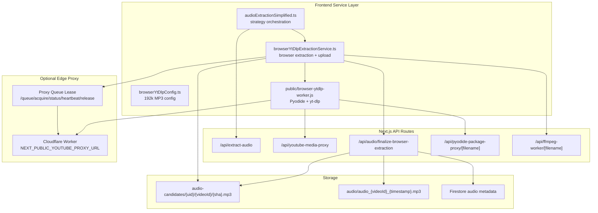
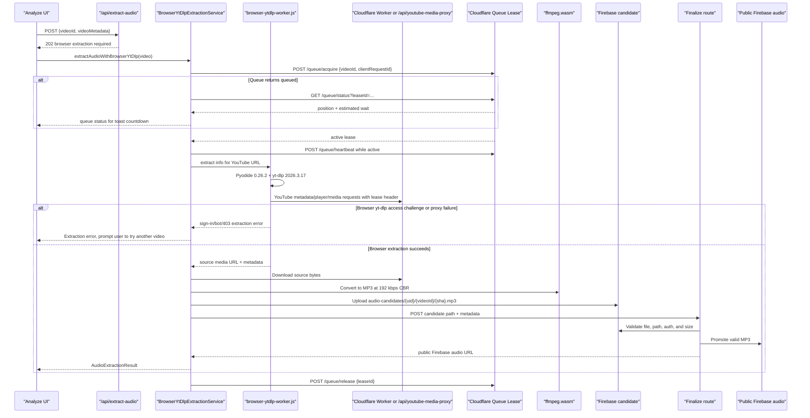

# YouTube Integration

<cite>
**Referenced Files in This Document**
- [audioExtractionSimplified.ts](file://src/services/audio/audioExtractionSimplified.ts)
- [browserYtDlpExtractionService.ts](file://src/services/audio/browserYtDlpExtractionService.ts)
- [browserYtDlpConfig.ts](file://src/services/audio/browserYtDlpConfig.ts)
- [browser-ytdlp-worker.js](file://public/browser-ytdlp-worker.js)
- [route.ts](file://src/app/api/extract-audio/route.ts)
- [route.ts](file://src/app/api/youtube-media-proxy/route.ts)
- [route.ts](file://src/app/api/audio/finalize-browser-extraction/route.ts)
- [route.ts](file://src/app/api/audio/native-ytdlp-fallback/route.ts)
- [route.ts](file://src/app/api/pyodide-package-proxy/[filename]/route.ts)
- [route.ts](file://src/app/api/ffmpeg-worker/[filename]/route.ts)
- [browserAudioValidation.ts](file://src/utils/browserAudioValidation.ts)
- [publicConfig.ts](file://src/config/publicConfig.ts)
- [ytMp3GoService.ts](file://src/services/youtube/ytMp3GoService.ts)
- [ytDlpService.ts](file://src/services/youtube/ytDlpService.ts)
</cite>

## Introduction
ChordMini production YouTube extraction now runs primarily in the user's browser. The browser worker loads Pyodide, installs a pinned yt-dlp wheel, obtains a playable YouTube media URL through yt-dlp, downloads the source bytes through a YouTube media proxy, converts them with ffmpeg.wasm to a fixed 192 kbps MP3, uploads a private candidate to Firebase Storage, and asks the backend finalizer to validate and promote the file.

Production can route the browser worker through a Cloudflare Worker proxy by setting `NEXT_PUBLIC_YOUTUBE_PROXY_URL`. The external proxy now also owns the extraction queue contract: the browser client acquires a lease before using the proxy, heartbeats while extraction is active, and releases the lease when the attempt finishes or is aborted. The in-repo `/api/youtube-media-proxy` remains as the local/default media proxy contract, while the deployed Cloudflare Worker and queue implementation may be managed outside the tracked repository for security and operational reasons. Local development still uses the existing server-side yt-dlp path unless explicitly switched to browser extraction for testing. `yt-mp3-go` remains in the codebase as a deprecated rollback path behind `NEXT_PUBLIC_AUDIO_STRATEGY=yt-mp3-go`, but it is no longer the normal production strategy or public status dependency.

## Project Structure


## Production Browser Extraction Flow


## Browser Worker Configuration
- Runtime packages:
  - Pyodide: `0.26.2`
  - yt-dlp wheel: `2026.3.17`
  - ffmpeg.wasm core: `@ffmpeg/core@0.12.10`
- yt-dlp options:
  - `format: "best/bestaudio"` so progressive MP4 sources are accepted when YouTube does not expose a separate audio-only URL.
  - `extractor_args.youtube.player_client: ["android"]`
  - `extractor_args.youtube.player_skip: ["webpage", "configs"]`
  - A quiet yt-dlp logger suppresses expected intermediate `ERROR: [youtube] Sign in to confirm...` console noise when the worker catches the error and retries.
- Retry behavior:
  - Attempt 1 uses the Android player client without a desktop `User-Agent` override. This has been more reliable for lyric videos and mobile-friendly YouTube responses.
  - The worker also retries Android with webpage loading enabled, which helps videos that only expose progressive MP4 format `18` after initial page data is available.
  - If the error looks like a YouTube access challenge (`sign in`, `not a bot`, `403`, `401`, `forbidden`, or `login_required`), the worker re-runs these Android attempts with a Chrome desktop `User-Agent` override.
  - If all Cloudflare/browser attempts fail, production stops and returns an extraction error. It does not automatically call the Railway/server native yt-dlp fallback.
- Media requests:
  - Browser fetch cannot set restricted headers like `User-Agent`, so the worker sends `X-Override-User-Agent`, `X-Override-Referer`, `X-Override-Origin`, and `X-Override-Range` headers to the proxy.
  - `X-Skip-YouTube-Auth: 1` tells the in-repo proxy not to inject server YouTube cookies for browser extraction and media downloads. Googlevideo media URLs commonly reject cookie-bearing requests.
  - The same media proxy is used for the final source download so the URL extracted by yt-dlp and the downloaded bytes follow the same request policy.
  - External proxy URLs are called as `GET ${NEXT_PUBLIC_YOUTUBE_PROXY_URL}?url=${encodeURIComponent(targetUrl)}`. If a Cloudflare Worker returns `400` or `403` when replayed headers are present, the client retries the final media download once with only `X-Skip-YouTube-Auth`.
- Queue requests:
  - External proxy URLs receive queue calls at `/queue/acquire`, `/queue/status`, `/queue/heartbeat`, and `/queue/release`.
  - `browserYtDlpExtractionService` sends `X-YouTube-Proxy-Lease` on proxied YouTube requests after an active lease is granted.
  - Queue state is propagated to the analysis UI as `queueStatus`, `queuePosition`, and `estimatedWaitSeconds`; `DownloadingIndicator` renders those values as multiline toast content.
- Audio output:
  - `browserYtDlpConfig.ts` fixes production output to MP3 only.
  - ffmpeg arguments are `-vn -c:a libmp3lame -b:a 192k`.
  - No high-quality production option is exposed; this keeps Firebase growth predictable.

## Cloudflare Worker Proxy
Production should set `NEXT_PUBLIC_YOUTUBE_PROXY_URL` to the deployed Cloudflare Worker endpoint, for example:

```bash
NEXT_PUBLIC_YOUTUBE_PROXY_URL=https://chord-mini-youtube-proxy.example.workers.dev
```

This value is public and is loaded at runtime from `/api/config`, so deployment platforms must expose it as a `NEXT_PUBLIC_*` variable. The Worker must behave like the in-repo media proxy:

- Accept `OPTIONS` and return CORS headers:
  - `Access-Control-Allow-Origin: *`
  - `Access-Control-Allow-Methods: GET, POST, OPTIONS`
  - `Access-Control-Allow-Headers: *`
  - `Access-Control-Expose-Headers: Content-Length, Content-Range, Accept-Ranges, Content-Type`
- Accept `GET ?url=<encoded target>` for browser worker XHR and final media download.
- Optionally accept JSON `POST` bodies shaped as `{ "url": string, "headers": object, "method": "GET" | "POST", "body"?: string }` for compatibility with the local proxy contract.
- Restrict target hosts to YouTube-owned media/API domains:
  - `youtube.com`
  - `youtube-nocookie.com`
  - `youtu.be`
  - `googlevideo.com`
  - `ytimg.com`
  - `youtubei.googleapis.com`
  - `google.com`
  - `googleapis.com`
  - `gstatic.com`
- Strip inbound `host`, `connection`, `content-length`, `transfer-encoding`, `cookie`, `origin`, `referer`, `accept-encoding`, Cloudflare `cf-*`, and forwarding headers before calling YouTube.
- Re-apply explicit override headers:
  - `X-Override-User-Agent` -> `User-Agent`
  - `X-Override-Referer` -> `Referer`
  - `X-Override-Origin` -> `Origin`
  - `X-Override-Range` or `Range` -> `Range`
- Use a desktop Chrome default `User-Agent` and `Accept-Language: en-US,en;q=0.9` when the browser worker does not provide overrides.
- Do not inject account cookies in the Cloudflare Worker. The working production setup routes browser extraction through Cloudflare without `YOUTUBE_COOKIE`.

The main reason to use Cloudflare instead of Railway for this proxy is request egress reputation and behavior. It is not a guarantee against YouTube blocking, but it has been more reliable than hosted Node server egress for the browser-worker request pattern.

### Queue Lease Contract
Production proxy deployments should expose these queue endpoints in addition to the media proxy:

- `POST /queue/acquire` with `{ "videoId": string, "clientRequestId": string }` returns a queue state. If `status` is `queued`, the client polls status after `retryAfterSeconds` or a short default wait. If `status` is `active`, the client can start proxying YouTube requests.
- `GET /queue/status?leaseId=<id>` returns `{ status, leaseId, queuePosition, estimatedWaitSeconds, retryAfterSeconds?, leaseExpiresAt? }`.
- `POST /queue/heartbeat` with `{ "leaseId": string }` extends an active lease and returns the refreshed queue state.
- `POST /queue/release` with `{ "leaseId": string }` releases the slot; the browser sends this with `keepalive` during cleanup.

The current documentation intentionally describes the contract rather than depending on tracked Worker source files. If the Cloudflare Worker implementation is kept out of the public repository, keep this section synchronized with the deployed Worker API and with `browserYtDlpExtractionService`.

Reference Worker shape:

```js
export default {
  async fetch(request) {
    if (request.method === 'OPTIONS') {
      return new Response(null, { headers: corsHeaders() });
    }

    const { targetUrl, method, body, requestedHeaders } = await parseProxyRequest(request);
    assertAllowedYouTubeHost(targetUrl);

    const headers = new Headers({
      'User-Agent': 'Mozilla/5.0 (Windows NT 10.0; Win64; x64) AppleWebKit/537.36 (KHTML, like Gecko) Chrome/133.0.0.0 Safari/537.36',
      'Accept-Language': 'en-US,en;q=0.9',
    });
    mergeSafeHeaders(headers, requestedHeaders);
    applyOverrideHeaders(headers, request, requestedHeaders);

    const upstream = await fetch(targetUrl, {
      method,
      headers,
      body,
      redirect: 'follow',
    });

    return new Response(upstream.body, {
      status: upstream.status,
      statusText: upstream.statusText,
      headers: exposedCorsResponseHeaders(upstream.headers),
    });
  },
};
```

Keep helper implementations small and auditable: `parseProxyRequest()` should only read `?url=` or JSON `{ url, headers, method, body }`; `assertAllowedYouTubeHost()` should reject non-YouTube hosts; `mergeSafeHeaders()` should drop hop-by-hop, cookie, origin/referrer, forwarding, and Cloudflare system headers; `applyOverrideHeaders()` should be the only place that maps `X-Override-*` to real outbound headers.

## Native yt-dlp Fallback
The `/api/audio/native-ytdlp-fallback` route remains in the codebase for controlled diagnostics and possible future emergency rollback, but the production browser flow no longer calls it automatically. Railway/server egress is very likely to hit YouTube bot checks without a valid `YOUTUBE_COOKIE`, and production Railway no longer carries that cookie.

Current behavior:
- Browser extraction failures stop at the Cloudflare/browser boundary and surface a user-facing extraction error.
- The native fallback route fails fast with `503` if neither `YOUTUBE_COOKIE` nor `YOUTUBE_COOKIE_FILE` is configured.
- If a cookie is deliberately configured for a manual diagnostic run, the route still requires Firebase Auth and App Check, downloads with system `yt-dlp`, converts to fixed `192k` MP3, validates the MP3, and saves to Firebase.

## Firebase Candidate Finalization
The browser never writes directly to public `audio/` storage. It uploads to `audio-candidates/{uid}/{videoId}/{sha}.mp3`; the server finalizer then validates and promotes the object.

Validation includes:
- Authenticated user and owner-scoped candidate path.
- Candidate path video ID matches the request video ID.
- Supported MIME/type expectations.
- MP3 parseability and magic/header checks.
- Duration sanity checks.
- Maximum final object size below the existing 50 MB ceiling.

Valid candidates are promoted to `audio/audio_{videoId}_{timestamp}.mp3` and stored in Firebase metadata for downstream beat/chord analysis.

## Rollback And Local Development
- Default production strategy: `browser-ytdlp`.
- Localhost development strategy: server-side `yt-dlp` through the existing `/api/ytdlp/*` routes.
- Deprecated rollback strategy: set `NEXT_PUBLIC_AUDIO_STRATEGY=yt-mp3-go` to route production extraction back through `ytMp3GoService`.
- Direct production `yt-dlp` server extraction should not be used as a silent fallback because it can produce larger files and inherits hosted-server YouTube blocking risk.
- Do not silently fall back to Railway/server yt-dlp in production. If Cloudflare/browser extraction fails, stop and report the extraction error.

## Status And Operations
Client-side extraction is not probed from the public status page. Its success depends on the user's browser, network, YouTube's current response shape, and Firebase finalization; failed attempts already surface as extraction errors in the analyze UI.

The public status cron now probes:
- Beat Detection backend.
- Chord Recognition backend.
- Sheet Sage backend.
- Gemini API generation availability.

To configure status probing:
1. Set `STATUS_PROBES_ENABLED=1`.
2. Set `STATUS_PROBE_ALLOW_LOCAL=1` only for local or manual test runs.
3. Configure `PYTHON_API_URL`, `SHEETSAGE_API_URL`, Firestore admin credentials, and `GEMINI_API_KEY`.
4. Trigger `/api/cron/status-probe` with `Authorization: Bearer ${CRON_SECRET}`.

Gemini probe behavior:
- Success maps to `operational`.
- Overload, 429, 503, quota, or rate-limit errors map to `degraded`.
- Timeout, network, or unexpected auth/client failures map to `outage`.
- Missing `GEMINI_API_KEY` maps to `unknown`.

## Privacy And Browser Caching
The browser may cache Pyodide, the yt-dlp wheel, ffmpeg.wasm assets, and normal application scripts as site assets. No special persistent storage permission or blocking confirmation prompt is required because the app does not request durable browser storage APIs for this pipeline. The user-uploaded candidate audio is still validated server-side before it becomes public Firebase audio.

## Known Failure Modes And Fixes
| Symptom | Likely cause | Fix |
| --- | --- | --- |
| `Failed to extract any player response` | YouTube rejected the selected player client or the proxy returned `400` for player API requests. | Keep `player_client: ["android"]`, `player_skip: ["webpage", "configs"]`, and allow the desktop `User-Agent` retry. Verify the proxy forwards POST bodies and override headers. |
| `Sign in to confirm you're not a bot` in browser yt-dlp | YouTube access challenge during browser extraction. | This is expected for some videos. The worker should try its Android and desktop-UA retry matrix. If all Cloudflare/browser attempts fail, stop and show an extraction error; do not call Railway/server yt-dlp automatically. |
| Final media download returns `400` or `403` from Cloudflare Worker | Googlevideo URL rejects replayed headers or the Worker rejects preflight/custom headers. | Ensure Worker handles `OPTIONS`, accepts `X-Override-*`, forwards `Range`, and does not send `Cookie` to `googlevideo.com`. The client will retry external proxy downloads with minimum headers. |
| Final media download returns `403` from in-repo proxy | Server cookie or auth headers leaked to `googlevideo.com`, or `Range`/`User-Agent` mismatch. | Keep `X-Skip-YouTube-Auth: 1` on browser extraction and final media downloads. The in-repo proxy must skip cookie injection for CDN media URLs. |
| Browser shows `Refused to set unsafe header "User-Agent"` | Browser APIs cannot set restricted headers directly. | Do not set `User-Agent` on fetch/XHR. Send `X-Override-User-Agent` to the proxy and let the proxy set `User-Agent` server-side. |
| Candidate upload succeeds but finalization fails | Candidate path, auth user, hash, size, MIME, or MP3 parseability failed validation. | Verify upload path is `audio-candidates/{uid}/{videoId}/{sha}.mp3`, content type is `audio/mpeg`, hash matches the MP3 bytes, and output stays below 50 MB. |
| MP3 exceeds Firebase limit | Source video is long or conversion produced a large file. | Keep fixed `192k` CBR, reject files above `BROWSER_YTDLP_MAX_FINAL_BYTES`, and ask the user to choose a shorter video. |
| Pyodide or yt-dlp wheel fails to load | CDN/package proxy issue, CSP, network failure, or stale cached asset. | Confirm `public/browser-ytdlp-worker.js` can load Pyodide `0.26.2`, `/api/pyodide-package-proxy/yt_dlp-2026.3.17-py3-none-any.whl` returns the wheel, and the browser can reach jsDelivr. |
| Native fallback returns `503` | No server-side `YOUTUBE_COOKIE` or `YOUTUBE_COOKIE_FILE` is configured. | This is expected in production. Native fallback is not automatic; configure cookies only for controlled diagnostics or rollback. |
| Firebase cache read logs before extraction | Lazy Firebase initialization has not completed before a cache lookup. | Cache reads should call `ensureFirestoreReadyForRead()` and downgrade non-fatal initialization misses to debug logs. This does not block extraction if upload/finalization auth succeeds. |

## Section Sources
- [browserYtDlpExtractionService.ts:1-360](file://src/services/audio/browserYtDlpExtractionService.ts#L1-L360)
- [browserYtDlpConfig.ts:1-120](file://src/services/audio/browserYtDlpConfig.ts#L1-L120)
- [browser-ytdlp-worker.js:1-260](file://public/browser-ytdlp-worker.js#L1-L260)
- [route.ts:1-260](file://src/app/api/youtube-media-proxy/route.ts#L1-L260)
- [route.ts:1-260](file://src/app/api/audio/finalize-browser-extraction/route.ts#L1-L260)
- [route.ts:1-320](file://src/app/api/audio/native-ytdlp-fallback/route.ts#L1-L320)
- [browserAudioValidation.ts:1-220](file://src/utils/browserAudioValidation.ts#L1-L220)
- [publicConfig.ts:1-120](file://src/config/publicConfig.ts#L1-L120)
- [ytMp3GoService.ts:1-577](file://src/services/youtube/ytMp3GoService.ts#L1-L577)
- [ytDlpService.ts:1-236](file://src/services/youtube/ytDlpService.ts#L1-L236)
