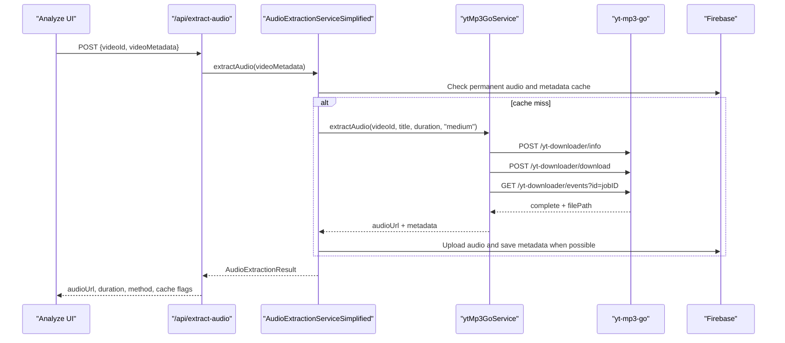

# YouTube Integration

<cite>
**Referenced Files in This Document**
- [audioExtractionSimplified.ts](file://src/services/audio/audioExtractionSimplified.ts)
- [ytMp3GoService.ts](file://src/services/youtube/ytMp3GoService.ts)
- [ytDlpService.ts](file://src/services/youtube/ytDlpService.ts)
- [route.ts](file://src/app/api/extract-audio/route.ts)
- [route.ts](file://src/app/api/ytdlp/extract/route.ts)
- [route.ts](file://src/app/api/ytdlp/download/route.ts)
- [route.ts](file://src/app/api/ytdlp/health/route.ts)
- [route.ts](file://src/app/api/search-youtube/route.ts)
- [youtubeUtils.ts](file://src/utils/youtubeUtils.ts)
- [youtube.ts](file://src/types/youtube.ts)
</cite>

## Introduction
ChordMini uses a two-path YouTube integration:
- `ytMp3GoService` is the production extraction path. It calls the external yt-mp3-go downloader, monitors jobs over SSE, and returns the completed audio URL.
- `ytDlpService` is the development path. It uses local Next.js API routes that wrap yt-dlp for metadata and audio download.
- `audioExtractionSimplified.ts` selects the correct path, checks Firebase Storage and Firestore caches, uploads completed audio when possible, and returns a stable `AudioExtractionResult`.

The removed ytdown.io services are no longer part of the active source tree.

## Project Structure

```mermaid
graph TB
subgraph "Frontend Service Layer"
AES["audioExtractionSimplified.ts<br/>environment-aware orchestration"]
MP3["ytMp3GoService.ts<br/>production extraction"]
DLP["ytDlpService.ts<br/>development extraction"]
end
subgraph "Next.js API Routes"
EXTRACT["/api/extract-audio"]
YTDLP_INFO["/api/ytdlp/extract"]
YTDLP_DOWNLOAD["/api/ytdlp/download"]
YTDLP_HEALTH["/api/ytdlp/health"]
SEARCH["/api/search-youtube"]
end
subgraph "External Services"
REMOTE["yt-mp3-go<br/>/info, /download, /events"]
FIREBASE["Firebase Storage + Firestore"]
end
EXTRACT --> AES
AES --> MP3
AES --> DLP
MP3 --> REMOTE
DLP --> YTDLP_INFO
DLP --> YTDLP_DOWNLOAD
DLP --> YTDLP_HEALTH
AES --> FIREBASE
SEARCH --> EXTRACT
```

## Production Extraction Flow

## Core Components
- `AudioExtractionServiceSimplified`
  - Detects environment strategy.
  - Uses yt-mp3-go in production and yt-dlp locally or when explicitly configured.
  - Checks Firebase Storage first, then Firestore metadata.
  - Retries yt-mp3-go medium quality once, then falls back to low quality.
  - Uploads successful external audio to Firebase Storage when possible.
- `YtMp3GoService`
  - Validates 11-character YouTube IDs.
  - Calls `/yt-downloader/info`.
  - Creates a download job with `videoID`, `quality`, and safe filename.
  - Monitors `/yt-downloader/events?id={jobID}` until complete or failed.
- `YtDlpService`
  - Provides local video info and audio download through `/api/ytdlp/*`.
  - Keeps deterministic filename behavior for local workflows.
- `/api/extract-audio`
  - Accepts search metadata when available.
  - Supports `getInfoOnly`.
  - Returns normalized extraction method (`yt-mp3-go` or `yt-dlp`).

## Failure Handling
- Invalid video IDs fail before job creation.
- yt-mp3-go job creation and SSE monitoring have explicit timeouts and terminal error handling.
- Firebase upload failures fall back to stream URL metadata caching.
- yt-dlp is blocked in production unless `NEXT_PUBLIC_AUDIO_STRATEGY=ytdlp` is set.

## Section Sources
- [audioExtractionSimplified.ts:1-980](file://src/services/audio/audioExtractionSimplified.ts#L1-L980)
- [ytMp3GoService.ts:1-577](file://src/services/youtube/ytMp3GoService.ts#L1-L577)
- [ytDlpService.ts:1-236](file://src/services/youtube/ytDlpService.ts#L1-L236)
- [route.ts:1-116](file://src/app/api/extract-audio/route.ts#L1-L116)
