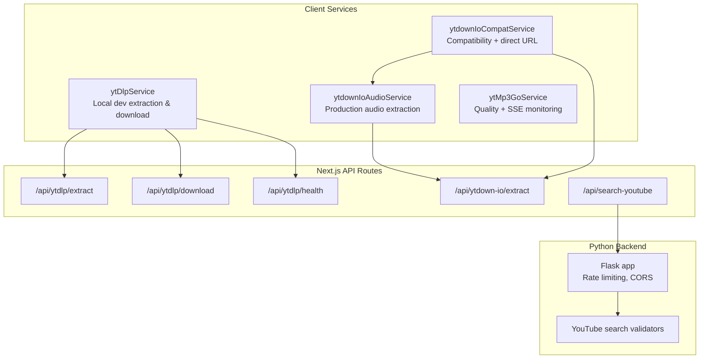
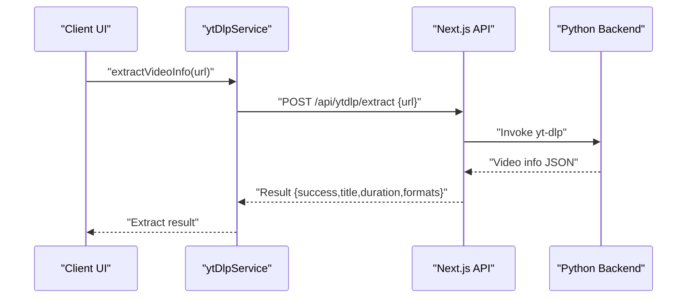
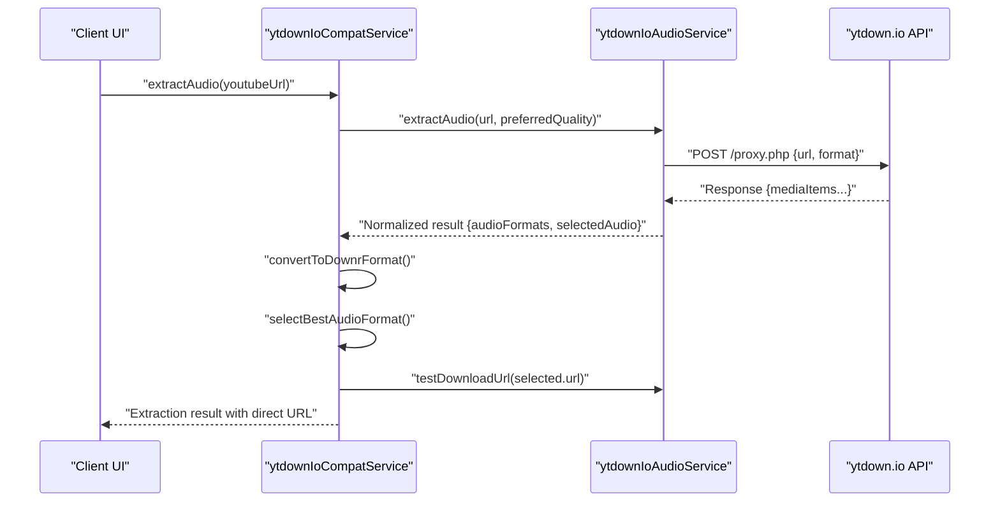
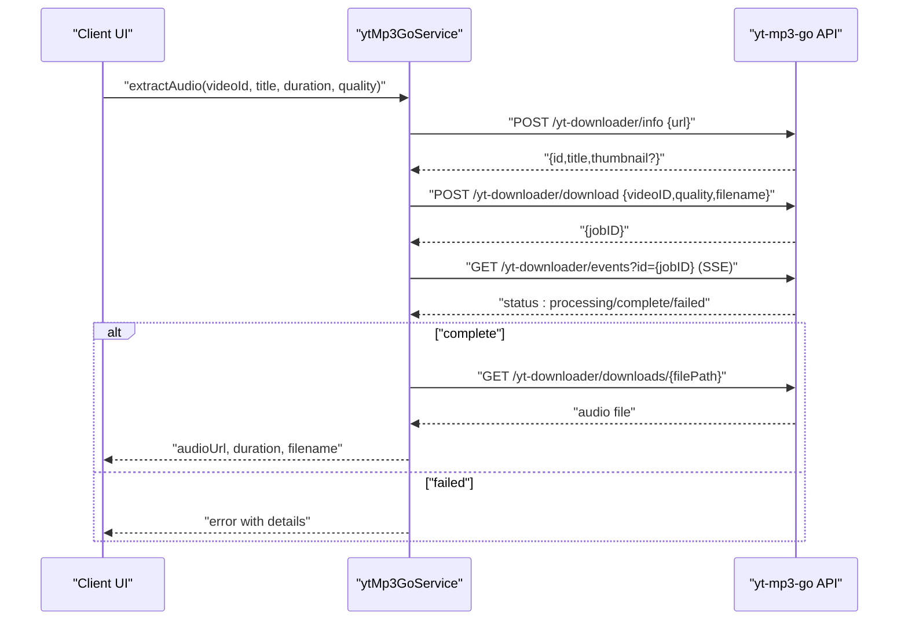
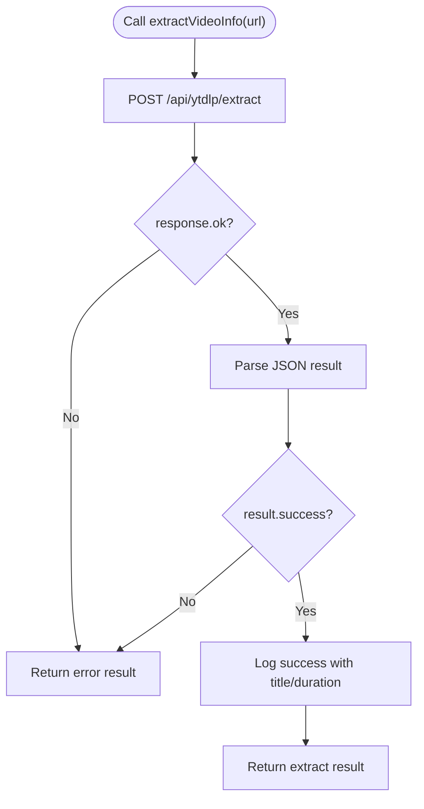
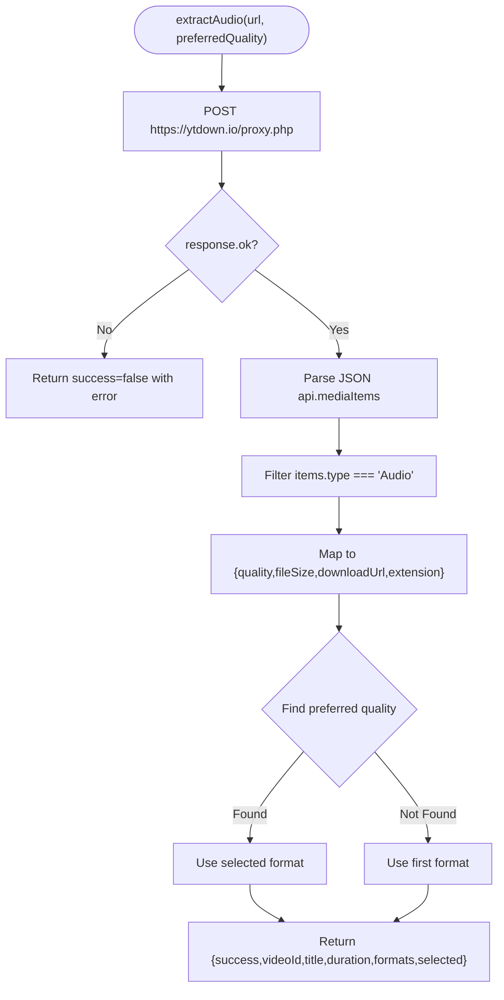
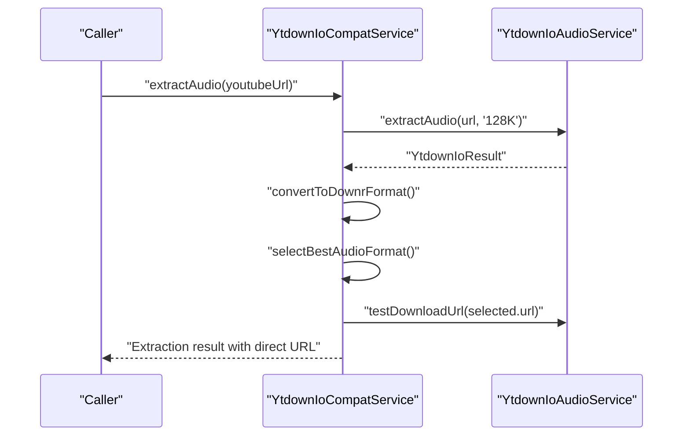
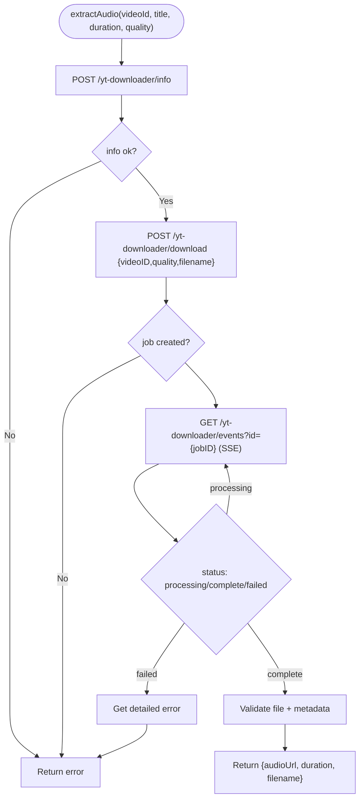
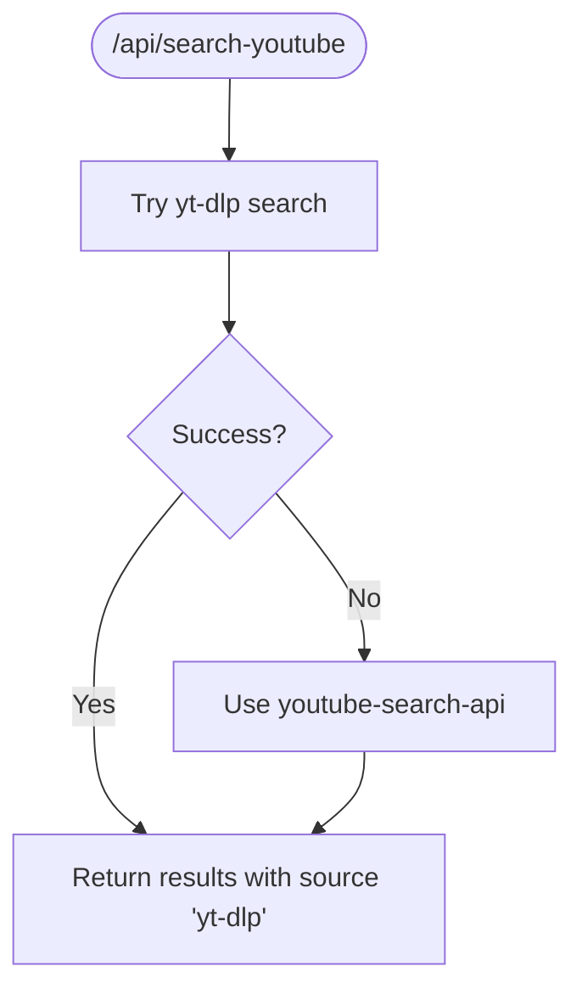
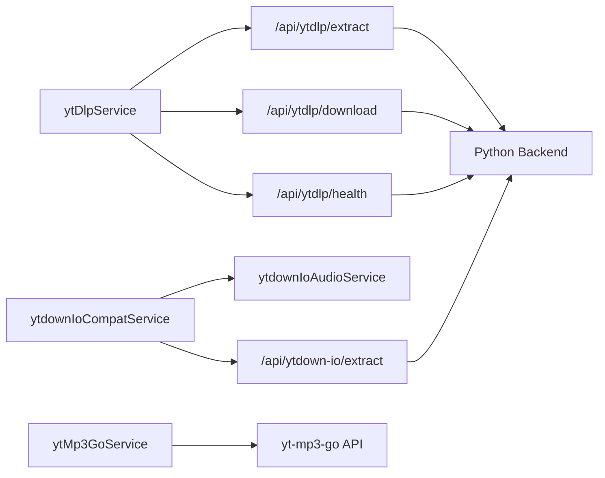

# YouTube Integration

<cite>
**Referenced Files in This Document**
- [ytDlpService.ts](file://src/services/youtube/ytDlpService.ts)
- [ytdownIoAudioService.ts](file://src/services/youtube/ytdownIoAudioService.ts)
- [ytdownIoCompatService.ts](file://src/services/youtube/ytdownIoCompatService.ts)
- [ytMp3GoService.ts](file://src/services/youtube/ytMp3GoService.ts)
- [youtubeUtils.ts](file://src/utils/youtubeUtils.ts)
- [youtube.ts](file://src/types/youtube.ts)
- [route.ts](file://src/app/api/ytdlp/extract/route.ts)
- [route.ts](file://src/app/api/ytdlp/download/route.ts)
- [route.ts](file://src/app/api/ytdlp/health/route.ts)
- [route.ts](file://src/app/api/ytdown-io/extract/route.ts)
- [route.ts](file://src/app/api/search-youtube/route.ts)
- [validators.py](file://python_backend/blueprints/youtube/validators.py)
- [app.py](file://python_backend/app.py)
</cite>

## Table of Contents
1. [Introduction](#introduction)
2. [Project Structure](#project-structure)
3. [Core Components](#core-components)
4. [Architecture Overview](#architecture-overview)
5. [Detailed Component Analysis](#detailed-component-analysis)
6. [Dependency Analysis](#dependency-analysis)
7. [Performance Considerations](#performance-considerations)
8. [Troubleshooting Guide](#troubleshooting-guide)
9. [Conclusion](#conclusion)

## Introduction
This document describes the YouTube integration system in ChordMiniApp. It covers video metadata extraction, thumbnail fetching, duration parsing, and quality assessment. It also documents the audio download and processing workflow, including yt-dlp integration, format selection (MP3, M4A, WebM), stream quality options, and download optimization. The system employs a dual-service architecture supporting both ytDlpService and ytdownIoAudioService for redundancy and reliability. Error handling strategies for network failures, video unavailability, format conversion issues, and storage limitations are included, along with configuration options for download quality, proxy settings, rate limiting, and performance monitoring. Finally, troubleshooting guidance is provided for common YouTube API issues, download failures, and format compatibility problems.

## Project Structure
The YouTube integration spans client-side services and backend API endpoints:
- Client services:
  - ytDlpService: Local development integration via Next.js API routes
  - ytdownIoAudioService: Production-grade audio extraction via ytdown.io
  - ytdownIoCompatService: Compatibility wrapper for ytdown.io with direct URL optimization
  - ytMp3GoService: Alternative extraction with quality selection and SSE monitoring
- Backend API routes:
  - ytDlp endpoints: extract, download, health
  - ytdown-io extract endpoint
  - YouTube search endpoint with fallbacks
- Utilities and types:
  - YouTube URL utilities and TypeScript interfaces

**Diagram sources**
- [ytDlpService.ts:48-79](file://src/services/youtube/ytDlpService.ts#L48-L79)
- [ytdownIoAudioService.ts:87-155](file://src/services/youtube/ytdownIoAudioService.ts#L87-L155)
- [ytdownIoCompatService.ts:56-120](file://src/services/youtube/ytdownIoCompatService.ts#L56-L120)
- [ytMp3GoService.ts:84-143](file://src/services/youtube/ytMp3GoService.ts#L84-L143)
- [route.ts:1-120](file://src/app/api/ytdlp/extract/route.ts#L1-L120)
- [route.ts:1-120](file://src/app/api/ytdlp/download/route.ts#L1-L120)
- [route.ts:1-120](file://src/app/api/ytdlp/health/route.ts#L1-L120)
- [route.ts:1-120](file://src/app/api/ytdown-io/extract/route.ts#L1-L120)
- [route.ts:1-120](file://src/app/api/search-youtube/route.ts#L1-L120)
- [validators.py:13-67](file://python_backend/blueprints/youtube/validators.py#L13-L67)
- [app.py:1-186](file://python_backend/app.py#L1-L186)

**Section sources**
- [ytDlpService.ts:1-236](file://src/services/youtube/ytDlpService.ts#L1-L236)
- [ytdownIoAudioService.ts:1-204](file://src/services/youtube/ytdownIoAudioService.ts#L1-L204)
- [ytdownIoCompatService.ts:1-355](file://src/services/youtube/ytdownIoCompatService.ts#L1-L355)
- [ytMp3GoService.ts:1-577](file://src/services/youtube/ytMp3GoService.ts#L1-L577)
- [route.ts:1-120](file://src/app/api/ytdlp/extract/route.ts#L1-L120)
- [route.ts:1-120](file://src/app/api/ytdlp/download/route.ts#L1-L120)
- [route.ts:1-120](file://src/app/api/ytdlp/health/route.ts#L1-L120)
- [route.ts:1-120](file://src/app/api/ytdown-io/extract/route.ts#L1-L120)
- [route.ts:1-120](file://src/app/api/search-youtube/route.ts#L1-L120)
- [validators.py:1-171](file://python_backend/blueprints/youtube/validators.py#L1-L171)
- [app.py:1-186](file://python_backend/app.py#L1-L186)

## Core Components
- ytDlpService
  - Purpose: Provide local development experience for video info extraction and MP3 downloads via Next.js API routes.
  - Key capabilities: Extract video info, generate expected filename, download audio, health check, service test.
  - Data extraction: Calls Next.js API routes for extract/download/health.
  - Filename strategy: Generates a predictable filename for yt-dlp to simplify downstream processing.
- ytdownIoAudioService
  - Purpose: Production-ready audio extraction using ytdown.io with M4A quality options.
  - Key capabilities: Extract audio metadata, map formats, select preferred quality, test download URL, download audio.
  - Response mapping: Converts ytdown.io response to a normalized result with quality, size, and download URL.
- ytdownIoCompatService
  - Purpose: Bridge ytdown.io into a compatibility layer aligned with downr.org API contracts.
  - Key capabilities: Convert response to compatible format, select best audio format (M4A preferred), obtain direct download URL for Vercel, download audio with timeout protection.
  - Direct URL optimization: Two-step process to avoid serverless timeouts by returning a direct URL.
- ytMp3GoService
  - Purpose: Alternative extraction with explicit quality selection and robust SSE monitoring.
  - Key capabilities: Two-step process (info + download), SSE job monitoring, quality validation, filename generation, metadata validation.
  - Reliability: Long-lived SSE stream with terminal-state handling and detailed error retrieval.

**Section sources**
- [ytDlpService.ts:14-145](file://src/services/youtube/ytDlpService.ts#L14-L145)
- [ytdownIoAudioService.ts:24-155](file://src/services/youtube/ytdownIoAudioService.ts#L24-L155)
- [ytdownIoCompatService.ts:26-120](file://src/services/youtube/ytdownIoCompatService.ts#L26-L120)
- [ytMp3GoService.ts:23-143](file://src/services/youtube/ytMp3GoService.ts#L23-L143)

## Architecture Overview
The system supports multiple extraction paths:
- Local development: ytDlpService proxies to Next.js API routes that wrap yt-dlp.
- Production extraction: ytdownIoAudioService and ytdownIoCompatService provide resilient audio extraction and direct URL optimization.
- Alternative extraction: ytMp3GoService offers quality selection and SSE-based job monitoring.

**Diagram sources**
- [ytDlpService.ts:48-79](file://src/services/youtube/ytDlpService.ts#L48-L79)
- [route.ts:1-120](file://src/app/api/ytdlp/extract/route.ts#L1-L120)
- [app.py:1-186](file://python_backend/app.py#L1-L186)

**Diagram sources**
- [ytdownIoCompatService.ts:56-120](file://src/services/youtube/ytdownIoCompatService.ts#L56-L120)
- [ytdownIoAudioService.ts:87-155](file://src/services/youtube/ytdownIoAudioService.ts#L87-L155)

**Diagram sources**
- [ytMp3GoService.ts:118-442](file://src/services/youtube/ytMp3GoService.ts#L118-L442)

## Detailed Component Analysis

### ytDlpService: Local Development Extraction and Download
- Video info extraction
  - Sends POST to Next.js API route with the URL payload.
  - Validates response and logs success with title and duration.
- Audio download
  - First extracts video info to obtain title and duration.
  - Generates a deterministic filename pattern for MP3.
  - Posts to the download route with format and filename.
  - Returns standardized result including audio URL and filename.
- Availability and testing
  - Health check against Next.js health route with timeout.
  - Test method performs extraction on a known short video.

**Diagram sources**
- [ytDlpService.ts:48-79](file://src/services/youtube/ytDlpService.ts#L48-L79)

**Section sources**
- [ytDlpService.ts:48-145](file://src/services/youtube/ytDlpService.ts#L48-L145)

### ytdownIoAudioService: Production Audio Extraction
- Request flow
  - Posts to ytdown.io proxy with URL and desired format (e.g., M4A - 128K).
  - Validates response status and parses media items.
- Format mapping and selection
  - Filters audio items and maps to normalized format list.
  - Selects preferred quality or falls back to first available.
- Download and validation
  - Provides method to test download URL accessibility.
  - Downloads audio as ArrayBuffer.

**Diagram sources**
- [ytdownIoAudioService.ts:87-155](file://src/services/youtube/ytdownIoAudioService.ts#L87-L155)

**Section sources**
- [ytdownIoAudioService.ts:1-204](file://src/services/youtube/ytdownIoAudioService.ts#L1-L204)

### ytdownIoCompatService: Compatibility and Direct URL Optimization
- Compatibility mapping
  - Converts ytdown.io response to a format compatible with downr.org contracts.
- Best format selection
  - Prioritizes M4A, then MP3, WebM, Opus, selecting highest bitrate when available.
- Direct URL acquisition
  - Performs a status check to obtain a direct download URL suitable for Vercel serverless constraints.
- Download with timeout protection
  - Downloads audio with a controlled timeout to avoid serverless timeouts.

**Diagram sources**
- [ytdownIoCompatService.ts:56-120](file://src/services/youtube/ytdownIoCompatService.ts#L56-L120)
- [ytdownIoAudioService.ts:157-203](file://src/services/youtube/ytdownIoAudioService.ts#L157-L203)

**Section sources**
- [ytdownIoCompatService.ts:1-355](file://src/services/youtube/ytdownIoCompatService.ts#L1-L355)

### ytMp3GoService: Quality Selection and SSE Monitoring
- Two-step extraction
  - Step 1: Get video info via info endpoint.
  - Step 2: Create download job with quality and filename.
- SSE monitoring
  - Streams events for job status until terminal state (complete/failed).
  - Parses SSE data blocks and handles terminal outcomes.
- Terminal handling
  - On completion: constructs downloadable URL, validates file, extracts metadata.
  - On failure: retrieves detailed error information and returns failure result.
- Quality and filename
  - Validates and normalizes quality; generates safe filename from title or ID.

**Diagram sources**
- [ytMp3GoService.ts:118-442](file://src/services/youtube/ytMp3GoService.ts#L118-L442)

**Section sources**
- [ytMp3GoService.ts:1-577](file://src/services/youtube/ytMp3GoService.ts#L1-L577)

### YouTube Search Endpoint and Validation
- Frontend search endpoint
  - Attempts yt-dlp search first; on failure, falls back to youtube-search-api.
- Python backend validation
  - Validates JSON payload, sanitizes query, enforces maxResults bounds, and provides display names for sources.

**Diagram sources**
- [route.ts:82-96](file://src/app/api/search-youtube/route.ts#L82-L96)
- [validators.py:13-67](file://python_backend/blueprints/youtube/validators.py#L13-L67)

**Section sources**
- [route.ts:1-120](file://src/app/api/search-youtube/route.ts#L1-L120)
- [validators.py:1-171](file://python_backend/blueprints/youtube/validators.py#L1-L171)

## Dependency Analysis
- Client-side dependencies
  - ytDlpService depends on Next.js API routes for yt-dlp operations.
  - ytdownIoCompatService composes ytdownIoAudioService and adds direct URL logic.
  - ytMp3GoService depends on yt-mp3-go API endpoints and SSE semantics.
- Backend dependencies
  - Next.js API routes depend on the Python backend for yt-dlp execution.
  - Python backend applies rate limiting and CORS configuration.

**Diagram sources**
- [ytDlpService.ts:48-190](file://src/services/youtube/ytDlpService.ts#L48-L190)
- [ytdownIoCompatService.ts:47-51](file://src/services/youtube/ytdownIoCompatService.ts#L47-L51)
- [ytdownIoAudioService.ts:76-82](file://src/services/youtube/ytdownIoAudioService.ts#L76-L82)
- [route.ts:1-120](file://src/app/api/ytdlp/extract/route.ts#L1-L120)
- [route.ts:1-120](file://src/app/api/ytdown-io/extract/route.ts#L1-L120)
- [app.py:1-186](file://python_backend/app.py#L1-L186)

**Section sources**
- [ytDlpService.ts:1-236](file://src/services/youtube/ytDlpService.ts#L1-L236)
- [ytdownIoAudioService.ts:1-204](file://src/services/youtube/ytdownIoAudioService.ts#L1-L204)
- [ytdownIoCompatService.ts:1-355](file://src/services/youtube/ytdownIoCompatService.ts#L1-L355)
- [ytMp3GoService.ts:1-577](file://src/services/youtube/ytMp3GoService.ts#L1-L577)
- [route.ts:1-120](file://src/app/api/ytdlp/extract/route.ts#L1-L120)
- [route.ts:1-120](file://src/app/api/ytdown-io/extract/route.ts#L1-L120)
- [app.py:1-186](file://python_backend/app.py#L1-L186)

## Performance Considerations
- ytDlpService
  - Relies on Next.js API routes; health checks use short timeouts to detect unavailability quickly.
  - Filename generation simplifies downstream processing and reduces ambiguity.
- ytdownIoAudioService
  - Uses HEAD requests to test download URLs before attempting full downloads.
  - Preferred quality selection reduces unnecessary large downloads.
- ytdownIoCompatService
  - Direct URL acquisition avoids downloading large files in serverless functions, mitigating timeouts.
  - Timeout protection during download ensures graceful failure under resource constraints.
- ytMp3GoService
  - SSE monitoring keeps the connection alive within Vercel limits.
  - Terminal-state handling prevents indefinite waits and returns actionable results.
  - Metadata validation ensures only reasonable durations are accepted.

[No sources needed since this section provides general guidance]

## Troubleshooting Guide
- Network failures
  - ytDlpService health check returns false when API routes are unreachable; use fallback extraction paths.
  - ytdownIoCompatService warns when direct URL retrieval fails; proceed with original URL or switch service.
  - ytMp3GoService throws detailed errors on SSE stream closure or job failure; inspect returned error messages.
- Video unavailability
  - ytDlpService: If extraction fails, verify the URL and retry; the test method can validate service readiness.
  - ytdownIoAudioService: If no audio formats are returned, the video may lack audio or be region-restricted.
  - ytMp3GoService: On failure, detailed error retrieval provides insight into the underlying issue.
- Format conversion issues
  - ytdownIoCompatService prioritizes M4A; if unavailable, falls back to other formats. Verify client support for target extension.
  - ytDlpService expects MP3; ensure the chosen extractor supports the requested format.
- Storage limitations
  - ytdownIoCompatService warns about serverless timeouts for large downloads; use direct URL or switch to ytDlpService.
  - ytMp3GoService validates file accessibility and metadata; if validation fails, the file may be corrupted or inaccessible.
- Configuration options
  - Download quality: ytdownIoAudioService allows preferred quality selection; ytMp3GoService supports low/medium/high.
  - Proxy settings: ytdownIoAudioService sets explicit headers; adjust as needed for your environment.
  - Rate limiting: Python backend applies rate limiting; monitor API responses for throttling indicators.
  - Performance monitoring: Services log execution times and durations; leverage these metrics for diagnostics.

**Section sources**
- [ytDlpService.ts:178-214](file://src/services/youtube/ytDlpService.ts#L178-L214)
- [ytdownIoAudioService.ts:145-155](file://src/services/youtube/ytdownIoAudioService.ts#L145-L155)
- [ytdownIoCompatService.ts:168-215](file://src/services/youtube/ytdownIoCompatService.ts#L168-L215)
- [ytMp3GoService.ts:418-494](file://src/services/youtube/ytMp3GoService.ts#L418-L494)

## Conclusion
ChordMiniApp’s YouTube integration leverages multiple extraction services to balance development convenience, production reliability, and performance. ytDlpService enables local development workflows, ytdownIoAudioService and ytdownIoCompatService provide robust production extraction with direct URL optimization, and ytMp3GoService offers quality selection and SSE-driven monitoring. Together, these components deliver resilient video metadata extraction, thumbnail and duration parsing, and optimized audio downloads across diverse deployment environments.