# Backend Services

<cite>
**Referenced Files in This Document**
- [app_factory.py](file://python_backend/app_factory.py)
- [app.py](file://python_backend/app.py)
- [config.py](file://python_backend/config.py)
- [extensions.py](file://python_backend/extensions.py)
- [error_handlers.py](file://python_backend/error_handlers.py)
- [blueprints/beats/routes.py](file://python_backend/blueprints/beats/routes.py)
- [blueprints/chords/routes.py](file://python_backend/blueprints/chords/routes.py)
- [blueprints/lyrics/routes.py](file://python_backend/blueprints/lyrics/routes.py)
- [services/audio/beat_detection_service.py](file://python_backend/services/audio/beat_detection_service.py)
- [services/audio/chord_recognition_service.py](file://python_backend/services/audio/chord_recognition_service.py)
- [services/detectors/beat_transformer_detector.py](file://python_backend/services/detectors/beat_transformer_detector.py)
- [services/detectors/chord_cnn_lstm_detector.py](file://python_backend/services/detectors/chord_cnn_lstm_detector.py)
- [services/lyrics/orchestrator.py](file://python_backend/services/lyrics/orchestrator.py)
- [utils/model_utils.py](file://python_backend/utils/model_utils.py)
- [requirements.txt](file://python_backend/requirements.txt)
</cite>

## Table of Contents
1. [Introduction](#introduction)
2. [Project Structure](#project-structure)
3. [Core Components](#core-components)
4. [Architecture Overview](#architecture-overview)
5. [Detailed Component Analysis](#detailed-component-analysis)
6. [Dependency Analysis](#dependency-analysis)
7. [Performance Considerations](#performance-considerations)
8. [Troubleshooting Guide](#troubleshooting-guide)
9. [Conclusion](#conclusion)
10. [Appendices](#appendices)

## Introduction
This document describes the Python backend services powering the ChordMiniApp. It explains the Flask application architecture using the application factory pattern, blueprint organization for distinct service areas, and configuration management. It documents the machine learning services for beat detection, chord recognition, audio processing, and model management. API endpoints for beat detection, chord recognition, lyrics services, and audio processing are covered, along with error handling, request validation, and rate limiting. External integrations with YouTube, Genius, and other services are explained, alongside the audio processing pipeline, supported file formats, and storage management. Deployment considerations, environment configuration, and troubleshooting guidance are included, as well as the modular design enabling pluggable detection algorithms and extensible service architecture.

## Project Structure
The backend is organized around a Flask application with:
- Application factory for separation of concerns and environment-aware configuration
- Blueprints for modular routing (health, docs, beats, chords, lyrics, songformer, debug)
- Services layer for ML orchestration and model selection
- Detectors implementing specific algorithms (Beat-Transformer, Chord-CNN-LSTM, etc.)
- Utilities for model availability checks, logging, and path management
- Extensions for CORS, rate limiting, and logging configuration

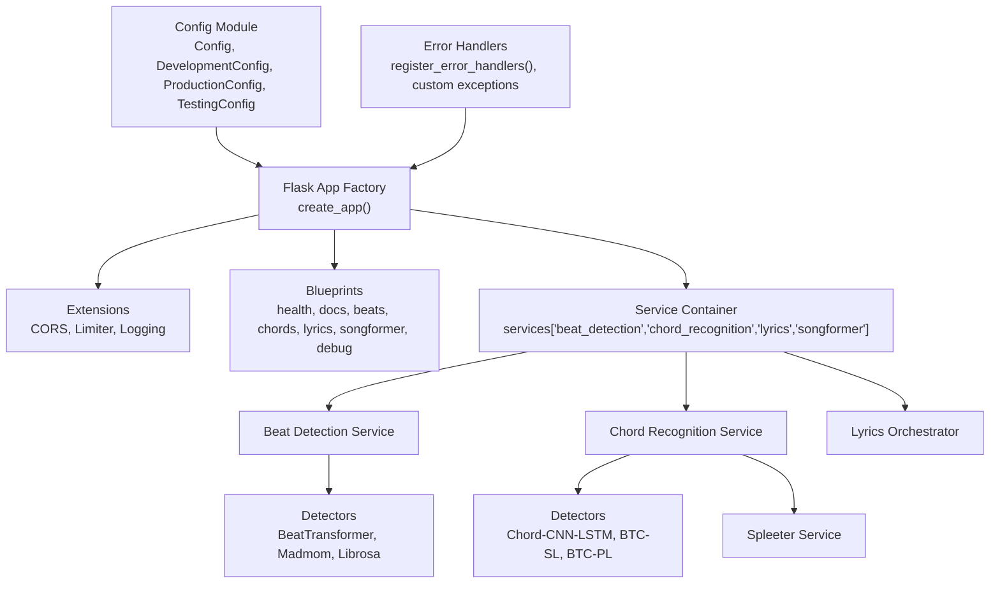

**Diagram sources**
- [app_factory.py:27-65](file://python_backend/app_factory.py#L27-L65)
- [extensions.py:81-92](file://python_backend/extensions.py#L81-L92)
- [config.py:16-215](file://python_backend/config.py#L16-L215)
- [error_handlers.py:13-93](file://python_backend/error_handlers.py#L13-L93)

**Section sources**
- [app_factory.py:27-162](file://python_backend/app_factory.py#L27-L162)
- [config.py:16-215](file://python_backend/config.py#L16-L215)
- [extensions.py:17-93](file://python_backend/extensions.py#L17-L93)
- [error_handlers.py:13-161](file://python_backend/error_handlers.py#L13-L161)

## Core Components
- Application Factory: Creates and configures the Flask app, initializes extensions, registers blueprints, and sets up a simple service container.
- Configuration Management: Centralized configuration classes with environment detection, CORS origins, rate limits, feature toggles, timeouts, and file size limits.
- Extensions: Centralized initialization of CORS, rate limiting, and logging.
- Error Handlers: Standardized JSON error responses and custom exception classes for application-specific errors.
- Blueprints: Modular routing for health, docs, beats, chords, lyrics, songformer, and debug endpoints.
- Services: Orchestration services for beat detection and chord recognition, including detector selection, fallback strategies, and metadata enrichment.
- Detectors: Wrappers around specific ML models with normalized interfaces and availability checks.
- Lyrics Orchestrator: Unified interface coordinating Genius and LRClib with fallback strategies.
- Model Utilities: Availability checks for Spleeter, Beat-Transformer, Chord-CNN-LSTM, Genius, BTC models, PyTorch, TensorFlow, and model directory introspection.

**Section sources**
- [app_factory.py:27-162](file://python_backend/app_factory.py#L27-L162)
- [config.py:16-215](file://python_backend/config.py#L16-L215)
- [extensions.py:17-93](file://python_backend/extensions.py#L17-L93)
- [error_handlers.py:96-161](file://python_backend/error_handlers.py#L96-L161)
- [services/audio/beat_detection_service.py:20-348](file://python_backend/services/audio/beat_detection_service.py#L20-L348)
- [services/audio/chord_recognition_service.py:25-322](file://python_backend/services/audio/chord_recognition_service.py#L25-L322)
- [services/detectors/beat_transformer_detector.py:15-163](file://python_backend/services/detectors/beat_transformer_detector.py#L15-L163)
- [services/detectors/chord_cnn_lstm_detector.py:17-249](file://python_backend/services/detectors/chord_cnn_lstm_detector.py#L17-L249)
- [services/lyrics/orchestrator.py:14-184](file://python_backend/services/lyrics/orchestrator.py#L14-L184)
- [utils/model_utils.py:12-326](file://python_backend/utils/model_utils.py#L12-L326)

## Architecture Overview
The backend follows a layered architecture:
- Presentation Layer: Flask blueprints define endpoints and apply rate limiting.
- Service Layer: Services encapsulate business logic, model selection, and orchestration.
- Detector Layer: Pluggable detectors implement specific algorithms with normalized interfaces.
- External Integrations: Lyrics providers, YouTube extraction, and audio separation via Spleeter.
- Infrastructure: Configuration, logging, CORS, rate limiting, and error handling.

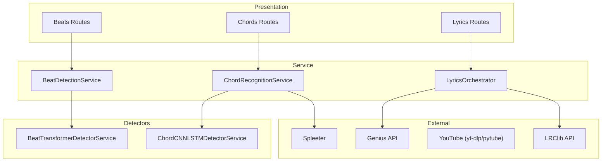

**Diagram sources**
- [blueprints/beats/routes.py:40-521](file://python_backend/blueprints/beats/routes.py#L40-L521)
- [blueprints/chords/routes.py:43-440](file://python_backend/blueprints/chords/routes.py#L43-L440)
- [blueprints/lyrics/routes.py:22-126](file://python_backend/blueprints/lyrics/routes.py#L22-L126)
- [services/audio/beat_detection_service.py:20-348](file://python_backend/services/audio/beat_detection_service.py#L20-L348)
- [services/audio/chord_recognition_service.py:25-322](file://python_backend/services/audio/chord_recognition_service.py#L25-L322)
- [services/detectors/beat_transformer_detector.py:15-163](file://python_backend/services/detectors/beat_transformer_detector.py#L15-L163)
- [services/detectors/chord_cnn_lstm_detector.py:17-249](file://python_backend/services/detectors/chord_cnn_lstm_detector.py#L17-L249)
- [services/lyrics/orchestrator.py:14-184](file://python_backend/services/lyrics/orchestrator.py#L14-L184)

## Detailed Component Analysis

### Application Factory and Configuration
- Application Factory: Applies compatibility patches, loads configuration, initializes extensions, registers blueprints, and builds a service container with optional dummy services if models are unavailable.
- Configuration: Provides base and environment-specific classes with CORS origins, rate limits, timeouts, file size limits, and feature toggles. Supports environment detection and custom origins via environment variables.

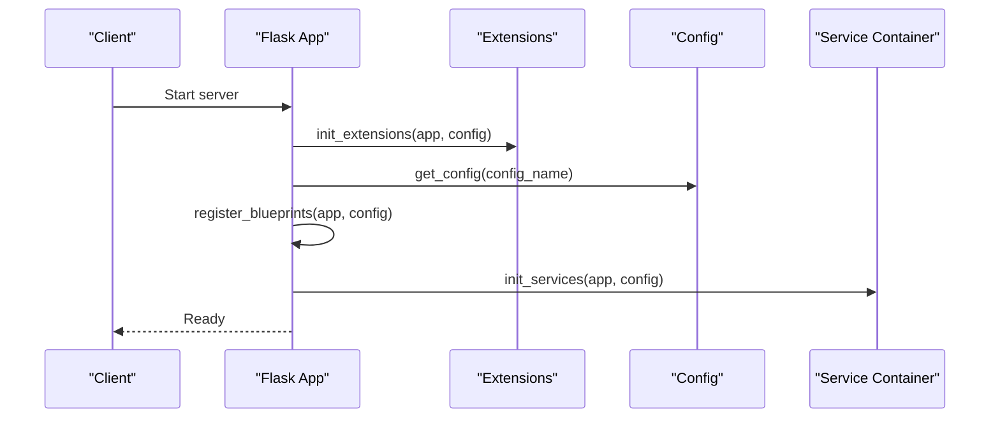

**Diagram sources**
- [app_factory.py:27-162](file://python_backend/app_factory.py#L27-L162)
- [extensions.py:81-92](file://python_backend/extensions.py#L81-L92)
- [config.py:195-215](file://python_backend/config.py#L195-L215)

**Section sources**
- [app_factory.py:27-162](file://python_backend/app_factory.py#L27-L162)
- [config.py:16-215](file://python_backend/config.py#L16-L215)
- [extensions.py:17-93](file://python_backend/extensions.py#L17-L93)

### Beat Detection Service
- Responsibilities: Orchestrates detector selection, enforces file size limits, validates audio files, normalizes results, enriches with metadata, and logs beat-per-measure statistics.
- Detector Selection: Prefers models based on file size and availability; falls back to alternatives when constraints are exceeded.
- Interfaces: Normalized result format across detectors, including beats, downbeats, BPM, time signature, duration, and processing time.

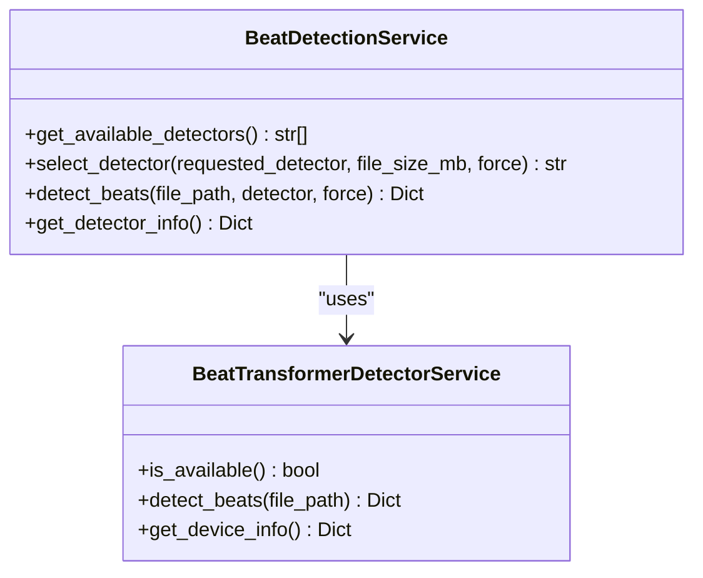

**Diagram sources**
- [services/audio/beat_detection_service.py:20-348](file://python_backend/services/audio/beat_detection_service.py#L20-L348)
- [services/detectors/beat_transformer_detector.py:15-163](file://python_backend/services/detectors/beat_transformer_detector.py#L15-L163)

**Section sources**
- [services/audio/beat_detection_service.py:20-348](file://python_backend/services/audio/beat_detection_service.py#L20-L348)
- [services/detectors/beat_transformer_detector.py:15-163](file://python_backend/services/detectors/beat_transformer_detector.py#L15-L163)

### Chord Recognition Service
- Responsibilities: Manages detector selection, chord dictionary validation, optional Spleeter-based vocal separation, and result normalization.
- Detector Selection: Considers file size and availability; prefers Chord-CNN-LSTM for larger files and BTC models for smaller files.
- Spleeter Integration: Optional audio separation to improve recognition quality when available.

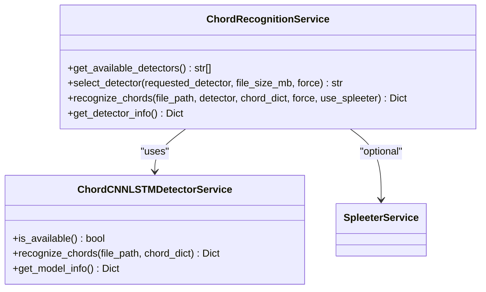

**Diagram sources**
- [services/audio/chord_recognition_service.py:25-322](file://python_backend/services/audio/chord_recognition_service.py#L25-L322)
- [services/detectors/chord_cnn_lstm_detector.py:17-249](file://python_backend/services/detectors/chord_cnn_lstm_detector.py#L17-L249)

**Section sources**
- [services/audio/chord_recognition_service.py:25-322](file://python_backend/services/audio/chord_recognition_service.py#L25-L322)
- [services/detectors/chord_cnn_lstm_detector.py:17-249](file://python_backend/services/detectors/chord_cnn_lstm_detector.py#L17-L249)

### Lyrics Orchestrator
- Responsibilities: Coordinates Genius and LRClib, provides fallback strategies, and normalizes results with provider metadata.
- Availability: Checks Genius availability and reports LRClib as always available.

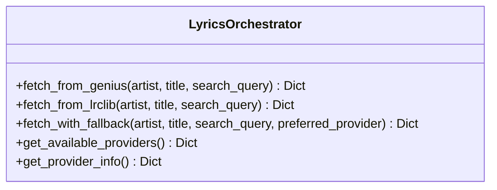

**Diagram sources**
- [services/lyrics/orchestrator.py:14-184](file://python_backend/services/lyrics/orchestrator.py#L14-L184)

**Section sources**
- [services/lyrics/orchestrator.py:14-184](file://python_backend/services/lyrics/orchestrator.py#L14-L184)

### API Endpoints

#### Beat Detection Endpoints
- POST /api/detect-beats: Detect beats from uploaded file or existing server path; supports detector selection and force flag.
- POST /api/detect-beats-firebase: Detect beats from Firebase Storage URL.
- GET /api/model-info: Information about available beat detection models and defaults.
- GET /api/test-beat-transformer, /api/test-madmom, /api/test-librosa: Availability and version checks.
- GET /api/test-all-models: Comprehensive model availability report.
- GET /api/test-dbn-isolation: Isolation and testing of DBN components for Madmom.

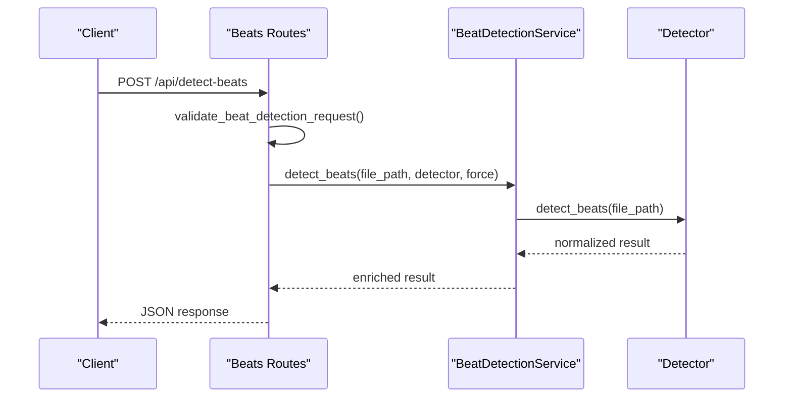

**Diagram sources**
- [blueprints/beats/routes.py:40-120](file://python_backend/blueprints/beats/routes.py#L40-L120)
- [services/audio/beat_detection_service.py:163-311](file://python_backend/services/audio/beat_detection_service.py#L163-L311)

**Section sources**
- [blueprints/beats/routes.py:40-521](file://python_backend/blueprints/beats/routes.py#L40-L521)
- [services/audio/beat_detection_service.py:20-348](file://python_backend/services/audio/beat_detection_service.py#L20-L348)

#### Chord Recognition Endpoints
- POST /api/recognize-chords: Recognize chords from uploaded file, server path, or JSON audioUrl; supports detector selection, chord dictionary, force flag, and Spleeter.
- POST /api/recognize-chords-firebase: Recognize chords from Firebase Storage URL.
- GET /api/chord-model-info: Flask chord-model discovery with available chord recognition models and dictionaries.
- GET /api/test-chord-cnn-lstm, /api/test-btc-sl, /api/test-btc-pl: Model availability and info.
- GET /api/test-all-chord-models: Comprehensive chord model availability report.

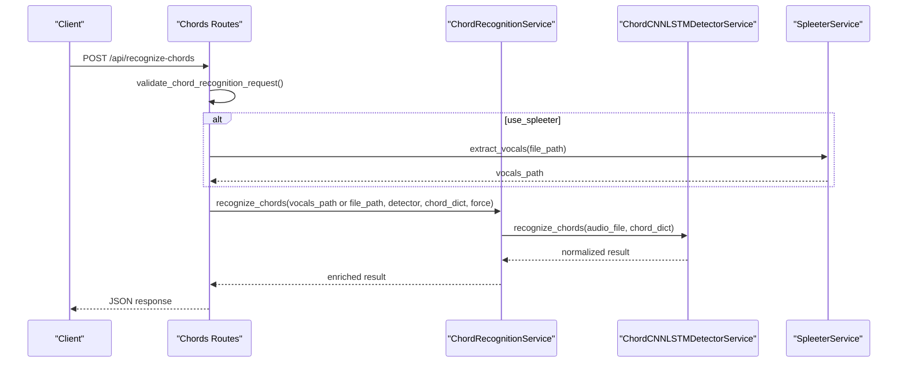

**Diagram sources**
- [blueprints/chords/routes.py:43-220](file://python_backend/blueprints/chords/routes.py#L43-L220)
- [services/audio/chord_recognition_service.py:173-296](file://python_backend/services/audio/chord_recognition_service.py#L173-L296)
- [services/detectors/chord_cnn_lstm_detector.py:78-182](file://python_backend/services/detectors/chord_cnn_lstm_detector.py#L78-L182)

**Section sources**
- [blueprints/chords/routes.py:43-440](file://python_backend/blueprints/chords/routes.py#L43-L440)
- [services/audio/chord_recognition_service.py:25-322](file://python_backend/services/audio/chord_recognition_service.py#L25-L322)

#### Lyrics Endpoints
- POST /api/genius-lyrics: Fetch lyrics from Genius.com with fallback metadata.
- POST /api/lrclib-lyrics: Fetch synchronized lyrics from LRClib.net.

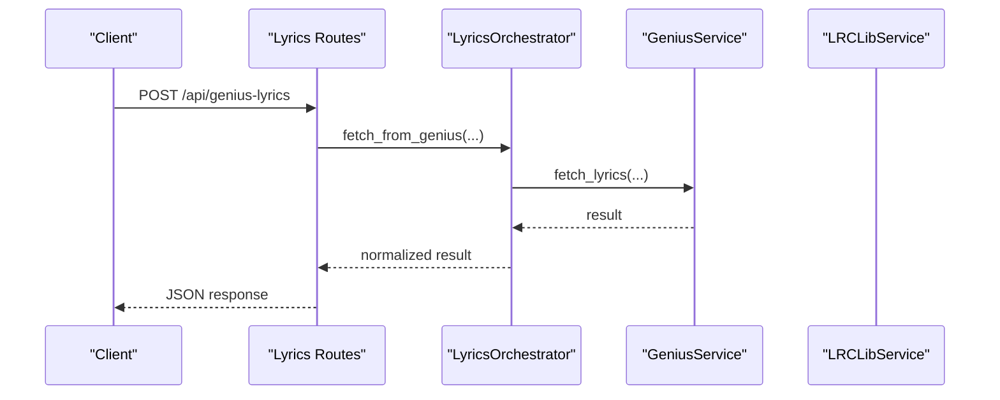

**Diagram sources**
- [blueprints/lyrics/routes.py:22-126](file://python_backend/blueprints/lyrics/routes.py#L22-L126)
- [services/lyrics/orchestrator.py:33-93](file://python_backend/services/lyrics/orchestrator.py#L33-L93)

**Section sources**
- [blueprints/lyrics/routes.py:22-126](file://python_backend/blueprints/lyrics/routes.py#L22-L126)
- [services/lyrics/orchestrator.py:14-184](file://python_backend/services/lyrics/orchestrator.py#L14-L184)

### Error Handling Strategies
- Standard HTTP error handlers for 400, 404, 413, 429, 500 with JSON responses.
- Generic exception handler logs full traceback for debugging.
- Custom exceptions for application-specific scenarios (ModelUnavailableError, FileTooLargeError, AudioProcessingError, ExternalServiceError).
- Custom error handlers convert custom exceptions to JSON with appropriate status codes.

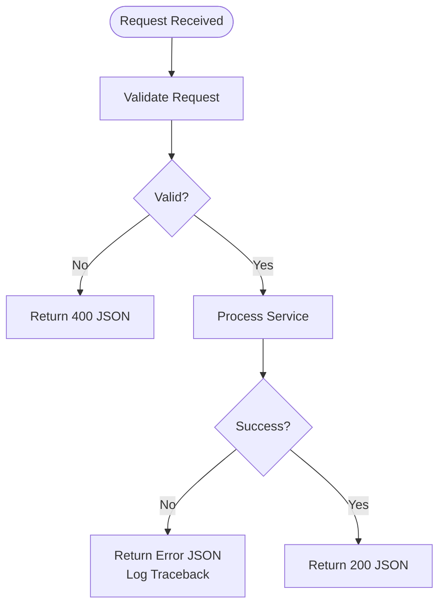

**Diagram sources**
- [error_handlers.py:13-93](file://python_backend/error_handlers.py#L13-L93)
- [error_handlers.py:142-161](file://python_backend/error_handlers.py#L142-L161)

**Section sources**
- [error_handlers.py:13-161](file://python_backend/error_handlers.py#L13-L161)

### Request Validation and Rate Limiting
- Validation: Blueprint validators enforce presence and format of required parameters (file uploads, URLs, detector choices, force flags).
- Rate Limiting: Flask-Limiter configured with environment-specific limits keyed by endpoint categories (health, docs, heavy_processing, moderate_processing, light_processing, debug, test). Limits are loaded from configuration.

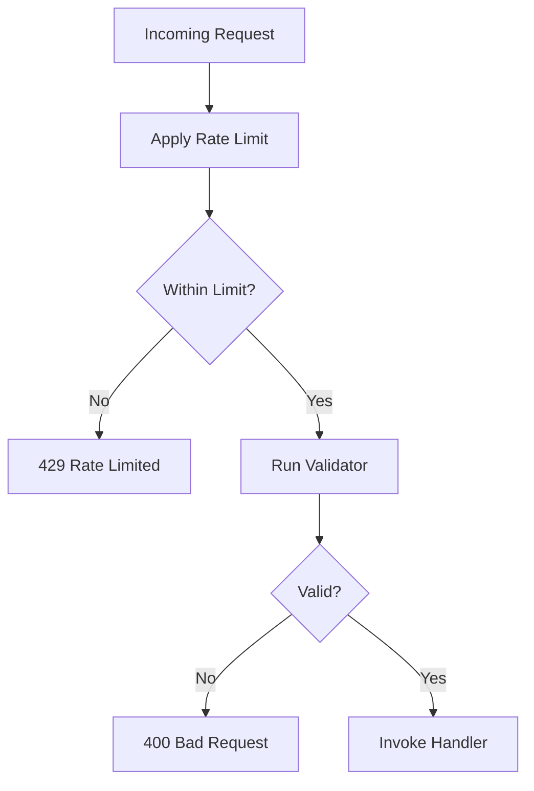

**Diagram sources**
- [config.py:47-60](file://python_backend/config.py#L47-L60)
- [extensions.py:41-59](file://python_backend/extensions.py#L41-L59)

**Section sources**
- [config.py:47-103](file://python_backend/config.py#L47-L103)
- [extensions.py:41-59](file://python_backend/extensions.py#L41-L59)

### Integration with External Services
- YouTube: Integrated via yt-dlp and pytube for audio extraction and metadata retrieval.
- Genius: Lyrics retrieval via lyricsgenius library with availability checks.
- LRClib: Synchronized lyrics retrieval without API keys.
- Spleeter: Optional audio separation for improved chord recognition.

**Section sources**
- [requirements.txt:108-112](file://python_backend/requirements.txt#L108-L112)
- [utils/model_utils.py:74-88](file://python_backend/utils/model_utils.py#L74-L88)
- [services/lyrics/orchestrator.py:149-184](file://python_backend/services/lyrics/orchestrator.py#L149-L184)

### Audio Processing Pipeline, Formats, and Storage
- Audio Processing: Uses librosa, soundfile, audioread, resampy, soxr, and pydub for ingestion, resampling, and manipulation.
- Formats: Supports MP3 and other formats handled by underlying libraries; temporary files are used for processing.
- Storage: Local filesystem for audio assets; Firebase Storage URLs supported for ingestion via streaming download.
- Metadata: Duration and file size are computed and returned; beat-per-measure statistics are logged for diagnostics.

**Section sources**
- [requirements.txt:27-35](file://python_backend/requirements.txt#L27-L35)
- [blueprints/beats/routes.py:30-38](file://python_backend/blueprints/beats/routes.py#L30-L38)
- [services/audio/beat_detection_service.py:178-224](file://python_backend/services/audio/beat_detection_service.py#L178-L224)

### Deployment Considerations and Environment Configuration
- Environment Detection: Production mode inferred from FLASK_ENV or PORT; development and testing modes adjust rate limits and debug features.
- CORS Origins: Configurable via environment variable; defaults include localhost, Docker networks, and Vercel domains.
- Rate Limiting: Redis URL enables distributed rate limiting; otherwise in-memory storage is used.
- Model Availability: Deferred checks at runtime; services fall back gracefully with dummy implementations when models are unavailable.
- Logging: Configured via configuration class with level and format; extensions initialize logging for the app.

**Section sources**
- [config.py:16-98](file://python_backend/config.py#L16-L98)
- [config.py:186-215](file://python_backend/config.py#L186-L215)
- [extensions.py:61-79](file://python_backend/extensions.py#L61-L79)
- [app_factory.py:103-162](file://python_backend/app_factory.py#L103-L162)

## Dependency Analysis
The backend exhibits low coupling and high cohesion:
- Blueprints depend on configuration and extensions for rate limiting and CORS.
- Services depend on detectors and optional external services (Spleeter).
- Detectors depend on model directories and libraries; availability is checked without importing heavy modules.
- Model utilities centralize availability checks for all components.

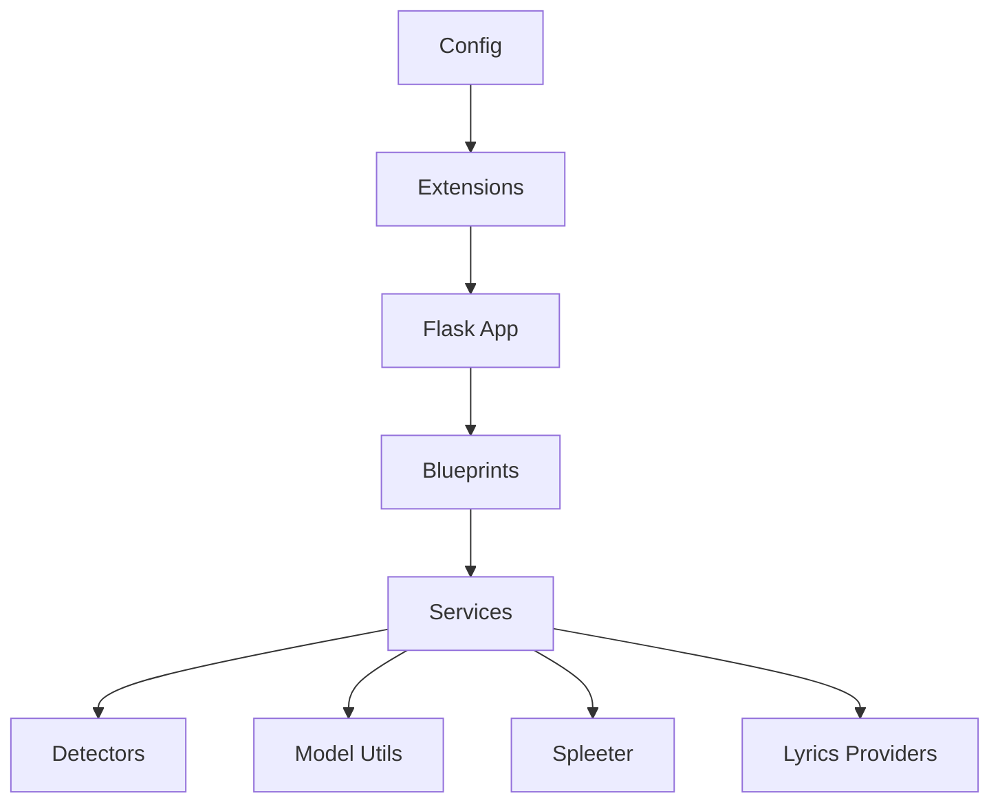

**Diagram sources**
- [config.py:16-215](file://python_backend/config.py#L16-L215)
- [extensions.py:17-93](file://python_backend/extensions.py#L17-L93)
- [app_factory.py:68-101](file://python_backend/app_factory.py#L68-L101)
- [utils/model_utils.py:12-326](file://python_backend/utils/model_utils.py#L12-L326)

**Section sources**
- [config.py:16-215](file://python_backend/config.py#L16-L215)
- [extensions.py:17-93](file://python_backend/extensions.py#L17-L93)
- [app_factory.py:68-101](file://python_backend/app_factory.py#L68-L101)
- [utils/model_utils.py:12-326](file://python_backend/utils/model_utils.py#L12-L326)

## Performance Considerations
- Detector Selection: Services prefer optimal detectors based on file size and availability to balance accuracy and speed.
- Temporary Files: Streaming downloads and temporary files minimize memory overhead; cleanup is performed after processing.
- Logging: Beat-per-measure statistics provide insights without altering response payloads.
- Rate Limiting: Category-based limits prevent overload on heavy-processing endpoints.
- Model Availability: Deferred imports and availability checks reduce startup latency.

[No sources needed since this section provides general guidance]

## Troubleshooting Guide
- Beat Detection Failures: Verify detector availability via test endpoints; check file size limits and audio validity; review logs for detailed errors.
- Chord Recognition Failures: Confirm detector availability and supported chord dictionaries; enable Spleeter if available; inspect logs for model-specific errors.
- Lyrics Retrieval Failures: Check Genius availability and API key configuration; fallback to LRClib; review orchestrator logs for provider errors.
- Rate Limiting: Adjust category-specific limits in configuration; ensure Redis is configured for distributed rate limiting in production.
- Model Availability: Use model info endpoints to confirm availability; verify model directories and required files; check PyTorch/TensorFlow/GPU availability.

**Section sources**
- [blueprints/beats/routes.py:252-521](file://python_backend/blueprints/beats/routes.py#L252-L521)
- [blueprints/chords/routes.py:260-440](file://python_backend/blueprints/chords/routes.py#L260-L440)
- [blueprints/lyrics/routes.py:22-126](file://python_backend/blueprints/lyrics/routes.py#L22-L126)
- [utils/model_utils.py:285-326](file://python_backend/utils/model_utils.py#L285-L326)

## Conclusion
The ChordMiniApp Python backend employs a clean, modular architecture centered on the Flask application factory pattern and blueprint organization. Services encapsulate ML orchestration with pluggable detectors, robust error handling, and environment-aware configuration. The design supports extensibility through standardized detector interfaces and service containers, enabling easy addition of new models and providers. With comprehensive validation, rate limiting, and logging, the backend is production-ready and maintainable.

[No sources needed since this section summarizes without analyzing specific files]

## Appendices

### API Definitions Overview
- Beat Detection
  - POST /api/detect-beats: multipart/form-data or audio_path; detector selection; force flag.
  - POST /api/detect-beats-firebase: firebase_url; detector selection.
  - GET /api/model-info: model availability and defaults.
  - GET /api/test-beat-transformer, /api/test-madmom, /api/test-librosa: availability/version checks.
  - GET /api/test-all-models, /api/test-dbn-isolation: comprehensive diagnostics.

- Chord Recognition
  - POST /api/recognize-chords: file or audio_path; detector, chord_dict, force, use_spleeter.
  - POST /api/recognize-chords-firebase: firebase_url; detector, chord_dict.
  - GET /api/chord-model-info: Flask chord-model info and dictionaries.
  - GET /api/test-chord-cnn-lstm, /api/test-btc-sl, /api/test-btc-pl, /api/test-all-chord-models: availability and info.

- Lyrics
  - POST /api/genius-lyrics: artist/title or search_query.
  - POST /api/lrclib-lyrics: artist/title or search_query.

**Section sources**
- [blueprints/beats/routes.py:40-521](file://python_backend/blueprints/beats/routes.py#L40-L521)
- [blueprints/chords/routes.py:43-440](file://python_backend/blueprints/chords/routes.py#L43-L440)
- [blueprints/lyrics/routes.py:22-126](file://python_backend/blueprints/lyrics/routes.py#L22-L126)

### Environment Variables and Configuration Keys
- FLASK_ENV: Environment mode (development/production/testing).
- PORT: Production port binding.
- SECRET_KEY: Flask secret key.
- CORS_ORIGINS: Comma-separated list of allowed origins.
- REDIS_URL: Rate limiting storage backend.
- FLASK_MAX_CONTENT_LENGTH_MB: Maximum upload size.
- EXTERNAL_API_TIMEOUT, YOUTUBE_API_TIMEOUT, AUDIO_EXTRACTION_TIMEOUT: Timeout values for external calls.
- USE_* toggles: Feature flags for models (Beat-Transformer, Chord-CNN-LSTM, Spleeter, Genius, BTC).

**Section sources**
- [config.py:19-98](file://python_backend/config.py#L19-L98)
- [config.py:186-215](file://python_backend/config.py#L186-L215)