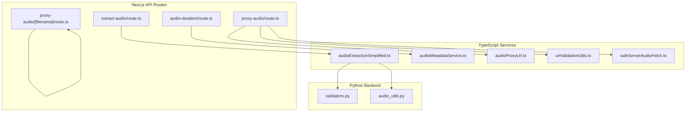
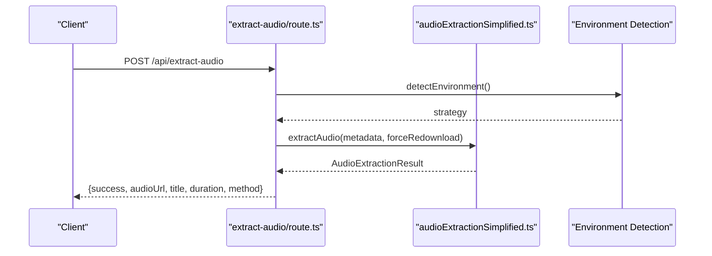
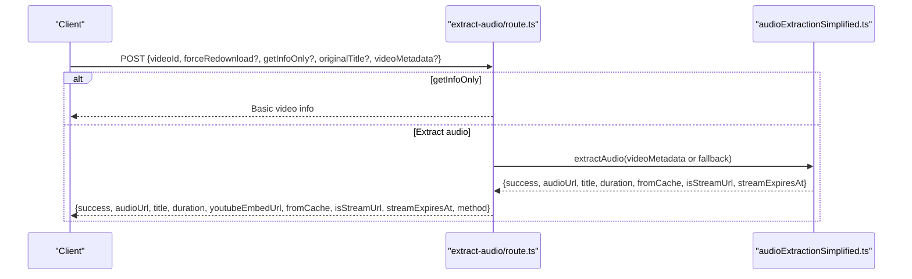
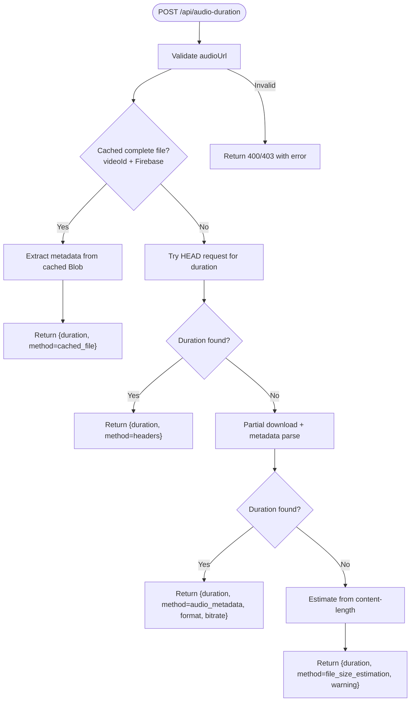
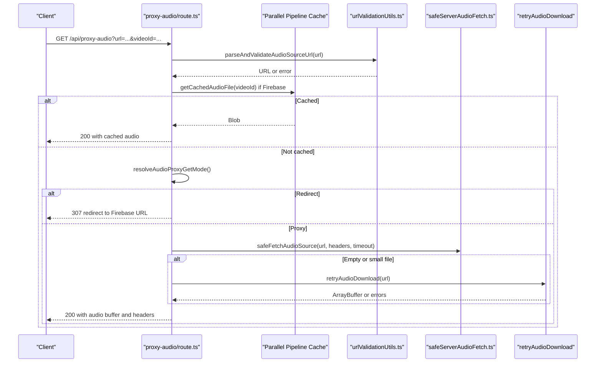
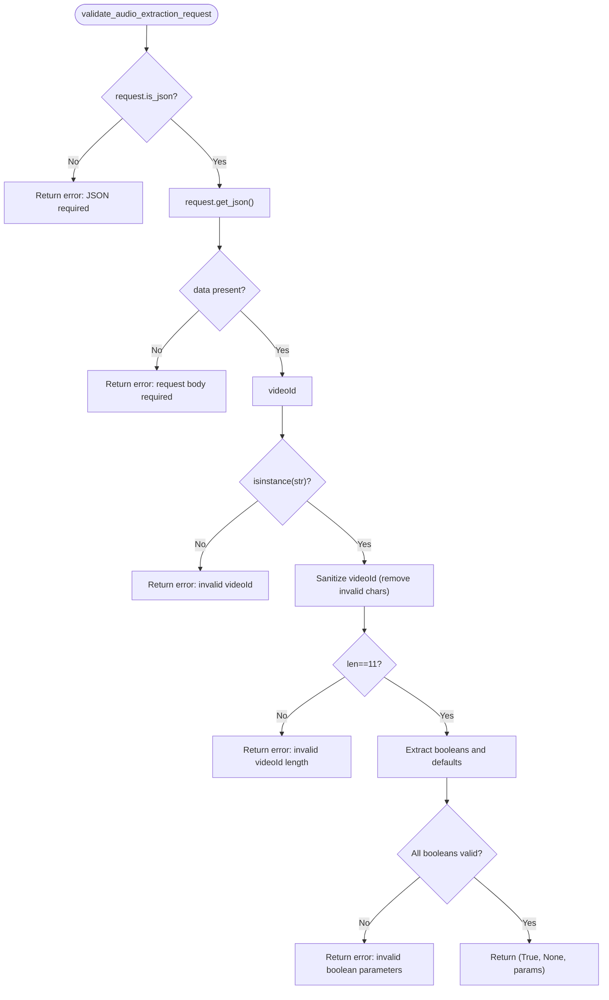
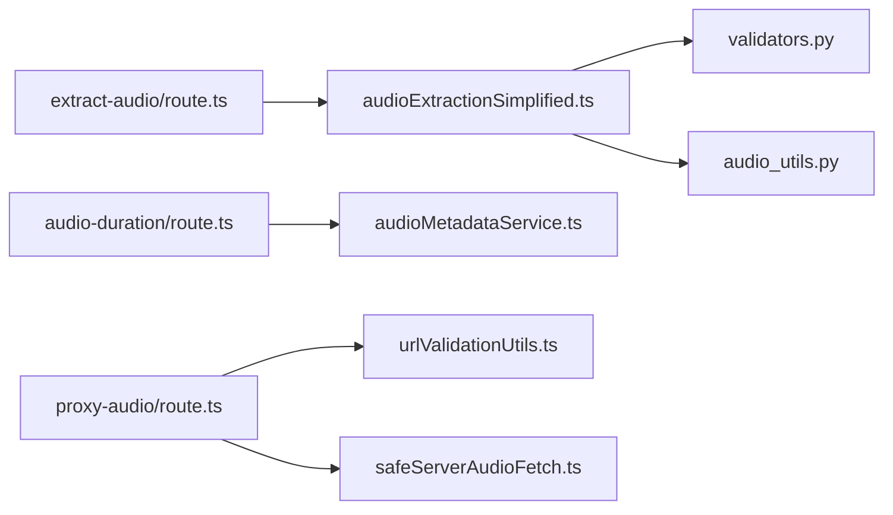

# Audio Blueprint

<cite>
**Referenced Files in This Document**
- [extract-audio/route.ts](file://src/app/api/extract-audio/route.ts)
- [audio-duration/route.ts](file://src/app/api/audio-duration/route.ts)
- [proxy-audio/route.ts](file://src/app/api/proxy-audio/route.ts)
- [proxy-audio/[filename]/route.ts](file://src/app/api/proxy-audio/[filename]/route.ts)
- [validators.py](file://python_backend/blueprints/audio/validators.py)
- [audio_utils.py](file://python_backend/services/audio/audio_utils.py)
- [audioExtractionSimplified.ts](file://src/services/audio/audioExtractionSimplified.ts)
- [audioMetadataService.ts](file://src/services/audio/audioMetadataService.ts)
- [audioProxyUrl.ts](file://src/utils/audioProxyUrl.ts)
- [urlValidationUtils.ts](file://src/utils/urlValidationUtils.ts)
- [safeServerAudioFetch.ts](file://src/utils/safeServerAudioFetch.ts)
</cite>

## Table of Contents
1. [Introduction](#introduction)
2. [Project Structure](#project-structure)
3. [Core Components](#core-components)
4. [Architecture Overview](#architecture-overview)
5. [Detailed Component Analysis](#detailed-component-analysis)
6. [Dependency Analysis](#dependency-analysis)
7. [Performance Considerations](#performance-considerations)
8. [Troubleshooting Guide](#troubleshooting-guide)
9. [Conclusion](#conclusion)

## Introduction
This document describes the audio blueprint service that powers audio extraction, duration detection, and streaming for the application. It covers the API endpoints, request validation patterns, audio processing workflows, integration with external services, and error handling strategies. The focus areas include:
- extract-audio: Extract audio from YouTube videos using environment-aware strategies.
- audio-duration: Detect audio duration from URLs using multiple strategies.
- proxy-audio: Stream and proxy audio with robust retry logic and safety checks.

## Project Structure
The audio blueprint spans both the frontend Next.js API routes and supporting TypeScript services, plus a Python backend for validation utilities.

**Diagram sources**
- [extract-audio/route.ts:1-116](file://src/app/api/extract-audio/route.ts#L1-L138)
- [audio-duration/route.ts:1-301](file://src/app/api/audio-duration/route.ts#L1-L301)
- [proxy-audio/route.ts:1-496](file://src/app/api/proxy-audio/route.ts#L1-L496)
- [proxy-audio/[filename]/route.ts](file://src/app/api/proxy-audio/[filename]/route.ts#L1-L94)
- [audioExtractionSimplified.ts:1-800](file://src/services/audio/audioExtractionSimplified.ts#L1-L800)
- [audioMetadataService.ts:1-198](file://src/services/audio/audioMetadataService.ts#L1-L198)
- [audioProxyUrl.ts:1-74](file://src/utils/audioProxyUrl.ts#L1-L74)
- [urlValidationUtils.ts:1-265](file://src/utils/urlValidationUtils.ts#L1-L265)
- [safeServerAudioFetch.ts:1-152](file://src/utils/safeServerAudioFetch.ts#L1-L152)
- [validators.py:1-173](file://python_backend/blueprints/audio/validators.py#L1-L173)
- [audio_utils.py:1-131](file://python_backend/services/audio/audio_utils.py#L1-L131)

**Section sources**
- [extract-audio/route.ts:1-116](file://src/app/api/extract-audio/route.ts#L1-L138)
- [audio-duration/route.ts:1-301](file://src/app/api/audio-duration/route.ts#L1-L301)
- [proxy-audio/route.ts:1-496](file://src/app/api/proxy-audio/route.ts#L1-L496)
- [proxy-audio/[filename]/route.ts](file://src/app/api/proxy-audio/[filename]/route.ts#L1-L94)
- [validators.py:1-173](file://python_backend/blueprints/audio/validators.py#L1-L173)
- [audio_utils.py:1-131](file://python_backend/services/audio/audio_utils.py#L1-L131)

## Core Components
- extract-audio API: Orchestrates environment-aware audio extraction and returns metadata, duration, and stream URL.
- audio-duration API: Detects duration via headers, metadata parsing, and file-size estimation.
- proxy-audio API: Proxies audio with retry logic, safety validations, and cache-aware behavior.
- Validation utilities: Enforce request constraints and sanitize inputs for audio extraction.
- Audio processing utilities: Provide silence trimming, duration calculation, resampling, and validation helpers.

**Section sources**
- [extract-audio/route.ts:1-116](file://src/app/api/extract-audio/route.ts#L1-L138)
- [audio-duration/route.ts:1-301](file://src/app/api/audio-duration/route.ts#L1-L301)
- [proxy-audio/route.ts:1-496](file://src/app/api/proxy-audio/route.ts#L1-L496)
- [validators.py:13-72](file://python_backend/blueprints/audio/validators.py#L13-L72)
- [audio_utils.py:12-131](file://python_backend/services/audio/audio_utils.py#L12-L131)

## Architecture Overview
The audio blueprint integrates frontend APIs with backend services and external providers. The flow varies by endpoint but generally follows:
- Input validation and environment detection.
- Service orchestration for extraction or metadata parsing.
- Safety checks for URLs and retries for transient failures.
- Caching and storage integration for permanent access.

**Diagram sources**
- [extract-audio/route.ts:22-106](file://src/app/api/extract-audio/route.ts#L22-L106)
- [audioExtractionSimplified.ts:84-120](file://src/services/audio/audioExtractionSimplified.ts#L84-L120)

## Detailed Component Analysis

### extract-audio API
Purpose: Extract audio from a YouTube video using environment-aware strategies and return metadata and stream URL.

Key behaviors:
- Parses JSON payload and validates presence of videoId.
- Supports getInfoOnly mode to return basic metadata without extraction.
- Uses environment detection to select extraction strategy (yt-mp3-go, yt-dlp, or fallback).
- Integrates with simplified extraction service to handle caching and storage.

Request format:
- Required: videoId (string, 11 characters, alphanumeric with hyphen and underscore).
- Optional: forceRedownload (boolean), getInfoOnly (boolean), originalTitle (string), videoMetadata (object with id, title, thumbnail, channelTitle).

Response format:
- On success: {success: true, audioUrl, title, duration, youtubeEmbedUrl, fromCache, isStreamUrl, streamExpiresAt, method}.
- On failure: {success: false, error, details, suggestion}.

Supported extraction methods:
- yt-mp3-go (primary production service).
- yt-dlp (development or explicitly enabled).
- Deprecated yt-mp3-go (fallback to yt-mp3-go).

**Diagram sources**
- [extract-audio/route.ts:22-106](file://src/app/api/extract-audio/route.ts#L22-L106)
- [audioExtractionSimplified.ts:84-120](file://src/services/audio/audioExtractionSimplified.ts#L84-L120)

**Section sources**
- [extract-audio/route.ts:22-137](file://src/app/api/extract-audio/route.ts#L22-L137)
- [audioExtractionSimplified.ts:84-120](file://src/services/audio/audioExtractionSimplified.ts#L84-L120)

### audio-duration API
Purpose: Detect audio duration from a URL using multiple strategies to minimize latency and maximize accuracy.

Strategies (in order):
1. Headers: Fast check for duration in response headers (with Firebase-aware retries).
2. Audio metadata: Partial download and metadata parsing for reliable duration.
3. File size estimation: Estimate duration from content-length and average bitrate.

Request format:
- Required: audioUrl (string).
- Optional: videoId (string) for cache-awareness.

Response format:
- Success: {success: true, duration, method, format?, bitrate?}.
- Failure: {success: false, error, fallbackDuration?}.

**Diagram sources**
- [audio-duration/route.ts:17-150](file://src/app/api/audio-duration/route.ts#L17-L150)
- [audio-duration/route.ts:155-214](file://src/app/api/audio-duration/route.ts#L155-L214)
- [audio-duration/route.ts:221-288](file://src/app/api/audio-duration/route.ts#L221-L288)

**Section sources**
- [audio-duration/route.ts:17-150](file://src/app/api/audio-duration/route.ts#L17-L150)
- [audio-duration/route.ts:155-214](file://src/app/api/audio-duration/route.ts#L155-L214)
- [audio-duration/route.ts:221-288](file://src/app/api/audio-duration/route.ts#L221-L288)

### proxy-audio API
Purpose: Proxy audio to avoid CORS issues, with robust retry logic, safety validations, and cache-aware behavior.

Key behaviors:
- Validates URL format and domain allowlist; rejects credentials and non-HTTPS except development localhost.
- Determines proxy mode: redirect vs. proxy based on Firebase URL and environment flags.
- Applies Firebase-aware retry logic for transient 403 errors and empty file handling.
- Streams audio with progress logging and enforces size limits.
- Supports HEAD requests for cache probing.

Request format:
- Required: url (string).
- Optional: videoId (string), forceProxy (query param).

Response format:
- Success: 200 with audio buffer and headers (Content-Type, Content-Length, Cache-Control).
- Redirect: 307 redirect to Firebase URL when allowed.
- Errors: 400/403/413/422/500 with structured messages.

**Diagram sources**
- [proxy-audio/route.ts:121-411](file://src/app/api/proxy-audio/route.ts#L121-L411)
- [audioProxyUrl.ts:61-73](file://src/utils/audioProxyUrl.ts#L61-L73)
- [urlValidationUtils.ts:49-85](file://src/utils/urlValidationUtils.ts#L49-L85)
- [safeServerAudioFetch.ts:110-152](file://src/utils/safeServerAudioFetch.ts#L110-L152)

**Section sources**
- [proxy-audio/route.ts:121-411](file://src/app/api/proxy-audio/route.ts#L121-L411)
- [audioProxyUrl.ts:61-73](file://src/utils/audioProxyUrl.ts#L61-L73)
- [urlValidationUtils.ts:49-85](file://src/utils/urlValidationUtils.ts#L49-L85)
- [safeServerAudioFetch.ts:110-152](file://src/utils/safeServerAudioFetch.ts#L110-L152)

### Validation Patterns (validators.py)
The Python validation module enforces request constraints for audio extraction:
- JSON body presence and validity.
- videoId sanitization and length validation (11 characters).
- Boolean parameter validation (getInfoOnly, forceRefresh, streamOnly).
- Additional timeout parameter validation with bounds.

**Diagram sources**
- [validators.py:13-72](file://python_backend/blueprints/audio/validators.py#L13-L72)

**Section sources**
- [validators.py:13-72](file://python_backend/blueprints/audio/validators.py#L13-L72)

### Audio Processing Utilities (audio_utils.py)
Provides core audio processing helpers:
- Silence trimming with configurable thresholds and frame sizes.
- Duration calculation using librosa.
- Resampling to target sample rate.
- File validation by attempting to load a short segment.

Complexity:
- Silence trimming: O(n) for audio length n.
- Duration calculation: O(n) per librosa load.
- Resampling: O(n log n) depending on librosa implementation.
- Validation: O(1) first-second load.

**Section sources**
- [audio_utils.py:12-131](file://python_backend/services/audio/audio_utils.py#L12-L131)

## Dependency Analysis
- extract-audio depends on environment detection and the simplified extraction service.
- audio-duration depends on metadata service and URL validation utilities.
- proxy-audio depends on URL validation, safe fetch utilities, and retry strategies.
- validators.py provides backend validation for extraction requests.
- audio_utils.py provides backend processing helpers.

**Diagram sources**
- [extract-audio/route.ts:1-116](file://src/app/api/extract-audio/route.ts#L1-L138)
- [audio-duration/route.ts:1-301](file://src/app/api/audio-duration/route.ts#L1-L301)
- [proxy-audio/route.ts:1-496](file://src/app/api/proxy-audio/route.ts#L1-L496)
- [audioExtractionSimplified.ts:1-800](file://src/services/audio/audioExtractionSimplified.ts#L1-L800)
- [audioMetadataService.ts:1-198](file://src/services/audio/audioMetadataService.ts#L1-L198)
- [validators.py:1-173](file://python_backend/blueprints/audio/validators.py#L1-L173)
- [audio_utils.py:1-131](file://python_backend/services/audio/audio_utils.py#L1-L131)

**Section sources**
- [extract-audio/route.ts:1-116](file://src/app/api/extract-audio/route.ts#L1-L138)
- [audio-duration/route.ts:1-301](file://src/app/api/audio-duration/route.ts#L1-L301)
- [proxy-audio/route.ts:1-496](file://src/app/api/proxy-audio/route.ts#L1-L496)
- [audioExtractionSimplified.ts:1-800](file://src/services/audio/audioExtractionSimplified.ts#L1-L800)
- [audioMetadataService.ts:1-198](file://src/services/audio/audioMetadataService.ts#L1-L198)
- [validators.py:1-173](file://python_backend/blueprints/audio/validators.py#L1-L173)
- [audio_utils.py:1-131](file://python_backend/services/audio/audio_utils.py#L1-L131)

## Performance Considerations
- Prefer HEAD requests for duration detection to avoid full downloads.
- Use partial metadata parsing to reduce bandwidth for large files.
- Apply exponential backoff for transient failures (e.g., Firebase 403).
- Cache complete audio files when available to bypass repeated downloads.
- Limit maximum file size to prevent memory pressure.
- Stream audio with progress logging for large files to improve UX.

## Troubleshooting Guide
Common issues and resolutions:
- Corrupted or empty audio files:
  - The proxy endpoint detects empty or very small files and triggers retry strategies.
  - Returns structured error with suggestions and details.
- Format compatibility issues:
  - Use audio-duration to detect format and bitrate.
  - Validate URLs against allowlist and reject credentials.
- Transient CDN or storage errors:
  - The proxy endpoint retries with exponential backoff for Firebase 403 and other transient errors.
- Invalid requests:
  - The Python validator enforces JSON, videoId format, and boolean parameters.

**Section sources**
- [proxy-audio/route.ts:311-374](file://src/app/api/proxy-audio/route.ts#L311-L374)
- [audio-duration/route.ts:94-133](file://src/app/api/audio-duration/route.ts#L94-L133)
- [validators.py:23-72](file://python_backend/blueprints/audio/validators.py#L23-L72)
- [urlValidationUtils.ts:49-85](file://src/utils/urlValidationUtils.ts#L49-L85)

## Conclusion
The audio blueprint provides a robust, environment-aware pipeline for extracting, detecting duration, and proxying audio. It emphasizes safety (URL validation, retries), performance (caching, partial parsing), and reliability (multiple fallback strategies). The modular design separates concerns across API routes, services, and utilities, enabling maintainability and extensibility.