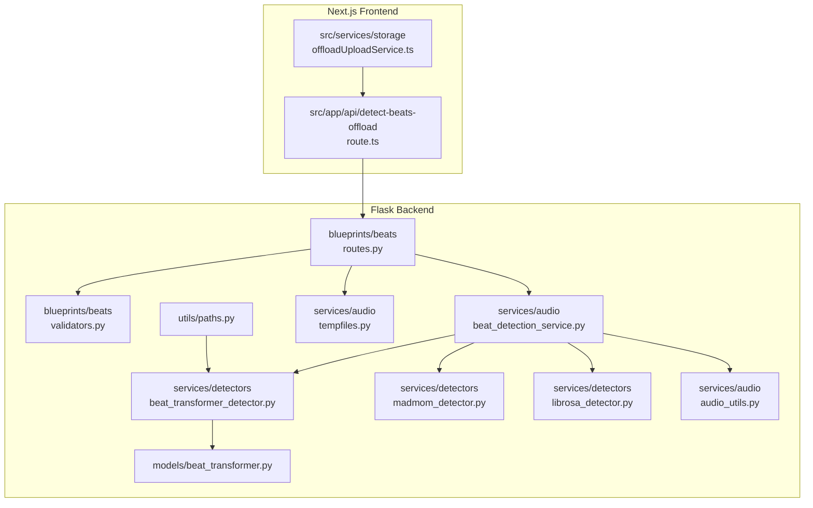
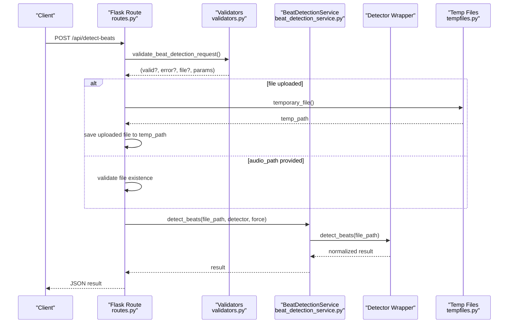
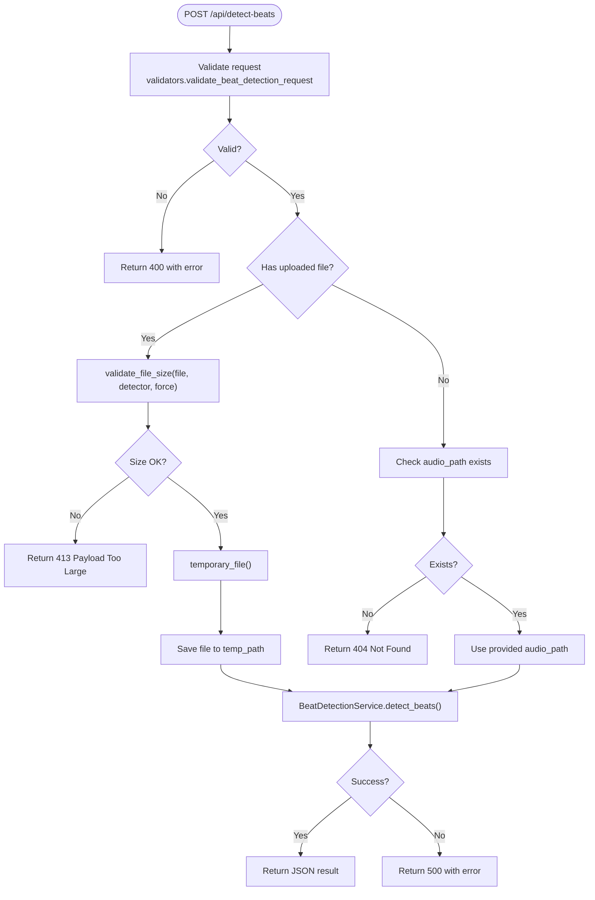
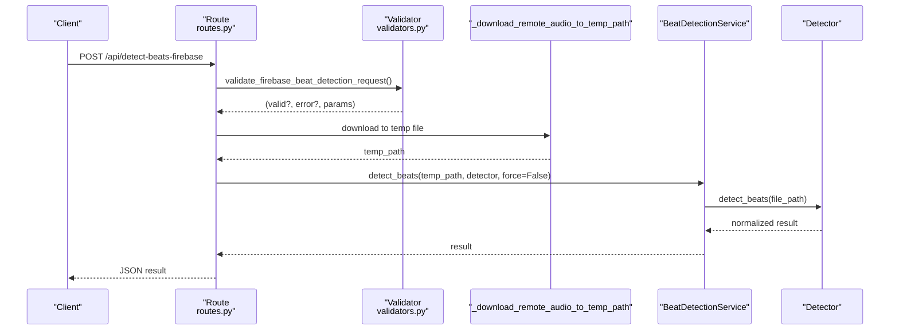
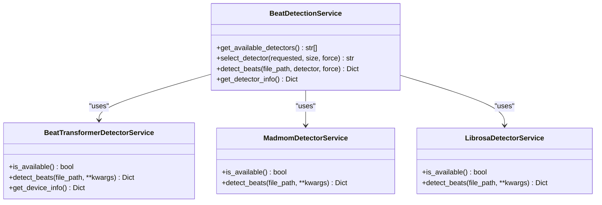
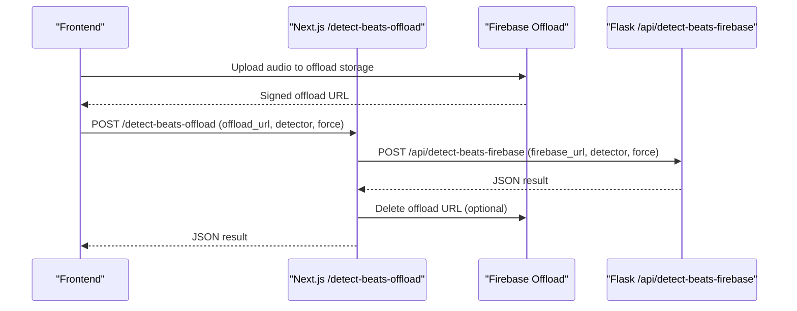
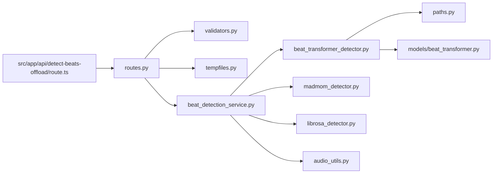

# Beats Blueprint

<cite>
**Referenced Files in This Document**
- [__init__.py](file://python_backend/blueprints/beats/__init__.py)
- [routes.py](file://python_backend/blueprints/beats/routes.py)
- [validators.py](file://python_backend/blueprints/beats/validators.py)
- [beat_detection_service.py](file://python_backend/services/audio/beat_detection_service.py)
- [beat_transformer_detector.py](file://python_backend/services/detectors/beat_transformer_detector.py)
- [madmom_detector.py](file://python_backend/services/detectors/madmom_detector.py)
- [librosa_detector.py](file://python_backend/services/detectors/librosa_detector.py)
- [beat_detection_service.py](file://python_backend/services/audio/beat_detection_service.py)
- [tempfiles.py](file://python_backend/services/audio/tempfiles.py)
- [audio_utils.py](file://python_backend/services/audio/audio_utils.py)
- [paths.py](file://python_backend/utils/paths.py)
- [beat_transformer.py](file://python_backend/models/beat_transformer.py)
- [route.ts](file://src/app/api/detect-beats-offload/route.ts)
- [offloadUploadService.ts](file://src/services/storage/offloadUploadService.ts)
</cite>

## Table of Contents
1. [Introduction](#introduction)
2. [Project Structure](#project-structure)
3. [Core Components](#core-components)
4. [Architecture Overview](#architecture-overview)
5. [Detailed Component Analysis](#detailed-component-analysis)
6. [Dependency Analysis](#dependency-analysis)
7. [Performance Considerations](#performance-considerations)
8. [Troubleshooting Guide](#troubleshooting-guide)
9. [Conclusion](#conclusion)
10. [Appendices](#appendices)

## Introduction
This document describes the beats blueprint service responsible for beat and downbeat detection across three detectors: Beat-Transformer, madmom, and Librosa. It covers the API endpoints, request validation, route handlers, detector integrations, error handling, and the offloading mechanism for large audio files. It also outlines performance characteristics and optimization strategies.

## Project Structure
The beats blueprint is implemented in the Python backend under the blueprints/beats package. Supporting services and detectors live under services/, with detector wrappers under services/detectors/. Temporary file handling and audio utilities are provided by services/audio/*. The frontend offload pipeline is implemented in the Next.js app under src/app/api/detect-beats-offload and integrates with the backend via Firebase URLs.

**Diagram sources**
- [routes.py:40-120](file://python_backend/blueprints/beats/routes.py#L40-L120)
- [validators.py:13-51](file://python_backend/blueprints/beats/validators.py#L13-L51)
- [beat_detection_service.py:20-348](file://python_backend/services/audio/beat_detection_service.py#L20-L348)
- [beat_transformer_detector.py:15-163](file://python_backend/services/detectors/beat_transformer_detector.py#L15-L163)
- [madmom_detector.py:14-158](file://python_backend/services/detectors/madmom_detector.py#L14-L158)
- [librosa_detector.py:14-124](file://python_backend/services/detectors/librosa_detector.py#L14-L124)
- [tempfiles.py:15-66](file://python_backend/services/audio/tempfiles.py#L15-L66)
- [audio_utils.py:70-131](file://python_backend/services/audio/audio_utils.py#L70-L131)
- [paths.py:33-33](file://python_backend/utils/paths.py#L33-L33)
- [beat_transformer.py:194-256](file://python_backend/models/beat_transformer.py#L194-L256)
- [route.ts:37-125](file://src/app/api/detect-beats-offload/route.ts#L37-L125)
- [offloadUploadService.ts:354-392](file://src/services/storage/offloadUploadService.ts#L354-L392)

**Section sources**
- [__init__.py:1-10](file://python_backend/blueprints/beats/__init__.py#L1-L10)
- [routes.py:1-521](file://python_backend/blueprints/beats/routes.py#L1-L521)
- [validators.py:1-141](file://python_backend/blueprints/beats/validators.py#L1-L141)
- [beat_detection_service.py:1-348](file://python_backend/services/audio/beat_detection_service.py#L1-L348)
- [tempfiles.py:1-136](file://python_backend/services/audio/tempfiles.py#L1-L136)
- [audio_utils.py:1-131](file://python_backend/services/audio/audio_utils.py#L1-L131)
- [paths.py:1-191](file://python_backend/utils/paths.py#L1-L191)
- [beat_transformer.py:1-800](file://python_backend/models/beat_transformer.py#L1-L800)
- [route.ts:1-125](file://src/app/api/detect-beats-offload/route.ts#L1-L125)
- [offloadUploadService.ts:354-392](file://src/services/storage/offloadUploadService.ts#L354-L392)

## Core Components
- Blueprints and Routes: The beats blueprint defines endpoints for beat detection and model testing. It validates requests, enforces rate limits, streams remote audio to temporary files, selects a detector, and returns normalized results.
- Validators: Validates multipart/form-data and form parameters, checks file presence and size, and enforces detector choices and force flags.
- Beat Detection Service: Orchestrates detector selection based on availability, file size, and user preference; normalizes results; logs performance and time signatures.
- Detectors: Wrappers for Beat-Transformer, madmom, and Librosa with normalized output and availability checks.
- Temporary Files and Audio Utils: Safe temporary file creation/cleanup and audio validation/duration helpers.
- Offload Pipeline: Frontend uploads to offload storage, sends Firebase URL to backend, which downloads and processes the file.

**Section sources**
- [routes.py:40-120](file://python_backend/blueprints/beats/routes.py#L40-L120)
- [validators.py:13-141](file://python_backend/blueprints/beats/validators.py#L13-L141)
- [beat_detection_service.py:20-348](file://python_backend/services/audio/beat_detection_service.py#L20-L348)
- [beat_transformer_detector.py:15-163](file://python_backend/services/detectors/beat_transformer_detector.py#L15-L163)
- [madmom_detector.py:14-158](file://python_backend/services/detectors/madmom_detector.py#L14-L158)
- [librosa_detector.py:14-124](file://python_backend/services/detectors/librosa_detector.py#L14-L124)
- [tempfiles.py:15-66](file://python_backend/services/audio/tempfiles.py#L15-L66)
- [audio_utils.py:70-131](file://python_backend/services/audio/audio_utils.py#L70-L131)
- [route.ts:37-125](file://src/app/api/detect-beats-offload/route.ts#L37-L125)

## Architecture Overview
The beats blueprint exposes three primary endpoints:
- POST /api/detect-beats: Accepts uploaded audio or a server-side path, validates inputs, selects a detector, and returns normalized beat/downbeat results.
- POST /api/detect-beats-firebase: Accepts a Firebase Storage URL, streams the file to a temporary location, detects beats, and returns results.
- GET /api/model-info: Returns model availability, defaults, and file size limits.

**Diagram sources**
- [routes.py:40-120](file://python_backend/blueprints/beats/routes.py#L40-L120)
- [validators.py:13-51](file://python_backend/blueprints/beats/validators.py#L13-L51)
- [beat_detection_service.py:163-310](file://python_backend/services/audio/beat_detection_service.py#L163-L310)
- [tempfiles.py:15-38](file://python_backend/services/audio/tempfiles.py#L15-L38)

## Detailed Component Analysis

### Endpoint: POST /api/detect-beats
- Purpose: Detect beats in an audio file provided via multipart/form-data or a server-side path.
- Request parameters:
  - file: multipart/form-data audio file (alternative to audio_path)
  - audio_path: path to an existing audio file on the server
  - detector: 'beat-transformer', 'madmom', 'librosa', or 'auto'
  - force: 'true' to bypass size limits for the requested detector
- Validation:
  - Ensures either file or audio_path is provided.
  - Validates detector choice and parses force flag.
  - Enforces file size limits per detector unless force is true.
- Processing:
  - Streams uploaded file to a temporary file.
  - Delegates to BeatDetectionService.detect_beats().
  - Returns normalized JSON with beats, downbeats, BPM, time signature, durations, and processing metrics.

**Diagram sources**
- [routes.py:40-120](file://python_backend/blueprints/beats/routes.py#L40-L120)
- [validators.py:13-141](file://python_backend/blueprints/beats/validators.py#L13-L141)
- [tempfiles.py:15-38](file://python_backend/services/audio/tempfiles.py#L15-L38)
- [beat_detection_service.py:163-310](file://python_backend/services/audio/beat_detection_service.py#L163-L310)

**Section sources**
- [routes.py:40-120](file://python_backend/blueprints/beats/routes.py#L40-L120)
- [validators.py:13-141](file://python_backend/blueprints/beats/validators.py#L13-L141)
- [tempfiles.py:15-66](file://python_backend/services/audio/tempfiles.py#L15-L66)
- [beat_detection_service.py:163-310](file://python_backend/services/audio/beat_detection_service.py#L163-L310)

### Endpoint: POST /api/detect-beats-firebase
- Purpose: Detect beats from a Firebase Storage URL.
- Request parameters:
  - firebase_url: URL to the audio file in Firebase Storage
  - detector: 'beat-transformer', 'madmom', 'librosa', or 'auto'
- Processing:
  - Validates request parameters.
  - Streams the remote audio to a temporary file.
  - Runs BeatDetectionService.detect_beats() with force=false (auto size handling).
  - Returns normalized JSON result.

**Diagram sources**
- [routes.py:122-179](file://python_backend/blueprints/beats/routes.py#L122-L179)
- [validators.py:54-80](file://python_backend/blueprints/beats/validators.py#L54-L80)

**Section sources**
- [routes.py:122-179](file://python_backend/blueprints/beats/routes.py#L122-L179)
- [validators.py:54-80](file://python_backend/blueprints/beats/validators.py#L54-L80)

### Endpoint: GET /api/model-info
- Purpose: Returns model availability, default model, file size limits, and model descriptions.
- Response fields include:
  - success, default_beat_model, available_beat_models
  - beat_transformer_available, madmom_available, librosa_available
  - file_size_limits with upload_limit_mb, local_file_limit_mb, detector-specific limits, and force_parameter_available
  - beat_model_info with descriptions and performance notes
  - detector_details from BeatDetectionService.get_detector_info()

**Section sources**
- [routes.py:182-249](file://python_backend/blueprints/beats/routes.py#L182-L249)
- [beat_detection_service.py:312-348](file://python_backend/services/audio/beat_detection_service.py#L312-L348)

### Detector Integrations
- Beat-Transformer Detector Service
  - Availability checked via BeatTransformerDetector import and checkpoint presence.
  - Normalized output includes beats, downbeats, total counts, BPM, time signature, duration, processing_time, and model metadata.
  - Provides device info when available.
- Madmom Detector Service
  - Uses RNNBeatProcessor and DBNBeatTrackingProcessor; estimates BPM from inter-beat intervals.
  - Provides default downbeats (4/4) and candidate downbeats for 3/4 and 4/4 heuristics.
  - Normalized output includes candidates and meta.
- Librosa Detector Service
  - Uses librosa.beat.beat_track; estimates downbeats as every fourth beat.
  - Normalized output includes BPM, time signature placeholder, and duration.

**Diagram sources**
- [beat_detection_service.py:20-348](file://python_backend/services/audio/beat_detection_service.py#L20-L348)
- [beat_transformer_detector.py:15-163](file://python_backend/services/detectors/beat_transformer_detector.py#L15-L163)
- [madmom_detector.py:14-158](file://python_backend/services/detectors/madmom_detector.py#L14-L158)
- [librosa_detector.py:14-124](file://python_backend/services/detectors/librosa_detector.py#L14-L124)

**Section sources**
- [beat_detection_service.py:20-348](file://python_backend/services/audio/beat_detection_service.py#L20-L348)
- [beat_transformer_detector.py:15-163](file://python_backend/services/detectors/beat_transformer_detector.py#L15-L163)
- [madmom_detector.py:14-158](file://python_backend/services/detectors/madmom_detector.py#L14-L158)
- [librosa_detector.py:14-124](file://python_backend/services/detectors/librosa_detector.py#L14-L124)

### Request Validation Patterns
- validate_beat_detection_request:
  - Requires either file or audio_path.
  - Validates detector among supported values.
  - Parses force parameter from query or form.
  - Returns validated parameters and optional file handle.
- validate_firebase_beat_detection_request:
  - Requires firebase_url.
  - Validates detector parameter.
- validate_file_size:
  - Computes file size in MB without consuming the stream.
  - Enforces detector-specific size limits unless force is true.
  - Provides helpful suggestions for large files.

**Section sources**
- [validators.py:13-141](file://python_backend/blueprints/beats/validators.py#L13-L141)

### Temporary File Management and Audio Utilities
- temporary_file:
  - Context manager that creates a named temporary file and ensures cleanup.
  - Used to safely store uploaded or downloaded audio before processing.
- temporary_audio_file:
  - Specialized context manager for audio files with MP3 suffix.
- get_audio_duration:
  - Loads audio to compute duration when not present in results.
- validate_audio_file:
  - Basic validation by attempting to load a short segment.

**Section sources**
- [tempfiles.py:15-136](file://python_backend/services/audio/tempfiles.py#L15-L136)
- [audio_utils.py:70-131](file://python_backend/services/audio/audio_utils.py#L70-L131)

### Offloading Mechanism for Large Files
- Frontend:
  - Uploads audio to offload storage and obtains a signed URL.
  - Calls POST /api/detect-beats-offload with offload_url, detector, and optional force.
  - Calculates a timeout based on estimated audio duration.
- Backend:
  - Verifies App Check, validates the offload URL, and forwards to /api/detect-beats-firebase.
  - On failure with Beat-Transformer checkpoint errors, retries with madmom automatically.
  - Optionally deletes the offload URL after successful processing.

**Diagram sources**
- [route.ts:37-125](file://src/app/api/detect-beats-offload/route.ts#L37-L125)
- [offloadUploadService.ts:354-392](file://src/services/storage/offloadUploadService.ts#L354-L392)
- [routes.py:122-179](file://python_backend/blueprints/beats/routes.py#L122-L179)

**Section sources**
- [route.ts:1-125](file://src/app/api/detect-beats-offload/route.ts#L1-L125)
- [offloadUploadService.ts:354-392](file://src/services/storage/offloadUploadService.ts#L354-L392)
- [routes.py:122-179](file://python_backend/blueprints/beats/routes.py#L122-L179)

## Dependency Analysis
- BeatDetectionService depends on:
  - BeatTransformerDetectorService, MadmomDetectorService, LibrosaDetectorService
  - audio_utils for validation and duration
  - paths for Beat-Transformer checkpoint resolution
- Route handlers depend on:
  - validators for input validation
  - tempfiles for safe temporary file handling
  - BeatDetectionService for orchestration
- Frontend offload depends on:
  - Next.js route for timeout and forwarding
  - offloadUploadService for upload and deletion

**Diagram sources**
- [routes.py:1-521](file://python_backend/blueprints/beats/routes.py#L1-L521)
- [validators.py:1-141](file://python_backend/blueprints/beats/validators.py#L1-L141)
- [beat_detection_service.py:1-348](file://python_backend/services/audio/beat_detection_service.py#L1-L348)
- [beat_transformer_detector.py:1-163](file://python_backend/services/detectors/beat_transformer_detector.py#L1-L163)
- [madmom_detector.py:1-158](file://python_backend/services/detectors/madmom_detector.py#L1-L158)
- [librosa_detector.py:1-124](file://python_backend/services/detectors/librosa_detector.py#L1-L124)
- [audio_utils.py:1-131](file://python_backend/services/audio/audio_utils.py#L1-L131)
- [paths.py:1-191](file://python_backend/utils/paths.py#L1-L191)
- [beat_transformer.py:1-800](file://python_backend/models/beat_transformer.py#L1-L800)
- [route.ts:1-125](file://src/app/api/detect-beats-offload/route.ts#L1-L125)

**Section sources**
- [routes.py:1-521](file://python_backend/blueprints/beats/routes.py#L1-L521)
- [beat_detection_service.py:1-348](file://python_backend/services/audio/beat_detection_service.py#L1-L348)

## Performance Considerations
- Detector Selection:
  - Auto-selection prefers madmom for small files, Beat-Transformer for medium files, and madmom or Librosa for large files depending on size limits.
  - Force flag allows bypassing size limits for the requested detector.
- File Size Limits:
  - Beat-Transformer: 50–100 MB (depending on auto vs. explicit detector).
  - Madmom: up to 200 MB.
  - Librosa: up to 500 MB.
- Processing Metrics:
  - Results include processing_time and total_processing_time for transparency.
  - Beat-Transformer leverages GPU/CPU based on environment detection.
- Streaming and Cleanup:
  - Remote audio is streamed to temporary files and cleaned up after processing.
- Frontend Timeout:
  - Offload endpoint calculates a timeout proportional to audio duration to avoid long-running requests.

[No sources needed since this section provides general guidance]

## Troubleshooting Guide
- 400 Bad Request:
  - Missing file or audio_path.
  - Invalid detector value.
  - Missing Firebase URL.
- 404 Not Found:
  - Provided audio_path does not exist.
- 413 Payload Too Large:
  - File exceeds detector-specific size limits; use a different detector or add force=true.
- 500 Internal Server Error:
  - Detector initialization or processing failures; check logs for detailed error messages.
- Beat-Transformer Unavailable:
  - Checkpoint missing or import errors; the offload pipeline automatically retries with madmom on checkpoint-related failures.
- Timeout During Offload:
  - Increase audio_duration hint or reduce file size; the frontend computes a timeout based on duration.

**Section sources**
- [validators.py:28-44](file://python_backend/blueprints/beats/validators.py#L28-L44)
- [routes.py:68-90](file://python_backend/blueprints/beats/routes.py#L68-L90)
- [routes.py:136-171](file://python_backend/blueprints/beats/routes.py#L136-L171)
- [route.ts:83-98](file://src/app/api/detect-beats-offload/route.ts#L83-L98)

## Conclusion
The beats blueprint provides a robust, extensible system for beat detection across multiple detectors with strong validation, safe temporary file handling, and an efficient offloading pipeline for large files. Detector selection is automated with sensible defaults and size-aware fallbacks, while the frontend offload route ensures scalable processing for large audio assets.

[No sources needed since this section summarizes without analyzing specific files]

## Appendices

### API Reference: POST /api/detect-beats
- Request
  - Content-Type: multipart/form-data
  - Fields:
    - file: audio file (optional if audio_path provided)
    - audio_path: path to audio file on server (optional if file provided)
    - detector: 'beat-transformer' | 'madmom' | 'librosa' | 'auto'
    - force: 'true' to bypass size limits (optional)
- Response (success)
  - JSON with normalized fields including beats, downbeats, total_beats, total_downbeats, bpm, time_signature, duration, processing_time, detector_selected, file_size_mb, and model metadata.

**Section sources**
- [routes.py:40-120](file://python_backend/blueprints/beats/routes.py#L40-L120)
- [beat_detection_service.py:163-310](file://python_backend/services/audio/beat_detection_service.py#L163-L310)

### API Reference: POST /api/detect-beats-firebase
- Request
  - Content-Type: application/x-www-form-urlencoded or multipart/form-data
  - Fields:
    - firebase_url: signed URL to audio in Firebase Storage
    - detector: 'beat-transformer' | 'madmom' | 'librosa' | 'auto'
- Response (success)
  - Same normalized JSON as /api/detect-beats.

**Section sources**
- [routes.py:122-179](file://python_backend/blueprints/beats/routes.py#L122-L179)

### API Reference: GET /api/model-info
- Response
  - success, default_beat_model, available_beat_models, file_size_limits, beat_model_info, detector_details.

**Section sources**
- [routes.py:182-249](file://python_backend/blueprints/beats/routes.py#L182-L249)

### Offload API Reference: POST /api/detect-beats-offload
- Request
  - Content-Type: multipart/form-data
  - Fields:
    - offload_url or blob_url: signed URL to audio in offload storage
    - audio_duration: estimated duration in seconds (optional, default 180)
    - detector: 'auto' | 'madmom' | 'beat-transformer'
    - force: 'true' (optional)
    - delete_offload or delete_blob: '0'|'false'|'no' to keep offload file (optional)
- Response
  - JSON result forwarded from backend; may include offloadUrl and processingTime in frontend wrapper.

**Section sources**
- [route.ts:37-125](file://src/app/api/detect-beats-offload/route.ts#L37-L125)
- [offloadUploadService.ts:354-392](file://src/services/storage/offloadUploadService.ts#L354-L392)