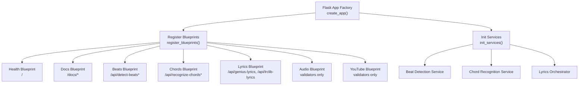
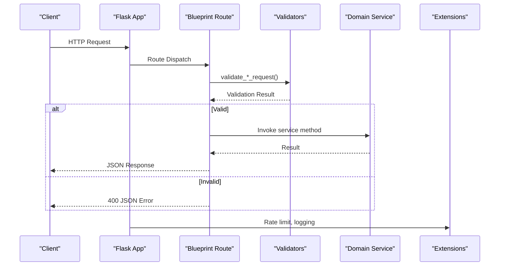
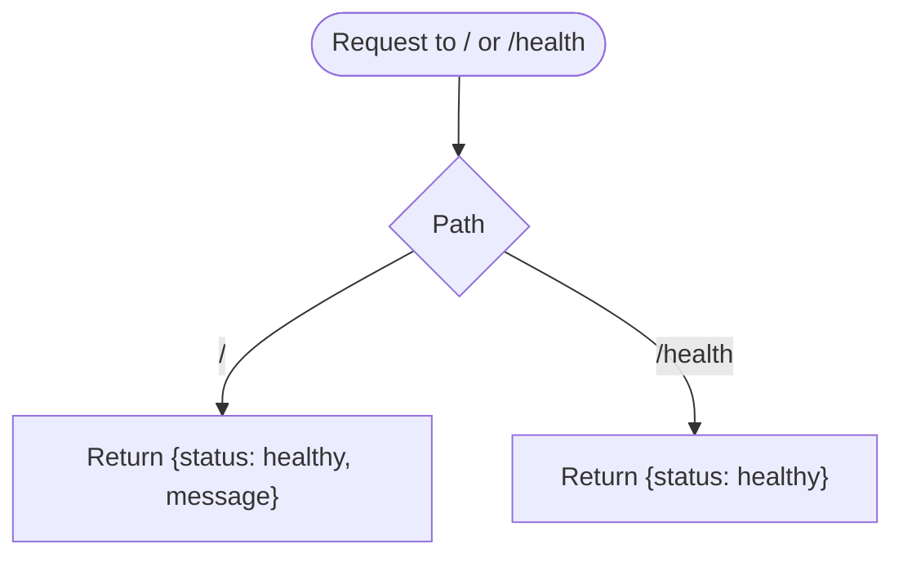
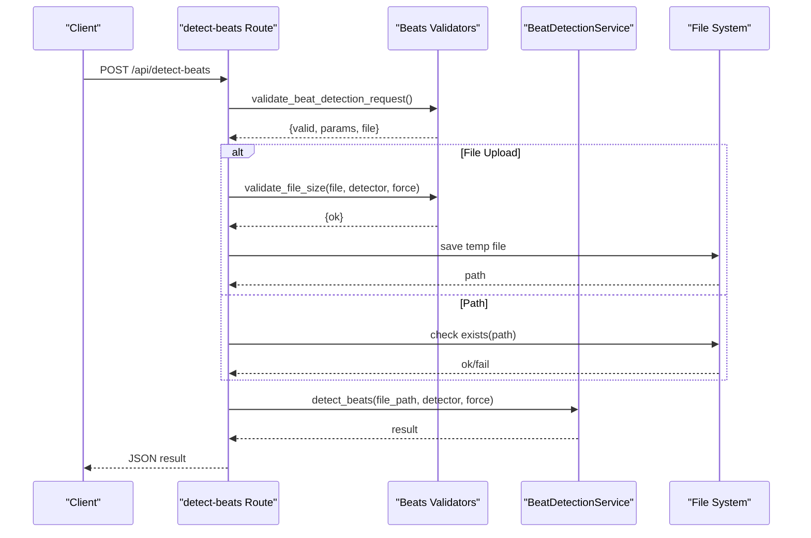
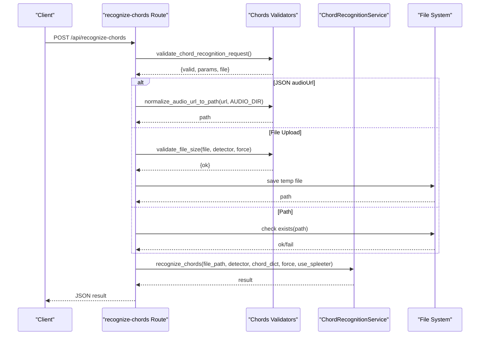
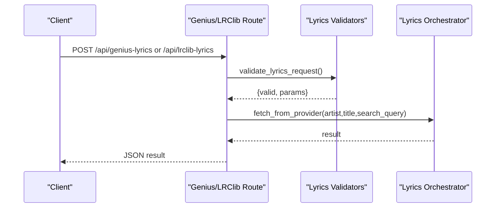
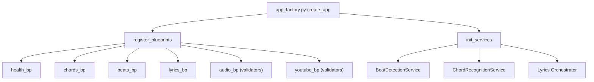

# Blueprint Services

<cite>
**Referenced Files in This Document**
- [app.py](file://python_backend/app.py)
- [app_factory.py](file://python_backend/app_factory.py)
- [error_handlers.py](file://python_backend/error_handlers.py)
- [blueprints/beats/__init__.py](file://python_backend/blueprints/beats/__init__.py)
- [blueprints/beats/routes.py](file://python_backend/blueprints/beats/routes.py)
- [blueprints/beats/validators.py](file://python_backend/blueprints/beats/validators.py)
- [blueprints/chords/__init__.py](file://python_backend/blueprints/chords/__init__.py)
- [blueprints/chords/routes.py](file://python_backend/blueprints/chords/routes.py)
- [blueprints/chords/validators.py](file://python_backend/blueprints/chords/validators.py)
- [blueprints/lyrics/__init__.py](file://python_backend/blueprints/lyrics/__init__.py)
- [blueprints/lyrics/routes.py](file://python_backend/blueprints/lyrics/routes.py)
- [blueprints/lyrics/validators.py](file://python_backend/blueprints/lyrics/validators.py)
- [blueprints/audio/validators.py](file://python_backend/blueprints/audio/validators.py)
- [blueprints/youtube/validators.py](file://python_backend/blueprints/youtube/validators.py)
- [blueprints/health/routes.py](file://python_backend/blueprints/health/routes.py)
</cite>

## Table of Contents
1. [Introduction](#introduction)
2. [Project Structure](#project-structure)
3. [Core Components](#core-components)
4. [Architecture Overview](#architecture-overview)
5. [Detailed Component Analysis](#detailed-component-analysis)
6. [Dependency Analysis](#dependency-analysis)
7. [Performance Considerations](#performance-considerations)
8. [Troubleshooting Guide](#troubleshooting-guide)
9. [Conclusion](#conclusion)

## Introduction
This document describes the Flask blueprint services architecture used in the Python backend. It explains how the application is organized into modular blueprints for distinct service domains: beats, chords, lyrics, audio, youtube, health, and docs. It covers routing patterns, request validation via dedicated validators modules, service integration, blueprint registration and URL prefixing strategy, and the separation of concerns that enables independent development and testing across domains.

## Project Structure
The Flask application follows the application factory pattern and registers blueprints centrally. Blueprints are grouped under blueprints/<domain>/ with per-domain routes and validators. Services are initialized in the factory and attached to the Flask app for use in routes.

**Diagram sources**
- [app_factory.py:68-101](file://python_backend/app_factory.py#L68-L101)
- [app_factory.py:103-161](file://python_backend/app_factory.py#L103-L161)

**Section sources**
- [app_factory.py:27-66](file://python_backend/app_factory.py#L27-L66)
- [app_factory.py:68-101](file://python_backend/app_factory.py#L68-L101)
- [app_factory.py:103-161](file://python_backend/app_factory.py#L103-L161)

## Core Components
- Application factory: Creates and configures the Flask app, initializes extensions, registers blueprints, and sets up a service container.
- Blueprints: Modular route groups for each domain, each with its own routes and validators.
- Validators: Centralized validation logic for each domain’s endpoints.
- Services: Domain services injected into the app and used by routes (beat detection, chord recognition, lyrics orchestration).
- Error handlers: Centralized JSON error responses and custom exception classes.

**Section sources**
- [app_factory.py:27-66](file://python_backend/app_factory.py#L27-L66)
- [app_factory.py:68-101](file://python_backend/app_factory.py#L68-L101)
- [app_factory.py:103-161](file://python_backend/app_factory.py#L103-L161)
- [error_handlers.py:13-93](file://python_backend/error_handlers.py#L13-L93)
- [error_handlers.py:96-161](file://python_backend/error_handlers.py#L96-L161)

## Architecture Overview
The Flask app is created via an application factory that:
- Applies compatibility patches
- Loads configuration
- Initializes extensions (CORS, rate limiting)
- Registers blueprints
- Initializes services and attaches them to app.extensions

Each blueprint defines its routes and uses validators to enforce request constraints. Routes call into services to perform domain-specific work and return structured JSON responses.

**Diagram sources**
- [blueprints/beats/routes.py:40-120](file://python_backend/blueprints/beats/routes.py#L40-L120)
- [blueprints/beats/validators.py:13-51](file://python_backend/blueprints/beats/validators.py#L13-L51)
- [blueprints/chords/routes.py:43-143](file://python_backend/blueprints/chords/routes.py#L43-L143)
- [blueprints/chords/validators.py:14-80](file://python_backend/blueprints/chords/validators.py#L14-L80)
- [blueprints/lyrics/routes.py:22-72](file://python_backend/blueprints/lyrics/routes.py#L22-L72)
- [blueprints/lyrics/validators.py:12-58](file://python_backend/blueprints/lyrics/validators.py#L12-L58)

## Detailed Component Analysis

### Health Blueprint
- Purpose: Basic health checks and root endpoint.
- Routes:
  - GET /: Returns a simple health status.
  - GET /health: Cloud Run-friendly health check.
- Registration: Always registered.

**Diagram sources**
- [blueprints/health/routes.py:18-31](file://python_backend/blueprints/health/routes.py#L18-L31)

**Section sources**
- [blueprints/health/routes.py:18-31](file://python_backend/blueprints/health/routes.py#L18-L31)
- [app_factory.py:68-101](file://python_backend/app_factory.py#L68-L101)

### Beats Blueprint
- Purpose: Beat detection, model availability tests, and model info.
- Routes:
  - POST /api/detect-beats: Detect beats from uploaded file or path; supports detector selection and force override.
  - POST /api/detect-beats-firebase: Detect beats from Firebase Storage URL.
  - GET /api/model-info: Available detectors and defaults.
  - GET /api/test-beat-transformer, /api/test-madmom, /api/test-librosa, /api/test-all-models, /api/test-dbn-isolation: Model availability and diagnostics.
- Validators:
  - validate_beat_detection_request(): Validates file or path, detector, force.
  - validate_firebase_beat_detection_request(): Validates Firebase URL and detector.
  - validate_file_size(): Enforces per-detector size limits unless force is true.
- Service integration: Uses BeatDetectionService from app.extensions.

**Diagram sources**
- [blueprints/beats/routes.py:40-120](file://python_backend/blueprints/beats/routes.py#L40-L120)
- [blueprints/beats/validators.py:13-51](file://python_backend/blueprints/beats/validators.py#L13-L51)
- [blueprints/beats/validators.py:106-141](file://python_backend/blueprints/beats/validators.py#L106-L141)

**Section sources**
- [blueprints/beats/routes.py:40-120](file://python_backend/blueprints/beats/routes.py#L40-L120)
- [blueprints/beats/routes.py:122-179](file://python_backend/blueprints/beats/routes.py#L122-L179)
- [blueprints/beats/routes.py:182-250](file://python_backend/blueprints/beats/routes.py#L182-L250)
- [blueprints/beats/routes.py:252-521](file://python_backend/blueprints/beats/routes.py#L252-L521)
- [blueprints/beats/validators.py:13-51](file://python_backend/blueprints/beats/validators.py#L13-L51)
- [blueprints/beats/validators.py:54-80](file://python_backend/blueprints/beats/validators.py#L54-L80)
- [blueprints/beats/validators.py:106-141](file://python_backend/blueprints/beats/validators.py#L106-L141)

### Chords Blueprint
- Purpose: Chord recognition across multiple models and model info/testing.
- Routes:
  - POST /api/recognize-chords: Recognize chords from file, path, or JSON audioUrl; supports detector selection, chord dictionaries, force, and Spleeter.
  - POST /api/recognize-chords-firebase: Recognize chords from Firebase URL.
  - GET /api/chord-model-info: Flask chord-model discovery with available chord models and defaults.
  - GET /api/test-chord-cnn-lstm, /api/test-btc-sl, /api/test-btc-pl, /api/test-all-chord-models: Model availability and diagnostics.
- Validators:
  - validate_chord_recognition_request(): Validates inputs, detector, force, use_spleeter, chord_dict.
  - validate_firebase_chord_recognition_request(): Validates Firebase URL and detector.
  - validate_file_size(): Enforces per-detector size limits unless force is true.
  - normalize_audio_url_to_path(): Converts relative URLs to absolute paths.
- Service integration: Uses ChordRecognitionService from app.extensions.

**Diagram sources**
- [blueprints/chords/routes.py:43-143](file://python_backend/blueprints/chords/routes.py#L43-L143)
- [blueprints/chords/validators.py:14-80](file://python_backend/blueprints/chords/validators.py#L14-L80)
- [blueprints/chords/validators.py:166-199](file://python_backend/blueprints/chords/validators.py#L166-L199)
- [blueprints/chords/validators.py:202-221](file://python_backend/blueprints/chords/validators.py#L202-L221)

**Section sources**
- [blueprints/chords/routes.py:43-143](file://python_backend/blueprints/chords/routes.py#L43-L143)
- [blueprints/chords/routes.py:145-220](file://python_backend/blueprints/chords/routes.py#L145-L220)
- [blueprints/chords/routes.py:222-257](file://python_backend/blueprints/chords/routes.py#L222-L257)
- [blueprints/chords/routes.py:259-374](file://python_backend/blueprints/chords/routes.py#L259-L374)
- [blueprints/chords/validators.py:14-80](file://python_backend/blueprints/chords/validators.py#L14-L80)
- [blueprints/chords/validators.py:83-117](file://python_backend/blueprints/chords/validators.py#L83-L117)
- [blueprints/chords/validators.py:166-199](file://python_backend/blueprints/chords/validators.py#L166-L199)
- [blueprints/chords/validators.py:202-221](file://python_backend/blueprints/chords/validators.py#L202-L221)

### Lyrics Blueprint
- Purpose: Fetch lyrics from multiple providers (Genius, LRClib) with a unified interface.
- Routes:
  - POST /api/genius-lyrics: Fetch lyrics from Genius.
  - POST /api/lrclib-lyrics: Fetch lyrics from LRClib.
- Validators:
  - validate_lyrics_request(): Ensures JSON payload with either search_query or both artist and title; enforces length limits.
- Service integration: Uses Lyrics Orchestrator from app.extensions.

**Diagram sources**
- [blueprints/lyrics/routes.py:22-72](file://python_backend/blueprints/lyrics/routes.py#L22-L72)
- [blueprints/lyrics/validators.py:12-58](file://python_backend/blueprints/lyrics/validators.py#L12-L58)

**Section sources**
- [blueprints/lyrics/routes.py:22-72](file://python_backend/blueprints/lyrics/routes.py#L22-L72)
- [blueprints/lyrics/routes.py:75-126](file://python_backend/blueprints/lyrics/routes.py#L75-L126)
- [blueprints/lyrics/validators.py:12-58](file://python_backend/blueprints/lyrics/validators.py#L12-L58)

### Audio Blueprint
- Purpose: Provides validation utilities for audio extraction requests.
- Validators:
  - validate_audio_extraction_request(): Validates videoId format, boolean flags, and optional parameters.
  - validate_video_id(), sanitize_video_id(), validate_timeout_parameter(), get_extraction_display_name(): Supporting validations and helpers.

**Section sources**
- [blueprints/audio/validators.py:13-72](file://python_backend/blueprints/audio/validators.py#L13-L72)
- [blueprints/audio/validators.py:75-101](file://python_backend/blueprints/audio/validators.py#L75-L101)
- [blueprints/audio/validators.py:104-124](file://python_backend/blueprints/audio/validators.py#L104-L124)
- [blueprints/audio/validators.py:127-154](file://python_backend/blueprints/audio/validators.py#L127-L154)
- [blueprints/audio/validators.py:157-173](file://python_backend/blueprints/audio/validators.py#L157-L173)

### YouTube Blueprint
- Purpose: Provides validation utilities for YouTube search requests.
- Validators:
  - validate_youtube_search_request(): Validates query and maxResults; sanitizes query.
  - validate_search_query(), sanitize_search_query(), validate_max_results(), get_search_source_display_name(): Supporting validations and helpers.

**Section sources**
- [blueprints/youtube/validators.py:13-67](file://python_backend/blueprints/youtube/validators.py#L13-L67)
- [blueprints/youtube/validators.py:70-99](file://python_backend/blueprints/youtube/validators.py#L70-L99)
- [blueprints/youtube/validators.py:102-122](file://python_backend/blueprints/youtube/validators.py#L102-L122)
- [blueprints/youtube/validators.py:125-152](file://python_backend/blueprints/youtube/validators.py#L125-L152)
- [blueprints/youtube/validators.py:155-171](file://python_backend/blueprints/youtube/validators.py#L155-L171)

### Docs Blueprint
- Purpose: Documentation endpoints.
- Registration: Registered alongside other blueprints.

**Section sources**
- [app_factory.py:68-101](file://python_backend/app_factory.py#L68-L101)

## Dependency Analysis
- Blueprint registration: Centralized in the factory; debug blueprint conditionally registered based on configuration.
- Service container: Created once in the factory and stored in app.extensions for routes to access.
- Validators: Pure functions invoked by routes; they depend on Flask request context and return structured tuples for route handling.
- Error handling: Centralized error handlers provide consistent JSON responses and custom exception classes.

**Diagram sources**
- [app_factory.py:68-101](file://python_backend/app_factory.py#L68-L101)
- [app_factory.py:103-161](file://python_backend/app_factory.py#L103-L161)

**Section sources**
- [app_factory.py:68-101](file://python_backend/app_factory.py#L68-L101)
- [app_factory.py:103-161](file://python_backend/app_factory.py#L103-L161)
- [error_handlers.py:13-93](file://python_backend/error_handlers.py#L13-L93)
- [error_handlers.py:96-161](file://python_backend/error_handlers.py#L96-L161)

## Performance Considerations
- Rate limiting: Each blueprint leverages Flask-Limiter via config.get_rate_limit to throttle endpoints by workload category (light, moderate, heavy, test, health).
- File size validation: Prevents oversized uploads and selects appropriate detectors or forces overrides.
- Temporary file handling: Routes use temporary files for uploads and ensure cleanup to avoid disk pressure.
- Model availability checks: Tests endpoints provide visibility into model readiness and device info, aiding operational decisions.

[No sources needed since this section provides general guidance]

## Troubleshooting Guide
- Validation failures: Validators return structured error messages; routes respond with 400 and JSON bodies indicating the issue.
- File size errors: When uploads exceed limits, routes return 413 with guidance to adjust detector or force parameter.
- Model unavailability: Test endpoints return 404 or detailed errors when models are missing or misconfigured.
- Unexpected errors: Centralized handlers catch unhandled exceptions, log stack traces, and return 500 with optional traceback in non-production modes.
- Custom exceptions: Use ModelUnavailableError, FileTooLargeError, AudioProcessingError, ExternalServiceError for domain-specific failures.

**Section sources**
- [blueprints/beats/validators.py:106-141](file://python_backend/blueprints/beats/validators.py#L106-L141)
- [blueprints/chords/validators.py:166-199](file://python_backend/blueprints/chords/validators.py#L166-L199)
- [error_handlers.py:13-93](file://python_backend/error_handlers.py#L13-L93)
- [error_handlers.py:96-161](file://python_backend/error_handlers.py#L96-L161)

## Conclusion
The Flask blueprint services architecture cleanly separates concerns across domains (beats, chords, lyrics, audio, youtube, health, docs). Each blueprint encapsulates its routes and validation logic, integrates with a shared service container, and adheres to centralized error handling and rate limiting. This modularity enables independent development, testing, and deployment of service areas while maintaining consistent behavior and reliability.