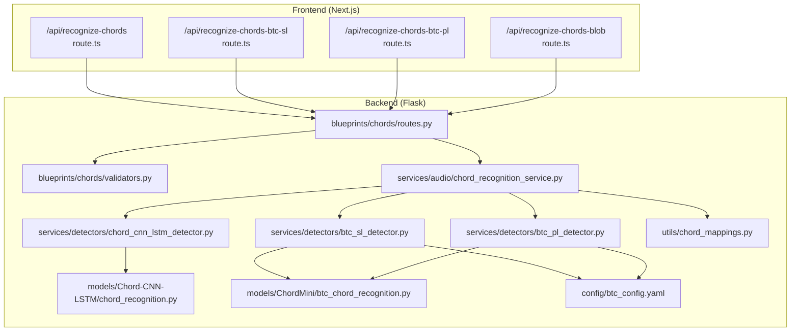
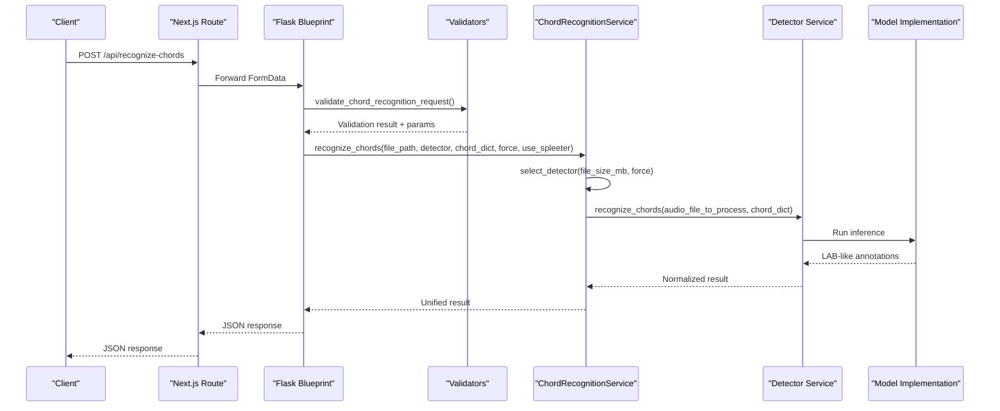
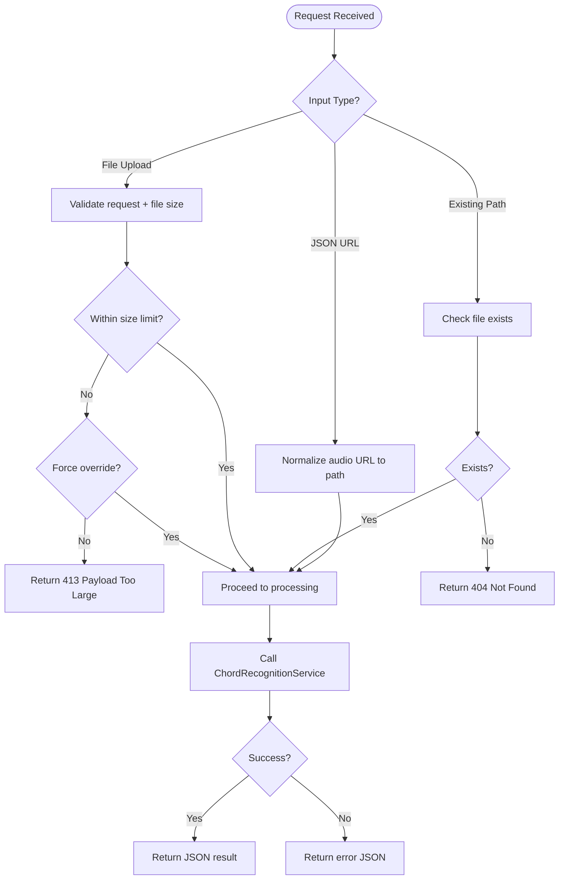
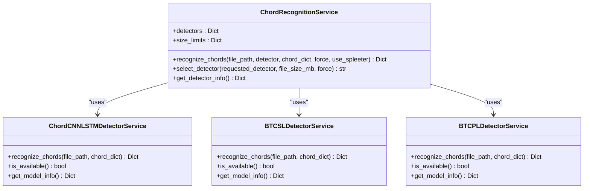
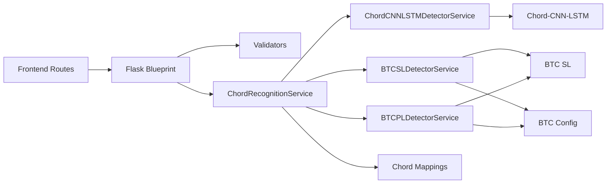

# Chords Blueprint

<cite>
**Referenced Files in This Document**
- [routes.py](file://python_backend/blueprints/chords/routes.py)
- [validators.py](file://python_backend/blueprints/chords/validators.py)
- [chord_recognition_service.py](file://python_backend/services/audio/chord_recognition_service.py)
- [chord_cnn_lstm_detector.py](file://python_backend/services/detectors/chord_cnn_lstm_detector.py)
- [btc_sl_detector.py](file://python_backend/services/detectors/btc_sl_detector.py)
- [btc_pl_detector.py](file://python_backend/services/detectors/btc_pl_detector.py)
- [btc_chord_recognition.py](file://python_backend/models/ChordMini/btc_chord_recognition.py)
- [chord_recognition.py](file://python_backend/models/Chord-CNN-LSTM/chord_recognition.py)
- [chord_mappings.py](file://python_backend/utils/chord_mappings.py)
- [btc_config.yaml](file://python_backend/config/btc_config.yaml)
- [route.ts](file://src/app/api/recognize-chords/route.ts)
- [route.ts](file://src/app/api/recognize-chords-btc-pl/route.ts)
- [route.ts](file://src/app/api/recognize-chords-btc-sl/route.ts)
- `Machine Learning Models/Adding New Models.md`
- [route.ts](file://src/app/api/recognize-chords-blob/route.ts)
</cite>

## Table of Contents
1. [Introduction](#introduction)
2. [Project Structure](#project-structure)
3. [Core Components](#core-components)
4. [Architecture Overview](#architecture-overview)
5. [Detailed Component Analysis](#detailed-component-analysis)
6. [Dependency Analysis](#dependency-analysis)
7. [Performance Considerations](#performance-considerations)
8. [Troubleshooting Guide](#troubleshooting-guide)
9. [Conclusion](#conclusion)
10. [Appendices](#appendices)

## Introduction
This document describes the chords blueprint service responsible for chord recognition in the ChordMini application. It covers the API endpoints, request validation, model selection and routing, integration with chord recognition services, model comparison features, and offloading mechanisms for large audio files and batch processing.

## Project Structure
The chords blueprint spans both the Python backend and the Next.js frontend:
- Python backend: Flask blueprint with routes, validators, and services for model orchestration and detection.
- Services: Unified chord recognition service and detector services for CNN-LSTM and BTC variants.
- Models: Legacy CNN-LSTM implementation and ChordMini BTC models.
- Frontend: Next.js API routes that proxy requests to the Python backend and provide model-specific routes.

**Diagram sources**
- [routes.py:43-143](file://python_backend/blueprints/chords/routes.py#L43-L143)
- [validators.py:14-80](file://python_backend/blueprints/chords/validators.py#L14-L80)
- [chord_recognition_service.py:25-47](file://python_backend/services/audio/chord_recognition_service.py#L25-L47)
- [chord_cnn_lstm_detector.py:17-31](file://python_backend/services/detectors/chord_cnn_lstm_detector.py#L17-L31)
- [btc_sl_detector.py:17-31](file://python_backend/services/detectors/btc_sl_detector.py#L17-L31)
- [btc_pl_detector.py:17-31](file://python_backend/services/detectors/btc_pl_detector.py#L17-L31)
- [chord_recognition.py:24-32](file://python_backend/models/Chord-CNN-LSTM/chord_recognition.py#L24-L32)
- [btc_chord_recognition.py:166-177](file://python_backend/models/ChordMini/btc_chord_recognition.py#L166-L177)
- [chord_mappings.py:112-136](file://python_backend/utils/chord_mappings.py#L112-L136)
- [btc_config.yaml:26-49](file://python_backend/config/btc_config.yaml#L26-L49)

**Section sources**
- [routes.py:1-143](file://python_backend/blueprints/chords/routes.py#L1-L143)
- [validators.py:1-254](file://python_backend/blueprints/chords/validators.py#L1-L254)
- [chord_recognition_service.py:1-322](file://python_backend/services/audio/chord_recognition_service.py#L1-L322)
- [chord_cnn_lstm_detector.py:1-249](file://python_backend/services/detectors/chord_cnn_lstm_detector.py#L1-L249)
- [btc_sl_detector.py:1-246](file://python_backend/services/detectors/btc_sl_detector.py#L1-L246)
- [btc_pl_detector.py:1-246](file://python_backend/services/detectors/btc_pl_detector.py#L1-L246)
- [btc_chord_recognition.py:1-357](file://python_backend/models/ChordMini/btc_chord_recognition.py#L1-L357)
- [chord_recognition.py:1-206](file://python_backend/models/Chord-CNN-LSTM/chord_recognition.py#L1-L206)
- [chord_mappings.py:1-319](file://python_backend/utils/chord_mappings.py#L1-L319)
- [btc_config.yaml:1-61](file://python_backend/config/btc_config.yaml#L1-L61)
- [route.ts:1-208](file://src/app/api/recognize-chords/route.ts#L1-L208)
- [route.ts:1-79](file://src/app/api/recognize-chords-btc-pl/route.ts#L1-L79)
- [route.ts:1-79](file://src/app/api/recognize-chords-btc-sl/route.ts#L1-L79)
- [route.ts:1-2](file://src/app/api/recognize-chords-blob/route.ts#L1-L2)

## Core Components
- Flask blueprint routes for chord recognition:
  - Unified route for general recognition with model selection and validation.
  - Model-specific routes that set detector parameters and forward to the unified endpoint.
- Validators:
  - Validates request parameters, detector selection, file size limits, and chord dictionary support.
- Chord recognition service:
  - Orchestrates model selection, chord dictionary selection, optional Spleeter separation, and result normalization.
- Detectors:
  - CNN-LSTM detector service.
  - BTC-SL and BTC-PL detector services wrapping the ChordMini BTC implementation.
- Models:
  - Legacy CNN-LSTM implementation and ChordMini BTC implementation with standardized output.
- Frontend API routes:
  - Proxy routes that forward requests to the Python backend and set model-specific defaults.

**Section sources**
- [routes.py:43-143](file://python_backend/blueprints/chords/routes.py#L43-L143)
- [validators.py:14-254](file://python_backend/blueprints/chords/validators.py#L14-L254)
- [chord_recognition_service.py:25-322](file://python_backend/services/audio/chord_recognition_service.py#L25-L322)
- [chord_cnn_lstm_detector.py:17-249](file://python_backend/services/detectors/chord_cnn_lstm_detector.py#L17-L249)
- [btc_sl_detector.py:17-246](file://python_backend/services/detectors/btc_sl_detector.py#L17-L246)
- [btc_pl_detector.py:17-246](file://python_backend/services/detectors/btc_pl_detector.py#L17-L246)
- [chord_recognition.py:24-32](file://python_backend/models/Chord-CNN-LSTM/chord_recognition.py#L24-L32)
- [btc_chord_recognition.py:166-177](file://python_backend/models/ChordMini/btc_chord_recognition.py#L166-L177)
- [route.ts:1-208](file://src/app/api/recognize-chords/route.ts#L1-L208)
- [route.ts:1-79](file://src/app/api/recognize-chords-btc-pl/route.ts#L1-L79)
- [route.ts:1-79](file://src/app/api/recognize-chords-btc-sl/route.ts#L1-L79)
- [route.ts:1-2](file://src/app/api/recognize-chords-blob/route.ts#L1-L2)

## Architecture Overview
The system integrates frontend API routes with a Flask blueprint that validates inputs, selects appropriate detectors, and orchestrates model inference. The service supports automatic model selection based on file size and availability, and provides model information and testing endpoints.

**Diagram sources**
- [route.ts:17-107](file://src/app/api/recognize-chords/route.ts#L17-L107)
- [routes.py:43-143](file://python_backend/blueprints/chords/routes.py#L43-L143)
- [validators.py:14-80](file://python_backend/blueprints/chords/validators.py#L14-L80)
- [chord_recognition_service.py:173-296](file://python_backend/services/audio/chord_recognition_service.py#L173-L296)
- [chord_cnn_lstm_detector.py:78-191](file://python_backend/services/detectors/chord_cnn_lstm_detector.py#L78-L191)
- [btc_sl_detector.py:87-169](file://python_backend/services/detectors/btc_sl_detector.py#L87-L169)
- [btc_pl_detector.py:87-169](file://python_backend/services/detectors/btc_pl_detector.py#L87-L169)
- [chord_recognition.py:24-32](file://python_backend/models/Chord-CNN-LSTM/chord_recognition.py#L24-L32)
- [btc_chord_recognition.py:166-177](file://python_backend/models/ChordMini/btc_chord_recognition.py#L166-L177)

## Detailed Component Analysis

### API Endpoints and Request Handling
- recognize-chords (POST): Unified endpoint supporting file uploads, existing server paths, and JSON audio URLs. Validates parameters, enforces size limits, and delegates to the chord recognition service.
  - recognize-chords-btc-pl (POST): Next.js compatibility proxy that forwards to Flask `POST /api/recognize-chords` with detector set to btc-pl.
  - recognize-chords-btc-sl (POST): Next.js compatibility proxy that forwards to Flask `POST /api/recognize-chords` with detector set to btc-sl.
- recognize-chords-blob (POST): Aliased to the offload route for blob-based processing.

**Diagram sources**
- [routes.py:43-143](file://python_backend/blueprints/chords/routes.py#L43-L143)
- [validators.py:16-80](file://python_backend/blueprints/chords/validators.py#L16-L80)
- [validators.py:166-200](file://python_backend/blueprints/chords/validators.py#L166-L200)

**Section sources**
- [routes.py:43-143](file://python_backend/blueprints/chords/routes.py#L43-L143)
- [route.ts:17-107](file://src/app/api/recognize-chords/route.ts#L17-L107)
- [route.ts:13-49](file://src/app/api/recognize-chords-btc-pl/route.ts#L13-L49)
- [route.ts:13-49](file://src/app/api/recognize-chords-btc-sl/route.ts#L13-L49)
- [route.ts:1-2](file://src/app/api/recognize-chords-blob/route.ts#L1-L2)

### Request Validation Patterns
- Parameter validation:
  - detector: Must be one of chord-cnn-lstm, btc-sl, btc-pl, auto.
  - chord_dict: Optional; validated against model support.
  - force: Boolean toggle to override size limits.
  - use_spleeter: Boolean toggle to enable vocal separation.
- File size validation:
  - Limits vary by detector; enforced unless force is true.
- Audio URL normalization:
  - Converts relative URLs under /audio/ to absolute paths.

**Section sources**
- [validators.py:14-80](file://python_backend/blueprints/chords/validators.py#L14-L80)
- [validators.py:166-200](file://python_backend/blueprints/chords/validators.py#L166-L200)
- [validators.py:202-222](file://python_backend/blueprints/chords/validators.py#L202-L222)

### Route Handler Implementations
- recognize-chords:
  - Handles three input modes: uploaded file, existing server path, and JSON audio URL.
  - Enforces size limits and cleans up temporary files.
  - Delegates to ChordRecognitionService for processing.
- Model-specific routes:
  - Set detector parameter and forward to the unified endpoint.
- Offload alias:
  - Aliased to the offload route for blob-based processing.

**Section sources**
- [routes.py:43-143](file://python_backend/blueprints/chords/routes.py#L43-L143)
- [route.ts:30-38](file://src/app/api/recognize-chords-btc-pl/route.ts#L30-L38)
- [route.ts:30-38](file://src/app/api/recognize-chords-btc-sl/route.ts#L30-L38)
- [route.ts:1-2](file://src/app/api/recognize-chords-blob/route.ts#L1-L2)

### Integration with Chord Recognition Services and Model Comparison
- ChordRecognitionService:
  - Maintains detector registry and size limits.
  - Auto-selects best detector based on availability and file size.
  - Supports chord dictionary validation and fallback.
  - Optional Spleeter integration for vocal separation.
- Detector services:
  - Provide normalized interfaces returning standardized chord annotations.
  - Parse model outputs into a unified format with timing and chord labels.
- Model comparison:
  - Model info and availability endpoints expose detector capabilities.
  - Test endpoints verify model readiness and return model info.

**Diagram sources**
- [chord_recognition_service.py:25-47](file://python_backend/services/audio/chord_recognition_service.py#L25-L47)
- [chord_cnn_lstm_detector.py:17-31](file://python_backend/services/detectors/chord_cnn_lstm_detector.py#L17-L31)
- [btc_sl_detector.py:17-31](file://python_backend/services/detectors/btc_sl_detector.py#L17-L31)
- [btc_pl_detector.py:17-31](file://python_backend/services/detectors/btc_pl_detector.py#L17-L31)

**Section sources**
- [chord_recognition_service.py:25-322](file://python_backend/services/audio/chord_recognition_service.py#L25-L322)
- [chord_cnn_lstm_detector.py:78-191](file://python_backend/services/detectors/chord_cnn_lstm_detector.py#L78-L191)
- [btc_sl_detector.py:87-169](file://python_backend/services/detectors/btc_sl_detector.py#L87-L169)
- [btc_pl_detector.py:87-169](file://python_backend/services/detectors/btc_pl_detector.py#L87-L169)

### Model-Specific Parameters and Behavior
- CNN-LSTM:
  - Supported chord dictionaries: full, ismir2017, submission, extended.
  - Default dictionary: submission.
  - File size limit: 100 MB.
- BTC-SL:
  - Uses large_voca dictionary (170 chords).
  - File size limit: 50 MB.
  - Self-labeled transformer model.
- BTC-PL:
  - Uses large_voca dictionary (170 chords).
  - File size limit: 50 MB.
  - Pseudo-labeled transformer model.
- Configuration:
  - BTC model configuration defines feature dimensions, sequence length, and model parameters.

**Section sources**
- [chord_mappings.py:112-151](file://python_backend/utils/chord_mappings.py#L112-L151)
- [chord_mappings.py:64-68](file://python_backend/utils/chord_mappings.py#L64-L68)
- [chord_recognition_service.py:38-43](file://python_backend/services/audio/chord_recognition_service.py#L38-L43)
- [btc_config.yaml:26-49](file://python_backend/config/btc_config.yaml#L26-L49)

### Offloading Mechanism and Batch Processing
- Offload alias:
  - recognize-chords-blob is aliased to the offload route for blob-based processing.
- Frontend considerations:
  - Frontend routes set timeouts and handle large file scenarios, forwarding to the unified backend endpoint.
- Backend considerations:
  - Routes enforce size limits and provide error responses for oversized files.
  - Temporary file cleanup ensures resources are released after processing.

**Section sources**
- [route.ts:1-2](file://src/app/api/recognize-chords-blob/route.ts#L1-L2)
- [routes.py:135-143](file://python_backend/blueprints/chords/routes.py#L135-L143)
- [validators.py:166-200](file://python_backend/blueprints/chords/validators.py#L166-L200)

## Dependency Analysis
The system exhibits clear layering:
- Frontend routes depend on backend endpoints via fetch.
- Flask blueprint depends on validators and the chord recognition service.
- Chord recognition service depends on detector services and chord mappings.
- Detectors depend on model implementations and configuration.

**Diagram sources**
- [route.ts:1-208](file://src/app/api/recognize-chords/route.ts#L1-L208)
- [routes.py:1-143](file://python_backend/blueprints/chords/routes.py#L1-L143)
- [validators.py:1-254](file://python_backend/blueprints/chords/validators.py#L1-L254)
- [chord_recognition_service.py:1-322](file://python_backend/services/audio/chord_recognition_service.py#L1-L322)
- [chord_cnn_lstm_detector.py:1-249](file://python_backend/services/detectors/chord_cnn_lstm_detector.py#L1-L249)
- [btc_sl_detector.py:1-246](file://python_backend/services/detectors/btc_sl_detector.py#L1-L246)
- [btc_pl_detector.py:1-246](file://python_backend/services/detectors/btc_pl_detector.py#L1-L246)
- [chord_recognition.py:1-206](file://python_backend/models/Chord-CNN-LSTM/chord_recognition.py#L1-L206)
- [btc_chord_recognition.py:1-357](file://python_backend/models/ChordMini/btc_chord_recognition.py#L1-L357)
- [chord_mappings.py:1-319](file://python_backend/utils/chord_mappings.py#L1-L319)
- [btc_config.yaml:1-61](file://python_backend/config/btc_config.yaml#L1-L61)

**Section sources**
- [chord_recognition_service.py:25-47](file://python_backend/services/audio/chord_recognition_service.py#L25-L47)
- [chord_cnn_lstm_detector.py:17-31](file://python_backend/services/detectors/chord_cnn_lstm_detector.py#L17-L31)
- [btc_sl_detector.py:17-31](file://python_backend/services/detectors/btc_sl_detector.py#L17-L31)
- [btc_pl_detector.py:17-31](file://python_backend/services/detectors/btc_pl_detector.py#L17-L31)

## Performance Considerations
- Model selection:
  - Auto-selection prefers larger models for large files and smaller models for small files to balance accuracy and speed.
- File size limits:
  - Enforced per model to prevent resource exhaustion; use force to override when necessary.
- Spleeter integration:
  - Optional vocal separation can improve accuracy but adds processing overhead.
- Frontend timeouts:
  - Extended timeouts accommodate long-running ML inference; ensure backend and network stability.

[No sources needed since this section provides general guidance]

## Troubleshooting Guide
- 413 Payload Too Large:
  - Occurs when file exceeds size limits. Use force to override or reduce file size.
- 404 Not Found:
  - Occurs when audio_path does not exist or audio URL is invalid.
- Model Unavailable:
  - Detector availability checked before inference; use model info endpoints to verify readiness.
- Timeout Errors:
  - Internal processing timeouts; split long audio clips or optimize file length.
- Port Conflicts:
  - Backend unavailability or port interception by system services; change backend port.

**Section sources**
- [routes.py:86-103](file://python_backend/blueprints/chords/routes.py#L86-L103)
- [validators.py:166-200](file://python_backend/blueprints/chords/validators.py#L166-L200)
- [route.ts:118-172](file://src/app/api/recognize-chords/route.ts#L118-L172)

## Conclusion
The chords blueprint provides a robust, extensible framework for chord recognition with automatic model selection, comprehensive validation, and model comparison capabilities. The unified endpoint simplifies integration while model-specific routes offer targeted control. Offloading and batch processing workflows are supported through frontend aliases and backend validations.

## Appendices

### API Definitions and Examples
- recognize-chords (POST)
  - Inputs:
    - file: multipart/form-data audio file
    - audio_path: existing server-side audio file path
    - detector: chord-cnn-lstm | btc-sl | btc-pl | auto
    - chord_dict: model-specific dictionary name
    - force: true to override size limits
    - use_spleeter: true to enable vocal separation
  - Outputs:
    - success: boolean
    - chords: array of { start, end, chord, confidence }
    - total_chords: number
    - duration: seconds
    - model_used: detector name
    - processing_time: seconds
    - error: string (on failure)

- recognize-chords-btc-pl (POST, Next.js proxy alias)
  - Sets detector=btc-pl and forwards to unified endpoint.

- recognize-chords-btc-sl (POST, Next.js proxy alias)
  - Sets detector=btc-sl and forwards to unified endpoint.

- recognize-chords-blob (POST)
  - Aliased to offload route for blob-based processing.

**Section sources**
- [routes.py:43-143](file://python_backend/blueprints/chords/routes.py#L43-L143)
- [validators.py:14-80](file://python_backend/blueprints/chords/validators.py#L14-L80)
- [route.ts:1-208](file://src/app/api/recognize-chords/route.ts#L1-L208)
- [route.ts:1-79](file://src/app/api/recognize-chords-btc-pl/route.ts#L1-L79)
- [route.ts:1-79](file://src/app/api/recognize-chords-btc-sl/route.ts#L1-L79)
- [route.ts:1-2](file://src/app/api/recognize-chords-blob/route.ts#L1-L2)

### Chord Notation Standards
- Standardized chord symbols:
  - Major, minor, diminished, augmented, seventh, major seventh, minor seventh, half-diminished, suspended chords, and extensions.
- Normalization:
  - Flat/sharp notation standardized; enharmonic equivalents mapped to sharp notation.
- Special cases:
  - Silence/None represented as N.

**Section sources**
- [chord_mappings.py:176-204](file://python_backend/utils/chord_mappings.py#L176-L204)
