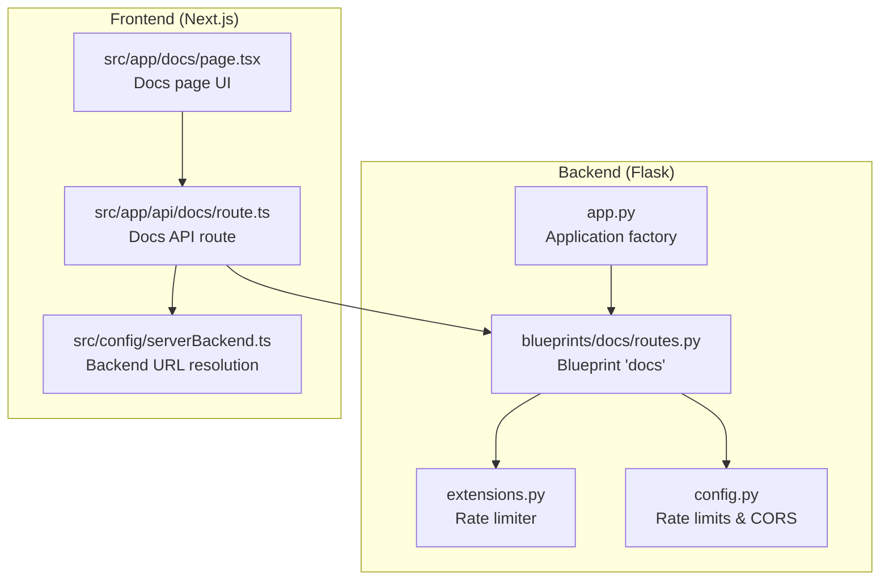
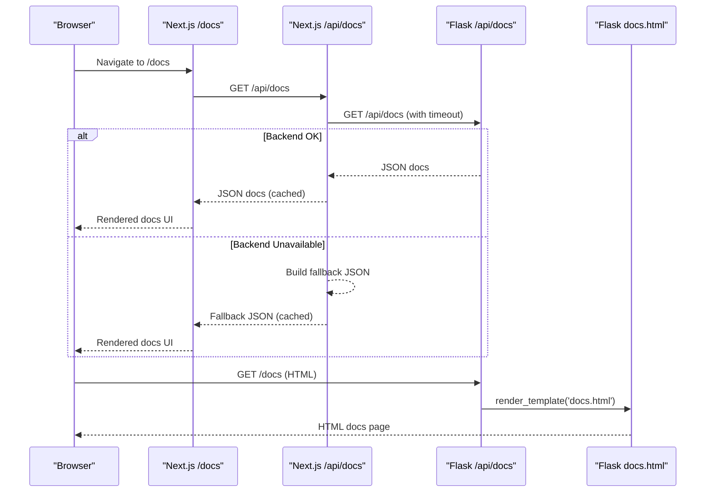
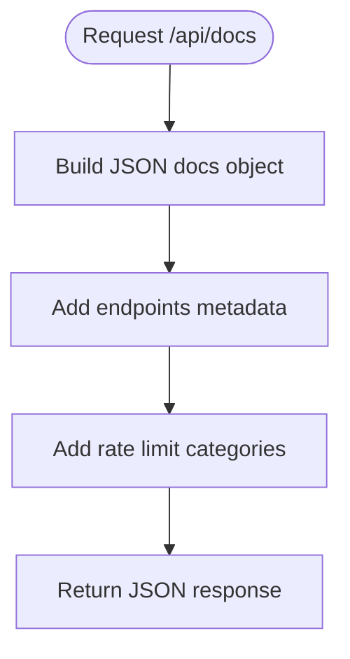
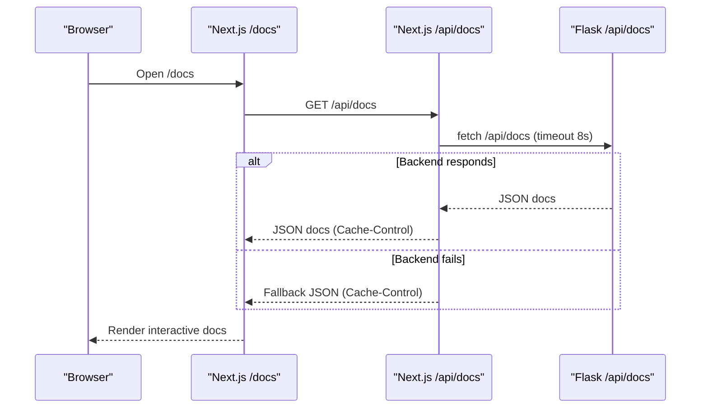
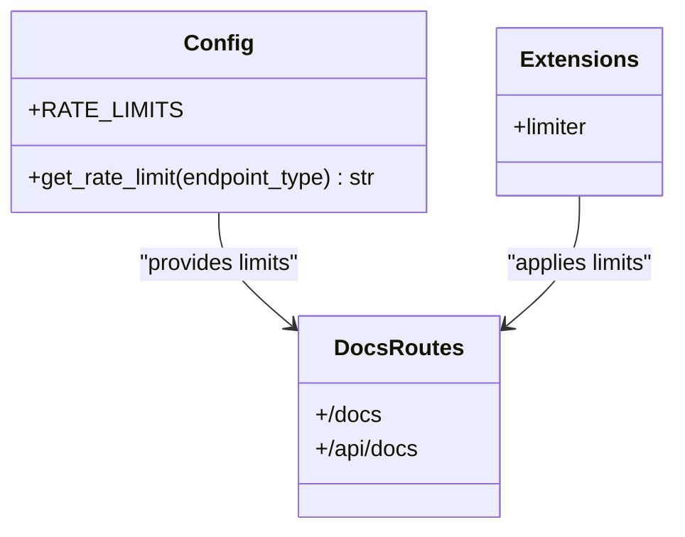
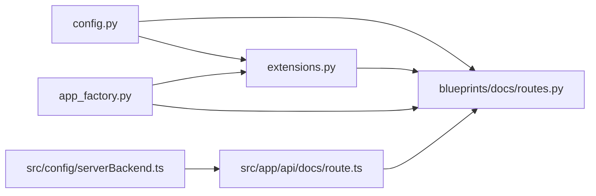

# Docs Blueprint

<cite>
**Referenced Files in This Document**
- [routes.py](file://python_backend/blueprints/docs/routes.py)
- [__init__.py](file://python_backend/blueprints/docs/__init__.py)
- [app_factory.py](file://python_backend/app_factory.py)
- [extensions.py](file://python_backend/extensions.py)
- [config.py](file://python_backend/config.py)
- [app.py](file://python_backend/app.py)
- [route.ts](file://src/app/api/docs/route.ts)
- [page.tsx](file://src/app/docs/page.tsx)
- [serverBackend.ts](file://src/config/serverBackend.ts)
</cite>

## Table of Contents
1. [Introduction](#introduction)
2. [Project Structure](#project-structure)
3. [Core Components](#core-components)
4. [Architecture Overview](#architecture-overview)
5. [Detailed Component Analysis](#detailed-component-analysis)
6. [Dependency Analysis](#dependency-analysis)
7. [Performance Considerations](#performance-considerations)
8. [Troubleshooting Guide](#troubleshooting-guide)
9. [Conclusion](#conclusion)

## Introduction
This document describes the Docs Blueprint service that powers the documentation experience for the ChordMini application. It covers:
- The documentation API endpoint that serves structured API reference data
- The documentation route that renders the interactive developer guide
- The serving mechanism and content delivery patterns
- Integration with the `.qoder` wiki corpus and dynamic content generation
- Examples of documentation access patterns and content structure
- The role of documentation services in developer onboarding and API reference provision

## Project Structure
The Docs Blueprint spans both the Python backend and the Next.js frontend:
- Backend: Flask blueprint exposing `/docs` (HTML renderer) and `/api/docs` (JSON API)
- Frontend: Next.js page (`/docs`) and API route (`/api/docs`) that can proxy or fall back to backend data

**Diagram sources**
- [routes.py:18-22](file://python_backend/blueprints/docs/routes.py#L18-L22)
- [extensions.py:17-58](file://python_backend/extensions.py#L17-L58)
- [config.py:47-60](file://python_backend/config.py#L47-L60)
- [app.py:76-96](file://python_backend/app_factory.py#L76-L96)
- [route.ts:9-37](file://src/app/api/docs/route.ts#L9-L37)
- [page.tsx:80-123](file://src/app/docs/page.tsx#L80-L123)
- [serverBackend.ts:23-25](file://src/config/serverBackend.ts#L23-L25)

**Section sources**
- [routes.py:18-22](file://python_backend/blueprints/docs/routes.py#L18-L22)
- [app_factory.py:76-96](file://python_backend/app_factory.py#L76-L96)
- [route.ts:9-37](file://src/app/api/docs/route.ts#L9-L37)
- [page.tsx:80-123](file://src/app/docs/page.tsx#L80-L123)

## Core Components
- Backend Flask Blueprint
  - `/docs`: Renders the HTML documentation page via a Jinja template
  - `/api/docs`: Returns structured API documentation as JSON, including endpoint definitions, parameters, responses, and rate limits
- Frontend Next.js Integration
  - `/docs`: Interactive documentation page with navigation, examples, and status cards
  - `/api/docs`: Proxies to the backend when available, otherwise falls back to a static JSON document

Key responsibilities:
- Serve structured API reference data for client-side rendering
- Provide a human-friendly documentation UI for developer onboarding
- Enforce rate limits and integrate with CORS configuration
- Offer resilient fallback behavior when the backend is unavailable

**Section sources**
- [routes.py:18-22](file://python_backend/blueprints/docs/routes.py#L18-L22)
- [routes.py:25-296](file://python_backend/blueprints/docs/routes.py#L25-L296)
- [route.ts:9-37](file://src/app/api/docs/route.ts#L9-L37)
- [route.ts:39-207](file://src/app/api/docs/route.ts#L39-L207)
- [page.tsx:80-123](file://src/app/docs/page.tsx#L80-L123)

## Architecture Overview
The documentation system follows a dual-serving pattern:
- Static HTML rendering for the `/docs` route (backend)
- Dynamic JSON API for programmatic consumption (/api/docs)
- Frontend API route that proxies to backend with graceful fallback

**Diagram sources**
- [route.ts:9-37](file://src/app/api/docs/route.ts#L9-L37)
- [route.ts:39-207](file://src/app/api/docs/route.ts#L39-L207)
- [routes.py:18-22](file://python_backend/blueprints/docs/routes.py#L18-L22)

## Detailed Component Analysis

### Backend Flask Docs Blueprint
- Route: `/docs`
  - Renders an HTML template for the documentation page
  - Protected by rate limiting configured per environment
- Route: `/api/docs`
  - Returns a comprehensive JSON schema of endpoints, parameters, responses, and rate limits
  - Includes endpoint summaries, descriptions, and example payloads
  - Provides categorized rate limit policies for different operation types

**Diagram sources**
- [routes.py:25-296](file://python_backend/blueprints/docs/routes.py#L25-L296)

**Section sources**
- [routes.py:18-22](file://python_backend/blueprints/docs/routes.py#L18-L22)
- [routes.py:25-296](file://python_backend/blueprints/docs/routes.py#L25-L296)

### Frontend Next.js Docs Integration
- Page: `/docs`
  - Client-side React page with navigation, feature cards, examples, and status indicators
  - Uses environment-aware backend URL resolution
  - Implements intersection observer for live sidebar highlighting
- API Route: `/api/docs`
  - Attempts to fetch from the backend with a timeout
  - Returns cached JSON with appropriate cache headers
  - Falls back to a static JSON document when the backend is unreachable

**Diagram sources**
- [page.tsx:80-123](file://src/app/docs/page.tsx#L80-L123)
- [route.ts:9-37](file://src/app/api/docs/route.ts#L9-L37)
- [route.ts:39-207](file://src/app/api/docs/route.ts#L39-L207)

**Section sources**
- [page.tsx:80-123](file://src/app/docs/page.tsx#L80-L123)
- [route.ts:9-37](file://src/app/api/docs/route.ts#L9-L37)
- [route.ts:39-207](file://src/app/api/docs/route.ts#L39-L207)

### Rate Limiting and Configuration
- Backend rate limits are defined per environment and endpoint category
- The `/docs` and `/api/docs` endpoints share the "docs" category
- Flask limiter integrates with Redis in production or in-memory storage in development

**Diagram sources**
- [config.py:47-60](file://python_backend/config.py#L47-L60)
- [config.py:99-102](file://python_backend/config.py#L99-L102)
- [extensions.py:17-58](file://python_backend/extensions.py#L17-L58)
- [routes.py:18-22](file://python_backend/blueprints/docs/routes.py#L18-L22)

**Section sources**
- [config.py:47-60](file://python_backend/config.py#L47-L60)
- [config.py:99-102](file://python_backend/config.py#L99-L102)
- [extensions.py:17-58](file://python_backend/extensions.py#L17-L58)
- [routes.py:18-22](file://python_backend/blueprints/docs/routes.py#L18-L22)

### Serving Mechanism and Content Delivery Patterns
- Backend template rendering for HTML docs
- JSON API for programmatic consumption
- Frontend proxy with timeout and caching
- Graceful fallback to static JSON when backend is down
- Environment-aware backend URL resolution

**Section sources**
- [routes.py:18-22](file://python_backend/blueprints/docs/routes.py#L18-L22)
- [route.ts:9-37](file://src/app/api/docs/route.ts#L9-L37)
- [route.ts:39-207](file://src/app/api/docs/route.ts#L39-L207)
- [serverBackend.ts:23-25](file://src/config/serverBackend.ts#L23-L25)

### Integration with Static Wiki Files and Dynamic Content Generation
- Static documentation lives under `.qoder/repowiki/` for long-form wiki content
- Dynamic content generation occurs in the backend `/api/docs` endpoint
- Frontend `/docs` page augments dynamic data with interactive UI elements and examples

## Dependency Analysis
The Docs Blueprint depends on:
- Application factory for blueprint registration
- Extensions for rate limiting and CORS
- Configuration for rate limits and CORS origins
- Frontend configuration for backend URL resolution

**Diagram sources**
- [config.py:47-60](file://python_backend/config.py#L47-L60)
- [extensions.py:17-58](file://python_backend/extensions.py#L17-L58)
- [app_factory.py:76-96](file://python_backend/app_factory.py#L76-L96)
- [routes.py:18-22](file://python_backend/blueprints/docs/routes.py#L18-L22)
- [serverBackend.ts:23-25](file://src/config/serverBackend.ts#L23-L25)
- [route.ts:9-37](file://src/app/api/docs/route.ts#L9-L37)

**Section sources**
- [app_factory.py:76-96](file://python_backend/app_factory.py#L76-L96)
- [extensions.py:17-58](file://python_backend/extensions.py#L17-L58)
- [config.py:47-60](file://python_backend/config.py#L47-L60)
- [routes.py:18-22](file://python_backend/blueprints/docs/routes.py#L18-L22)
- [serverBackend.ts:23-25](file://src/config/serverBackend.ts#L23-L25)
- [route.ts:9-37](file://src/app/api/docs/route.ts#L9-L37)

## Performance Considerations
- Frontend `/api/docs` caches responses with `Cache-Control` headers to reduce backend load
- A timeout is applied when proxying to the backend to prevent hanging requests
- Rate limiting protects backend resources and ensures fair usage across endpoints
- Environment-specific rate limits tune behavior for development, production, and testing

[No sources needed since this section provides general guidance]

## Troubleshooting Guide
Common scenarios and resolutions:
- Backend unavailable
  - The frontend `/api/docs` route falls back to a static JSON document
  - Verify backend connectivity and logs
- Rate limit exceeded
  - The backend enforces rate limits per endpoint category
  - Reduce request frequency or adjust environment configuration
- CORS issues
  - Ensure the frontend origin is included in CORS origins
  - Check configuration loading and environment variables

**Section sources**
- [route.ts:39-207](file://src/app/api/docs/route.ts#L39-L207)
- [config.py:32-46](file://python_backend/config.py#L32-L46)
- [extensions.py:22-38](file://python_backend/extensions.py#L22-L38)

## Conclusion
The Docs Blueprint provides a robust, dual-mode documentation system:
- Human-readable HTML documentation served by the backend
- Machine-readable JSON API documentation consumed by the frontend
- Resilient fallback behavior and environment-aware configuration
This enables effective developer onboarding and comprehensive API reference delivery across environments.
