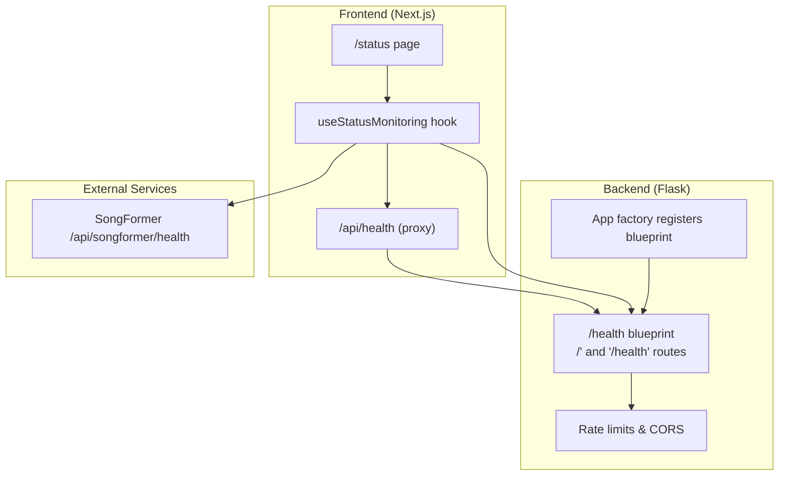
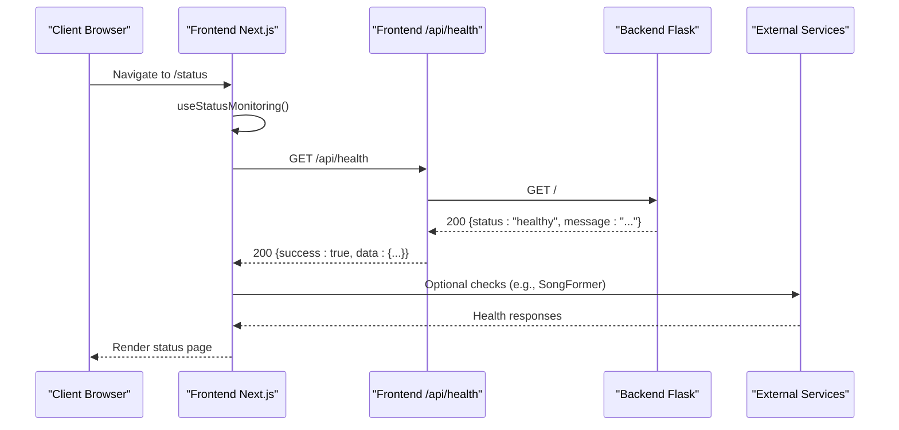
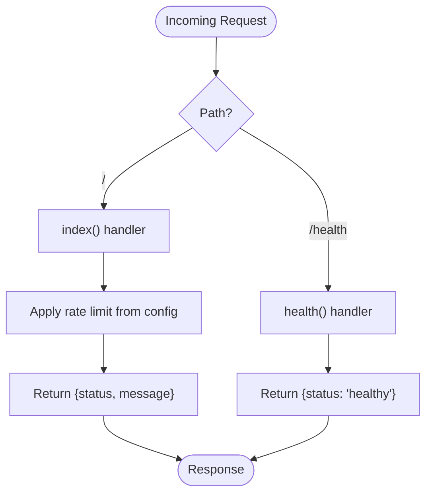
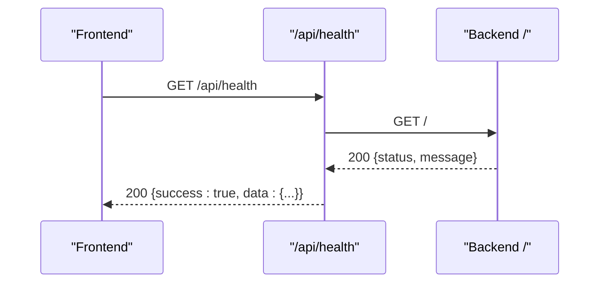
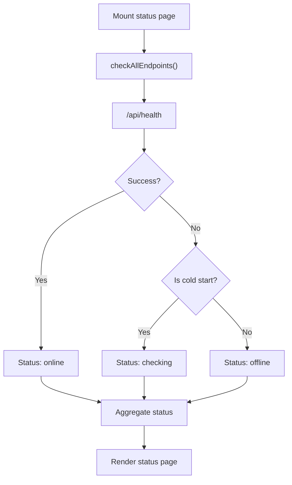
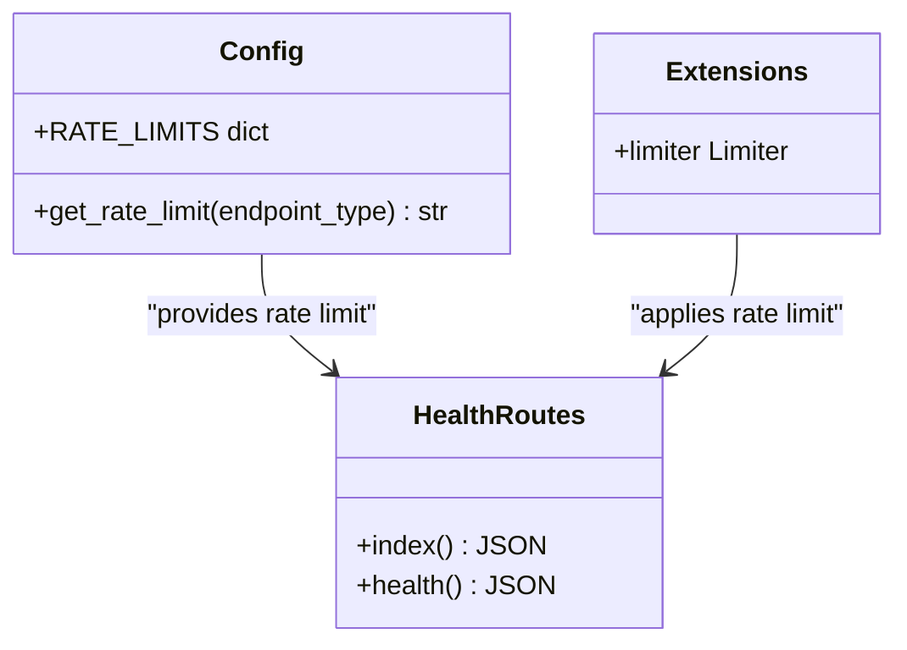
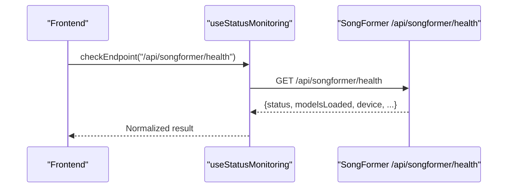

# Health Blueprint

<cite>
**Referenced Files in This Document**
- [routes.py](file://python_backend/blueprints/health/routes.py)
- [__init__.py](file://python_backend/blueprints/health/__init__.py)
- [config.py](file://python_backend/config.py)
- [extensions.py](file://python_backend/extensions.py)
- [app_factory.py](file://python_backend/app_factory.py)
- [route.ts](file://src/app/api/health/route.ts)
- [route.ts](file://src/app/api/status-check/route.ts)
- [useRateLimiting.ts](file://src/hooks/api/useRateLimiting.ts)
- [page.tsx](file://src/app/status/page.tsx)
- [post-deployment-verification.sh](file://scripts/post-deployment-verification.sh)
- [deploy.yml](file://.github/workflows/deploy.yml)
- [app.py](file://SongFormer/app.py)
</cite>

## Table of Contents
1. [Introduction](#introduction)
2. [Project Structure](#project-structure)
3. [Core Components](#core-components)
4. [Architecture Overview](#architecture-overview)
5. [Detailed Component Analysis](#detailed-component-analysis)
6. [Dependency Analysis](#dependency-analysis)
7. [Performance Considerations](#performance-considerations)
8. [Troubleshooting Guide](#troubleshooting-guide)
9. [Conclusion](#conclusion)

## Introduction
This document describes the health blueprint service that provides system monitoring and status reporting for the ChordMini application. It covers the health check API endpoints, implementation details, integration with monitoring systems, and deployment pipeline workflows. The health service ensures reliable operation visibility across frontend, backend, and external services.

## Project Structure
The health blueprint spans both the Python backend and the Next.js frontend:

- Python backend health blueprint: exposes `/` and `/health` endpoints for service availability checks.
- Frontend health proxy: provides a CORS-friendly health route that proxies to the backend.
- Status page and monitoring hooks: orchestrate endpoint checks and present system status.
- Deployment verification: validates health during post-deployment checks.

**Diagram sources**
- [routes.py:18-31](file://python_backend/blueprints/health/routes.py#L18-L31)
- [__init__.py:8-10](file://python_backend/blueprints/health/__init__.py#L8-L10)
- [config.py:47-60](file://python_backend/config.py#L47-L60)
- [app_factory.py:76-96](file://python_backend/app_factory.py#L76-L96)
- [route.ts:11-57](file://src/app/api/health/route.ts#L11-L57)
- [page.tsx:35-63](file://src/app/status/page.tsx#L35-L63)
- [useRateLimiting.ts:149-289](file://src/hooks/api/useRateLimiting.ts#L149-L289)
- [app.py:562-579](file://SongFormer/app.py#L562-L579)

**Section sources**
- [routes.py:1-31](file://python_backend/blueprints/health/routes.py#L1-L31)
- [__init__.py:1-10](file://python_backend/blueprints/health/__init__.py#L1-L10)
- [config.py:47-60](file://python_backend/config.py#L47-L60)
- [app_factory.py:76-96](file://python_backend/app_factory.py#L76-L96)
- [route.ts:1-57](file://src/app/api/health/route.ts#L1-L57)
- [page.tsx:35-63](file://src/app/status/page.tsx#L35-L63)
- [useRateLimiting.ts:149-289](file://src/hooks/api/useRateLimiting.ts#L149-L289)
- [app.py:562-579](file://SongFormer/app.py#L562-L579)

## Core Components
- Health blueprint routes: define two endpoints for health checks:
  - Root route (`/`) returns a friendly message and healthy status.
  - Dedicated health route (`/health`) returns a minimal healthy status for load balancers and health probes.
- Rate limiting: the root route applies a configurable rate limit tailored for health checks.
- Frontend proxy: a Next.js API route proxies health checks to the backend to avoid CORS issues.
- Status monitoring: a React hook and status page coordinate endpoint checks and display system status.

**Section sources**
- [routes.py:18-31](file://python_backend/blueprints/health/routes.py#L18-L31)
- [config.py:52-60](file://python_backend/config.py#L52-L60)
- [route.ts:11-57](file://src/app/api/health/route.ts#L11-L57)
- [useRateLimiting.ts:149-289](file://src/hooks/api/useRateLimiting.ts#L149-L289)
- [page.tsx:35-63](file://src/app/status/page.tsx#L35-L63)

## Architecture Overview
The health architecture integrates frontend and backend components to provide robust monitoring:

**Diagram sources**
- [route.ts:11-57](file://src/app/api/health/route.ts#L11-L57)
- [routes.py:18-25](file://python_backend/blueprints/health/routes.py#L18-L25)
- [useRateLimiting.ts:149-289](file://src/hooks/api/useRateLimiting.ts#L149-L289)
- [page.tsx:35-63](file://src/app/status/page.tsx#L35-L63)
- [app.py:562-579](file://SongFormer/app.py#L562-L579)

## Detailed Component Analysis

### Health Blueprint Routes
The health blueprint defines two endpoints:
- Root route (`/`): returns a structured JSON with status and a friendly message; rate-limited via configuration.
- Health route (`/health`): returns a minimal healthy status suitable for load balancers and health probes.

Implementation highlights:
- Uses Flask Blueprint registration and rate limiting integration.
- Centralized rate limit configuration allows tuning per environment.

**Diagram sources**
- [routes.py:18-31](file://python_backend/blueprints/health/routes.py#L18-L31)
- [config.py:52-60](file://python_backend/config.py#L52-L60)

**Section sources**
- [routes.py:18-31](file://python_backend/blueprints/health/routes.py#L18-L31)
- [config.py:52-60](file://python_backend/config.py#L52-L60)

### Frontend Health Proxy
The frontend provides a proxy route that:
- Calls the backend health endpoint (`/`) with a generous timeout to accommodate cold starts.
- Returns a normalized response indicating success and status.
- Avoids CORS issues by routing through the frontend.

**Diagram sources**
- [route.ts:11-57](file://src/app/api/health/route.ts#L11-L57)
- [routes.py:18-25](file://python_backend/blueprints/health/routes.py#L18-L25)

**Section sources**
- [route.ts:11-57](file://src/app/api/health/route.ts#L11-L57)

### Status Monitoring and Status Page
The status page and monitoring hook:
- Periodically check key endpoints, including the frontend health proxy and backend health.
- Normalize responses and classify status as online/offline/checking.
- Display overall system status and individual endpoint details.

**Diagram sources**
- [page.tsx:35-63](file://src/app/status/page.tsx#L35-L63)
- [useRateLimiting.ts:149-289](file://src/hooks/api/useRateLimiting.ts#L149-L289)

**Section sources**
- [page.tsx:35-63](file://src/app/status/page.tsx#L35-L63)
- [useRateLimiting.ts:149-289](file://src/hooks/api/useRateLimiting.ts#L149-L289)

### Rate Limiting and Configuration
- Rate limits are centrally configured per endpoint type, including a dedicated health limit.
- The backend applies rate limiting to the root health route using Flask-Limiter.
- Configuration adapts per environment (development, production, testing).

**Diagram sources**
- [config.py:52-60](file://python_backend/config.py#L52-L60)
- [extensions.py:41-58](file://python_backend/extensions.py#L41-L58)
- [routes.py:18-25](file://python_backend/blueprints/health/routes.py#L18-L25)

**Section sources**
- [config.py:52-60](file://python_backend/config.py#L52-L60)
- [extensions.py:41-58](file://python_backend/extensions.py#L41-L58)
- [routes.py:18-25](file://python_backend/blueprints/health/routes.py#L18-L25)

### External Service Health Integration
The system can check external services (e.g., SongFormer) as part of the status workflow. The SongFormer health endpoint returns model availability and runtime information, enabling comprehensive monitoring.

**Diagram sources**
- [useRateLimiting.ts:149-289](file://src/hooks/api/useRateLimiting.ts#L149-L289)
- [app.py:562-579](file://SongFormer/app.py#L562-L579)

**Section sources**
- [app.py:562-579](file://SongFormer/app.py#L562-L579)
- [useRateLimiting.ts:149-289](file://src/hooks/api/useRateLimiting.ts#L149-L289)

## Dependency Analysis
The health blueprint integrates with configuration, extensions, and application factory:

**Diagram sources**
- [config.py:47-60](file://python_backend/config.py#L47-L60)
- [extensions.py:41-58](file://python_backend/extensions.py#L41-L58)
- [app_factory.py:76-96](file://python_backend/app_factory.py#L76-L96)
- [__init__.py:8-10](file://python_backend/blueprints/health/__init__.py#L8-L10)
- [routes.py:18-31](file://python_backend/blueprints/health/routes.py#L18-L31)
- [route.ts:11-57](file://src/app/api/health/route.ts#L11-L57)
- [page.tsx:35-63](file://src/app/status/page.tsx#L35-L63)

**Section sources**
- [config.py:47-60](file://python_backend/config.py#L47-L60)
- [extensions.py:41-58](file://python_backend/extensions.py#L41-L58)
- [app_factory.py:76-96](file://python_backend/app_factory.py#L76-L96)
- [__init__.py:8-10](file://python_backend/blueprints/health/__init__.py#L8-L10)
- [routes.py:18-31](file://python_backend/blueprints/health/routes.py#L18-L31)
- [route.ts:11-57](file://src/app/api/health/route.ts#L11-L57)
- [page.tsx:35-63](file://src/app/status/page.tsx#L35-L63)

## Performance Considerations
- Health endpoints should remain lightweight to minimize overhead.
- Frontend proxy uses a generous timeout to account for cold starts in serverless environments.
- Rate limiting prevents abuse while allowing sufficient checks for monitoring.
- Status page checks can be throttled to reduce load on external services.

[No sources needed since this section provides general guidance]

## Troubleshooting Guide
Common scenarios and resolutions:
- Backend cold start: Initial requests may return transient errors; subsequent checks often succeed.
- CORS issues: Use the frontend proxy route to avoid cross-origin restrictions.
- External service unavailability: The status page distinguishes cold starts from persistent failures.
- Rate limiting: If health checks are blocked, review rate limit configuration for the health endpoint.

**Section sources**
- [post-deployment-verification.sh:154-167](file://scripts/post-deployment-verification.sh#L154-L167)
- [route.ts:45-56](file://src/app/api/health/route.ts#L45-L56)
- [useRateLimiting.ts:149-289](file://src/hooks/api/useRateLimiting.ts#L149-L289)
- [config.py:52-60](file://python_backend/config.py#L52-L60)

## Conclusion
The health blueprint provides a simple yet effective foundation for system monitoring and status reporting. By combining backend health endpoints, a frontend proxy, and a comprehensive status page, the system enables reliable monitoring across frontend, backend, and external services. The design accommodates serverless cold starts, integrates with deployment pipelines, and supports service discovery through health checks.