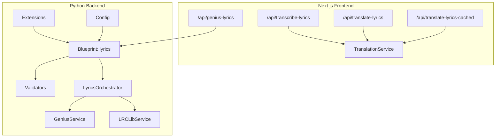
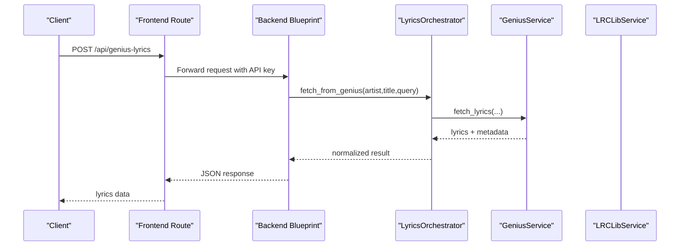
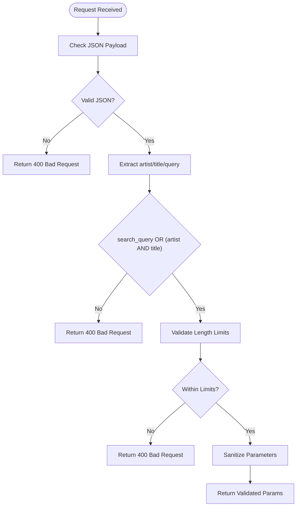
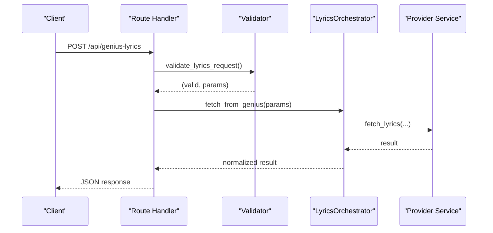
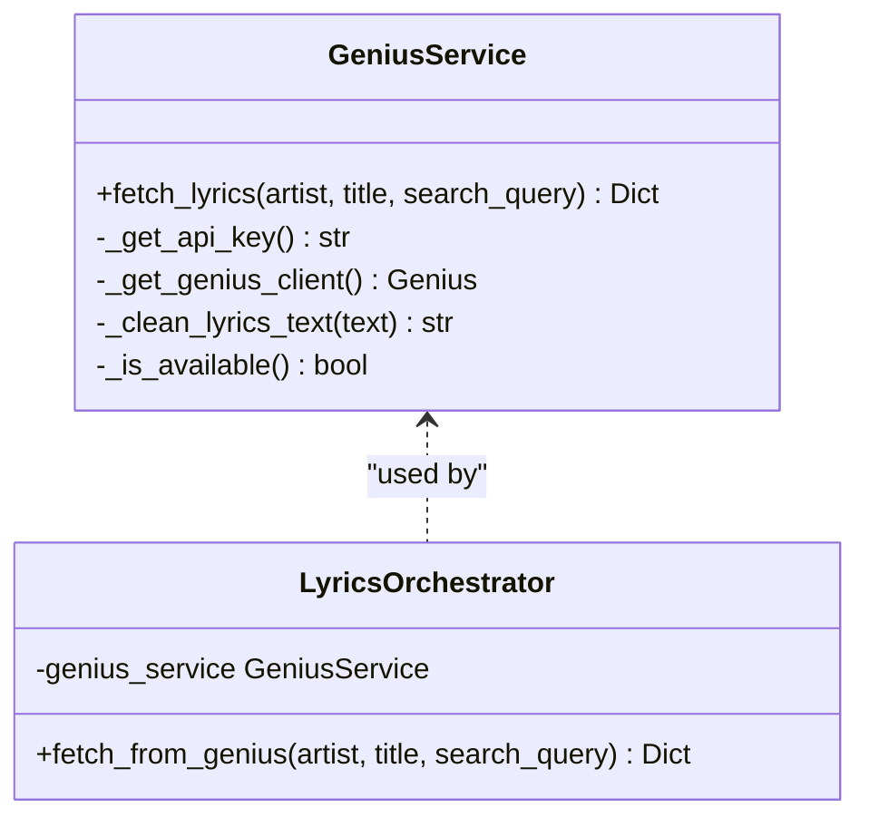
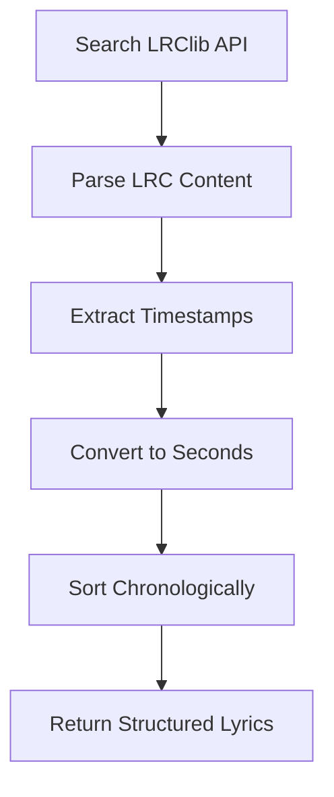
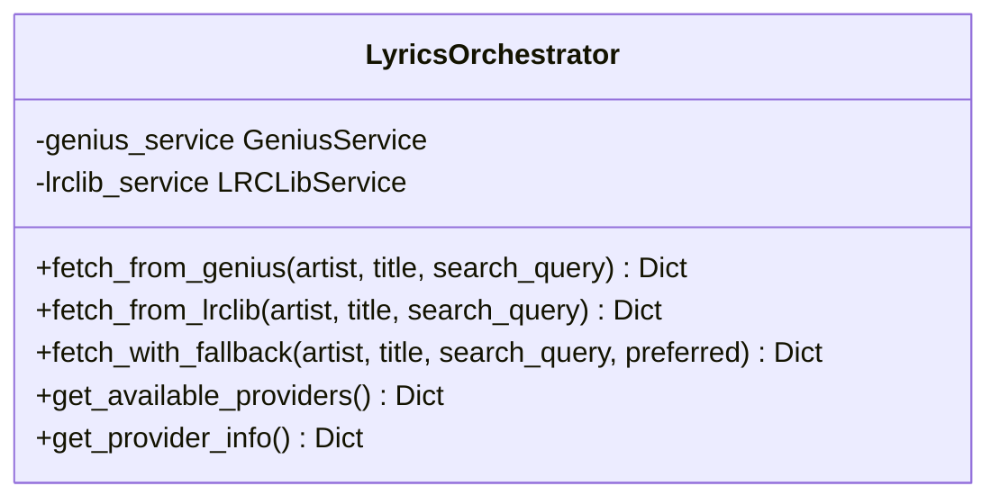
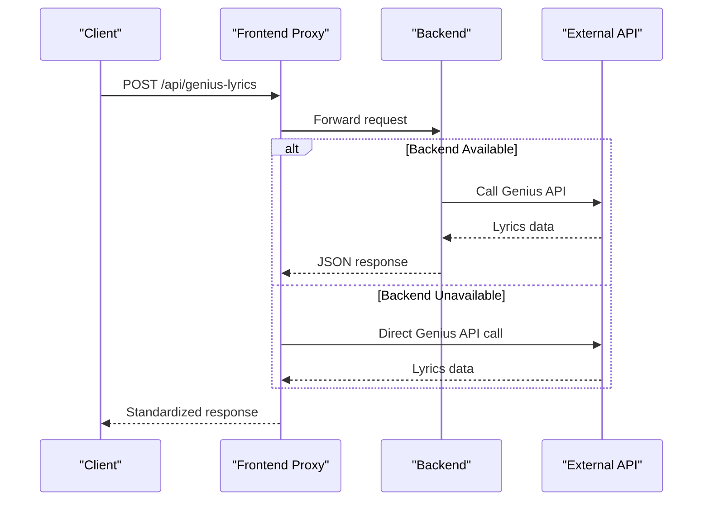
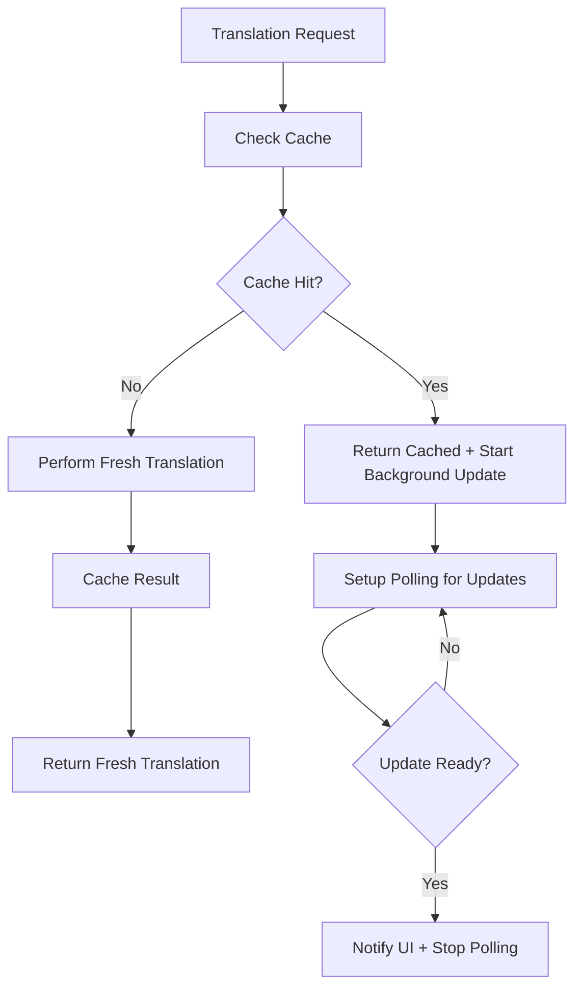
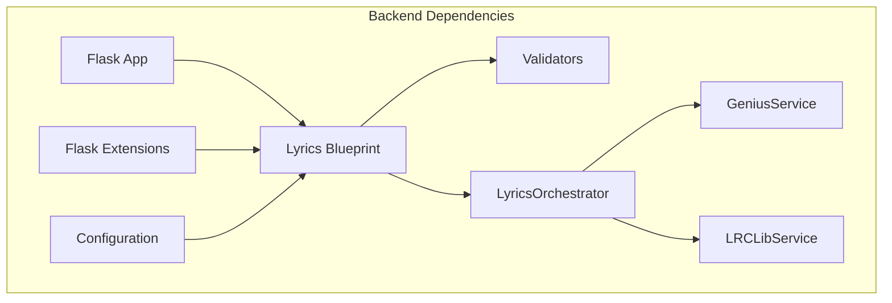

# Lyrics Blueprint

<cite>
**Referenced Files in This Document**
- [routes.py](file://python_backend/blueprints/lyrics/routes.py)
- [validators.py](file://python_backend/blueprints/lyrics/validators.py)
- [orchestrator.py](file://python_backend/services/lyrics/orchestrator.py)
- [genius_service.py](file://python_backend/services/lyrics/genius_service.py)
- [lrclib_service.py](file://python_backend/services/lyrics/lrclib_service.py)
- [app_factory.py](file://python_backend/app_factory.py)
- [extensions.py](file://python_backend/extensions.py)
- [config.py](file://python_backend/config.py)
- [route.ts](file://src/app/api/genius-lyrics/route.ts)
- [route.ts](file://src/app/api/transcribe-lyrics/route.ts)
- [route.ts](file://src/app/api/translate-lyrics/route.ts)
- [route.ts](file://src/app/api/translate-lyrics-cached/route.ts)
- [translationService.ts](file://src/services/lyrics/translationService.ts)
</cite>

## Table of Contents
1. [Introduction](#introduction)
2. [Project Structure](#project-structure)
3. [Core Components](#core-components)
4. [Architecture Overview](#architecture-overview)
5. [Detailed Component Analysis](#detailed-component-analysis)
6. [Dependency Analysis](#dependency-analysis)
7. [Performance Considerations](#performance-considerations)
8. [Troubleshooting Guide](#troubleshooting-guide)
9. [Conclusion](#conclusion)

## Introduction
This document provides comprehensive documentation for the lyrics blueprint service in the ChordMini application. It covers the lyrics API endpoints for Genius, LRClib, transcription, and translation, along with request validation patterns, route handler implementations, orchestration strategies, and error handling mechanisms. The documentation explains how the system integrates multiple lyrics sources, handles synchronization requirements, and provides robust fallbacks when providers are unavailable.

## Project Structure
The lyrics functionality spans both the Python backend and the Next.js frontend:

- Python backend:
  - Blueprints define Flask routes for lyrics endpoints
  - Validators enforce request parameter constraints
  - Services encapsulate provider integrations (Genius, LRClib)
  - Orchestrator coordinates multi-source retrieval and fallback strategies
  - Extensions and configuration manage rate limiting and CORS

- Frontend:
  - Next.js API routes act as proxies to backend services
  - Genius has a dedicated Next.js proxy route; LRClib is currently exposed by the Flask lyrics blueprint rather than a dedicated `src/app/api/lrclib-lyrics` route
  - Translation service implements cache-first strategy with background updates
  - Additional routes support transcription and translation workflows

**Diagram sources**
- [routes.py:1-126](file://python_backend/blueprints/lyrics/routes.py#L1-L126)
- [validators.py:1-146](file://python_backend/blueprints/lyrics/validators.py#L1-L146)
- [orchestrator.py:1-184](file://python_backend/services/lyrics/orchestrator.py#L1-L184)
- [genius_service.py:1-215](file://python_backend/services/lyrics/genius_service.py#L1-L215)
- [lrclib_service.py:1-172](file://python_backend/services/lyrics/lrclib_service.py#L1-L172)
- [extensions.py:1-93](file://python_backend/extensions.py#L1-L93)
- [config.py:1-215](file://python_backend/config.py#L1-L215)
- [route.ts:1-148](file://src/app/api/genius-lyrics/route.ts#L1-L148)
- [route.ts:1-342](file://src/app/api/transcribe-lyrics/route.ts#L1-L342)
- [route.ts:1-406](file://src/app/api/translate-lyrics/route.ts#L1-L406)
- [route.ts:1-490](file://src/app/api/translate-lyrics-cached/route.ts#L1-L490)
- [translationService.ts:1-255](file://src/services/lyrics/translationService.ts#L1-L255)

**Section sources**
- [routes.py:1-126](file://python_backend/blueprints/lyrics/routes.py#L1-L126)
- [validators.py:1-146](file://python_backend/blueprints/lyrics/validators.py#L1-L146)
- [orchestrator.py:1-184](file://python_backend/services/lyrics/orchestrator.py#L1-L184)
- [genius_service.py:1-215](file://python_backend/services/lyrics/genius_service.py#L1-L215)
- [lrclib_service.py:1-172](file://python_backend/services/lyrics/lrclib_service.py#L1-L172)
- [extensions.py:1-93](file://python_backend/extensions.py#L1-L93)
- [config.py:1-215](file://python_backend/config.py#L1-L215)
- [route.ts:1-148](file://src/app/api/genius-lyrics/route.ts#L1-L148)
- [route.ts:1-342](file://src/app/api/transcribe-lyrics/route.ts#L1-L342)
- [route.ts:1-406](file://src/app/api/translate-lyrics/route.ts#L1-L406)
- [route.ts:1-490](file://src/app/api/translate-lyrics-cached/route.ts#L1-L490)
- [translationService.ts:1-255](file://src/services/lyrics/translationService.ts#L1-L255)

## Core Components
This section outlines the primary components involved in the lyrics service:

- Flask Lyrics Blueprint: Defines endpoints for Genius and LRClib lyrics retrieval
- Validators: Enforce request parameter validation and sanitization
- Lyrics Orchestrator: Coordinates provider calls and implements fallback strategies
- Genius Service: Integrates with Genius.com API using lyricsgenius
- LRCLib Service: Fetches synchronized lyrics from LRClib.net API
- Frontend Routes: Proxy endpoint for Genius, plus transcription and translation APIs
- Translation Service: Implements cache-first strategy with background updates

**Section sources**
- [routes.py:1-126](file://python_backend/blueprints/lyrics/routes.py#L1-L126)
- [validators.py:1-146](file://python_backend/blueprints/lyrics/validators.py#L1-L146)
- [orchestrator.py:1-184](file://python_backend/services/lyrics/orchestrator.py#L1-L184)
- [genius_service.py:1-215](file://python_backend/services/lyrics/genius_service.py#L1-L215)
- [lrclib_service.py:1-172](file://python_backend/services/lyrics/lrclib_service.py#L1-L172)
- [route.ts:1-148](file://src/app/api/genius-lyrics/route.ts#L1-L148)
- [route.ts:1-342](file://src/app/api/transcribe-lyrics/route.ts#L1-L342)
- [route.ts:1-406](file://src/app/api/translate-lyrics/route.ts#L1-L406)
- [route.ts:1-490](file://src/app/api/translate-lyrics-cached/route.ts#L1-L490)
- [translationService.ts:1-255](file://src/services/lyrics/translationService.ts#L1-L255)

## Architecture Overview
The lyrics architecture combines backend and frontend layers with clear separation of concerns:

- Backend:
  - Flask blueprint exposes endpoints for lyrics retrieval
  - Validators ensure request correctness
  - Orchestrator manages provider selection and fallback
  - Services encapsulate provider-specific logic

- Frontend:
  - Next.js API routes act as proxies to backend
  - Implement fallback to direct provider APIs when backend is unavailable
  - Translation service provides cache-first behavior with background updates

**Diagram sources**
- [routes.py:22-72](file://python_backend/blueprints/lyrics/routes.py#L22-L72)
- [orchestrator.py:33-62](file://python_backend/services/lyrics/orchestrator.py#L33-L62)
- [genius_service.py:135-214](file://python_backend/services/lyrics/genius_service.py#L135-L214)
- [route.ts:51-77](file://src/app/api/genius-lyrics/route.ts#L51-L77)

**Section sources**
- [routes.py:1-126](file://python_backend/blueprints/lyrics/routes.py#L1-L126)
- [orchestrator.py:1-184](file://python_backend/services/lyrics/orchestrator.py#L1-L184)
- [genius_service.py:1-215](file://python_backend/services/lyrics/genius_service.py#L1-L215)
- [route.ts:1-148](file://src/app/api/genius-lyrics/route.ts#L1-L148)

## Detailed Component Analysis

### Request Validation Patterns
The validation layer ensures robust input handling across all lyrics endpoints:

- Parameter validation:
  - Requires either search_query or both artist and title
  - Enforces maximum length constraints (500 for search_query, 200 for artist/title)
  - Validates JSON payload presence and structure

- Provider validation:
  - Validates Genius API key format and presence
  - Sanitizes search parameters for API calls
  - Supports provider name validation and display mapping

**Diagram sources**
- [validators.py:12-58](file://python_backend/blueprints/lyrics/validators.py#L12-L58)

**Section sources**
- [validators.py:1-146](file://python_backend/blueprints/lyrics/validators.py#L1-L146)

### Route Handler Implementations
The Flask blueprint defines two primary endpoints for lyrics retrieval:

- Genius Lyrics Endpoint:
  - POST /api/genius-lyrics
  - Validates request parameters
  - Retrieves Genius API key from headers or environment
  - Calls LyricsOrchestrator to fetch lyrics
  - Returns standardized JSON response with success/error status

- LRClib Lyrics Endpoint:
  - POST /api/lrclib-lyrics
  - Validates request parameters
  - Uses LyricsOrchestrator to fetch synchronized lyrics
  - Returns lyrics with timing data when available

**Diagram sources**
- [routes.py:22-72](file://python_backend/blueprints/lyrics/routes.py#L22-L72)
- [orchestrator.py:33-62](file://python_backend/services/lyrics/orchestrator.py#L33-L62)

**Section sources**
- [routes.py:1-126](file://python_backend/blueprints/lyrics/routes.py#L1-L126)
- [orchestrator.py:1-184](file://python_backend/services/lyrics/orchestrator.py#L1-L184)

### Genius API Integration
The Genius service provides comprehensive lyrics retrieval with metadata:

- Authentication:
  - Supports API key from request header (X-Genius-API-Key)
  - Falls back to environment variable (GENIUS_API_KEY)
  - Validates availability of lyricsgenius library

- Search capabilities:
  - Supports custom search queries
  - Uses artist/title pairs when search_query is not provided
  - Applies filters to skip non-song results and remix/live versions

- Response normalization:
  - Cleans lyrics text and removes artifacts
  - Extracts metadata (title, artist, album, release date, URLs)
  - Provides standardized JSON response structure

**Diagram sources**
- [genius_service.py:14-215](file://python_backend/services/lyrics/genius_service.py#L14-L215)
- [orchestrator.py:33-62](file://python_backend/services/lyrics/orchestrator.py#L33-L62)

**Section sources**
- [genius_service.py:1-215](file://python_backend/services/lyrics/genius_service.py#L1-L215)
- [orchestrator.py:1-184](file://python_backend/services/lyrics/orchestrator.py#L1-L184)

### LRClib Synchronization
The LRClib service specializes in synchronized lyrics:

- API integration:
  - Searches using artist/title or general query
  - Parses LRC format timestamps into structured data
  - Handles both synchronized and plain lyrics

- Timing data processing:
  - Converts [mm:ss.xx] format to seconds
  - Sorts lyrics chronologically
  - Provides metadata including duration and instrumental flag

**Diagram sources**
- [lrclib_service.py:28-74](file://python_backend/services/lyrics/lrclib_service.py#L28-L74)

**Section sources**
- [lrclib_service.py:1-172](file://python_backend/services/lyrics/lrclib_service.py#L1-L172)

### Lyrics Orchestration Service
The orchestrator coordinates between multiple providers with fallback strategies:

- Multi-source retrieval:
  - Supports Genius and LRClib providers
  - Implements configurable preferred provider
  - Normalizes provider responses to unified format

- Fallback mechanism:
  - Attempts preferred provider first
  - Falls back to alternative providers on failure
  - Aggregates error information for debugging

- Provider availability:
  - Checks Genius service availability (library and API key)
  - LRClib availability is always considered available
  - Provides provider information for client-side decisions

**Diagram sources**
- [orchestrator.py:14-184](file://python_backend/services/lyrics/orchestrator.py#L14-L184)

**Section sources**
- [orchestrator.py:1-184](file://python_backend/services/lyrics/orchestrator.py#L1-L184)

### Frontend Integration and Fallbacks
The frontend implements proxy routes with intelligent fallbacks:

- Genius Lyrics Proxy:
  - Attempts backend first, falls back to direct Genius API
  - Validates environment configuration
  - Returns standardized response format

- LRClib Lyrics Proxy:
  - Direct API integration with timeout handling
  - Returns synchronized lyrics when available

- Translation Workflow:
  - Cache-first approach with background updates
  - Comprehensive error handling and retry logic
  - Supports user-provided API keys

**Diagram sources**
- [route.ts:51-77](file://src/app/api/genius-lyrics/route.ts#L51-L77)

**Section sources**
- [route.ts:1-148](file://src/app/api/genius-lyrics/route.ts#L1-L148)
- [route.ts:1-342](file://src/app/api/transcribe-lyrics/route.ts#L1-L342)
- [route.ts:1-406](file://src/app/api/translate-lyrics/route.ts#L1-L406)
- [route.ts:1-490](file://src/app/api/translate-lyrics-cached/route.ts#L1-L490)
- [translationService.ts:1-255](file://src/services/lyrics/translationService.ts#L1-L255)

### Translation Services
The translation system implements sophisticated caching and background update strategies:

- Cache-first approach:
  - Immediately returns cached translations when available
  - Triggers background updates for freshness
  - Provides real-time updates via polling

- Language detection:
  - Automatic detection for Chinese characters
  - Gemini API integration for language identification
  - Specialized prompts for different language pairs

- Response cleaning:
  - Removes common prefixes and artifacts
  - Preserves vocal expressions and formatting
  - Maintains line-by-line structure

**Diagram sources**
- [route.ts:389-417](file://src/app/api/translate-lyrics-cached/route.ts#L389-L417)
- [translationService.ts:118-186](file://src/services/lyrics/translationService.ts#L118-L186)

**Section sources**
- [route.ts:1-406](file://src/app/api/translate-lyrics/route.ts#L1-L406)
- [route.ts:1-490](file://src/app/api/translate-lyrics-cached/route.ts#L1-L490)
- [translationService.ts:1-255](file://src/services/lyrics/translationService.ts#L1-L255)

## Dependency Analysis
The lyrics service exhibits clear dependency relationships:

- Backend dependencies:
  - Flask blueprint depends on validators and orchestrator
  - Orchestrator depends on provider services
  - Extensions provide rate limiting and CORS
  - Configuration controls rate limits and timeouts

- Frontend dependencies:
  - Next.js routes depend on translation service
  - Translation service uses Gemini client and Firebase
  - All components use standardized response formats

**Diagram sources**
- [app_factory.py:103-161](file://python_backend/app_factory.py#L103-L161)
- [routes.py:1-126](file://python_backend/blueprints/lyrics/routes.py#L1-L126)
- [extensions.py:81-93](file://python_backend/extensions.py#L81-L93)
- [config.py:47-103](file://python_backend/config.py#L47-L103)

**Section sources**
- [app_factory.py:1-162](file://python_backend/app_factory.py#L1-L162)
- [extensions.py:1-93](file://python_backend/extensions.py#L1-L93)
- [config.py:1-215](file://python_backend/config.py#L1-L215)

## Performance Considerations
The lyrics service incorporates several performance optimizations:

- Rate limiting:
  - Moderate processing endpoints limited to 10 per minute
  - Heavy processing limited to 2 per minute
  - Configurable via environment variables

- Timeout management:
  - External API timeouts set to 30 seconds
  - Frontend proxies use 15-second timeouts for backend
  - LRClib service uses 10-second timeouts

- Caching strategies:
  - Translation service implements cache-first with background updates
  - Firestore caching reduces repeated API calls
  - Polling with exponential backoff prevents excessive requests

- Memory management:
  - Service initialization with error handling
  - Graceful degradation when services are unavailable
  - Minimal memory footprint for validation functions

## Troubleshooting Guide
Common issues and their resolutions:

- Genius API key errors:
  - Verify GENIUS_API_KEY environment variable is set
  - Check API key format and validity
  - Ensure lyricsgenius library is installed

- Backend unavailability:
  - Frontend routes automatically fall back to direct API calls
  - Check network connectivity to external APIs
  - Monitor service health endpoints

- Translation failures:
  - Verify Gemini API key configuration
  - Check Firestore connectivity for caching
  - Review language detection accuracy

- Rate limiting:
  - Adjust RATE_LIMITS environment variables
  - Monitor request patterns and adjust accordingly
  - Consider Redis for distributed rate limiting

**Section sources**
- [genius_service.py:28-87](file://python_backend/services/lyrics/genius_service.py#L28-L87)
- [route.ts:40-49](file://src/app/api/genius-lyrics/route.ts#L40-L49)
- [route.ts:315-324](file://src/app/api/translate-lyrics/route.ts#L315-L324)
- [config.py:47-103](file://python_backend/config.py#L47-L103)

## Conclusion
The lyrics blueprint service provides a robust, multi-provider solution for lyrics retrieval and translation. Its architecture balances reliability through fallback mechanisms, performance through caching and rate limiting, and flexibility through modular service design. The integration of backend and frontend components ensures comprehensive coverage of lyrics sources while maintaining consistent user experiences across different providers and use cases.
